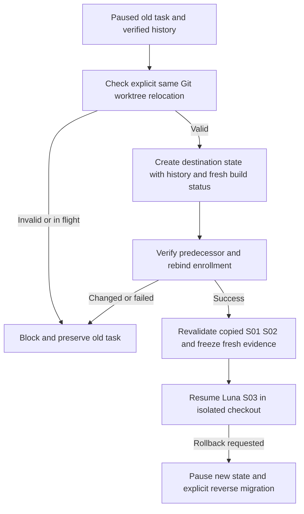

# Same-repository isolation continuation

Owner: Astra architecture; Luna xhigh implementation/tests. Status: PLAN READY for isolated controller vendor work only. This is an operations addendum to the canonical documents 12–16, not a replacement product blueprint.

## Baseline and outcome
The old repair checkout has concurrent unknown writers, including the admitted search files. Sean confirmed nine agents may be active. S01 and S02 are tested; S03 has no Luna writes. The controller is paused with eight calls consumed, cap twelve, final Astra review pending. Installed schema 4 requires identical real repoRoot and cannot enroll a same-repository sibling worktree. Isolation must preserve that history rather than reset the task.

## Requirements and acceptance
R1: Opt-in migration between two real Git worktrees of the same Git common directory and same task/session; verify live Git identities, distinct canonical directories, and a hash-bound predecessor. Cross-repository paths, aliases masquerading as worktrees, changed predecessor, in-flight execution and omitted opt-in fail closed.
R2: Preserve exact predecessor bytes, all calls/events/authorization, existing source scope and plan scope. The predecessor remains paused and immutable. Destination states never inherit a tested/approved claim merely because files were copied; ordinary existing migration reset/re-freeze behavior remains valid. No historical review or test counts are invented.
R3: Permit only the predecessor state to be read outside destination root through the explicit relocation proof. All ordinary evidence and source writes remain confined. Copy historical evidence into destination root using identical relative names and verified bytes; retain original copies and paths for history.
R4: Native enrollment replacement must bind the exact previously enrolled stateFile and its current SHA, task/session, old/new Git worktree identities and same common directory. Preserve previousEnrollment. Old directory must no longer be writable via the newly enrolled task. Other sessions and default schema 3 behavior are unchanged.
R5: Migration CLI check performs no writes. Installing this repair never resets enrollment or policy, dispatches providers, spends credits, edits application code, or relaxes source guards. Expose precise validation errors and document rollback.

## Blueprint and contracts
Extend existing schema-4 migrate with an explicit relocation object, not a new task initializer. Luna may select precise field names, documented and covered by tests. Proof includes canonical sourceRoot, destinationRoot, Git common directory, exact original predecessor state path/hash and a reason. Bind proof into contractHash and revalidate on load. Use actual git worktree metadata/CLI with safe argument arrays; do not accept user strings as identity proof. Existing same-root migration remains compatible. Ordinary predecessor references remain confined unless the validated relocation branch is selected.

Scope: new isolated vendor copy under tmp/workflow-isolation-20260913/vendor; workflow-override.mjs, workflow-override-evidence.mjs, workflow-hook.mjs, and at most one narrowly focused shared relocation helper; tests and references/workflow-usage.md. Changes to workflow.mjs only if the existing CLI requires it. No application edits or installed-skill writes during vendor development. Root reviews tested diff before installation.

## Flow and state

Mermaid source supplied; rendered preview not yet produced for this small headless operations addendum. Wireframes/responsive/a11y/ERD are N/A: no UI or application database change. State transitions and trust boundary are specified above. Permissions: root reviews/installs, Luna builds/tests vendor, controller validates identity/history, application builders remain paused until destination admission.

## Tests and traceability
R1 -> real disposable local Git repo plus two worktrees: valid migration PASS; unrelated repo, fabricated root, opt-in omitted, changed predecessor and in-flight state DENY. Observe valid-path RED on installed code before patch, excluding spawn/import setup failures.
R2 -> assertions of identical predecessor bytes, events and eight calls/cap twelve; scope dropping DENY; migrated slices require fresh build/test evidence; tamper proof/events/counters then rehash still DENY.
R3 -> ordinary outside-root evidence and alias writes DENY; original predecessor exception only; altered copied historical evidence DENY.
R4 -> isolated temporary enrollment registry: exact old record successfully replaced and previousEnrollment retained; mismatched session/task/hash/statefile/common-dir DENY; new source scope allowed and old source writes denied.
R5 -> CLI --check no-write assertion; existing schema 3, schema 4, native guard, compatibility and historical-accounting suites remain GREEN. Native tests use temporary registries, never the real enrollment. Final root inspection and actual migration/enrollment smoke required after installation.

## Operations, risks and readiness
Preserve installed bytes and hash manifest before vendor work. No network, provider or database. Time budget: deterministic tests should finish within two minutes excluding OS spawn approvals. No performance change to app. Recovery leaves both worktrees intact; no delete/reset. Rollback installed modules from verified backups only when no state depends on the new relocation extension; otherwise pause and use an explicit compatible reverse migration, not registry editing. Root owns migration and evidence, Luna owns code. Main risk is an outside-root read becoming generic: constrain it to the exact verified predecessor and test adversarial cases. Advancement requires all focused and compatibility tests, preserved hashes and reviewed diff. Installation is not proof automatic hooks execute. This packet authorizes vendor implementation now; application S03 remains paused.
