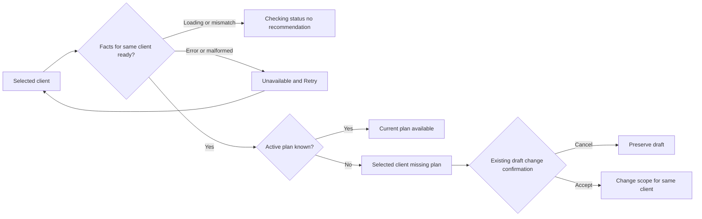

# S05 — Selected-client advice must reflect known facts

Status: PLANNED, NOT ADMITTED. Astra contract; Luna xhigh builds/tests. Extends canonical document14 section5 / FE08 and R-H22. All other requirements remain pending as recorded; S05 does not claim full H10 action ownership or H12 revision repair.

## Baseline and exact scope
At c0cbe538d8ed2ca519bb494cdf3282bf43b76699, CommandPanelV2 passes the full roster to a resolver with only selected-client plans. SavedPlansState marks a failed or malformed response as a successfully identified empty list in finally. Consequently the chip can invent another client's missing-plan status and select that client.

Candidate scope under frontend/src/components/DashBoard/Pages/admin-workout-planner/: useWorkoutPlannerSavedPlansState.ts; WorkoutPlannerCommandPanelV2.tsx; new plannerLogic/resolveSelectedClientAdvice.ts; new plannerLogic/resolveSelectedClientAdvice.test.ts; new useWorkoutPlannerSavedPlansState.advice.test.tsx; new WorkoutPlannerCommandPanelV2.advice.test.tsx; existing CommandPanelV2 tests only if fixture metadata requires a compatible update. Before admission enumerate those existing exact test paths. Existing contexts infer the hook return and need no second data store. Preserve the general roster-wide pure resolver and its consumers.

## Responsibilities and contract
SavedPlansState exposes an explicit list read status (idle/loading/ready/error) plus the client identity for the successfully loaded facts. Only success:true with a valid plans array establishes ready, including a valid empty array. Exceptions, denied responses and malformed payloads never establish absence. Begin a refresh invalidates readiness; late completions require current request, mount and selected client. Cleanup invalidates before unmount; use an origin ref/sequence and retain the existing fetch API. The later central operation-owner slice will absorb compatible identity checks. Do not change card activation/rename/save behavior in this slice.

The selected-client advice adapter consumes only the selected roster entry, list status/identity and validated summaries. Unknown selected roster entry or mismatched list identity is unknown. Do not relabel unqueried records with selectedClientId. A no-client state offers focus on the picker. Loading says Checking saved plans. Error says Saved plans unavailable with Retry calling the existing list fetch for the same selected client. A ready empty/no-active list may state the selected client's initials have no active plan. A ready active list with no genuine recommendation says Current plan available, without a fake Pick a client instruction. No chip action changes clients. If a missing-plan action offers a multi-week draft, use the existing guarded duration-change action and preserve its confirmation behavior. Generic pure resolver input includes only known selected-client data; no new fetches, names in logs, provider inputs or roster-wide inference.

## UI states / desktop and mobile
Desktop: [Client B picker] [Phase] [Checking saved plans / Current plan available / B has no active plan] [Retry when unavailable]. Mobile: same reading order with wrapped chip row; no clipped text, fixed height, or controls below44px. Informational status is text, not a misleading clickable button. Retry and an actual draft action are native buttons with focus-visible; live updates polite. Keep existing tokens and layout. Error or retry does not clear the user's draft. No selection and denied/error/empty/ready/stale are distinct.

Rendered component browser check joins final H18 acceptance. No ERD/migration needed; UI read-only advice, existing GET contract. State and permission boundaries above apply; role gates remain unchanged.

## Tests, traceability and exit
H22-T1 actual CommandPanel render with roster A/B, B selected, B active: neither A absence nor A-changing action exists. H22-T2 ready-empty B shows B and never invokes client-selection callback. H22-T3 idle/loading/error/malformed/denied/mismatched client and stale A completion never show absence. H22-T4 retry changes state to ready only after actual successful response; a second failure stays unknown. H22-T5 rapid A→B, older refresh resolving after newer, unmount, missing selected entry and malformed summary fixture. H22-T6 scope action uses existing confirmation-capable handler and does not auto-generate. Pure adapter plus hook deferred-promise tests and rendered real command component are required; source-string assertions alone insufficient. Observe intended RED first, then GREEN; run existing saved-list/route-load/command-panel/resolver tests and full type-check. No server/DB claims from mocked API.

Exit: exact diff and digest, passing focused/compatibility evidence, no uncovered H22 states and no new API call per render. Root owns final adjudication. Rollback exact owned patch; no data migration or record changes. Native guard before exact writes and controller freeze/advance after evidence. No production or provider operation. Plan readiness depends on isolation and S03/S04 completion; not yet implementation authority.
