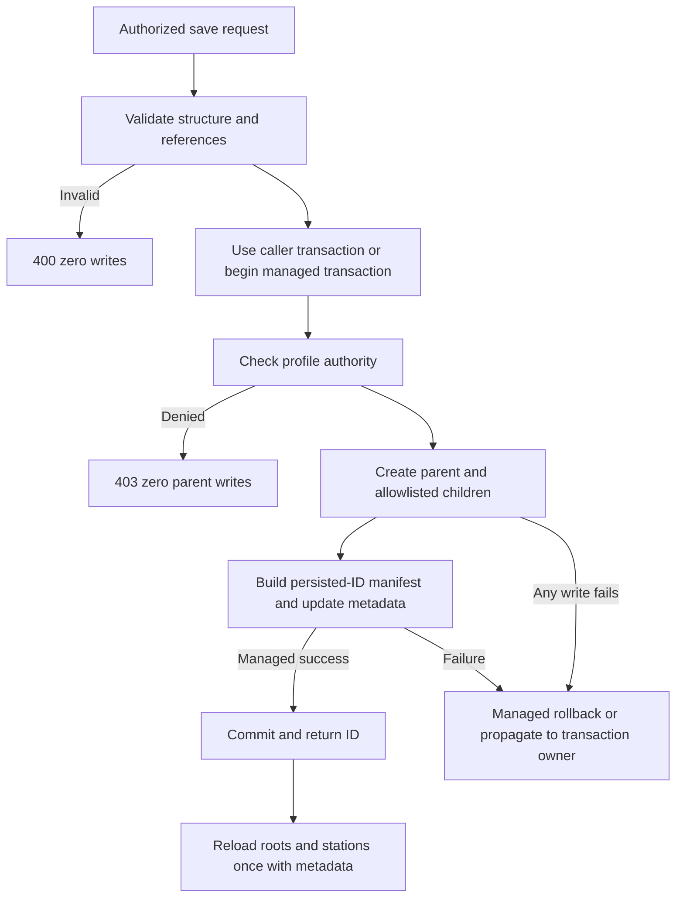

# S06 — Atomic Bootcamp template ownership and reload

Status: PLANNED, NOT ADMITTED. Astra architecture; Luna xhigh code/tests. Requirements H01/H02 and persistence part of H09, canonical document13 section4. Source baseline is the isolated checkout at c0cbe538d8ed2ca519bb494cdf3282bf43b76699 plus our accepted frontend slices. Do not import the unknown writer's backend patch from the former checkout.

## Outcome, invariants and exact boundaries
A saved class is one atomic object with trainer-owned parent, stations, exercises, stretches and overflow. Child IDs/FKs cannot redirect writes. Full-group root exercises, station exercises, boards/order, zero timing, profiles and descriptive provenance survive actual database reload. Any failed write leaves no newly persisted parent or children. An optional caller-owned transaction is passed through without nested transaction, commit or rollback by this service.

Production scope: backend/services/bootcamp/bootcampCrud.mjs; new backend/services/bootcamp/bootcampTemplateContract.mjs; backend/routes/bootcampRoutes.mjs. Existing models/columns/association declarations remain authoritative; no schema migration in this slice. New tracked tests: backend/tests/unit/bootcampTemplateTransaction.test.mjs, backend/tests/api/bootcampTemplateSaveSafety.test.mjs, backend/tests/integration/bootcampTemplatePersistence.integration.test.mjs, and at most one isolated integration fixture/config file. Existing media-rejoin tests remain compatibility coverage. Enumerate final exact admission before code.

## Service / route contract
Keep saveBootcampTemplate(generatedClass, trainerId, options={}) with options.transaction and trusted options.requesterRole. Route passes req.user.role, never body role. Defaults permit only owner's profiles; explicit admin follows existing generation override. Require a valid positive safe trainer ID, finite supported class structure, array shapes, valid station references and bounded ORM-compatible required fields before the first write. Strict optional profile IDs accept only positive safe integer values/complete decimal strings; never parse prefixes or coerce blank to zero. Fetch selected EquipmentProfile and BootcampSpaceProfile via existing model access patterns inside the transaction, validate existence/owner and active equipment profile. Invalid or foreign profile fails before Template.create. Role/auth middleware remains intact.

Use explicit field allowlists for each ORM row. Ignore submitted child id/templateId/trainerId/stationId/manifest keys. Resolve stationId from the new station records using validated stationIndex; null means full-group. Keep legitimate zero duration/rest/setup. Reject duplicate occurrence references and invalid station indices before writes. Model field lengths and supported enums are the bound; do not add arbitrary training restrictions. Standard route error mapping: malformed structure400, denied403 with non-disclosing text, genuine persistence failure500. Keep success {success:true,templateId} compatibility.

One managed transaction encloses parent, all bulk writes and final metadata update. Request returning exercise row IDs, build selectionManifestV1.entries keyed only by persisted IDs, generate server occurrence UUIDs, update metadata within the same transaction. Caller-provided verified flags are never proof. Descriptive annotations are preserved as unverified unless a trusted catalog lookup establishes the performed identity; do not let substitution provenance trigger source-media reattachment. Full H09 replacement matching is a later integration slice. Preserve existing explanations/relaxationSummary and known selection fields from document13; unknown fields cannot become ORM attributes or authority.

getTemplates includes root exercises constrained to stationId:null plus nested station exercises, sorted by existing order. Reattach only matching validated manifest entries; never duplicate station rows in root and nested collections. Legacy missing manifest stays readable and does not become verified. Existing media hydration is covered by compatibility tests; no new remote media requests.

## Flow, data and applicability

Wireframes N/A: existing Save/Load UI unchanged. Existing ERD: trainer owns template; template owns stations, exercises, stretches and overflow; optional exercise.stationId belongs to same template. Transaction sequence and permission boundary above apply. No provider, production records or database migration. Rendering of this headless diagram may join the existing preview; source is present.

## Executable evidence / traceability
Preserve original server-red fixtures and raw9-failure/3-control evidence; never rewrite historical RED. Promote their behavioral assertions into maintained tests with current authority-aware mocks. Observe new tests RED against isolated baseline, then GREEN. Cover every child and final-manifest late failure, FK/id injection ignored, invalid station references zero writes, empty/station/full-group cases, duplicate occurrence, profile missing/foreign/inactive, explicit admin, caller-owned transaction success/failure, manifest spoofing and reload shape/order/zeros.

H01 unit/route tests prove admission and trusted fields; H02 requires real PostgreSQL constraints and transactions. Use a NEW positively identified disposable cluster for the new checkout (do not reuse old-root data_directory by weakening the guard). Validate URL host/port/database/user and current_setting(data_directory) before writes. Import real production Bootcamp model definitions with database.mjs mocked to the isolated Sequelize connection; minimal supporting synthetic Users/equipment tables are allowed but clearly identified. Apply only scoped model sync in an isolated schema with verified search_path/enum placement; no global sync({force:true}) or app env. Preserve model/association behavior, then verify actual table counts/reloads, late FK/manifest failure rollback, caller transaction rollback. If actual model setup is blocked, report it; synthetic minimal-model tests alone do not close final persistence acceptance.

Run maintained focused tests, existing Bootcamp media/format/profile route tests, backend syntax/import checks and git diff --check. Evidence names exact environment, source hashes and limitations. No setup/import failure counts as RED. No provider or production request.

## Operations and readiness
Entry: prior admitted slice complete, exact scope frozen, isolated DB identity established for integration. Exit: reviewed diff plus unit/route and real-model persistence results; any unresolved boundary remains open. Rollback code by exact owned patch, no deleting saved classes/history. Additive existing metadata permits legacy reads; no backfill. Root owns final review and test-cluster cleanup after all uses; Luna owns implementation. Final combined review remains pending and must include later H09/H28/H29 integration. This document is a plan, not an assertion of readiness or completed implementation.
