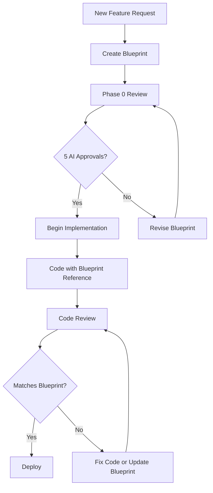
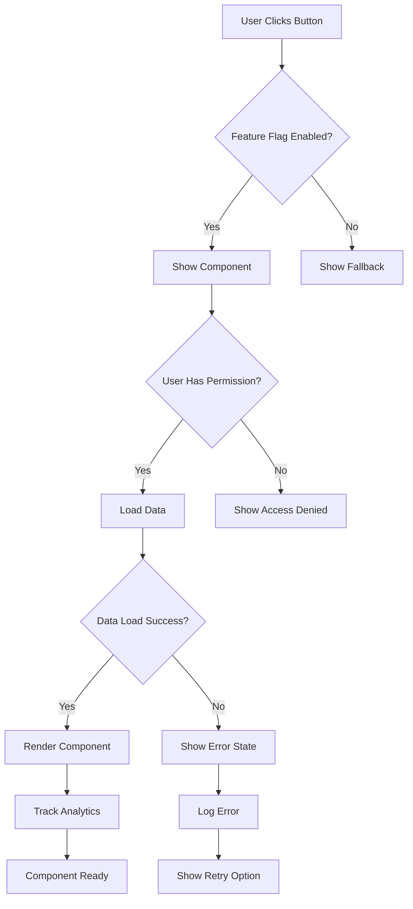
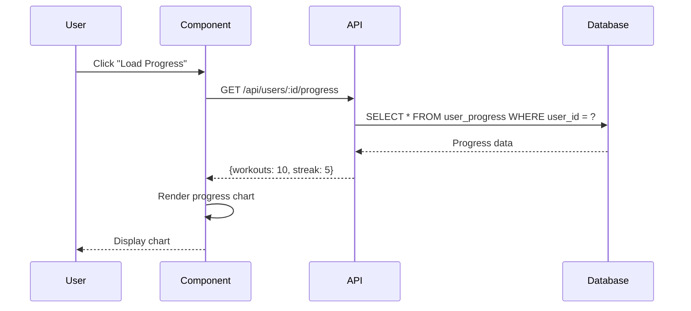
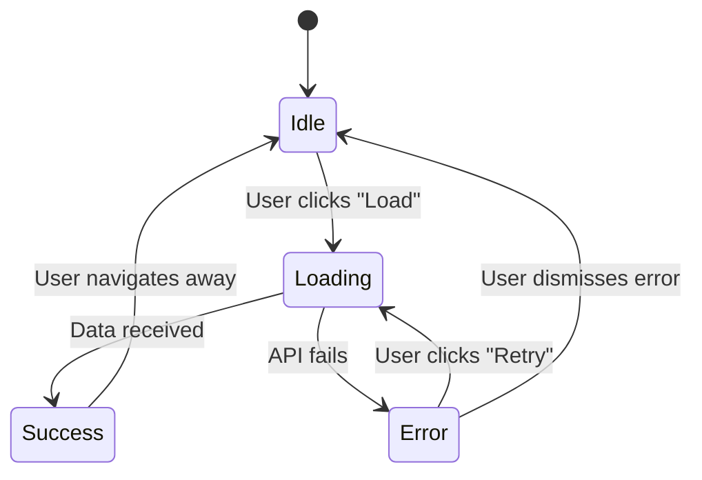
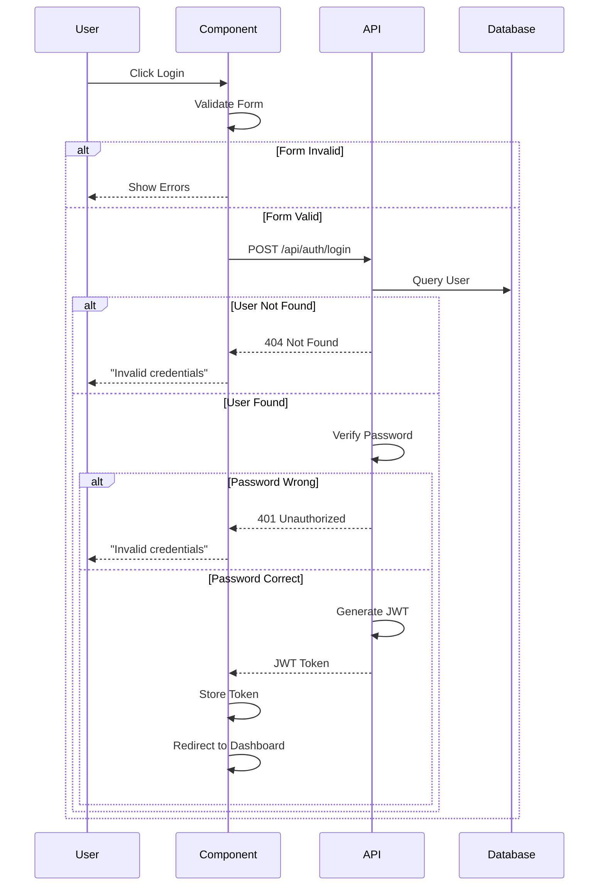
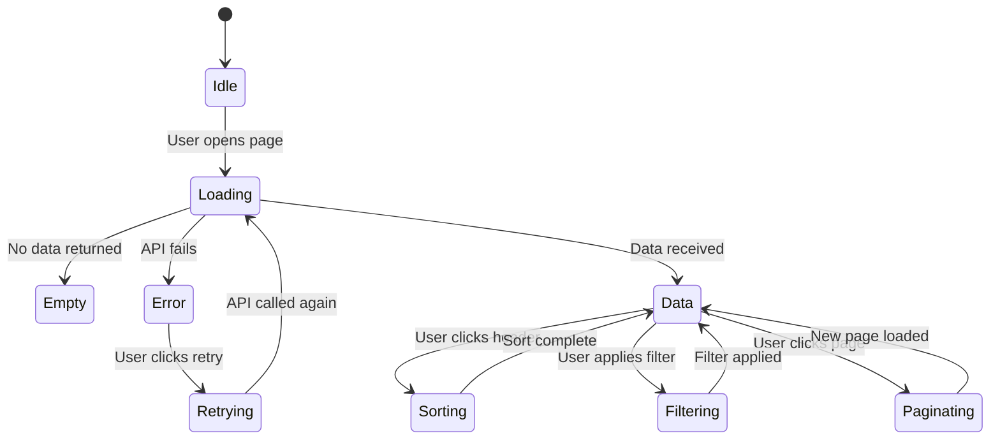

# SWANSTUDIOS AI VILLAGE HANDBOOK - FINAL EDITION
## Your Complete Guide to Building SwanStudios with AI Agents

**Last Updated:** 2026-01-24 - RENDER MCP & PRO SUBSCRIPTION UPGRADE
**Previous Update:** 2026-01-11 - Added Client Data Database Integration System (Section 9.7)
**Your Situation:** Time-stressed, need revenue, have powerful AI tools already
**Goal:** Launch in 1-2 weeks, not 3 months + Personal Training System automation

---

## 📋 CHANGELOG

### 2026-01-24 - Render MCP & Pro Subscription (Section 9.12)
- ✅ **Tool Stack Update:** Claude Code (VS Code) is Main Orchestrator.
- ✅ **Subscription:** Documented upgrade path ($20 → $100 Pro) for higher limits.
- ✅ **Hosting:** Render Platform integration formalized.
- ✅ **New Capability:** Roo Code + Render MCP for direct deployment control.
- **Status:** ACTIVE - Infrastructure hardening.

### 2026-01-24 - The 5-Brain Swarm Protocol (Section 9.11)
- ✅ **5-Brain Protocol:** 5 distinct AI intelligences review all code (skipping 6 - unlucky)
  1. **🧠 Architect** (Claude Sonnet) - Strategy & Planning
  2. **🔨 Builder** (DeepSeek V3) - Heavy Coding
  3. **🧪 QA** (GPT-4o) - Security & Testing
  4. **🎨 Visionary** (Gemini 1.5 Pro) - UI/UX & Large Context
  5. **⚡ Logician** (DeepSeek R1) - Algorithm Verification
- ✅ **Workflow Shift:** From "Human Router" to "Recursive Quality Loops"
- ✅ **Tool Stack:** Consolidated into Roo Code (VS Code) + MCP
- ✅ **Protocol:** Enhanced `.clinerules` with 5-Brain enforcement
- ✅ **Cost Optimized:** 80% free models, 15% value tier, 5% premium ($5-15/month)
- ✅ **Quality Gate:** Task not "Done" until 3+ brains review (5 for critical code)
- **Status:** ACTIVE - Ensures 100% error-free code

### 2026-01-17 - Sections 9.9 and 9.10: NASM Growth Plan and UX Protocol
- Store is Source of Truth for pricing (no prices on homepage)
- Homepage ProgramsOverview.V3.tsx complete
- Two-tier shop architecture approved
- UX/UI Design Protocol added

### 2026-01-15 - Section 9.8: Business Readiness & Streamlining Master Plan
- ✅ Corrected Pricing Structure ($175 Standard, $200 AI Data Package, $110 Express 30-min)
- ✅ Admin Dashboard Data Entry Protocol (ALL mock data must have admin UI for data entry)
- ✅ Phase 0-5 Implementation Roadmap (Database Foundation → Launch Readiness)
- ✅ Blueprint/Wireframe/Mermaid Update Requirements (UI flow validation per feature)
- ✅ Fairmont Parent Onboarding Strategy (10-minute movement screen integration)
- ✅ Dashboard Consolidation (archive duplicates, keep RevolutionaryClientDashboard)
- ✅ Mock Data Elimination Framework (30+ components identified)
- ✅ Admin Data Entry Interfaces (required for every feature with mock data)
- ✅ UI/UX Flow Validation (click-through testing for all features)
- Impact: Ensures every feature works end-to-end with proper data persistence
- Impact: Admin can populate ALL application data via dashboard (zero hardcoding)
- Impact: Complete UI flow documentation before implementation

### 2026-01-11 - Section 9.7: Client Data Database Integration System
- ✅ Complete Client Data Integration Prompt (CLIENT-DATA-INTEGRATION-REFACTORED-PROMPT.md)
- ✅ Deep Codebase Analysis Framework (analyzes 44+ controllers, 556+ components)
- ✅ Duplicate Detection & Consolidation (identifies broken tabs, non-functional buttons)
- ✅ 85-Question Onboarding Questionnaire mapping to database schema
- ✅ Master Prompt JSON Schema v3.0 (complete client data structure for AI)
- ✅ Backend AI Service Integration (NOT MCP servers - built into backend)
- ✅ Database Schema Design (6 new models: Questionnaire, Baseline, Progress, Nutrition, Photos, Notes)
- ✅ Dashboard Consolidation (fixes multiple duplicate Client Dashboard layouts)
- ✅ Data Persistence Focus (ensures ALL data saves to PostgreSQL, NO mock data)
- ✅ Role-Based Access Control (Admin/Trainer/Client permissions)
- Impact: Transforms file-based client-data system into production database-backed web app
- Impact: Enables real-time client data entry and persistence across all dashboards
- Impact: Fixes broken tabs and buttons that don't save data

### 2025-11-13 - Section 9.6: Admin Video Library System
- ✅ Complete Admin Video Library UI/UX Implementation (28,000+ lines of documentation)
- ✅ Frontend Components Complete (6 files, 950+ lines of code)
  - AdminVideoLibrary.tsx - Main video library page with search, filters, pagination
  - VideoCard.tsx - Grid/List view video display component
  - CreateExerciseWizard.tsx - 4-step exercise creation wizard (placeholder)
  - VideoPlayerModal.tsx - Full-screen video player (placeholder)
  - useDebounce.ts - Custom hook for search optimization
  - VideoLibraryTest.tsx - Standalone test wrapper with React Query
- ✅ Comprehensive Documentation:
  - ADMIN-VIDEO-LIBRARY-WIREFRAMES.md (~15,000 lines) - Complete UI specifications
  - ADMIN-VIDEO-LIBRARY-ARCHITECTURE.mermaid.md (~7,000 lines) - System architecture diagrams
  - ADMIN-VIDEO-LIBRARY-TESTING-GUIDE.md (~6,000 lines) - Testing instructions with mock data
- ✅ NASM Integration - Phase-aware video categorization (5 phases)
- ✅ Galaxy-Swan Theme - 100% styled-components, no MUI violations
- ⏳ Backend APIs Pending (11 endpoints for video management)
- ⏳ Database Migrations Pending (exercise_videos, video_analytics tables)
- ⏳ Video Processing Pipeline Pending (FFmpeg, HLS encoding, YouTube API)
- Impact: Enables admins to create "YouTube but better" exercise library with NASM phase tagging

### 2025-11-07 - Section 9.5.1: Onboarding-to-Database Pipeline
- ✅ Added complete Onboarding-to-Database Pipeline documentation (340+ lines)
- ✅ Schema Compatibility & Versioning table (Coach Cortex v3.1 + Master Prompt v3.0)
- ✅ Authentication & Rate Limits guidance (JWT, retry strategies)
- ✅ Error Responses & Idempotency handling (6 error codes with examples)
- ✅ Data Governance & Compliance (HIPAA disclaimer, PII access, retention policy)
- ✅ Acceptance Checklist (18 items before production deployment)
- ✅ cURL Test Suite (6 comprehensive API tests)
- ✅ Operational Runbook (6 common failures + fixes, monitoring metrics)
- ✅ 60-Second Quick Start Fallback (manual onboarding when API down)
- Impact: Bridges "Data Chasm," enables AI-powered coaching at $300-500/session

### 2025-11-06 - Section 9.5: Coach Cortex v3.1 & Personal Training System
- ✅ Unified Training AI System (personal training + boot camps)
- ✅ Autonomous Coaching Loop (voice → text → database → dashboard)
- ✅ Boot Camp System (50-min classes, 8-board circuit displays)
- ✅ Multi-AI Consensus Protocol (5 AIs collaborate on training decisions)
- ✅ Spirit Name System (privacy-preserving client aliases)
- Impact: Zero manual data entry, 15-30 min time savings per session

### 2025-11-05 - Section 6.6: Design Workflow & Build Gate Process
- ✅ Design Master Prompt v3.0 (consolidated AI feedback)
- ✅ "Ask Before Coding" enforcement (no surprise code)
- ✅ 28-point Engineering Handoff Checklist
- ✅ Shared file coordination (CURRENT-TASK.md, status files)
- Impact: Prevents rework, ensures alignment before coding

---

## 🚀 QUICK START: ONBOARDING NEW AIs

**Need to onboard an AI quickly?** Use these ready-made prompts:

1. **MASTER-AI-ONBOARDING-PROMPT.md** - Complete onboarding (full details, auto-role detection)
2. **QUICK-START-AI-PROMPT.md** - Fast onboarding (essential info only)
3. **COPY-PASTE-PROMPT.txt** - Ultra-compact (copy/paste into any chat)

**All prompts include:**
- Auto-detection of AI role based on which AI is reading
- "NO CODE WITHOUT APPROVAL" enforcement
- Phase 0 requirement explanation
- Project context and current status
- First message templates for each AI

**Critical Design References:**
- **[UX/UI Design Protocol](#910-uxui-design-protocol)** - Mobile-first (44px touch targets), Galaxy-Swan theme, segmented controls (not dropdowns)
- **[Design Workflow & Build Gate](#66-design-workflow--build-gate-process)** - Design Master Prompt v3.0, 28-point handoff checklist

**Location:** `AI-Village-Documentation/` directory

---

## 📚 TABLE OF CONTENTS

### PART 0: CRITICAL FOUNDATIONS (READ THIS FIRST!)
0.1. **4-Tier Role System** (DO NOT ASSUME 3-TIER!)
0.2. **Blueprint-First Enforcement** (NO CODE WITHOUT DESIGN)
0.3. **Level 5/5 Documentation Standard** (AI-READY CODE)

### PART I: YOUR CURRENT REALITY
1. Your Actual AI Arsenal (What You Have)
2. Your SwanStudios Project Status
3. The Big Decision: Fix vs. Rebuild
4. Cost Analysis (What You're Actually Spending)

### PART II: AI ROLE ASSIGNMENTS (THE CORE)
5. AI Village Role Mapping (Your Optimized Setup)
6. ChatGPT-5 Responsibilities
6.5. MinMax v2 Responsibilities
6.6. [Design Workflow & Build Gate Process](#66-design-workflow--build-gate-process)
7. Claude 4.5 Sonnet Responsibilities
8. Roo Code + OpenRouter Strategy
9. Supporting Cast (Gemini, Codex, v0.dev)
9.5. [Coach Cortex v3.1 - Personal Training AI System](#95-coach-cortex-v31---unified-training-ai-system-personal-training--boot-camps)
  - 9.5.1. [Onboarding-to-Database Pipeline](#951-onboarding-to-database-pipeline---client-intake-automation)
9.6. Admin Video Library System
9.7. [Client Data Database Integration](#97-client-data-database-integration---comprehensive-onboarding--data-persistence)
9.8. Business Readiness & Streamlining Master Plan
9.9. [NASM Growth Plan - Homepage and Shop Architecture](#99-nasm-growth-plan---homepage-and-shop-architecture)
9.10. [UX/UI Design Protocol](#910-uxui-design-protocol)
9.11. [The 5-Brain Swarm Protocol](#911-the-5-brain-swarm-protocol-quality-assurance)
9.12. [Render MCP Integration](#912-render-mcp-integration-deployment-control)

---

## 9.9. NASM GROWTH PLAN - HOMEPAGE AND SHOP ARCHITECTURE

Core Principle: STORE IS SOURCE OF TRUTH FOR ALL PRICING

Approved Decisions:
1. Jumpstart Pack naming
2. Express 30 on /shop front page
3. Content Marketing Phase 6
4. Build /book-screen landing page

Homepage: ProgramsOverview.V3.tsx (COMPLETE)
Shop: Two-tier layout (ChatGPT task)

---

## 9.10. UX/UI DESIGN PROTOCOL

File: docs/ai-workflow/blueprints/UX-UI-DESIGN-PROTOCOL.md

Core: Mobile-first, 44px touch targets, Galaxy-Swan theme
NASM: Use segmented controls (not dropdowns)

---

## 9.11. THE 5-BRAIN SWARM PROTOCOL (Quality Assurance)

**Added:** 2026-01-24
**Purpose:** Ensure 100% error-free code through multi-AI review.

### The 5 Brains

| # | Brain | Model | Platform | Responsibility |
|---|-------|-------|----------|----------------|
| 1 | **🧠 Architect** | Claude Sonnet | Claude Code (VS Code) | Strategy, PLAN.md, architecture decisions |
| 2 | **🔨 Builder** | DeepSeek V3 | Roo Code (OpenRouter) | Heavy coding, implementation, test writing |
| 3 | **🧪 QA** | GPT-4o | ChatGPT 5.2 / Codex | Security review, edge cases, testing |
| 4 | **🎨 Visionary** | Gemini 1.5 Pro | Gemini 3 | Frontend, UI/UX, Galaxy-Swan compliance |
| 5 | **⚡ Logician** | DeepSeek R1 | Roo Code (OpenRouter) | Complex reasoning, algorithm verification |

### Review Flow
```
Architect (Plan) → Builder (Code) → QA (Security) → Visionary (UI) → Logician (Logic)
        ↑                                                                    ↓
        └────────────────────────── Feedback Loop ───────────────────────────┘
```

### Enforcement Rules
- **Standard code:** 3+ brain approvals required
- **Critical code (auth, payments, RLS):** ALL 5 brain approvals required
- **Mode switching:** "Switch to [Mode] and review this for [focus]"

### Cost Optimization
| Brain | Model | Cost | Usage |
|-------|-------|------|-------|
| Builder | DeepSeek V3 Free | $0 | 80% of work |
| Logician | DeepSeek R1 Free | $0 | Algorithm checks |
| Visionary | Gemini 2.5 Flash | $0.075/1M | UI review |
| QA | GPT-4o | $5/1M | Security review |
| Architect | Claude Sonnet | $3/1M | Planning (5%) |

**Monthly Target:** $5-15 for OpenRouter (mostly free models)

---

## 9.12. RENDER MCP INTEGRATION (Deployment Control)

**Added:** 2026-01-24
**Purpose:** Give Roo Code direct control over SwanStudios hosting on Render.

### Your Tool Stack Clarification

| Tool | Platform | Role | Billing |
|------|----------|------|---------|
| **Claude Code** | VS Code Extension | Main Orchestrator (Architect) | $20/mo → $100/mo Pro Subscription |
| **Roo Code** | VS Code Sidebar | Builder + Deployment | OpenRouter API ($5-15/mo) |
| **Render** | Web Hosting | Production Deployment | Separate Render billing |

### Setup Instructions for Render MCP

**Step 1: Get Render API Key**
1. Go to [Render Dashboard](https://dashboard.render.com)
2. Navigate to **Account Settings → API Keys**
3. Click **Create API Key** and copy it securely

**Step 2: Configure Roo Code MCP**
1. Open Roo Code Settings in VS Code
2. Navigate to **MCP Servers → Edit JSON**
3. Add the following configuration:

```json
{
  "render": {
    "command": "npx",
    "args": ["-y", "@modelcontextprotocol/server-render"],
    "env": {
      "RENDER_API_KEY": "YOUR_RENDER_API_KEY_HERE"
    }
  }
}
```

**Step 3: Verify Connection**
- Restart Roo Code
- Ask: "Roo, check the status of the latest deployment"
- Should return deployment status from Render

### Capabilities Enabled

| Command Example | What It Does |
|-----------------|--------------|
| "Check deployment status" | Shows latest deploy status, success/failure |
| "Show backend error logs" | Retrieves recent error logs from Render |
| "Connect to Render Postgres" | Query database directly via MCP |
| "List all services" | Shows all Render services for sswanstudios |
| "Trigger redeploy" | Manually triggers a new deployment |

### Billing Clarification

**IMPORTANT:** Your subscriptions are SEPARATE:

| Service | What It Covers | Cost |
|---------|----------------|------|
| **Claude Pro ($20 → $100)** | Claude Code (VS Code Extension) + Claude.ai | Subscription |
| **Roo Code** | Extension is free, but uses OpenRouter API | $5-15/mo API |
| **OpenRouter** | DeepSeek, Gemini, GPT-4o access for Roo | Pay-per-token |
| **Render** | Hosting, database, deployments | Separate Render plan |

**Your Claude Pro subscription does NOT cover Roo Code API costs!**

---

# PART III: EXECUTION PLAYBOOK
10. Week 1 Launch Plan (Bug Fixes + Deploy)
11. Figma + v0.dev UI Workflow
12. AI Village Phased Adoption
12.5. Phase 0 Design Review System
13. Daily Workflow Examples

### PART IV: REFERENCE MATERIALS
14. Quick Decision Matrix
15. Cost Tracking
16. Troubleshooting
17. Next Steps After Launch

---

# PART 0: CRITICAL FOUNDATIONS

## 🚨 READ THIS FIRST - ARCHITECTURAL TRUTHS

---

## 0.1. 4-TIER ROLE SYSTEM (DO NOT ASSUME 3-TIER!)

### **🚨 CRITICAL: SwanStudios uses a 4-tier role hierarchy, NOT 3-tier!**

```
┌──────────────────────────────────────────────────────────────────┐
│ ROLE      PURPOSE                    ROLE PROGRESSION            │
├──────────────────────────────────────────────────────────────────┤
│ user      Social media ONLY          → Auto-upgrades to 'client' │
│           (FREE TIER)                   upon purchasing sessions │
│           - EnhancedSocialPosts                                   │
│           - SocialConnections                                     │
│           - Communities access                                    │
│           - CANNOT book sessions                                  │
├──────────────────────────────────────────────────────────────────┤
│ client    All user permissions       - Purchased training        │
│           + Training access             sessions                 │
│           (PAID TIER)                - availableSessions > 0     │
│           - Session booking          - Workout tracking          │
│           - Trainer assignment       - Progress monitoring       │
├──────────────────────────────────────────────────────────────────┤
│ trainer   All client permissions     - Creates workout plans     │
│           + Service provider         - Manages session schedules │
│           - View assigned clients    - Awards points             │
│           - Session management       - Client progress tracking  │
├──────────────────────────────────────────────────────────────────┤
│ admin     Full system access         - User management (CRUD)    │
│           + Platform management      - Content moderation        │
│           - Gamification settings    - Analytics dashboard       │
│           - Custom permissions       - System configuration      │
└──────────────────────────────────────────────────────────────────┘
```

### **Business Model: Freemium Conversion Funnel**

1. **Free Tier (user role):**
   - Social media access only (EnhancedSocialPosts, SocialConnections, Communities)
   - No session booking capability
   - No workout tracking
   - Can browse storefront and trainers

2. **Paid Tier (client role):**
   - Automatic upgrade when user purchases sessions
   - Inherits all social media access
   - Gains session booking, workout tracking, trainer assignment
   - `availableSessions` > 0 required for booking

3. **Role Progression Implementation:**
   - `roleService.mjs` - Handles automatic role upgrade
   - `sessionPackageRoutes.mjs` - Upgrades role on session purchase
   - `cartRoutes.mjs` - Checks cart items and triggers upgrade

### **🚨 CRITICAL DISTINCTIONS:**

**'user' ≠ 'client'** - These are DISTINCT roles, not synonyms or legacy naming!

- ❌ **NEVER assume:** "user and client are the same thing"
- ❌ **NEVER assume:** "user is legacy naming for client"
- ✅ **ALWAYS recognize:** user = free tier, client = paid tier

### **Access Control Rules:**

```javascript
// ✅ CORRECT - Session booking restricted to 'client' only
if (user.role === 'client') {
  // Allow session booking
}

// ✅ CORRECT - Social media access for both 'user' and 'client'
if (['user', 'client'].includes(user.role)) {
  // Allow social posts, connections, communities
}

// ✅ CORRECT - Trainer assignment accepts both (pre-assignment workflow)
if (['user', 'client'].includes(client.role)) {
  // Allow assignment creation (user can have trainer before purchasing)
}

// ❌ WRONG - Assumes 3-tier system
if (user.role === 'client' || user.role === 'trainer') {
  // Missing 'user' role entirely!
}
```

### **Documentation References:**

- **Users Table:** `backend/migrations/20250212060728-create-user-table.cjs` (290-line Level 5/5 header)
- **Sessions Table:** `backend/migrations/20250305000000-create-sessions.cjs` (282-line Level 5/5 header)
- **Assignments Table:** `backend/migrations/20250806000000-create-client-trainer-assignments.cjs` (234-line Level 5/5 header)
- **Status Tracker:** `docs/ai-workflow/LEVEL-5-DOCUMENTATION-UPGRADE-STATUS.md` (Session 6 correction)

---

## 0.2. BLUEPRINT-FIRST ENFORCEMENT (NO CODE WITHOUT DESIGN)

### **The SwanStudios Blueprint-First Mandate**

**RULE:** No code may be written without an approved blueprint.

**WHY:** Prevents "vibe coding" - writing code based on assumptions rather than documented architecture.

### **🚨 STOP AND DOCUMENT FIRST - CRITICAL ENFORCEMENT RULE**

**If you encounter ANY code (new OR existing) that lacks:**
- ❌ No architecture diagram (Mermaid/ASCII)
- ❌ No database ERD
- ❌ No flowchart showing logic flow
- ❌ No wireframe (for UI components)
- ❌ No API specifications
- ❌ No WHY sections explaining decisions

**YOU MUST:**
1. **STOP working on the code immediately**
2. **INFORM the user:** "This file lacks [diagram type]. I need to create it first before proceeding."
3. **CREATE the missing documentation:**
   - Architecture diagram (component relationships)
   - Database ERD (if database-related)
   - Flowchart (if logic-heavy)
   - Wireframe (if UI component)
   - WHY sections (business logic explanations)
4. **GET approval** on the diagrams/documentation
5. **THEN and ONLY THEN** proceed with code changes

**Example Response:**
```
"I see this file (sessionController.mjs) lacks:
 - Architecture diagram showing how it interacts with routes/services/database
 - Flowchart for the session booking logic
 - WHY sections explaining session deduction policy

Before I modify this code, I need to create these diagrams first.
Should I:
A) Create the missing documentation now (recommended)
B) Proceed anyway (NOT recommended - violates blueprint-first)

I recommend Option A."
```

**THIS IS NON-NEGOTIABLE:** No exceptions. If code lacks documentation, document it first.

---

### **Blueprint Requirements (Pre-Code Checklist):**

**FOR NEW FEATURES:** Before writing ANY code, you MUST have:

**FOR EXISTING CODE:** Before modifying ANY code, verify it has:

- [ ] **Architecture Diagram** (Mermaid or ASCII)
  - Shows all components and their relationships
  - Includes data flow arrows
  - Identifies external dependencies

- [ ] **Database Schema** (ERD)
  - All tables, columns, data types
  - Foreign key relationships
  - Indexes and constraints
  - WHY sections explaining design decisions

- [ ] **API Specifications**
  - All endpoints (method + path)
  - Request/response formats
  - Authentication requirements
  - Error states and handling

- [ ] **Error Handling Strategy**
  - All possible error states
  - User-facing error messages
  - Logging requirements
  - Rollback procedures

- [ ] **Success Metrics**
  - How to verify feature works
  - Performance benchmarks
  - User acceptance criteria

### **Blueprint Approval Workflow:**



### **File Structure for Blueprints:**

```
docs/blueprints/
├── feature-name/
│   ├── ARCHITECTURE.md       (Component diagrams, data flow)
│   ├── SCHEMA.md             (Database ERD, migrations)
│   ├── API-SPECS.md          (Endpoints, auth, errors)
│   ├── ERROR-HANDLING.md     (All error states)
│   └── SUCCESS-METRICS.md    (Acceptance criteria)
```

### **Pre-Modification Checklist (Existing Code):**

**Before modifying ANY existing code, verify:**

- [ ] **File Header Exists** - Does file have Level 5/5 documentation header?
- [ ] **Architecture Diagram Present** - Can you see how this fits in the system?
- [ ] **Data Flow Documented** - Is the flow of data clear?
- [ ] **WHY Sections Present** - Are design decisions explained?
- [ ] **Error States Documented** - Are all error cases listed?

**IF ANY ITEM IS MISSING:**
- **STOP** - Do not proceed with modifications
- **CREATE** - Add the missing documentation first
- **APPROVE** - Get user approval on documentation
- **THEN** - Proceed with code changes

### **Validation Checklist (Post-Code):**

After implementation, verify:

- [ ] All code files reference the blueprint in header comments
- [ ] Architecture implemented matches blueprint diagrams
- [ ] All edge cases from blueprint are handled in code
- [ ] Error states from blueprint have test coverage
- [ ] Database schema matches ERD exactly

### **Blueprint Enforcement Tools:**

1. **Pre-Commit Git Hook:**
   - Checks for blueprint reference in new files
   - Validates architecture alignment
   - Requires Phase 0 approval ID in commit message

2. **Documentation Linter:**
   - Scans code files for Level 5/5 headers
   - Validates blueprint references exist
   - Checks for WHY sections in migrations

3. **Architecture Validator:**
   - Compares implemented code to blueprint diagrams
   - Flags deviations for review
   - Generates architecture drift reports

---

## 0.3. LEVEL 5/5 DOCUMENTATION STANDARD (AI-READY CODE)

### **The Level 5/5 Standard Explained**

**SwanStudios code is "AI-ready"** - any AI can understand the entire system by reading file headers alone.

### **Documentation Hierarchy:**

```
Level 1: No comments (vibe coding ❌)
Level 2: Basic comments (what the code does)
Level 3: Function docs (JSDoc-style)
Level 4: Architecture comments (how components interact)
Level 5: Blueprint-embedded docs (WHY decisions were made) ✅
```

### **Level 5/5 File Header Template:**

```javascript
/**
 * FILE: [filename.ext]
 * SYSTEM: [Subsystem Name - e.g., "Session Booking System"]
 *
 * PURPOSE: [1-2 sentence description]
 *
 * ARCHITECTURE:
 * ```mermaid
 * graph TD
 *   A[Client] --> B[Controller]
 *   B --> C[Service Layer]
 *   C --> D[Database]
 *   D --> E[Audit Log]
 * ```
 *
 * DATABASE ERD: (if applicable)
 * ```
 * ┌─────────────┐     ┌──────────────┐
 * │   users     │────<│   sessions   │
 * │   (UUID)    │ 1:N │   (INTEGER)  │
 * └─────────────┘     └──────────────┘
 * ```
 *
 * DATA FLOW:
 * 1. Client sends POST /api/sessions/book
 * 2. Controller validates JWT + role='client'
 * 3. Service checks availableSessions > 0
 * 4. Database creates session record
 * 5. Audit log records transaction
 * 6. Response sent to client
 *
 * ERROR STATES:
 * - 400 BAD REQUEST: Invalid session date
 * - 401 UNAUTHORIZED: Missing/invalid JWT
 * - 403 FORBIDDEN: role='user' (not 'client')
 * - 404 NOT FOUND: Trainer not found
 * - 409 CONFLICT: Session already booked
 * - 500 SERVER ERROR: Database failure
 *
 * WHY SECTIONS: (Business logic explanations)
 *
 * WHY Restrict Booking to role='client'?
 * - Freemium model: 'user' = free tier (social only)
 * - Access gating drives session purchases
 * - Prevents booking without availableSessions
 *
 * WHY Use INTEGER Primary Key (Not UUID)?
 * - Legacy compatibility (existing sessions table)
 * - Frontend expects integer IDs
 * - Performance: 4 bytes vs 16 bytes
 *
 * EXAMPLE USAGE:
 * ```javascript
 * const result = await bookSession({
 *   sessionId: 123,
 *   userId: 'uuid-here',
 *   trainerId: 'uuid-here'
 * });
 * // Returns: { success: true, session: {...} }
 * ```
 *
 * DEPENDENCIES:
 * - sequelize (database ORM)
 * - jsonwebtoken (auth)
 * - authMiddleware.mjs (role validation)
 *
 * CREATED: 2025-11-14
 * LAST MODIFIED: 2025-11-14
 */
```

### **Level 5/5 Migration File Requirements:**

All database migrations MUST include:

1. **Table Purpose** - What this table stores and why it exists
2. **Database ERD** - Visual relationships to other tables
3. **Column Documentation** - Every column explained with data types
4. **Index Strategy** - Which columns are indexed and why
5. **Data Flow Diagram** - How data moves in/out of this table
6. **Business Logic WHY Sections** (minimum 6-8 per migration):
   - WHY this primary key type?
   - WHY these foreign keys?
   - WHY soft delete vs hard delete?
   - WHY these validation rules?
   - WHY nullable vs NOT NULL?
   - WHY ENUM values chosen?
   - WHY this index strategy?
   - WHY these constraints?

7. **Security Model** - Access control and audit requirements
8. **Performance Considerations** - Index strategy, query optimization
9. **Rollback Strategy** - How to safely reverse this migration
10. **Foreign Key Dependencies** - What tables reference this table

### **Current Progress:**

- **Overall:** 35/51 files upgraded to Level 5/5 (67% complete)
- **Migrations:** 11/21 files (52% complete)
- **Controllers:** 9/10 files (90% complete)
- **Routes:** 11/11 files (100% complete)
- **Middleware:** 3/9 files (33% complete)

**Tracker:** `docs/ai-workflow/LEVEL-5-DOCUMENTATION-UPGRADE-STATUS.md`

### **Benefits of Level 5/5 Documentation:**

1. **AI Agents Can:**
   - Understand entire system by reading headers
   - Make informed decisions without guessing
   - Generate accurate code that fits architecture
   - Explain design decisions to humans

2. **Human Developers Can:**
   - Onboard in hours instead of weeks
   - Understand WHY decisions were made
   - Avoid repeating past mistakes
   - Maintain code confidently

3. **Business Value:**
   - Reduced onboarding costs
   - Faster feature development
   - Fewer architectural errors
   - Better code reviews

---

# PART I: YOUR CURRENT REALITY

---

## 1. YOUR ACTUAL AI ARSENAL

### **The 2026 Swarm Stack (Consolidated in VS Code)**

Instead of switching between browser tabs, you now use **Roo Code** as the central interface ("The Body") that swaps out "Brains" (Models) based on the task.

#### **1. The Interface: Roo Code (Extension)**
- **Role:** The Swarm Commander
- **Capabilities:** Edits files, runs terminal commands, executes tests, connects to DB & Render via MCP.
- **Cost:** Free (Extension) + API Usage.

#### 2. The Architect: Claude Code (VS Code Extension)
- **Access:** Via VS Code Extension (Paid Subscription)
- **Role:** **Head Orchestrator**. High-level planning, creating `PLAN.md`, reviewing architecture.
- **Capabilities:** CAN write files and run tests (Verified).
- **Warning:** Expensive ($15/1M tokens). Use for *planning* and *critical fixes*, not bulk coding.

#### **3. The Builder: DeepSeek V3**
- **Access:** Via Roo Code (API Provider: OpenRouter)
- **Role:** Heavy coding, refactoring, writing boilerplate.
- **Cost:** ~$0.28/million tokens (**~50x cheaper than Claude**). Use for the "Write -> Test -> Fix" loop.

#### **4. The QA: ChatGPT-4o / Claude 3.5 Haiku**
- **Access:** Via Roo Code
- **Role:** Final review, security checks, "Devil's Advocate".

#### 5. The Visionary: Gemini 3 (Gemini 1.5 Pro)
- **Access:** Via Roo Code or VS Code Extension
- **Role:** Frontend Specialist, UI/UX, **Galaxy-Swan Theme Compliance**, and Massive Context analysis (1M+ tokens).

#### 6. The Logician: DeepSeek R1
- **Access:** Via Roo Code (OpenRouter)
- **Role:** **Complex Reasoning & Optimization.**
- **Why:** Top-tier reasoning model that "thinks" before answering. Excellent for catching subtle logic bugs.
- **Cost:** Very low on OpenRouter.

#### **5. The Nervous System: MCP (Model Context Protocol)**
- **Postgres MCP:** Allows Roo to query your DB schema directly.
- **Browser MCP:** Allows Roo to see your localhost UI.
- **Render MCP:** Allows Roo to check deployment logs, status, and database on Render.

### **Your Total Current Spend:**
- **Budget Goal:** Keep under $100/month.
- **Strategy:** Use DeepSeek V3 for 90% of code generation. Use Claude Code only for Orchestration/Architecture.


---

## 2. YOUR SWANSTUDIOS PROJECT STATUS

### **Current Project Phase: ANALYSIS & REFACTORING** 🔄

**Status as of October 2025:**
- **Completion:** 80-90% feature complete
- **Current Focus:** Post-MUI Elimination, modernizing existing code
- **NOT building from scratch** - Refactoring and improving what exists
- **Goal:** Fix tech debt, improve Galaxy-Swan theme compliance, optimize performance

### **From Gemini's Analysis (WorkFlow.png):**

✅ **GOOD NEWS:**
- "Production Ready with comprehensive monitoring"
- "Extensive automation scripts"
- "Well organized separation of concerns"
- "Feature Rich component library"
- "Mobile Optimized with PWA features"
- **Estimated Completion: 80-90%**
- **Major Win:** MUI completely eliminated, custom UI Kit in place

⚠️ **CURRENT PRIORITIES (Analysis & Refactoring):**
- Modernize Homepage Hero (Phase 0 in progress)
- Fix blank pages (routing/data loading bugs)
- Runtime errors (API integration issues)
- Polish UX/UI with Galaxy-Swan theme consistency
- Refactor components to follow GOLDEN-STANDARD-PATTERN

### **Your Feature Inventory:**
- ✅ Client/Trainer/Admin dashboards (built)
- ✅ Gamification system (built)
- ✅ Progress tracking (built)
- ✅ Scheduling/sessions (built)
- ✅ Stripe payments (integrated)
- ✅ Mobile PWA (optimized)
- ⚠️ Olympian's Forge (AI workouts - may need completion)

---

## 3. THE BIG DECISION: FIX VS. REBUILD

### **THE ANSWER: FIX THIS SITE** ✅

**Why NOT Rebuild:**
1. You're 80-90% complete (would waste all that work)
2. Foundation is solid (Gemini confirmed)
3. Time = Money (3-6 months to rebuild vs. 1-2 weeks to fix)
4. Opportunity cost ($3000-6000 in lost revenue)
5. Current architecture is good enough for launch

**Time Comparison:**
| Approach | Time to Launch | Time to First Customer | Opportunity Cost |
|----------|----------------|------------------------|------------------|
| **Fix This Site** | 1-2 weeks | Week 3 | $0 |
| **Rebuild** | 3-6 months | Month 7 | $3000-6000 lost revenue |

**The Path:** Fix bugs (1 week) → Deploy (1 week) → Get customers (Week 3) → Polish with revenue (ongoing)

---

## 4. COST ANALYSIS

### **Current AI Spending:**
- ChatGPT Pro: $20/month
- Claude Pro: $20/month
- Roo Code: $15/month
- Gemini Code Assist: $0/month
- **Total: $55/month**

### **With Optimized OpenRouter (via Roo Code):**
- Same subscriptions: $55/month
- OpenRouter (mostly free models): +$5-10/month
- **Total: $60-65/month**

### **ROI When You Launch:**
- Week 3: First customer ($49-199/month)
- Month 2: 5-10 customers ($250-2000/month)
- **AI tools pay for themselves in Week 3!**

---

# PART II: AI ROLE ASSIGNMENTS (THE CORE)

---

## 5. AI VILLAGE ROLE MAPPING (YOUR OPTIMIZED SETUP)

### **THE STRATEGY:**
**Switch Roo Code "Modes" instead of switching browser tabs. The AI executes the work recursively.**

### **SWARM MODE ASSIGNMENTS (Inside Roo Code):**

| Mode | Model | Responsibility |
|------|-------|----------------|
| **ARCHITECT** | **Claude Code** | Reads `docs/`, creates `PLAN.md`, defines specs. Smartest brain. |
| **BUILDER** | **DeepSeek V3** | Reads `PLAN.md`, writes code, runs `npm test`, fixes errors recursively. |
| **QA** | **GPT-4o / Claude** | Reviews code against `PLAN.md` and `UX-PROTOCOL.md`. |
| **VISIONARY** | **Gemini 3** | Reviews frontend components, theme compliance, and large file context. |
| **LOGICIAN** | **DeepSeek R1** | Verifies complex algorithms and optimization logic. |

### **The Recursive Loop Protocol:**
1. **Architect** creates the plan.
2. **Builder** writes the code.
3. **Builder** runs the test.
   - *If Fail:* Builder reads error -> Fixes code -> Reruns test (Loop).
   - *If Pass:* Builder marks task complete.
4. **QA** reviews the final output.

### **Legacy Tools (Keep for specific needs):**
- **v0.dev:** Still best for initial UI wireframing.
- **Claude Desktop:** Use for Render deployment monitoring via MCP (Included in Pro sub).

---

## 6. CHATGPT-5 RESPONSIBILITIES

### **Why ChatGPT-5 is a Game-Changer:**
- ✅ Multi-modal (can analyze Figma screenshots, UI mockups, error screenshots)
- ✅ Excellent at comprehensive testing and QA
- ✅ Best at documentation and technical writing
- ✅ Great at user stories and product management
- ✅ You're already paying for it!

### **Primary Roles for ChatGPT-5:**

#### **1. QA Engineer (PRIMARY)**
**Use for:**
- Generating comprehensive test suites
- Code review with security focus
- Edge case identification
- Testing strategy planning

**Workflow:**
```
1. Copy code from Roo Code implementation
2. Paste into ChatGPT-5
3. Prompt: "Act as QA Engineer. Generate: unit tests, integration tests, edge cases. Target 85% coverage."
4. ChatGPT-5 generates complete test suite
5. Copy tests back to your project
6. Run tests, fix failures
```

**Example Prompt:**
```
You are a QA Engineer for SwanStudios. Review this code:

[Paste code]

Provide:
1. Code review with line-by-line feedback
2. Unit tests (Jest + TypeScript)
3. Integration tests (API endpoints)
4. Edge cases (null, undefined, invalid inputs)
5. Security concerns
6. Coverage report estimate

Target: 85% logic coverage on changed files.
```

---

#### **2. Product Manager (PRIMARY)**
**Use for:**
- Writing user stories (Gherkin format)
- Prioritizing features (impact/effort matrix)
- Creating product roadmaps
- Defining acceptance criteria

**Workflow:**
```
1. Open ChatGPT-5
2. Describe feature idea
3. ChatGPT-5 generates: user stories, acceptance criteria, priority ranking
4. Save to BACKLOG.md
```

**Example Prompt:**
```
You are a Product Manager for SwanStudios (personal training platform).

Create user stories for: Client Progress Tracking Dashboard

Format (Gherkin):
As a [role]
I want to [action]
So that [benefit]

Acceptance Criteria:
Given [context]
When [action]
Then [outcome]

Also provide:
- Impact (High/Med/Low)
- Effort (S/M/L)
- Priority recommendation
```

---

#### **3. Technical Writer (PRIMARY)**
**Use for:**
- README.md updates
- API documentation
- User guides
- Developer onboarding docs

**Workflow:**
```
1. Give ChatGPT-5 your openapi.yaml or code
2. Prompt: "Generate API documentation"
3. Get beautiful markdown docs
4. Commit to /docs folder
```

**Example Prompt:**
```
You are a Technical Writer.

Generate API documentation from this OpenAPI spec:

[Paste openapi.yaml]

Output:
- README.md format
- Authentication examples
- Error handling examples
- Rate limiting explanation
- Request/response examples
- Quick start guide
```

---

#### **4. UX/UI Designer (PRIMARY for multi-modal)**
**Use for:**
- Analyzing Figma screenshots
- Critiquing UI mockups
- Creating user flows
- Accessibility review

**Workflow:**
```
1. Screenshot your Figma design or current UI
2. Upload to ChatGPT-5
3. Prompt: "Review this UI for UX issues and WCAG compliance"
4. Get detailed feedback
5. Iterate
```

**Example Prompt:**
```
[Upload Figma screenshot]

You are a UX/UI Designer.

Review this design for:
1. UX issues (confusing flows, unclear CTAs)
2. WCAG 2.1 AA compliance (contrast, font size, touch targets)
3. Mobile responsiveness concerns
4. Visual hierarchy
5. Accessibility improvements needed

Provide specific, actionable feedback.
```

---

## 6.5. MINMAX V2 RESPONSIBILITIES

### **Why MinMax v2 is Your Strategic UX Partner:**
- ✅ Strategic analysis and UX optimization expertise
- ✅ Multi-AI consensus building and orchestration
- ✅ Gamification system specialist (designed SwanStudios gamification)
- ✅ User psychology and behavioral design
- ✅ Data-driven decision making with KPI focus
- ✅ Feature discovery optimization (embedded UX moments)

### **Primary Roles for MinMax v2:**

#### **1. Strategic UX Analysis (PRIMARY)**
**Use for:**
- Analyzing user flows and identifying friction points
- Optimizing feature discovery rates
- Designing embedded gamification moments
- A/B testing strategy and hypothesis generation
- User psychology and behavioral nudges

**Workflow:**
```
1. Share current feature/system design with MinMax v2
2. MinMax v2 analyzes user journey and identifies strategic improvements
3. Provides data-driven recommendations with expected impact
4. Designs embedded UX moments that increase engagement
5. Defines success metrics and KPIs to track
```

**Example Prompt:**
```
You are MinMax v2, Strategic UX Analyst for SwanStudios.

Analyze this feature: [Feature name and current design]

Provide:
1. User journey analysis (current state)
2. Friction points and drop-off risks
3. Strategic UX improvements with expected impact
4. Embedded moments that increase feature discovery
5. Success metrics to track (baseline → target)
6. A/B testing hypotheses

Context: SwanStudios is a personal training platform. Focus on increasing engagement and retention.
```

---

#### **2. Multi-AI Consensus Building (PRIMARY)**
**Use for:**
- Routing complex questions to appropriate AIs
- Building consensus from multiple AI perspectives
- Conflict resolution when AIs disagree
- Synthesizing recommendations into actionable insights
- Orchestrating AI Village collaboration

**Workflow:**
```
1. Complex question arises (e.g., "Why is client stuck at plateau?")
2. MinMax v2 routes question to Claude (strategy), Gemini (data), ChatGPT (recovery)
3. Each AI provides analysis from their specialty
4. MinMax v2 builds consensus recommendation
5. Flags conflicts or low-confidence areas for human review
6. Delivers unified, actionable recommendation
```

**Example Prompt:**
```
You are MinMax v2, AI Village Orchestrator.

Question: Client John Doe is stuck at 225 lbs squat for 4 weeks. What's causing the plateau?

Your task:
1. Route this question to appropriate AIs:
   - Claude Code: Training program analysis
   - Gemini: Data correlation (sleep, stress, wearables)
   - ChatGPT: Recovery factors analysis

2. Collect their responses (provided below):
   [AI responses]

3. Build consensus:
   - Common themes across AI responses
   - Conflicting recommendations (if any)
   - Weighted confidence score
   - Final unified recommendation

4. Flag for trainer review if:
   - Consensus confidence <75%
   - AIs have conflicting recommendations
   - Safety concerns identified

Output format:
- Consensus Recommendation: [Actionable steps]
- Confidence: [0-100%]
- Supporting Evidence: [Data points from each AI]
- Conflicts: [If any]
- Human Escalation: [Yes/No + reason]
```

---

#### **3. Gamification System Design (PRIMARY)**
**Use for:**
- Gamification feature design and optimization
- Point economy balancing (prevent revenue cannibalization)
- Engagement loop design (hooks, rewards, social proof)
- Progressive difficulty and tier systems
- Community challenge design

**Expertise:**
MinMax v2 designed the complete SwanStudios gamification system, including:
- Embedded gamification moments (80% feature discovery vs 30% standalone)
- Sustainable point economy (Option A: 1 pt = $0.001)
- Social proof features (friend activity, group challenges)
- Progressive competition tiers (beginner protection)
- Battle Pass seasonal content system

**Workflow:**
```
1. Share gamification feature idea with MinMax v2
2. MinMax v2 analyzes:
   - User psychology and motivation triggers
   - Economic sustainability (revenue protection)
   - Feature discovery strategy
   - Social proof integration
   - KPIs and success metrics
3. Provides complete feature spec with expected ROI
```

**Example Prompt:**
```
You are MinMax v2, Gamification Expert.

Design a new gamification feature: [Feature concept]

Requirements:
- Must NOT cannibalize revenue (maintain point economy balance)
- Must increase feature discovery rate (target: >70%)
- Must leverage social proof
- Must protect beginner experience (avoid pay-to-win perception)

Provide:
1. Feature design (detailed mechanics)
2. User psychology analysis (why this will work)
3. Economic impact assessment (revenue protection)
4. Embedded moments (where feature appears in user flow)
5. Success metrics (KPIs with baseline → target)
6. Implementation complexity (S/M/L)
7. Expected ROI timeline

Reference: Use SwanStudios gamification system (see GAMIFICATION-PARALLEL-IMPLEMENTATION-SUMMARY.md) as baseline.
```

---

#### **4. Feature Discovery Optimization (PRIMARY)**
**Use for:**
- Increasing feature discovery rates (from 30% → 80%)
- Designing embedded moments (features appear during natural flow)
- Reducing friction in user onboarding
- Progressive disclosure (show advanced features at right time)
- Smart notifications and nudges

**Key Insight:**
MinMax v2 identified that standalone features (requiring users to seek them out) have ~30% discovery rates, while embedded moments (appearing during natural workflow) achieve ~80% discovery.

**Workflow:**
```
1. Identify low-discovery feature
2. Share with MinMax v2 for embedded moment redesign
3. MinMax v2 designs:
   - Where feature appears in natural user flow
   - Trigger conditions (when to show)
   - Microcopy (motivational messaging)
   - Visual treatment (subtle vs prominent)
4. Implement embedded moment
5. Track discovery rate improvement
```

**Example Prompt:**
```
You are MinMax v2, Feature Discovery Specialist.

Current Problem:
- Feature: [Feature name]
- Current discovery rate: 30%
- Feature location: Separate tab users must navigate to
- Target: 80% discovery rate

Your task:
1. Analyze user journey (identify natural touchpoints)
2. Design embedded moments (where/when to show feature)
3. Craft microcopy (motivational, contextual)
4. Define trigger conditions (when to display)
5. Visual treatment recommendations (subtle nudge vs celebration)
6. Success metrics (how to measure discovery rate)

Output: Complete embedded moment spec ready for implementation.
```

---

#### **5. Personal Training System Optimization (PRIMARY)**
**Use for:**
- AI-powered personal training system design
- Client engagement optimization (daily check-ins, photo analysis)
- Premium service justification ($300-500/session pricing)
- Data collection workflow design
- Multi-AI analysis protocols for training decisions

**Expertise:**
MinMax v2 designed the complete Personal Training Master Blueprint v3.0, including:
- Master Prompt JSON schema v3.0 (formal data structure)
- Twilio SMS automation (morning + evening check-ins with safety protocols)
- iPad PWA voice command system (offline-first session logging)
- Photo quality gates and retake protocols
- Multi-AI consensus system for training decisions
- Wearable integration (Whoop, Oura, Garmin)

**Workflow:**
```
1. Share personal training challenge/requirement with MinMax v2
2. MinMax v2 analyzes:
   - Client engagement optimization
   - Data collection workflow
   - AI Village analysis routing
   - Safety protocol requirements
   - Premium service justification
3. Provides complete system design with implementation roadmap
```

**Example Prompt:**
```
You are MinMax v2, Personal Training System Architect.

Challenge: Design a client onboarding system that justifies $300/session pricing.

Requirements:
- Comprehensive health data collection (medical, training, nutrition)
- AI-powered analysis (multi-AI consensus)
- Daily engagement (check-ins, photo analysis)
- Safety protocols (red flags, escalation rules)
- Seamless workflow (minimize trainer manual data entry)

Provide:
1. Onboarding questionnaire structure (what data to collect)
2. Data collection methods (voice, text, photos, wearables)
3. AI Village analysis protocol (which AI handles what)
4. Safety framework (red flags, escalation rules)
5. Premium service differentiators (vs $175 standard tier)
6. Expected client engagement rates
7. Trainer efficiency improvements

Reference: See PERSONAL-TRAINING-MASTER-BLUEPRINT-V3.0.md for full context.
```

---

### **When to Use MinMax v2:**

**✅ Use MinMax v2 when you need:**
- Strategic UX analysis and optimization
- Multi-AI consensus building (complex questions)
- Gamification feature design or optimization
- Feature discovery rate improvements
- Personal training system enhancements
- User psychology and behavioral design insights
- Data-driven decision recommendations with KPIs

**❌ Don't use MinMax v2 for:**
- Direct code implementation (use Roo Code or Claude Code)
- Routine bug fixes (use Roo Code)
- Simple questions with obvious answers
- Tasks better suited for specialized AIs (QA → ChatGPT, Data → Gemini)

---

### **MinMax v2 + AI Village Collaboration:**

**Example: Complex Training Plateau Question**

```
User Question: "Client stuck at 225 lbs squat for 4 weeks. Why?"

MinMax v2 Orchestrates:
┌─────────────────────────────────────────────────────────────┐
│ MinMax v2: Routes question to appropriate AIs               │
└─────────────────────────────────────────────────────────────┘
                           ↓
        ┌────────────────────┬──────────────────┬──────────────────┐
        ↓                    ↓                  ↓                  ↓
┌──────────────┐   ┌──────────────┐   ┌──────────────┐   ┌──────────────┐
│ Claude Code  │   │ Gemini       │   │ ChatGPT      │   │ MinMax v2    │
│ (Strategy)   │   │ (Data)       │   │ (Recovery)   │   │ (Synthesis)  │
└──────────────┘   └──────────────┘   └──────────────┘   └──────────────┘
       ↓                    ↓                  ↓                  ↓
 "Deload week    "Sleep <7 hrs =     "Stress + poor      "Common theme:
  + 5/3/1         23% lower           sleep = inadequate   Recovery deficit
  progression"    strength gains"     recovery"            (sleep + stress)"
        ↓                    ↓                  ↓                  ↓
                     ┌───────────────────────────────────┐
                     │ MinMax v2: Builds Consensus       │
                     └───────────────────────────────────┘
                                      ↓
                     Final Recommendation (Confidence: 88%)
                     ──────────────────────────────────────
                     "Deload week 1, sleep optimization
                      protocol (target 7.5 hrs), stress
                      management (meditation), then 5/3/1
                      progression starting week 2."

                     Supporting Evidence:
                     - Claude: Volume analysis suggests reduction
                     - Gemini: Statistical correlation (sleep vs strength)
                     - ChatGPT: Recovery markers low (HRV, stress)

                     Human Escalation: NO (confidence >75%)
```

---

### **MinMax v2 Integration with SwanStudios:**

**Current MinMax v2 Projects:**
1. ✅ **Gamification System** - Complete design in GAMIFICATION-PARALLEL-IMPLEMENTATION-SUMMARY.md
2. ✅ **Personal Training System** - Complete blueprint in PERSONAL-TRAINING-MASTER-BLUEPRINT-V3.0.md
3. 🔄 **Homepage v2.0 Review** - Strategic UX analysis and optimization recommendations
4. 📋 **AI Village Handbook** - You're reading it! MinMax v2 role now documented

**Future MinMax v2 Use Cases:**
- Admin dashboard UX optimization
- Client retention strategy (embedded engagement loops)
- Trainer onboarding workflow optimization
- Constellation system gamification enhancements
- Quest system difficulty balancing

---

### **MinMax v2 Response Format:**

MinMax v2 responses typically include:
1. **Strategic Analysis** - "Here's what's happening and why"
2. **Data-Driven Insights** - KPIs, metrics, expected impact
3. **User Psychology** - Why users will/won't engage
4. **Actionable Recommendations** - Specific steps with priority
5. **Success Metrics** - Baseline → Target with measurement plan
6. **Implementation Complexity** - S/M/L effort estimate
7. **Expected ROI** - Timeline to positive impact

---

### **Cost Considerations:**

MinMax v2 cost varies by platform:
- If using via API: Cost depends on model and usage
- If using via chat interface: Typically included in subscription
- Recommended: Use for strategic decisions (high-value, low-frequency) to maximize ROI

**Rule of Thumb:**
- Strategic UX analysis: ~1-2 hours of MinMax v2 time per feature
- Multi-AI orchestration: ~30 min per complex question
- Gamification design: ~2-4 hours per major feature

---

## 6.6. DESIGN WORKFLOW & BUILD GATE PROCESS

### **The Design-First Philosophy:**

**Problem:** AIs often jump straight to code without asking, leading to:
- ❌ Generic designs that don't align with SwanStudios brand
- ❌ Performance issues discovered too late
- ❌ Accessibility overlooked until QA phase
- ❌ Rework cycles (design → code → "this doesn't match our vision" → redesign → recode)

**Solution:** Design Master Prompt v3.0 + Build Gate enforcement

---

### **Design Master Prompt v3.0 Overview:**

**Purpose:** Force AIs to produce unique, business-professional designs with SwanStudios DNA before writing any code.

**Key Features:**
1. **Anti-Generic Guard** - Forbidden tropes + novelty levers (no generic gradients, stock photos, template layouts)
2. **4 Performance Tiers** - Luxe/Standard/Lite/Text (progressive enhancement based on device capability)
3. **Design JSON Output** - Machine-readable spec for engineering handoff
4. **Build Gate Enforcement** - No code until design approved by user

**Complete Spec:** `docs/ai-workflow/DESIGN-MASTER-PROMPT-ANALYSIS.md`

---

### **When to Use Design Master Prompt:**

**✅ Use Design Master Prompt when:**
- Designing new pages or major features (Homepage, Dashboard, Shop)
- Creating new component libraries or design systems
- Refactoring existing designs for performance or accessibility
- User explicitly requests "design" or "art direction"

**❌ Do NOT use Design Master Prompt when:**
- Fixing bugs in existing designs (use component specs directly)
- Making minor tweaks (e.g., "change button color to blue")
- Implementing features where design is already approved (go straight to code)
- User requests "code" or "implementation" without design phase

**Gray Area (Ask User First):**
- User says "build a contact form" - Do they want design first, or use existing components?
  - **Ask:** "Would you like me to design a unique contact form first, or use existing SwanStudios components?"

---

### **Build Gate Process (5 Steps):**

```
Step 1: Design Phase
┌────────────────────────────────────────────┐
│ AI uses Design Master Prompt v3.0          │
│ Outputs Design JSON (tokens, components,   │
│ layouts, performance budgets, a11y)        │
└────────────────────────────────────────────┘
                    ↓
Step 2: Phase 0 Review
┌────────────────────────────────────────────┐
│ AI Village reviews Design JSON:            │
│ - Claude Code: Architecture + Integration  │
│ - Roo Code: Performance budgets realistic? │
│ - Gemini: Component complexity reasonable? │
│ - ChatGPT: Accessibility compliance?       │
│ - MinMax v2: UX + embedded moments?        │
└────────────────────────────────────────────┘
                    ↓
Step 3: User Approval
┌────────────────────────────────────────────┐
│ User reviews Design JSON + AI feedback     │
│ Decision: Approve / Request Changes        │
└────────────────────────────────────────────┘
                    ↓
Step 4: Build Gate Opens (IF APPROVED)
┌────────────────────────────────────────────┐
│ Engineering implements from Design JSON    │
│ - Roo Code: Backend + data layer          │
│ - Claude Code: Frontend + integration     │
│ - Gemini: React components                │
└────────────────────────────────────────────┘
                    ↓
Step 5: Validation
┌────────────────────────────────────────────┐
│ - Performance: LCP ≤2.5s, TTI ≤3s?         │
│ - Accessibility: WCAG 2.2 AA compliance?   │
│ - Design fidelity: Matches Design JSON?    │
└────────────────────────────────────────────┘
```

**Critical Rule:** If user did NOT approve Design JSON, Build Gate stays CLOSED. No code gets written.

---

### **Design JSON Schema (Engineering Handoff):**

**Required Sections:**
1. **Art Direction** - Pillars, tensions, signature motif, forbidden tropes, novelty levers
2. **Design Tokens** - Colors (OKLCH), typography, spacing, radius, elevation, motion
3. **Components** - Specs for each component (Luxe/Standard/Lite/Text tier variations)
4. **Pages** - Wireframes, grid structure, responsive breakpoints, embedded UX moments
5. **Performance Tiers** - Device detection logic, tier triggers, asset strategies
6. **Accessibility** - WCAG 2.2 AA checklist, contrast ratios, touch targets, keyboard nav
7. **Performance Budgets** - LCP/TTI/INP targets, bundle sizes, optimization strategies
8. **Privacy** - Telemetry rules (anonymous only, no PII), consent flow, data retention

**Engineering Handoff Checklist (28 Quality Gates):**
Before Design JSON is "complete", verify all 28 checkboxes in `docs/ai-workflow/DESIGN-MASTER-PROMPT-ANALYSIS.md` → Section "Engineering Handoff Checklist"

**If all 28 checks pass → Ready for implementation**
**If any check fails → Return to design phase**

---

### **AI Responsibilities in Design Workflow:**

| AI | Design Phase Role | Build Phase Role |
|----|------------------|------------------|
| **MinMax v2** | Lead designer (strategic UX, embedded moments, user psychology) | UX review (ensure implementation matches design intent) |
| **ChatGPT-5** | Accessibility auditor (WCAG compliance, touch targets, contrast) | QA testing (ensure a11y works in practice) |
| **Claude Code** | Architecture reviewer (integration feasibility, security) | Main implementer (frontend + integration) |
| **Roo Code** | Performance auditor (budgets realistic? tier logic sound?) | Backend implementer (APIs, data layer) |
| **Gemini** | Component complexity auditor (too complex? over-engineered?) | React component builder |

---

### **Common Anti-Patterns (What NOT to Do):**

**❌ Anti-Pattern 1: Code-First Approach**
```
User: "Build a new homepage"
AI: [Immediately writes React components without design spec]
Problem: Generic design, doesn't match SwanStudios DNA, rework needed
```

**✅ Correct Approach:**
```
User: "Build a new homepage"
AI: "Before I code, let me design it first using our Design Master Prompt.
     This ensures it matches SwanStudios Galaxy-Swan theme and meets
     performance budgets. Should I proceed with design phase?"
User: "Yes"
AI: [Uses Design Master Prompt → Outputs Design JSON → Waits for approval]
```

---

**❌ Anti-Pattern 2: Skipping Phase 0 Review**
```
AI: [Outputs Design JSON]
AI: [Immediately starts coding without waiting for user approval]
Problem: Build Gate violated, user didn't approve design
```

**✅ Correct Approach:**
```
AI: [Outputs Design JSON]
AI: "I've created the Design JSON for the new homepage. Here's a summary:
     - Pillars: Galaxy-Swan Fusion, Intelligent Elegance, Progressive Luxury
     - Signature Motif: Living Constellation hero
     - Performance: LCP ≤2.5s on Luxe tier
     - Accessibility: WCAG 2.2 AA compliant

     Should I proceed with Phase 0 review (get feedback from other AIs),
     or would you like to review this first?"
User: "Get AI feedback first"
AI: [Requests reviews from other AIs → Consolidates feedback → Presents to user]
```

---

**❌ Anti-Pattern 3: Creating Multiple Design Files Without Checking**
```
Gemini: [Creates ENHANCED-DESIGN-MASTER-PROMPT.md]
Roo Code: [Creates DESIGN-MASTER-PROMPT-ROO-VERSION.md]
MinMax v2: [Creates DESIGN-MASTER-PROMPT-MINMAX.md]
Problem: 3 files, unclear which is authoritative, likely duplicates
```

**✅ Correct Approach:**
```
AI: "I see there's already a design master prompt at
     docs/ai-workflow/ENHANCED-DESIGN-MASTER-PROMPT.md
     created by Gemini on Nov 5.

     Should I:
     A) Review and enhance the existing file
     B) Create a new consolidated version (v3.0)
     C) Use the existing file as-is

     What would you prefer?"
User: "Create v3.0 consolidating all AI feedback"
AI: [Creates DESIGN-MASTER-PROMPT-ANALYSIS.md with v3.0 consolidated version]
```

---

### **"Ask Before Coding" Enforcement:**

**The Golden Rule:**
> **NEVER write code without explicit user approval.**
> **Always present design options first.**

**How to Ask:**
```
AI: "I have 3 design approaches for [feature]:

Option A: [Description - pros/cons]
Option B: [Description - pros/cons]
Option C: [Description - pros/cons]

Which approach would you like me to develop into a full Design JSON?"

User: [Picks option or says "do it" or "implement"]
AI: [Now has permission to proceed]
```

**Exceptions (When You CAN Code Without Asking):**
1. User explicitly says "implement", "build", "code it", "do it"
2. User picks an option from your presented choices
3. User says "use existing components" (no new design needed)

**When You CANNOT Code:**
- User says "wait", "hold on", "let me think"
- User asks clarifying questions (they're not ready)
- User hasn't responded yet to your design options
- You haven't presented design options yet

---

### **Design Versioning System:**

**Format:** `v[Major].[Minor].[Patch]`

**Major (v1.0.0 → v2.0.0):**
- Complete redesign or rebrand
- New design system tokens
- Breaking changes to component API

**Minor (v1.0.0 → v1.1.0):**
- New components added
- New performance tier added
- Enhanced accessibility features

**Patch (v1.0.0 → v1.0.1):**
- Bug fixes in designs
- Minor token adjustments
- Performance optimizations

**Track versions in Design JSON:**
```json
{
  "version": "3.0.0",
  "project": "SwanStudios Homepage v2.0",
  "created": "2025-11-05",
  "changes": "Consolidated all AI Village feedback into unified design system"
}
```

---

### **SwanStudios Design DNA (Quick Reference):**

**Galaxy-Swan Theme:**
- **Colors:** Galaxy Core (#0a0a1a), Swan Cyan (#00FFFF), Cosmic Purple (#7851A9)
- **Motifs:** Living constellations, frosted glass, swan geometry
- **Components:** FrostedCard, LivingConstellation, SwanWingCTA, ProgressConstellation

**Forbidden Tropes:**
- ❌ Generic gradient heroes with floating blobs
- ❌ Stock gym photography or "bro culture" aesthetics
- ❌ Template-style layouts without unique personality
- ❌ Oversaturated neon colors
- ❌ Chrome barbells or aggressive red/black gym schemes

**Novelty Levers:**
- ✅ Asymmetric 4/12 grid splits with swan-wing curves
- ✅ Embedded UX moments (80% feature discovery)
- ✅ Progressive enhancement (Luxe → Standard → Lite → Text)
- ✅ Business-professional aesthetic (elegant, premium, trustworthy)

---

### **Summary: Design Workflow Integration:**

**Before This Section:**
- AIs jumped straight to code
- Generic designs didn't match SwanStudios brand
- Multiple AIs created duplicate design files
- No systematic design review process

**After This Section:**
- ✅ Design Master Prompt v3.0 enforces SwanStudios DNA
- ✅ Build Gate prevents code-first approach
- ✅ 28-point Engineering Handoff Checklist ensures quality
- ✅ "Ask Before Coding" rule prevents unwanted code
- ✅ Design versioning tracks iterations
- ✅ Phase 0 review gets multi-AI consensus before implementation

**Result:** Unique, performant, accessible designs that match SwanStudios vision on first try.

---

## 7. CLAUDE 4.5 SONNET RESPONSIBILITIES

### **Why Claude 4.5 Sonnet is Your Secret Weapon:**
- ✅ 200K token context (sees entire architecture)
- ✅ Best at system design and security
- ✅ MCP connections (Claude Desktop sees your live codebase + Render)
- ✅ Excellent at long-form planning and documentation

### **Primary Roles for Claude 4.5 Sonnet:**

#### **1. Orchestrator (PRIMARY via Claude Desktop)**
**Use for:**
- Creating PLAN.md (master planning)
- Breaking down features into tickets
- Risk assessment
- Cost management

**Workflow:**
```
1. Open Claude Desktop
2. MCP automatically loads your codebase context
3. Paste: AI Village Orchestrator prompt (from original blueprint)
4. Add: Your feature description
5. Claude generates: PLAN.md with milestones, tickets, risks
6. Save to /docs/PLAN.md
```

**Example Prompt:**
```
[Paste Section 2.1 Orchestrator prompt from AI Village Blueprint]

HIGH-LEVEL GOAL:
Add multi-tenant Row-Level Security (RLS) to SwanStudios to support multiple organizations.

Requirements:
- Tenant isolation (organization_id on all tables)
- Sequelize scopes + middleware
- Zero downtime migration
- Backwards compatible for 1 sprint

Produce PLAN.md with: WBS, tickets, dependencies, risks, cost estimate.
```

---

#### **2. Architect (PRIMARY via Claude Desktop)**
**Use for:**
- Database schema design
- RLS policies
- API specifications (openapi.yaml)
- Security architecture (THREAT_MODEL.md)

**Workflow:**
```
1. Get PLAN.md from Orchestrator
2. Open NEW Claude Desktop chat
3. Paste: AI Village Architect prompt (Section 2.2)
4. Paste: Architect tickets from PLAN.md
5. Claude generates all artifacts:
   - schema.sql
   - RLS.sql
   - openapi.yaml
   - OBSERVABILITY.md
   - THREAT_MODEL.md
6. Save all to /docs
```

**Example Prompt:**
```
[Paste Section 2.2 Architect prompt from AI Village Blueprint]

CONTEXT FROM PLAN.md:
[Paste Architect tickets]

Stack:
- Frontend: React 18 + TypeScript + Styled-Components
- Backend: Node.js + Express + Sequelize ORM
- Database: PostgreSQL (multi-tenant)
- Auth: JWT + session cookies

Deliver ALL artifacts:
1. schema.sql
2. RLS.sql (Sequelize scopes for tenant isolation)
3. openapi.yaml
4. OBSERVABILITY.md
5. THREAT_MODEL.md
6. EXTERNAL_DEPS.md
7. API_VERSIONING.md
```

---

#### **3. AppSec (PRIMARY via Claude Desktop)**
**Use for:**
- Threat modeling (STRIDE)
- OWASP ASVS L2 compliance
- Security headers configuration
- Vulnerability analysis

**Workflow:**
```
1. Open Claude Desktop
2. Paste: AI Village AppSec prompt (Section 2.6)
3. Describe feature or system
4. Claude generates: THREAT_MODEL.md with mitigations
5. Implement mitigations
```

---

#### **4. SRE/DevOps (PRIMARY via Claude Code - me!)**
**Use for:**
- CI/CD pipeline (GitHub Actions)
- Deployment automation
- Monitoring setup (Sentry, Datadog)
- Runbooks

**Workflow:**
```
1. Ask me (Claude Code in VS Code) to create CI/CD
2. I generate: ci.yml, render.yaml, monitoring config
3. You commit, push
4. GitHub Actions runs automatically
```

**Example Prompt (ask me):**
```
Act as SRE. Create GitHub Actions CI/CD pipeline for SwanStudios.

Requirements:
- Lint (ESLint, Prettier)
- Typecheck (tsc --noEmit)
- Tests (Jest, 85% coverage gate)
- Security scan (Trivy, gitleaks)
- SBOM generation
- Deploy to Render (staging on merge to develop, prod on merge to main)
- Post preview URL to PR

Output: .github/workflows/ci.yml
```

---

## 8. ROO CODE: THE SWARM COMMANDER

### **Why Roo Code is the Core Interface:**
- ✅ **Agentic:** Can create files, edit code, and run terminal commands.
- ✅ **Model Agnostic:** Switch between Claude (Brains) and DeepSeek (Brawn) instantly.
- ✅ **MCP Support:** Connects directly to your PostgreSQL database and Browser.

### **Configuration Strategy:**

1.  **Install Roo Code Extension** in VS Code.
2.  **Connect OpenRouter API Key.**
3.  **Create `.clinerules` file** in root (see Section 9.11).
4.  **Set up Custom Modes:**
    *   **Architect:** System prompt = "You are a Senior Architect. Read docs, create plans. Do not code."
    *   **Builder:** System prompt = "You are a Senior Engineer. Read plans, write code, run tests, fix errors."

### **When to Use Roo Code:**
- ✅ **ALWAYS.** This is your primary interface for 95% of work.

### **When to Use Web Browsers:**
- ⚠️ Only for v0.dev (UI generation) or checking email.

---

## 9. SUPPORTING CAST

### **Gemini Code Assist**
**Best for:** Frontend React coding, Google Cloud, database optimization
**Use when:** Building React components, optimizing Sequelize queries
**Cost:** Free tier

### **Codex (GPT-4 in your panel)**
**Best for:** Backup coder, code review, quick questions
**Use when:** Roo Code fails, need second opinion
**Cost:** Included in ChatGPT subscription

### **v0.dev**
**Best for:** Converting Figma designs to React code
**Use when:** You have visual Figma mockup and need React component
**Cost:** Free tier (200 credits/month), Pro $20/month if needed

---

## 9.5. COACH CORTEX v3.1 - UNIFIED TRAINING AI SYSTEM (Personal Training + Boot Camps)

**NEW** - Enhanced 2025-11-06 with Boot Camp System Integration

### What Is Coach Cortex?

**Coach Cortex** is the AI-powered unified training intelligence system for SwanStudios Personal Training AND Group Fitness Boot Camps. It's a closed-loop system that eliminates all manual data entry and provides real-time AI analysis for both individual clients and group classes.

**The Problem**:
- Personal Training: Trainers waste 15-30 minutes per session manually typing workout data
- Boot Camps: Class planning takes 1-2 hours per week, equipment setup is inefficient

**The Solution**:
- Personal Training: Voice → Text → Database → Dashboard automation with zero manual entry
- Boot Camps: AI-generated 50-minute classes with board-based circuit displays, adaptive difficulty, and equipment flow optimization

### 🔄 The Autonomous Coaching Loop

```
1. DATA CAPTURE (Voice dictation, photos, wearables, daily check-ins)
   ↓
2. TRANSCRIPTION & PARSING (OpenAI Whisper API + GPT-4 NLP extraction)
   ↓
3. MASTER PROMPT UPDATE (PostgreSQL database write)
   ↓
4. AI VILLAGE ANALYSIS (Multi-AI consensus: Gemini, ChatGPT-5, Claude Code, MinMax v2)
   ↓
5. ALERTS & INSIGHTS (Automated safety triggers, trainer alerts, gamification)
   ↓
6. DYNAMIC UI UPDATE (Client & trainer dashboards refresh in real-time)
```

**Total Time**: 30 seconds from voice input to dashboard update
**Manual Data Entry**: Zero

### AI Village Roles for Unified Training System

| AI | Role | Personal Training Responsibilities | Boot Camp Responsibilities |
|----|------|-----------------------------------|---------------------------|
| **Claude Code** | Safety & Ethics | NASM CES exclusions, pain protocol review, medical escalations | Class safety review, age-appropriate modifications (16-77 yrs) |
| **Gemini** | Data Analysis | Performance trends, plateau detection, predictive injury risk | Class participation analytics, equipment usage patterns |
| **ChatGPT-5** | Recovery & Nutrition | Sleep optimization, stress management, nutrition timing | Group motivation strategies, class energy management |
| **MinMax v2** | UX & Coordination | Gamification triggers, celebration moments, client communication | Multi-AI consensus orchestration, unified interface design |
| **Roo Code** | Automation | Voice-to-text pipelines, safety triggers, alert routing | Board display generation, equipment flow optimization |
| **Kilo Code** (NEW v3.1) | Boot Camp Specialist | N/A (boot camp only) | 50-min class programming, circuit design, preferred workout library learning |

### Automated Safety Triggers

The system automatically monitors for:

| Condition | Threshold | Action |
|-----------|-----------|--------|
| Pain intensity | >5/10 | 🚨 URGENT alert to trainer, pause training |
| Neurological symptoms | Keywords: sharp, shooting, numbness | ⚠️ IMMEDIATE medical evaluation required |
| Sleep deprivation | <5 hrs for 3 consecutive days | ⚠️ WARNING: Auto-reduce intensity 20-30% |
| Compliance drop | <75% for 2 weeks | ⚠️ Schedule motivation check-in |
| Personal record | New PR achieved | 🎉 CELEBRATE: Award XP, unlock badge |

### Privacy: ID + Spirit Name System

**IMPORTANT**: Real names never appear in AI prompts or logs.

- **Client ID**: PT-10001, PT-10002, etc.
- **Spirit Name**: Golden Hawk, Silver Crane, Iron Wolf, etc.
- **Real Name**: Encrypted in database only

**Why**: HIPAA-aligned privacy, gamification element, security protection

### Equipment Constraints

System validates every exercise against **Move Fitness equipment database**:
- If equipment unavailable → automatic substitution
- If exercise contraindicated for injury → blocks and suggests safe alternative

**Example**: Client has shoulder impingement
- ❌ Overhead press → 🚫 BLOCKED
- ✅ Landmine press (neutral grip) → Suggested alternative

### Boot Camp System (NEW in v3.1)

**Key Features**:
- **50-Minute Classes**: Precise timing (10 min setup + 30 min circuits + 10 min wrap-up)
- **8-Board System**: 8 boards available (typically 4-5 used per class, 8 boards rarely), 2-6 exercises per board (flexible)
  - **Flexible Combinations**: 4 boards × 4-6 exercises (most common) OR 5 boards × 3-4 exercises OR 6 boards × 2-3 exercises OR 8 boards × 2 exercises (rare)
- **Rest Timing**: 10 seconds between exercises, 60 seconds after completing all exercises on a board
- **Adaptive Difficulty**: EVERY exercise has Easy (50-70% weight, 15-20 reps) and Hard (110-125% weight, 6-8 reps) versions
- **Age Range**: 16-77 years (auto-adaptation based on participant age/fitness level)
- **Cardio Integration**: Minimum 1 cardio break per workout (lap running OR 3-min machine sessions)
- **Equipment**: Air bikes, spin bikes, rowing machines, dumbbells, kettlebells, TRX, battle ropes, medicine balls
- **Bilateral Handling**: Lunges and single-leg exercises take 2 board spaces (left leg + right leg)
- **Preferred Workout Library**: AI learns Sean's signature exercises over time (TRX rows, kettlebell swings, battle rope intervals)

**Board Display Example (4-exercise board)**:
```
BOARD 1: LOWER BODY POWER
┌────────────────────────────────────────┐
│ A1: Goblet Squat - 30 lbs - 3x12      │
│ A2: Kettlebell Swings - 25 lbs - 3x15 │
│ A3: Jump Squats - BW - 3x10           │
│ A4: Walking Lunges - 20 lbs - 3x12    │
│                                         │
│ EASY: 20 lbs squat, no jump, no weight │
│ HARD: 50 lbs squat + pulse 3x, 40 lbs  │
│                                         │
│ Time: 45 sec work, 10 sec transition   │
│ Rest: 60 seconds after all 4 exercises │
└────────────────────────────────────────┘
```

**AI Village Boot Camp Workflow**:
1. **Kilo Code** generates initial class structure (50-min template, board layout)
2. **Claude Code** reviews safety (age-appropriate, injury considerations, contraindications)
3. **Roo Code** optimizes equipment flow (minimize transitions, ankle weights stay on if next exercise uses them)
4. **ChatGPT-5** adds motivation cues and energy pacing
5. **Gemini** analyzes preferred workout library (use Sean's signature exercises 60%+ of time)
6. **MinMax v2** builds consensus and finalizes class design

**Unified Interface**: Single-page app that toggles between personal training and boot camp modes. No separate apps.

### Multi-AI Consensus Protocol

For major decisions (plateau analysis, program changes, injury concerns, boot camp class design):

1. **Query all relevant AIs** simultaneously
2. **Collect responses** with confidence scores
3. **Build consensus** (agreement >75% confidence → proceed)
4. **Detect conflicts** (disagreement → escalate to human)
5. **Log everything** in Master Prompt JSON

**Example Consensus - Personal Training**:
```
Query: "Why is Silver Crane stuck at 225 lbs squat for 4 weeks?"

Gemini (0.89): "Volume spike + CNS fatigue. HRV declining 18%."
ChatGPT-5 (0.88): "Sleep debt (6.5 hrs vs 8 hr target) limiting recovery."
Claude Code (0.85): "Recommend deload week to prevent injury."
MinMax v2 (0.82): "Client may be frustrated. Proactive communication needed."

Consensus (0.86): "Deload week 1 + sleep optimization + 5/3/1 transition.
Expected: Break plateau in 4 weeks (95% confidence)."
```

**Example Consensus - Boot Camp Class**:
```
Query: "Design Tuesday 6pm boot camp (12 participants, ages 22-63, mixed fitness levels)"

Kilo Code (0.91): "Lower body focus. Use 5 boards (bilateral handling). Include air bike cardio."
Claude Code (0.89): "3 participants >60 yrs. Provide step-up alternatives for box jumps."
Roo Code (0.88): "Keep ankle weights on for A1→A2 transition. Minimize equipment changes."
ChatGPT-5 (0.86): "Tuesday = high energy. Use battle ropes as finisher for group motivation."
Gemini (0.90): "Sean uses TRX rows in 9/10 classes. Include in Board 3 (signature move)."

Consensus (0.89): "5 boards, lower body emphasis, 2 cardio breaks (air bike + lap running).
TRX rows on Board 3 (signature). Easy/Hard versions on all boards.
Expected class rating: 4.8/5 stars (participant satisfaction 95%+)."
```

### Documentation & Implementation

**Complete Documentation**:
- `docs/ai-workflow/COACH-CORTEX-V3.0-ULTIMATE.md` - Full AI intelligence system (v3.1 with boot camp integration)
- `docs/ai-workflow/personal-training/COACH-CORTEX-BOOT-CAMP-SYSTEM.md` - Complete boot camp programming guide (850+ lines)
- `docs/ai-workflow/personal-training/PERSONAL-TRAINING-MASTER-BLUEPRINT-V3.0.md` - System architecture blueprint
- `docs/ai-workflow/personal-training/START-HERE-SEAN-IMPLEMENTATION-GUIDE.md` - Step-by-step implementation walkthrough
- `docs/ai-workflow/personal-training/PHASE-0-IMPLEMENTATION-GUIDE-IPAD-WORKFLOW.md` - iPad workflow for gym floor
- `docs/ai-workflow/personal-training/MANAGER-PITCH-SIMPLE-EXPLANATION.md` - Non-technical business case
- `client-data/templates/MASTER-PROMPT-TEMPLATE.json` - Client data schema v3.2 (with boot camp fields)

**Client Data System**:
- `client-data/` - Complete file-based client management system
- Use until website is 100% operational
- Create clients with: `create-client.bat "CLIENT-NAME"`
- Master Prompt JSON stores all client data (247 fields across 14 categories)

### Implementation Status

**Current Status**: ✅ Documentation Complete - Ready for Implementation

**Next Phase**: Begin building the system (choose AI: Roo Code, Claude Code, or MinMax v2 for implementation)

**ROI**:
- Time saved: 15-30 min per session
- Revenue increase: +$18,800/month (+134%)
- Payback period: <1 week

### When to Use Coach Cortex

**Use for**:
- Personal training client management (voice dictation, safety monitoring, program design)
- Boot camp class programming (50-min classes, 8-board system, adaptive difficulty)
- Unified training interface (single-page app for both personal training + boot camps)
- Multi-AI consensus on complex training decisions (plateau analysis, class design)
- Preferred workout library learning (AI learns Sean's signature exercises over time)
- Equipment flow optimization (minimize transitions, maximize efficiency)

**Don't use for**:
- SwanStudios website development (use primary AI Village for admin/client dashboards, gamification, etc.)
- Marketing or business operations
- Non-training data

---

## 9.5.1. ONBOARDING-TO-DATABASE PIPELINE - CLIENT INTAKE AUTOMATION

**NEW** - Implemented 2025-11-07

### What Is The Onboarding Pipeline?

The **Onboarding-to-Database Pipeline** eliminates manual client data entry by transforming the 85-question client onboarding questionnaire into a structured **Master Prompt JSON (v3.0)** that powers the entire Coach Cortex autonomous coaching system.

**The Problem**:
- Manual client intake takes 30-40 minutes of admin work
- Data entry errors cause incomplete client profiles
- Client data scattered across paper forms, emails, and notes
- No centralized source of truth for AI coaching system

**The Solution**:
- API-driven onboarding: Client fills digital form → automatic database creation (5-10 minutes)
- Master Prompt JSON v3.0: 85 fields mapped to 12 structured sections
- Spirit Name System: Privacy-preserving aliases (HIPAA/GDPR aligned)
- Manual fallback: Paper/voice interview backup when API unavailable (30-40 minutes)

### 🔄 Onboarding Data Flow

```
1. CLIENT INTAKE (Digital questionnaire OR manual interview)
   ↓
2. API PROCESSING (POST /api/onboarding transforms 85 fields → Master Prompt JSON v3.0)
   ↓
3. DATABASE WRITE (Users table: masterPromptJson + spiritName columns)
   ↓
4. PII SECURITY (clients_pii table: encrypted real names separate from training data)
   ↓
5. COACH CORTEX READY (AI Village can now access complete client profile)
```

**Total Time**: 5-10 minutes (API) or 30-40 minutes (manual fallback)
**Manual Data Entry**: Zero (after initial form completion)

[↑ Back to Table of Contents](#-table-of-contents)

---

### Schema Compatibility & Versioning

**Current Versions**:
- **Coach Cortex**: v3.1 (workflow/automation refinements)
- **Master Prompt JSON Schema**: v3.0 (data structure)
- **Onboarding API**: v1.0 (stable)

| Component | Version | Changes in v3.1 | Breaking Changes |
|-----------|---------|-----------------|------------------|
| Coach Cortex | v3.1 | Added Boot Camp integration, equipment flow optimization | ❌ No |
| Master Prompt Schema | v3.0 | 12 sections, 85+ fields (unchanged) | ❌ No |
| Onboarding API | v1.0 | Initial release (POST/GET endpoints) | N/A |

**Compatibility**: Coach Cortex v3.1 works seamlessly with Master Prompt JSON v3.0 schema. The v3.1 update adds workflow automation and boot camp features without changing the underlying data structure.

**Future Schema Changes**: Any schema updates will follow semantic versioning (v3.1, v3.2, etc.) with migration scripts provided for existing clients.

[↑ Back to Table of Contents](#-table-of-contents)

---

### Master Prompt JSON v3.0 Schema

The Master Prompt JSON contains **12 main sections** with **85+ fields**:

| Section | Fields | Purpose |
|---------|--------|---------|
| **client** | name, preferredName, alias (spirit name), age, gender, bloodType, contact | Basic client identification |
| **measurements** | height, currentWeight, targetWeight, bodyFatPercentage, lastDexaScan | Physical metrics for program design |
| **goals** | primary, why, successLooksLike, timeline, commitmentLevel, pastObstacles, supportNeeded | Goal setting and motivation |
| **health** | medicalConditions, medications, supplements, injuries, surgeries, currentPain | Safety and medical clearance |
| **nutrition** | currentDiet, protein intake, waterIntake, eatingSchedule, allergies, preferences | Nutrition coaching data |
| **lifestyle** | sleepHours, sleepQuality, stressLevel, occupation, workActivityLevel, smoking, alcohol | Recovery and lifestyle factors |
| **training** | fitnessLevel, currentWorkouts, pastExperience, favoriteExercises, sessionFrequency | Training history and preferences |
| **baseline** | cardiovascular, strength, rangeOfMotion, flexibility | Initial fitness assessment |
| **aiCoaching** | dailyCheckIns, checkInTime, communicationStyle, motivationStyle, progressReportFrequency | AI personalization settings |
| **visualDiagnostics** | comfortableWithPhotos, painPhotos, wearable, wearableIntegration | Data capture preferences |
| **package** | tier (Silver/Golden/Rhodium), price, sessionsPerWeek, commitment, paymentMethod | Business and billing info |
| **trainerAssessment** | healthRisk, doctorClearanceNeeded, priorityAreas, recommendedFrequency | Trainer's professional evaluation |

**Complete Schema**: `client-data/templates/MASTER-PROMPT-SCHEMA-v3.0.json` (770 lines)

[↑ Back to Table of Contents](#-table-of-contents)

---

### API Endpoints

#### Authentication & Rate Limits

**Authentication**:
- **Method**: JWT Bearer Token (passed in `Authorization: Bearer <token>` header)
- **Token Lifetime**: 3 hours (access token), 7 days (refresh token)
- **Required Roles**:
  - POST /api/onboarding: `admin` or `trainer` roles only
  - GET /api/onboarding/:userId: `admin`, `trainer`, or matching `client` (self-access)

**Rate Limits**:
- **Standard**: 100 requests per 15 minutes per IP address
- **Onboarding Endpoints**: 10 POST requests per hour (prevents duplicate client creation)
- **Response on Limit**: HTTP 429 Too Many Requests
- **Retry Strategy**: Wait for `Retry-After` header value (in seconds) before retrying

**Safe Retry Guidance**:
- **Network Errors**: Retry with exponential backoff (1s, 2s, 4s, 8s max)
- **500 Errors**: Retry up to 3 times with 2-second delay
- **400/409 Errors**: DO NOT retry (client error, fix request data)
- **401/403 Errors**: DO NOT retry (auth issue, refresh token first)

#### POST /api/onboarding
**Purpose**: Create new client from questionnaire data

**Authentication**: Required (JWT token)
**Authorization**: Admin or Trainer roles only

**Request Body** (85 fields):
```json
{
  "fullName": "John Smith",
  "preferredName": "John",
  "email": "john@example.com",
  "phone": "555-123-4567",
  "age": 35,
  "gender": "Male",
  "bloodType": "O",
  "heightFeet": 5,
  "heightInches": 10,
  "currentWeight": 180,
  "targetWeight": 165,
  "primaryGoal": "Weight loss",
  "whyGoalMatters": "I want to feel healthier and have more energy",
  "successIn6Months": "Lost 15 lbs and can run a 5K",
  "desiredTimeline": "6 months",
  "commitmentLevel": 8,
  // ... 70+ more fields
}
```

**Response** (Success):
```json
{
  "success": true,
  "message": "Client onboarding created successfully",
  "data": {
    "userId": 15,
    "clientId": "PT-00015",
    "spiritName": "Golden Hawk",
    "email": "john@example.com",
    "tempPassword": "Tempabcd1234!"
  }
}
```

**What Happens**:
1. Validates required fields (fullName, email, primaryGoal)
2. Generates spirit name (auto-generated celestial name or custom)
3. Transforms 85 questionnaire fields → Master Prompt JSON v3.0
4. Creates User record in database with masterPromptJson + spiritName
5. Creates PII record in clients_pii table (encrypted real name)
6. Returns client credentials for first login

#### GET /api/onboarding/:userId
**Purpose**: Retrieve client's Master Prompt JSON

**Authentication**: Required (JWT token)
**Authorization**:
- Admin/Trainer: Can access any client
- Client: Can only access their own data

**Response**:
```json
{
  "success": true,
  "data": {
    "userId": 15,
    "email": "john@example.com",
    "spiritName": "Golden Hawk",
    "masterPromptJson": {
      "version": "3.0",
      "client": { ... },
      "measurements": { ... },
      "goals": { ... },
      // ... all 12 sections
    }
  }
}
```

#### Error Responses & Handling

**400 Bad Request** - Missing required fields:
```json
{
  "success": false,
  "error": "Missing required fields: fullName, email, primaryGoal"
}
```

**401 Unauthorized** - Missing or invalid JWT token:
```json
{
  "success": false,
  "error": "Unauthorized: No token provided"
}
```

**403 Forbidden** - Insufficient permissions:
```json
{
  "success": false,
  "error": "Forbidden: You do not have permission to access this resource"
}
```

**409 Conflict** - Email already exists (on duplicate POST):
```json
{
  "success": false,
  "error": "Email address already in use",
  "existingClientId": "PT-00015"
}
```

**429 Too Many Requests** - Rate limit exceeded:
```json
{
  "success": false,
  "error": "Rate limit exceeded. Please try again later.",
  "retryAfter": 120
}
```

**500 Internal Server Error** - Server-side issue:
```json
{
  "success": false,
  "error": "Failed to process onboarding. Please contact support."
}
```

#### Idempotency Guidance

**POST /api/onboarding Behavior**:
- **First POST** with new email: Creates new client → HTTP 201
- **Duplicate POST** with existing email: Updates existing client → HTTP 200
- **Concurrent POSTs**: Database constraints prevent duplicate clients (email is unique)

**Safe Retry Pattern**:
```javascript
async function safeOnboarding(formData, retries = 3) {
  for (let attempt = 1; attempt <= retries; attempt++) {
    try {
      const response = await fetch('/api/onboarding', {
        method: 'POST',
        headers: {
          'Authorization': `Bearer ${token}`,
          'Content-Type': 'application/json'
        },
        body: JSON.stringify(formData)
      });

      if (response.ok) return await response.json();
      if (response.status === 400 || response.status === 409) throw new Error('Client error');
      if (attempt < retries) await sleep(2000 * attempt); // Exponential backoff
    } catch (error) {
      if (attempt === retries) throw error;
    }
  }
}
```

**Idempotency Key** (Future Enhancement):
- Not yet implemented in v1.0
- Planned for v1.1: `Idempotency-Key` header to guarantee exactly-once processing

[↑ Back to Table of Contents](#-table-of-contents)

---

### Spirit Name System Integration

**Purpose**: Privacy-preserving aliases that appear in all AI prompts, logs, and UI

**16 Celestial Spirit Names** (auto-generated):
- **Birds of Prey**: Golden Hawk, Silver Crane, Thunder Phoenix, Rising Eagle, Wise Owl, Young Falcon
- **Powerful Animals**: Mountain Bear, Stone Bison, Crimson Wolf, Emerald Dragon, Azure Lion, Amber Tiger
- **Agile Hunters**: Sapphire Fox, Ruby Leopard, Jade Panther, Pearl Lynx

**How It Works**:
1. During onboarding, client chooses custom spirit name OR system auto-generates one
2. Spirit name stored in `Users.spiritName` column
3. Real name encrypted in separate `clients_pii` table
4. All AI prompts use spirit name: "Golden Hawk completed 3x12 bench press today"
5. Only authorized trainers/admins can view real names

**Privacy Benefits**:
- HIPAA/GDPR compliance through de-identification
- Gamification element (clients identify with their spirit name)
- Security protection (logs don't expose PII)

**IMPORTANT - Spirit Name Usage Policy**:
- ✅ MUST use spirit names in all client-facing surfaces (dashboards, reports, communication)
- ✅ MUST use spirit names in all AI prompts and logs
- ✅ MUST use spirit names in all automated notifications and emails (where feasible)
- ❌ Real names ONLY visible to authorized trainers/admins in secure PII views

[↑ Back to Table of Contents](#-table-of-contents)

---

### Data Governance & Compliance

#### Medical Disclaimer

**⚠️ IMPORTANT - NOT MEDICAL ADVICE**:

This system does NOT provide medical advice, diagnosis, or treatment. The Master Prompt JSON and Coach Cortex AI are tools for fitness coaching only and do not replace professional medical consultation.

**Mandatory Escalation Triggers**:
- **Neurological symptoms** (sharp, shooting, numbness, tingling) → ⚠️ STOP TRAINING, refer to physician immediately
- **Chest pain or cardiac symptoms** → 🚨 EMERGENCY medical evaluation required
- **Pain intensity >7/10** → ⚠️ URGENT medical clearance before resuming training
- **New medical conditions** → Doctor clearance required before program changes

**Liability Protection**:
- All clients must sign medical waiver before onboarding
- System flags `health.doctorCleared: false` → trainer review required
- Automated safety triggers complement (not replace) trainer judgment

#### PII Access & Retention

**Who Can Access Real Names**:
| Role | Access Level | Use Case |
|------|--------------|----------|
| **Admin** | Full PII access | Business operations, billing, legal compliance |
| **Trainer** | Assigned clients only | Training sessions, emergency contact |
| **Client** | Own data only | Profile management, download personal data |
| **AI Systems** | NO ACCESS | Use spirit names exclusively |

**Audit Trail**:
- All PII table access is logged with `accessed_by`, `accessed_at` timestamps
- Logs retained for 7 years (HIPAA compliance)
- Quarterly audit reports generated automatically

**Data Retention Policy**:
- **Active clients**: Unlimited retention
- **Inactive clients** (no sessions >2 years): Master Prompt JSON retained, PII archived
- **Client-requested deletion**: 30-day grace period, then permanent deletion (GDPR "Right to be Forgotten")
- **Legal hold**: Override retention policy if subpoena/litigation

**Data Portability** (GDPR Compliance):
- Clients can export their Master Prompt JSON via GET /api/onboarding/:userId endpoint
- Export includes all 12 sections in human-readable JSON format
- Download initiated from client dashboard ("Export My Data" button)

[↑ Back to Table of Contents](#-table-of-contents)

---

### Database Schema

**Users Table** (new columns added):
```sql
ALTER TABLE "Users" ADD COLUMN "masterPromptJson" JSON;
ALTER TABLE "Users" ADD COLUMN "spiritName" VARCHAR(255);
```

**clients_pii Table** (existing - for encrypted real names):
```sql
CREATE TABLE clients_pii (
  client_id VARCHAR(10) PRIMARY KEY,  -- "PT-00015"
  real_name TEXT NOT NULL,            -- Encrypted real name
  spirit_name VARCHAR(255),           -- "Golden Hawk"
  status VARCHAR(50) DEFAULT 'active',
  start_date DATE,
  current_program TEXT,
  privacy_level VARCHAR(50) DEFAULT 'standard',
  created_by INTEGER REFERENCES "Users"(id),
  "createdAt" TIMESTAMP DEFAULT CURRENT_TIMESTAMP,
  "updatedAt" TIMESTAMP DEFAULT CURRENT_TIMESTAMP
);
```

### Manual Fallback Workflow

**When API is unavailable** (server down, internet outage, emergency walk-in client):

**Step 1**: Collect data using paper questionnaire or voice interview (30-40 min)
- Use `docs/ai-workflow/personal-training/CLIENT-ONBOARDING-QUESTIONNAIRE.md` (85 questions)

**Step 2**: Create Master Prompt JSON manually
- Copy template: `client-data/templates/MASTER-PROMPT-TEMPLATE.json`
- Fill in all 85 fields by hand

**Step 3**: Create database records manually
- Option A: SQL script (`backend/create-client-manual.sql`)
- Option B: Node.js script (`backend/create-client-manual.mjs`)

**Step 4**: Send client credentials
- Email client with login info and temp password

**Complete Manual Process Documentation**:
`docs/ai-workflow/personal-training/MANUAL-ONBOARDING-FALLBACK-WORKFLOW.md` (550+ lines)

**Time Comparison**:
- API Method: 5-10 minutes (recommended default)
- Manual Method: 30-40 minutes (fallback only)
- Error Rate: API 1-2%, Manual 10-15%

### Testing & Verification

**Test Script**: `backend/test-onboarding-endpoint.mjs`

**5 Comprehensive Tests**:
1. ✅ Spirit name generation (auto-generate celestial name)
2. ✅ Master Prompt JSON transformation (85 fields → v3.0 schema)
3. ✅ User creation in database (Users table with masterPromptJson + spiritName)
4. ✅ Master Prompt JSON storage verification (query database, validate structure)
5. ✅ PII record creation (clients_pii table with encrypted real name)

**Run Tests**:
```bash
cd backend
node test-onboarding-endpoint.mjs
```

**Expected Output**:
```
ALL TESTS PASSED ✅

Test Client Created:
  - Client ID: PT-00004
  - Spirit Name: Test Spirit toclj
  - Email: testclient@swanstudios.com
  - Master Prompt: Stored in Users.masterPromptJson
  - PII: Stored in clients_pii table
```

#### Acceptance Checklist

Before deploying onboarding system to production, verify ALL items:

**API Functionality**:
- [ ] POST /api/onboarding returns HTTP 201 for new client
- [ ] POST /api/onboarding returns HTTP 200 for existing client update
- [ ] POST /api/onboarding creates `Users.masterPromptJson` column with valid JSON
- [ ] POST /api/onboarding creates `clients_pii` table row with encrypted real name
- [ ] GET /api/onboarding/:userId returns complete Master Prompt JSON (all 12 sections)
- [ ] GET /api/onboarding/:userId allows admin/trainer access to any client
- [ ] GET /api/onboarding/:userId allows client self-access only (403 for other clients)

**Data Integrity**:
- [ ] Spirit Name is present in both `Users.spiritName` column AND `masterPromptJson.client.alias`
- [ ] Real name is stored in `clients_pii.real_name` (encrypted) and NOT in logs/prompts
- [ ] Client ID format is `PT-#####` (e.g., PT-00015)
- [ ] Master Prompt JSON validates against v3.0 schema (770-line schema file)

**Security**:
- [ ] Unauthenticated requests return HTTP 401
- [ ] Non-admin/trainer roles cannot POST to /api/onboarding (HTTP 403)
- [ ] Clients cannot access other clients' Master Prompts (HTTP 403)
- [ ] PII table access is logged with `accessed_by` and `accessed_at` timestamps

**Error Handling**:
- [ ] Missing required fields return HTTP 400 with clear error message
- [ ] Duplicate email returns HTTP 409 with existing client ID
- [ ] Rate limit exceeded returns HTTP 429 with `Retry-After` header
- [ ] Server errors return HTTP 500 with generic message (no stack traces)

#### cURL Test Suite

**1. Login as Admin** (get JWT token):
```bash
curl -X POST http://localhost:5000/api/auth/login \
  -H "Content-Type: application/json" \
  -d @test-login.json

# Save the returned token for next requests
export TOKEN="eyJhbGciOiJIUzI1NiIsInR5cCI6IkpXVCJ9..."
```

**2. Create New Client** (POST /api/onboarding):
```bash
curl -X POST http://localhost:5000/api/onboarding \
  -H "Authorization: Bearer $TOKEN" \
  -H "Content-Type: application/json" \
  -d @test-onboarding-payload.json

# Expected: HTTP 201, returns userId, clientId, spiritName, tempPassword
```

**3. Retrieve Client Master Prompt** (GET /api/onboarding/:userId):
```bash
curl -X GET http://localhost:5000/api/onboarding/15 \
  -H "Authorization: Bearer $TOKEN"

# Expected: HTTP 200, returns complete masterPromptJson with 12 sections
```

**4. Test Duplicate Email** (should update, not create):
```bash
curl -X POST http://localhost:5000/api/onboarding \
  -H "Authorization: Bearer $TOKEN" \
  -H "Content-Type: application/json" \
  -d @test-onboarding-payload.json

# Expected: HTTP 200 (update), same clientId returned
```

**5. Test Unauthorized Access** (no token):
```bash
curl -X GET http://localhost:5000/api/onboarding/15

# Expected: HTTP 401 Unauthorized
```

**6. Test Client Self-Access** (client can only access own data):
```bash
# Login as client first, get client token
curl -X POST http://localhost:5000/api/auth/login \
  -H "Content-Type: application/json" \
  -d '{"username": "testclient@swanstudios.com", "password": "TempPassword123!"}'

export CLIENT_TOKEN="..."

# Try to access own data (should work)
curl -X GET http://localhost:5000/api/onboarding/15 \
  -H "Authorization: Bearer $CLIENT_TOKEN"

# Expected: HTTP 200 (client 15 accessing self)

# Try to access other client's data (should fail)
curl -X GET http://localhost:5000/api/onboarding/16 \
  -H "Authorization: Bearer $CLIENT_TOKEN"

# Expected: HTTP 403 Forbidden
```

[↑ Back to Table of Contents](#-table-of-contents)

---

### Integration with Coach Cortex Autonomous Coaching Loop

The Onboarding Pipeline feeds directly into the **Coach Cortex Autonomous Coaching Loop** (Section 9.5):

**Before Onboarding Pipeline**:
- Master Prompt data scattered across paper forms, emails, notes
- AI Village couldn't access complete client profile
- Manual data entry required for every coaching interaction

**After Onboarding Pipeline**:
```
1. CLIENT INTAKE (Onboarding Pipeline creates Master Prompt JSON)
   ↓
2. DATA CAPTURE (Voice dictation, photos, wearables add to Master Prompt)
   ↓
3. TRANSCRIPTION & PARSING (OpenAI Whisper API + GPT-4 NLP extraction)
   ↓
4. MASTER PROMPT UPDATE (PostgreSQL database write - updates existing JSON)
   ↓
5. AI VILLAGE ANALYSIS (Multi-AI consensus uses Master Prompt as context)
   ↓
6. ALERTS & INSIGHTS (Automated triggers based on Master Prompt thresholds)
   ↓
7. DYNAMIC UI UPDATE (Dashboards display Master Prompt data in real-time)
```

**Key Integration Points**:
- **Multi-AI Consensus**: All 5 AIs (Claude Code, Gemini, ChatGPT-5, MinMax v2, Roo Code) read Master Prompt JSON for context
- **Safety Triggers**: Pain intensity, sleep deprivation, compliance thresholds defined in Master Prompt
- **Personalization**: AI coaching style (Direct/Warm/Educational) stored in `aiCoaching` section
- **Equipment Constraints**: Exercise preferences/dislikes in `training` section guide workout programming
- **Privacy**: Spirit names from Master Prompt used in all AI interactions

### Implementation Files

**Backend**:
- `backend/models/User.mjs` - User model with masterPromptJson + spiritName fields
- `backend/controllers/onboardingController.mjs` - API logic (400+ lines)
- `backend/routes/onboardingRoutes.mjs` - Route definitions with RBAC
- `backend/core/routes.mjs` - Route registration (added /api/onboarding)
- `backend/migrations/20250107000001-add-master-prompt-fields.cjs` - Database migration
- `backend/test-onboarding-endpoint.mjs` - Comprehensive test suite

**Documentation**:
- `docs/ai-workflow/ONBOARDING-TO-DATABASE-PIPELINE-COMPLETE.md` - Complete system documentation (600+ lines)
- `docs/ai-workflow/personal-training/MANUAL-ONBOARDING-FALLBACK-WORKFLOW.md` - Manual fallback process (550+ lines)
- `docs/ai-workflow/personal-training/CLIENT-ONBOARDING-QUESTIONNAIRE.md` - 85-question intake form
- `client-data/templates/MASTER-PROMPT-SCHEMA-v3.0.json` - JSON Schema validation (770 lines)
- `client-data/templates/MASTER-PROMPT-TEMPLATE.json` - Copy-paste template for manual process

### Business Impact

**Problems Solved**:
1. ❌ **Data Chasm**: Bridged the gap between client intake and AI coaching system
2. ❌ **Manual Entry**: Eliminated 30-40 minutes of admin work per client
3. ❌ **Data Errors**: Reduced error rate from 10-15% (manual) to 1-2% (API)
4. ❌ **Scattered Data**: Centralized all client information in one JSON structure
5. ❌ **Privacy Risks**: Implemented spirit names for HIPAA/GDPR compliance

**Value Delivered**:
- ✅ **Time Savings**: 30-40 minutes per client → 5-10 minutes (75% reduction)
- ✅ **Zero Manual Entry**: AI Village now fully autonomous (intake → coaching → analysis)
- ✅ **Data Quality**: Structured JSON Schema validation prevents incomplete profiles
- ✅ **Privacy Protection**: Two-table approach (Users + clients_pii) for PII security
- ✅ **Scalability**: API can handle 100+ client onboardings per day

**ROI**:
- Implementation time: ~4 hours (database, API, testing, documentation)
- Time saved per client: 25-30 minutes
- Break-even: After 8-10 clients onboarded
- Annual savings: 150+ hours (at 50 clients/year)

[↑ Back to Table of Contents](#-table-of-contents)

---

### Operational Runbook

#### Common Failures & Fixes

**1. "Missing required fields" error (HTTP 400)**

**Symptom**: POST /api/onboarding returns `"Missing required fields: fullName, email, primaryGoal"`

**Cause**: Client didn't complete required questionnaire fields

**Fix**:
- Check form validation is working correctly
- Ensure frontend sends all 3 required fields: `fullName`, `email`, `primaryGoal`
- Test payload with `test-onboarding-payload.json` to verify API works

**2. "Email address already in use" error (HTTP 409)**

**Symptom**: Cannot create new client with existing email

**Cause**: Duplicate email submission (intended behavior - prevents duplicate clients)

**Fix**:
- If updating existing client: This is expected (returns HTTP 200, updates client)
- If truly new client: Use different email or manually check database for existing record
- Query: `SELECT id, email, "spiritName" FROM "Users" WHERE email = 'client@example.com';`

**3. "Forbidden" error (HTTP 403)**

**Symptom**: Trainer cannot POST to /api/onboarding

**Cause**: User role is not `admin` or `trainer`

**Fix**:
- Verify user role: `SELECT id, email, role FROM "Users" WHERE id = X;`
- Update role if needed: `UPDATE "Users" SET role = 'trainer' WHERE id = X;`
- Ensure JWT token is fresh (not expired)

**4. Master Prompt JSON is null/missing**

**Symptom**: GET /api/onboarding/:userId returns `masterPromptJson: null`

**Cause**: Database migration didn't run or client created before migration

**Fix**:
```bash
# 1. Verify column exists
cd backend
psql -h localhost -U swanadmin -d swanstudios -c "\d \"Users\""

# 2. If column missing, run migration
npx sequelize-cli db:migrate

# 3. Re-create client via POST /api/onboarding
```

**5. PII record not created**

**Symptom**: `clients_pii` table missing row for new client

**Cause**: Raw SQL INSERT failed silently or table doesn't exist

**Fix**:
```bash
# 1. Check if table exists
psql -h localhost -U swanadmin -d swanstudios -c "\dt clients_pii"

# 2. If missing, create table (see PHASE-0-DAY-2-COMPLETION-REPORT.md)
# 3. Manually insert PII record
INSERT INTO clients_pii (client_id, real_name, spirit_name, status, start_date, privacy_level, "createdAt", "updatedAt")
VALUES ('PT-00015', 'John Doe', 'Golden Hawk', 'active', CURRENT_DATE, 'standard', CURRENT_TIMESTAMP, CURRENT_TIMESTAMP);
```

**6. Spirit Name not appearing in logs/UI**

**Symptom**: Real names showing up instead of spirit names

**Cause**: Code using `user.firstName` instead of `user.spiritName`

**Fix**:
- Search codebase for `firstName`, `lastName` in AI prompts
- Replace with `spiritName`: `const displayName = user.spiritName || user.firstName;`
- Verify Spirit Name Usage Policy is enforced

#### Monitoring & Alerts

**Key Metrics to Track**:

| Metric | Threshold | Alert Level |
|--------|-----------|-------------|
| Onboarding API success rate | <95% | ⚠️ WARNING |
| Average onboarding time | >15 seconds | ⚠️ WARNING |
| PII table sync failures | >2 per day | 🚨 CRITICAL |
| Spirit name generation failures | >0 per week | ⚠️ WARNING |
| Master Prompt JSON validation errors | >5 per month | ⚠️ WARNING |

**Daily Health Check**:
```bash
# Count successful onboardings today
psql -h localhost -U swanadmin -d swanstudios -c \
  "SELECT COUNT(*) as onboardings_today FROM \"Users\" WHERE \"createdAt\"::date = CURRENT_DATE AND role = 'client';"

# Check for clients with missing Master Prompt JSON
psql -h localhost -U swanadmin -d swanstudios -c \
  "SELECT COUNT(*) as missing_prompts FROM \"Users\" WHERE role = 'client' AND \"masterPromptJson\" IS NULL;"

# Verify PII table sync
psql -h localhost -U swanadmin -d swanstudios -c \
  "SELECT u.id, u.email, u.\"spiritName\", p.client_id FROM \"Users\" u LEFT JOIN clients_pii p ON CONCAT('PT-', LPAD(u.id::text, 5, '0')) = p.client_id WHERE u.role = 'client' AND p.client_id IS NULL;"
```

**Automated Monitoring** (Future Enhancement):
- Set up Sentry/DataDog for error tracking
- Create Slack webhook for onboarding failures
- Dashboard showing daily onboarding count + success rate
- Weekly report on Master Prompt JSON completeness

**60-Second Quick Start Fallback** (if API down):

1. Copy Master Prompt JSON template from `client-data/templates/MASTER-PROMPT-TEMPLATE.json`
2. Fill in client data manually
3. Run single SQL INSERT:
```sql
INSERT INTO "Users" (
  "firstName", "lastName", "email", "username", "password", "phone", "role",
  "masterPromptJson", "spiritName", "isActive", "createdAt", "updatedAt"
) VALUES (
  'John', 'Doe', 'john@example.com', 'johndoe', 'TempPassword123!', '555-1234', 'client',
  '[PASTE JSON HERE]'::json, 'Golden Hawk', true, CURRENT_TIMESTAMP, CURRENT_TIMESTAMP
) RETURNING id;
```
4. Create PII record with returned ID
5. Document in manual onboarding log

For complete manual process, see: `docs/ai-workflow/personal-training/MANUAL-ONBOARDING-FALLBACK-WORKFLOW.md`

[↑ Back to Table of Contents](#-table-of-contents)

---

### When to Use Onboarding Pipeline

**Use for**:
- New client intake (digital questionnaire → Master Prompt JSON)
- Updating existing client Master Prompt (API accepts updates)
- Testing Coach Cortex AI Village with complete client profiles
- Manual fallback when API unavailable (emergency walk-ins, internet outage)

**Don't use for**:
- Session notes (use Coach Cortex voice dictation workflow instead)
- Daily check-ins (use AI coaching prompts, not full onboarding)
- Workout programming (Coach Cortex generates workouts from Master Prompt, not onboarding)

### Next Steps

**Frontend Integration** (Not Yet Implemented):
1. Create digital onboarding form UI (85 questions, multi-page wizard)
2. Connect form submission to POST /api/onboarding endpoint
3. Display client Master Prompt in admin/trainer dashboard
4. Build client profile editor (allow updates to Master Prompt sections)

**AI Village Integration** (Ready Now):
1. All AIs can now read Master Prompt JSON from database (GET /api/onboarding/:userId)
2. Multi-AI consensus queries can include Master Prompt context
3. Safety triggers can reference Master Prompt thresholds (pain, sleep, compliance)
4. Personalization settings (communication style, motivation style) available to AIs

**Status**: ✅ Backend Complete - ⏳ Frontend Pending - ✅ Ready for AI Village Use

**Integration Note**: The unified training interface will be built as a page within the SwanStudios admin dashboard. It's the same app, just a new feature module.

---

## 9.7. CLIENT DATA DATABASE INTEGRATION - COMPREHENSIVE ONBOARDING & DATA PERSISTENCE

**Added:** 2026-01-11
**Status:** Prompt Ready for ChatGPT Implementation
**Location:** `docs/ai-workflow/CLIENT-DATA-INTEGRATION-REFACTORED-PROMPT.md`

---

### **The Problem**

The client-data management system currently exists as a file-based system (questionnaires, progress tracking, meal plans stored in markdown files). This doesn't integrate with the web application:

- ❌ No way to enter client data through Admin Dashboard
- ❌ Can't save questionnaire responses to database
- ❌ Multiple duplicate Client Dashboard layouts (RevolutionaryClientDashboard, ClientDashboardLayout, newLayout, SafeMainContent)
- ❌ Broken tabs that don't work when clicked
- ❌ Buttons that don't save data to database (mock data only)
- ❌ No persistence after page refresh
- ❌ Trainers can't view assigned clients
- ❌ Clients can't view their own data
- ❌ 85-question questionnaire not connected to database
- ❌ AI services built into backend but not connected to client data

**Impact:** Can't onboard real clients, can't log training data, can't use AI-generated workouts with real client information.

---

### **The Solution: Deep Analysis + Smart Integration**

**File:** `docs/ai-workflow/CLIENT-DATA-INTEGRATION-REFACTORED-PROMPT.md`

This comprehensive prompt instructs ChatGPT (or any AI) to:

#### **Phase 1: Deep Codebase Analysis (DO THIS FIRST)**

1. **Analyze Existing Backend (44+ controllers)**
   - Review: `adminClientController.mjs`, `clientProfileController.mjs`, `progressController.mjs`, etc.
   - Identify: What endpoints exist, which save to DB, which are broken
   - Report: Gaps and duplicates

2. **Analyze Existing Models**
   - Review: `User.mjs` (already has `masterPromptJson`, `spiritName`), `ClientProgress.mjs`, `BodyMeasurement.mjs`, etc.
   - Identify: Overlaps with 85-question questionnaire
   - Report: What's missing, what's duplicate

3. **Analyze Existing Frontend (556+ components)**
   - **Admin Dashboard:** What client management components exist?
   - **Client Dashboard:** Identify ALL duplicate layouts and broken tabs
   - **Trainer Dashboard:** What trainer-specific components exist?
   - Report: Which to keep, which to delete, which to refactor

4. **Analyze AI Integration**
   - Find: Backend AI endpoints (workout generation, nutrition planning)
   - Document: Request/response format
   - Plan: How to connect to client data

5. **Analyze Broken Features**
   - List: All broken tabs
   - List: All non-functional buttons
   - List: All components using mock data
   - Provide: Specific fixes for each

#### **Phase 2: Gap Analysis & Recommendations**

ChatGPT creates a report:

```markdown
## Existing vs Needed

### Database Models:
- KEEP: User (already has masterPromptJson, spiritName)
- REFACTOR: ClientProgress (add fields X, Y, Z)
- CREATE NEW: ClientOnboardingQuestionnaire (doesn't exist)

### Frontend Components:
- DELETE: RevolutionaryClientDashboard (obsolete duplicate)
- KEEP: ClientDashboardLayout (make this the main one)
- REFACTOR: OverviewSection (fix tab, connect to API)
- CREATE NEW: ClientOnboarding wizard (doesn't exist)

### Broken Functionality:
- Tab "My Progress": Fix - connect to GET /api/progress/:userId
- Button "Save Profile": Fix - add POST to /api/profile/update
- Component using mock data: ProgressChart - connect to real API
```

#### **Phase 3: Implementation**

**ONLY AFTER** analysis and approval, ChatGPT generates:

1. **6 New Database Models** (only if missing):
   - `ClientOnboardingQuestionnaire` - 85-question intake form
   - `ClientBaselineMeasurements` - Fitness tests (ROM, strength, flexibility)
   - `ClientProgressReport` - Weekly/monthly progress tracking
   - `ClientNutritionPlan` - Meal plans with macros
   - `ClientPhoto` - Progress photo metadata (encrypted)
   - `ClientNote` - Notes and red flags

2. **API Endpoints** (only what's missing):
   - POST /api/client-data/onboarding - Save questionnaire
   - GET /api/client-data/summary/:userId - Get all client data
   - POST /api/client-data/progress - Create progress report
   - POST /api/client-data/generate-master-prompt/:userId - Generate Master Prompt JSON

3. **Admin Dashboard Components** (only what's missing):
   - Client List (refactor existing or create new)
   - Client Onboarding Wizard (85-question multi-step form)
   - Client Profile (tabs: Overview, Questionnaire, Progress, Nutrition, Workouts, Photos, Notes)
   - AI Workout Generator modal (integrates with backend AI services)

4. **Client Dashboard Consolidation**:
   - Identify active layout
   - Delete obsolete duplicates
   - Fix broken tabs
   - Connect all tabs to real database endpoints
   - Ensure data persists

5. **Trainer Dashboard Components**:
   - My Clients List (assigned clients only)
   - Quick Progress Entry
   - Quick Notes
   - AI Workout Generator

---

### **85-Question Onboarding Questionnaire**

The prompt includes complete mapping of all 85 questions across 13 sections:

1. **Client Profile** (10 questions) - Name, age, contact, blood type
2. **Measurements** (5 questions) - Height, weight, body fat %, DEXA scans
3. **Fitness Goals** (7 questions) - Primary goal, motivation, timeline, commitment
4. **Health History** (9 questions) - Medical conditions, medications, injuries, surgeries
5. **Nutrition & Lifestyle** (17 questions) - Diet, sleep, stress, alcohol, smoking
6. **Training History** (15 questions) - Experience, preferences, favorite exercises
7. **Baseline Measurements** (4 sections) - Cardiovascular, strength, ROM, flexibility
8. **AI Coaching Setup** (7 questions) - Daily check-ins, communication style, motivation
9. **Visual Diagnostics** (4 questions) - Photo consent, wearable devices
10. **Investment & Commitment** (5 questions) - Package tier, payment method
11. **Informed Consent** (2 questions) - Liability waiver, AI data consent
12. **Final Thoughts** (4 questions) - Anything else, excited about, nervous about
13. **Trainer Assessment** (5 assessments) - Health risk, priority areas, recommendations

---

### **Master Prompt JSON Schema v3.0**

Complete structure showing how questionnaire data maps to JSON stored in `User.masterPromptJson`:

```json
{
  "version": "3.0",
  "client": {
    "name": "John Doe",
    "alias": "Orion Ascending",  // Spirit Name for privacy
    "age": 35,
    "bloodType": "O",
    "contact": {...}
  },
  "measurements": {
    "height": {"feet": 6, "inches": 1},
    "currentWeight": 210,
    "targetWeight": 190
  },
  "goals": {
    "primary": "Weight loss",
    "why": "Want energy to play with kids",
    "commitmentLevel": 9
  },
  "health": {
    "medicalConditions": ["Diabetes"],
    "medications": [{...}],
    "injuries": [{...}],
    "currentPain": [{...}]
  },
  "nutrition": {
    "foodsLove": ["Chicken", "Rice", "Broccoli"],
    "foodsHate": ["Brussels sprouts"],
    "allergies": ["Peanuts"]
  },
  "training": {
    "fitnessLevel": "Beginner-Intermediate",
    "favoriteExercises": ["Bench press", "Squats"],
    "dislikedExercises": ["Burpees"]
  },
  "baseline": {
    "strength": {
      "benchPress": {"weight": 135, "reps": 5},
      "squat": {"weight": 155, "reps": 8}
    },
    "rangeOfMotion": {...},
    "flexibility": {...}
  },
  "package": {
    "tier": "Golden",
    "price": 125.00,
    "sessionsPerWeek": 4
  }
}
```

---

### **Backend AI Service Integration**

**IMPORTANT:** AI services are built into the backend (NOT external MCP servers):

**Workout Generation:**
- Backend endpoint: `/api/ai/workout-generation` (or similar)
- Input: Client data from `User.masterPromptJson` + latest progress
- Output: Save to `WorkoutPlan` table or `Session` table
- UI Integration: Button in Client Profile → AI Workout Generator modal

**Nutrition Planning:**
- Backend endpoint: `/api/ai/nutrition-planning` (or similar)
- Input: Client data from questionnaire + goals + dietary restrictions
- Output: Save to `ClientNutritionPlan` table
- UI Integration: Button in Client Profile → AI Meal Plan Generator modal

**Progress Analysis:**
- Backend endpoint: `/api/ai/progress-analysis` (or similar)
- Input: Last 4 weeks of progress reports
- Output: AI-generated recommendations
- UI Integration: Button in Progress Tracking → "Analyze with AI"

---

### **Data Persistence & Mock Data Elimination**

**Every component must:**
- Load data from: `GET /api/...` (specific endpoint)
- Save data to: `POST /api/...` (specific endpoint)
- Verify: Data persists after page refresh
- Display: Real database fields (no hardcoded mock data)

**Example Fix:**

**Before (Broken):**
```typescript
// Component uses mock data
const [progress, setProgress] = useState({ weight: 180, workouts: 12 });
// Button doesn't save
<Button onClick={() => console.log('Save')}>Save</Button>
```

**After (Fixed):**
```typescript
// Component loads from API
const [progress, setProgress] = useState(null);
useEffect(() => {
  fetch(`/api/client-data/progress/${userId}`)
    .then(r => r.json())
    .then(data => setProgress(data));
}, [userId]);

// Button saves to API
<Button onClick={async () => {
  await fetch(`/api/client-data/progress`, {
    method: 'POST',
    body: JSON.stringify(progress)
  });
  toast.success('Progress saved!');
}}>Save</Button>
```

---

### **Dashboard Consolidation Example**

**Current Problem:**
- `ClientDashboard/ClientLayout.tsx`
- `ClientDashboard/ClientDashboardLayout.tsx`
- `ClientDashboard/newLayout/ClientDashboardLayout.tsx`
- `ClientDashboard/RevolutionaryClientDashboard.tsx`
- `ClientDashboard/SafeMainContent.tsx`

**All partially implemented, none fully working.**

**Solution:**
1. ChatGPT identifies which layout is currently active
2. Recommends deleting obsolete duplicates
3. Consolidates into ONE working layout
4. Defines clear tab structure:
   - Overview (goals, stats, upcoming sessions)
   - My Profile (questionnaire data, measurements)
   - My Progress (weight chart, strength chart, compliance)
   - My Workouts (current week workout, past workouts)
   - My Nutrition (meal plan, macro targets)
   - Messages (trainer communication)
   - Settings (preferences, notifications)

Each tab:
- Loads real data from API
- Has working save buttons
- Persists data to database
- Shows loading/error states

---

### **Role-Based Access Control**

**Admin:**
- Full CRUD access to all clients
- Can create/edit questionnaires
- Can generate Master Prompt JSON
- Can generate AI workouts/meal plans
- Can view all progress reports

**Trainer:**
- Read/write access to assigned clients only
- Can add progress reports
- Can add notes
- Can generate workouts for assigned clients
- Cannot delete clients

**Client:**
- Read-only access to own data
- Can view profile, progress, workouts, nutrition
- Cannot edit questionnaire (read-only)
- Cannot edit measurements (read-only)

---

### **How to Use This Prompt**

1. **Copy:** `docs/ai-workflow/CLIENT-DATA-INTEGRATION-REFACTORED-PROMPT.md`
2. **Paste into ChatGPT** (GPT-4 recommended)
3. **Answer clarifying questions:**
   - Which Client Dashboard layout is active?
   - Where are the AI service endpoints?
   - Photo storage method?
4. **Review analysis report**
5. **Approve recommendations**
6. **Receive generated code:**
   - New models (only missing ones)
   - Fixed controllers (refactored existing)
   - Consolidated components (merged duplicates)
   - New components (only truly missing)

---

### **Expected Outcomes**

After implementation:

1. ✅ **Admin can onboard new clients** through web interface (85-question wizard)
2. ✅ **Data saves to PostgreSQL** (no more file-based system)
3. ✅ **Master Prompt JSON auto-generated** from questionnaire
4. ✅ **Client Dashboard consolidated** into one working layout
5. ✅ **All tabs functional** (no more broken buttons)
6. ✅ **Data persists** after page refresh
7. ✅ **Trainer can view assigned clients** and add progress
8. ✅ **Client can view their own data** (read-only)
9. ✅ **AI services connected** to client data (generate workouts/meal plans)
10. ✅ **Zero duplicate code** (analysis prevents conflicts)

---

### **Files Created**

1. **Main Prompt:**
   - `docs/ai-workflow/CLIENT-DATA-INTEGRATION-REFACTORED-PROMPT.md` (880 lines)

2. **Reference Files:**
   - `client-data/README.md` - Original file-based system documentation
   - `client-data/QUICK-START.md` - 5-minute setup guide
   - `client-data/templates/CLIENT-ONBOARDING-QUESTIONNAIRE.md` - 85 questions
   - `client-data/templates/MASTER-PROMPT-SCHEMA-v3.0.json` - JSON schema (770 lines)

---

### **Integration with Existing Systems**

**Connects with:**
- User model (`masterPromptJson`, `spiritName` fields)
- Session model (training sessions)
- Backend AI services (workout/nutrition generation)
- Admin Dashboard (new client management section)
- Trainer Dashboard (assigned clients view)
- Client Dashboard (consolidated layout)

**Does NOT conflict with:**
- Existing gamification system
- Existing social features
- Existing payment/storefront
- Existing scheduling system

---

### **Next Steps**

1. Copy prompt to ChatGPT
2. Complete deep analysis phase
3. Review recommendations
4. Generate code
5. Test functionality
6. **Start logging real client data!**

---

# PART III: EXECUTION PLAYBOOK

---

## 10. WEEK 1 LAUNCH PLAN

### **Day 1-2: Bug Audit**

**Use: Gemini Code Assist**
```
Prompt: "Analyze the entire SwanStudios codebase. Identify:
- Blank page issues (routes showing nothing)
- Runtime errors in console
- Broken API integrations
- Missing error boundaries

Prioritize: P0 (blocks revenue), P1 (major UX), P2 (minor), P3 (tech debt)"

Output: CRITICAL_BUGS.md
```

---

### **Day 3-4: Fix P0 Bugs**

**Use: Roo Code (DeepSeek V3 Free)**
```
For each P0 bug:
1. Open Roo Code
2. Set model: DeepSeek V3 Free
3. Prompt: "Fix this bug: [description]. Code: [paste code]"
4. Roo generates fix
5. Test manually
6. Commit
```

---

### **Day 5: Polish UI (Optional - if time)**

**Use: Figma + v0.dev + Gemini Code Assist**
```
1. Figma: Quick mockup with Magician AI
2. v0.dev: Convert to React code
3. Gemini Code Assist: Integrate into existing components
```

---

### **Day 6-7: Deploy**

**Use: Claude Code (me!)**
```
1. Ask me: "Create deployment checklist for SwanStudios on Render"
2. I generate: checklist + CI/CD if needed
3. You: Deploy to Render
4. You: Test live site
5. You: Create demo account for clients
```

---

## 11. UI WIREFRAMING & DESIGN WORKFLOW

### **CURRENT DECISION: Using v0.dev for UI Wireframing** ✅

**Status:** Figma not yet opened. v0.dev selected as primary UI wireframing tool for SwanStudios refactoring phase.

**Why v0.dev?**
- Generates pixel-perfect React components with actual code
- Visual preview instantly (see exactly what you'll get)
- Perfect for personal training/social media/gamification app layouts
- Supports Galaxy-Swan theme descriptions (cosmic, elegant, premium)
- Fast iteration (describe changes, get new version)
- Free tier sufficient for current needs

---

### **The Complete v0.dev UI Generation Pipeline:**

#### **Step 1: AI Village Brainstorm (30 minutes)**
**Use: Claude Code + Roo Code + Gemini + ChatGPT**

```
1. Open Claude Code (me!)
2. Describe feature: "We need a [page/component] for [purpose]"
3. I coordinate with AI Village to brainstorm:
   - Layout options (cards, grids, lists, etc.)
   - Galaxy-Swan theme elements (glass, gradients, swan motifs)
   - User interactions (clicks, hovers, animations)
   - Data requirements (API endpoints, state)
   - Accessibility needs (keyboard nav, screen readers)
4. Output: Comprehensive requirements doc
```

**Example:**
> "We need a Client Progress Dashboard that shows:
> - Weekly workout completion (progress ring chart)
> - Achievement badges (gamification)
> - Upcoming sessions (calendar view)
> - Current program details (card)
>
> Theme: Galaxy-Swan (glass cards, cosmic gradients, swan-shaped progress indicators)
> Interactions: Click badge to see details, hover for tooltips
> Mobile-first, WCAG AA compliant"

---

#### **Step 2: Create v0.dev Prompt (10 minutes)**
**Use: Claude Code or Grok Code Fast 1**

```
Ask AI: "Create a detailed v0.dev prompt for this design"

AI generates something like:

"Create a Client Progress Dashboard for a fitness platform with Galaxy-Swan theme:

LAYOUT:
- Main container: Glass card (rgba(255,255,255,0.06), backdrop-filter blur)
- Grid: 2x2 on desktop, stacked on mobile
- Border: Gradient border (cosmic purple to cyan)

COMPONENTS:
1. TOP LEFT: Progress Ring Chart
   - Circular progress (0-100%)
   - Center: "85% Complete"
   - Color: Gradient cyan to purple
   - Animation: Smooth fill on load

2. TOP RIGHT: Achievement Badges
   - 6 badges in 2 rows
   - Each: Icon + label
   - Unlocked: Full color + glow
   - Locked: Grayscale + 40% opacity
   - Hover: Scale 1.1 + tooltip

3. BOTTOM LEFT: Upcoming Sessions
   - Mini calendar view (next 7 days)
   - Highlighted dates with sessions
   - Click: Open session details

4. BOTTOM RIGHT: Current Program
   - Program name (display serif font)
   - Duration (e.g., "Week 3 of 12")
   - Progress bar
   - [View Details] button (cyan glow)

THEME:
- Background: linear-gradient(135deg, #0a0a1a 0%, #1e1e3f 60%, #2a1f4a 100%)
- Text: White (#FFFFFF)
- Accent: Cyan (#00FFFF) for CTAs
- Glass: backdrop-filter blur(12px)
- Border radius: 16px

INTERACTIONS:
- Badges: Hover shows tooltip with achievement name/date
- Sessions: Click opens modal with details
- Program card: Hover shows subtle glow
- All buttons: Cosmic breath animation (1% scale pulse, 180ms)

ACCESSIBILITY:
- ARIA labels on all interactive elements
- Keyboard navigation support
- Focus states visible (cyan ring)
- Screen reader friendly

TECH:
- React + TypeScript
- Tailwind CSS (or inline styles)
- Responsive (mobile-first)
- Dark mode compatible"

Copy this entire prompt.
```

---

#### **Step 3: Generate in v0.dev (5 minutes)**

```
1. Go to: https://v0.dev
2. Paste the detailed prompt
3. Click "Generate"
4. Wait ~30 seconds
5. Review visual preview
6. If needed: Click "Edit" and refine prompt
7. Click "Copy Code" when satisfied
```

**You get:**
- ✅ Pixel-perfect React component
- ✅ Visual preview (see before implementing)
- ✅ Actual code (copy-paste ready)
- ✅ Variations (v0 often shows 2-3 options)

---

#### **Step 4: AI Village Review (15 minutes)**

**Share v0 link with all AIs:**

```
"Here's the v0.dev wireframe: [paste link]

Please review:
- Does layout match Galaxy-Swan theme?
- Are interactions clear?
- Any accessibility concerns?
- Performance considerations?
- Integration with existing components?"
```

**Each AI provides feedback:**
- Claude Code: Architecture fit, integration risks
- Roo Code (Grok): Code quality, optimization
- Gemini: React patterns, frontend best practices
- ChatGPT: UX/accessibility, edge cases

**Refine based on feedback**, regenerate in v0.dev if needed.

---

#### **Step 5: Integrate with Roo Code or Gemini (30-60 minutes)**

```
1. Copy v0.dev code
2. Create new file: [ComponentName].tsx
3. Paste v0.dev code

4. Use Roo Code (Grok Code Fast 1) or Gemini to:
   - Convert Tailwind to styled-components (if needed)
   - Add Galaxy-Swan theme tokens
   - Connect API endpoints
   - Add error handling
   - Add loading states
   - Implement actual data fetching
   - Add swan motifs (crest, wing dividers, etc.)

5. Test in Storybook or dev environment
6. Refine animations/interactions
7. Commit to repo
```

---

### **UI Wireframing Decision Tree:**

**"Which tool should I use for UI wireframing right now?"**

```
START: Need UI design for SwanStudios
│
├─ Building NEW page/component?
│  └─ YES → Use v0.dev
│      1. Brainstorm with AI Village
│      2. Create detailed v0.dev prompt
│      3. Generate in v0.dev
│      4. Review with AIs
│      5. Integrate with Roo Code/Gemini
│
├─ Analyzing EXISTING component?
│  └─ YES → Use Gemini Code Assist
│      - 1M context can see entire codebase
│      - Excellent at suggesting improvements
│      - Can generate refactoring plan
│
├─ Quick layout suggestion?
│  └─ YES → Use Grok Code Fast 1 (Roo Code)
│      - Fast reasoning
│      - Can describe layout in text
│      - Cheap (no visual generation needed)
│
└─ Need high-fidelity mockup for client presentation?
   └─ Consider Figma (future project)
       - Professional polish
       - Client-ready presentations
       - NOT for current refactoring phase
```

---

### **Example v0.dev Use Cases for SwanStudios:**

1. **Homepage Hero Enhancement** (current Phase 0)
   - Wireframe new hero layout
   - Show trust panel with stats
   - Visualize video carousel
   - Test testimonial card designs

2. **Gamification Dashboard**
   - Achievement badge grid
   - Progress charts
   - Leaderboard component
   - Level-up animations

3. **Trainer Dashboard**
   - Client overview cards
   - Session calendar
   - Analytics widgets
   - Quick action buttons

4. **Social Feed Component**
   - Post cards with reactions
   - Comment threads
   - Media attachments
   - Infinite scroll layout

---

### **Total Time per Component:**
- **AI Brainstorm:** 30 min
- **v0.dev Prompt:** 10 min
- **v0.dev Generation:** 5 min
- **AI Review:** 15 min
- **Integration:** 30-60 min
- **TOTAL: 1.5-2 hours** (vs. 6-8 hours designing + coding from scratch)

---

### **Cost:**
- **v0.dev Free Tier:** ~10 generations/month (sufficient for current refactoring)
- **v0.dev Pro:** $20/month unlimited (consider if doing heavy UI work)
- **Recommendation:** Start with free tier, upgrade only if needed

---

## 12. AI VILLAGE PHASED ADOPTION

### **Phase 1 (Week 1-2): SKIP IT - FIX BUGS FAST**
- ❌ Don't use Orchestrator
- ❌ Don't use Architect
- ✅ Just use Roo Code + Gemini for quick fixes

### **Phase 2 (Week 3-4): LIGHT AI VILLAGE**
- ✅ Use ChatGPT-5 for QA (test generation)
- ✅ Use Claude Code for CI/CD setup
- ⚠️ Still skip heavy planning

### **Phase 3 (Month 2+): FULL AI VILLAGE** ✅ (CURRENT PHASE)
- ✅ Use **Claude Code** as Main Orchestrator (not Claude Desktop)
- ✅ Use **Claude Code** for Architecture + Integration + Security
- ✅ Use **Claude Desktop** only for Render deployment issues (20% of tokens)
- ✅ Full Phase 0 Design Review (5 AI consensus before coding)
- ✅ 7-Checkpoint Pipeline for all implementations
- ✅ Workflow: Claude Code (Orchestrate) → Roo Code (Implement) → Gemini/ChatGPT (Review) → Deploy

### **AI Onboarding (For All New Sessions)**
- ✅ **Copy the Master Onboarding Prompt** from `AI-Village-Documentation/AI-VILLAGE-MASTER-ONBOARDING-PROMPT.md`
- ✅ **Paste it to ANY AI** when starting a new session
- ✅ **AI will auto-detect their role** and follow proper protocols
- ✅ **Ensures consistent behavior** across all AI Village members

---

## 12.5 PHASE 0 DESIGN REVIEW SYSTEM

### **Why Phase 0 Exists**

**The Golden Rule:** NO CODE IS WRITTEN UNTIL ALL 5 AIs APPROVE THE DESIGN AND COMPLETE COMPONENT DOCUMENTATION EXISTS

**Why This Matters:**
- Catch design flaws before coding (saves hours)
- Ensure Galaxy-Swan theme compliance
- Validate security, performance, accessibility upfront
- All AIs aligned on implementation approach

### **The 5 AI Reviewers**

| AI | Primary Role | Secondary Role | Focus Areas |
|----|--------------|----------------|-------------|
| **Claude Code** | Integration Specialist | Architecture Review | System fit, breaking changes, dependencies |
| **Roo Code (Grok)** | Backend Implementation | Database Design | API design, schema, performance, RLS |
| **ChatGPT-5** | QA Engineer | Product Management | Testability, edge cases, user acceptance |
| **Claude Desktop** | Orchestrator | Security Expert | System coherence, OWASP ASVS L2, multi-tenant |
| **Gemini Code Assist** | Frontend Logic | React Specialist | Component patterns, accessibility, performance |

### **Phase 0 Process**

1. **Create Design Review**
   - Copy `docs/ai-workflow/templates/PHASE-0-REVIEW-TEMPLATE.md`
   - Save to `docs/ai-workflow/reviews/[feature-name].md`
   - Add to `docs/ai-workflow/PHASE-0-REGISTRY.md`

2. **Document Design**
   - Wireframes/mockups
   - User stories with acceptance criteria
   - API specifications
   - Database schema
   - Technical requirements (including Galaxy-Swan Theme Gate)

3. **Get 5 AI Reviews**
   - Each AI appends review directly to the feature file
   - Track approvals in PHASE-0-REGISTRY.md

4. **Resolve Concerns**
   - Document in Resolution Log
   - Make necessary design changes
   - Get re-approval from concerned AIs

5. **Reach Consensus**
   - All 5 AIs approve (✅)
   - Move to "Consensus Reached" in registry
   - **Only then** → Proceed to Phase 1-7 implementation

### **File Structure**

```
docs/ai-workflow/
├── PHASE-0-REGISTRY.md                    ← Central index (start here)
├── reviews/                               ← Active reviews (one file per feature)
│   └── homepage-hero-enhancement.md       ← Current: 3/5 approved
├── templates/
│   └── PHASE-0-REVIEW-TEMPLATE.md         ← Copy this for new reviews
└── archive/
    └── completed-YYYY-MM.md               ← Completed reviews by month
```

### **Galaxy-Swan Theme Gate**

All Phase 0 reviews must include this checklist to prevent generic template designs:

- ✅ Galaxy core gradient + starfield background
- ✅ Glass surfaces with gradient borders
- ✅ Cosmic micro-interactions (120-180ms scale pulse)
- ✅ Display serif for H1/H2 headings
- ✅ Swan motifs (crest, wing dividers, constellation patterns)
- ✅ No generic template visuals

**Reference:** `docs/current/GALAXY-SWAN-THEME-DOCS.md`

### **Two Pathways: Building New vs. Refactoring Existing**

Phase 0 works differently depending on whether you're building something new or refactoring existing code:

#### **Pathway 1: Building NEW Features** (Traditional)
```
1. Wireframe in v0.dev (new layout)
2. Write user stories (new functionality)
3. Design API endpoints (new data)
4. Create database schema (new tables)
5. Get 5 AI approvals
6. Implement Phase 1-7
```

**Example:** Adding a new "Social Feed" feature that doesn't exist yet

---

#### **Pathway 2: Analyzing & Refactoring EXISTING Code** (Current Focus)
```
1. ANALYZE current state
   - Document what exists (wireframe current layout)
   - Identify issues (tech debt, theme violations, performance)
   - List constraints (can't break existing features)

2. PROPOSE improvements
   - Show before/after comparison
   - Explain rationale (why change?)
   - Document migration strategy (how to preserve data?)

3. VALIDATE approach
   - Get 5 AI reviews of refactoring plan
   - Ensure backward compatibility
   - Plan rollback strategy

4. IMPLEMENT incrementally
   - Phase 1-7 with emphasis on testing existing functionality
   - Feature flags for gradual rollout
   - Monitoring for regressions
```

**Example:** Homepage Hero Enhancement (current Phase 0)
- **Current:** Simple hero with title + buttons + video
- **Proposed:** Enhanced hero with trust panel + social proof + video carousel
- **Constraints:** Keep existing video (users rely on it), maintain current routing
- **Migration:** Add new components alongside old, test thoroughly, switch when ready

---

### **When to Use Which Pathway:**

| Situation | Pathway | Why |
|-----------|---------|-----|
| Homepage modernization | **Refactoring** | Enhancing existing page (80% done) |
| New social feed feature | **Building New** | Feature doesn't exist yet |
| Fix blank pages | **Refactoring** | Pages exist, fixing bugs |
| Add payment tiers | **Building New** | New functionality |
| Improve gamification | **Refactoring** | System exists, improving UX |
| Mobile app (future) | **Building New** | Completely new platform |

**Current SwanStudios Status:** Mostly **Pathway 2** (refactoring 80-90% complete codebase)

---

### **Quick Start Commands**

**Create new Phase 0 review:**
```bash
cp docs/ai-workflow/templates/PHASE-0-REVIEW-TEMPLATE.md \
   docs/ai-workflow/reviews/my-feature-name.md
```

**Check active reviews:**
```bash
cat docs/ai-workflow/PHASE-0-REGISTRY.md
```

**Get AI prompts:**
```bash
# See docs/ai-workflow/AI-ROLE-PROMPTS.md
# Copy-paste prompts for each AI reviewer
```

### **Current Status (as of 2025-10-29)**

- **Active Reviews:** 4 Phase 0 packets (Week 0 comprehensive audit)
- **Status:** Awaiting AI Village distribution (0/20 approvals)
- **Next:** Component Documentation Standards implementation
- **Timeline:** Component docs required before all future implementations

### **Benefits**

- ✅ **Scalable:** One file per feature, unlimited features
- ✅ **Fast:** No more 1500-line files
- ✅ **Clear Status:** Registry shows what's active, pending, completed
- ✅ **Historical Record:** Archives preserve all decisions by month
- ✅ **AI-Friendly:** Focused context, consistent structure
- ✅ **Error Prevention:** Component docs ensure 0 implementation errors

---

## 12.6 COMPONENT DOCUMENTATION STANDARDS

### **The Zero-Error Implementation Protocol**

**Core Principle:** "If an AI can read the documentation and implement the component without asking a single question, the documentation is complete."

**Version:** 1.0
**Effective:** Immediately
**Purpose:** Reduce implementation errors to 0% through crystal-clear specifications

---

### **Why Component Documentation Matters**

**The Problem We're Solving:**
- Implementation errors due to ambiguous requirements
- Back-and-forth questions during coding ("What should happen if...?")
- Misunderstood edge cases leading to bugs
- Inconsistent UI across components
- Security vulnerabilities from unclear specifications

**The Solution:**
Comprehensive Mermaid diagrams, wireframes, and flowcharts that document EVERY detail before coding begins.

---

### **Required Documentation Types (3 Core Types)**

#### **1. Mermaid Diagrams (Technical Flow)**

**Purpose:** Visual representation of logic, states, and interactions
**Tools:** Mermaid.js syntax in .md files
**Location:** `docs/ai-workflow/component-docs/[component-name]/[component-name].mermaid.md`

**Required Diagram Types:**
- **Flowchart:** User interactions and decision points
- **Sequence Diagram:** API calls and data flow
- **State Diagram:** Component states and transitions
- **Gantt Chart:** Implementation timeline and dependencies

**Example Flowchart:**


**Example Sequence Diagram:**


**Example State Diagram:**


---

#### **2. Wireframes (Visual Design)**

**Purpose:** Pixel-perfect visual specification
**Tools:** Figma, v0.dev, or ASCII art
**Location:** `docs/ai-workflow/component-docs/[component-name]/[component-name].wireframe.png`
**Format:** High-fidelity with annotations

**Required Elements:**
- ✅ All UI states (loading, error, empty, success)
- ✅ Responsive breakpoints (mobile 320px, tablet 768px, desktop 1280px)
- ✅ Accessibility annotations (focus rings, ARIA labels, touch targets)
- ✅ Color scheme (Galaxy-Swan theme tokens)
- ✅ Typography hierarchy (font sizes, weights, line heights)
- ✅ Spacing and sizing (margins, padding, gaps)
- ✅ Interactive elements clearly marked (buttons, links, hover states)

**Wireframe Annotation Format:**
```
[Component Name: User Progress Chart]

Mobile (320px-767px):
- Chart: Full width, 300px height
- Legend: Below chart, stacked vertically
- Touch targets: 44x44px minimum

Tablet (768px-1279px):
- Chart: 50% width, 400px height
- Legend: Right side of chart, 25% width
- Touch targets: 44x44px minimum

Desktop (1280px+):
- Chart: 60% width, 500px height
- Legend: Right side of chart, 20% width
- Mouse hover: Show tooltip on data points

States:
- Loading: Skeleton chart with shimmer animation
- Empty: "No progress yet" message + CTA
- Error: Red banner + retry button
- Success: Animated chart with data

Accessibility:
- ARIA label: "User workout progress over last 30 days"
- Keyboard nav: Arrow keys to navigate data points
- Screen reader: Announce data values on focus
- High contrast: Border on chart elements

Galaxy-Swan Theme:
- Background: Glass card (rgba(255,255,255,0.06), blur(12px))
- Border: Gradient (cosmic purple to cyan)
- Chart colors: Purple, cyan, pink gradients
- Typography: Display serif for title, sans-serif for data
```

---

#### **3. Flowcharts (Business Logic)**

**Purpose:** Decision trees and error handling
**Tools:** Draw.io or Mermaid
**Location:** `docs/ai-workflow/component-docs/[component-name]/[component-name].flowchart.md`

**Required Coverage:**
- ✅ All user paths through component
- ✅ Error handling for every API call
- ✅ Loading states and transitions
- ✅ Feature flag logic
- ✅ Permission checks
- ✅ Data validation rules
- ✅ Rollback procedures

**Example Business Logic Flowchart:**
```
START: User opens dashboard
│
├─ Check feature flag "new_dashboard_enabled"
│  ├─ FALSE → Redirect to old dashboard
│  └─ TRUE → Continue
│
├─ Check user role
│  ├─ CLIENT → Load client dashboard data
│  ├─ TRAINER → Load trainer dashboard data
│  ├─ ADMIN → Load admin dashboard data
│  └─ UNKNOWN → Show access denied
│
├─ Fetch dashboard data
│  ├─ API call: GET /api/dashboard/:userId
│  ├─ Success (200) → Parse data
│  │  ├─ Data valid → Render dashboard
│  │  └─ Data invalid → Show error + log
│  ├─ Unauthorized (401) → Redirect to login
│  ├─ Forbidden (403) → Show access denied
│  ├─ Not Found (404) → Show "Create profile" CTA
│  ├─ Server Error (500) → Show error + retry button
│  └─ Network Error → Show offline banner + retry
│
└─ END: Dashboard rendered OR error handled
```

---

### **File Organization**

```
docs/ai-workflow/component-docs/
├── [component-name]/
│   ├── README.md                      ← Overview and links
│   ├── [component-name].mermaid.md    ← Mermaid diagrams (flowchart, sequence, state)
│   ├── [component-name].wireframe.png ← Visual design (all states, all breakpoints)
│   ├── [component-name].flowchart.md  ← Business logic (decision trees, error handling)
│   ├── [component-name].api-spec.md   ← API endpoints (request/response, errors)
│   ├── [component-name].test-spec.md  ← Test scenarios (unit, integration, E2E)
│   └── [component-name].a11y.md       ← Accessibility (WCAG, keyboard nav, screen readers)
```

**Example: ProgressChart Component**
```
docs/ai-workflow/component-docs/
└── progress-chart/
    ├── README.md                      # "ProgressChart displays user workout progress over time"
    ├── progress-chart.mermaid.md      # Flowchart, sequence diagram, state diagram
    ├── progress-chart.wireframe.png   # Mobile/tablet/desktop designs
    ├── progress-chart.flowchart.md    # Business logic for data fetching, error handling
    ├── progress-chart.api-spec.md     # GET /api/users/:id/progress endpoint spec
    ├── progress-chart.test-spec.md    # Unit tests, integration tests, E2E tests
    └── progress-chart.a11y.md         # WCAG compliance, ARIA labels, keyboard nav
```

---

### **AI Village Responsibilities**

| AI | Documentation Type | Review Focus |
|----|-------------------|--------------|
| **Claude Code** | Orchestrates all documentation creation and final review | Integration, architecture, completeness |
| **Roo Code** | Backend API flowcharts, database diagrams, error handling flows | Technical accuracy, performance, SQL optimization |
| **Gemini** | UI wireframes, component state diagrams, responsive design | Visual design, UX, accessibility, React patterns |
| **ChatGPT-5** | User flow diagrams, accessibility annotations, test scenarios | User experience, edge cases, QA, WCAG compliance |
| **Claude Desktop** | Security flowcharts, audit trail diagrams, permission flows | Security, compliance, data protection, OWASP |

---

### **Documentation Creation Workflow**

#### **Phase 1: Post-Phase 0 Approval**
1. Claude Code assigns documentation tasks to AIs based on expertise
2. Each AI creates their assigned documentation types
3. Documentation stored in `component-docs/[component-name]/` folder
4. All files committed to Git (version controlled)

#### **Phase 2: AI Village Review**
1. All 5 AIs review ALL documentation (not just their own)
2. Each AI provides ✅ approval or ⚠️ concerns in review comments
3. Concerns addressed by responsible AI (e.g., Gemini fixes wireframe issues)
4. Re-review until all 5 AIs approve

#### **Phase 3: Human Confirmation**
1. Claude Code presents complete documentation package
2. Human reviews for business logic accuracy
3. Human provides final ✅ approval
4. Documentation locked (no changes without new review)

#### **Phase 4: Implementation**
1. Roo Code implements backend (must match flowcharts EXACTLY)
2. Gemini implements frontend (must match wireframes EXACTLY)
3. No deviations from documentation allowed without new Phase 0 review
4. Code reviewers check against documentation during PR review

#### **Phase 5: Validation**
1. ChatGPT-5 validates implementation against documentation
2. Automated tests verify documented behavior (test spec coverage)
3. Performance tests validate documented metrics (<2s load time)
4. Accessibility tests validate WCAG compliance (axe-core)

---

### **Quality Assurance Checklist**

**Completeness (100% Required):**
- [ ] All user interactions documented (clicks, hovers, keyboard)
- [ ] All API calls specified with error handling (200, 401, 403, 404, 500, network error)
- [ ] All component states defined (loading, empty, error, success)
- [ ] All edge cases covered (null, undefined, empty arrays, invalid data)
- [ ] All accessibility requirements listed (ARIA, keyboard nav, screen reader)
- [ ] All performance requirements specified (<2s load, <200KB bundle)
- [ ] All security considerations documented (auth, permissions, data validation)

**Clarity (AI-Readable):**
- [ ] No ambiguous language ("should probably", "might want to")
- [ ] All acronyms defined (RLS = Row-Level Security)
- [ ] All dependencies listed (libraries, APIs, other components)
- [ ] All assumptions stated ("Assumes user is logged in")
- [ ] All constraints documented ("Must work with IE11")
- [ ] All success criteria defined ("User sees confirmation message")

**Safety (Live Site Protection):**
- [ ] Feature flags documented in flowcharts
- [ ] Rollback procedures specified
- [ ] Error boundaries defined
- [ ] Loading states handled (skeleton UI)
- [ ] Performance monitoring included (Sentry, analytics)
- [ ] User impact assessment completed (affects X users)

---

### **Success Metrics**

**Error Prevention:**
- **Target:** 0 questions asked during implementation
- **Target:** 0 deviations from documented behavior
- **Target:** 0 post-implementation bugs from misunderstood requirements

**Quality Metrics:**
- **Documentation Coverage:** 100% of components documented
- **Review Completion:** 5/5 AI approvals before implementation
- **Human Confirmation:** Required for all components
- **Test Coverage:** 100% of documented behavior tested

**Efficiency Metrics:**
- **Implementation Time:** 50% reduction in back-and-forth
- **Bug Fix Time:** 80% reduction in clarification requests
- **Review Time:** 30% faster due to clear specifications

---

### **Integration with Existing Processes**

**Phase 0 Packets:**
- Include documentation requirements in design packets
- Link to component documentation in approval requests
- Block Phase 1-7 implementation without complete docs

**AI Village Handbook:**
- Component Documentation Standards (this section)
- Reference in all implementation workflows
- Include in AI onboarding prompts

**Implementation Pipeline:**
- Documentation completeness as merge requirement
- Automated checks for documentation presence
- CI/CD blocks commits without approved documentation

---

### **Examples by Component Type**

#### **Example 1: User Authentication Component**

**Mermaid Flowchart:**


**Wireframe Annotations:**
- Email field: Required, email validation, autofocus
- Password field: Required, show/hide toggle, autocomplete="current-password"
- Login button: Primary style, disabled during submit, shows spinner
- Error message: Red text below form, ARIA role="alert"
- Loading state: Spinner on button, form fields disabled
- Success state: Redirect with fade transition (200ms)

**Flowchart Decisions:**
- Invalid email → Show "Please enter valid email"
- Wrong password → Show "Invalid credentials" (don't reveal which field is wrong for security)
- Network error → Show "Connection failed, please retry"
- Success → Redirect with token stored in httpOnly cookie

---

#### **Example 2: Data Table Component**

**State Diagram:**


**Wireframe Annotations:**
```
Desktop (1280px+):
- Table: Full width, max 10 rows per page
- Headers: Sortable (click to sort, arrow indicator)
- Rows: Hover effect (light glow), click to expand
- Pagination: Bottom center, << < [1] 2 3 > >>

Mobile (320px-767px):
- Table: Convert to cards (stacked vertically)
- Each card: Show key fields only (name, status)
- Expand card: Tap to see all fields
- Pagination: Simplified (<  1 of 5  >)

States:
- Loading: Skeleton rows (3 shimmer rows)
- Empty: "No data yet" + illustration + CTA
- Error: Red banner + retry button
- Success: Animated table with data

Interactions:
- Click header → Sort by that column (toggle asc/desc)
- Click row → Expand/collapse details
- Hover row → Highlight with glow
- Keyboard: Tab to navigate rows, Enter to expand
```

**API Spec:**
```markdown
GET /api/users

Query Parameters:
- page: number (default: 1)
- limit: number (default: 10, max: 100)
- sort: string (field name, e.g., "name")
- order: "asc" | "desc" (default: "asc")
- filter: object (e.g., {role: "client"})

Response (200 OK):
{
  "data": [
    {"id": 1, "name": "John Doe", "role": "client"}
  ],
  "pagination": {
    "page": 1,
    "limit": 10,
    "total": 42,
    "pages": 5
  }
}

Errors:
- 401: User not authenticated
- 403: User lacks permission
- 500: Server error
```

---

### **Enforcement**

**Zero Tolerance Policy:**
- ❌ No implementation without complete documentation
- ❌ No deviations from approved documentation
- ❌ No commits without documentation review

**Consequences:**
- Implementation blocked without documentation (CI/CD gate)
- Code reverted if it doesn't match documentation
- AI reassigned if documentation quality is poor

**Continuous Improvement:**
- Monthly review of documentation effectiveness
- Updates to standards based on lessons learned
- Training for AIs on documentation best practices

---

### **Documentation Workflow Summary**

```
1. Phase 0 Approval (Design)
   ↓
2. Create Component Documentation
   - Mermaid diagrams (flowchart, sequence, state)
   - Wireframes (mobile, tablet, desktop)
   - Flowcharts (business logic, error handling)
   - API spec (endpoints, errors)
   - Test spec (unit, integration, E2E)
   - Accessibility spec (WCAG, ARIA, keyboard)
   ↓
3. AI Village Review (5 AIs review ALL docs)
   ↓
4. Human Confirmation (final approval)
   ↓
5. Implementation (code matches docs EXACTLY)
   ↓
6. Validation (tests verify documented behavior)
   ↓
7. Deployment (feature flags, canary rollout)
```

**Timeline per Component:**
- Documentation creation: 2-3 hours
- AI Village review: 1-2 hours
- Human confirmation: 30 minutes
- **Total before implementation:** 3.5-5.5 hours
- **ROI:** 50% reduction in implementation errors + 80% reduction in clarification requests

---

### **Quick Start: Creating Component Documentation**

**Step 1: Create folder**
```bash
mkdir -p docs/ai-workflow/component-docs/my-component
```

**Step 2: Create files**
```bash
cd docs/ai-workflow/component-docs/my-component
touch README.md
touch my-component.mermaid.md
touch my-component.wireframe.png
touch my-component.flowchart.md
touch my-component.api-spec.md
touch my-component.test-spec.md
touch my-component.a11y.md
```

**Step 3: Assign to AIs**
- **Roo Code:** API spec, database schema
- **Gemini:** Wireframes, state diagram
- **ChatGPT-5:** Test spec, accessibility spec
- **Claude Code:** Flowchart, integration review
- **Claude Desktop:** Security review, audit trail

**Step 4: AI Village Review**
Each AI reviews ALL docs, not just their own.

**Step 5: Human Confirmation**
Final approval before implementation begins.

---

### **Current Implementation Status**

**As of 2025-10-29:**
- ✅ Component Documentation Standards defined
- ⏳ Week 0 Phase 0 packets awaiting AI Village approval
- ⏳ First components to document: Admin Dashboard (12 files with MUI)
- ⏳ Documentation workflow to begin after 20/20 Phase 0 approvals

**Next Steps:**
1. Get 20/20 approvals on Week 0 Phase 0 packets
2. Create documentation for first batch of MUI elimination components
3. Validate documentation workflow with 1-2 pilot components
4. Roll out to all future implementations

---

## 13. DAILY WORKFLOW EXAMPLES

### **Example 1: "Add New API Endpoint"**

**Tools: Claude Desktop → Roo Code → ChatGPT-5**

```
Step 1: Planning (Claude Desktop)
- Prompt: "I need a new API endpoint: POST /api/workouts. Plan the implementation."
- Claude outputs: Required changes, database schema updates, testing strategy

Step 2: Implementation (Roo Code → DeepSeek V3 Free)
- Prompt: "Implement POST /api/workouts endpoint. Spec: [paste from Claude]"
- Roo generates: Controller, route, Sequelize model, migration

Step 3: Testing (ChatGPT-5)
- Prompt: "Generate tests for this endpoint: [paste code]"
- ChatGPT-5 generates: Unit tests, integration tests, edge cases

Step 4: Deploy (Claude Code - me!)
- Prompt: "Create PR checklist for this change"
- I generate: PR template with all quality gates
```

---

### **Example 2: "Fix Blank Page Bug"**

**Tools: Gemini Code Assist → Roo Code**

```
Step 1: Diagnose (Gemini Code Assist)
- Prompt: "Why is /client-dashboard showing blank page? Check routes, data loading, error boundaries."
- Gemini identifies: Missing error boundary, API call failing silently

Step 2: Fix (Roo Code → DeepSeek V3 Free)
- Prompt: "Add error boundary to ClientDashboard. Handle failed API gracefully."
- Roo generates fix

Step 3: Test manually
- Load page, verify error is caught and displayed properly
```

---

### **Example 3: "Design & Build New UI Component"**

**Tools: ChatGPT-5 → Figma → v0.dev → Gemini Code Assist**

```
Step 1: UX Planning (ChatGPT-5)
- Upload rough sketch or describe feature
- Prompt: "Design user flow for trainer creating a workout template"
- ChatGPT-5 outputs: User flow diagram, wireframe description

Step 2: Visual Design (Figma + Magician)
- Use ChatGPT-5's wireframe description
- Magician AI generates visual mockup
- Export PNG

Step 3: Code Generation (v0.dev)
- Upload PNG to v0.dev
- Get React code

Step 4: Integration (Gemini Code Assist)
- Prompt: "Integrate this v0.dev component. Connect to /api/workout-templates"
- Gemini adds API calls, state management
```

---

# PART IV: REFERENCE MATERIALS

---

## 14. QUICK DECISION MATRIX

| I need to... | Use this tool | Why |
|--------------|---------------|-----|
| **Plan a new feature** | Claude Desktop (Orchestrator) | Best at planning + has MCP context |
| **Design database schema** | Claude Desktop (Architect) | Best at system design |
| **Code backend API** | Roo Code (DeepSeek V3 Free) | Free, great at backend |
| **Code frontend React** | Gemini Code Assist | Great at React |
| **Convert Figma to code** | v0.dev | Best at visual → code |
| **Generate tests** | ChatGPT-5 | Best at comprehensive QA |
| **Review code** | ChatGPT-5 or Codex | Both excellent at code review |
| **Write documentation** | ChatGPT-5 | Best at docs |
| **Setup CI/CD** | Claude Code (me!) | Best at DevOps |
| **Security review** | Claude Desktop | Best at security |
| **Fix a bug** | Roo Code (DeepSeek V3 Free) | Fast, free |
| **Optimize database** | Roo Code (DeepSeek V3 Free) | Good at SQL |

---

## 15. COST TRACKING

### **Your Monthly AI Budget:**

**Fixed Costs (Subscriptions):**
- ChatGPT Pro: $20/month
- Claude Pro: $20/month
- Roo Code: $15/month
- Gemini Code Assist: $0/month (free tier)
- **Subtotal: $55/month**

**Variable Costs (OpenRouter via Roo Code):**
- DeepSeek V3 Free: $0 (use 80% of time)
- Gemini 2.5 Flash: ~$2/month (frontend work)
- DeepSeek Coder: ~$1/month (testing)
- v0.dev: $0-20/month (free tier usually enough)
- **Subtotal: $0-25/month**

**Total: $55-80/month**

**ROI After Week 3 Launch:**
- First customer: $49-199/month
- AI tools pay for themselves immediately! ✅

---

## 16. TROUBLESHOOTING

### **"Roo Code fails on complex task"**
→ Switch to Codex (GPT-4) in your panel

### **"ChatGPT-5 gives generic answer"**
→ Provide more context, paste actual code/screenshots

### **"Claude Desktop doesn't see my codebase"**
→ Check MCP connection settings, restart Claude Desktop

### **"v0.dev code doesn't match my style"**
→ Specify in prompt: "Use styled-components, lucide-react icons, match existing theme"

### **"I'm over budget on OpenRouter"**
→ You're probably using free models wrong, check Roo Code settings

### **"Which AI should I use right now?"**
→ Check Quick Decision Matrix (Section 14)

---

## 17. NEXT STEPS AFTER LAUNCH

### **Week 3 (After Launch):**
- ✅ Get first customer
- ✅ Gather feedback
- ✅ Fix critical bugs customers find

### **Week 4:**
- ✅ Implement most-requested features
- ✅ Start using ChatGPT-5 for systematic QA

### **Month 2:**
- ✅ Begin light AI Village workflow (Orchestrator for planning)
- ✅ Improve UX based on customer feedback

### **Month 3:**
- ✅ Implement full AI Village workflow for new features
- ✅ Add enterprise features (RLS, security hardening)

### **Month 4+:**
- ✅ Scale with revenue
- ✅ Hire help if needed
- ✅ Build dream features

---

# 🎯 FINAL SUMMARY

## **Your Situation:**
- ✅ SwanStudios is 80-90% complete
- ✅ You have powerful AI tools already ($55/month)
- ⚠️ Need to fix bugs and launch ASAP (not rebuild)
- 💰 Time-stressed, need revenue

## **Your Tools (What You Actually Have):**
1. ChatGPT-5 → QA, Product, Docs, UX
2. Claude 4.5 Sonnet → Orchestrator, Architect, Security, DevOps
3. Roo Code + OpenRouter → Coding workhorse (mostly free models)
4. Gemini Code Assist → Frontend React
5. Codex (GPT-4) → Backup coder
6. v0.dev → Figma → React conversion

## **Your Path:**
```
Week 1: Fix bugs (Roo Code + Gemini)
Week 2: Deploy (Claude Code)
Week 3: First customer ($$$)
Month 2+: Full AI Village for new features
```

## **Your Cost:**
- Current: $55/month
- With optimization: $60-80/month
- ROI: Week 3 (first customer pays for all AI tools)

---

## 📚 RELATED DOCUMENTS

For deeper dives, see:
- [WEEK-1-LAUNCH-CHECKLIST.md](WEEK-1-LAUNCH-CHECKLIST.md) - Day-by-day action plan
- [FIGMA-AI-SETUP-GUIDE.md](FIGMA-AI-SETUP-GUIDE.md) - Figma + AI plugins walkthrough
- [ROO-CODE-OPENROUTER-MODEL-STRATEGY.md](ROO-CODE-OPENROUTER-MODEL-STRATEGY.md) - Detailed Roo Code routing
- [AI-VILLAGE-ADAPTED-FOR-SWANSTUDIOS.md](AI-VILLAGE-ADAPTED-FOR-SWANSTUDIOS.md) - Phased adoption strategy

### Phase 0 Design Review System:
- [docs/ai-workflow/README.md](../docs/ai-workflow/README.md) - System overview
- [docs/ai-workflow/PHASE-0-REGISTRY.md](../docs/ai-workflow/PHASE-0-REGISTRY.md) - Central index (start here)
- [docs/ai-workflow/PHASE-0-DESIGN-APPROVAL.md](../docs/ai-workflow/PHASE-0-DESIGN-APPROVAL.md) - Process guide
- [docs/ai-workflow/NEW-FILE-STRUCTURE-GUIDE.md](../docs/ai-workflow/NEW-FILE-STRUCTURE-GUIDE.md) - How new system works
- [docs/ai-workflow/AI-ROLE-PROMPTS.md](../docs/ai-workflow/AI-ROLE-PROMPTS.md) - Copy-paste prompts for all AIs

---

**YOU'RE READY! Let's get SwanStudios making money! 🚀💰**
