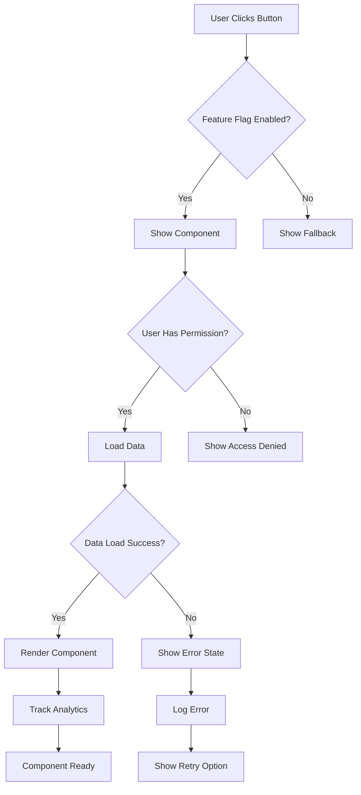
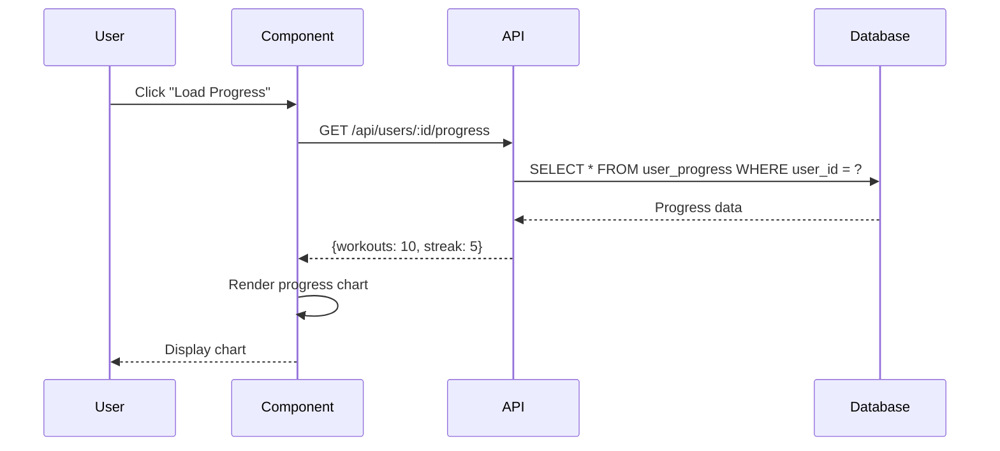
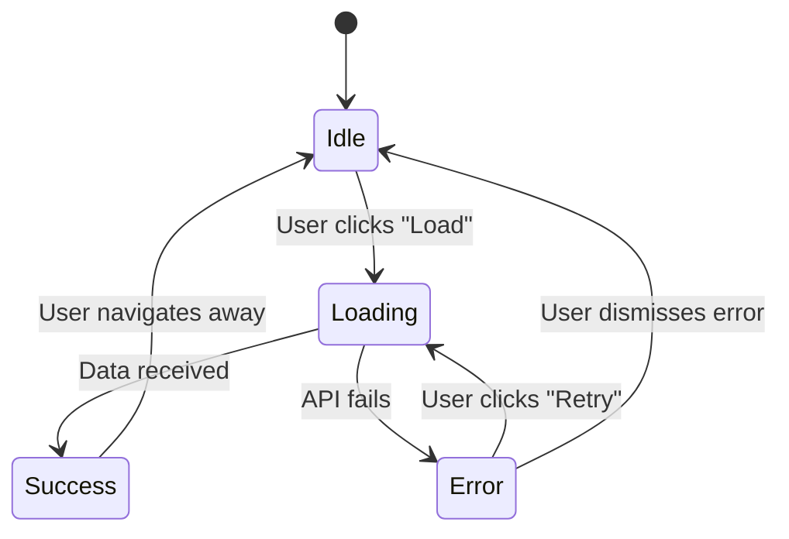
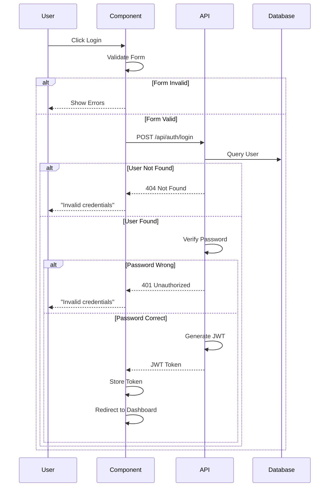
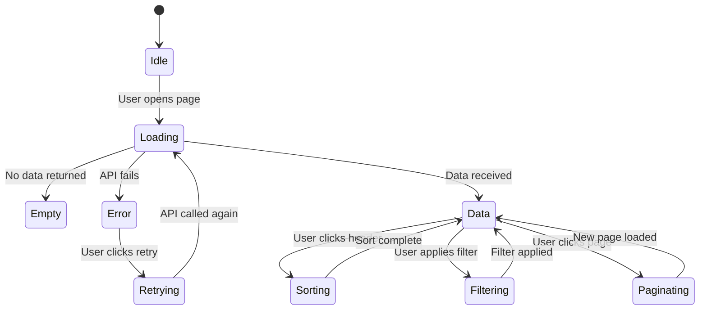

# SWANSTUDIOS AI VILLAGE HANDBOOK - FINAL EDITION
## Your Complete Guide to Building SwanStudios with AI Agents

**Last Updated:** 2025-10-28
**Your Situation:** Time-stressed, need revenue, have powerful AI tools already
**Goal:** Launch in 1-2 weeks, not 3 months

---

## 🚀 QUICK START: ONBOARDING NEW AIs

**Need to onboard an AI quickly?** Use these ready-made prompts:

1. **MASTER-AI-ONBOARDING-PROMPT.md** - Complete onboarding (full details, auto-role detection)
2. **QUICK-START-AI-PROMPT.md** - Fast onboarding (essential info only)
3. **COPY-PASTE-PROMPT.txt** - Ultra-compact (copy/paste into any chat)

**All prompts include:**
- Auto-detection of AI role based on which AI is reading
- "NO CODE WITHOUT APPROVAL" enforcement
- Phase 0 requirement explanation
- Project context and current status
- First message templates for each AI

**Location:** `AI-Village-Documentation/` directory

---

## 📚 TABLE OF CONTENTS

### PART I: YOUR CURRENT REALITY
1. Your Actual AI Arsenal (What You Have)
2. Your SwanStudios Project Status
3. The Big Decision: Fix vs. Rebuild
4. Cost Analysis (What You're Actually Spending)

### PART II: AI ROLE ASSIGNMENTS (THE CORE)
5. AI Village Role Mapping (Your Optimized Setup)
6. ChatGPT-5 Responsibilities
7. Claude 4.5 Sonnet Responsibilities
8. Roo Code + OpenRouter Strategy
9. Supporting Cast (Gemini, Codex, v0.dev)

### PART III: EXECUTION PLAYBOOK
10. Week 1 Launch Plan (Bug Fixes + Deploy)
11. Figma + v0.dev UI Workflow
12. AI Village Phased Adoption
12.5. Phase 0 Design Review System
13. Daily Workflow Examples

### PART IV: REFERENCE MATERIALS
14. Quick Decision Matrix
15. Cost Tracking
16. Troubleshooting
17. Next Steps After Launch

---

# PART I: YOUR CURRENT REALITY

---

## 1. YOUR ACTUAL AI ARSENAL

### **What You're Already Paying For (USE THESE!):**

#### **ChatGPT-5** 💰 ~$20/month (ChatGPT Plus/Pro)
- **Access:** Web interface, ChatGPT app, API
- **Strengths:** Multi-modal (text + images), excellent at testing, documentation, user stories
- **Best for:** QA, Product Management, Technical Writing, UX wireframes with images
- **Context:** 128K tokens
- **Special ability:** Can analyze screenshots, diagrams, Figma exports

#### **Codex (GPT-4)** 💰 Included in ChatGPT subscription
- **Access:** VS Code panel (you have this open)
- **Strengths:** Solid coding, good at general tasks
- **Best for:** Backup coder, code review, quick questions
- **Context:** 128K tokens

#### **Claude 4.5 Sonnet** 💰 $20/month (Claude Pro)
- **Access:**
  - **Claude Code (PRIMARY)** - Main Orchestrator in VS Code extension
  - **Claude Desktop (SPECIALIZED)** - Deployment monitor only (shares tokens with Claude Code)
- **Strengths:** Best at architecture, security, system design, long context
- **Best for:**
  - **Claude Code:** Main Orchestrator, Integration, Architecture, Security reviews
  - **Claude Desktop:** Render deployment issues ONLY (has MCP access to live deployment)
- **Context:** 200K tokens (shared between Claude Code + Desktop)
- **Token Budget:**
  - Claude Code: 80% (160K tokens) - use for daily work
  - Claude Desktop: 20% (40K tokens) - use ONLY for deployment emergencies
- **Rule:** If Claude Code can solve it in VS Code, don't use Claude Desktop

#### **Roo Code (Grok Code Fast 1)** 💰 ~$10-15/month
- **Access:** VS Code extension (routes to OpenRouter)
- **Model:** **Grok Code Fast 1** by xAI
- **Strengths:**
  - Speedy & economical reasoning model
  - Excels at agentic coding workflows
  - Visible reasoning traces (helps steer for quality)
  - Context: 256K tokens
  - Max output: 10K tokens
  - Supports prompt caching
- **Best for:** Heavy coding, backend implementation, refactoring
- **Pricing:**
  - Input: $0.20 / 1M tokens (very cheap!)
  - Output: $1.50 / 1M tokens
  - Cache reads: $0.02 / 1M tokens
- **Strategy:** Use Grok Code Fast 1 for most coding tasks (super cheap + fast)

#### **Gemini Code Assist** 💰 Free tier
- **Access:** VS Code panel (you have this open)
- **Strengths:** Excellent at React, frontend, Google Cloud
- **Best for:** Frontend coding, database optimization
- **Context:** 1M tokens (huge!)

### **Your Total Current Spend:**
- ChatGPT Pro: $20/month
- Claude Pro: $20/month (shared: Claude Code + Claude Desktop)
- Roo Code (Grok Code Fast 1): ~$10-15/month
- Gemini Code Assist: $0 (free tier)
- v0.dev: $0 (free tier, or $20/mo for Pro)
- **Total: ~$50-55/month (+ optional $20 for v0.dev Pro)**

---

## 2. YOUR SWANSTUDIOS PROJECT STATUS

### **Current Project Phase: ANALYSIS & REFACTORING** 🔄

**Status as of October 2025:**
- **Completion:** 80-90% feature complete
- **Current Focus:** Post-MUI Elimination, modernizing existing code
- **NOT building from scratch** - Refactoring and improving what exists
- **Goal:** Fix tech debt, improve Galaxy-Swan theme compliance, optimize performance

### **From Gemini's Analysis (WorkFlow.png):**

✅ **GOOD NEWS:**
- "Production Ready with comprehensive monitoring"
- "Extensive automation scripts"
- "Well organized separation of concerns"
- "Feature Rich component library"
- "Mobile Optimized with PWA features"
- **Estimated Completion: 80-90%**
- **Major Win:** MUI completely eliminated, custom UI Kit in place

⚠️ **CURRENT PRIORITIES (Analysis & Refactoring):**
- Modernize Homepage Hero (Phase 0 in progress)
- Fix blank pages (routing/data loading bugs)
- Runtime errors (API integration issues)
- Polish UX/UI with Galaxy-Swan theme consistency
- Refactor components to follow GOLDEN-STANDARD-PATTERN

### **Your Feature Inventory:**
- ✅ Client/Trainer/Admin dashboards (built)
- ✅ Gamification system (built)
- ✅ Progress tracking (built)
- ✅ Scheduling/sessions (built)
- ✅ Stripe payments (integrated)
- ✅ Mobile PWA (optimized)
- ⚠️ Olympian's Forge (AI workouts - may need completion)

---

## 3. THE BIG DECISION: FIX VS. REBUILD

### **THE ANSWER: FIX THIS SITE** ✅

**Why NOT Rebuild:**
1. You're 80-90% complete (would waste all that work)
2. Foundation is solid (Gemini confirmed)
3. Time = Money (3-6 months to rebuild vs. 1-2 weeks to fix)
4. Opportunity cost ($3000-6000 in lost revenue)
5. Current architecture is good enough for launch

**Time Comparison:**
| Approach | Time to Launch | Time to First Customer | Opportunity Cost |
|----------|----------------|------------------------|------------------|
| **Fix This Site** | 1-2 weeks | Week 3 | $0 |
| **Rebuild** | 3-6 months | Month 7 | $3000-6000 lost revenue |

**The Path:** Fix bugs (1 week) → Deploy (1 week) → Get customers (Week 3) → Polish with revenue (ongoing)

---

## 4. COST ANALYSIS

### **Current AI Spending:**
- ChatGPT Pro: $20/month
- Claude Pro: $20/month
- Roo Code: $15/month
- Gemini Code Assist: $0/month
- **Total: $55/month**

### **With Optimized OpenRouter (via Roo Code):**
- Same subscriptions: $55/month
- OpenRouter (mostly free models): +$5-10/month
- **Total: $60-65/month**

### **ROI When You Launch:**
- Week 3: First customer ($49-199/month)
- Month 2: 5-10 customers ($250-2000/month)
- **AI tools pay for themselves in Week 3!**

---

# PART II: AI ROLE ASSIGNMENTS (THE CORE)

---

## 5. AI VILLAGE ROLE MAPPING (YOUR OPTIMIZED SETUP)

### **THE STRATEGY:**
**Claude Code is Main Orchestrator. Roo Code (Grok Code Fast 1) handles heavy coding. Use specialized AIs for their strengths.**

### **PRIMARY AI ASSIGNMENTS:**

| AI Village Role | PRIMARY Tool | Why This Tool | Cost |
|-----------------|--------------|---------------|------|
| **🎯 Main Orchestrator** | **Claude Code (4.5 Sonnet)** | 200K context, best at architecture + integration + orchestration | $0 (included in Pro) |
| **💻 Primary Coder** | **Roo Code (Grok Code Fast 1)** | Super cheap ($0.20/1M), fast reasoning, agentic coding | ~$10-15/month |
| **⚛️ Frontend Specialist** | **Gemini Code Assist** | 1M context (huge!), excellent at React, free tier | $0 (free) |
| **🧪 QA Engineer** | **ChatGPT-5** | Multi-modal, excellent at testing + edge cases | $0 (included in Plus) |
| **🎨 UI Wireframing** | **v0.dev** | Generates pixel-perfect React components visually | $0-20/month |
| **🚀 Deployment Monitor** | **Claude Desktop** | MCP access to Render (use sparingly - shares Claude Code tokens) | $0 (included in Pro) |

### **BACKUP/SPECIALIZED TOOLS:**

| Role | Backup Tool | When to Use |
|------|-------------|-------------|
| Architecture | ChatGPT-5 | If Claude Code unavailable |
| Coding | Codex (GPT-4), Gemini | Quick questions, frontend work |
| Product Management | ChatGPT-5 | User stories, requirements |
| Tech Writing | ChatGPT-5, Claude Code | Documentation |
| Security Reviews | Claude Code (primary), Claude Desktop (if deployment-related) | OWASP ASVS L2 compliance |
| Performance | Gemini Code Assist (1M context), Roo Code | Database optimization, profiling |

### **TOKEN BUDGET MANAGEMENT:**

**Claude Pro (200K tokens shared):**
- **Claude Code:** 80% (160K tokens) - Daily orchestration, architecture, reviews
- **Claude Desktop:** 20% (40K tokens) - ONLY for Render deployment emergencies

**Rule:** If Claude Code (in VS Code) can solve it, don't use Claude Desktop.

### **Total Additional Cost: $10-35/month**
- Roo Code (Grok Code Fast 1): ~$10-15/month
- v0.dev: $0-20/month (free tier usually sufficient)

---

## 6. CHATGPT-5 RESPONSIBILITIES

### **Why ChatGPT-5 is a Game-Changer:**
- ✅ Multi-modal (can analyze Figma screenshots, UI mockups, error screenshots)
- ✅ Excellent at comprehensive testing and QA
- ✅ Best at documentation and technical writing
- ✅ Great at user stories and product management
- ✅ You're already paying for it!

### **Primary Roles for ChatGPT-5:**

#### **1. QA Engineer (PRIMARY)**
**Use for:**
- Generating comprehensive test suites
- Code review with security focus
- Edge case identification
- Testing strategy planning

**Workflow:**
```
1. Copy code from Roo Code implementation
2. Paste into ChatGPT-5
3. Prompt: "Act as QA Engineer. Generate: unit tests, integration tests, edge cases. Target 85% coverage."
4. ChatGPT-5 generates complete test suite
5. Copy tests back to your project
6. Run tests, fix failures
```

**Example Prompt:**
```
You are a QA Engineer for SwanStudios. Review this code:

[Paste code]

Provide:
1. Code review with line-by-line feedback
2. Unit tests (Jest + TypeScript)
3. Integration tests (API endpoints)
4. Edge cases (null, undefined, invalid inputs)
5. Security concerns
6. Coverage report estimate

Target: 85% logic coverage on changed files.
```

---

#### **2. Product Manager (PRIMARY)**
**Use for:**
- Writing user stories (Gherkin format)
- Prioritizing features (impact/effort matrix)
- Creating product roadmaps
- Defining acceptance criteria

**Workflow:**
```
1. Open ChatGPT-5
2. Describe feature idea
3. ChatGPT-5 generates: user stories, acceptance criteria, priority ranking
4. Save to BACKLOG.md
```

**Example Prompt:**
```
You are a Product Manager for SwanStudios (personal training platform).

Create user stories for: Client Progress Tracking Dashboard

Format (Gherkin):
As a [role]
I want to [action]
So that [benefit]

Acceptance Criteria:
Given [context]
When [action]
Then [outcome]

Also provide:
- Impact (High/Med/Low)
- Effort (S/M/L)
- Priority recommendation
```

---

#### **3. Technical Writer (PRIMARY)**
**Use for:**
- README.md updates
- API documentation
- User guides
- Developer onboarding docs

**Workflow:**
```
1. Give ChatGPT-5 your openapi.yaml or code
2. Prompt: "Generate API documentation"
3. Get beautiful markdown docs
4. Commit to /docs folder
```

**Example Prompt:**
```
You are a Technical Writer.

Generate API documentation from this OpenAPI spec:

[Paste openapi.yaml]

Output:
- README.md format
- Authentication examples
- Error handling examples
- Rate limiting explanation
- Request/response examples
- Quick start guide
```

---

#### **4. UX/UI Designer (PRIMARY for multi-modal)**
**Use for:**
- Analyzing Figma screenshots
- Critiquing UI mockups
- Creating user flows
- Accessibility review

**Workflow:**
```
1. Screenshot your Figma design or current UI
2. Upload to ChatGPT-5
3. Prompt: "Review this UI for UX issues and WCAG compliance"
4. Get detailed feedback
5. Iterate
```

**Example Prompt:**
```
[Upload Figma screenshot]

You are a UX/UI Designer.

Review this design for:
1. UX issues (confusing flows, unclear CTAs)
2. WCAG 2.1 AA compliance (contrast, font size, touch targets)
3. Mobile responsiveness concerns
4. Visual hierarchy
5. Accessibility improvements needed

Provide specific, actionable feedback.
```

---

## 7. CLAUDE 4.5 SONNET RESPONSIBILITIES

### **Why Claude 4.5 Sonnet is Your Secret Weapon:**
- ✅ 200K token context (sees entire architecture)
- ✅ Best at system design and security
- ✅ MCP connections (Claude Desktop sees your live codebase + Render)
- ✅ Excellent at long-form planning and documentation

### **Primary Roles for Claude 4.5 Sonnet:**

#### **1. Orchestrator (PRIMARY via Claude Desktop)**
**Use for:**
- Creating PLAN.md (master planning)
- Breaking down features into tickets
- Risk assessment
- Cost management

**Workflow:**
```
1. Open Claude Desktop
2. MCP automatically loads your codebase context
3. Paste: AI Village Orchestrator prompt (from original blueprint)
4. Add: Your feature description
5. Claude generates: PLAN.md with milestones, tickets, risks
6. Save to /docs/PLAN.md
```

**Example Prompt:**
```
[Paste Section 2.1 Orchestrator prompt from AI Village Blueprint]

HIGH-LEVEL GOAL:
Add multi-tenant Row-Level Security (RLS) to SwanStudios to support multiple organizations.

Requirements:
- Tenant isolation (organization_id on all tables)
- Sequelize scopes + middleware
- Zero downtime migration
- Backwards compatible for 1 sprint

Produce PLAN.md with: WBS, tickets, dependencies, risks, cost estimate.
```

---

#### **2. Architect (PRIMARY via Claude Desktop)**
**Use for:**
- Database schema design
- RLS policies
- API specifications (openapi.yaml)
- Security architecture (THREAT_MODEL.md)

**Workflow:**
```
1. Get PLAN.md from Orchestrator
2. Open NEW Claude Desktop chat
3. Paste: AI Village Architect prompt (Section 2.2)
4. Paste: Architect tickets from PLAN.md
5. Claude generates all artifacts:
   - schema.sql
   - RLS.sql
   - openapi.yaml
   - OBSERVABILITY.md
   - THREAT_MODEL.md
6. Save all to /docs
```

**Example Prompt:**
```
[Paste Section 2.2 Architect prompt from AI Village Blueprint]

CONTEXT FROM PLAN.md:
[Paste Architect tickets]

Stack:
- Frontend: React 18 + TypeScript + Styled-Components
- Backend: Node.js + Express + Sequelize ORM
- Database: PostgreSQL (multi-tenant)
- Auth: JWT + session cookies

Deliver ALL artifacts:
1. schema.sql
2. RLS.sql (Sequelize scopes for tenant isolation)
3. openapi.yaml
4. OBSERVABILITY.md
5. THREAT_MODEL.md
6. EXTERNAL_DEPS.md
7. API_VERSIONING.md
```

---

#### **3. AppSec (PRIMARY via Claude Desktop)**
**Use for:**
- Threat modeling (STRIDE)
- OWASP ASVS L2 compliance
- Security headers configuration
- Vulnerability analysis

**Workflow:**
```
1. Open Claude Desktop
2. Paste: AI Village AppSec prompt (Section 2.6)
3. Describe feature or system
4. Claude generates: THREAT_MODEL.md with mitigations
5. Implement mitigations
```

---

#### **4. SRE/DevOps (PRIMARY via Claude Code - me!)**
**Use for:**
- CI/CD pipeline (GitHub Actions)
- Deployment automation
- Monitoring setup (Sentry, Datadog)
- Runbooks

**Workflow:**
```
1. Ask me (Claude Code in VS Code) to create CI/CD
2. I generate: ci.yml, render.yaml, monitoring config
3. You commit, push
4. GitHub Actions runs automatically
```

**Example Prompt (ask me):**
```
Act as SRE. Create GitHub Actions CI/CD pipeline for SwanStudios.

Requirements:
- Lint (ESLint, Prettier)
- Typecheck (tsc --noEmit)
- Tests (Jest, 85% coverage gate)
- Security scan (Trivy, gitleaks)
- SBOM generation
- Deploy to Render (staging on merge to develop, prod on merge to main)
- Post preview URL to PR

Output: .github/workflows/ci.yml
```

---

## 8. ROO CODE + OPENROUTER STRATEGY

### **Why Roo Code is Your Workhorse:**
- ✅ Can route to ANY OpenRouter model
- ✅ FREE models available (DeepSeek V3 Free)
- ✅ Perfect for 80% of coding tasks

### **Roo Code Model Routing (Task-Based):**

| Task | Roo Code Model | Cost |
|------|----------------|------|
| **Backend API coding** | DeepSeek V3 Free | $0 |
| **Frontend React coding** | Gemini 2.5 Flash | $0.075/1M |
| **Database queries** | DeepSeek V3 Free | $0 |
| **Testing generation** | DeepSeek Coder | $0.14/1M |
| **Complex algorithms** | DeepSeek R1 Free | $0 |
| **Refactoring** | DeepSeek V3 Free | $0 |

### **Setup:**
1. Open Roo Code settings in VS Code
2. Connect to OpenRouter (add API key)
3. Set default: `deepseek/deepseek-v3:free`
4. Manually switch models based on task type

### **When to Use Roo Code:**
- ✅ 80% of daily coding (use free DeepSeek V3)
- ✅ Refactoring large codebases
- ✅ Implementing features from Architect specs
- ✅ Bug fixes

### **When to Use Backup (Codex GPT-4):**
- ⚠️ DeepSeek V3 fails on complex algorithm
- ⚠️ Need second opinion on tricky code
- ⚠️ Hit rate limit on free tier

---

## 9. SUPPORTING CAST

### **Gemini Code Assist**
**Best for:** Frontend React coding, Google Cloud, database optimization
**Use when:** Building React components, optimizing Sequelize queries
**Cost:** Free tier

### **Codex (GPT-4 in your panel)**
**Best for:** Backup coder, code review, quick questions
**Use when:** Roo Code fails, need second opinion
**Cost:** Included in ChatGPT subscription

### **v0.dev**
**Best for:** Converting Figma designs to React code
**Use when:** You have visual Figma mockup and need React component
**Cost:** Free tier (200 credits/month), Pro $20/month if needed

---

# PART III: EXECUTION PLAYBOOK

---

## 10. WEEK 1 LAUNCH PLAN

### **Day 1-2: Bug Audit**

**Use: Gemini Code Assist**
```
Prompt: "Analyze the entire SwanStudios codebase. Identify:
- Blank page issues (routes showing nothing)
- Runtime errors in console
- Broken API integrations
- Missing error boundaries

Prioritize: P0 (blocks revenue), P1 (major UX), P2 (minor), P3 (tech debt)"

Output: CRITICAL_BUGS.md
```

---

### **Day 3-4: Fix P0 Bugs**

**Use: Roo Code (DeepSeek V3 Free)**
```
For each P0 bug:
1. Open Roo Code
2. Set model: DeepSeek V3 Free
3. Prompt: "Fix this bug: [description]. Code: [paste code]"
4. Roo generates fix
5. Test manually
6. Commit
```

---

### **Day 5: Polish UI (Optional - if time)**

**Use: Figma + v0.dev + Gemini Code Assist**
```
1. Figma: Quick mockup with Magician AI
2. v0.dev: Convert to React code
3. Gemini Code Assist: Integrate into existing components
```

---

### **Day 6-7: Deploy**

**Use: Claude Code (me!)**
```
1. Ask me: "Create deployment checklist for SwanStudios on Render"
2. I generate: checklist + CI/CD if needed
3. You: Deploy to Render
4. You: Test live site
5. You: Create demo account for clients
```

---

## 11. UI WIREFRAMING & DESIGN WORKFLOW

### **CURRENT DECISION: Using v0.dev for UI Wireframing** ✅

**Status:** Figma not yet opened. v0.dev selected as primary UI wireframing tool for SwanStudios refactoring phase.

**Why v0.dev?**
- Generates pixel-perfect React components with actual code
- Visual preview instantly (see exactly what you'll get)
- Perfect for personal training/social media/gamification app layouts
- Supports Galaxy-Swan theme descriptions (cosmic, elegant, premium)
- Fast iteration (describe changes, get new version)
- Free tier sufficient for current needs

---

### **The Complete v0.dev UI Generation Pipeline:**

#### **Step 1: AI Village Brainstorm (30 minutes)**
**Use: Claude Code + Roo Code + Gemini + ChatGPT**

```
1. Open Claude Code (me!)
2. Describe feature: "We need a [page/component] for [purpose]"
3. I coordinate with AI Village to brainstorm:
   - Layout options (cards, grids, lists, etc.)
   - Galaxy-Swan theme elements (glass, gradients, swan motifs)
   - User interactions (clicks, hovers, animations)
   - Data requirements (API endpoints, state)
   - Accessibility needs (keyboard nav, screen readers)
4. Output: Comprehensive requirements doc
```

**Example:**
> "We need a Client Progress Dashboard that shows:
> - Weekly workout completion (progress ring chart)
> - Achievement badges (gamification)
> - Upcoming sessions (calendar view)
> - Current program details (card)
>
> Theme: Galaxy-Swan (glass cards, cosmic gradients, swan-shaped progress indicators)
> Interactions: Click badge to see details, hover for tooltips
> Mobile-first, WCAG AA compliant"

---

#### **Step 2: Create v0.dev Prompt (10 minutes)**
**Use: Claude Code or Grok Code Fast 1**

```
Ask AI: "Create a detailed v0.dev prompt for this design"

AI generates something like:

"Create a Client Progress Dashboard for a fitness platform with Galaxy-Swan theme:

LAYOUT:
- Main container: Glass card (rgba(255,255,255,0.06), backdrop-filter blur)
- Grid: 2x2 on desktop, stacked on mobile
- Border: Gradient border (cosmic purple to cyan)

COMPONENTS:
1. TOP LEFT: Progress Ring Chart
   - Circular progress (0-100%)
   - Center: "85% Complete"
   - Color: Gradient cyan to purple
   - Animation: Smooth fill on load

2. TOP RIGHT: Achievement Badges
   - 6 badges in 2 rows
   - Each: Icon + label
   - Unlocked: Full color + glow
   - Locked: Grayscale + 40% opacity
   - Hover: Scale 1.1 + tooltip

3. BOTTOM LEFT: Upcoming Sessions
   - Mini calendar view (next 7 days)
   - Highlighted dates with sessions
   - Click: Open session details

4. BOTTOM RIGHT: Current Program
   - Program name (display serif font)
   - Duration (e.g., "Week 3 of 12")
   - Progress bar
   - [View Details] button (cyan glow)

THEME:
- Background: linear-gradient(135deg, #0a0a1a 0%, #1e1e3f 60%, #2a1f4a 100%)
- Text: White (#FFFFFF)
- Accent: Cyan (#00FFFF) for CTAs
- Glass: backdrop-filter blur(12px)
- Border radius: 16px

INTERACTIONS:
- Badges: Hover shows tooltip with achievement name/date
- Sessions: Click opens modal with details
- Program card: Hover shows subtle glow
- All buttons: Cosmic breath animation (1% scale pulse, 180ms)

ACCESSIBILITY:
- ARIA labels on all interactive elements
- Keyboard navigation support
- Focus states visible (cyan ring)
- Screen reader friendly

TECH:
- React + TypeScript
- Tailwind CSS (or inline styles)
- Responsive (mobile-first)
- Dark mode compatible"

Copy this entire prompt.
```

---

#### **Step 3: Generate in v0.dev (5 minutes)**

```
1. Go to: https://v0.dev
2. Paste the detailed prompt
3. Click "Generate"
4. Wait ~30 seconds
5. Review visual preview
6. If needed: Click "Edit" and refine prompt
7. Click "Copy Code" when satisfied
```

**You get:**
- ✅ Pixel-perfect React component
- ✅ Visual preview (see before implementing)
- ✅ Actual code (copy-paste ready)
- ✅ Variations (v0 often shows 2-3 options)

---

#### **Step 4: AI Village Review (15 minutes)**

**Share v0 link with all AIs:**

```
"Here's the v0.dev wireframe: [paste link]

Please review:
- Does layout match Galaxy-Swan theme?
- Are interactions clear?
- Any accessibility concerns?
- Performance considerations?
- Integration with existing components?"
```

**Each AI provides feedback:**
- Claude Code: Architecture fit, integration risks
- Roo Code (Grok): Code quality, optimization
- Gemini: React patterns, frontend best practices
- ChatGPT: UX/accessibility, edge cases

**Refine based on feedback**, regenerate in v0.dev if needed.

---

#### **Step 5: Integrate with Roo Code or Gemini (30-60 minutes)**

```
1. Copy v0.dev code
2. Create new file: [ComponentName].tsx
3. Paste v0.dev code

4. Use Roo Code (Grok Code Fast 1) or Gemini to:
   - Convert Tailwind to styled-components (if needed)
   - Add Galaxy-Swan theme tokens
   - Connect API endpoints
   - Add error handling
   - Add loading states
   - Implement actual data fetching
   - Add swan motifs (crest, wing dividers, etc.)

5. Test in Storybook or dev environment
6. Refine animations/interactions
7. Commit to repo
```

---

### **UI Wireframing Decision Tree:**

**"Which tool should I use for UI wireframing right now?"**

```
START: Need UI design for SwanStudios
│
├─ Building NEW page/component?
│  └─ YES → Use v0.dev
│      1. Brainstorm with AI Village
│      2. Create detailed v0.dev prompt
│      3. Generate in v0.dev
│      4. Review with AIs
│      5. Integrate with Roo Code/Gemini
│
├─ Analyzing EXISTING component?
│  └─ YES → Use Gemini Code Assist
│      - 1M context can see entire codebase
│      - Excellent at suggesting improvements
│      - Can generate refactoring plan
│
├─ Quick layout suggestion?
│  └─ YES → Use Grok Code Fast 1 (Roo Code)
│      - Fast reasoning
│      - Can describe layout in text
│      - Cheap (no visual generation needed)
│
└─ Need high-fidelity mockup for client presentation?
   └─ Consider Figma (future project)
       - Professional polish
       - Client-ready presentations
       - NOT for current refactoring phase
```

---

### **Example v0.dev Use Cases for SwanStudios:**

1. **Homepage Hero Enhancement** (current Phase 0)
   - Wireframe new hero layout
   - Show trust panel with stats
   - Visualize video carousel
   - Test testimonial card designs

2. **Gamification Dashboard**
   - Achievement badge grid
   - Progress charts
   - Leaderboard component
   - Level-up animations

3. **Trainer Dashboard**
   - Client overview cards
   - Session calendar
   - Analytics widgets
   - Quick action buttons

4. **Social Feed Component**
   - Post cards with reactions
   - Comment threads
   - Media attachments
   - Infinite scroll layout

---

### **Total Time per Component:**
- **AI Brainstorm:** 30 min
- **v0.dev Prompt:** 10 min
- **v0.dev Generation:** 5 min
- **AI Review:** 15 min
- **Integration:** 30-60 min
- **TOTAL: 1.5-2 hours** (vs. 6-8 hours designing + coding from scratch)

---

### **Cost:**
- **v0.dev Free Tier:** ~10 generations/month (sufficient for current refactoring)
- **v0.dev Pro:** $20/month unlimited (consider if doing heavy UI work)
- **Recommendation:** Start with free tier, upgrade only if needed

---

## 12. AI VILLAGE PHASED ADOPTION

### **Phase 1 (Week 1-2): SKIP IT - FIX BUGS FAST**
- ❌ Don't use Orchestrator
- ❌ Don't use Architect
- ✅ Just use Roo Code + Gemini for quick fixes

### **Phase 2 (Week 3-4): LIGHT AI VILLAGE**
- ✅ Use ChatGPT-5 for QA (test generation)
- ✅ Use Claude Code for CI/CD setup
- ⚠️ Still skip heavy planning

### **Phase 3 (Month 2+): FULL AI VILLAGE** ✅ (CURRENT PHASE)
- ✅ Use **Claude Code** as Main Orchestrator (not Claude Desktop)
- ✅ Use **Claude Code** for Architecture + Integration + Security
- ✅ Use **Claude Desktop** only for Render deployment issues (20% of tokens)
- ✅ Full Phase 0 Design Review (5 AI consensus before coding)
- ✅ 7-Checkpoint Pipeline for all implementations
- ✅ Workflow: Claude Code (Orchestrate) → Roo Code (Implement) → Gemini/ChatGPT (Review) → Deploy

### **AI Onboarding (For All New Sessions)**
- ✅ **Copy the Master Onboarding Prompt** from `AI-Village-Documentation/AI-VILLAGE-MASTER-ONBOARDING-PROMPT.md`
- ✅ **Paste it to ANY AI** when starting a new session
- ✅ **AI will auto-detect their role** and follow proper protocols
- ✅ **Ensures consistent behavior** across all AI Village members

---

## 12.5 PHASE 0 DESIGN REVIEW SYSTEM

### **Why Phase 0 Exists**

**The Golden Rule:** NO CODE IS WRITTEN UNTIL ALL 5 AIs APPROVE THE DESIGN AND COMPLETE COMPONENT DOCUMENTATION EXISTS

**Why This Matters:**
- Catch design flaws before coding (saves hours)
- Ensure Galaxy-Swan theme compliance
- Validate security, performance, accessibility upfront
- All AIs aligned on implementation approach

### **The 5 AI Reviewers**

| AI | Primary Role | Secondary Role | Focus Areas |
|----|--------------|----------------|-------------|
| **Claude Code** | Integration Specialist | Architecture Review | System fit, breaking changes, dependencies |
| **Roo Code (Grok)** | Backend Implementation | Database Design | API design, schema, performance, RLS |
| **ChatGPT-5** | QA Engineer | Product Management | Testability, edge cases, user acceptance |
| **Claude Desktop** | Orchestrator | Security Expert | System coherence, OWASP ASVS L2, multi-tenant |
| **Gemini Code Assist** | Frontend Logic | React Specialist | Component patterns, accessibility, performance |

### **Phase 0 Process**

1. **Create Design Review**
   - Copy `docs/ai-workflow/templates/PHASE-0-REVIEW-TEMPLATE.md`
   - Save to `docs/ai-workflow/reviews/[feature-name].md`
   - Add to `docs/ai-workflow/PHASE-0-REGISTRY.md`

2. **Document Design**
   - Wireframes/mockups
   - User stories with acceptance criteria
   - API specifications
   - Database schema
   - Technical requirements (including Galaxy-Swan Theme Gate)

3. **Get 5 AI Reviews**
   - Each AI appends review directly to the feature file
   - Track approvals in PHASE-0-REGISTRY.md

4. **Resolve Concerns**
   - Document in Resolution Log
   - Make necessary design changes
   - Get re-approval from concerned AIs

5. **Reach Consensus**
   - All 5 AIs approve (✅)
   - Move to "Consensus Reached" in registry
   - **Only then** → Proceed to Phase 1-7 implementation

### **File Structure**

```
docs/ai-workflow/
├── PHASE-0-REGISTRY.md                    ← Central index (start here)
├── reviews/                               ← Active reviews (one file per feature)
│   └── homepage-hero-enhancement.md       ← Current: 3/5 approved
├── templates/
│   └── PHASE-0-REVIEW-TEMPLATE.md         ← Copy this for new reviews
└── archive/
    └── completed-YYYY-MM.md               ← Completed reviews by month
```

### **Galaxy-Swan Theme Gate**

All Phase 0 reviews must include this checklist to prevent generic template designs:

- ✅ Galaxy core gradient + starfield background
- ✅ Glass surfaces with gradient borders
- ✅ Cosmic micro-interactions (120-180ms scale pulse)
- ✅ Display serif for H1/H2 headings
- ✅ Swan motifs (crest, wing dividers, constellation patterns)
- ✅ No generic template visuals

**Reference:** `docs/current/GALAXY-SWAN-THEME-DOCS.md`

### **Two Pathways: Building New vs. Refactoring Existing**

Phase 0 works differently depending on whether you're building something new or refactoring existing code:

#### **Pathway 1: Building NEW Features** (Traditional)
```
1. Wireframe in v0.dev (new layout)
2. Write user stories (new functionality)
3. Design API endpoints (new data)
4. Create database schema (new tables)
5. Get 5 AI approvals
6. Implement Phase 1-7
```

**Example:** Adding a new "Social Feed" feature that doesn't exist yet

---

#### **Pathway 2: Analyzing & Refactoring EXISTING Code** (Current Focus)
```
1. ANALYZE current state
   - Document what exists (wireframe current layout)
   - Identify issues (tech debt, theme violations, performance)
   - List constraints (can't break existing features)

2. PROPOSE improvements
   - Show before/after comparison
   - Explain rationale (why change?)
   - Document migration strategy (how to preserve data?)

3. VALIDATE approach
   - Get 5 AI reviews of refactoring plan
   - Ensure backward compatibility
   - Plan rollback strategy

4. IMPLEMENT incrementally
   - Phase 1-7 with emphasis on testing existing functionality
   - Feature flags for gradual rollout
   - Monitoring for regressions
```

**Example:** Homepage Hero Enhancement (current Phase 0)
- **Current:** Simple hero with title + buttons + video
- **Proposed:** Enhanced hero with trust panel + social proof + video carousel
- **Constraints:** Keep existing video (users rely on it), maintain current routing
- **Migration:** Add new components alongside old, test thoroughly, switch when ready

---

### **When to Use Which Pathway:**

| Situation | Pathway | Why |
|-----------|---------|-----|
| Homepage modernization | **Refactoring** | Enhancing existing page (80% done) |
| New social feed feature | **Building New** | Feature doesn't exist yet |
| Fix blank pages | **Refactoring** | Pages exist, fixing bugs |
| Add payment tiers | **Building New** | New functionality |
| Improve gamification | **Refactoring** | System exists, improving UX |
| Mobile app (future) | **Building New** | Completely new platform |

**Current SwanStudios Status:** Mostly **Pathway 2** (refactoring 80-90% complete codebase)

---

### **Quick Start Commands**

**Create new Phase 0 review:**
```bash
cp docs/ai-workflow/templates/PHASE-0-REVIEW-TEMPLATE.md \
   docs/ai-workflow/reviews/my-feature-name.md
```

**Check active reviews:**
```bash
cat docs/ai-workflow/PHASE-0-REGISTRY.md
```

**Get AI prompts:**
```bash
# See docs/ai-workflow/AI-ROLE-PROMPTS.md
# Copy-paste prompts for each AI reviewer
```

### **Current Status (as of 2025-10-29)**

- **Active Reviews:** 4 Phase 0 packets (Week 0 comprehensive audit)
- **Status:** Awaiting AI Village distribution (0/20 approvals)
- **Next:** Component Documentation Standards implementation
- **Timeline:** Component docs required before all future implementations

### **Benefits**

- ✅ **Scalable:** One file per feature, unlimited features
- ✅ **Fast:** No more 1500-line files
- ✅ **Clear Status:** Registry shows what's active, pending, completed
- ✅ **Historical Record:** Archives preserve all decisions by month
- ✅ **AI-Friendly:** Focused context, consistent structure
- ✅ **Error Prevention:** Component docs ensure 0 implementation errors

---

## 12.6 COMPONENT DOCUMENTATION STANDARDS

### **The Zero-Error Implementation Protocol**

**Core Principle:** "If an AI can read the documentation and implement the component without asking a single question, the documentation is complete."

**Version:** 1.0
**Effective:** Immediately
**Purpose:** Reduce implementation errors to 0% through crystal-clear specifications

---

### **Why Component Documentation Matters**

**The Problem We're Solving:**
- Implementation errors due to ambiguous requirements
- Back-and-forth questions during coding ("What should happen if...?")
- Misunderstood edge cases leading to bugs
- Inconsistent UI across components
- Security vulnerabilities from unclear specifications

**The Solution:**
Comprehensive Mermaid diagrams, wireframes, and flowcharts that document EVERY detail before coding begins.

---

### **Required Documentation Types (3 Core Types)**

#### **1. Mermaid Diagrams (Technical Flow)**

**Purpose:** Visual representation of logic, states, and interactions
**Tools:** Mermaid.js syntax in .md files
**Location:** `docs/ai-workflow/component-docs/[component-name]/[component-name].mermaid.md`

**Required Diagram Types:**
- **Flowchart:** User interactions and decision points
- **Sequence Diagram:** API calls and data flow
- **State Diagram:** Component states and transitions
- **Gantt Chart:** Implementation timeline and dependencies

**Example Flowchart:**


**Example Sequence Diagram:**


**Example State Diagram:**


---

#### **2. Wireframes (Visual Design)**

**Purpose:** Pixel-perfect visual specification
**Tools:** Figma, v0.dev, or ASCII art
**Location:** `docs/ai-workflow/component-docs/[component-name]/[component-name].wireframe.png`
**Format:** High-fidelity with annotations

**Required Elements:**
- ✅ All UI states (loading, error, empty, success)
- ✅ Responsive breakpoints (mobile 320px, tablet 768px, desktop 1280px)
- ✅ Accessibility annotations (focus rings, ARIA labels, touch targets)
- ✅ Color scheme (Galaxy-Swan theme tokens)
- ✅ Typography hierarchy (font sizes, weights, line heights)
- ✅ Spacing and sizing (margins, padding, gaps)
- ✅ Interactive elements clearly marked (buttons, links, hover states)

**Wireframe Annotation Format:**
```
[Component Name: User Progress Chart]

Mobile (320px-767px):
- Chart: Full width, 300px height
- Legend: Below chart, stacked vertically
- Touch targets: 44x44px minimum

Tablet (768px-1279px):
- Chart: 50% width, 400px height
- Legend: Right side of chart, 25% width
- Touch targets: 44x44px minimum

Desktop (1280px+):
- Chart: 60% width, 500px height
- Legend: Right side of chart, 20% width
- Mouse hover: Show tooltip on data points

States:
- Loading: Skeleton chart with shimmer animation
- Empty: "No progress yet" message + CTA
- Error: Red banner + retry button
- Success: Animated chart with data

Accessibility:
- ARIA label: "User workout progress over last 30 days"
- Keyboard nav: Arrow keys to navigate data points
- Screen reader: Announce data values on focus
- High contrast: Border on chart elements

Galaxy-Swan Theme:
- Background: Glass card (rgba(255,255,255,0.06), blur(12px))
- Border: Gradient (cosmic purple to cyan)
- Chart colors: Purple, cyan, pink gradients
- Typography: Display serif for title, sans-serif for data
```

---

#### **3. Flowcharts (Business Logic)**

**Purpose:** Decision trees and error handling
**Tools:** Draw.io or Mermaid
**Location:** `docs/ai-workflow/component-docs/[component-name]/[component-name].flowchart.md`

**Required Coverage:**
- ✅ All user paths through component
- ✅ Error handling for every API call
- ✅ Loading states and transitions
- ✅ Feature flag logic
- ✅ Permission checks
- ✅ Data validation rules
- ✅ Rollback procedures

**Example Business Logic Flowchart:**
```
START: User opens dashboard
│
├─ Check feature flag "new_dashboard_enabled"
│  ├─ FALSE → Redirect to old dashboard
│  └─ TRUE → Continue
│
├─ Check user role
│  ├─ CLIENT → Load client dashboard data
│  ├─ TRAINER → Load trainer dashboard data
│  ├─ ADMIN → Load admin dashboard data
│  └─ UNKNOWN → Show access denied
│
├─ Fetch dashboard data
│  ├─ API call: GET /api/dashboard/:userId
│  ├─ Success (200) → Parse data
│  │  ├─ Data valid → Render dashboard
│  │  └─ Data invalid → Show error + log
│  ├─ Unauthorized (401) → Redirect to login
│  ├─ Forbidden (403) → Show access denied
│  ├─ Not Found (404) → Show "Create profile" CTA
│  ├─ Server Error (500) → Show error + retry button
│  └─ Network Error → Show offline banner + retry
│
└─ END: Dashboard rendered OR error handled
```

---

### **File Organization**

```
docs/ai-workflow/component-docs/
├── [component-name]/
│   ├── README.md                      ← Overview and links
│   ├── [component-name].mermaid.md    ← Mermaid diagrams (flowchart, sequence, state)
│   ├── [component-name].wireframe.png ← Visual design (all states, all breakpoints)
│   ├── [component-name].flowchart.md  ← Business logic (decision trees, error handling)
│   ├── [component-name].api-spec.md   ← API endpoints (request/response, errors)
│   ├── [component-name].test-spec.md  ← Test scenarios (unit, integration, E2E)
│   └── [component-name].a11y.md       ← Accessibility (WCAG, keyboard nav, screen readers)
```

**Example: ProgressChart Component**
```
docs/ai-workflow/component-docs/
└── progress-chart/
    ├── README.md                      # "ProgressChart displays user workout progress over time"
    ├── progress-chart.mermaid.md      # Flowchart, sequence diagram, state diagram
    ├── progress-chart.wireframe.png   # Mobile/tablet/desktop designs
    ├── progress-chart.flowchart.md    # Business logic for data fetching, error handling
    ├── progress-chart.api-spec.md     # GET /api/users/:id/progress endpoint spec
    ├── progress-chart.test-spec.md    # Unit tests, integration tests, E2E tests
    └── progress-chart.a11y.md         # WCAG compliance, ARIA labels, keyboard nav
```

---

### **AI Village Responsibilities**

| AI | Documentation Type | Review Focus |
|----|-------------------|--------------|
| **Claude Code** | Orchestrates all documentation creation and final review | Integration, architecture, completeness |
| **Roo Code** | Backend API flowcharts, database diagrams, error handling flows | Technical accuracy, performance, SQL optimization |
| **Gemini** | UI wireframes, component state diagrams, responsive design | Visual design, UX, accessibility, React patterns |
| **ChatGPT-5** | User flow diagrams, accessibility annotations, test scenarios | User experience, edge cases, QA, WCAG compliance |
| **Claude Desktop** | Security flowcharts, audit trail diagrams, permission flows | Security, compliance, data protection, OWASP |

---

### **Documentation Creation Workflow**

#### **Phase 1: Post-Phase 0 Approval**
1. Claude Code assigns documentation tasks to AIs based on expertise
2. Each AI creates their assigned documentation types
3. Documentation stored in `component-docs/[component-name]/` folder
4. All files committed to Git (version controlled)

#### **Phase 2: AI Village Review**
1. All 5 AIs review ALL documentation (not just their own)
2. Each AI provides ✅ approval or ⚠️ concerns in review comments
3. Concerns addressed by responsible AI (e.g., Gemini fixes wireframe issues)
4. Re-review until all 5 AIs approve

#### **Phase 3: Human Confirmation**
1. Claude Code presents complete documentation package
2. Human reviews for business logic accuracy
3. Human provides final ✅ approval
4. Documentation locked (no changes without new review)

#### **Phase 4: Implementation**
1. Roo Code implements backend (must match flowcharts EXACTLY)
2. Gemini implements frontend (must match wireframes EXACTLY)
3. No deviations from documentation allowed without new Phase 0 review
4. Code reviewers check against documentation during PR review

#### **Phase 5: Validation**
1. ChatGPT-5 validates implementation against documentation
2. Automated tests verify documented behavior (test spec coverage)
3. Performance tests validate documented metrics (<2s load time)
4. Accessibility tests validate WCAG compliance (axe-core)

---

### **Quality Assurance Checklist**

**Completeness (100% Required):**
- [ ] All user interactions documented (clicks, hovers, keyboard)
- [ ] All API calls specified with error handling (200, 401, 403, 404, 500, network error)
- [ ] All component states defined (loading, empty, error, success)
- [ ] All edge cases covered (null, undefined, empty arrays, invalid data)
- [ ] All accessibility requirements listed (ARIA, keyboard nav, screen reader)
- [ ] All performance requirements specified (<2s load, <200KB bundle)
- [ ] All security considerations documented (auth, permissions, data validation)

**Clarity (AI-Readable):**
- [ ] No ambiguous language ("should probably", "might want to")
- [ ] All acronyms defined (RLS = Row-Level Security)
- [ ] All dependencies listed (libraries, APIs, other components)
- [ ] All assumptions stated ("Assumes user is logged in")
- [ ] All constraints documented ("Must work with IE11")
- [ ] All success criteria defined ("User sees confirmation message")

**Safety (Live Site Protection):**
- [ ] Feature flags documented in flowcharts
- [ ] Rollback procedures specified
- [ ] Error boundaries defined
- [ ] Loading states handled (skeleton UI)
- [ ] Performance monitoring included (Sentry, analytics)
- [ ] User impact assessment completed (affects X users)

---

### **Success Metrics**

**Error Prevention:**
- **Target:** 0 questions asked during implementation
- **Target:** 0 deviations from documented behavior
- **Target:** 0 post-implementation bugs from misunderstood requirements

**Quality Metrics:**
- **Documentation Coverage:** 100% of components documented
- **Review Completion:** 5/5 AI approvals before implementation
- **Human Confirmation:** Required for all components
- **Test Coverage:** 100% of documented behavior tested

**Efficiency Metrics:**
- **Implementation Time:** 50% reduction in back-and-forth
- **Bug Fix Time:** 80% reduction in clarification requests
- **Review Time:** 30% faster due to clear specifications

---

### **Integration with Existing Processes**

**Phase 0 Packets:**
- Include documentation requirements in design packets
- Link to component documentation in approval requests
- Block Phase 1-7 implementation without complete docs

**AI Village Handbook:**
- Component Documentation Standards (this section)
- Reference in all implementation workflows
- Include in AI onboarding prompts

**Implementation Pipeline:**
- Documentation completeness as merge requirement
- Automated checks for documentation presence
- CI/CD blocks commits without approved documentation

---

### **Examples by Component Type**

#### **Example 1: User Authentication Component**

**Mermaid Flowchart:**


**Wireframe Annotations:**
- Email field: Required, email validation, autofocus
- Password field: Required, show/hide toggle, autocomplete="current-password"
- Login button: Primary style, disabled during submit, shows spinner
- Error message: Red text below form, ARIA role="alert"
- Loading state: Spinner on button, form fields disabled
- Success state: Redirect with fade transition (200ms)

**Flowchart Decisions:**
- Invalid email → Show "Please enter valid email"
- Wrong password → Show "Invalid credentials" (don't reveal which field is wrong for security)
- Network error → Show "Connection failed, please retry"
- Success → Redirect with token stored in httpOnly cookie

---

#### **Example 2: Data Table Component**

**State Diagram:**


**Wireframe Annotations:**
```
Desktop (1280px+):
- Table: Full width, max 10 rows per page
- Headers: Sortable (click to sort, arrow indicator)
- Rows: Hover effect (light glow), click to expand
- Pagination: Bottom center, << < [1] 2 3 > >>

Mobile (320px-767px):
- Table: Convert to cards (stacked vertically)
- Each card: Show key fields only (name, status)
- Expand card: Tap to see all fields
- Pagination: Simplified (<  1 of 5  >)

States:
- Loading: Skeleton rows (3 shimmer rows)
- Empty: "No data yet" + illustration + CTA
- Error: Red banner + retry button
- Success: Animated table with data

Interactions:
- Click header → Sort by that column (toggle asc/desc)
- Click row → Expand/collapse details
- Hover row → Highlight with glow
- Keyboard: Tab to navigate rows, Enter to expand
```

**API Spec:**
```markdown
GET /api/users

Query Parameters:
- page: number (default: 1)
- limit: number (default: 10, max: 100)
- sort: string (field name, e.g., "name")
- order: "asc" | "desc" (default: "asc")
- filter: object (e.g., {role: "client"})

Response (200 OK):
{
  "data": [
    {"id": 1, "name": "John Doe", "role": "client"}
  ],
  "pagination": {
    "page": 1,
    "limit": 10,
    "total": 42,
    "pages": 5
  }
}

Errors:
- 401: User not authenticated
- 403: User lacks permission
- 500: Server error
```

---

### **Enforcement**

**Zero Tolerance Policy:**
- ❌ No implementation without complete documentation
- ❌ No deviations from approved documentation
- ❌ No commits without documentation review

**Consequences:**
- Implementation blocked without documentation (CI/CD gate)
- Code reverted if it doesn't match documentation
- AI reassigned if documentation quality is poor

**Continuous Improvement:**
- Monthly review of documentation effectiveness
- Updates to standards based on lessons learned
- Training for AIs on documentation best practices

---

### **Documentation Workflow Summary**

```
1. Phase 0 Approval (Design)
   ↓
2. Create Component Documentation
   - Mermaid diagrams (flowchart, sequence, state)
   - Wireframes (mobile, tablet, desktop)
   - Flowcharts (business logic, error handling)
   - API spec (endpoints, errors)
   - Test spec (unit, integration, E2E)
   - Accessibility spec (WCAG, ARIA, keyboard)
   ↓
3. AI Village Review (5 AIs review ALL docs)
   ↓
4. Human Confirmation (final approval)
   ↓
5. Implementation (code matches docs EXACTLY)
   ↓
6. Validation (tests verify documented behavior)
   ↓
7. Deployment (feature flags, canary rollout)
```

**Timeline per Component:**
- Documentation creation: 2-3 hours
- AI Village review: 1-2 hours
- Human confirmation: 30 minutes
- **Total before implementation:** 3.5-5.5 hours
- **ROI:** 50% reduction in implementation errors + 80% reduction in clarification requests

---

### **Quick Start: Creating Component Documentation**

**Step 1: Create folder**
```bash
mkdir -p docs/ai-workflow/component-docs/my-component
```

**Step 2: Create files**
```bash
cd docs/ai-workflow/component-docs/my-component
touch README.md
touch my-component.mermaid.md
touch my-component.wireframe.png
touch my-component.flowchart.md
touch my-component.api-spec.md
touch my-component.test-spec.md
touch my-component.a11y.md
```

**Step 3: Assign to AIs**
- **Roo Code:** API spec, database schema
- **Gemini:** Wireframes, state diagram
- **ChatGPT-5:** Test spec, accessibility spec
- **Claude Code:** Flowchart, integration review
- **Claude Desktop:** Security review, audit trail

**Step 4: AI Village Review**
Each AI reviews ALL docs, not just their own.

**Step 5: Human Confirmation**
Final approval before implementation begins.

---

### **Current Implementation Status**

**As of 2025-10-29:**
- ✅ Component Documentation Standards defined
- ⏳ Week 0 Phase 0 packets awaiting AI Village approval
- ⏳ First components to document: Admin Dashboard (12 files with MUI)
- ⏳ Documentation workflow to begin after 20/20 Phase 0 approvals

**Next Steps:**
1. Get 20/20 approvals on Week 0 Phase 0 packets
2. Create documentation for first batch of MUI elimination components
3. Validate documentation workflow with 1-2 pilot components
4. Roll out to all future implementations

---

## 13. DAILY WORKFLOW EXAMPLES

### **Example 1: "Add New API Endpoint"**

**Tools: Claude Desktop → Roo Code → ChatGPT-5**

```
Step 1: Planning (Claude Desktop)
- Prompt: "I need a new API endpoint: POST /api/workouts. Plan the implementation."
- Claude outputs: Required changes, database schema updates, testing strategy

Step 2: Implementation (Roo Code → DeepSeek V3 Free)
- Prompt: "Implement POST /api/workouts endpoint. Spec: [paste from Claude]"
- Roo generates: Controller, route, Sequelize model, migration

Step 3: Testing (ChatGPT-5)
- Prompt: "Generate tests for this endpoint: [paste code]"
- ChatGPT-5 generates: Unit tests, integration tests, edge cases

Step 4: Deploy (Claude Code - me!)
- Prompt: "Create PR checklist for this change"
- I generate: PR template with all quality gates
```

---

### **Example 2: "Fix Blank Page Bug"**

**Tools: Gemini Code Assist → Roo Code**

```
Step 1: Diagnose (Gemini Code Assist)
- Prompt: "Why is /client-dashboard showing blank page? Check routes, data loading, error boundaries."
- Gemini identifies: Missing error boundary, API call failing silently

Step 2: Fix (Roo Code → DeepSeek V3 Free)
- Prompt: "Add error boundary to ClientDashboard. Handle failed API gracefully."
- Roo generates fix

Step 3: Test manually
- Load page, verify error is caught and displayed properly
```

---

### **Example 3: "Design & Build New UI Component"**

**Tools: ChatGPT-5 → Figma → v0.dev → Gemini Code Assist**

```
Step 1: UX Planning (ChatGPT-5)
- Upload rough sketch or describe feature
- Prompt: "Design user flow for trainer creating a workout template"
- ChatGPT-5 outputs: User flow diagram, wireframe description

Step 2: Visual Design (Figma + Magician)
- Use ChatGPT-5's wireframe description
- Magician AI generates visual mockup
- Export PNG

Step 3: Code Generation (v0.dev)
- Upload PNG to v0.dev
- Get React code

Step 4: Integration (Gemini Code Assist)
- Prompt: "Integrate this v0.dev component. Connect to /api/workout-templates"
- Gemini adds API calls, state management
```

---

# PART IV: REFERENCE MATERIALS

---

## 14. QUICK DECISION MATRIX

| I need to... | Use this tool | Why |
|--------------|---------------|-----|
| **Plan a new feature** | Claude Desktop (Orchestrator) | Best at planning + has MCP context |
| **Design database schema** | Claude Desktop (Architect) | Best at system design |
| **Code backend API** | Roo Code (DeepSeek V3 Free) | Free, great at backend |
| **Code frontend React** | Gemini Code Assist | Great at React |
| **Convert Figma to code** | v0.dev | Best at visual → code |
| **Generate tests** | ChatGPT-5 | Best at comprehensive QA |
| **Review code** | ChatGPT-5 or Codex | Both excellent at code review |
| **Write documentation** | ChatGPT-5 | Best at docs |
| **Setup CI/CD** | Claude Code (me!) | Best at DevOps |
| **Security review** | Claude Desktop | Best at security |
| **Fix a bug** | Roo Code (DeepSeek V3 Free) | Fast, free |
| **Optimize database** | Roo Code (DeepSeek V3 Free) | Good at SQL |

---

## 15. COST TRACKING

### **Your Monthly AI Budget:**

**Fixed Costs (Subscriptions):**
- ChatGPT Pro: $20/month
- Claude Pro: $20/month
- Roo Code: $15/month
- Gemini Code Assist: $0/month (free tier)
- **Subtotal: $55/month**

**Variable Costs (OpenRouter via Roo Code):**
- DeepSeek V3 Free: $0 (use 80% of time)
- Gemini 2.5 Flash: ~$2/month (frontend work)
- DeepSeek Coder: ~$1/month (testing)
- v0.dev: $0-20/month (free tier usually enough)
- **Subtotal: $0-25/month**

**Total: $55-80/month**

**ROI After Week 3 Launch:**
- First customer: $49-199/month
- AI tools pay for themselves immediately! ✅

---

## 16. TROUBLESHOOTING

### **"Roo Code fails on complex task"**
→ Switch to Codex (GPT-4) in your panel

### **"ChatGPT-5 gives generic answer"**
→ Provide more context, paste actual code/screenshots

### **"Claude Desktop doesn't see my codebase"**
→ Check MCP connection settings, restart Claude Desktop

### **"v0.dev code doesn't match my style"**
→ Specify in prompt: "Use styled-components, lucide-react icons, match existing theme"

### **"I'm over budget on OpenRouter"**
→ You're probably using free models wrong, check Roo Code settings

### **"Which AI should I use right now?"**
→ Check Quick Decision Matrix (Section 14)

---

## 17. NEXT STEPS AFTER LAUNCH

### **Week 3 (After Launch):**
- ✅ Get first customer
- ✅ Gather feedback
- ✅ Fix critical bugs customers find

### **Week 4:**
- ✅ Implement most-requested features
- ✅ Start using ChatGPT-5 for systematic QA

### **Month 2:**
- ✅ Begin light AI Village workflow (Orchestrator for planning)
- ✅ Improve UX based on customer feedback

### **Month 3:**
- ✅ Implement full AI Village workflow for new features
- ✅ Add enterprise features (RLS, security hardening)

### **Month 4+:**
- ✅ Scale with revenue
- ✅ Hire help if needed
- ✅ Build dream features

---

# 🎯 FINAL SUMMARY

## **Your Situation:**
- ✅ SwanStudios is 80-90% complete
- ✅ You have powerful AI tools already ($55/month)
- ⚠️ Need to fix bugs and launch ASAP (not rebuild)
- 💰 Time-stressed, need revenue

## **Your Tools (What You Actually Have):**
1. ChatGPT-5 → QA, Product, Docs, UX
2. Claude 4.5 Sonnet → Orchestrator, Architect, Security, DevOps
3. Roo Code + OpenRouter → Coding workhorse (mostly free models)
4. Gemini Code Assist → Frontend React
5. Codex (GPT-4) → Backup coder
6. v0.dev → Figma → React conversion

## **Your Path:**
```
Week 1: Fix bugs (Roo Code + Gemini)
Week 2: Deploy (Claude Code)
Week 3: First customer ($$$)
Month 2+: Full AI Village for new features
```

## **Your Cost:**
- Current: $55/month
- With optimization: $60-80/month
- ROI: Week 3 (first customer pays for all AI tools)

---

## 📚 RELATED DOCUMENTS

For deeper dives, see:
- [WEEK-1-LAUNCH-CHECKLIST.md](WEEK-1-LAUNCH-CHECKLIST.md) - Day-by-day action plan
- [FIGMA-AI-SETUP-GUIDE.md](FIGMA-AI-SETUP-GUIDE.md) - Figma + AI plugins walkthrough
- [ROO-CODE-OPENROUTER-MODEL-STRATEGY.md](ROO-CODE-OPENROUTER-MODEL-STRATEGY.md) - Detailed Roo Code routing
- [AI-VILLAGE-ADAPTED-FOR-SWANSTUDIOS.md](AI-VILLAGE-ADAPTED-FOR-SWANSTUDIOS.md) - Phased adoption strategy

### Phase 0 Design Review System:
- [docs/ai-workflow/README.md](../docs/ai-workflow/README.md) - System overview
- [docs/ai-workflow/PHASE-0-REGISTRY.md](../docs/ai-workflow/PHASE-0-REGISTRY.md) - Central index (start here)
- [docs/ai-workflow/PHASE-0-DESIGN-APPROVAL.md](../docs/ai-workflow/PHASE-0-DESIGN-APPROVAL.md) - Process guide
- [docs/ai-workflow/NEW-FILE-STRUCTURE-GUIDE.md](../docs/ai-workflow/NEW-FILE-STRUCTURE-GUIDE.md) - How new system works
- [docs/ai-workflow/AI-ROLE-PROMPTS.md](../docs/ai-workflow/AI-ROLE-PROMPTS.md) - Copy-paste prompts for all AIs

---

**YOU'RE READY! Let's get SwanStudios making money! 🚀💰**
