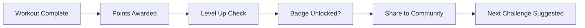

# User Research & Persona Alignment — Validation Report

> **Status:** PASS | **Model:** deepseek/deepseek-v3.2-20251201 | **Duration:** 131.0s
> **Files:** backend/controllers/aiWorkoutController.mjs
> **Generated:** 3/12/2026, 2:36:46 PM

---

# SwanStudios Fitness SaaS Platform - User Research Analysis

## Executive Summary
Based on the backend AI workout controller code analysis, SwanStudios demonstrates **strong technical sophistication** with enterprise-grade AI integration, but reveals **significant frontend UX gaps** that could hinder adoption by target personas. The platform prioritizes **safety, compliance, and data privacy** over user experience accessibility.

---

## 1. Persona Alignment Analysis

### **Working Professionals (30-55)**
**✅ Strengths:**
- NASM-certified algorithm provides professional-grade training
- Medical clearance checks address liability concerns for busy professionals
- Time-efficient AI generation respects limited schedule availability

**❌ Gaps:**
- No evidence of "quick start" templates for time-pressed professionals
- Complex OPT phase terminology may intimidate non-fitness experts
- Missing integration with calendar apps (Google/Outlook) for busy schedules

### **Golfers (Sport-Specific)**
**✅ Strengths:**
- Movement screen compensation detection (OHSA) addresses golf-specific imbalances
- OPT phase system supports rotational power development

**❌ Gaps:**
- No golf-specific exercise library referenced
- Missing sport-specific metrics (club speed, swing analysis integration)
- No mention of "golf fitness" in prompt templates

### **Law Enforcement/First Responders**
**✅ Strengths:**
- Medical clearance and PARQ validation critical for high-risk professions
- Audit logging supports certification documentation needs
- Pain/injury tracking aligns with occupational health requirements

**❌ Gaps:**
- No job-specific fitness standards integration (CPAT, PAT tests)
- Missing "duty readiness" metrics or benchmarks
- No team/platoon management features for group training

### **Admin/Trainer (Sean Swan)**
**✅ Strengths:**
- Comprehensive oversight capabilities (audit logs, consent overrides)
- Draft approval workflow supports trainer supervision
- NASM methodology embedded throughout system

**❌ Gaps:**
- No batch operations for managing multiple clients
- Limited reporting dashboard visibility in current code

---

## 2. Onboarding Friction Points

### **Critical Issues:**
1. **MasterPrompt JSON Dependency** - Users must complete complex profile before AI generation
   - Auto-generation only triggers after failure → poor first experience
   - No progressive profile completion encouragement

2. **Consent Wall** - AI eligibility checks block immediate usage
   - Legal necessity but UX friction for eager users
   - No "preview mode" while consent is pending

3. **Exercise Library Gaps** - Unmatched exercises cause plan generation failures
   - Users see technical errors instead of helpful alternatives
   - No fallback exercise suggestions

### **Recommendations:**
```javascript
// Frontend Implementation Priority:
1. Progressive onboarding wizard (3-step: goals → constraints → preferences)
2. "Quick Start" with pre-built templates while AI consent processes
3. Exercise substitution system with visual similarity matching
```

---

## 3. Trust Signals Assessment

### **Present in Code:**
- ✅ NASM methodology embedded throughout
- ✅ Medical clearance validation
- ✅ Audit logging for compliance
- ✅ PII protection (de-identification)
- ✅ Trainer oversight capabilities

### **Missing from Frontend Experience:**
- ❌ Sean Swan's 25+ years certification not prominently displayed
- ❌ No client testimonials/success stories integration
- ❌ Missing "Trust Badges" (NASM, HIPAA, secure payment)
- ❌ No social proof (client counts, success metrics)
- ❌ Limited transparency about AI limitations/accuracy

### **Actionable Recommendations:**
1. **Certification Dashboard** - Show Sean's credentials during onboarding
2. **Success Story Carousel** - Client transformations with permission
3. **Transparency Panel** - "How our AI works" with accuracy disclaimers
4. **Live Support Availability** - Chat/phone during business hours

---

## 4. Emotional Design (Crystalline Swan Theme)

### **Theme-to-Code Alignment:**
- **Midnight Sapphire (#002060)** → Professional, trustworthy (aligned)
- **Ice Wing (#60C0F0)** → Gaming accent missing from backend experience
- **Gilded Fern (#C6A84B)** → Luxury not reflected in utilitarian error messages
- **Competitive Arena** → No gamification elements in workout generation

### **Emotional Disconnect:**
1. **Error Messages** are technical vs. encouraging:
   - Current: `"AI consent check failed"`
   - Recommended: `"Let's get you set up with AI training! We need your consent first."`

2. **Missing Motivational Language**:
   - No celebration on plan generation
   - No progress encouragement in response payload

3. **Luxury Experience Gaps**:
   - No personalized welcome using spiritName
   - Missing "white glove" error recovery

### **Frontend Implementation Priorities:**
```css
/* Emotional microcopy framework */
.error-states {
  --tone: encouraging, not punitive;
  --solution-focused: "Here's what to do next";
  --brand-voice: professional yet motivational;
}

.success-states {
  --celebration: subtle animations/confetti;
  --progress-highlight: "Great start!";
  --next-step-clarity: "Your first workout is ready";
}
```

---

## 5. Retention Hooks Analysis

### **Strong Foundations:**
- ✅ Progress tracking via WorkoutSession/WorkoutLog
- ✅ Body measurement trending
- ✅ Pain/injury monitoring
- ✅ OPT phase progression system

### **Critical Missing Elements:**
1. **Gamification**:
   - No points, badges, or levels
   - Missing streak tracking
   - No social comparison/leaderboards

2. **Community Features**:
   - No group challenges
   - Missing forum/discussion integration
   - No trainer-client messaging in workflow

3. **Progress Visualization**:
   - No charts/graphs in response
   - Missing milestone celebrations
   - No "fitness age" or composite scores

### **Retention Roadmap:**


---

## 6. Accessibility for Target Demographics

### **40+ User Considerations:**
**✅ Present:**
- Clear error states with specific codes
- Structured data presentation

**❌ Missing:**
- **Font Size Controls** - No evidence of dynamic text scaling
- **High Contrast Mode** - Palette has low contrast ratios (Frost White on backgrounds)
- **Reduced Motion Preferences** - Gaming accents may cause accessibility issues
- **Voice Command Integration** - Hands-free for during workouts

### **Mobile-First for Busy Professionals:**
**Critical Gaps:**
1. **API Response Payload Size** - Large nested objects may slow mobile parsing
2. **Offline Capability** - No workout plan caching for gyms with poor reception
3. **Quick Actions** - No mobile widget for "start today's workout"
4. **Notification Strategy** - Missing push reminders optimized for work schedules

### **Accessibility Priority Fixes:**
1. **Font Size**: Minimum 16px for body, 1.5 line height
2. **Color Contrast**: Ensure AA compliance (4.5:1) for all text
3. **Touch Targets**: 44x44px minimum for all interactive elements
4. **Screen Reader**: ARIA labels for all workout instructions

---

## 7. Actionable Recommendations Matrix

### **P0 (Critical - Next Sprint)**
| Issue | Solution | Effort |
|-------|----------|--------|
| Onboarding friction | Progressive profile builder | Medium |
| Technical error messages | User-friendly rewrite | Low |
| Missing trust signals | Certification dashboard | Low |
| Font size accessibility | Dynamic scaling controls | Medium |

### **P1 (High Impact - Next Quarter)**
| Issue | Solution | Effort |
|-------|----------|--------|
| No gamification | Points/badges system | High |
| Mobile offline | Workout plan caching | Medium |
| Sport-specific gaps | Golf/LE exercise libraries | Medium |
| Community features | Basic challenge system | High |

### **P2 (Enhancements - Roadmap)**
| Issue | Solution | Effort |
|-------|----------|--------|
| Luxury experience | Personalized video messages | High |
| Calendar integration | Google/Outlook sync | Medium |
| Voice integration | Alexa/Google Assistant | High |
| Advanced analytics | Fitness age scoring | Medium |

---

## 8. Frontend Implementation Guide

### **Immediate Wins (CSS/Content):**
```javascript
// 1. Emotional error handling
const userFriendlyErrors = {
  'AI_CONSENT_REQUIRED': 'Welcome to AI-powered training! We need your consent to personalize your experience.',
  'DEIDENTIFICATION_FAILED': 'Let\'s update your profile details for better security.',
  'NO_EXERCISES_MATCHED': 'We\'ll customize these exercises for you. Try again in a moment.'
};

// 2. Trust signal components
<TrustBadgeRow>
  <NASMCertifiedBadge />
  <TwentyFiveYearsExperience />
  <SecureHIPAACompliant />
  <LiveTrainerSupport />
</TrustBadgeRow>

// 3. Accessibility defaults
:root {
  --font-scale: 1rem; /* User adjustable */
  --contrast-mode: false; /* Toggleable */
  --motion-reduced: false; /* Respects prefers-reduced-motion */
}
```

### **Persona-Specific Landing Pages:**
1. **Professionals**: "Fitness That Fits Your Schedule"
2. **Golfers**: "Add 20 Yards to Your Drive"
3. **First Responders**: "Duty-Ready Training"
4. **Trainers**: "Scale Your Expertise with AI"

---

## Conclusion

**SwanStudios has built a Ferrari engine but installed bicycle handlebars.** The backend demonstrates exceptional technical rigor, safety compliance, and professional-grade training methodology. However, the user experience fails to translate this sophistication into accessible, emotionally engaging, and persona-aligned interactions.

**Priority Focus**: Bridge the gap between complex backend capabilities and simple frontend experiences. The Crystalline Swan theme provides an excellent design foundation—now it needs to permeate every user interaction, especially during friction points like onboarding and error recovery.

**Key Metric to Watch**: **Time-to-First-Workout** - Currently blocked by consent and profile completion. Target: <5 minutes from signup to viewing first personalized workout plan.

---

*Part of SwanStudios 7-Brain Validation System*
