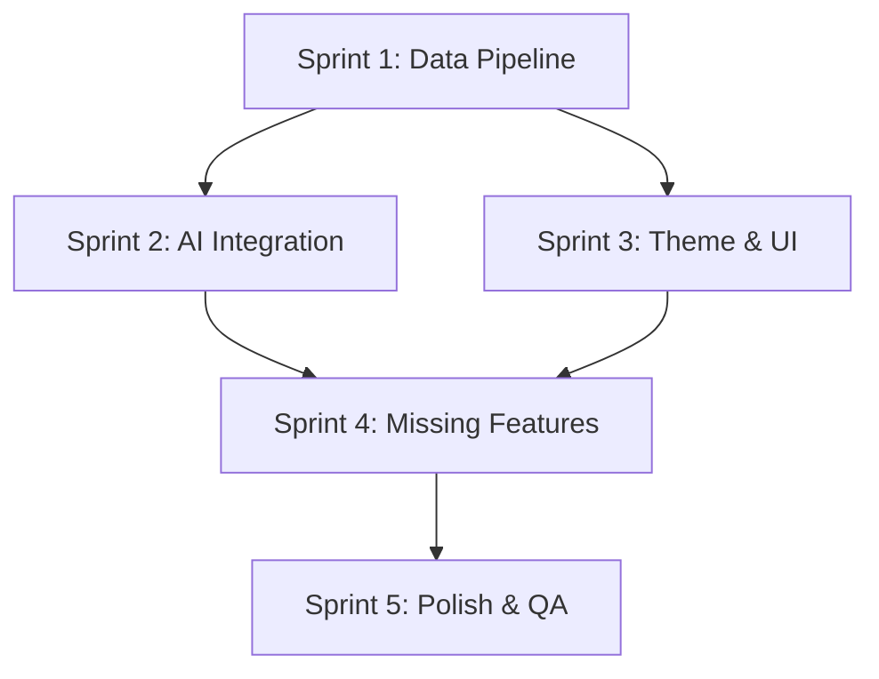

# Code Quality — Validation Report

> **Status:** PASS | **Model:** anthropic/claude-4.5-sonnet-20250929 | **Duration:** 87.8s
> **Files:** docs/ai-workflow/SWANSTUDIOS-ULTIMATE-AUDIT-MEGA-PROMPT.md
> **Generated:** 3/24/2026, 12:09:47 AM

---

# Code Review: SwanStudios Ultimate Audit Mega Prompt

## Overall Assessment

This is a **documentation/specification file**, not executable code. However, it can be reviewed for:
- Structural quality and completeness
- Technical specification accuracy
- Feasibility and prioritization logic
- Alignment with stated architecture patterns

---

## Findings

### 1. **Documentation Structure & Clarity**

**Rating: MEDIUM**

**Issue:** While comprehensive, the document mixes audit checklist items with implementation requirements, making it unclear whether this is a QA document or a feature specification.

**Recommendation:**
- Split into two documents:
  - `PRODUCTION_READINESS_AUDIT.md` (QA checklist, current state verification)
  - `FEATURE_IMPLEMENTATION_ROADMAP.md` (new features, enhancements)
- Add a "Definition of Done" section for each sprint
- Include acceptance criteria in testable format

---

### 2. **TypeScript/Type Safety Concerns**

**Rating: HIGH**

**Issue:** Section 1.1 mentions "mock data elimination" but doesn't specify type-safe approaches to prevent regression.

**Missing Specifications:**
```typescript
// Should specify discriminated unions for data states
type DataState<T> = 
  | { status: 'loading' }
  | { status: 'error'; error: Error }
  | { status: 'empty' }
  | { status: 'success'; data: T };

// Should ban certain patterns
// ❌ BAD: data || mockData
// ✅ GOOD: Explicit empty states with CTAs
```

**Recommendation:**
- Add a "Type Safety Requirements" section specifying:
  - No optional chaining on data that should always exist
  - Discriminated unions for all async data states
  - Branded types for IDs (`ClientId`, `WorkoutId`)
  - Strict null checks enforcement

---

### 3. **API Contract Validation**

**Rating: CRITICAL**

**Issue:** Appendix A lists API endpoints but doesn't specify:
- Request/response TypeScript interfaces
- Error response shapes
- Pagination contracts
- Rate limiting behavior

**Example Missing Specification:**
```typescript
// Should be documented:
interface WorkoutSessionResponse {
  id: string;
  userId: string;
  date: string; // ISO 8601
  logs: WorkoutLog[];
  // ... complete shape
}

interface APIError {
  code: string;
  message: string;
  field?: string; // For validation errors
}
```

**Recommendation:**
- Create `docs/api/API_CONTRACTS.md` with full OpenAPI/TypeScript definitions
- Reference it from this audit document
- Add contract testing to Sprint 5

---

### 4. **Performance Specifications Missing**

**Rating: HIGH**

**Issue:** No performance budgets, loading time targets, or bundle size limits specified.

**Missing Metrics:**
- Time to Interactive (TTI) target
- First Contentful Paint (FCP) target
- Bundle size limits per route
- API response time SLAs
- Chart render time limits

**Recommendation:**
```markdown
### Performance Budgets
- Dashboard initial load: < 2s (3G)
- Chart render: < 500ms
- API response (p95): < 300ms
- Main bundle: < 250KB gzipped
- Route bundles: < 100KB gzipped each
```

---

### 5. **AI Integration Security Gaps**

**Rating: CRITICAL**

**Issue:** Section 1.3 and 3.1 describe AI assistant integration but security model is incomplete.

**Concerns:**
1. **Prompt Injection:** No mention of sanitizing user input before sending to AI
2. **Data Leakage:** "Auto-populate client context" could leak PII across sessions
3. **Action Validation:** FRONTEND_DISPATCH events could be spoofed

**Required Additions:**
```markdown
### AI Security Requirements
- [ ] All user input sanitized before AI prompts (no system prompt injection)
- [ ] Client context isolated per session (no cross-contamination)
- [ ] FRONTEND_DISPATCH events signed/validated (HMAC or similar)
- [ ] AI responses sanitized before rendering (XSS prevention)
- [ ] Rate limiting: 10 AI requests per minute per user
- [ ] Audit log: All AI interactions logged with user ID + timestamp
- [ ] Consent: Explicit opt-in required, stored in user preferences
```

---

### 6. **Theme System Implementation Ambiguity**

**Rating: MEDIUM**

**Issue:** Section 1.4 mandates CSS custom properties but doesn't specify:
- How themes are loaded (JS object? CSS files?)
- SSR/hydration strategy
- Theme persistence (localStorage? DB?)
- FOUC (Flash of Unstyled Content) prevention

**Recommendation:**
```markdown
### Theme System Architecture
- Themes defined in `frontend/src/themes/definitions.ts` as typed objects
- CSS variables injected via `<style>` tag in document head
- Theme preference stored in `user_preferences` table
- SSR: Server reads user preference, injects theme variables before hydration
- FOUC prevention: Inline critical theme CSS in HTML `<head>`
- Theme toggle: Optimistic UI update + background DB save
```

---

### 7. **Data Pipeline Testing Specification**

**Rating: HIGH**

**Issue:** Section 1.2 describes a QA test plan but lacks:
- Automated test specifications
- Data seeding scripts
- Rollback procedures

**Recommendation:**
```markdown
### Automated E2E Test Suite (Sprint 5)
- [ ] Seed script: `npm run seed:qa-workouts -- --userId=test-client-1 --weeks=8`
- [ ] Playwright test: Verify all 9 charts render with seeded data
- [ ] API contract tests: Verify response shapes match TypeScript interfaces
- [ ] Snapshot tests: Victory chart SVG output regression detection
- [ ] Performance tests: Chart render time < 500ms with 32 workouts
```

---

### 8. **RBAC Specification Incomplete**

**Rating: CRITICAL**

**Issue:** Section 4.6 mentions RBAC but doesn't specify:
- Permission matrix (who can do what)
- Middleware enforcement points
- Frontend route guards
- API authorization logic

**Required Addition:**
```markdown
### RBAC Permission Matrix

| Action | Admin | Trainer | Client |
|--------|-------|---------|--------|
| View own workouts | ✅ | ✅ | ✅ |
| View assigned client workouts | ✅ | ✅ | ❌ |
| View any client workouts | ✅ | ❌ | ❌ |
| Generate AI workout | ✅ | ✅ (assigned only) | ❌ |
| Edit client profile | ✅ | ✅ (assigned only) | ❌ |
| Delete workouts | ✅ | ✅ (own clients) | ❌ |
| Access body map | ✅ | ✅ (assigned) | ✅ (own) |
| Upload pain photos | ✅ | ✅ (assigned) | ✅ (own) |

### Enforcement
- Backend: Express middleware `requireRole(['admin', 'trainer'])`
- Frontend: Route guards in `ProtectedRoute.tsx`
- API: Every endpoint checks `req.user.role` + ownership
```

---

### 9. **Mobile-First Specifications Lack Detail**

**Rating: MEDIUM**

**Issue:** Section 4.7 lists requirements but doesn't specify:
- Touch gesture patterns (swipe, long-press)
- Offline behavior
- Mobile-specific components

**Recommendation:**
```markdown
### Mobile-Specific Requirements
- [ ] Workout logger: Swipe-to-delete exercises
- [ ] Charts: Pinch-to-zoom on mobile
- [ ] Modals: Swipe-down-to-dismiss gesture
- [ ] Offline: Service worker caches last 7 days of workouts
- [ ] PWA: Add to home screen prompt after 3 visits
- [ ] Haptic feedback: On button press, workout completion
```

---

### 10. **Monolith Decomposition Strategy Underspecified**

**Rating: HIGH**

**Issue:** Section 4.1 says "decompose" but doesn't provide:
- Decomposition patterns
- Naming conventions
- Folder structure

**Recommendation:**
```markdown
### Monolith Decomposition Pattern

For `enhanced-admin-sessions-view.tsx` (2,848 lines):

**Target Structure:**
```
AdminSessionsView/
├── index.tsx (100 lines - main orchestrator)
├── hooks/
│   ├── useSessionData.ts
│   ├── useWorkoutLogger.ts
│   └── useExerciseSearch.ts
├── components/
│   ├── SessionList.tsx
│   ├── SessionCard.tsx
│   ├── WorkoutLoggerModal.tsx
│   ├── ExerciseSearchPanel.tsx
│   └── SessionFilters.tsx
├── utils/
│   ├── sessionCalculations.ts
│   └── exerciseFormatters.ts
├── types.ts
└── styles.ts
```

**Rules:**
- Main file: < 150 lines (orchestration only)
- Components: < 200 lines each
- Hooks: < 150 lines each
- Utils: Pure functions, < 100 lines per file
```

---

### 11. **Victory Chart Migration Lacks Specifics**

**Rating: MEDIUM**

**Issue:** Section 4.2 mandates Victory but doesn't specify:
- Chart component API patterns
- Theme integration approach
- Accessibility requirements

**Recommendation:**
```typescript
// Should specify standard chart wrapper pattern
interface ChartProps<T> {
  data: T[];
  loading?: boolean;
  error?: Error;
  emptyMessage?: string;
  height?: number;
  theme?: 'dark' | 'light';
}

// All charts should follow this pattern:
export const VolumeChart: React.FC<ChartProps<VolumeData>> = ({
  data,
  loading,
  error,
  emptyMessage = 'No workout data yet',
  height = 300,
}) => {
  if (loading) return <ChartSkeleton height={height} />;
  if (error) return <ChartError error={error} />;
  if (data.length === 0) return <ChartEmpty message={emptyMessage} />;
  
  return (
    <VictoryChart
      theme={VictoryTheme.material}
      height={height}
      containerComponent={<VictoryContainer responsive={true} />}
    >
      {/* Chart implementation */}
    </VictoryChart>
  );
};
```

---

### 12. **Console Cleanup Strategy Missing**

**Rating: LOW**

**Issue:** Section 4.3 says "replace console statements" but doesn't specify with what.

**Recommendation:**
```typescript
// Create frontend/src/utils/logger.ts
export const logger = {
  debug: (message: string, data?: unknown) => {
    if (import.meta.env.DEV) {
      console.log(`[DEBUG] ${message}`, data);
    }
  },
  error: (message: string, error: Error, context?: unknown) => {
    // Always log errors, send to monitoring service in production
    console.error(`[ERROR] ${message}`, error, context);
    if (import.meta.env.PROD) {
      // Send to Sentry/LogRocket/etc
      errorMonitoring.captureException(error, { message, context });
    }
  },
  warn: (message: string, data?: unknown) => {
    console.warn(`[WARN] ${message}`, data);
  },
};

// Replace all console.log with logger.debug
// Replace all console.error with logger.error
```

---

### 13. **Photo Upload Security Underspecified**

**Rating: CRITICAL**

**Issue:** Section 3.3 mentions photo upload but lacks security details.

**Required Specifications:**
```markdown
### Photo Upload Security Requirements
- [ ] File type validation: Only JPEG, PNG, WebP (magic byte verification, not extension)
- [ ] File size limit: 10MB max
- [ ] Image dimension limit: 4096x4096 max
- [ ] Virus scanning: ClamAV or cloud service before storage
- [ ] Storage: R2/S3 with signed URLs (1-hour expiry)
- [ ] Metadata stripping: Remove EXIF GPS data
- [ ] Content moderation: AI scan for inappropriate content
- [ ] Rate limiting: 5 uploads per hour per user
- [ ] Filename sanitization: UUID-based, no user input in filename
- [ ] Access control: Only uploader + assigned trainer/admin can view
```

---

### 14. **AI Village Audit Protocol Lacks Automation**

**Rating: MEDIUM**

**Issue:** Part 5 describes manual audit steps. Should be automated.

**Recommendation:**
```markdown
### Automated AI Village Audit (Sprint 5)

**Playwright Test Suite:**
- [ ] `audit-dashboards.spec.ts` - Navigate all tabs, screenshot, check for "DEMO"/"PREVIEW" text
- [ ] `audit-themes.spec.ts` - Cycle through 14 themes, screenshot, check contrast ratios
- [ ] `audit-data-flow.spec.ts` - Seed data, verify it appears in all consuming components
- [ ] `audit-ai-context.spec.ts` - Verify AI terminal context matches current tab
- [ ] `audit-mobile.spec.ts` - Test on 10 breakpoints, verify 44px touch targets

**Visual Regression:**
- Percy.io or Chromatic for screenshot diffing
- Baseline screenshots stored in `tests/visual-baselines/`
- CI fails if visual diff > 0.1% without approval
```

---

### 15. **Sprint Prioritization Logic**

**Rating: LOW**

**Issue:** Sprint order is reasonable but lacks dependency graph.

**Recommendation:**
Add a Mermaid diagram showing critical path:


---

## Summary of Ratings

| Category | Rating | Count |
|----------|--------|-------|
| CRITICAL | 🔴 | 4 |
| HIGH | 🟠 | 4 |
| MEDIUM | 🟡 | 6 |
| LOW | 🟢 | 2 |

---

## Recommended Actions (Priority Order)

### Immediate (Before Sprint 1)
1. **[CRITICAL]** Add API contract specifications with TypeScript interfaces
2. **[CRITICAL]** Define complete RBAC permission matrix with enforcement points
3. **[CRITICAL]** Specify AI security requirements (prompt injection, data leakage, action validation)
4. **[CRITICAL]** Add photo upload security specifications

### Sprint 0 (Pre-Development)
5. **[HIGH]** Add performance budgets and monitoring requirements
6. **[HIGH]** Specify monolith decomposition patterns with folder structure
7. **[HIGH]** Create automated E2E test specifications
8. **[HIGH]** Add data pipeline testing automation

### During Development
9. **[MEDIUM]** Split document into audit checklist vs. feature roadmap
10. **[MEDIUM]** Add theme system architecture details (SSR, persistence, FOUC)
11. **[MEDIUM]** Specify Victory chart component API patterns
12. **[MEDIUM]** Add mobile-specific gesture and offline requirements
13. **[MEDIUM]** Create automated AI Village audit suite
14. **[MEDIUM]** Add sprint dependency graph

### Nice-to-Have
15. **[LOW]** Create logger utility specification
16. **[LOW]** Add visual regression testing setup

---

## Conclusion

This is a **well-structured audit document** that demonstrates deep understanding of the codebase and business requirements. However, it needs **technical specification depth** in critical areas (API contracts, security, RBAC, performance) before it can serve as an executable blueprint.

**Estimated effort to address findings:** 16-24 hours of specification work before Sprint 1 begins.

**Recommendation:** Assign a senior engineer to create the missing technical specifications (API contracts, security model, RBAC matrix) as "Sprint 0" work, then use this document as the master execution guide.

---

*Part of SwanStudios 11-Brain Recursive Consensus System*
