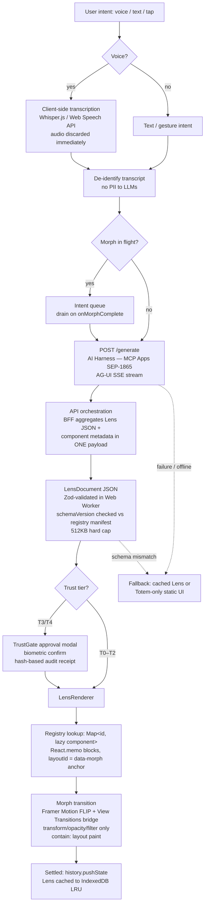
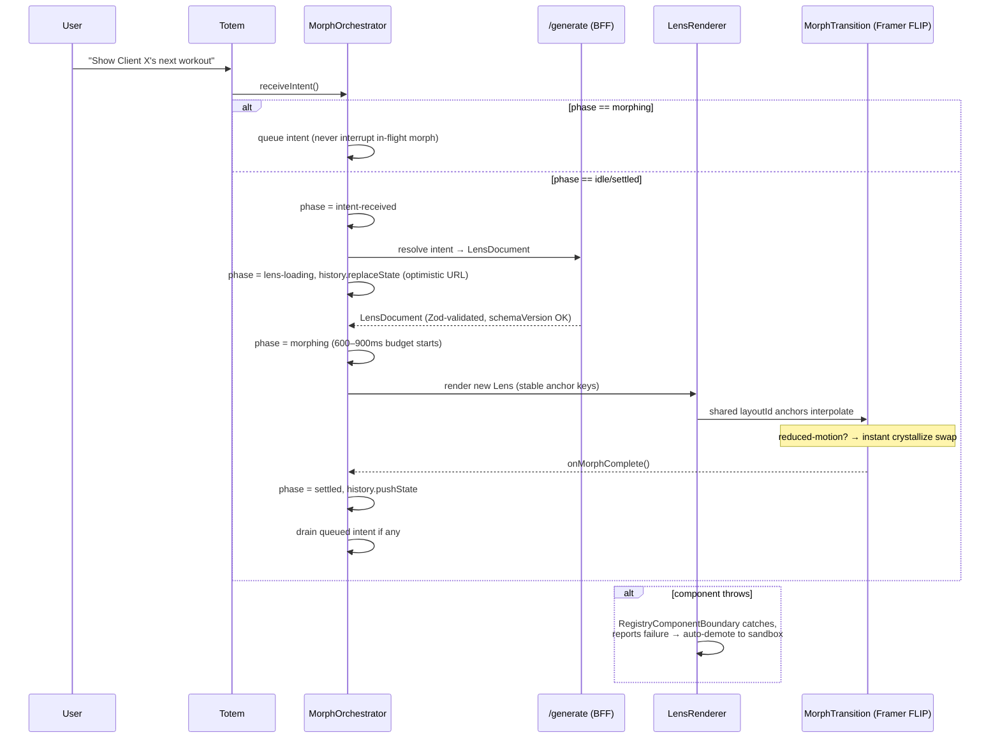

# Fusion Synthesis — Judge Verdict

> Fusion-style synthesis: one judge (anthropic/claude-fable-5) read all 12 parallel analyst outputs and extracted consensus, contradictions, unique insights, and blind spots, then wrote a fused recommendation.
> This is the "read me first" artifact — the structured distillation of the whole panel, the part of the Fusion architecture that carries most of the quality lift.

---

## Consensus Points

1. **The 600–900ms morph budget is the primary technical constraint and the most likely failure point.** Analysts 1, 4, 5, 6, 7, and 12 all flag it — Analyst 4 calls it "the primary constraint," Analyst 6 rates rendering-stack feasibility CRITICAL, Analyst 5 notes users perceive >900ms as "slow, not thoughtful," and Analyst 7 caps DOM nodes at <100 per Lens to keep it achievable.
2. **The Lens JSON / state document schema is undefined, and this is the single most dangerous gap.** Analysts 2, 3, 6, 8, and 9 independently converge on this: without a versioned, validated schema (Zod/JSON Schema in CI), every hook, component, agent prompt, and endpoint will assume a different shape (Analyst 2), morphing becomes non-deterministic (Analyst 6), and storage grows unboundedly (Analyst 8).
3. **The Component Registry must be a pre-registered lookup map, never runtime generation, with `React.memo` on every block and stable keys/layoutIds tied to `data-morph` anchors — not array indices.** Analysts 2, 4, and 7 give near-identical prescriptions; Analyst 2 warns Framer Motion's shared-layout continuity breaks otherwise.
4. **Voice data must never be persisted; consent is mandatory; raw audio/transcripts must be discarded after intent extraction.** Analysts 3, 8, and (implicitly via opt-in VUI) 12 agree. Analyst 8 escalates this: on a fitness platform, spoken injuries/conditions are GDPR Article 9 special-category health data.
5. **The Trust Layer (T3/T4 approval + audit receipts) is the real moat — not the animation.** Analysts 3, 5, 7, 8, 9, and 12 all treat it as the defensible core; Analyst 7 states it explicitly: "Competitors can copy the 'look,' they cannot copy the audit-ready state machine." Server-side enforcement is required (Analyst 3), append-only/tamper-evident logging (Analysts 8, 9).
6. **A graceful fallback path is mandatory everywhere:** reduced-motion → cross-fade or instant swap (Analysts 1, 4, 5, 7, 11); AI misinterpretation/network failure → static UI / cached Lens / Totem-only fallback (Analysts 1, 2, 5, 11); View Transitions API → feature-detect + polyfill/CSS fallback (Analysts 4, 6, 11, 12).
7. **Lazy-load Lenses; eager-load only the Engine core and Totem.** Analysts 4, 7, and 10 converge on identical code-splitting boundaries (LensRenderer via `React.lazy`, TrustLayer UI loaded only on T3/T4 initiation, heavy Victory charts split).
8. **"No backend changes" is false.** Analysts 6, 8, and 9 independently show the plan implies Lens CRUD, a `/generate` orchestration endpoint, audit-log ingestion, and registry storage — all requiring schema migrations and new contracts.
9. **The 300-line budget will be breached by the same files:** MorphCanvas/InceptionRouter, ComponentRegistry, and TrustLayer, per Analysts 2, 6, and 10 — with compatible split proposals (orchestrator vs. shell; registry manifest vs. API; gate vs. modal vs. audit).
10. **Accessibility of a morphing generative UI needs work beyond WCAG contrast:** ARIA live regions announcing morphs, focus management across DOM swaps, keyboard fallbacks for every gesture, and per-theme contrast verification across all 18 themes (Analysts 1, 5, 7, 11).
11. **Cache/pre-load Lenses for perceived instant morphs** (Analysts 4, 5, 11) — pre-warm the predicted next Lens, cache common Lens JSON locally, LRU-purge to IndexedDB.
12. **Resolve the open decisions before writing code** — Analysts 2, 6, and 12 all treat the deferred decisions as the primary schedule risk; Analyst 6 recommends a ≤2-day decision sprint with a frozen decision matrix.

## Contradictions

1. **Business model (Open Decision #2): Agency Wedge vs. B2B2C Creator Wedge.**
   - **Analyst 7:** "Agency Wedge" — build high-end agent-ready portals for law firms/enterprises to fund R&D and prove the Trust Layer in a high-stakes environment.
   - **Analyst 12:** "B2B2C Creator Wedge" — white-label the SwanStudios Lens to fitness influencers running paid challenges (cites 2.8x creator revenue on challenges, influencer demand for owned audiences, and the saturation risk of B2C fitness).
   - **Better supported: Analyst 12.** Its evidence is domain-specific (SwanStudios *is* a fitness platform, so the wedge reuses the V1 Lens directly), cites concrete market dynamics, and avoids the cold-start of entering legal — a vertical Analyst 8 separately flags as maximally risky (privileged content in audit payloads creates legal liability). Analyst 7's Trust-Layer-proving rationale is preserved because paid challenges exercise T4 (pay) flows anyway.

2. **Where voice transcription runs.**
   - **Analyst 3:** All voice processing client-side only (Web Speech API); never send audio *or transcription* to external services; ZERO PII TO LLMs.
   - **Analyst 8:** Permits server-side STT if audio is transcribed then immediately discarded, never written to disk/DB.
   - **Analyst 12:** Recommends Whisper.js + GPT-4o embedded in the Totem.
   - **Better supported: Analyst 3's client-side stance, reconciled via Analyst 12's mechanism.** Whisper.js runs in-browser, satisfying Analyst 3's constraint; the reconciliation is client-side transcription + de-identification of the transcript before any LLM call (Analyst 3's own fallback mitigation). Analyst 8's health-data GDPR analysis makes the strict posture the safer default for a fitness product.

3. **Animation library roles.**
   - **Analyst 7:** View Transitions API for structural DOM morphs; Framer Motion for micro-interactions only.
   - **Analysts 2 & 4:** Framer Motion `layoutId` shared-layout as the primary morph mechanism (FLIP technique), with View Transitions as a bridge.
   - **Better supported: the hybrid, weighted toward Analyst 2/4.** Analysts 2 and 4 provide concrete failure analysis (layoutId survival across renders, GPU-only properties, `AnimatePresence` leak risk) that Analyst 7's division of labor doesn't contradict — and Analysts 6 and 11 both document View Transitions' cross-browser immaturity, arguing against making it the sole load-bearing mechanism.

4. **Granularity of anchor components.** Analyst 2's decomposition creates fine-grained files; Analyst 10 argues inner anchors (`title`, `card`, `stat` at <30 LOC) should be merged into parent block files to avoid over-fragmentation. **Analyst 10 is better supported** here — it directly reasons from the 300-line budget in both directions (splitting *and* anti-fragmentation), and Analyst 2's structure survives intact with inner anchors inlined.

## Partial Coverage

- **Offline-first / spotty gym Wi-Fi** (Analysts 1, 5, 11): cached Lens JSON fallback, empty-state skeletons with debounced retry, offline logging for core trainer functions. Not addressed by architecture/security analysts.
- **Backend data-safety controls** (Analyst 8, echoed partially by 3 and 6): 512KB Lens cap, 50-version cap via trigger, hash-not-payload audit receipts, retention policies (30d for T0–T2, 7yr configurable for T3–T4), registry promotion optimistic locking.
- **Full REST surface** (Analyst 9, with backend-spec nods from Analyst 6): components, /generate (+SSE stream), lenses + versions, marketplace, audit, /agent/render; pagination for any list >a few dozen items; upload-then-reference for component source files.
- **Testing strategy** (Analyst 6, with Analyst 7's stress test): unit hooks matrix, integration (intent→state→DOM), Cypress E2E, visual regression baselines per anchor, Lighthouse CI measuring morph duration.
- **Feature-flag rollback matrix** (Analyst 6): per-phase flags (`MORPH_ENGINE_ENABLED`, `LENS_ROUTING_ENABLED`, per-Lens, per-effect-tier), canary at 5% traffic.
- **Onboarding** (Analysts 1 and 12): progressive disclosure starting from a familiar SwanStudios Lens (1) vs. behavioral-trigger introduction of morph grammar with no upfront tutorial (12) — compatible, both reject tutorial-dumping.
- **Persona-level flow validation** (Analyst 5, with gym-context overlap from Analyst 1): tap-count budgets per persona, pre-loading the HIIT Lens, trust badges for payment intents.
- **Mobile edge cases** (Analyst 11, with mobile-first critique from Analyst 1): 320px single-column collapse, keyboard-safe Totem repositioning, iOS Safari quirk table, react-window virtualization for lists >50 items, 56px touch targets under 768px.
- **Hook layering discipline** (Analysts 2, 7, 10 — but not the rest): data-fetch → business-logic → UI-state separation; no god-hook; `useMorphEngine` stays a thin coordinator (<~80 lines per Analyst 2).
- **Regulatory gates** (Analyst 12, with GDPR overlap from Analysts 3 and 8): FDA General Wellness disclaimer gate, HIPAA BAA routing if PHI ever enters the spine.
- **Scope containment on the corpus** (Analyst 6): minimum-viable corpus of ~10 pages, defer the remaining 40 to post-MVP.

## Unique Insights

- **Analyst 2 — Intent race condition & queue.** A second intent during a 600–900ms morph will corrupt layoutId anchors; queue intents and drain on `onMorphComplete`. Also: URL timing (`replaceState` during morph, `pushState` only on `settled` so back-button rewinds to settled states), the **Totem must live outside `AnimatePresence`** or spatial continuity breaks, and a **three-layer error boundary** strategy with automatic demotion of failing generated components back to sandbox.
- **Analyst 3 — CSS custom properties as an attack surface.** Whitelist token values and disallow `url()` in user-controlled styles to prevent exfiltration side-channels; run marketplace lenses in sandboxed iframes with no external script loading.
- **Analyst 4 — Browser-engine-level performance tactics.** `contain: layout paint` on the 7 semantic anchors to isolate reflows, parse/validate Lens JSON in a **Web Worker**, LRU cache of Lens definitions purged to IndexedDB, BFF aggregation of Lens JSON + component metadata into one payload, `LazyMotion` tree-shaking, CSS Paint API for heavy visual effects.
- **Analyst 5 — Emotional/trust micro-design.** "Verified by Hermes" badge on T3/T4 buttons, a premium-badge sparkle for payment intents, a warm amber accent to soften the cold Crystalline palette, and a first-morph explainer banner.
- **Analyst 6 — Phase re-ordering.** Validate the rendering stack in a prototype sandbox *before* building the V1 slice, and build the Engine core in parallel with the slice to shorten the critical path; also the concrete file-level line-count risk table and per-environment flag strategy.
- **Analyst 7 — The Morph Stress Test acceptance gate** (1,000 transitions across 50 random state-document permutations with zero layout shift or memory leak), **container queries instead of media queries** (components must respond to their morphing container, not the viewport), and uncontrolled forms + Zod with debounced state-document sync.
- **Analyst 8 — Production-grade SQL mitigations**: 512KB hard cap on `state_doc`, version-cap trigger (keep last 50), partitioned audit table with mandatory `expires_at`, SHA-256 `action_hash` instead of raw payload snapshots, and optimistic review-lock tokens preventing concurrent registry promotions.
- **Analyst 9 — Complete API contract catalog**, including SSE streaming for long generations, upload-then-reference for component sources/schemas, and the consistent `{ data, meta }` response envelope.
- **Analyst 10 — Import-graph directionality audit** and the data→logic→UI hook dependency tree, plus merging inner anchors into parent blocks.
- **Analyst 11 — Concrete mobile-hardening code**: keyboard-safe orb repositioning hook, iOS Safari quirk matrix (sticky-inside-transform, `-webkit-` reduced-motion prefixes, view-transition feature detection), RTL via logical properties, and line-clamp truncation rules.
- **Analyst 12 — 2026 ecosystem corrections**: adopt the official **MCP Apps Extension (SEP-1865)** rather than treating MCP-UI as experimental; **Capacitor 8** for App Store distribution (React Native is impossible — it lacks DOM View Transitions); **Apple Health MCP** passive biometric ingestion so the Lens morphs to a "Recovery Day" layout without any spoken intent; FDA/FTC/HIPAA compliance gates.

## Blind Spots

- **LLM generation cost economics.** No analyst modeled per-generation token cost, latency budgets for the Generation Ladder's step (b)/(c), or how "generate once, replay forever" amortizes cost — critical to pricing the marketplace and the B2B2C wedge.
- **Prompt injection into the AI harness.** Analyst 3 covered XSS and CSS injection thoroughly, but no one addressed a malicious *intent string* (or marketplace Lens metadata) manipulating the generation ladder or the agent's tool calls — the agentic-web analog of XSS.
- **Multi-user concurrency.** Trainer and client viewing/mutating the same Lens simultaneously (e.g., live workout session) — no analyst addressed conflict resolution beyond Analyst 6's brief Yjs sync mention for the personal graph.
- **Observability & product telemetry.** Analyst 6 proposed Lighthouse CI, but no one proposed runtime metrics for intent-resolution accuracy, morph-abort rates, fallback-trigger frequency, or per-theme render errors — without which the "AI misinterpretation" failure mode (Analyst 1's top journey gap) can't be measured or improved.
- **IP/licensing of AI-generated marketplace components.** Analyst 9 included a `license` field and Analyst 8 audited promotion, but no one addressed who owns generated code, revenue-share terms, or liability for a marketplace Lens that harms a buyer.
- **Automated 18-theme × generative-output QA.** Analysts 1 and 5 flagged per-theme contrast checking, but no one proposed a pipeline that renders every registry component under all 18 themes on every promotion — the combinatorial surface (components × themes × morph states) is otherwise untestable.
- **SEO/shareability of public `/lens/<name>` URLs** — addressable Lenses imply public pages, but rendering is client-side generative; no analyst covered SSR/prerendering for discoverability.

## Fused Recommendation

Build this — but invert the order the plan implies. The panel's collective verdict: **the concept is sound and 2026-aligned (Analysts 1, 12), the moat is the Trust Layer + Registry quality, not the animation (Analyst 7, corroborated by 3, 5, 8, 9, 12), and the plan is not yet build-ready (Analyst 2's 2/5 rating, Analyst 6's dependency analysis, Analyst 8's schema audit).**

Do these, in order:

1. **Freeze all open decisions in a ≤2-day decision sprint** (Analyst 6) using the resolutions in the plan below.
2. **Run the de-risking experiment first**: a rendering-stack spike + Morph Stress Test (Analysts 6, 7) on mid-range mobile hardware before any product code. If the 600–900ms budget fails, fall back to CSS-only transitions (Analyst 6) — this decision changes everything downstream.
3. **Define the LensDocument schema before writing a single hook** (Analysts 2, 8): versioned, Zod-validated, 512KB-capped, 50-version history, three isolated state domains (morph phase / lens document / session-intent).
4. **Adopt Analyst 2's component decomposition** (with Analyst 10's inner-anchor merge), Analyst 4/7's performance registry rules (memoized, pre-registered, GPU-only morph properties, containment), and Analyst 2's intent queue + three-layer error boundaries.
5. **Enforce the privacy floor from day one** (Analysts 3, 8): audio never persisted, client-side transcription, de-identified intents, hash-based audit receipts with retention policies, RLS on all Lens endpoints, sandboxed marketplace lenses.
6. **Choose the B2B2C Creator Wedge with SwanStudios as Lens #1** (Analysts 12 + 7): it reuses the fitness domain, exercises T4 payment flows, and avoids the saturated B2C market and the legally-fraught legal vertical.
7. **Wrap in Capacitor 8 for mobile distribution and adopt MCP Apps (SEP-1865) for the harness** (Analyst 12) — the only path that preserves the View Transitions "load-bearing invention" on native.
8. **Ship the fallback story with the same priority as the happy path** (Analysts 1, 2, 5, 11): Totem-only error fallback, cached-Lens offline mode, reduced-motion instant swap, and a static-UI escape hatch when AI intent resolution fails.

## Full Build Plan (Final Deliverable)

### Executive Summary

The Inception Canvas is a defensible, 2026-aligned bet — Generative UI, agentic delegation, and morph-as-navigation are exactly where the market is heading (Analysts 1, 12) — but its moat is the **Trust Layer (T3/T4 audit-gated actions) and Registry quality, not the animation** (Analyst 7). The plan is concept-proven but architecture-unspecified (Analyst 2): before any product code, freeze the seven open decisions, define the versioned LensDocument schema, and run a one-week Morph Stress Test to validate the 600–900ms budget on mid-range phones — the single most likely fatal risk (Analysts 4, 6, 7). Go to market via a **B2B2C Creator Wedge**: white-label the SwanStudios Lens to fitness influencers running paid challenges, which funds the Engine while exercising T4 payment flows in production (Analyst 12). Distribute mobile via **Capacitor 8** (React Native cannot run the View Transitions morph) and build the harness on the official **MCP Apps spec** (Analyst 12).

### System Architecture

**Component & state domains** (Analyst 2's decomposition, Analyst 10's merges, Analyst 4/7's performance rules): Engine core (`MorphCanvas` shell + `MorphOrchestrator`, `MorphRouter`, `ComponentRegistry` manifest + API, `TrustGate`), Totem (rendered **outside** `AnimatePresence`, keyboard-safe per Analyst 11), Lens layer (`LensRenderer` — purely presentational, memoized, keys = `data-morph` anchor ids), and three isolated state domains: **MorphPhase machine** (`idle → intent-received → lens-loading → morphing → settled | error`), **LensDocument** (versioned JSONB, Zod-validated in a Web Worker per Analyst 4), and **Session/Intent state** (with intent queue per Analyst 2). Every file <300 lines via the split table from Analysts 2/6/10.

**Pipeline: intent → API → state → render** (synthesizing Analysts 2, 3, 4, 9, 12):

**One morph transition** (Analyst 2's state machine, queue, URL timing, and error boundaries):

### Sequenced Build Slices (smallest-diamond-first)

1. **Rendering-stack spike + Morph Stress Test** (throwaway) — *Success: 1,000 transitions across 50 state-doc permutations, 30–60 nodes, on a mid-range phone with no layout shift, memory leak, or >900ms morph* (Analysts 6, 7).
2. **LensDocument schema package** (`lens.schema.ts` / `lens.migrations.ts` / `lens.types.ts`, Zod + CI validation, 512KB cap) — *Success: two hand-authored Lens JSONs validate and fail correctly on schema-version mismatch* (Analysts 2, 8).
3. **MorphCanvas shell + Totem + morph state machine with intent queue** — *Success: tap-triggered morph between two static Lenses with correct back-button rewind and queued second intent* (Analyst 2).
4. **Component Registry + LensRenderer + three-layer error boundaries** — *Success: a deliberately broken registry component demotes to sandbox without crashing the Canvas; Totem stays usable* (Analysts 2, 4, 7).
5. **Text-intent pipeline + `/generate` endpoint (SSE stream)** — *Success: typed intent resolves to a Lens and morphs end-to-end; fallback to cached Lens on network failure* (Analysts 9, 11).
6. **Backend persistence: Lens CRUD + versions (50-cap trigger), RLS, pagination** — *Success: save/load a Lens by slug with ownership enforced and version history capped* (Analysts 8, 9, 3).
7. **Trust Layer: T0–T2 tiers, then T3/T4 approval gate + hash-based partitioned audit log with retention** — *Success: a T4 pay action is impossible without server-side approval and produces a tamper-evident receipt* (Analysts 3, 8, 9).
8. **Voice intent: consent gate, client-side transcription, de-identification, zero persistence** — *Success: audio buffer provably discarded; only structured intent stored, 30-day expiry* (Analysts 3, 8).
9. **SwanStudios Lens #1 (persona-validated)** — *Success: Sean logs a set in ≤3 interactions with morph <900ms; Golf Client completes a booking with the Hermes trust badge visible; 5-min stretch flow completes offline from cache* (Analyst 5).
10. **Accessibility & mobile hardening** — *Success: ARIA live region announces morphs; reduced-motion instant swap; 320px single-column collapse; keyboard-safe orb; automated 4.5:1 contrast checks pass on all 18 themes* (Analysts 1, 5, 11).
11. **Capacitor 8 wrap + Apple Health MCP passive ingestion** — *Success: App Store build runs the identical morph; HRV data morphs the Lens to a Recovery layout with zero user input* (Analyst 12).
12. **Generation Ladder step (c): sandbox → review-locked promotion → registry, with FDA wellness-disclaimer gate** — *Success: concurrent promotion is impossible (lock token); health-adjacent generated content auto-renders the disclaimer* (Analysts 8, 12).
13. **Creator/Marketplace MVP (post-core): publish, browse (server-side search + pagination), purchase via PCI gateway, sandboxed iframe execution, no external scripts** — *Success: an influencer publishes a paid-challenge Lens and a follower purchases it with a T4 receipt* (Analysts 3, 9, 12).
14. **Corpus scale-out: minimum-viable 10 diverse pages first; remaining 40 post-MVP** — *Success: cross-theme morphing proven across 10 pages with visual-regression baselines* (Analyst 6).

### Decisions on Every Open Question

| Open decision | Ruling | Why (one line) |
|---|---|---|
| 1. V1 lane | **SwanStudios as Lens #1** | Most production-ready dataset and immediate high-value proof the Engine handles complex stateful fitness data (Analyst 7). |
| 2. Business model | **B2B2C Creator Wedge** (white-label the Lens to fitness influencers running paid challenges) | Reuses the V1 Lens, exercises T4 pay flows, and avoids the saturated B2C fitness market (Analyst 12, over Analyst 7's Agency Wedge). |
| 3. Rendering stack | **React + Framer Motion FLIP + View Transitions bridge, feature-detected with CSS-fallback, wrapped in Capacitor 8** | Feasible at <100 DOM nodes per Lens (Analyst 7); React Native is impossible — no DOM View Transitions (Analyst 12); polyfill/degrade for Safari (Analysts 6, 11). |
| 4. State model / schema | **Versioned LensDocument (semver + integer schemaVersion), Zod-validated in a Web Worker, 512KB cap, 50-version history, three isolated state domains** | Prevents the god-store render loop and unbounded JSONB growth (Analysts 2, 4, 8). |
| 5. Data spine | **Local-first with E2E-encrypted sync prototype (Yjs); zero PII/PHI to consumer LLMs; audio never persisted; BAA-covered enterprise endpoints only if PHI ever enters** | The strictest posture panelists agreed is safe for a fitness product handling GDPR Art. 9 data (Analysts 3, 6, 8, 12). |
| 6. Moat ranking | **1) Trust Layer audit-ready state machine, 2) Registry quality, 3) morph aesthetics last** | The look is copyable; the audit-gated agentic state machine is not (Analyst 7, corroborated by 3, 5, 8, 12). |
| 7. Biggest-risk experiment | **Morph Stress Test on mid-range mobile hardware, week one** | Rendering-budget failure invalidates the core promise; validate before any investment (Analysts 6, 7). |
| Harness protocol | **Official MCP Apps Extension (SEP-1865) + AG-UI SSE streaming** | The spec standardized in Jan 2026; building a custom adapter is wasted work (Analyst 12). |

### Risk Table

| Risk | Severity | Mitigation |
|---|---|---|
| **⚠️ FATAL RISK — "Morph Flakiness": 600–900ms budget breach / broken transitions at scale** | CRITICAL | Week-1 stress-test gate (1,000 transitions, mid-range phone); GPU-only properties (transform/opacity/filter); `contain: layout paint`; <100 nodes per Lens; CSS-only fallback flag (`MORPH_RENDERING_STACK`) (Analysts 4, 6, 7). |
| Undefined Lens schema → divergent code, non-deterministic morphs | CRITICAL | Schema-first slice #2; Zod in CI; schemaVersion checked against registry manifest on every load (Analysts 2, 6, 8). |
| Unbounded Lens/audit-log growth in PostgreSQL | CRITICAL | 512KB doc cap, 50-version trigger, partitioned audit table with mandatory `expires_at`, hash-not-payload receipts (Analyst 8). |
| Voice = biometric + health data (GDPR Art. 9 / BIPA) | CRITICAL | Client-side transcription, immediate discard, opt-in consent gate, recording indicator, structured-intent-only storage (Analysts 3, 8). |
| Marketplace lens injection (XSS / external scripts / CSS exfiltration) | CRITICAL | Sandboxed iframes, no external scripts, DOMPurify, token whitelist banning `url()`, review-locked promotion (Analysts 3, 8). |
| Intent race condition mid-morph | HIGH | Intent queue drained on `onMorphComplete`; never interrupt an in-flight morph (Analyst 2). |
| T3/T4 approval bypass | HIGH | Server-side enforcement, biometric confirm, append-only audit, TrustGate error boundary that preserves the receipt on failure (Analysts 2, 3, 8). |
| AI misinterpretation / no fallback → user distrust | HIGH | Totem-only fallback, static-UI escape hatch, cached-Lens offline mode, visible intent interpretation feedback (Analysts 1, 2, 5, 11). |
| View Transitions cross-browser immaturity (Safari) | HIGH | Feature-detect, polyfill, Framer-FLIP as primary mechanism, `-webkit-` reduced-motion prefixes (Analysts 4, 6, 11). |
| Accessibility regression in generative DOM (focus, reading order, 18-theme contrast) | HIGH | ARIA live regions, keyboard fallback for every gesture, automated per-theme contrast CI, reduced-motion instant swap (Analysts 1, 5, 11). |
| Hidden backend scope ("no backend changes" is false) | HIGH | Adopt Analyst 9's endpoint catalog + Analyst 8's schema up front; migrations versioned; canary + per-phase feature flags (Analysts 6, 8, 9). |
| Corpus scope creep (50 pages) | MEDIUM | Minimum-viable corpus of 10; defer 40 post-MVP; 10% sprint capacity reserved for cross-browser fixes (Analyst 6). |
| 300-line file breaches (MorphCanvas, Registry, TrustLayer) | MEDIUM | Pre-agreed splits (shell/orchestrator, manifest/API, gate/modal/audit) + pre-commit line-count hook (Analysts 2, 6, 10). |
| FDA/FTC health-advice compliance | MEDIUM | T-Health gate: auto-render General Wellness disclaimer; prompt bounded to lifestyle/fitness (Analyst 12). |

### The One De-Risking Experiment

**The Morph Stress Test (Week 1, before any product investment).** Build a throwaway page with two real Lens layouts (30–60 DOM nodes each, isomorphic 7-section skeleton, shared `data-morph` anchors) using React + Framer Motion FLIP + the View Transitions bridge. Cycle **1,000 transitions across 50 random state-document permutations** on a matrix of devices including a mid-range Android phone and iOS Safari. **Pass criteria:** every morph completes in 600–900ms, zero layout shift, zero memory growth across the run, reduced-motion path swaps instantly, and Safari degrades gracefully (Analysts 6, 7, with Analyst 4's GPU/containment rules as the implementation constraints). If it passes, the Engine is worth building. If it fails, ship the CSS-only-transition fallback as the morph mechanism and re-scope the "4K-crisp" promise **before** a single Lens, endpoint, or marketplace line is written — this experiment gates the entire diamond.
