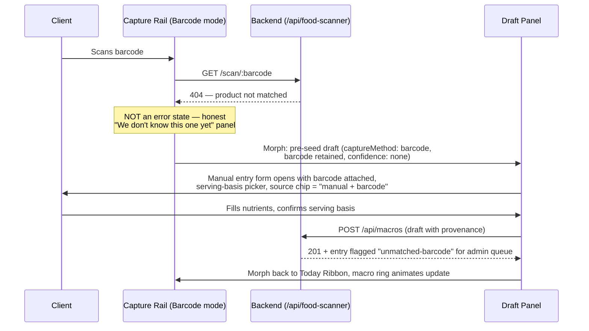

# Fusion Synthesis — Judge Verdict

> Fusion-style synthesis: one judge (anthropic/claude-fable-5) read all 9 parallel analyst outputs and extracted consensus, contradictions, unique insights, and blind spots, then wrote a fused recommendation.
> This is the "read me first" artifact — the structured distillation of the whole panel, the part of the Fusion architecture that carries most of the quality lift.

---

## Consensus Points

The panel converges strongly on the following (highest confidence):

1. **Overall verdict: APPROVE WITH CHANGES.** Analysts 1, 2, and 6 render this verdict explicitly; Analysts 3, 4, 8, and 9 reach the same substance — the brief is a genuinely strong, repo-grounded planning artifact whose gaps are correctable, not fatal.
2. **The fragmentation diagnosis is correct.** Analysts 2, 3, 4, 6, and 8 all validate that the split between `NutritionWorkspace` (hub) and the standalone `/food-scanner` route is a real UX and data-flow problem, and that convergence into a single decision logger is the right strategic move.
3. **The manual logger genuinely under-captures relative to backend capacity.** Analysts 3, 4, 6, and 8 confirm Gap 2/3: `DailyMacroLog` supports fiber, sugar, sodium, source, verification, etc., while the form captures only the big-four macros. Backend-complete, UI-missing.
4. **Gap 8 (schema drift in scanner admin edit) is the best-evidenced finding** — Analysts 1, 8, and 9 all single it out (`nutritionFacts` vs `nutritionalInfo`, `healthScore` vs `overallRating`, missing `allergens`), with Analyst 1 escalating it to a likely **live production bug**, not a planning note.
5. **The USDA client-side API call must move behind a backend proxy** — Analysts 1, 4, 8, and 9 agree the fix is right, though they differ on framing (see Contradictions).
6. **The `NutritionEntryDraft` contract is the right pattern but too loose as written.** Analysts 1 and 9 independently flag `Record<string, number | null>` and undocumented `rawPayloadRef`/`items` as implementation-divergence risks; Analyst 6 wants explicit top-level nutrient fields (fiber) for the same reason.
7. **"Extend around `DailyMacroLog`, don't rip it out" is pragmatic and endorsed** (Analysts 3, 4, 8).
8. **The "Truth + Review" layer is the real competitive differentiator** — Analysts 4 and 6 independently argue that trainer/admin verification of provenance-tagged data is what separates Swan from MyFitnessPal-class loggers (high capture, low truth).
9. **The `FoodIntakeForm.logic.ts` vs `FoodIntakeForm.tsx` citation ambiguity is real** — Analysts 1 (Finding 004) and 9 (Finding 2.1) both flag that the brief cites two different files for the same behavior without explaining their relationship; a possible phantom reference.
10. **Attachment-sourced evidence must be re-verified against the live repo before implementation** — Analysts 1, 8, and 9 all emphasize the "no direct repo access" caveat undermines confidence in every line-number citation.

## Contradictions

1. **Slice 4 (backend provenance schema) timing.** Analyst 2 argues Slice 4 is CRITICAL and should be elevated to run parallel with Slices 1–2, because frontend capture work will be limited or require rework if the backend cannot store the richer draft. Analyst 3 argues the document's order is correct (HIGH rating): unifying UI capture before schema migration avoids production regression, and "attempting to overhaul the database schema before unifying the UI capture flow is a recipe for regression." **Resolution: Analyst 3's position is better supported for implementation order** (production-safety, and the draft contract deliberately decouples capture from persistence), but Analyst 2's underlying concern is valid and is best satisfied by *designing* the provenance schema during Slice 2 while *migrating* in Slice 4 — the draft contract must be written against the future schema, not the current one.
2. **USDA key framing: overstated vs. under-escalated.** Analyst 1 (Finding 001, CRITICAL) says the brief *overstates* the issue by mischaracterizing USDA guidance as a hard compliance mandate — the real rationale is bundle exposure and key rotation. Analyst 9 (Finding 2.3) says the brief may *understate* it: if an actual key is present in browser code, this is a production security incident, not a planning concern. These are reconcilable and jointly better than the document: **strip the false compliance framing (Analyst 1) AND immediately verify whether a real key ships in the bundle (Analyst 9)** — the correct severity depends on that verification.
3. **Feasibility of the timeline.** Analyst 4 rates business/technical feasibility HIGH ("realistic for this stage"). Analyst 2 rates it MEDIUM, with per-slice reasoning that Slices 3–6 each plausibly consume 1–3 months, making the full plan a 6–12 month effort rather than 3–6. **Analyst 2 is better supported** — it grounds the assessment slice-by-slice, while Analyst 4's rating is holistic; Analyst 2's recommendation to define a tighter MVP (Slices 1, 2, simplified 3/4) is the safer read.
4. **Risk-assessment adequacy.** Analyst 4 calls the brief "well-researched" with sound external-reference warnings; Analyst 2 rates the risk coverage a HIGH gap (no competitor-response, API-volatility, data-volume, admin-burden, or liability analysis). **Analyst 2 is better supported** — Analyst 4's praise concerns the technical audit, not risk management; the risks Analyst 2 enumerates genuinely do not appear in the brief.

## Partial Coverage

Raised by some analysts, not all:

- **`BarcodeScanner.tsx` "dormant" classification is unproven** (Analysts 1 and 9): a grep-not-found from an attachment-based audit cannot support a dormancy call; reclassify as "unconfirmed — verify before any deprecation."
- **`/api/macros` dual-router mount / route shadowing** (Analyst 1 Finding 005; echoed by Analyst 8's note that the triage router claims `/api/macros/review-queue` first): overlapping method+path combos would silently shadow — should be a named risk, not a footnote.
- **The 100g scanner default is also a historical data-integrity problem** (Analyst 1 Finding 008; the limitation itself validated by Analyst 8): existing scanner-logged diary entries were stored at 100g basis regardless of actual serving.
- **Subscription-lock enforcement** (Analyst 1: verify server-side vs. client-side-only lock at `NutritionWorkspace.tsx:269-288`; Analyst 4: the locks are a monetization anchor for the new features).
- **Missing UX states**: loading/empty states for slow or empty USDA/OFF responses, "barcode not found" / OCR-failure flows, and a manual-override path that doesn't feel like an error (Analyst 3; Analyst 4 touches activation friction).
- **Performance and scale**: bundle size, debounce on search, index strategy for review-queue queries, data-volume growth (Analysts 2 and 9).
- **Competitive analysis absent** (Analyst 2 rates CRITICAL; Analyst 4 partially covers by asserting the moat is real and defensible against MyFitnessPal-class apps).
- **Open Questions lack defaults, owners, and slice-blocking tags** (Analyst 9's table; Analyst 2's prioritization critique is adjacent).
- **Slice 8 QA should be continuous, not terminal** (Analyst 2; Analyst 3's accessibility findings imply the same).
- **Health-data privacy posture** (Analyst 7: PHI-adjacent data, consent, DSAR, missing threat model; Analyst 2's liability risk overlaps).
- **Draft contract missing identity fields** — `userId` / `loggedByUserId` for trainer-on-behalf-of-client logging (Analyst 1; implied by Analysts 4/6's trainer-review emphasis).

Note: Analyst 5's response was substantially degenerate (repetition loop) and contributed only the observation that the brief's engagement surface is limited to a "streak" element in the Today Command Ribbon with no gamification framework analysis — treated as corroboration of Analyst 2's gamification-gap point.

## Unique Insights

- **Analyst 1**: Open Food Facts is **CC BY-SA 4.0** — seeding a Swan-owned `FoodProduct` catalog from OFF data may trigger share-alike obligations requiring legal review; add the **1024px breakpoint** (trainer tablets) to the responsive matrix with a two-column collapse rule; **remove the "Claude is editing Home dashboard files" agent-coordination note** from a Fable-facing document; confirm `ClientNutritionEstimateReviewPanel`'s actual mount point before Slice 6.
- **Analyst 2**: explicit **revenue mapping per slice** (Slices 1/3 drive retention; 4/5 enable premium "truth" positioning; 7 is niche); missed strategic opportunities in **behavioral nudges, AI coaching recommendations, and wearable integration**.
- **Analyst 3**: the brief is **brand-non-compliant as written** — wireframes must explicitly map every element to CSS custom properties (`var(--carbon, #141419)` panels, `var(--ice-wing, #60C0F0)` active states); **source/confidence chips must meet 44px touch targets and 4.5:1 contrast**; the Today Ribbon's **macro ring must be a Victory chart** for stack compliance.
- **Analyst 4**: novel monetization — **sell Swan's verified nutrition data as an API**, plus white-label/enterprise and affiliate plays.
- **Analyst 6**: the **Atwater 4-4-9 reconciliation rule** — flag "Metabolic Deviation" when calculated (P×4 + C×4 + F×9) vs. reported calories diverge >10% (rated CRITICAL); add **`workoutProximity`** (pre/intra/post) to the draft for nutrient-timing analysis; link **hydration status to sodium intake** in the Today Ribbon.
- **Analyst 7**: nutrition logs are **PHI-adjacent** — the plan ships with no threat model, consent workflow, retention policy, or DSAR handling; a documented security review should gate the merge.
- **Analyst 9**: **citation provenance tagging** (`[attachment]` vs `[live grep]`) and a Citation Confidence column; **contract versioning** (`contractVersion: '1.0'`) with a legacy-null-fields handling rule for existing `DailyMacroLog` rows; a **regression baseline** must be documented before "no regression" criteria mean anything; the Free AI Village review prompt creates **circular validation** (packet reviewed against itself); the separate `/food-scanner` route may have been a **deliberate PWA/camera-permission isolation** decision, not pure debt.

## Blind Spots

Gaps no analyst addressed, given the stated platform context:

1. **The 18-theme toggle matrix.** Analyst 3 checked contrast on the dark default, but nobody addressed verifying source/confidence chips, glows, and Victory chart palettes across **all 18 swappable themes** — the platform's defining constraint. A confidence-chip color that passes on Obsidian may fail on a lighter theme.
2. **The 300-lines/file rule.** `NutritionWorkspace.tsx` already mounts nine-plus panels; adding a Capture Rail, Draft Panel, and Source Truth Panel almost certainly violates the file-size constraint unless decomposition is planned up front. No analyst checked this.
3. **Offline/flaky-network capture.** Nutrition logging is a mobile, in-the-moment behavior; nobody addressed draft persistence when a barcode scan or USDA lookup happens without connectivity (should the `NutritionEntryDraft` queue locally?).
4. **Units and localization.** Household measures, gram/ounce handling, and label-format variance (US FDA vs. EU labels via OFF) go unexamined despite the multi-source catalog plan.
5. **Concurrent edits.** Trainer verifying an entry while the client edits it — no analyst addressed conflict handling for the review workflow.
6. **The Dual-Button Glow interaction spec** (blue bg → purple glow, purple bg → cyan glow) was never mapped to the capture/save CTAs, despite being a named brand rule.
7. **Telemetry.** No analyst proposed instrumentation to measure whether convergence actually improves logging completion — without funnel metrics, the plan's core hypothesis is unfalsifiable.
8. **Voice-capture lane specifics.** Voice is listed as a mounted lane, but no analyst examined how voice output normalizes into the draft contract or its confidence handling.

## Fused Recommendation

**Verdict: APPROVE WITH CHANGES — do not begin implementation until a one-day repo-verification spike closes the evidence gaps.** The brief's diagnosis (fragmentation, under-capture, provenance gap) is validated by the panel, its convergence-first sequencing is correct (Analyst 3 over Analyst 2 on order, with Analyst 2's schema concern absorbed into contract design), and the `NutritionEntryDraft` pattern is the right spine. Before Fable acts, the document requires:

1. **A Slice-0 verification spike (blocking):** confirm live-repo line numbers; confirm whether a real USDA key ships in the browser bundle (Analysts 1, 9); confirm whether the admin scanner-edit endpoint is reachable — if so, Gap 8 is a **live production bug to patch now, not in Slice 4** (Analyst 1); resolve the `FoodIntakeForm.logic.ts` phantom-file citation (Analysts 1, 9); confirm `BarcodeScanner.tsx` dormancy (Analysts 1, 9); audit `/api/macros` dual-router shadowing (Analysts 1, 8).
2. **Harden the contract:** replace open `Record`s with a typed `NutrientMap` (Analyst 1), add `userId`/`loggedByUserId` (Analyst 1), `fiber` and `workoutProximity` (Analyst 6), define `rawPayloadRef` semantics, and add `contractVersion` (Analyst 9). Add the Atwater 4-4-9 metabolic-deviation flag (>10%) to `reconciliationStatus` (Analyst 6).
3. **Fix the document itself:** tokenize the wireframes to `var(--token, #fallback)` (Analyst 3, CRITICAL), specify Victory for the macro ring, add 1024px to the responsive matrix (Analyst 1), define error/empty/manual-override states (Analyst 3), add the OFF CC BY-SA legal note (Analyst 1), remove the Claude coordination reference (Analyst 1), convert Open Questions into a defaults + slice-blocker table (Analyst 9), reframe Slice 8 as continuous QA (Analyst 2), and add a Current State Baseline and risk section covering API volatility, admin burden, data liability, and PHI-adjacent privacy (Analysts 2, 7, 9).
4. **Tighten scope:** treat v1 as Slices 1–2 plus a simplified 3 (barcode only, OCR deferred) and schema *design* in parallel with migration deferred to Slice 4 (Analysts 2, 9).

## Full Build Plan (Final Deliverable)

### Executive summary

SwanStudios' nutrition audit is sound: the platform has a real, valuable but fragmented nutrition surface, a backend (`DailyMacroLog`) far richer than its frontend uses, and a live standalone scanner that writes 100g-default, provenance-poor entries. The winning move — validated across the panel — is to converge all capture lanes (manual, search, barcode, voice, later OCR) into one **Nutrition Decision Logger** built around a hardened `NutritionEntryDraft` contract, then layer on provenance, Atwater reconciliation, and trainer/admin verification, which is the platform's genuine moat versus MyFitnessPal-class loggers. Before any build, a one-day repo-verification spike must confirm three possible **live production issues**: an exposed USDA key in the browser bundle, a schema-drift admin-edit endpoint writing to nonexistent fields, and silent route shadowing on `/api/macros`. Realistic total scope is 6–12 months; v1 (Slices 0–4 below) is shippable in roughly one quarter.

### System architecture

**Intent → API → State → Render pipeline:**

```mermaid
flowchart TD
    U[User intent: "I have the package / I know the food / I grew it"] --> CR[Capture Rail<br/>var--carbon panel, 44px targets]
    CR -->|Manual| MF[Manual Form - full NutrientMap fields]
    CR -->|Search| FS[Food Search]
    CR -->|Barcode| BS[Barcode Scanner - lazy module,<br/>camera-permission isolated]
    CR -->|Voice| VC[Voice Capture]
    FS --> PX["Backend Proxy /api/nutrition/search<br/>(USDA + OFF, key server-side, cached, rate-limited)"]
    BS --> SC["/api/food-scanner/scan/:barcode"]
    MF --> D
    PX --> D[NutritionEntryDraft v1.0<br/>typed NutrientMap, source, confidence,<br/>servingBasis, userId, workoutProximity]
    SC --> D
    VC --> D
    D --> REC[Reconciliation Engine<br/>Atwater 4-4-9 check, >10% = Metabolic Deviation flag]
    REC --> DP[Draft Review Panel<br/>source chip + confidence chip, WCAG 4.5:1]
    DP -->|Client confirms| API[POST /api/macros<br/>full provenance payload]
    API --> ST[(DailyMacroLog<br/>extended, not replaced)]
    ST --> RQ[Trainer/Admin Review Queue<br/>verify = differentiator]
    ST --> TR[Today Ribbon render:<br/>Victory macro ring, hydration-sodium link, streak]
    RQ --> TR
```

**Morph transition — barcode fail → manual override (Analyst 3's non-failure fallback):**



### Sequenced build slices (smallest diamond first)

0. **Repo-verification spike** — confirm/deny: USDA key in bundle, admin-edit schema drift reachability, `/api/macros` route shadowing, `FoodIntakeForm.logic.ts` existence, `BarcodeScanner.tsx` dormancy, `ClientNutritionEstimateReviewPanel` mount point, subscription-lock server-side enforcement. *Success: every citation re-tagged `[live-verified]` and all three live-bug candidates resolved or ticketed.*
1. **Production hotfixes** — patch schema-drift field names, remove any bundled USDA key behind an interim thin proxy, document router ownership on `/api/macros`. *Success: admin edits persist correctly and no key appears in the built bundle.*
2. **Capture shell convergence** — unified Capture Rail + Today Ribbon in `NutritionWorkspace` (tokenized: `var(--carbon,#141419)` panels, `var(--ice-wing,#60C0F0)` actives, Victory macro ring), files decomposed to ≤300 lines. *Success: all existing lanes reachable from one shell with zero regression to `/api/macros` payloads.*
3. **`NutritionEntryDraft` v1.0 contract** — typed `NutrientMap` (incl. fiber), `userId`/`loggedByUserId`, `workoutProximity`, `contractVersion`, defined `rawPayloadRef`; manual + search lanes emit drafts; future-schema fields designed now, persisted later. *Success: manual and search saves round-trip through the draft with correct serving-basis math.*
4. **Backend proxy + barcode convergence** — full USDA/OFF proxy with caching and rate limits; scanner embedded as a lazy capture mode (camera-permission isolation preserved); label-serving/household/weighed quantity replaces the 100g default; unmatched-barcode → manual-override morph. *Success: a scan logs at label serving size and an unmatched barcode completes via manual override without an error state.*
5. **Provenance schema migration (Fable-approved)** — extend `FoodProduct`/`DailyMacroLog` with source version, market country, confidence, review status, raw-payload linkage; legacy rows render "logged before provenance" honestly; 100g-era data disclosed in admin view. *Success: migration runs with zero data loss and unchanged existing API response shapes.*
6. **Reconciliation engine** — Atwater 4-4-9 calc vs. reported with >10% Metabolic Deviation flag; per-serving/per-100g/weighed/household/label-rounded cases tested. *Success: all five calculation cases pass and deviations surface a visible flag chip.*
7. **Trainer/admin data-quality layer** — trainer verify for assigned clients, admin global authority; lightweight queues (unverified estimates, unmatched barcodes, metabolic deviations); RBAC + audit receipt. *Success: a trainer verifies an entry, the client sees the verified chip, and no unrelated rows mutate.*
8. **Local produce/farm mode (v2)** — PLU/local-source-tagged drafts feeding the same contract. *Success: a farm-sourced entry lands in the diary with source provenance and review-queue handoff.*
9. **Continuous QA gate (runs inside every slice, not last)** — 414/768/**1024**/1440/4K matrix, 44px targets, 4.5:1 contrast across the 18-theme set for chips and ring, reduced motion, focus states. *Success: each slice's PR includes a passed QA checklist.*

### Decisions on every open question

1. **Scanner embed vs. separate route:** Embed as a lazy-loaded capture mode in Slice 4, preserving camera-permission isolation via module boundary — convergence is the plan's core thesis (Analysts 3, 4, 8) and Analyst 9's isolation rationale is satisfied by lazy mounting; keep `/food-scanner` as a redirect.
2. **Label-photo OCR in v1:** **Defer to v2** — Analyst 2's feasibility analysis and Analyst 9's default both say barcode/search/manual is enough for v1.
3. **Local produce in v1:** **Defer** (Slice 8) — rated LOW-priority/niche by Analysts 2 and 9.
4. **Trainer vs. admin verify authority:** **Trainer verify for assigned clients, admin global override** — trainer verification is the named differentiator (Analysts 4, 6); RBAC-tested in Slice 7.
5. **Admin operation scope:** **Lightweight queue only in v1** — Analyst 2's admin-burden risk and Analyst 9's default both counsel against a full data-ops console before volume justifies it.

### Risk table

| Risk | Severity | Mitigation |
|---|---|---|
| **Building Slices 2–4 on unverified attachment-sourced repo state (stale citations, phantom `.logic.ts`, misjudged dormancy) — MOST LIKELY FATAL RISK** | Critical | Slice 0 blocking spike; provenance-tag every citation before any code |
| USDA key live in browser bundle | Critical | Slice 1 hotfix: rotate key, interim thin proxy, full proxy in Slice 4 |
| Schema-drift admin edits silently failing in production | Critical | Slice 1 hotfix; audit affected rows |
| `/api/macros` route shadowing causes intermittent bugs when new endpoints land | High | Slice 0 audit + documented router ownership before Slice 3 |
| Historical scanner entries stored at 100g basis mislead trainers | High | Disclose in admin view; optional re-log prompt (Analyst 1) |
| OFF CC BY-SA share-alike contaminates Swan-owned catalog | High | Legal review before any OFF-seeded catalog; read-only lookups safe |
| Scope overrun (6–12 months vs. 3–6 assumed) | High | v1 = Slices 0–4; defer OCR/produce/full console (Analyst 2) |
| Confidence chips fail contrast/touch targets across 18 themes | Medium | Continuous QA gate; group chips into one 44px metadata row (Analyst 3) |
| Admin review-queue volume overwhelms operators | Medium | Lightweight queue v1, index strategy for queue queries (Analysts 2, 9) |
| PHI-adjacent data with no threat model/consent/DSAR posture | Medium-High | Security-by-design review + privacy artifacts before Slice 5 migration (Analyst 7) |
| External API downtime/volatility (USDA/OFF) | Medium | Backend caching, honest unavailable states, manual-override morph |

### The one de-risking experiment

**Run the Slice-0 repo-verification spike as a one-day, zero-feature experiment before any investment:** a single engineer with live repo access greps for the USDA key in the built bundle, hits the admin scanner-edit endpoint in staging to confirm the schema-drift write behavior, enumerates both `/api/macros` routers' method+path registrations, and confirms the existence/paths of `FoodIntakeForm.logic.ts` and `BarcodeScanner.tsx` mounts. This single cheap pass resolves the panel's three candidate production bugs and every disputed citation, and determines whether Slice 1 is a hotfix sprint or a no-op — converting the plan's largest unknown (evidence trustworthiness, flagged independently by Analysts 1, 8, and 9) into verified fact before a dollar of feature work is spent.
