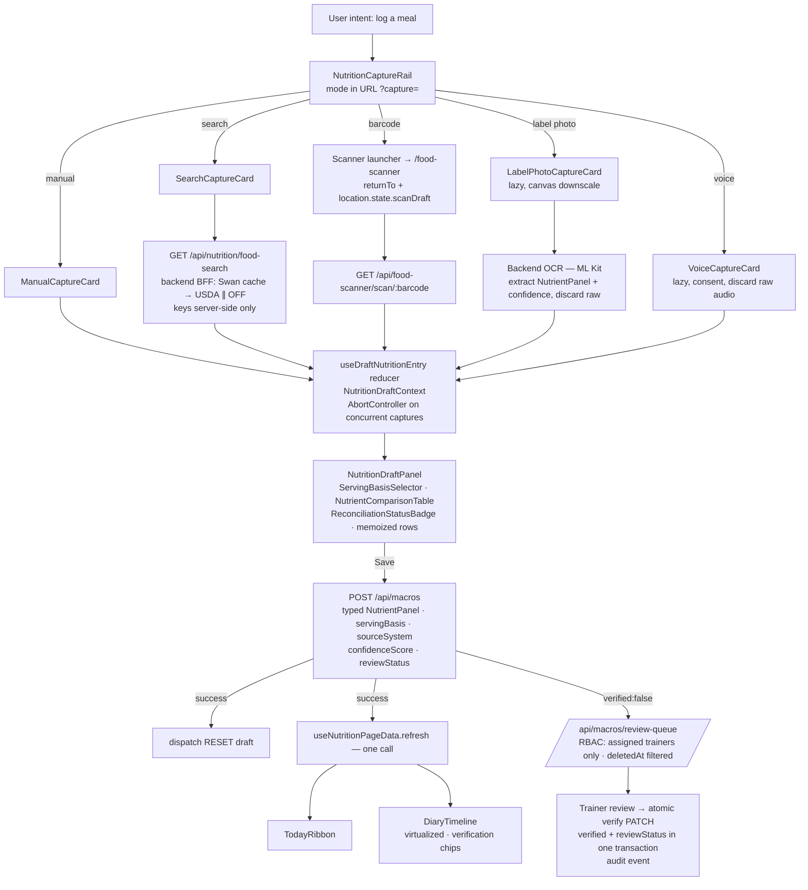
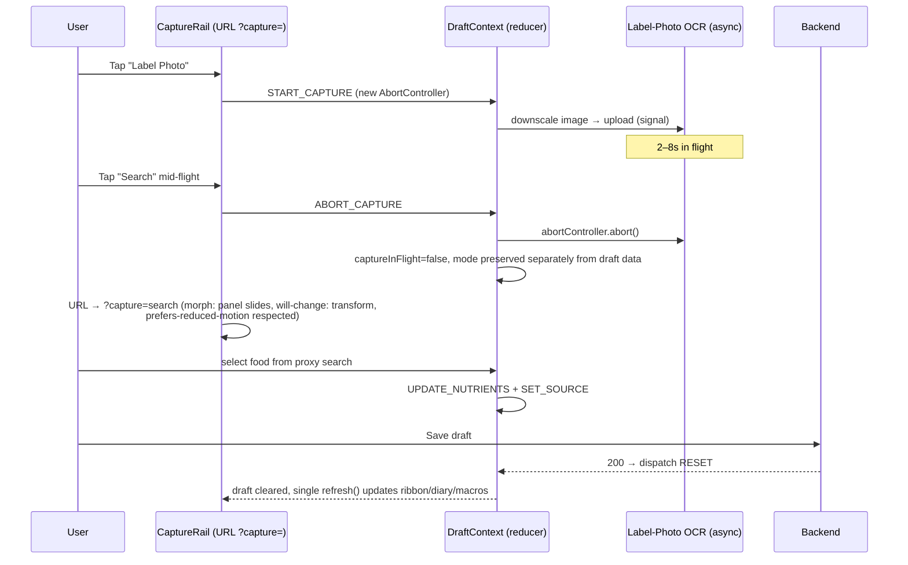

# Fusion Synthesis — Judge Verdict

> Fusion-style synthesis: one judge (anthropic/claude-fable-5) read all 12 parallel analyst outputs and extracted consensus, contradictions, unique insights, and blind spots, then wrote a fused recommendation.
> This is the "read me first" artifact — the structured distillation of the whole panel, the part of the Fusion architecture that carries most of the quality lift.

---

## Consensus Points

1. **USDA / Open Food Facts API keys must move behind a backend proxy before any other work ships.** Analysts 2, 3, 4, 6, 7, and 9 all flag the client-side calls in `FoodSearchPanel.logic.ts:55/:148` as CRITICAL. Analysts 2, 4, and 7 explicitly say this gates Slice 1/2; Analyst 6 says it must be a pre-Slice-1 task; Analyst 9 proposes the concrete endpoint shape (`GET /api/nutrition/food-search?q=&source=`), which is also where Analyst 4's Swan-cache-first BFF lookup lives.

2. **The Sequelize silent-data-loss bug in `foodScannerRoutes.mjs:375-376` (writing `nutritionFacts`/`healthScore`/`allergens` fields that don't exist on `FoodProduct`) is a production-corrupting defect that must be hot-fixed before schema work.** Flagged as CRITICAL by Analysts 4, 5, 6, 7, and 9, with Analyst 6 demanding a regression test that asserts unknown keys are rejected, not silently dropped.

3. **Replace `Record<string, number | null>` nutrient maps with a typed `NutrientPanel` interface.** Analysts 2, 5, 7, and 8 converge on the same shape: named core macros plus a server-validated `extra` escape hatch (Analyst 8 adds max-key-count and key-length caps).

4. **`NutritionWorkspace.tsx` and `FoodScannerPage.tsx` will blow the 300-line budget and must be decomposed.** Analysts 2, 6, and 10 independently propose nearly identical splits: a thin orchestrator (<100 lines) composing a Today ribbon, capture rail, draft/review panel, source-truth panel, and diary timeline, with per-mode capture cards as separate lazy-loadable files.

5. **Heavy capture dependencies (ML Kit barcode/OCR, RecipeBuilder, AdminReviewConsole) must be `React.lazy()` loaded.** Analysts 2, 4, and 7 all require strict code-splitting; Analyst 4 quantifies ML Kit at ~200–500KB gzip.

6. **The `servingSizeGrams: 100` hardcode in `FoodScannerPage.tsx:472-475` must be replaced with a user-facing serving-basis selector.** Analysts 2, 5, and 7 agree; Analyst 7 notes the backend already supports the math, and Analyst 2 adds that the hardcode corrupts the reconciliation signal (`missing_source` forever).

7. **Trainer-for-client logging needs an explicit `targetUserId` with server-side ownership validation, or must be explicitly scoped out of v1.** Analysts 3, 5, 6, and 7 converge; Analyst 3 frames the IDOR risk, Analyst 6 recommends designing the contract now but shipping self-log only.

8. **Camera/microphone streams must be explicitly stopped (`track.stop()` in cleanup / `try/finally`).** Analysts 3 and 4 raise identical mitigations; Analyst 3 adds consent and discard-raw-audio requirements.

9. **`React.memo` on capture cards and draft food-line rows; memoize the reconciliation calculation.** Analysts 2, 4, and 7 agree on the render-thrash risk of the draft panel re-rendering on every keystroke.

10. **Limit v1 admin queues to three essentials (client-estimate review, unmatched barcode, low OCR confidence).** Analysts 5 and 6 both call the full queue list scope creep; Analyst 2's structural version is the same point: keep `ClientNutritionEstimateReviewPanel` separate from a new `NutritionSourceQualityConsole`.

11. **Plain-language status labels, source chips, and confidence indicators are required trust signals.** Analysts 1, 5, and 8 agree: surface `sourceSystem` + confidence visually, translate internal enums ("calculated_differs" → "Calories differ slightly"), and enforce a strict review-status state machine (Analysts 5, 6, 8).

12. **Overall verdict: APPROVE WITH CHANGES.** Explicitly stated by Analysts 2, 4, and 7; implied by 3, 5, 6, and 8 (all demand pre-merge fixes but endorse the architecture and phasing).

## Contradictions

1. **Where OCR runs: client-side WebGPU vs backend ML Kit.** Analyst 12 proposes on-device OCR via Transformers.js/WebGPU (privacy, zero latency, no server cost). Analysts 3, 4, and 8 assume backend processing with client-side image downscaling (Analyst 4), server-held keys, and defined payload lifecycle (Analyst 8). **Better supported: backend for v1** — it is grounded in the plan's ML Kit choice, keeps confidence scoring consistent, and fits Analyst 8's discard-after-extraction lifecycle. Analyst 12's WebGPU path is a legitimate roadmap item, not a v1 dependency.

2. **Debouncing manual macro inputs.** Analyst 7 says do **not** debounce manual macro fields (users need immediate reported-vs-calculated feedback); Analyst 4 says debounce the calculated-calories derivation to avoid lag. **Resolution supported by both:** never debounce the controlled input value itself (Analyst 7), but debounce/`useMemo` the downstream reconciliation computation keyed to the items array (Analyst 4's actual target). These are compatible once the target of the debounce is named precisely.

3. **Slice 2 → Slice 3 coupling.** The plan (and Analyst 2's dependency framing) has barcode/label-photo convergence wait on the draft contract; Analyst 6 recommends decoupling Slice 3 so scanner UI work can proceed in parallel. **Better supported: Analyst 2's approach with Analyst 6's mitigation** — freeze all shared types in a single `types/nutritionDraft.ts` first (Analyst 2's circular-import fix), then parallelize safely against the frozen contract, which is what Analyst 6's "versioned draft interface" amounts to.

4. **React 19 Server Components (Analyst 12) vs the SPA architecture every other analyst assumed.** Analyst 12's RSC refactor conflicts with the established client-side lazy-loading, context-based draft state (Analyst 2), and the styled-components stack rule. **Better supported: the SPA consensus** — eleven analysts built their recommendations on it; RSC is rejected for this feature.

5. **Retired-palette violation inside the panel itself.** Analyst 11's focus-outline code sample uses `var(--token, #00FFFF)` — Galaxy-Swan cyan, explicitly retired. No other analyst caught it. The correct fallback per brand rules is Ice Wing `#60C0F0`. Analyst 11's underlying recommendation (visible focus indicators) stands; the fallback value must be corrected.

## Partial Coverage

- **Draft state ownership** (Analysts 2, 7, 10): a single `useDraftNutritionEntry` reducer hook + `NutritionDraftContext`, with capture cards consuming context rather than props. Analyst 2 is most complete (typed actions, dispatch distribution); Analysts 7 and 10 propose the same hook under different names.
- **Data-at-rest safety** (Analysts 3, 8 only): unbounded `items` JSONB growth, CHECK constraints on array length and byte size, `rawPayloadRef` as a 256-char storage key (never inline content), soft-delete `deletedAt` with review-queue filtering, cascade cleanup hooks, column-level encryption for allergen/health fields.
- **Security hardening** (Analyst 3, echoed partially by 8): upload MIME/size validation, virus scanning, XSS sanitization of user-generated food names, rate limiting on verification endpoints, audit logging of trainer/admin actions, route-level RBAC on `/api/macros/review-queue`.
- **Performance engineering** (Analysts 4, 11): virtualize the diary timeline (>20 entries/day), SWR/query caching for barcode lookups, nullify image blobs after draft conversion, GPU-layer glow animations, single BFF lookup to collapse the search→select→details→reconcile waterfall.
- **Testing gaps** (Analyst 6, partially 5): no visual regression (Storybook + Chromatic), no E2E for barcode→label-photo fallback or mobile breakpoints, no integration test for save→review-queue, no aXe accessibility audit.
- **Rollback strategy** (Analyst 6 only in depth): feature-flag every UI shell (`nutritionCaptureV2`), reversible migrations tested on staging, `ENABLE_REVIEW_QUEUE` config switch.
- **Persona/tap-count analysis** (Analyst 5, echoed by 1): 3–4 taps max to log; Quick Add as highlighted default; ribbon-first, no sub-menus; collapsible draft panel on mobile.
- **Responsive/edge cases** (Analyst 11, partially 5, 7): 320px squeeze (CRITICAL), screen-reader landmarks (CRITICAL), iOS Safari autoplay/keyboard push-off, offline empty states, line-clamp for long product names.
- **Health-data compliance** (Analysts 3, 8, 12): nutrition logs as health-adjacent PII, ZERO-PII-to-LLMs sanitization, retention policy definition, trainer row-level access via `TrainerClientAssignments` join.

## Unique Insights

- **Analyst 1:** Competitor benchmarks — the multimodal "Add Food" hub pattern (MyFitnessPal/Lifesum), Fitia's verified-database trust model, and Trainerize-style one-tap trainer review actions validate the plan's direction against the market.
- **Analyst 2:** The **async capture race condition** — voice/OCR requests in flight can overwrite each other's draft writes; fix with `captureInFlight` + `AbortController` in the reducer. Also: active capture mode belongs **in the URL** (`?capture=barcode`), enabling deep links and a clean scanner return path; explicit **draft RESET on save success** to prevent double-submit; and the **`types/nutritionDraft.ts` single-source-of-types** file to kill circular imports.
- **Analyst 3:** Voice recordings may qualify as **biometric data under GDPR/CCPA** — explicit opt-in consent, on-device speech-to-text, immediate discard; plus upload anti-virus scanning and signed-URL storage outside web-root.
- **Analyst 4:** **Client-side image downscaling (Canvas API) before OCR upload** — "no need to upload a 12MP photo to parse 100 bytes of text"; plus concrete bundle-size tallies and the parallel-source BFF aggregator.
- **Analyst 5:** The **emotional-response audit** of the Crystalline Swan theme (premium vs intimidating; sparkle micro-animation on verified entries) and a concrete **usability test with a 45-year-old participant**.
- **Analyst 6:** The **per-phase rollback matrix** with feature flags and reversible migrations, and moving the silent-drop fix + proxy into **pre-slice hotfixes** as an explicit re-ordering of the plan.
- **Analyst 7:** **CSS Grid `grid-template-areas`** for reordering the three panels across breakpoints without duplicating JSX; framer-motion pan gestures for swipe-to-edit **with a mandatory "…" menu fallback** for screen readers; styles in adjacent `styles.ts` files to protect the 300-line budget.
- **Analyst 8:** The deepest data-safety findings: **JSONB CHECK constraints** (≤50 items, ≤64KB), the **review-status state-machine transition table** enforced at the API layer, **atomic verify PATCH** (both `verified` and `reviewStatus` in one transaction), soft-delete phantom-row risk in review queues, and storage-cleanup Sequelize hooks.
- **Analyst 9:** The **route-mount ordering constraint** — `/api/macros` triage router mounts before the generic macro router, so new endpoints must respect triage priority; and the Swan-catalog-first search fallback chain formalized as endpoint design.
- **Analyst 10:** A complete **feature-folder proposal** (`workspaces/nutrition/{components,hooks,utils,styles}`) with the observation that a feature-local `tokens.ts` is unnecessary because theming is global.
- **Analyst 11:** The **10-breakpoint responsive matrix** (320px→3840px), 56px touch targets below 768px, iOS Safari autoplay gating, mobile keyboard push-off handling, RTL logical properties, and ultrawide background handling.
- **Analyst 12:** Regulatory and strategic gaps no one else touched: **FTC HBNR — no third-party pixels on the nutrition route**; **FDA general-wellness guardrails** (never prescribe food for disease); AI-estimate disclaimers in Gilded Fern; **CGM/glucose overlay via Victory charts**; **FHIR `NutritionIntake` export mapping**; recovery-multiplier gamification; anonymized-data consent architecture.

## Blind Spots

1. **Timezone and date-boundary handling for "Today."** Every surface (ribbon, diary, macro totals, streaks) keys on a date, yet no analyst defined whether "today" is user-local or server UTC — a classic source of diary entries appearing on the wrong day for traveling users.
2. **Draft persistence across sessions/crashes.** Analyst 11 covered offline fetch failures, but nobody addressed what happens to an in-progress `NutritionEntryDraft` if the browser closes mid-entry (localStorage/sessionStorage draft recovery), despite the draft being the feature's central artifact.
3. **Concurrent-edit conflicts.** A trainer verifying an entry while the client edits it is unhandled — no analyst proposed optimistic locking or a version field on `DailyMacroLog`, even though Analyst 8's state machine implies the need.
4. **Backfill semantics for existing production rows.** Analyst 5 mentioned "backfill plan" in one line; nobody specified what `reviewStatus`/`servingBasis`/`sourceSystem` defaults existing `DailyMacroLog` rows receive when new columns land, which directly affects queue contents on day one.
5. **Adoption telemetry.** With nine capture modes, no analyst proposed instrumentation to measure which lanes users actually use — critical for deciding which modes to invest in after v1.
6. **18-theme sweep for new components.** Analyst 6's visual regression covers this implicitly, but no analyst explicitly required verifying the new capture rail/draft panel against all 18 themes or auditing for retired Galaxy-Swan values — a gap made concrete by Analyst 11's own `#00FFFF` slip.
7. **Trainer notification strategy.** The review queue exists, but nobody addressed how trainers learn that items await review (push, badge, email digest), which determines whether the "Truth" layer is ever exercised.

## Fused Recommendation

**APPROVE WITH CHANGES.** The plan's direction — converging nine capture lanes into a single decision-logger shell with a draft → review → save pipeline and provenance-aware trainer review — is validated both by market benchmarks (Analyst 1) and by the architecture panel (Analysts 2, 4, 7). But four gates must close **before any slice ships code**, per near-unanimous consensus:

1. **Pre-slice hotfixes (Slice 0):** backend proxy for USDA/OFF (`GET /api/nutrition/food-search`, Swan-cache-first, parallel-source BFF — Analysts 2, 4, 9), the `foodScannerRoutes.mjs:375-376` field-mapping fix with a Sequelize unknown-key regression test (Analysts 6, 7), and the `servingSizeGrams: 100` frontend fix (Analysts 2, 5, 7).
2. **Contract freeze:** a single `types/nutritionDraft.ts` exporting the typed `NutrientPanel` (named macros + capped `extra`), `CaptureMode`, `ServingBasis`, `SourceSystem`, the review-status **state machine** (Analyst 8's transition table), a 0–1 `confidenceScore`, an optional `targetUserId` (self-log only in v1), and `rawPayloadRef` defined as a storage-key reference with discard-after-extraction for OCR/voice in v1 (Analysts 2, 6, 7, 8).
3. **State architecture:** `useDraftNutritionEntry` reducer + `NutritionDraftContext`; active capture mode in the URL (`?capture=`); `AbortController` guarding concurrent async captures; draft RESET on save success; one `useNutritionPageData.refresh()` after saves (Analyst 2, corroborated by 7 and 10).
4. **Data-safety migrations before Phase B:** JSONB CHECK constraints on `items`, `deletedAt` soft-delete with review-queue filtering, atomic verify PATCH, trainer row-level access via assignment joins, and audit logging of verification actions (Analysts 3, 8).

Everything else — component decomposition to respect the 300-line budget, lazy-loaded heavy lanes, three-queue-only admin console, responsive/a11y hardening per Analyst 11's matrix, compliance guardrails per Analyst 12 (no third-party pixels, AI disclaimer, wellness-only AI prompts), and feature-flagged rollback per Analyst 6 — is sequenced into the slices below. Defer WebGPU OCR, RSC, CGM overlay, and FHIR export to a labeled roadmap; adopt the FHIR-compatible field naming now (cheap insurance per Analyst 12).

## Full Build Plan (Final Deliverable)

### Executive Summary

SwanStudios will converge its fragmented nutrition tools (manual, search, barcode, label-photo, voice, recipe, repeat, local produce) into a single **Nutrition Decision Logger**: a capture rail feeding one shared `NutritionEntryDraft`, reviewed in a draft panel with source/confidence provenance, saved to the existing `DailyMacroLog`, and surfaced to trainers through a three-queue review console. Two production defects gate everything: client-exposed USDA API keys and a Sequelize bug silently dropping admin edits — both are fixed in Slice 0 before any UI work. The build is feature-flagged, migration-reversible, and phased so each slice ships independently; the schema migration (provenance + JSONB guards + soft-delete) lands only after the frontend contract is proven against the existing schema. Compliance guardrails (no third-party pixels on nutrition routes, AI-estimate disclaimers, wellness-only AI boundaries) ship with v1.

### System Architecture

**Intent → API → State → Render pipeline:**

**Morph transition: capture-mode switch with in-flight abort (Analyst 2's race-condition fix):**

### Sequenced Build Slices (smallest-diamond-first)

1. **Slice 0a — Backend food-search proxy.** `GET /api/nutrition/food-search` (Swan-cache-first, parallel USDA/OFF, keys in env, rate-limited). *Success: bundle contains zero external API keys (asserted by test); search works via proxy.*
2. **Slice 0b — Sequelize silent-drop hotfix.** Remap scanner admin-edit fields to real `FoodProduct` columns; add unknown-key regression test. *Success: admin edits persist; regression test red-before/green-after.*
3. **Slice 0c — Contract freeze.** `types/nutritionDraft.ts` with `NutrientPanel`, enums, state machine, `targetUserId?`, `rawPayloadRef` as storage key; unit tests. *Success: all nutrition modules import types from this one file only.*
4. **Slice 1 — Draft state core.** `useDraftNutritionEntry` reducer + `NutritionDraftContext` + `useNutritionPageData` refresh hook, with AbortController and RESET-on-save. *Success: unit tests cover all actions incl. concurrent-capture abort and reset-after-save.*
5. **Slice 2 — Capture shell (feature-flagged `nutritionCaptureV2`).** `NutritionWorkspace` becomes a <100-line orchestrator; Today ribbon + capture rail (mode in URL); existing panels mounted behind the shell; CSS Grid `grid-template-areas`; 44px/56px targets; ARIA landmarks. *Success: flag off = old UI byte-identical; flag on = shell renders at 320px–3840px with no overflow.*
6. **Slice 3 — Manual + search lanes on the contract.** Both lanes write richer existing `DailyMacroLog` fields via `POST /api/macros`; controlled inputs undebounced, reconciliation derivation memoized; draft resets on save; one refresh call. *Success: a search-sourced entry persists fiber/sugar/sodium and appears in the diary without double-fetch.*
7. **Slice 4 — Scanner convergence.** Launcher to `/food-scanner` with `returnTo` + `location.state.scanDraft`; `ServingBasisSelector` replaces the 100g hardcode (label_serving + per_100g only in v1). *Success: scan → return → pre-populated draft with user-chosen serving basis saved correctly.*
8. **Slice 5 — Label-photo OCR lane.** Lazy-loaded card; canvas downscale before upload; MIME/size validation server-side; extract `NutrientPanel` + confidence, **discard raw payload**; confidence chip with plain-language labels; entry saved `verified:false`. *Success: low-confidence OCR entry lands in review queue with amber chip; no raw image retained.*
9. **Slice 6 — Reconciliation engine (stub-first).** Reported-vs-calculated calories (Atwater 4/4/9/2), memoized; `ReconciliationStatusBadge` with plain-language statuses. *Success: a rounded-label product shows "Rounded to label" not an error.*
10. **Slice 7 — Provenance schema migration (Fable-approved, reversible).** New `NutritionSourceRecord` table (hybrid model — `FoodProduct` stays for barcoded goods); `DailyMacroLog` columns (`sourceRecordId`, `servingBasis`, `confidenceScore`, `reviewStatus`, `deletedAt`, `rawPayloadExpiresAt`); JSONB CHECK constraints (≤50 items, ≤64KB); backfill defaults for existing rows; rollback script tested on staging. *Success: migration up/down clean on staging copy of production data; existing rows readable with sane defaults.*
11. **Slice 8 — Trainer/admin review console (3 queues only).** Client-estimate review, unmatched barcode, low OCR confidence; `NutritionSourceQualityConsole` sibling to the existing panel sharing `useNutritionReviewQueue`; RBAC via trainer-client assignment join; `deletedAt` filtering; atomic verify PATCH; audit events; rate-limited verification. *Success: a trainer sees only assigned clients' items; verify updates both flags in one transaction and writes an audit row.*
12. **Slice 9 — Voice hardening + local produce placeholder.** Voice: consent opt-in, on-device STT where available, discard audio, `track.stop()` in finally; contextual-bias hints from recent meals. Local produce: manual-source-tag lane only. *Success: no audio blob exists server-side after a voice log; PLU entry saves with `sourceSystem:'local'`.*
13. **Slice 10 — Design QA & release hardening.** 10-breakpoint matrix, aXe audit, Storybook + Chromatic visual regression across all 18 themes, retired-palette grep (no `#00FFFF`/`#0a0a1a`/`#7851A9` anywhere including fallbacks), `prefers-reduced-motion` guards, no-third-party-pixels check on nutrition routes, AI-estimate disclaimer in Gilded Fern. *Success: zero CRITICAL/HIGH a11y findings; theme sweep passes; compliance checklist signed.*

### Decisions on Every Open Question

| Open question | Decision | Why (one line) |
|---|---|---|
| Scanner: embed vs launcher | **Launcher with `returnTo` + `location.state.scanDraft`** | Analyst 2: clean data handoff without bloating `NutritionWorkspace`; preserves existing route (Analyst 6 rollback). |
| Provenance model | **Hybrid: keep `FoodProduct` for barcoded goods; new `NutritionSourceRecord` for everything else** | Analysts 5, 6: avoids violating the unique-barcode constraint for OCR/manual items. |
| `confidenceScore` scale | **Normalized 0–1, documented in `types/nutritionDraft.ts`, range-validated** | Analyst 6: inconsistent scales break queue filtering. |
| Trainer logging for clients | **`targetUserId` in the contract now; self-log only in v1; server validates ownership** | Analysts 3, 6, 7: prevents IDOR while avoiding a breaking contract change later. |
| Which admin queues in v1 | **Three: client-estimate, unmatched barcode, low OCR confidence** | Analysts 5, 6: the rest is scope creep that blows the Slice 6 budget. |
| `rawPayloadRef` semantics | **Storage-key reference (≤256 chars); v1 discards raw OCR/voice after extraction** | Analyst 8: eliminates retention, cleanup, and PII liability in one move. |
| Serving-basis scope | **`label_serving` + `per_100g` in v1; household/weighed deferred** | Analyst 6: bounds the unit-conversion surface and the file budget. |
| Nutrient typing | **Typed `NutrientPanel` + capped `extra` map, server-validated** | Analysts 2, 7, 8: kills the "JSON soup" that reproduced the proteins_100g chaos. |
| Active-capture-mode owner | **URL query param (`?capture=`)** | Analyst 2: enables deep links and simplifies the scanner return path. |
| Review-status semantics | **Strict state machine enforced at the API layer; `verified` terminal; atomic PATCH** | Analyst 8: prevents contradictory states like `swan_verified` + `needs_admin_source_review`. |
| Where OCR runs | **Backend (ML Kit) with client-side canvas downscale; WebGPU on-device is roadmap** | Analysts 3, 4, 8 over Analyst 12: plan-grounded, key-controlled, defined lifecycle. |
| Local produce lane | **Placeholder manual-source tag only in v1** | Analyst 6: no data model exists yet; full farm-market flow deferred. |
| Phase ordering | **Silent-drop fix + proxy promoted to Slice 0; frontend contract before schema migration** | Analysts 6, 8: remove production-corrupting risks before adding surface area. |

### Risk Table

| Risk | Severity | Mitigation |
|---|---|---|
| **⚠️ FATAL RISK: shipping capture convergence on top of broken write paths — Sequelize silently dropping fields + 100g hardcode — silently corrupting production diary data at 9× the current write volume** | **CRITICAL** | Slice 0b hotfix + unknown-key regression test + serving-basis fix ship before any new lane goes live; integration test barcode→draft→save→queue (Analyst 6). |
| USDA/OFF API keys exposed client-side | CRITICAL | Slice 0a backend proxy; bundle test asserting no keys; rate limiting (Analysts 2, 3, 4, 6, 9). |
| Unbounded `items` JSONB growth bloating `DailyMacroLog` | CRITICAL | CHECK constraints (≤50 items, ≤64KB); typed `NutrientPanel`; `rawPayloadRef` as reference only (Analyst 8). |
| Health-adjacent PII (voice, OCR, allergens) retained without policy | CRITICAL | Discard-after-extraction; consent opt-in for voice; retention policy defined pre-ship; PII sanitization before any LLM call (Analysts 3, 8, 12). |
| IDOR: trainers reading unassigned clients' diaries | HIGH | Row-level access via `TrainerClientAssignments` join on every queue query; audit logging (Analysts 3, 8). |
| Async capture race corrupting the draft | HIGH | `AbortController` + `captureInFlight` in reducer; mode-switch guard (Analyst 2). |
| 300-line budget violations (`NutritionWorkspace`, `FoodScannerPage`, draft panel) | HIGH | Decomposition per Analysts 2/10; styles in adjacent `styles.ts` files (Analyst 7). |
| ML Kit bundle bloat (~200–500KB) in main bundle | HIGH | `React.lazy` all scanner/OCR/recipe/admin components (Analysts 2, 4, 7). |
| Review queue showing phantom/contradictory rows | HIGH | `deletedAt` soft-delete + filter; enforced state machine; atomic verify PATCH (Analyst 8). |
| 320px overflow and missing screen-reader landmarks | HIGH | Auto-fit grid collapse, ARIA `main` + labeled buttons, 10-breakpoint smoke test (Analyst 11). |
| XSS via user-generated food names | HIGH | Escape/sanitize rendering; server-side payload whitelisting (Analyst 3). |
| Regulatory exposure (HBNR pixels, AI-washing, FDA boundary) | HIGH | No third-party pixels on nutrition routes; AI disclaimer; wellness-only AI guardrails (Analyst 12). |
| Draft-panel render thrash on keystrokes | MEDIUM | `React.memo` rows, context-consuming cards, memoized reconciliation (Analysts 2, 4, 7). |
| Scope creep (queues, units, local produce) | MEDIUM | Hard v1 boundaries per the decisions table; feature flags per phase (Analyst 6). |
| iOS Safari quirks (autoplay, keyboard push-off) | MEDIUM | Gesture-gated audio, keyboard-height handling (Analyst 11). |
| Migration failure on production data | MEDIUM | Reversible migration tested on staging copy; backfill defaults defined; rollback scripts version-controlled (Analyst 6). |

### The One De-Risking Experiment

**A thin vertical "one-diamond" spike (≈2 days) before heavy investment:** take a single manual entry through the full frozen contract — `NutritionEntryDraft` → typed `NutrientPanel` → `POST /api/macros` with richer fields (fiber/sugar/sodium/servingBasis) → verify **every field persists in `DailyMacroLog`** and, with `verified:false`, appears in `/api/macros/review-queue`, with the Sequelize unknown-key regression test running against the same path, and the search lane hitting the new backend proxy instead of USDA directly.

This one experiment simultaneously proves the three assumptions the entire plan rests on: (1) the existing schema can absorb richer payloads without migration (Phase A's core bet, per Analysts 6 and 9), (2) the backend does not silently drop fields (the fatal risk, per Analysts 6 and 7), and (3) the proxy pattern works end-to-end with keys server-side (the security gate, per Analysts 2, 3, 4). If it passes, every subsequent slice is low-risk assembly; if it fails, you've spent two days instead of two months.
