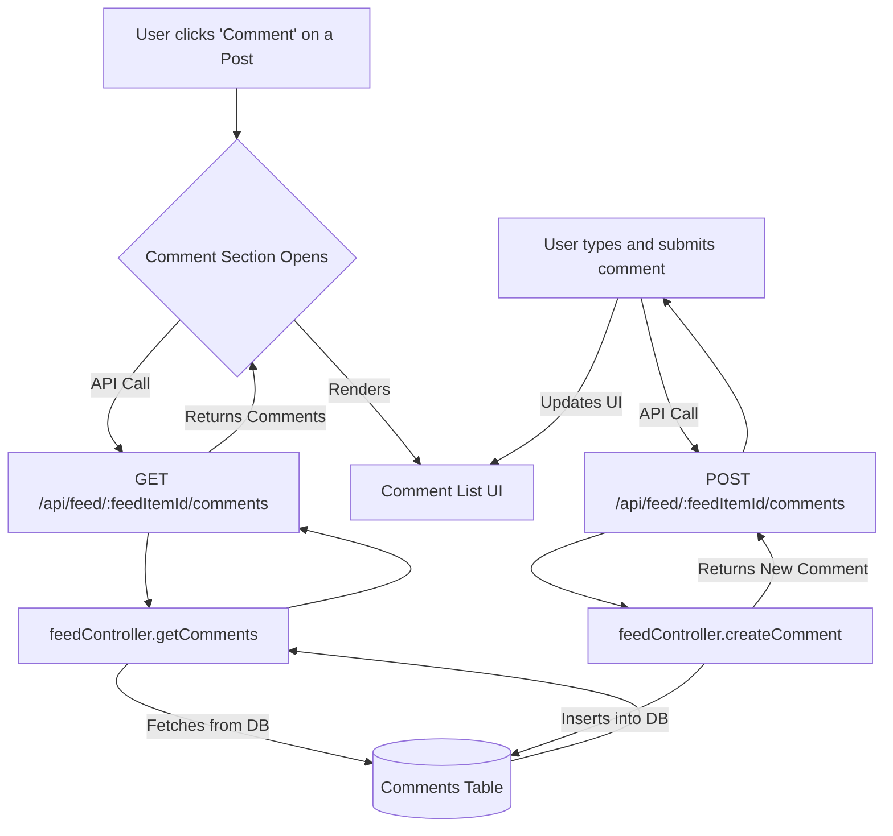

# ACTIVITY FEED COMMENTING SYSTEM - BLUEPRINT

## 1. EXECUTIVE SUMMARY

**Objective:** Enable users to comment on activity feed items, fostering conversation and increasing social engagement on the platform.

---

## 2. DATA FLOW



---

## 3. DATABASE SCHEMA

### `Comments` Table (New)
-   `id`: UUID (Primary Key)
-   `content`: TEXT
-   `userId`: UUID (Foreign Key to `Users.id`)
-   `feedItemId`: VARCHAR(255) (e.g., "workout-123", "milestone-456")
-   `createdAt`, `updatedAt`

---

## 4. API ENDPOINTS

### `GET /api/feed/:feedItemId/comments`
-   **Access:** Private
-   **Action:** Retrieves all comments for a given feed item, including user information.

### `POST /api/feed/:feedItemId/comments`
-   **Access:** Private
-   **Body:** `{ "content": "string" }`
-   **Action:** Creates a new comment linked to the feed item and the current user.

---

**Document Version:** 1.0
**Status:** Ready for Implementation
```

### 2. Backend: Comment Functionality

I'll update your `feedController` and `feedRoutes` to handle comments.

#### `c:\Users\BigotSmasher\Desktop\quick-pt\SS-PT\feedController.mjs`
```diff