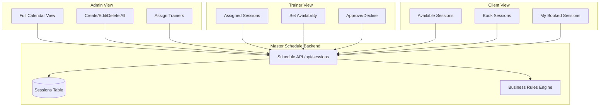

# 🎯 UNIFIED DASHBOARD CONSOLIDATION BLUEPRINT
**Version:** 1.0
**Date:** 2026-01-03
**Status:** 🔴 ANALYSIS & PLANNING PHASE
**Priority:** P0 - CRITICAL FOR CLIENT ONBOARDING

---

## 📋 EXECUTIVE SUMMARY

### Mission
Consolidate all dashboards (Admin, Trainer, Client) into a unified, consistent system where:
1. All roles see the same features with appropriate permissions
2. All schedules connect to a single Master Schedule backend
3. All tabs have full functionality (no mock/placeholder code)
4. The profile system correctly displays the logged-in user
5. Core business operations work flawlessly: Purchase → Sessions → Logging → Progress

### Current State Analysis
Based on user feedback and existing documentation:

**CRITICAL ISSUES:**
- ❌ **Multiple schedules disconnected** - Client has schedule tab, Admin has master schedule, no unified backend
- ❌ **Package system broken** - Client packages section not connected to store/cart/checkout
- ❌ **Mock code everywhere** - Visual placeholders with no functionality
- ❌ **Profile mismatch** - Doesn't show correct logged-in user
- ❌ **Missing features** - Messages, videos, logs only in some dashboards
- ❌ **Inconsistent tabs** - Different features across roles without clear reasoning

**BUSINESS IMPACT:**
- Cannot onboard clients (no working purchase flow)
- Cannot schedule sessions (disconnected schedules)
- Cannot log workouts (placeholder UI)
- Cannot track progress (no data collection)

### Success Criteria
**Minimum Viable Product (Priority 1):**
1. ✅ Client can purchase session packages from unified store
2. ✅ Client can book sessions on master schedule
3. ✅ Trainer can log client workouts via NASM forms
4. ✅ All dashboards show correct logged-in user profile
5. ✅ Profile photo upload works for all roles

**Enhanced Features (Priority 2):**
6. ✅ Messaging works across all dashboards
7. ✅ Video library connected to all video tabs
8. ✅ Schedule unified across all roles
9. ✅ Analytics and progress tracking functional
10. ✅ All tabs have real features (zero mock code)

---

## 🏗️ CURRENT STATE AUDIT

### Admin Dashboard Tabs Analysis

**✅ FULLY IMPLEMENTED:**
- Dashboard Overview (analytics, stats, quick actions)
- User Management (CRUD operations on all users)
- Trainer Management (trainer-specific controls)
- Client Management (client registry and details)
- Session Scheduling (enhanced admin sessions view)
- Package Management (session packages admin)

**⚠️ PARTIALLY IMPLEMENTED:**
- Master Schedule (exists but may not be unified backend)
- Client Onboarding (wizard exists, integration unclear)
- Analytics Hub (components exist, routes need verification)
- Revenue Analytics (panel exists, route missing)
- Pending Orders (component exists, route missing)
- Performance Reports (component exists, route missing)
- System Health (component exists, route missing)

**❌ MISSING/MOCK:**
- Content Moderation (needs full implementation)
- Gamification Engine (admin interface needed)
- Notifications (needs centralized system)
- Security Dashboard (needs implementation)
- MCP Servers (needs full integration)

### Trainer Dashboard Tabs Analysis

**🎯 Command Center Section:**
- Training Overview - ⚠️ Status unknown
- Training Schedule - ⚠️ May not connect to master schedule

**👥 Client Training Section:**
- My Clients - ⚠️ Should pull from `client_trainer_assignments`
- Client Progress - ⚠️ Needs NASM tracking integration
- Form Assessments - ❌ Likely placeholder
- Goal Tracking - ❌ Likely placeholder

**🎬 Content Studio Section:**
- Training Videos - ❌ Needs video library connection
- Form Check Center - ❌ Likely placeholder
- Content Library - ❌ Likely placeholder
- Upload Center - ❌ Needs S3 integration

**📊 Performance Section:**
- Training Analytics - ❌ Likely placeholder
- Client Achievements - ❌ Needs gamification integration
- Engagement Metrics - ❌ Likely placeholder

**🛠️ Trainer Tools Section:**
- Client Messages - ❌ Needs messaging service
- Notifications - ❌ Needs notification system
- Training Reports - ❌ Likely placeholder
- Trainer Settings - ⚠️ Basic settings may exist

### Client Dashboard Tabs Analysis

**🎯 Command Center Section:**
- Overview - ✅ Likely implemented
- Workouts - ⚠️ May be placeholder
- Progress - ⚠️ May be basic charts
- Achievements - ❌ Needs gamification

**🛠️ Mission Tools Section:**
- Videos - ❌ CRITICAL: Needs video library connection
- Logs & Trackers - ❌ CRITICAL: Needs NASM form integration
- Packages - ❌ CRITICAL: Must connect to store/cart/checkout
- Schedule - ⚠️ CRITICAL: Needs master schedule backend

**🌟 Star Network Section:**
- Community - ❌ Social features likely placeholder
- Messages - ❌ CRITICAL: Needs messaging service

**👤 Personal Space Section:**
- Profile - ⚠️ CRITICAL: Must show correct user + photo upload
- Settings - ⚠️ Basic settings may exist

---

## 🎨 UNIFIED ARCHITECTURE DESIGN

### 1. Master Schedule System

**Problem:** Multiple disconnected schedule implementations

**Solution:** Single source of truth with role-based views



**Implementation:**
- **Backend:** `/api/sessions` endpoints (already exist)
- **Frontend Component:** Create `<UnifiedScheduleView />` with role prop
- **Database:** `sessions` table (already exists)
- **Features:**
  - Real-time updates (WebSocket via `realTimeScheduleService`)
  - Conflict detection
  - Credit validation before booking
  - Automatic trainer assignment

### 2. Package/Store Integration

**Problem:** Client packages tab not connected to store/checkout

**Solution:** Unified e-commerce flow

```mermaid
graph LR
    STORE[SwanStudios Store] --> CART[Shopping Cart]
    CLIENT_PKG[Client Packages Tab] --> STORE
    CART --> CHECKOUT[Checkout Flow]
    CHECKOUT --> ORDER[Order Created]
    ORDER --> SESSION_ALLOC[Session Allocation]
    SESSION_ALLOC --> CLIENT_CREDITS[User.availableSessions++]

    CLIENT_CREDITS --> SCHEDULE[Can Book Sessions]
```



**Implementation:**
- **Reuse Existing:** Storefront system already built
- **Action:** Replace client packages tab content with store iframe/component
- **Display:** Show `user.availableSessions` count prominently
- **Backend:** Already connected via Orders → SessionPackages

### 3. Profile System

**Problem:** Profile doesn't show correct logged-in user

**Solution:** Centralized profile component with auth context

**Implementation:**
```typescript
// Use existing auth context
const { user } = useAuth();

// Profile component should show:
- user.firstName + user.lastName
- user.email
- user.role
- user.photo (with upload capability)
- user.availableSessions (if client)
- user.assignedClients (if trainer)
```

**Photo Upload:**
- **Backend:** `/api/profile/upload-profile-photo` (already exists)
- **Component:** Create `<ProfilePhotoUpload />` reusable component
- **Usage:** Header, profile page, dashboard cards

### 4. Messaging System

**Problem:** Messages only in some dashboards, no unified service

**Solution:** Create centralized messaging service

**Requirements:**
- Trainer ↔ Client direct messaging
- Admin broadcasts
- In-app notifications
- SMS integration (Twilio - already configured)

**Implementation Plan:**
```typescript
// New backend service
/api/messages
  - POST /send (send message)
  - GET /conversations (list conversations)
  - GET /conversations/:id (get messages)
  - PATCH /messages/:id/read (mark as read)

// Frontend component
<MessagingCenter
  currentUser={user}
  role={role}
  conversations={conversations}
/>
```

### 5. Video Library Integration

**Problem:** Videos tab exists but not connected to video management system

**Solution:** Connect all video tabs to unified video library

**Backend:** `/api/admin/exercise-library` (already exists with video support)

**Implementation:**
- **Admin:** Full CRUD on video library
- **Trainer:** View library, assign videos to clients
- **Client:** View assigned videos + public library

**Video Types:**
1. Exercise demonstrations (YouTube + uploads)
2. Form check submissions (client uploads)
3. Educational content (admin curated)

### 6. Workout Logging (NASM Protocol)

**Problem:** Logs & Trackers tab is placeholder

**Solution:** Implement NASM-compliant workout logging

**Backend Models:** (already exist)
- `WorkoutSession`
- `WorkoutExercise`
- `Set`
- `DailyWorkoutForm`

**Forms Required:**
1. **OPT Model Phases:**
   - Phase 1: Stabilization Endurance
   - Phase 2: Strength Endurance
   - Phase 3: Hypertrophy
   - Phase 4: Maximum Strength
   - Phase 5: Power

2. **Assessment Forms:**
   - Overhead Squat Assessment
   - Single-Leg Squat Assessment
   - Pushing Assessment
   - Pulling Assessment

**Implementation:**
```typescript
<NASMWorkoutLogger
  clientId={clientId}
  trainerId={trainerId}
  phase={currentPhase}
  onSubmit={saveWorkoutSession}
/>
```

---

## 📊 TAB CONSOLIDATION MATRIX

### Unified Tab Structure

| Tab Name | Admin | Trainer | Client | Backend | Component | Priority |
|----------|-------|---------|--------|---------|-----------|----------|
| **Dashboard** | Overview | Training Overview | My Overview | `/api/dashboard/:role` | `<DashboardOverview />` | P0 |
| **Schedule** | Master Schedule | My Schedule | Book Sessions | `/api/sessions` | `<UnifiedSchedule />` | P0 |
| **Clients** | All Clients | My Clients | N/A | `/api/clients` | `<ClientRegistry />` | P0 |
| **Workouts** | All Workouts | Log Workouts | My Workouts | `/api/workout-sessions` | `<WorkoutManager />` | P0 |
| **Videos** | Video Library Admin | Training Videos | Learning Center | `/api/admin/exercise-library` | `<VideoLibrary />` | P1 |
| **Messages** | Broadcasts | Client Messages | Messages | `/api/messages` | `<MessagingCenter />` | P1 |
| **Packages** | Package Admin | N/A | Buy Packages | `/api/packages`, `/api/orders` | `<PackageStore />` | P0 |
| **Analytics** | Full Analytics | Client Progress | My Progress | `/api/analytics` | `<AnalyticsView />` | P1 |
| **Profile** | My Profile | My Profile | My Profile | `/api/profile` | `<ProfileView />` | P0 |
| **Settings** | Admin Settings | Trainer Settings | My Settings | `/api/settings` | `<SettingsView />` | P1 |
| **Notifications** | All Notifications | My Notifications | My Notifications | `/api/notifications` | `<NotificationCenter />` | P2 |

**Priority Legend:**
- **P0:** Critical for MVP (sign up, buy sessions, schedule, log workouts)
- **P1:** Important for full functionality
- **P2:** Nice to have, can be added later

---

## 🔧 IMPLEMENTATION ROADMAP

### Phase 1: Critical Path (P0) - CLIENT ONBOARDING FLOW
**Goal:** Enable complete client journey from purchase to first session

**Deliverables:**
1. ✅ **Fix Profile System** (2-4 hours)
   - Use `useAuth()` context correctly in all dashboards
   - Add photo upload component to profile pages
   - Test header shows correct user across all roles

2. ✅ **Unify Schedule System** (4-8 hours)
   - Create `<UnifiedSchedule />` component with role variants
   - Connect all schedule tabs to `/api/sessions`
   - Implement real-time updates via WebSocket
   - Test: Admin creates → Trainer approves → Client books

3. ✅ **Connect Packages to Store** (2-4 hours)
   - Replace client packages tab with store component
   - Add session count display (user.availableSessions)
   - Verify checkout → order → session allocation flow
   - Test: Client purchases package → credits appear → can book

4. ✅ **Implement Workout Logging** (8-12 hours)
   - Create NASM-compliant workout forms
   - Connect logs & trackers tab to `/api/workout-sessions`
   - Build trainer logging interface
   - Build client view interface
   - Test: Trainer logs workout → Client sees progress

**Phase 1 Success Criteria:**
- [ ] User can purchase package and see credits
- [ ] User can book session from schedule
- [ ] Trainer can log workout for client
- [ ] Client can see logged workout
- [ ] Profile shows correct user everywhere

### Phase 2: Full Feature Parity (P1)
**Goal:** All tabs functional, zero mock code

**Deliverables:**
1. ✅ **Messaging System** (8-12 hours)
   - Build message database schema
   - Create messaging API endpoints
   - Build messaging UI component
   - Integrate Twilio SMS
   - Add to all dashboards

2. ✅ **Video Library Integration** (4-6 hours)
   - Connect admin video library to video tabs
   - Build trainer video assignment UI
   - Build client video player
   - Test upload, assign, view flow

3. ✅ **Analytics & Progress** (8-12 hours)
   - Build unified analytics service
   - Create progress chart components (Recharts)
   - Connect to workout data
   - Display in all dashboards

4. ✅ **Remove Mock Code** (8-16 hours)
   - Audit all tabs for placeholders
   - Either implement or remove
   - Document what's live vs. future

### Phase 3: Enhancement & Polish (P2)
**Goal:** Advanced features and optimizations

**Deliverables:**
1. Enhanced gamification
2. Advanced analytics
3. Performance optimization
4. Mobile responsiveness
5. Accessibility compliance

---

## 📝 COMPONENT ARCHITECTURE

### Shared Components Library

Create reusable components for consistency:

```
frontend/src/components/Unified/
├── Schedule/
│   ├── UnifiedSchedule.tsx (main component)
│   ├── ScheduleCalendar.tsx (calendar view)
│   ├── SessionCard.tsx (session display)
│   └── BookingModal.tsx (booking interface)
├── Profile/
│   ├── ProfileView.tsx (main component)
│   ├── ProfilePhotoUpload.tsx (photo management)
│   └── ProfileStats.tsx (user statistics)
├── Messaging/
│   ├── MessagingCenter.tsx (main component)
│   ├── ConversationList.tsx (conversation view)
│   ├── MessageThread.tsx (message display)
│   └── MessageComposer.tsx (send messages)
├── WorkoutLogger/
│   ├── WorkoutLogger.tsx (main component)
│   ├── NASMPhaseSelector.tsx (phase selection)
│   ├── ExerciseSetEntry.tsx (set logging)
│   └── WorkoutSummary.tsx (session review)
├── VideoLibrary/
│   ├── VideoLibrary.tsx (main component)
│   ├── VideoGrid.tsx (video list)
│   ├── VideoPlayer.tsx (video display)
│   └── VideoUpload.tsx (upload interface)
└── Analytics/
    ├── AnalyticsView.tsx (main component)
    ├── ProgressCharts.tsx (charts)
    └── StatsCards.tsx (statistics)
```

### Role-Based Rendering Pattern

```typescript
interface UnifiedComponentProps {
  role: 'admin' | 'trainer' | 'client';
  user: User;
}

export const UnifiedSchedule = ({ role, user }: UnifiedComponentProps) => {
  if (role === 'admin') {
    return <AdminScheduleView user={user} />;
  }
  if (role === 'trainer') {
    return <TrainerScheduleView user={user} />;
  }
  return <ClientScheduleView user={user} />;
};
```

---

## 🎯 NEXT STEPS

### Immediate Actions (Next 24 Hours)

1. **Create Component Audit Spreadsheet**
   - List all existing dashboard components
   - Mark status: ✅ Working | ⚠️ Partial | ❌ Mock
   - Identify reusable vs. role-specific
   - Estimate implementation effort

2. **Backend API Inventory**
   - Document all `/api/*` endpoints
   - Test each endpoint for functionality
   - Identify missing endpoints needed
   - Create API implementation roadmap

3. **Database Schema Review**
   - Verify all tables needed for MVP exist
   - Check associations are properly set up
   - Identify missing migrations
   - Test data flows

4. **User Testing Protocol**
   - Create test accounts (admin, trainer, client)
   - Document test scenarios for each role
   - Set up automated test suite
   - Define success metrics

### Documentation Needed

Before coding begins:
1. [ ] **Component Audit Report** - Complete inventory of all components
2. [ ] **API Documentation** - OpenAPI/Swagger docs for all endpoints
3. [ ] **Database ERD** - Visual schema with relationships
4. [ ] **User Flow Diagrams** - Detailed flows for each role
5. [ ] **Design System Doc** - Colors, typography, components
6. [ ] **Testing Plan** - E2E test scenarios and acceptance criteria

### Pre-Implementation Checklist

Before writing ANY code:
- [ ] All documentation reviewed and approved
- [ ] Architecture diagrams finalized
- [ ] Component hierarchy decided
- [ ] API contracts defined
- [ ] Database migrations planned
- [ ] Test scenarios documented
- [ ] Design tokens established
- [ ] Implementation order agreed upon

---

## 🚨 CRITICAL SUCCESS FACTORS

### Must Have Before Launch

1. **Profile Works Everywhere**
   - Header shows correct user
   - Profile page shows correct user
   - Photo upload works
   - All roles tested

2. **Schedule is Unified**
   - All roles use same backend
   - Real-time updates work
   - Booking flow complete
   - Credit validation working

3. **Purchase → Sessions Flow**
   - Client can buy package
   - Credits appear in account
   - Can book sessions
   - Sessions deduct credits

4. **Workout Logging Complete**
   - Trainer can log workouts
   - Data saves to database
   - Client can view workouts
   - Progress charts update

5. **Zero Mock Code in P0 Tabs**
   - Dashboard
   - Schedule
   - Packages
   - Workouts
   - Profile

### Testing Requirements

**Manual Testing:**
- [ ] Create test accounts for each role
- [ ] Test complete user journey as each role
- [ ] Test role switching (admin can be all roles)
- [ ] Test edge cases (no credits, double booking, etc.)
- [ ] Test on mobile devices
- [ ] Test in different browsers

**Automated Testing:**
- [ ] E2E tests for critical paths
- [ ] API integration tests
- [ ] Component unit tests
- [ ] Database migration tests
- [ ] Performance tests

---

## 📊 SUCCESS METRICS

### Phase 1 (MVP) Metrics
- ✅ Client can complete purchase → booking → workout flow
- ✅ Zero critical bugs in P0 features
- ✅ All P0 tabs fully functional
- ✅ Profile system 100% accurate
- ✅ Schedule system unified across all roles

### Phase 2 (Full Features) Metrics
- ✅ All tabs implemented (zero mock code)
- ✅ Messaging system operational
- ✅ Video library connected
- ✅ Analytics displaying real data
- ✅ < 3 second page load time

### Phase 3 (Excellence) Metrics
- ✅ 95%+ user satisfaction
- ✅ < 1% error rate
- ✅ Mobile experience excellent
- ✅ Accessibility AA compliant
- ✅ Performance score > 90

---

## 🤖 AI COLLABORATION PROTOCOL

This blueprint must be reviewed by:
1. **User** - Business requirements approval
2. **Claude Code** - Technical architecture approval
3. **Other AIs** - Feature validation and review

**No implementation until all approvals received.**

---

**Document Status:** 📋 DRAFT - AWAITING REVIEW
**Next Action:** User review and approval
**Estimated Timeline:** Phase 1 = 1-2 weeks | Phase 2 = 2-3 weeks | Phase 3 = 1-2 weeks
