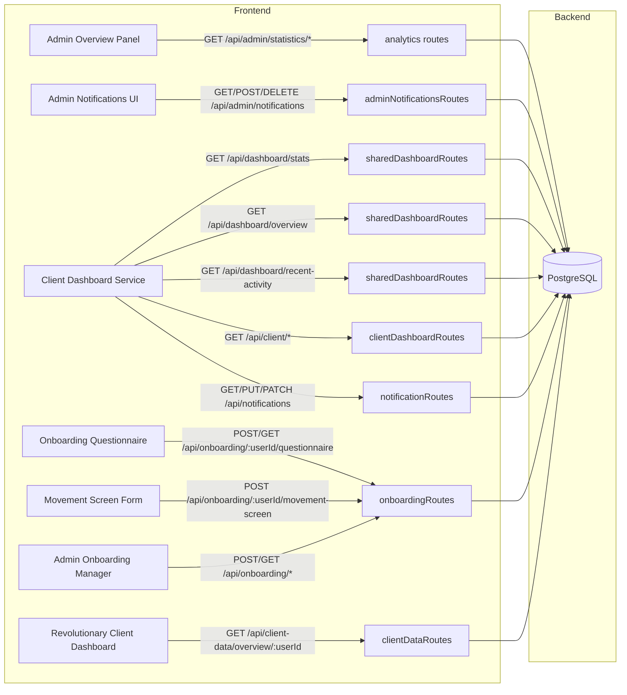
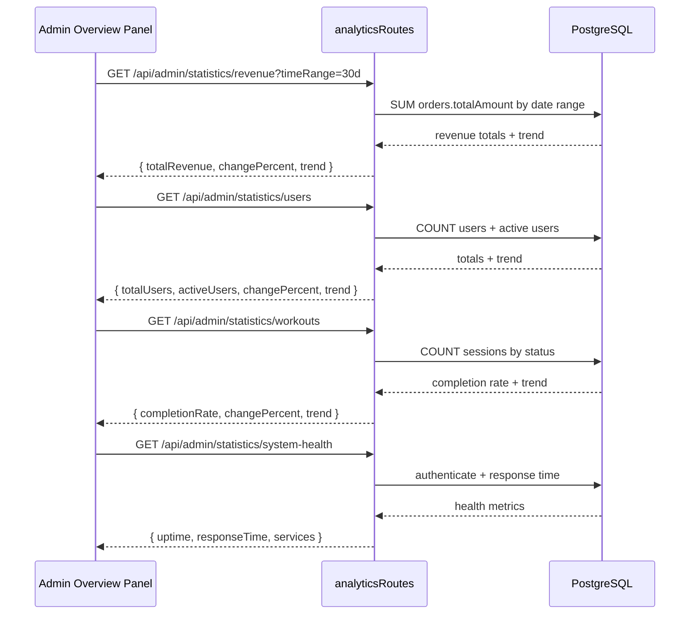
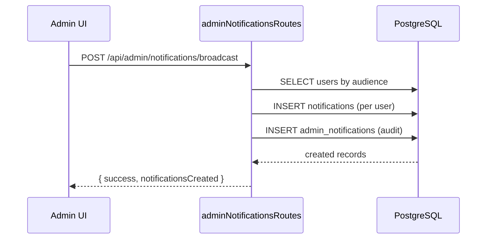
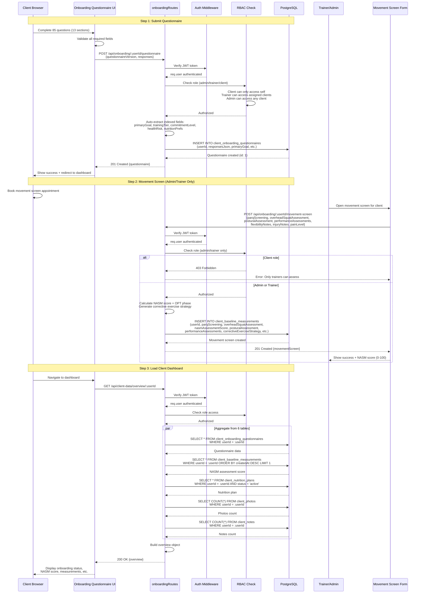
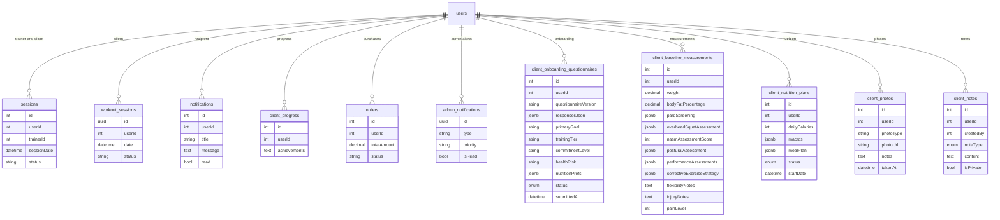

# Admin Dashboard Backend Architecture

Status: Updated - Added Phase 1 Client Onboarding endpoints
Last Updated: 2026-01-15
Owner: ChatGPT-5 (with Phase 1 updates by Claude Code)

## Purpose
Provide architecture diagrams and backend specifications for the admin dashboard
integration work so future changes follow the documentation-first protocol.

## Scope
This document covers:
- Admin statistics and health endpoints
- Dashboard stats and overview data
- Admin notifications and broadcast workflow
- Client dashboard endpoints used by the frontend service
- Notifications API alignment
- **Phase 1: Client Onboarding endpoints** (onboarding questionnaire, movement screen, client data overview)

## References
- docs/ai-workflow/AI-HANDOFF/CURRENT-TASK.md
- docs/ai-workflow/reviews/dashboard-architecture-review.md
- docs/ai-workflow/blueprints/ONBOARDING-FLOW.mermaid.md (Phase 1)
- docs/ai-workflow/blueprints/ONBOARDING-WIREFRAMES.md (Phase 1)
- backend/routes/admin/analyticsRevenueRoutes.mjs
- backend/routes/admin/analyticsUserRoutes.mjs
- backend/routes/admin/analyticsSystemRoutes.mjs
- backend/routes/dashboard/sharedDashboardRoutes.mjs
- backend/routes/dashboard/adminDashboardRoutes.mjs
- backend/routes/adminNotificationsRoutes.mjs
- backend/routes/clientDashboardRoutes.mjs
- backend/routes/notificationRoutes.mjs
- backend/routes/onboardingRoutes.mjs (Phase 1 - to be created)
- backend/routes/clientDataRoutes.mjs (Phase 1 - to be created)

## Architecture Overview

## Data Flow - Admin Overview Metrics

## Data Flow - Admin Notification Broadcast

## Data Flow - Client Onboarding (Phase 1)

## Database ERD (Dashboard-Relevant)

## API Specifications

### Admin Statistics
- GET /api/admin/statistics/revenue
  - Query: timeRange (24h, 7d, 30d, 90d, 1y)
  - Response: { totalRevenue, changePercent, trend, target }
- GET /api/admin/statistics/users
  - Response: { totalUsers, activeUsers, changePercent, trend, target }
- GET /api/admin/statistics/workouts
  - Response: { completionRate, changePercent, trend, target }
- GET /api/admin/statistics/system-health
  - Response: { uptime, responseTime, services, trend }

### Dashboard
- GET /api/dashboard/stats
  - Response: { stats: { totalWorkouts, weeklyWorkouts, ... } }
- GET /api/dashboard/overview
  - Response: { overview: { recentActivity, upcomingSessions, notifications } }
- GET /api/dashboard/recent-activity
  - Response: { activities: [] }

### Admin Notifications
- GET /api/admin/notifications
  - Response: { notifications, stats }
- POST /api/admin/notifications/broadcast
  - Body: { title, content, type, audience, channels, userIds }
  - Response: { notificationsCreated, notification }
- DELETE /api/admin/notifications/:id
  - Response: { message }

### Client Dashboard
- GET /api/client/progress
  - Response: { progress }
- GET /api/client/achievements
  - Response: { achievements, count }
- GET /api/client/challenges
  - Response: { challenges }
- GET /api/client/workout-stats
  - Response: { stats: { totalWorkouts, totalMinutes, averageDuration, lastWorkoutDate } }

### Notifications (User)
- GET /api/notifications
- PUT or PATCH /api/notifications/:id/read
- PUT or PATCH /api/notifications/read-all
- GET /api/notifications/count
- DELETE /api/notifications/:id

### Client Onboarding (Phase 1)
- POST /api/onboarding/:userId/questionnaire
  - Body: { questionnaireVersion, responses (JSONB with 85 questions) }
  - Auto-extracts: primaryGoal, trainingTier, commitmentLevel, healthRisk, nutritionPrefs
  - RBAC: Admin = any client, Trainer = assigned only, Client = self only
  - Response: { success, questionnaire }
- GET /api/onboarding/:userId/questionnaire
  - Returns most recent questionnaire with all indexed fields
  - RBAC: Admin = any client, Trainer = assigned only, Client = self only
  - Response: { success, questionnaire }
- POST /api/onboarding/:userId/movement-screen
  - Body: { parqScreening, overheadSquatAssessment, posturalAssessment, performanceAssessments, flexibilityNotes, injuryNotes, painLevel }
  - Calculates nasmAssessmentScore (0-100) + correctiveExerciseStrategy
  - RBAC: Admin/Trainer only (clients cannot self-assess)
  - Response: { success, movementScreen }
- GET /api/client-data/overview/:userId
  - Aggregates data from 6 tables: questionnaires, measurements, nutrition, photos, notes
  - RBAC: Admin = any client, Trainer = assigned only, Client = self only
  - Response: { success, overview }

## Security Model
- All routes require JWT auth (protect middleware).
- Admin-only routes use adminOnly middleware.
- Trainer or admin metrics use trainerOrAdminOnly middleware.
- User notifications restrict to req.user.id ownership.

## Error Handling
- 400: invalid user ID or missing required fields
- 401: unauthenticated request
- 403: unauthorized (non-admin)
- 404: notification not found
- 500: server errors, DB failures

## Performance Considerations
- Use indexed fields for counts and date filtering.
- Trend queries aggregate by DATE to reduce payload.
- System health uses lightweight DB authenticate for response time.

## WHY Decisions
- WHY replace mock data with real aggregates?
  - Prevents dual-state UX and aligns with revenue readiness goals.
- WHY add /statistics aliases?
  - Frontend expects /api/admin/statistics/* from audit recommendations.
- WHY broadcast creates both notifications and admin_notifications?
  - User notifications deliver messages; admin_notifications keep audit trail.
- WHY default schedule date range?
  - Avoids 400 errors when clients fetch without dates.
- WHY auto-extract indexed fields from questionnaire responsesJson? (Phase 1)
  - Performance: Frequently queried fields (primaryGoal, trainingTier, etc.) need indexing for fast filtering
  - Flexibility: Full questionnaire data stays in JSONB for future changes without schema migrations
  - AI Integration: Indexed fields provide quick context for AI workout generation without parsing 85 questions
- WHY calculate NASM assessment score from OHSA compensations? (Phase 1)
  - Standardization: NASM OHSA scoring provides a certified baseline
  - Clarity: Single 0-100 score is easy to interpret across clients
  - AI Input: Numeric score simplifies training phase selection + progression
- WHY restrict movement screen creation to admin/trainer only? (Phase 1)
  - Safety: Only trained professionals can accurately assess movement patterns
  - Liability: Prevents clients from self-diagnosing injury risks
  - Data Quality: Ensures consistent, professional assessment standards

## Testing Checklist
- Admin overview loads without mock values.
- /api/admin/notifications returns real data and supports broadcast.
- Client dashboard service endpoints respond with real data or empty arrays.
- Notifications PATCH aliases work with frontend service.

### Phase 1 Onboarding Tests (To Be Created)
- POST /api/onboarding/:userId/questionnaire creates record with auto-extracted indexed fields
- GET /api/onboarding/:userId/questionnaire returns most recent questionnaire with completion %
- POST /api/onboarding/:userId/movement-screen calculates NASM score correctly (0-100 from OHSA)
- POST /api/onboarding/:userId/movement-screen rejects client role (403 Forbidden)
- GET /api/client-data/overview/:userId aggregates from 6 tables correctly
- RBAC: Client cannot create questionnaire for another user (403 Forbidden)
- RBAC: Trainer can only access assigned clients (403 for unassigned)
- RBAC: Admin can access any client (200 OK for all endpoints)

---

**Phase 1 Documentation Complete:** 2026-01-15
**Next:** ChatGPT-5 to implement controllers and routes per PHASE-1-START-DIRECTIVE.md
