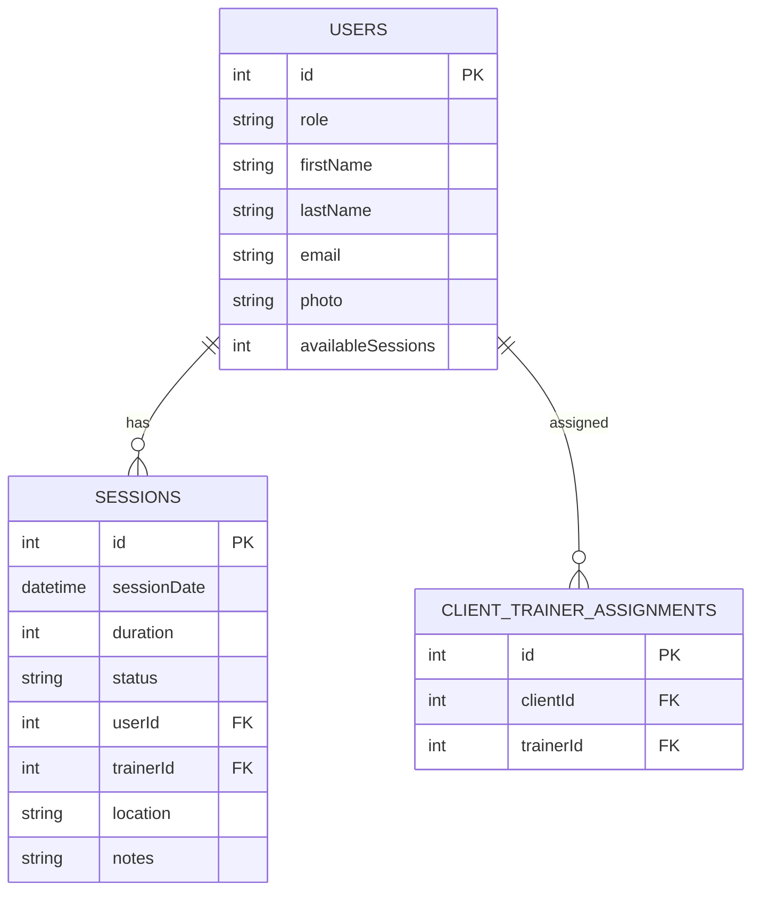
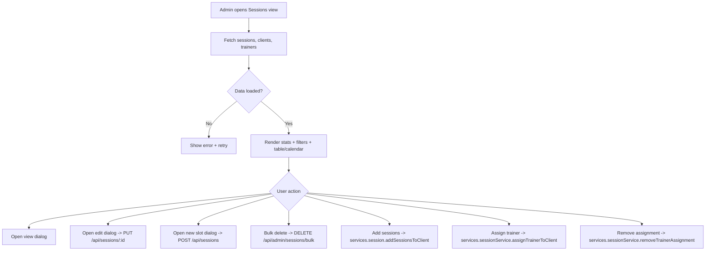

# ADMIN SESSIONS ENHANCED VIEW BLUEPRINT

System: SwanStudios Personal Training Platform  
Component: Admin Dashboard - Sessions Management (Enhanced View)  
Author: Codex (GPT-5)  
Date: 2026-01-07  
Status: DRAFT - Pending Approval  

---

## 1. Executive Summary
This blueprint documents the Admin Sessions Management screen that currently lives in a single 2400+ line component. The goal is to make the view maintainable and compliant by splitting it into focused modules while preserving behavior and fixing the runtime error caused by a stray trailing character.

---

## 2. Current Issues
- Monolithic component file (2400+ lines) violates 300 line component limit.
- Runtime error from trailing `u` after default export.
- UI logic, data fetching, and dialogs are tightly coupled.

---

## 3. Goals and Non-Goals
Goals:
- Split the component into smaller files (each < 300 lines).
- Keep current behavior and styling intact.
- Fix the trailing `u` runtime error.
- Document data flows, APIs, and UI structure.

Non-Goals:
- No functional redesign.
- No MUI -> styled-components migration in this pass.
- No backend API changes.

---

## 4. Architecture Overview

```mermaid
graph TD
  subgraph Frontend
    View[EnhancedAdminSessionsView]
    Header[Header + View Toggle]
    Stats[Stats Cards]
    Filters[Search + Filters]
    Table[Table View + Pagination]
    Calendar[Calendar View]
    Dialogs[View/Edit/New/Add/Bulk/Delete Dialogs]
    Assign[TrainerAssignmentSection]
    Socket[useSocket /ws/admin-dashboard]
  end

  subgraph Services
    Api[apiService]
    SessSvc[services.sessionService]
    Sess[services.session]
  end

  subgraph Backend
    SessionsAPI[/api/sessions, /api/admin/sessions/bulk]
    AuthAPI[/api/auth/clients, /api/auth/trainers]
    AssignAPI[/api/sessions/assignments + statistics]
  end

  View --> Header
  View --> Stats
  View --> Filters
  View --> Table
  View --> Calendar
  View --> Dialogs
  View --> Assign
  View --> Socket

  View --> Api
  View --> SessSvc
  View --> Sess

  Api --> SessionsAPI
  Api --> AuthAPI
  SessSvc --> AssignAPI
  Sess --> SessionsAPI
```

---

## 5. Data Model (ERD - Minimal)



---

## 6. API Specifications (Frontend Usage)

1) List sessions  
GET `/api/sessions`  
Response: `{ success, data: Session[] }`

2) Update session  
PUT `/api/sessions/:id`  
Body: `{ sessionDate, duration, location, notes, status, trainerId, userId }`  
Response: `{ success, data: Session }`

3) Create session slot  
POST `/api/sessions`  
Body: `{ sessionDate, duration, location, status: "available" }`  
Response: `{ success, data: Session }`

4) Bulk delete sessions  
DELETE `/api/admin/sessions/bulk`  
Body: `{ ids: string[], reason: string }`  
Response: `{ success, message }`

5) List clients  
GET `/api/auth/clients`  
Response: `{ success, data: Client[] }`

6) List trainers  
GET `/api/auth/trainers`  
Response: `{ success, data: Trainer[] }`

7) Add sessions to client  
POST `/api/sessions/add-to-client` (via services.session.addSessionsToClient)  
Body: `{ clientId, count, note }`  
Response: `{ success, message }`

8) Assignment statistics  
GET `/api/sessions/assignment-statistics`  
Response: `{ success, data: { sessionSummary, assignmentRate, trainerWorkload } }`

9) Assign trainer  
POST `/api/sessions/assign-trainer`  
Body: `{ trainerId, clientId, sessionIds? }`  
Response: `{ success, message }`

10) Remove assignment  
POST `/api/sessions/remove-assignment`  
Body: `{ sessionIds }`  
Response: `{ success, message }`

---

## 7. UI Wireframe (ASCII)

```
Admin Sessions Management
------------------------------------------------------------
[Table] [Calendar]   [Add Sessions] [Refresh]

[Stats Card 1] [Stats Card 2] [Stats Card 3] [Stats Card 4]

[Search........] [From Date] [To Date]  [Status Buttons...]

Table View:
------------------------------------------------------------
| Client | Trainer | Date/Time | Location | Duration | Status | Actions |
------------------------------------------------------------
| ... rows ...                                              |
------------------------------------------------------------
[Pagination]                    [Schedule New] [Export CSV]

Calendar View:
------------------------------------------------------------
| Calendar Component with colored session blocks            |
------------------------------------------------------------

Dialogs:
- View Session
- Edit Session
- New Session Slot
- Add Sessions to Client
- Delete / Bulk Delete

Trainer Assignment Center:
------------------------------------------------------------
| Stats | Assign Trainer to Client | Workload + Bulk Actions |
------------------------------------------------------------
```

---

## 8. Logic Flow (Page Load + Actions)



---

## 9. Split Strategy (Target Files)

1) `enhanced-admin-sessions-view.tsx`  
   - Container only (state, handlers, data fetch)
   - Composes child sections
   - < 300 lines

2) `admin-sessions.types.ts`  
   - Client, Trainer, Session, Stats types

3) `AdminSessionsHeader.tsx`  
   - Title + view toggle + top action buttons

4) `AdminSessionsStats.tsx`  
   - Four stats cards

5) `AdminSessionsFilters.tsx`  
   - Search + date range + status buttons

6) `AdminSessionsTable.tsx`  
   - Table view, bulk selection, pagination, action buttons

7) `AdminSessionsCalendar.tsx`  
   - Calendar view wrapper (ScheduleInitializer + UnifiedCalendar)

8) `AdminSessionsDialogs.tsx`  
   - View/Edit/New/Add/Bulk/Delete dialogs

9) `TrainerAssignmentSection.tsx`  
   - Extracted from bottom of current file

---

## 10. WHY Decisions

WHY split by section instead of by hook?  
- Keeps UI readable and aligns to user tasks (view, filter, manage).

WHY keep MUI in this pass?  
- Scope is stabilization; replacing MUI requires design review and would delay the hotfix.

WHY keep single container state?  
- Minimizes behavioral changes; reduces regression risk.

WHY separate dialogs?  
- Dialogs are the largest JSX block and easiest to isolate without logic changes.

---

## 11. Error Handling and Observability
- Surface data fetch errors in existing empty state UI.
- Keep current toast usage for success/failure.
- Preserve socket updates from `/ws/admin-dashboard`.

---

## 12. Testing Checklist (Manual)
- Page loads with no runtime error (fix trailing `u`).
- Table and Calendar view toggles work.
- Search/filtering functions.
- View/Edit/New/Add/Bulk dialogs open and submit.
- Trainer Assignment section functions and refreshes.
- Pagination and bulk selection work.

---

## 13. Approval Gate
This blueprint must be approved before code refactor begins (per HANDOFF-PROTOCOL).
