# Admin Video Library - Technical Architecture Diagrams

**Status:** ✅ COMPLETE - Mermaid Diagrams
**Priority:** CRITICAL - Week 1 Technical Reference
**Owner:** Admin Dashboard Team
**Created:** 2025-11-13

---

## Table of Contents
1. [System Architecture](#system-architecture)
2. [Component Hierarchy](#component-hierarchy)
3. [Data Flow Diagrams](#data-flow-diagrams)
4. [Sequence Diagrams](#sequence-diagrams)
5. [State Machines](#state-machines)
6. [Database ERD](#database-erd)
7. [API Structure](#api-structure)

---

## System Architecture

### High-Level Architecture

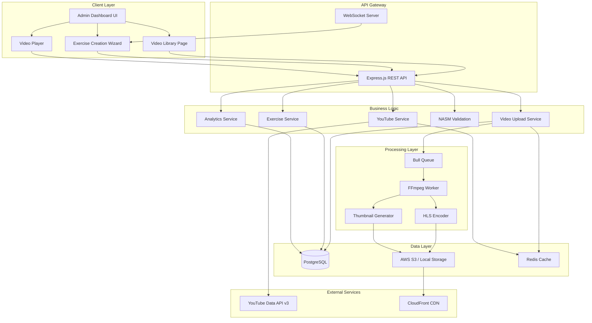
```mermaid
graph TB
    subgraph "Client Layer"
        A[Admin Dashboard UI]
        B[Video Library Page]
        C[Exercise Creation Wizard]
        D[Video Player]
    end

    subgraph "API Gateway"
        E[Express.js REST API]
        F[WebSocket Server]
    end

    subgraph "Business Logic"
        G[Video Upload Service]
        H[YouTube Service]
        I[Exercise Service]
        J[NASM Validation]
        K[Analytics Service]
    end

    subgraph "Processing Layer"
        L[Bull Queue]
        M[FFmpeg Worker]
        N[Thumbnail Generator]
        O[HLS Encoder]
    end

    subgraph "Data Layer"
        P[(PostgreSQL)]
        Q[AWS S3 / Local Storage]
        R[Redis Cache]
    end

    subgraph "External Services"
        S[YouTube Data API v3]
        T[CloudFront CDN]
    end

    A --> B
    A --> C
    A --> D

    B --> E
    C --> E
    D --> E

    E --> G
    E --> H
    E --> I
    E --> J
    E --> K

    F --> C

    G --> L
    L --> M
    M --> N
    M --> O

    G --> P
    H --> S
    I --> P
    K --> P

    O --> Q
    N --> Q
    Q --> T

    G --> R
    H --> R
```

### Deployment Architecture

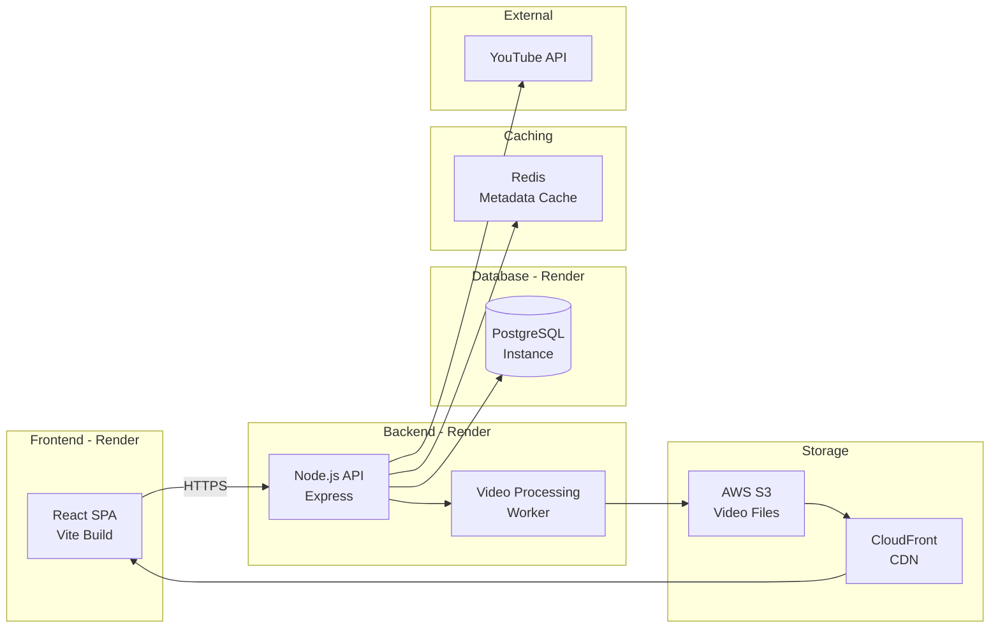
```mermaid
graph LR
    subgraph "Frontend - Render"
        A[React SPA<br/>Vite Build]
    end

    subgraph "Backend - Render"
        B[Node.js API<br/>Express]
        C[Video Processing<br/>Worker]
    end

    subgraph "Database - Render"
        D[(PostgreSQL<br/>Instance)]
    end

    subgraph "Storage"
        E[AWS S3<br/>Video Files]
        F[CloudFront<br/>CDN]
    end

    subgraph "Caching"
        G[Redis<br/>Metadata Cache]
    end

    subgraph "External"
        H[YouTube API]
    end

    A -->|HTTPS| B
    B --> D
    B --> C
    C --> E
    E --> F
    F --> A
    B --> G
    B --> H
```

---

## Component Hierarchy

### Admin Video Library Page Components

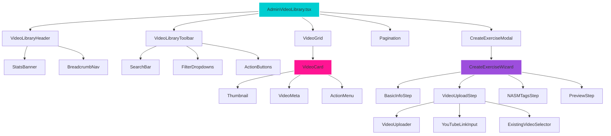
```mermaid
graph TD
    A[AdminVideoLibrary.tsx]
    A --> B[VideoLibraryHeader]
    A --> C[VideoLibraryToolbar]
    A --> D[VideoGrid]
    A --> E[Pagination]
    A --> F[CreateExerciseModal]

    B --> B1[StatsBanner]
    B --> B2[BreadcrumbNav]

    C --> C1[SearchBar]
    C --> C2[FilterDropdowns]
    C --> C3[ActionButtons]

    D --> D1[VideoCard]
    D1 --> D1A[Thumbnail]
    D1 --> D1B[VideoMeta]
    D1 --> D1C[ActionMenu]

    F --> F1[CreateExerciseWizard]
    F1 --> F2[BasicInfoStep]
    F1 --> F3[VideoUploadStep]
    F1 --> F4[NASMTagsStep]
    F1 --> F5[PreviewStep]

    F3 --> F3A[VideoUploader]
    F3 --> F3B[YouTubeLinkInput]
    F3 --> F3C[ExistingVideoSelector]

    style A fill:#00CED1,stroke:#fff,stroke-width:3px
    style F1 fill:#9D4EDD,stroke:#fff,stroke-width:2px
    style D1 fill:#FF1493,stroke:#fff,stroke-width:2px
```

### Video Player Component Hierarchy

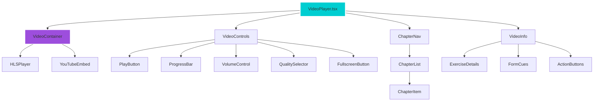
```mermaid
graph TD
    A[VideoPlayer.tsx]
    A --> B[VideoContainer]
    A --> C[VideoControls]
    A --> D[ChapterNav]
    A --> E[VideoInfo]

    B --> B1[HLSPlayer]
    B --> B2[YouTubeEmbed]

    C --> C1[PlayButton]
    C --> C2[ProgressBar]
    C --> C3[VolumeControl]
    C --> C4[QualitySelector]
    C --> C5[FullscreenButton]

    D --> D1[ChapterList]
    D1 --> D2[ChapterItem]

    E --> E1[ExerciseDetails]
    E --> E2[FormCues]
    E --> E3[ActionButtons]

    style A fill:#00CED1,stroke:#fff,stroke-width:3px
    style B fill:#9D4EDD,stroke:#fff,stroke-width:2px
```

---

## Data Flow Diagrams

### Video Upload Flow

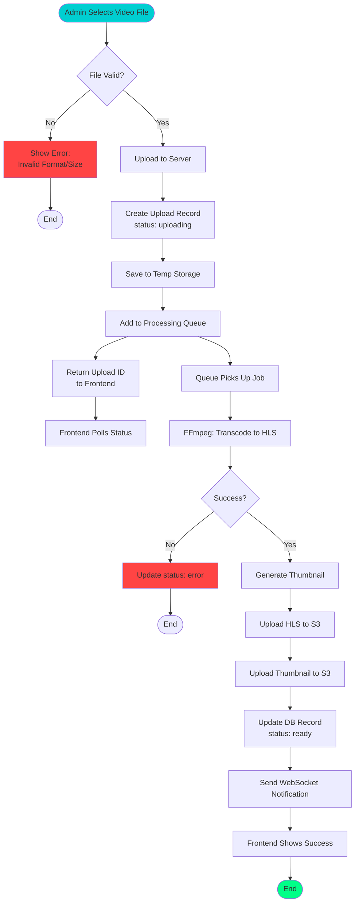
```mermaid
flowchart TD
    Start([Admin Selects Video File]) --> A{File Valid?}
    A -->|No| Error1[Show Error:<br/>Invalid Format/Size]
    Error1 --> End1([End])

    A -->|Yes| B[Upload to Server]
    B --> C[Create Upload Record<br/>status: uploading]
    C --> D[Save to Temp Storage]
    D --> E[Add to Processing Queue]
    E --> F[Return Upload ID<br/>to Frontend]
    F --> G[Frontend Polls Status]

    E --> H[Queue Picks Up Job]
    H --> I[FFmpeg: Transcode to HLS]
    I --> J{Success?}
    J -->|No| Error2[Update status: error]
    Error2 --> End2([End])

    J -->|Yes| K[Generate Thumbnail]
    K --> L[Upload HLS to S3]
    L --> M[Upload Thumbnail to S3]
    M --> N[Update DB Record<br/>status: ready]
    N --> O[Send WebSocket Notification]
    O --> P[Frontend Shows Success]
    P --> End3([End])

    style Start fill:#00CED1
    style End3 fill:#00FF88
    style Error1 fill:#FF4444
    style Error2 fill:#FF4444
```

### YouTube Link Flow

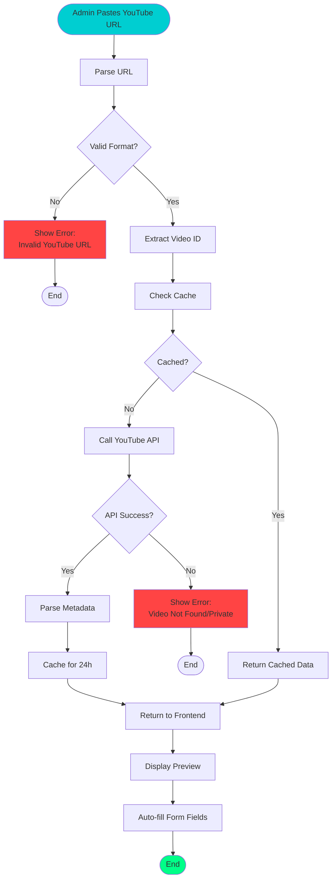
```mermaid
flowchart TD
    Start([Admin Pastes YouTube URL]) --> A[Parse URL]
    A --> B{Valid Format?}
    B -->|No| Error1[Show Error:<br/>Invalid YouTube URL]
    Error1 --> End1([End])

    B -->|Yes| C[Extract Video ID]
    C --> D[Check Cache]
    D --> E{Cached?}
    E -->|Yes| F[Return Cached Data]
    E -->|No| G[Call YouTube API]

    G --> H{API Success?}
    H -->|No| Error2[Show Error:<br/>Video Not Found/Private]
    Error2 --> End2([End])

    H -->|Yes| I[Parse Metadata]
    I --> J[Cache for 24h]
    J --> K[Return to Frontend]
    F --> K
    K --> L[Display Preview]
    L --> M[Auto-fill Form Fields]
    M --> End3([End])

    style Start fill:#00CED1
    style End3 fill:#00FF88
    style Error1 fill:#FF4444
    style Error2 fill:#FF4444
```

### Exercise Creation Flow

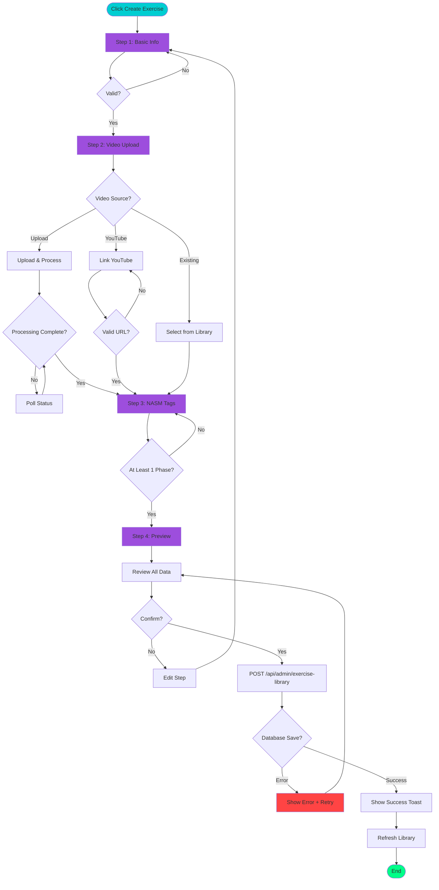
```mermaid
flowchart TD
    Start([Click Create Exercise]) --> Step1[Step 1: Basic Info]
    Step1 --> V1{Valid?}
    V1 -->|No| Step1
    V1 -->|Yes| Step2[Step 2: Video Upload]

    Step2 --> Choice{Video Source?}
    Choice -->|Upload| Upload[Upload & Process]
    Choice -->|YouTube| YouTube[Link YouTube]
    Choice -->|Existing| Existing[Select from Library]

    Upload --> V2{Processing Complete?}
    V2 -->|No| Wait[Poll Status]
    Wait --> V2
    V2 -->|Yes| Step3

    YouTube --> V3{Valid URL?}
    V3 -->|No| YouTube
    V3 -->|Yes| Step3

    Existing --> Step3[Step 3: NASM Tags]

    Step3 --> V4{At Least 1 Phase?}
    V4 -->|No| Step3
    V4 -->|Yes| Step4[Step 4: Preview]

    Step4 --> Review[Review All Data]
    Review --> Confirm{Confirm?}
    Confirm -->|No| Back[Edit Step]
    Back --> Step1
    Confirm -->|Yes| Submit[POST /api/admin/exercise-library]

    Submit --> DB{Database Save?}
    DB -->|Error| Error[Show Error + Retry]
    Error --> Review
    DB -->|Success| Success[Show Success Toast]
    Success --> Refresh[Refresh Library]
    Refresh --> End([End])

    style Start fill:#00CED1
    style End fill:#00FF88
    style Error fill:#FF4444
    style Step1 fill:#9D4EDD
    style Step2 fill:#9D4EDD
    style Step3 fill:#9D4EDD
    style Step4 fill:#9D4EDD
```

---

## Sequence Diagrams

### Complete Exercise Creation with Upload

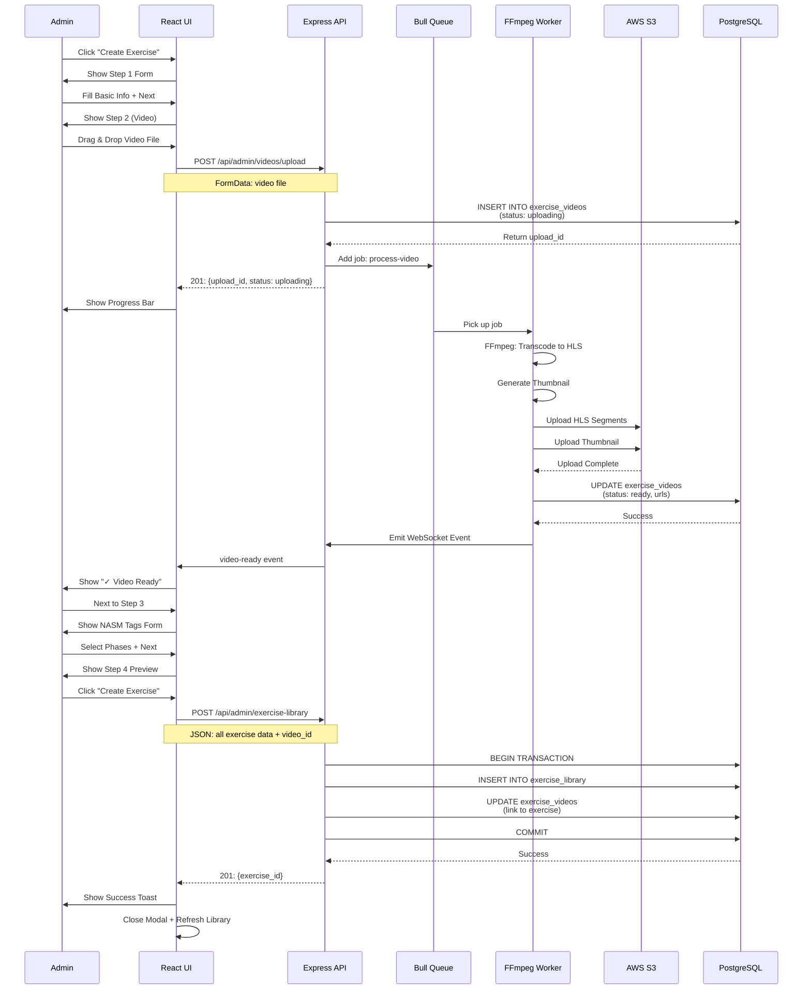
```mermaid
sequenceDiagram
    participant Admin
    participant UI as React UI
    participant API as Express API
    participant Queue as Bull Queue
    participant Worker as FFmpeg Worker
    participant S3 as AWS S3
    participant DB as PostgreSQL

    Admin->>UI: Click "Create Exercise"
    UI->>Admin: Show Step 1 Form

    Admin->>UI: Fill Basic Info + Next
    UI->>Admin: Show Step 2 (Video)

    Admin->>UI: Drag & Drop Video File
    UI->>API: POST /api/admin/videos/upload
    Note over UI,API: FormData: video file

    API->>DB: INSERT INTO exercise_videos<br/>(status: uploading)
    DB-->>API: Return upload_id

    API->>Queue: Add job: process-video
    API-->>UI: 201: {upload_id, status: uploading}

    UI->>Admin: Show Progress Bar

    Queue->>Worker: Pick up job
    Worker->>Worker: FFmpeg: Transcode to HLS
    Worker->>Worker: Generate Thumbnail

    Worker->>S3: Upload HLS Segments
    Worker->>S3: Upload Thumbnail
    S3-->>Worker: Upload Complete

    Worker->>DB: UPDATE exercise_videos<br/>(status: ready, urls)
    DB-->>Worker: Success

    Worker->>API: Emit WebSocket Event
    API->>UI: video-ready event
    UI->>Admin: Show "✓ Video Ready"

    Admin->>UI: Next to Step 3
    UI->>Admin: Show NASM Tags Form

    Admin->>UI: Select Phases + Next
    UI->>Admin: Show Step 4 Preview

    Admin->>UI: Click "Create Exercise"
    UI->>API: POST /api/admin/exercise-library
    Note over UI,API: JSON: all exercise data + video_id

    API->>DB: BEGIN TRANSACTION
    API->>DB: INSERT INTO exercise_library
    API->>DB: UPDATE exercise_videos<br/>(link to exercise)
    API->>DB: COMMIT

    DB-->>API: Success
    API-->>UI: 201: {exercise_id}

    UI->>Admin: Show Success Toast
    UI->>UI: Close Modal + Refresh Library
```

### Video Playback with Analytics

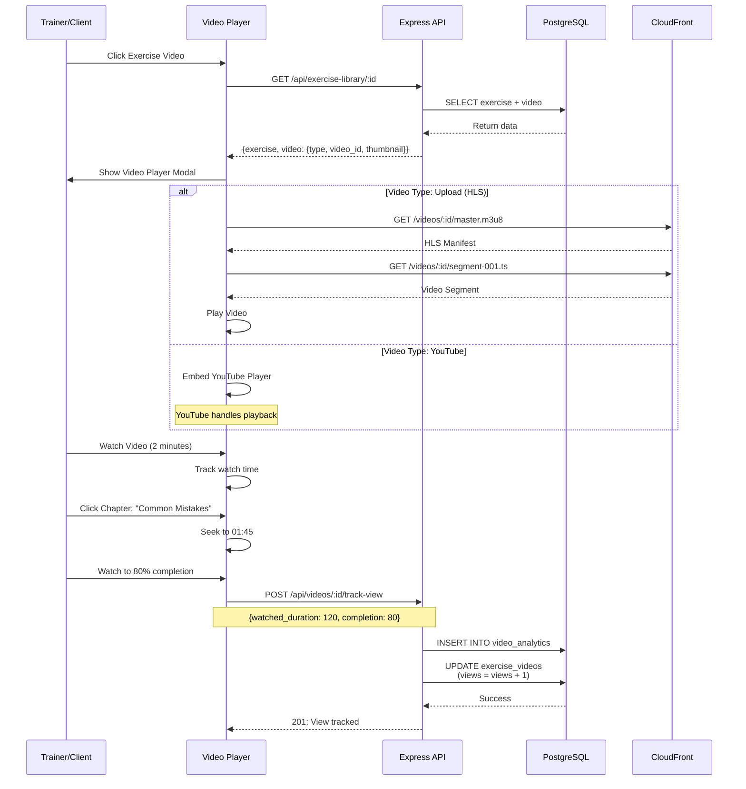
```mermaid
sequenceDiagram
    participant User as Trainer/Client
    participant UI as Video Player
    participant API as Express API
    participant DB as PostgreSQL
    participant CDN as CloudFront

    User->>UI: Click Exercise Video
    UI->>API: GET /api/exercise-library/:id
    API->>DB: SELECT exercise + video
    DB-->>API: Return data

    API-->>UI: {exercise, video: {type, video_id, thumbnail}}

    UI->>User: Show Video Player Modal

    alt Video Type: Upload (HLS)
        UI->>CDN: GET /videos/:id/master.m3u8
        CDN-->>UI: HLS Manifest
        UI->>CDN: GET /videos/:id/segment-001.ts
        CDN-->>UI: Video Segment
        UI->>UI: Play Video
    else Video Type: YouTube
        UI->>UI: Embed YouTube Player
        Note over UI: YouTube handles playback
    end

    User->>UI: Watch Video (2 minutes)
    UI->>UI: Track watch time

    User->>UI: Click Chapter: "Common Mistakes"
    UI->>UI: Seek to 01:45

    User->>UI: Watch to 80% completion
    UI->>API: POST /api/videos/:id/track-view
    Note over UI,API: {watched_duration: 120, completion: 80}

    API->>DB: INSERT INTO video_analytics
    API->>DB: UPDATE exercise_videos<br/>(views = views + 1)
    DB-->>API: Success

    API-->>UI: 201: View tracked
```

### YouTube Video Validation

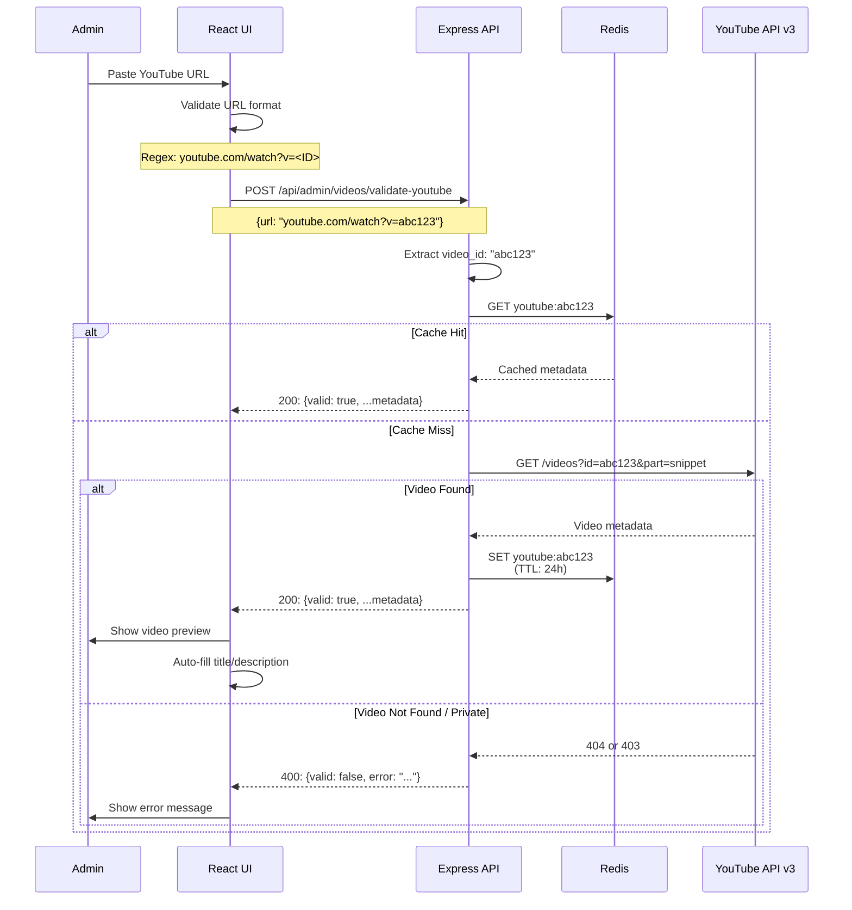
```mermaid
sequenceDiagram
    participant Admin
    participant UI as React UI
    participant API as Express API
    participant Cache as Redis
    participant YouTube as YouTube API v3

    Admin->>UI: Paste YouTube URL
    UI->>UI: Validate URL format
    Note over UI: Regex: youtube.com/watch?v=<ID>

    UI->>API: POST /api/admin/videos/validate-youtube
    Note over UI,API: {url: "youtube.com/watch?v=abc123"}

    API->>API: Extract video_id: "abc123"
    API->>Cache: GET youtube:abc123

    alt Cache Hit
        Cache-->>API: Cached metadata
        API-->>UI: 200: {valid: true, ...metadata}
    else Cache Miss
        API->>YouTube: GET /videos?id=abc123&part=snippet

        alt Video Found
            YouTube-->>API: Video metadata
            API->>Cache: SET youtube:abc123<br/>(TTL: 24h)
            API-->>UI: 200: {valid: true, ...metadata}

            UI->>Admin: Show video preview
            UI->>UI: Auto-fill title/description
        else Video Not Found / Private
            YouTube-->>API: 404 or 403
            API-->>UI: 400: {valid: false, error: "..."}
            UI->>Admin: Show error message
        end
    end
```

---

## State Machines

### Exercise Creation Wizard State

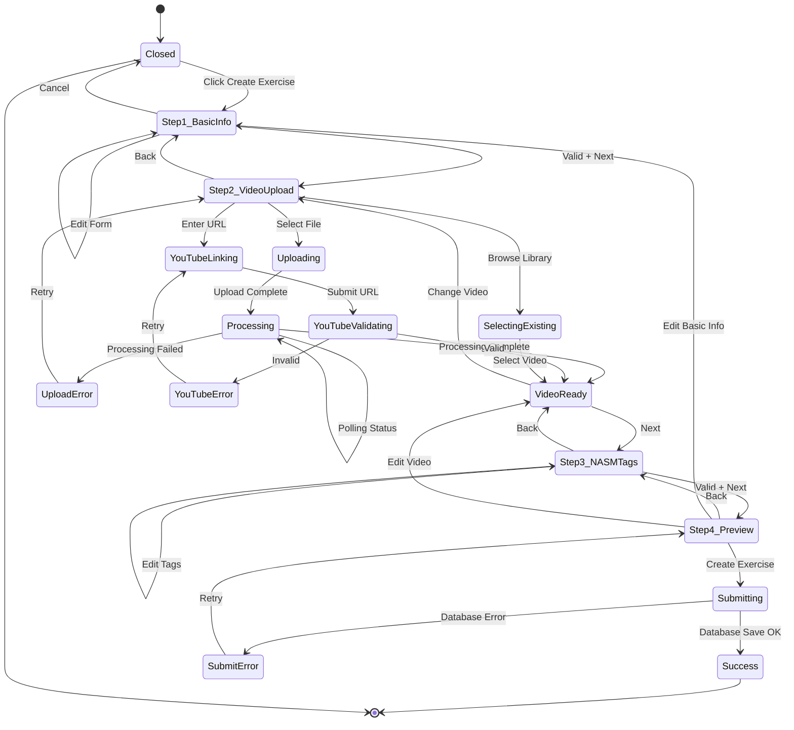
```mermaid
stateDiagram-v2
    [*] --> Closed

    Closed --> Step1_BasicInfo: Click Create Exercise
    Step1_BasicInfo --> Step1_BasicInfo: Edit Form
    Step1_BasicInfo --> Step2_VideoUpload: Valid + Next
    Step1_BasicInfo --> Closed: Cancel

    Step2_VideoUpload --> Step1_BasicInfo: Back

    Step2_VideoUpload --> Uploading: Select File
    Uploading --> Processing: Upload Complete
    Processing --> Processing: Polling Status
    Processing --> VideoReady: Processing Complete
    Processing --> UploadError: Processing Failed

    UploadError --> Step2_VideoUpload: Retry

    Step2_VideoUpload --> YouTubeLinking: Enter URL
    YouTubeLinking --> YouTubeValidating: Submit URL
    YouTubeValidating --> VideoReady: Valid
    YouTubeValidating --> YouTubeError: Invalid

    YouTubeError --> YouTubeLinking: Retry

    Step2_VideoUpload --> SelectingExisting: Browse Library
    SelectingExisting --> VideoReady: Select Video

    VideoReady --> Step3_NASMTags: Next
    VideoReady --> Step2_VideoUpload: Change Video

    Step3_NASMTags --> VideoReady: Back
    Step3_NASMTags --> Step3_NASMTags: Edit Tags
    Step3_NASMTags --> Step4_Preview: Valid + Next

    Step4_Preview --> Step3_NASMTags: Back
    Step4_Preview --> Step1_BasicInfo: Edit Basic Info
    Step4_Preview --> VideoReady: Edit Video
    Step4_Preview --> Submitting: Create Exercise

    Submitting --> Success: Database Save OK
    Submitting --> SubmitError: Database Error

    SubmitError --> Step4_Preview: Retry

    Success --> [*]
    Closed --> [*]
```

### Video Upload Processing State

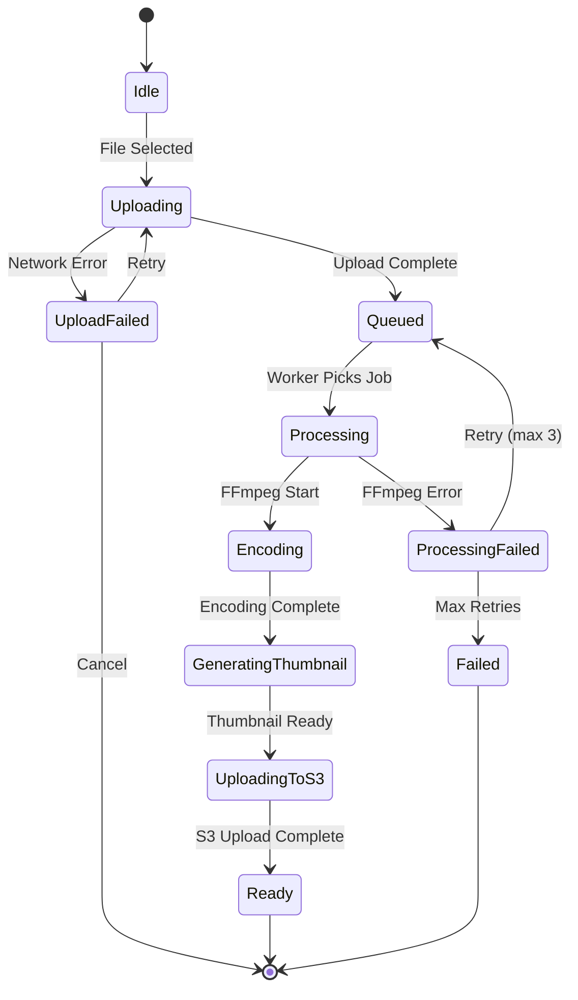
```mermaid
stateDiagram-v2
    [*] --> Idle

    Idle --> Uploading: File Selected
    Uploading --> UploadFailed: Network Error
    Uploading --> Queued: Upload Complete

    UploadFailed --> Uploading: Retry
    UploadFailed --> [*]: Cancel

    Queued --> Processing: Worker Picks Job
    Processing --> Encoding: FFmpeg Start
    Encoding --> GeneratingThumbnail: Encoding Complete
    GeneratingThumbnail --> UploadingToS3: Thumbnail Ready
    UploadingToS3 --> Ready: S3 Upload Complete

    Processing --> ProcessingFailed: FFmpeg Error
    ProcessingFailed --> Queued: Retry (max 3)
    ProcessingFailed --> Failed: Max Retries

    Ready --> [*]
    Failed --> [*]
```

### Video Player State

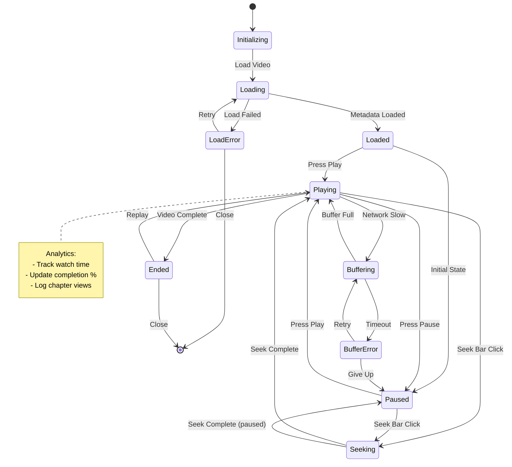
```mermaid
stateDiagram-v2
    [*] --> Initializing

    Initializing --> Loading: Load Video
    Loading --> LoadError: Load Failed
    Loading --> Loaded: Metadata Loaded

    LoadError --> Loading: Retry
    LoadError --> [*]: Close

    Loaded --> Playing: Press Play
    Loaded --> Paused: Initial State

    Playing --> Paused: Press Pause
    Playing --> Buffering: Network Slow
    Playing --> Seeking: Seek Bar Click
    Playing --> Ended: Video Complete

    Paused --> Playing: Press Play
    Paused --> Seeking: Seek Bar Click

    Buffering --> Playing: Buffer Full
    Buffering --> BufferError: Timeout

    BufferError --> Buffering: Retry
    BufferError --> Paused: Give Up

    Seeking --> Playing: Seek Complete
    Seeking --> Paused: Seek Complete (paused)

    Ended --> Playing: Replay
    Ended --> [*]: Close

    note right of Playing
        Analytics:
        - Track watch time
        - Update completion %
        - Log chapter views
    end note
```

---

## Database ERD

### Complete Schema with Relationships

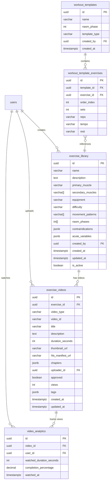
```mermaid
erDiagram
    users ||--o{ exercise_library : creates
    users ||--o{ exercise_videos : uploads
    users ||--o{ video_analytics : watches

    exercise_library ||--o{ exercise_videos : "has videos"
    exercise_library {
        uuid id PK
        varchar name
        text description
        varchar primary_muscle
        varchar[] secondary_muscles
        varchar equipment
        varchar difficulty
        varchar[] movement_patterns
        int[] nasm_phases
        jsonb contraindications
        jsonb acute_variables
        uuid created_by FK
        timestamptz created_at
        timestamptz updated_at
        boolean is_active
    }

    exercise_videos ||--o{ video_analytics : "tracks views"
    exercise_videos {
        uuid id PK
        uuid exercise_id FK
        varchar video_type
        varchar video_id
        varchar title
        text description
        int duration_seconds
        varchar thumbnail_url
        varchar hls_manifest_url
        jsonb chapters
        uuid uploader_id FK
        boolean approved
        int views
        jsonb tags
        timestamptz created_at
        timestamptz updated_at
    }

    video_analytics {
        uuid id PK
        uuid video_id FK
        uuid user_id FK
        int watched_duration_seconds
        decimal completion_percentage
        timestamptz watched_at
    }

    workout_templates ||--o{ workout_template_exercises : contains
    workout_template_exercises }o--|| exercise_library : references

    workout_templates {
        uuid id PK
        varchar name
        int nasm_phase
        varchar template_type
        uuid created_by FK
        timestamptz created_at
    }

    workout_template_exercises {
        uuid id PK
        uuid template_id FK
        uuid exercise_id FK
        int order_index
        int sets
        varchar reps
        varchar tempo
        varchar rest
    }
```

### Video Processing Pipeline ERD

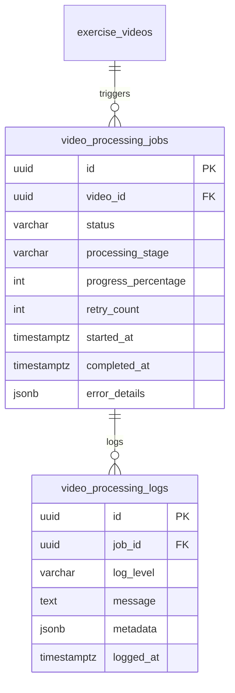
```mermaid
erDiagram
    exercise_videos ||--o{ video_processing_jobs : "triggers"
    video_processing_jobs ||--o{ video_processing_logs : "logs"

    video_processing_jobs {
        uuid id PK
        uuid video_id FK
        varchar status
        varchar processing_stage
        int progress_percentage
        int retry_count
        timestamptz started_at
        timestamptz completed_at
        jsonb error_details
    }

    video_processing_logs {
        uuid id PK
        uuid job_id FK
        varchar log_level
        text message
        jsonb metadata
        timestamptz logged_at
    }
```

---

## API Structure

### API Endpoint Map

```mermaid
graph TD
    API[Express API Server]

    API --> Admin[Admin Routes<br/>/api/admin]
    API --> Trainer[Trainer Routes<br/>/api/trainer]
    API --> Client[Client Routes<br/>/api/client]
    API --> Public[Public Routes<br/>/api]

    Admin --> AdminVideos[Video Management]
    Admin --> AdminExercises[Exercise Library]
    Admin --> AdminAnalytics[Analytics]

    AdminVideos --> AV1[POST /videos/upload]
    AdminVideos --> AV2[GET /videos/:id/status]
    AdminVideos --> AV3[POST /videos/validate-youtube]
    AdminVideos --> AV4[GET /videos]
    AdminVideos --> AV5[DELETE /videos/:id]

    AdminExercises --> AE1[POST /exercise-library]
    AdminExercises --> AE2[GET /exercise-library/:id]
    AdminExercises --> AE3[PUT /exercise-library/:id]
    AdminExercises --> AE4[DELETE /exercise-library/:id]

    AdminAnalytics --> AA1[GET /videos/:id/analytics]
    AdminAnalytics --> AA2[GET /dashboard/stats]

    Trainer --> TrainerVideos[Video Library]
    Trainer --> TrainerExercises[Exercise Search]

    TrainerVideos --> TV1[GET /videos]
    TrainerVideos --> TV2[GET /videos/:id]

    TrainerExercises --> TE1[GET /exercise-library]
    TrainerExercises --> TE2[GET /exercise-library/search]

    Client --> ClientVideos[Assigned Videos]
    Client --> ClientProgress[Progress Tracking]

    ClientVideos --> CV1[GET /my-videos]
    ClientVideos --> CV2[POST /videos/:id/track-view]

    Public --> PublicExercises[Public Exercise Info]
    PublicExercises --> PE1[GET /exercises/preview]

    style API fill:#00CED1,stroke:#fff,stroke-width:3px
    style Admin fill:#9D4EDD,stroke:#fff,stroke-width:2px
    style Trainer fill:#FF1493,stroke:#fff,stroke-width:2px
    style Client fill:#00FF88,stroke:#fff,stroke-width:2px
```

### API Request/Response Flow

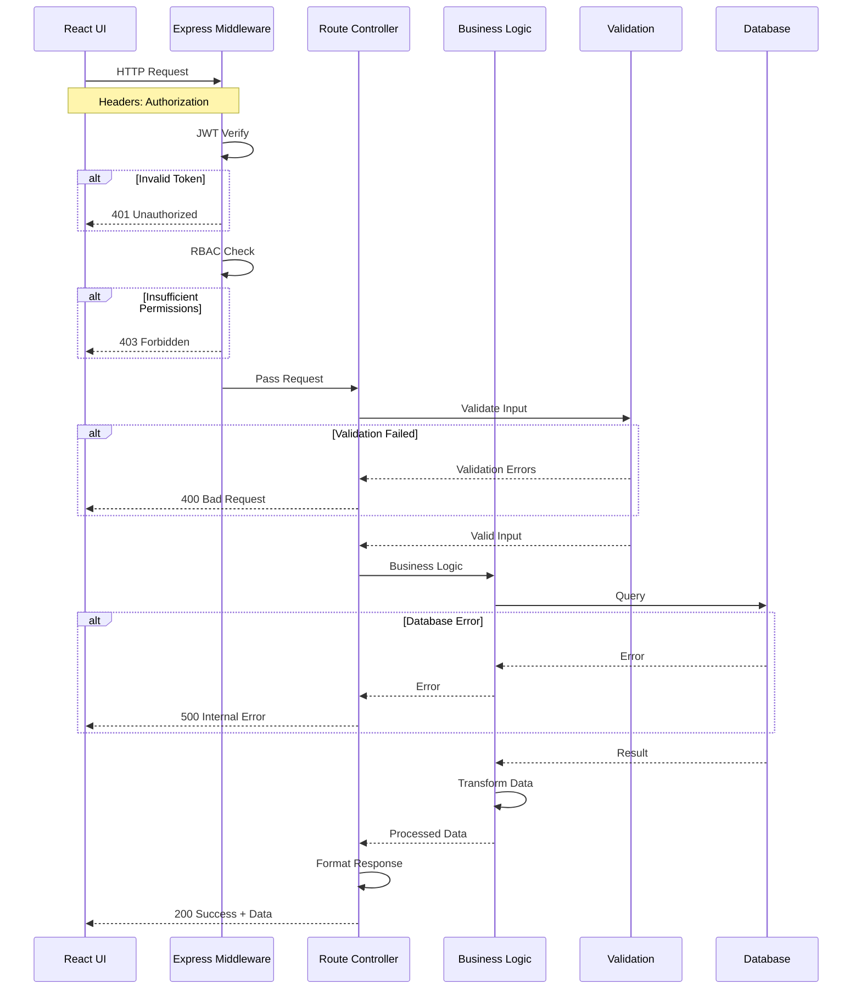
```mermaid
sequenceDiagram
    participant Client as React UI
    participant Middleware as Express Middleware
    participant Controller as Route Controller
    participant Service as Business Logic
    participant Validator as Validation
    participant DB as Database

    Client->>Middleware: HTTP Request
    Note over Client,Middleware: Headers: Authorization

    Middleware->>Middleware: JWT Verify
    alt Invalid Token
        Middleware-->>Client: 401 Unauthorized
    end

    Middleware->>Middleware: RBAC Check
    alt Insufficient Permissions
        Middleware-->>Client: 403 Forbidden
    end

    Middleware->>Controller: Pass Request
    Controller->>Validator: Validate Input

    alt Validation Failed
        Validator-->>Controller: Validation Errors
        Controller-->>Client: 400 Bad Request
    end

    Validator-->>Controller: Valid Input

    Controller->>Service: Business Logic
    Service->>DB: Query

    alt Database Error
        DB-->>Service: Error
        Service-->>Controller: Error
        Controller-->>Client: 500 Internal Error
    end

    DB-->>Service: Result
    Service->>Service: Transform Data
    Service-->>Controller: Processed Data

    Controller->>Controller: Format Response
    Controller-->>Client: 200 Success + Data
```

---

## Processing Pipeline Architecture

### Video Processing Queue System

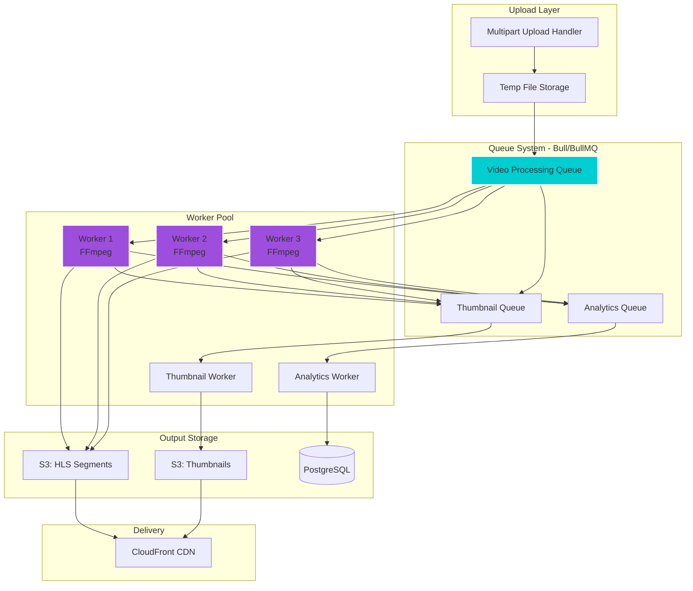
```mermaid
graph TB
    subgraph "Upload Layer"
        A[Multipart Upload Handler]
        B[Temp File Storage]
    end

    subgraph "Queue System - Bull/BullMQ"
        C[Video Processing Queue]
        D[Thumbnail Queue]
        E[Analytics Queue]
    end

    subgraph "Worker Pool"
        F1[Worker 1<br/>FFmpeg]
        F2[Worker 2<br/>FFmpeg]
        F3[Worker 3<br/>FFmpeg]
        G[Thumbnail Worker]
        H[Analytics Worker]
    end

    subgraph "Output Storage"
        I[S3: HLS Segments]
        J[S3: Thumbnails]
        K[(PostgreSQL)]
    end

    subgraph "Delivery"
        L[CloudFront CDN]
    end

    A --> B
    B --> C
    C --> F1
    C --> F2
    C --> F3
    C --> D

    F1 --> I
    F2 --> I
    F3 --> I
    F1 --> D
    F2 --> D
    F3 --> D

    D --> G
    G --> J

    I --> L
    J --> L

    F1 --> E
    F2 --> E
    F3 --> E
    E --> H
    H --> K

    style C fill:#00CED1,stroke:#fff,stroke-width:3px
    style F1 fill:#9D4EDD,stroke:#fff,stroke-width:2px
    style F2 fill:#9D4EDD,stroke:#fff,stroke-width:2px
    style F3 fill:#9D4EDD,stroke:#fff,stroke-width:2px
```

### FFmpeg Processing Pipeline

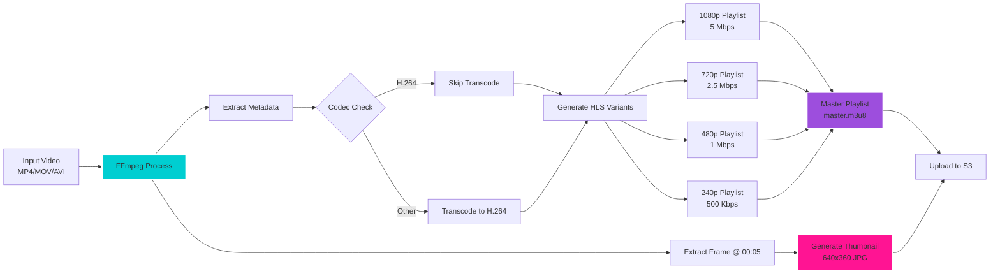
```mermaid
flowchart LR
    A[Input Video<br/>MP4/MOV/AVI] --> B[FFmpeg Process]

    B --> C[Extract Metadata]
    C --> D{Codec Check}
    D -->|H.264| E[Skip Transcode]
    D -->|Other| F[Transcode to H.264]

    E --> G[Generate HLS Variants]
    F --> G

    G --> H1[1080p Playlist<br/>5 Mbps]
    G --> H2[720p Playlist<br/>2.5 Mbps]
    G --> H3[480p Playlist<br/>1 Mbps]
    G --> H4[240p Playlist<br/>500 Kbps]

    H1 --> I[Master Playlist<br/>master.m3u8]
    H2 --> I
    H3 --> I
    H4 --> I

    B --> J[Extract Frame @ 00:05]
    J --> K[Generate Thumbnail<br/>640x360 JPG]

    I --> L[Upload to S3]
    K --> L

    style B fill:#00CED1,stroke:#fff,stroke-width:3px
    style I fill:#9D4EDD,stroke:#fff,stroke-width:2px
    style K fill:#FF1493,stroke:#fff,stroke-width:2px
```

---

## Mobile Architecture

### Mobile Video Player Architecture

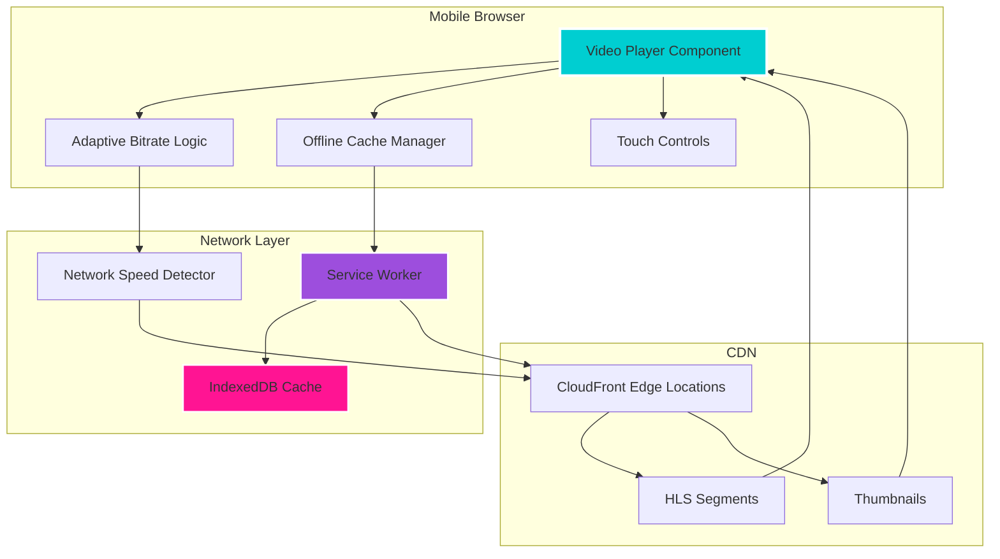
```mermaid
graph TB
    subgraph "Mobile Browser"
        A[Video Player Component]
        B[Adaptive Bitrate Logic]
        C[Offline Cache Manager]
        D[Touch Controls]
    end

    subgraph "Network Layer"
        E[Service Worker]
        F[IndexedDB Cache]
        G[Network Speed Detector]
    end

    subgraph "CDN"
        H[CloudFront Edge Locations]
        I[HLS Segments]
        J[Thumbnails]
    end

    A --> B
    A --> C
    A --> D

    B --> G
    G --> H

    C --> E
    E --> F
    E --> H

    H --> I
    H --> J

    I --> A
    J --> A

    style A fill:#00CED1,stroke:#fff,stroke-width:3px
    style E fill:#9D4EDD,stroke:#fff,stroke-width:2px
    style F fill:#FF1493,stroke:#fff,stroke-width:2px
```

### Offline Video Caching Strategy

```mermaid
sequenceDiagram
    participant User
    participant UI as Video Player
    participant SW as Service Worker
    participant Cache as IndexedDB
    participant CDN

    User->>UI: Click "Save for Offline"
    UI->>SW: Request video cache

    SW->>CDN: Fetch HLS Manifest
    CDN-->>SW: master.m3u8

    SW->>SW: Parse manifest<br/>Select 480p variant

    loop For each segment
        SW->>CDN: Fetch segment-XXX.ts
        CDN-->>SW: Video segment
        SW->>Cache: Store segment
        SW->>UI: Update progress (X%)
    end

    SW->>UI: Cache complete ✓

    Note over User,UI: Later, when offline...

    User->>UI: Play video
    UI->>SW: Request video
    SW->>Cache: Fetch segments
    Cache-->>SW: Cached segments
    SW-->>UI: Stream from cache
    UI->>User: Video plays offline
```

---

## Security Architecture

### Authentication & Authorization Flow

```mermaid
sequenceDiagram
    participant User
    participant UI as React UI
    participant API as Express API
    participant JWT as JWT Service
    participant RBAC as RBAC Middleware
    participant DB as Database

    User->>UI: Login
    UI->>API: POST /api/auth/login
    API->>DB: Verify credentials
    DB-->>API: User + Role

    API->>JWT: Generate Token
    JWT-->>API: Access Token + Refresh Token
    API-->>UI: {tokens, user}

    UI->>UI: Store tokens (localStorage)

    Note over User,UI: Later, API request...

    User->>UI: Upload Video
    UI->>API: POST /api/admin/videos/upload<br/>Header: Authorization: Bearer {token}

    API->>JWT: Verify Token
    JWT-->>API: Decoded payload: {id, role}

    API->>RBAC: Check Permission<br/>role=admin, resource=videos, action=create
    RBAC->>DB: Check role permissions
    DB-->>RBAC: Permission granted

    RBAC-->>API: Authorized
    API->>API: Process Upload
    API-->>UI: Success

    alt Token Expired
        JWT-->>API: Token expired
        API-->>UI: 401 Unauthorized
        UI->>API: POST /api/auth/refresh<br/>Header: Refresh Token
        API->>JWT: Validate Refresh Token
        JWT-->>API: New Access Token
        API-->>UI: {access_token}
        UI->>API: Retry Original Request
    end
```

### Video Access Control

```mermaid
graph TD
    A[Video Request] --> B{User Authenticated?}
    B -->|No| C[Return 401]
    B -->|Yes| D{Check User Role}

    D -->|Admin| E[Full Access<br/>All Videos]
    D -->|Trainer| F{Video Type?}
    D -->|Client| G{Video Assigned?}
    D -->|User Free| H{Video Public?}

    F -->|Approved| I[Grant Access]
    F -->|Pending| J[Deny Access]

    G -->|In Workout| K[Grant Access]
    G -->|Not Assigned| L[Deny Access]

    H -->|Public| M[Grant Access]
    H -->|Private| N[Deny Access]

    E --> O[Generate Signed URL]
    I --> O
    K --> O
    M --> O

    O --> P[Return CDN URL<br/>Valid 1 hour]

    style E fill:#00FF88
    style I fill:#00FF88
    style K fill:#00FF88
    style M fill:#00FF88
    style C fill:#FF4444
    style J fill:#FF4444
    style L fill:#FF4444
    style N fill:#FF4444
```

---

## Performance Optimization

### Caching Strategy

```mermaid
graph TB
    subgraph "Client Layer"
        A[Browser Cache<br/>Videos: 7 days]
        B[Service Worker<br/>Offline Videos]
        C[React Query Cache<br/>Metadata: 5 min]
    end

    subgraph "CDN Layer"
        D[CloudFront<br/>Edge Cache<br/>TTL: 30 days]
    end

    subgraph "Application Layer"
        E[Redis Cache<br/>API Responses: 5 min]
        F[YouTube Metadata: 24h]
    end

    subgraph "Database"
        G[(PostgreSQL<br/>Materialized Views<br/>Refresh: 15 min)]
    end

    A --> Request1[Video Request]
    Request1 --> D
    D --> Origin[S3 Origin]

    C --> Request2[Metadata Request]
    Request2 --> E
    E --> G

    B --> Offline[Offline Access]

    style A fill:#00CED1
    style E fill:#9D4EDD
    style D fill:#FF1493
```

### Load Balancing & Scaling

```mermaid
graph TB
    subgraph "Load Balancer"
        LB[NGINX / ALB]
    end

    subgraph "API Servers - Auto Scale"
        API1[API Server 1]
        API2[API Server 2]
        API3[API Server N]
    end

    subgraph "Worker Pool - Auto Scale"
        W1[FFmpeg Worker 1]
        W2[FFmpeg Worker 2]
        W3[FFmpeg Worker N]
    end

    subgraph "Shared Services"
        Redis[(Redis Cache)]
        DB[(PostgreSQL<br/>Read Replicas)]
        Queue[Bull Queue<br/>Redis-backed]
    end

    LB --> API1
    LB --> API2
    LB --> API3

    API1 --> Redis
    API2 --> Redis
    API3 --> Redis

    API1 --> DB
    API2 --> DB
    API3 --> DB

    API1 --> Queue
    API2 --> Queue
    API3 --> Queue

    Queue --> W1
    Queue --> W2
    Queue --> W3

    style LB fill:#00CED1,stroke:#fff,stroke-width:3px
    style Queue fill:#9D4EDD,stroke:#fff,stroke-width:2px
```

---

**END OF TECHNICAL ARCHITECTURE DIAGRAMS**

**Status:** ✅ COMPLETE - All Mermaid Diagrams Rendered
**Next Action:** Begin Frontend Component Implementation
