# Admin Video Library & Exercise Creation - Wireframes & Architecture

**Status:** ✅ COMPLETE - Ready for Implementation
**Priority:** CRITICAL - Week 1 Deliverable
**Owner:** Admin Dashboard Team
**Created:** 2025-11-13

---

## Table of Contents
1. [Executive Summary](#executive-summary)
2. [Wireframes](#wireframes)
3. [Technical Architecture](#technical-architecture)
4. [User Flows](#user-flows)
5. [Component Specifications](#component-specifications)
6. [Database Schema](#database-schema)
7. [API Endpoints](#api-endpoints)
8. [Acceptance Criteria](#acceptance-criteria)

---

## Executive Summary

### Purpose
Create a comprehensive Admin Video Library and Exercise Creation system that allows administrators to:
- Add exercises to the database via intuitive forms
- Upload videos OR link to YouTube
- Manage a "YouTube but better" video library
- Organize workout demonstration videos
- Preview videos inline during exercise creation

### Key Features
1. **Dual Video Source Support:** Database uploads (HLS) + YouTube links
2. **Admin Exercise Creation Form:** Multi-step wizard with video integration
3. **Video Library Management:** Browse, search, filter, and organize videos
4. **Modern Video Player:** Adaptive streaming, chapters, offline caching
5. **NASM-Aware Categorization:** Tag videos by phase, equipment, body part

### Design Principles
- **Galaxy-Swan Theme:** Cyan primary (#00CED1), glass surfaces, dark mode
- **Mobile-First:** Responsive design with touch-optimized controls
- **Zero-Error UX:** Validation at every step, clear error messages
- **Performance:** Lazy loading, CDN delivery, adaptive bitrate

---

## Wireframes

### 1. Admin Video Library - Main View

```
┌─────────────────────────────────────────────────────────────────────────┐
│ SwanStudios Admin Dashboard                                    [Profile] │
├─────────────────────────────────────────────────────────────────────────┤
│                                                                           │
│  ← Back to Dashboard     🎥 VIDEO LIBRARY                                │
│                                                                           │
│  ┌─────────────────────────────────────────────────────────────────┐    │
│  │  [+ Upload Video]  [+ Link YouTube]  [+ Create Exercise]       │    │
│  └─────────────────────────────────────────────────────────────────┘    │
│                                                                           │
│  ┌─────────────────────────────────────────────────────────────────┐    │
│  │  🔍 Search videos...                          [All Phases ▾]    │    │
│  │                                               [All Equipment ▾]  │    │
│  └─────────────────────────────────────────────────────────────────┘    │
│                                                                           │
│  📊 Library Stats: 247 Videos | 156 Exercises | 92 Templates            │
│                                                                           │
│  ┌──────────────────────┬──────────────────────┬──────────────────────┐ │
│  │  🎬 THUMBNAIL        │  🎬 THUMBNAIL        │  🎬 THUMBNAIL        │ │
│  │                      │                      │                      │ │
│  │  Dumbbell Chest      │  Barbell Squat       │  Cable Row           │ │
│  │  Press - Phase 3     │  Phase 4             │  Phase 1             │ │
│  │  ⏱ 2:34  👁 124     │  ⏱ 3:12  👁 89      │  ⏱ 1:45  👁 201     │ │
│  │  [Edit] [Delete]     │  [Edit] [Delete]     │  [Edit] [Delete]     │ │
│  └──────────────────────┴──────────────────────┴──────────────────────┘ │
│                                                                           │
│  ┌──────────────────────┬──────────────────────┬──────────────────────┐ │
│  │  🎬 THUMBNAIL        │  🎬 THUMBNAIL        │  🎬 THUMBNAIL        │ │
│  │  ...more videos...   │  ...more videos...   │  ...more videos...   │ │
│  └──────────────────────┴──────────────────────┴──────────────────────┘ │
│                                                                           │
│  [Load More Videos]                                                       │
│                                                                           │
└─────────────────────────────────────────────────────────────────────────┘
```

### 2. Create Exercise Form - Step 1: Basic Info

```
┌─────────────────────────────────────────────────────────────────────────┐
│ CREATE EXERCISE                                                 [Close X] │
├─────────────────────────────────────────────────────────────────────────┤
│                                                                           │
│  Step 1 of 4: Basic Information                                          │
│  ━━━━━━━━━━ ────────── ────────── ──────────                           │
│  ✓ Basic    Video      NASM Tags   Preview                              │
│                                                                           │
│  ┌─────────────────────────────────────────────────────────────────┐    │
│  │  Exercise Name *                                                │    │
│  │  [Dumbbell Chest Press                                    ]    │    │
│  └─────────────────────────────────────────────────────────────────┘    │
│                                                                           │
│  ┌─────────────────────────────────────────────────────────────────┐    │
│  │  Description *                                                  │    │
│  │  [A compound pushing exercise targeting the pectoralis         │    │
│  │   major, anterior deltoid, and triceps. Suitable for          │    │
│  │   Phases 2-4.                                        ]         │    │
│  │                                                                 │    │
│  └─────────────────────────────────────────────────────────────────┘    │
│                                                                           │
│  ┌─────────────────────┐  ┌────────────────────┐                        │
│  │  Primary Muscle *   │  │  Equipment Type *  │                        │
│  │  [Chest        ▾]  │  │  [Dumbbell     ▾] │                        │
│  └─────────────────────┘  └────────────────────┘                        │
│                                                                           │
│  ┌─────────────────────────────────────────────────────────────────┐    │
│  │  Secondary Muscles (optional)                                   │    │
│  │  [☑ Anterior Deltoid]  [☑ Triceps]  [☐ Core]                  │    │
│  └─────────────────────────────────────────────────────────────────┘    │
│                                                                           │
│  ┌─────────────────────────────────────────────────────────────────┐    │
│  │  Difficulty Level *                                             │    │
│  │  ○ Beginner    ⦿ Intermediate    ○ Advanced                    │    │
│  └─────────────────────────────────────────────────────────────────┘    │
│                                                                           │
│                                        [Cancel]  [Next: Add Video →]     │
│                                                                           │
└─────────────────────────────────────────────────────────────────────────┘
```

### 3. Create Exercise Form - Step 2: Video Upload/Link

```
┌─────────────────────────────────────────────────────────────────────────┐
│ CREATE EXERCISE: Dumbbell Chest Press                          [Close X] │
├─────────────────────────────────────────────────────────────────────────┤
│                                                                           │
│  Step 2 of 4: Video Upload                                               │
│  ━━━━━━━━━━ ━━━━━━━━━━ ────────── ──────────                           │
│  ✓ Basic    Video      NASM Tags   Preview                              │
│                                                                           │
│  Choose Video Source:                                                    │
│  ┌─────────────────────────────────────────────────────────────────┐    │
│  │  ⦿ Upload Video File                                           │    │
│  │  ○ Link to YouTube                                             │    │
│  │  ○ Select from Existing Videos                                 │    │
│  └─────────────────────────────────────────────────────────────────┘    │
│                                                                           │
│  ┌─────────────────────────────────────────────────────────────────┐    │
│  │                                                                 │    │
│  │                  📁 DRAG & DROP VIDEO HERE                      │    │
│  │                      or click to browse                         │    │
│  │                                                                 │    │
│  │              Supported formats: MP4, MOV, AVI, WebM            │    │
│  │                   Max file size: 500 MB                        │    │
│  │                                                                 │    │
│  └─────────────────────────────────────────────────────────────────┘    │
│                                                                           │
│  ✓ chest-press-demo.mp4 (24.3 MB)                [Remove]               │
│  ━━━━━━━━━━━━━━━━━━━━━━━━━━━━ 100%                                     │
│  Processing... Generating thumbnail, encoding HLS...                     │
│                                                                           │
│  ┌─────────────────────────────────────────────────────────────────┐    │
│  │  Video Preview:                                                 │    │
│  │  ┌───────────────────────────────────────────────────────┐      │    │
│  │  │                                                        │      │    │
│  │  │              [▶ PLAY BUTTON]                          │      │    │
│  │  │                                                        │      │    │
│  │  │              00:00 ━━━━━━━━━━━━━━ 02:34              │      │    │
│  │  └───────────────────────────────────────────────────────┘      │    │
│  └─────────────────────────────────────────────────────────────────┘    │
│                                                                           │
│                               [← Back]  [Cancel]  [Next: NASM Tags →]   │
│                                                                           │
└─────────────────────────────────────────────────────────────────────────┘
```

### 4. Create Exercise Form - Step 2 Alternative: YouTube Link

```
┌─────────────────────────────────────────────────────────────────────────┐
│ CREATE EXERCISE: Dumbbell Chest Press                          [Close X] │
├─────────────────────────────────────────────────────────────────────────┤
│                                                                           │
│  Step 2 of 4: Video Upload                                               │
│  ━━━━━━━━━━ ━━━━━━━━━━ ────────── ──────────                           │
│  ✓ Basic    Video      NASM Tags   Preview                              │
│                                                                           │
│  Choose Video Source:                                                    │
│  ┌─────────────────────────────────────────────────────────────────┐    │
│  │  ○ Upload Video File                                           │    │
│  │  ⦿ Link to YouTube                                             │    │
│  │  ○ Select from Existing Videos                                 │    │
│  └─────────────────────────────────────────────────────────────────┘    │
│                                                                           │
│  ┌─────────────────────────────────────────────────────────────────┐    │
│  │  YouTube Video URL *                                            │    │
│  │  [https://www.youtube.com/watch?v=dQw4w9WgXcQ             ]   │    │
│  │                                                                 │    │
│  │  Tip: Paste the full YouTube URL or just the video ID         │    │
│  └─────────────────────────────────────────────────────────────────┘    │
│                                                                           │
│  ✓ Video found: "Dumbbell Chest Press Tutorial - NASM Technique"        │
│  ⏱ Duration: 2:34  |  Channel: SwanStudios Fitness                      │
│                                                                           │
│  ┌─────────────────────────────────────────────────────────────────┐    │
│  │  Video Preview:                                                 │    │
│  │  ┌───────────────────────────────────────────────────────┐      │    │
│  │  │                                                        │      │    │
│  │  │         [YouTube Embedded Player]                     │      │    │
│  │  │                                                        │      │    │
│  │  │              00:00 ━━━━━━━━━━━━━━ 02:34              │      │    │
│  │  └───────────────────────────────────────────────────────┘      │    │
│  └─────────────────────────────────────────────────────────────────┘    │
│                                                                           │
│  ┌─────────────────────────────────────────────────────────────────┐    │
│  │  ☑ Auto-extract video title as exercise name                   │    │
│  │  ☑ Auto-extract description from YouTube                       │    │
│  └─────────────────────────────────────────────────────────────────┘    │
│                                                                           │
│                               [← Back]  [Cancel]  [Next: NASM Tags →]   │
│                                                                           │
└─────────────────────────────────────────────────────────────────────────┘
```

### 5. Create Exercise Form - Step 3: NASM Tags

```
┌─────────────────────────────────────────────────────────────────────────┐
│ CREATE EXERCISE: Dumbbell Chest Press                          [Close X] │
├─────────────────────────────────────────────────────────────────────────┤
│                                                                           │
│  Step 3 of 4: NASM Categorization                                        │
│  ━━━━━━━━━━ ━━━━━━━━━━ ━━━━━━━━━━ ──────────                           │
│  ✓ Basic    ✓ Video    NASM Tags   Preview                              │
│                                                                           │
│  ┌─────────────────────────────────────────────────────────────────┐    │
│  │  Applicable NASM Phases *                                       │    │
│  │  [☐ Phase 1: Stabilization Endurance]                          │    │
│  │  [☑ Phase 2: Strength Endurance]                               │    │
│  │  [☑ Phase 3: Hypertrophy]                                       │    │
│  │  [☑ Phase 4: Maximal Strength]                                  │    │
│  │  [☐ Phase 5: Power]                                             │    │
│  └─────────────────────────────────────────────────────────────────┘    │
│                                                                           │
│  ┌─────────────────────────────────────────────────────────────────┐    │
│  │  Movement Pattern *                                             │    │
│  │  [☑ Pushing]  [☐ Pulling]  [☐ Squatting]  [☐ Hinging]         │    │
│  │  [☐ Lunging]  [☐ Rotation]  [☐ Gait]                          │    │
│  └─────────────────────────────────────────────────────────────────┘    │
│                                                                           │
│  ┌─────────────────────────────────────────────────────────────────┐    │
│  │  Acute Variables (Recommendations)                              │    │
│  │                                                                 │    │
│  │  Phase 2 Recommendations:                                       │    │
│  │  Reps: [12-15]  Sets: [2-4]  Tempo: [2/0/2]  Rest: [30-60s]   │    │
│  │                                                                 │    │
│  │  Phase 3 Recommendations:                                       │    │
│  │  Reps: [6-12]   Sets: [3-5]  Tempo: [2/0/2]  Rest: [60-90s]   │    │
│  │                                                                 │    │
│  │  Phase 4 Recommendations:                                       │    │
│  │  Reps: [1-5]    Sets: [4-6]  Tempo: [X/X/X]  Rest: [3-5min]   │    │
│  └─────────────────────────────────────────────────────────────────┘    │
│                                                                           │
│  ┌─────────────────────────────────────────────────────────────────┐    │
│  │  Contraindications & Special Populations                        │    │
│  │  [☑ Shoulder impingement - modify to neutral grip]             │    │
│  │  [☐ Pregnancy - avoid supine position after 1st trimester]     │    │
│  │  [☐ Lower back pain]                                            │    │
│  └─────────────────────────────────────────────────────────────────┘    │
│                                                                           │
│                               [← Back]  [Cancel]  [Next: Preview →]     │
│                                                                           │
└─────────────────────────────────────────────────────────────────────────┘
```

### 6. Create Exercise Form - Step 4: Preview & Submit

```
┌─────────────────────────────────────────────────────────────────────────┐
│ CREATE EXERCISE: Dumbbell Chest Press                          [Close X] │
├─────────────────────────────────────────────────────────────────────────┤
│                                                                           │
│  Step 4 of 4: Review & Submit                                            │
│  ━━━━━━━━━━ ━━━━━━━━━━ ━━━━━━━━━━ ━━━━━━━━━━                           │
│  ✓ Basic    ✓ Video    ✓ NASM     Preview                               │
│                                                                           │
│  ┌─────────────────────────────────────────────────────────────────┐    │
│  │  📋 EXERCISE SUMMARY                                            │    │
│  │                                                                 │    │
│  │  Name: Dumbbell Chest Press                                    │    │
│  │  Primary Muscle: Chest                                         │    │
│  │  Equipment: Dumbbell                                           │    │
│  │  Difficulty: Intermediate                                      │    │
│  │                                                                 │    │
│  │  Phases: 2, 3, 4                                               │    │
│  │  Movement: Pushing                                             │    │
│  │  Contraindications: Shoulder impingement (modify grip)         │    │
│  │                                                                 │    │
│  │  [Edit Basic Info]                                             │    │
│  └─────────────────────────────────────────────────────────────────┘    │
│                                                                           │
│  ┌─────────────────────────────────────────────────────────────────┐    │
│  │  🎬 VIDEO PREVIEW                                               │    │
│  │  ┌───────────────────────────────────────────────────────┐      │    │
│  │  │                                                        │      │    │
│  │  │         [▶ PLAY BUTTON]                               │      │    │
│  │  │                                                        │      │    │
│  │  │         chest-press-demo.mp4 (2:34)                   │      │    │
│  │  └───────────────────────────────────────────────────────┘      │    │
│  │                                                                 │    │
│  │  [Edit Video]                                                   │    │
│  └─────────────────────────────────────────────────────────────────┘    │
│                                                                           │
│  ┌─────────────────────────────────────────────────────────────────┐    │
│  │  📝 DESCRIPTION                                                 │    │
│  │  A compound pushing exercise targeting the pectoralis major,   │    │
│  │  anterior deltoid, and triceps. Suitable for Phases 2-4.       │    │
│  │                                                                 │    │
│  │  [Edit Description]                                             │    │
│  └─────────────────────────────────────────────────────────────────┘    │
│                                                                           │
│  ⚠ This exercise will be immediately available to trainers              │
│                                                                           │
│                    [← Back]  [Cancel]  [✓ Create Exercise]              │
│                                                                           │
└─────────────────────────────────────────────────────────────────────────┘
```

### 7. Video Player - Full View (Mobile & Desktop)

```
┌─────────────────────────────────────────────────────────────────────────┐
│ 🎬 Dumbbell Chest Press - Phase 2/3/4                          [Close X] │
├─────────────────────────────────────────────────────────────────────────┤
│                                                                           │
│  ┌─────────────────────────────────────────────────────────────────┐    │
│  │                                                                 │    │
│  │                                                                 │    │
│  │                     [▶ VIDEO PLAYING]                          │    │
│  │                                                                 │    │
│  │                                                                 │    │
│  │  ┌─────────────────────────────────────────────────────────┐   │    │
│  │  │ [▶/⏸]  00:34 ━━━━━━━●━━━━━━━━━━━━━━━━━━━ 02:34       │   │    │
│  │  │  [🔊]  [⚙ 1080p]  [CC]  [⛶ Fullscreen]              │   │    │
│  │  └─────────────────────────────────────────────────────────┘   │    │
│  └─────────────────────────────────────────────────────────────────┘    │
│                                                                           │
│  📍 CHAPTERS                                                              │
│  ┌─────────────────────────────────────────────────────────────────┐    │
│  │  00:00 - Introduction & Setup                                   │    │
│  │  00:15 - Starting Position                                      │    │
│  │  00:45 - Eccentric Phase (lowering) ⏯                          │    │
│  │  01:15 - Concentric Phase (pressing)                            │    │
│  │  01:45 - Common Mistakes                                        │    │
│  │  02:10 - Modifications                                          │    │
│  └─────────────────────────────────────────────────────────────────┘    │
│                                                                           │
│  📋 EXERCISE DETAILS                     🎯 FORM CUES                    │
│  ┌──────────────────────────────────┐   ┌──────────────────────────┐   │
│  │ Primary: Chest                   │   │ ✓ Retract scapulae       │   │
│  │ Secondary: Shoulders, Triceps    │   │ ✓ Neutral spine          │   │
│  │ Equipment: Dumbbell              │   │ ✓ Controlled tempo       │   │
│  │ Difficulty: Intermediate         │   │ ✓ Full ROM               │   │
│  │ Phases: 2, 3, 4                  │   │ ✓ Breathe out on press   │   │
│  └──────────────────────────────────┘   └──────────────────────────┘   │
│                                                                           │
│  [+ Add to Workout]  [📤 Share]  [⭐ Favorite]                          │
│                                                                           │
└─────────────────────────────────────────────────────────────────────────┘
```

---

## Technical Architecture

### System Architecture Diagram (Mermaid)


### Video Upload Flow (Mermaid Sequence)

```mermaid
sequenceDiagram
    participant Admin
    participant UI as Admin Dashboard
    participant API as Backend API
    participant Queue as Processing Queue
    participant FFmpeg
    participant S3 as Storage
    participant DB as Database

    Admin->>UI: Select video file
    UI->>API: POST /api/admin/videos/upload
    API->>Queue: Add to processing queue
    API-->>UI: Return upload_id
    UI-->>Admin: Show "Processing..." status

    Queue->>FFmpeg: Encode video (HLS)
    FFmpeg-->>Queue: HLS segments + manifest
    Queue->>FFmpeg: Generate thumbnail
    FFmpeg-->>Queue: Thumbnail image

    Queue->>S3: Upload HLS files
    Queue->>S3: Upload thumbnail

    S3-->>Queue: Confirm upload
    Queue->>DB: Update video record
    DB-->>Queue: Success

    Queue->>API: Notify completion
    API->>UI: WebSocket: Video ready
    UI-->>Admin: Show "✓ Video ready"
```



### YouTube Link Flow (Mermaid Sequence)


### Exercise Creation State Machine (Mermaid)


---

## User Flows

### Flow 1: Admin Creates Exercise with Video Upload

1. **Navigate to Video Library**
   - Admin clicks "Video Library" in left sidebar
   - Page loads with existing videos in grid view

2. **Click "Create Exercise" Button**
   - Modal opens with 4-step wizard
   - Step 1: Basic Information form displayed

3. **Fill Basic Information (Step 1)**
   - Enter exercise name (required)
   - Enter description (required)
   - Select primary muscle (dropdown)
   - Select equipment type (dropdown)
   - Check secondary muscles (checkboxes)
   - Select difficulty level (radio buttons)
   - Click "Next"

4. **Upload Video (Step 2)**
   - Select "Upload Video File" radio button
   - Drag & drop video OR click to browse
   - File uploads with progress bar
   - Processing status shown (encoding HLS, generating thumbnail)
   - Video preview appears when ready
   - Click "Next"

5. **Add NASM Tags (Step 3)**
   - Check applicable phases (Phase 2, 3, 4)
   - Check movement patterns (Pushing)
   - Review auto-populated acute variables
   - Check contraindications if applicable
   - Click "Next"

6. **Review & Submit (Step 4)**
   - Review all information in summary cards
   - Play video to verify
   - Click "Edit" buttons to go back to specific steps
   - Click "Create Exercise"
   - Success message shown
   - Modal closes, exercise appears in library

### Flow 2: Admin Links YouTube Video

1. **Navigate to Video Library**
   - Admin clicks "Video Library" in left sidebar

2. **Click "Link YouTube" Button**
   - Modal opens with YouTube input field

3. **Paste YouTube URL**
   - Enter URL: `https://www.youtube.com/watch?v=dQw4w9WgXcQ`
   - System validates URL
   - Fetches metadata from YouTube API
   - Shows video preview with title, duration, channel

4. **Auto-Fill Exercise Info**
   - System auto-fills exercise name from video title
   - Auto-fills description from YouTube description
   - Admin can edit or keep auto-filled data

5. **Continue to NASM Tags**
   - Same as Flow 1, Steps 5-6

### Flow 3: Trainer Views Exercise Video

1. **Navigate to Exercise Library**
   - Trainer goes to "Workout Builder" page
   - Searches for "Dumbbell Chest Press"

2. **Select Exercise**
   - Clicks exercise card
   - Video player modal opens

3. **Watch Video**
   - Video plays with adaptive bitrate
   - Trainer clicks chapters to jump to sections
   - Reviews form cues and exercise details

4. **Add to Workout**
   - Clicks "Add to Workout" button
   - Exercise added to current workout template

---

## Component Specifications

### 1. AdminVideoLibrary.tsx

**Purpose:** Main video library management page
**Size Limit:** ≤300 lines
**State Management:** React Query + local state

**Props:**
```typescript
interface AdminVideoLibraryProps {
  onCreateExercise?: () => void;
  onUploadVideo?: () => void;
  onLinkYouTube?: () => void;
}
```

**Key Features:**
- Grid layout with lazy loading (20 videos per page)
- Search bar with debounce (300ms)
- Filter dropdowns (phase, equipment, muscle group)
- Stats banner (total videos, exercises, templates)
- Video card with thumbnail, title, duration, views
- Edit/Delete actions

**API Calls:**
- `GET /api/admin/videos?page=1&limit=20&phase=2&equipment=dumbbell`
- `DELETE /api/admin/videos/:id`

### 2. CreateExerciseWizard.tsx

**Purpose:** Multi-step form for exercise creation
**Size Limit:** Split into 4 sub-components (≤250 lines each)
**State Management:** React Hook Form + Zustand

**Components:**
- `CreateExerciseWizard.tsx` - Main wizard container
- `BasicInfoStep.tsx` - Step 1 form
- `VideoUploadStep.tsx` - Step 2 video handling
- `NASMTagsStep.tsx` - Step 3 categorization
- `PreviewStep.tsx` - Step 4 review & submit

**State Structure:**
```typescript
interface ExerciseFormState {
  currentStep: 1 | 2 | 3 | 4;
  basicInfo: {
    name: string;
    description: string;
    primaryMuscle: string;
    equipment: string;
    secondaryMuscles: string[];
    difficulty: 'beginner' | 'intermediate' | 'advanced';
  };
  video: {
    source: 'upload' | 'youtube' | 'existing';
    videoId?: string;
    youtubeUrl?: string;
    uploadedFile?: File;
    processingStatus?: 'uploading' | 'processing' | 'ready' | 'error';
  };
  nasmTags: {
    phases: number[];
    movementPatterns: string[];
    acuteVariables: Record<number, AcuteVariables>;
    contraindications: string[];
  };
}
```

**Validation Rules:**
- Step 1: All required fields must be filled
- Step 2: Video must be uploaded/linked and ready
- Step 3: At least one phase must be selected
- Step 4: Can only submit if all previous steps valid

### 3. VideoUploader.tsx

**Purpose:** Drag-drop file upload with progress
**Size Limit:** ≤200 lines
**Dependencies:** react-dropzone, axios

**Features:**
- Drag & drop zone
- File type validation (MP4, MOV, AVI, WebM)
- File size validation (max 500 MB)
- Upload progress bar
- Processing status indicator
- Video preview on success

**API Calls:**
- `POST /api/admin/videos/upload` (multipart/form-data)
- `GET /api/admin/videos/:id/status` (polling every 2s during processing)

### 4. YouTubeLinkInput.tsx

**Purpose:** YouTube URL validation and preview
**Size Limit:** ≤150 lines
**Dependencies:** axios

**Features:**
- URL input field
- Real-time validation
- YouTube API metadata fetching
- Embedded video preview
- Auto-fill checkboxes (title, description)

**API Calls:**
- `POST /api/admin/videos/validate-youtube` (body: {url})

### 5. VideoPlayer.tsx

**Purpose:** Custom video player with chapters
**Size Limit:** ≤250 lines
**Dependencies:** video.js or react-player

**Features:**
- HLS adaptive streaming
- YouTube embed support
- Chapter navigation
- Playback controls (play, pause, seek, volume)
- Quality selector
- Fullscreen mode
- Captions/subtitles support

**Props:**
```typescript
interface VideoPlayerProps {
  videoId: string;
  videoType: 'upload' | 'youtube';
  chapters?: Chapter[];
  autoplay?: boolean;
  onTimeUpdate?: (currentTime: number) => void;
}

interface Chapter {
  time: number; // seconds
  title: string;
}
```

### 6. ExerciseCard.tsx

**Purpose:** Video thumbnail card in library grid
**Size Limit:** ≤100 lines

**Features:**
- Thumbnail image
- Exercise name
- Phase badges
- Duration + view count
- Edit/Delete buttons
- Click to open video player

**Props:**
```typescript
interface ExerciseCardProps {
  exercise: {
    id: string;
    name: string;
    thumbnail: string;
    duration: number; // seconds
    views: number;
    phases: number[];
  };
  onEdit: (id: string) => void;
  onDelete: (id: string) => void;
  onClick: (id: string) => void;
}
```

---

## Database Schema

### Table: exercise_library (Enhanced)

```sql
CREATE TABLE exercise_library (
  id UUID PRIMARY KEY DEFAULT gen_random_uuid(),
  name VARCHAR(200) NOT NULL,
  description TEXT NOT NULL,
  primary_muscle VARCHAR(50) NOT NULL,
  secondary_muscles VARCHAR(50)[], -- array of muscle groups
  equipment VARCHAR(50) NOT NULL,
  difficulty VARCHAR(20) NOT NULL, -- 'beginner', 'intermediate', 'advanced'
  movement_patterns VARCHAR(50)[], -- ['pushing', 'pulling', etc.]
  nasm_phases INTEGER[], -- [2, 3, 4]
  contraindications JSONB, -- {condition: string, modification: string}[]
  acute_variables JSONB, -- {phase: number, reps: string, sets: string, tempo: string, rest: string}[]
  created_by UUID REFERENCES users(id),
  created_at TIMESTAMPTZ DEFAULT NOW(),
  updated_at TIMESTAMPTZ DEFAULT NOW(),
  is_active BOOLEAN DEFAULT TRUE
);

-- Indexes
CREATE INDEX idx_exercise_library_primary_muscle ON exercise_library(primary_muscle);
CREATE INDEX idx_exercise_library_equipment ON exercise_library(equipment);
CREATE INDEX idx_exercise_library_difficulty ON exercise_library(difficulty);
CREATE INDEX idx_exercise_library_nasm_phases ON exercise_library USING GIN(nasm_phases);
CREATE INDEX idx_exercise_library_movement_patterns ON exercise_library USING GIN(movement_patterns);
```

### Table: exercise_videos (New)

```sql
CREATE TABLE exercise_videos (
  id UUID PRIMARY KEY DEFAULT gen_random_uuid(),
  exercise_id UUID REFERENCES exercise_library(id) ON DELETE CASCADE,
  video_type VARCHAR(20) NOT NULL, -- 'upload', 'youtube', 'vimeo'
  video_id VARCHAR(200) NOT NULL, -- YouTube ID or S3 path
  title VARCHAR(200) NOT NULL,
  description TEXT,
  duration_seconds INTEGER NOT NULL,
  thumbnail_url VARCHAR(500),
  hls_manifest_url VARCHAR(500), -- for uploaded videos
  chapters JSONB, -- [{time: number, title: string}]
  uploader_id UUID REFERENCES users(id),
  approved BOOLEAN DEFAULT TRUE, -- admin uploads auto-approved
  views INTEGER DEFAULT 0,
  tags JSONB, -- ['phase1', 'dumbbell', 'chest']
  created_at TIMESTAMPTZ DEFAULT NOW(),
  updated_at TIMESTAMPTZ DEFAULT NOW()
);

-- Indexes
CREATE INDEX idx_exercise_videos_exercise_id ON exercise_videos(exercise_id);
CREATE INDEX idx_exercise_videos_video_type ON exercise_videos(video_type);
CREATE INDEX idx_exercise_videos_approved ON exercise_videos(approved);
CREATE INDEX idx_exercise_videos_tags ON exercise_videos USING GIN(tags);

-- Constraint: Each exercise can have multiple videos, but video_id must be unique per type
CREATE UNIQUE INDEX idx_exercise_videos_unique_video ON exercise_videos(video_type, video_id);
```

### Table: video_analytics (New)

```sql
CREATE TABLE video_analytics (
  id UUID PRIMARY KEY DEFAULT gen_random_uuid(),
  video_id UUID REFERENCES exercise_videos(id) ON DELETE CASCADE,
  user_id UUID REFERENCES users(id),
  watched_duration_seconds INTEGER NOT NULL,
  completion_percentage DECIMAL(5,2), -- 0.00 - 100.00
  watched_at TIMESTAMPTZ DEFAULT NOW()
);

-- Indexes
CREATE INDEX idx_video_analytics_video_id ON video_analytics(video_id);
CREATE INDEX idx_video_analytics_user_id ON video_analytics(user_id);
CREATE INDEX idx_video_analytics_watched_at ON video_analytics(watched_at);
```

### JSONB Schema Examples

**acute_variables JSONB:**
```json
[
  {
    "phase": 2,
    "reps": "12-15",
    "sets": "2-4",
    "tempo": "2/0/2",
    "rest": "30-60s",
    "intensity": "50-70% 1RM"
  },
  {
    "phase": 3,
    "reps": "6-12",
    "sets": "3-5",
    "tempo": "2/0/2",
    "rest": "60-90s",
    "intensity": "75-85% 1RM"
  }
]
```

**contraindications JSONB:**
```json
[
  {
    "condition": "shoulder_impingement",
    "modification": "Use neutral grip, reduce ROM"
  },
  {
    "condition": "pregnancy_2nd_trimester",
    "modification": "Avoid supine position, use incline bench"
  }
]
```

**chapters JSONB:**
```json
[
  {"time": 0, "title": "Introduction & Setup"},
  {"time": 15, "title": "Starting Position"},
  {"time": 45, "title": "Eccentric Phase"},
  {"time": 75, "title": "Concentric Phase"},
  {"time": 105, "title": "Common Mistakes"},
  {"time": 130, "title": "Modifications"}
]
```

---

## API Endpoints

### Admin Video Management

#### 1. Upload Video
```http
POST /api/admin/videos/upload
Content-Type: multipart/form-data
Authorization: Bearer {admin_token}

Body:
- video: File (required)
- title: string (optional, extracted from filename if not provided)
- description: string (optional)
- tags: string[] (optional)

Response 201:
{
  "id": "uuid",
  "uploadId": "uuid",
  "status": "processing",
  "message": "Video uploaded successfully, processing in background"
}
```

#### 2. Get Video Processing Status
```http
GET /api/admin/videos/:id/status
Authorization: Bearer {admin_token}

Response 200:
{
  "id": "uuid",
  "status": "ready", // 'uploading' | 'processing' | 'ready' | 'error'
  "progress": 100,
  "thumbnail_url": "https://cdn.../thumbnail.jpg",
  "hls_manifest_url": "https://cdn.../master.m3u8",
  "duration_seconds": 154
}
```

#### 3. Validate YouTube URL
```http
POST /api/admin/videos/validate-youtube
Authorization: Bearer {admin_token}
Content-Type: application/json

Body:
{
  "url": "https://www.youtube.com/watch?v=dQw4w9WgXcQ"
}

Response 200:
{
  "valid": true,
  "videoId": "dQw4w9WgXcQ",
  "title": "Dumbbell Chest Press Tutorial",
  "description": "Learn proper form...",
  "duration_seconds": 154,
  "thumbnail_url": "https://img.youtube.com/vi/dQw4w9WgXcQ/maxresdefault.jpg",
  "channel": "SwanStudios Fitness"
}
```

#### 4. Get All Videos (Library)
```http
GET /api/admin/videos?page=1&limit=20&phase=2&equipment=dumbbell&search=chest
Authorization: Bearer {admin_token}

Response 200:
{
  "videos": [
    {
      "id": "uuid",
      "exercise_id": "uuid",
      "title": "Dumbbell Chest Press",
      "thumbnail_url": "https://...",
      "duration_seconds": 154,
      "views": 124,
      "phases": [2, 3, 4],
      "equipment": "dumbbell",
      "created_at": "2025-11-13T10:00:00Z"
    }
  ],
  "pagination": {
    "total": 247,
    "page": 1,
    "limit": 20,
    "totalPages": 13
  }
}
```

#### 5. Delete Video
```http
DELETE /api/admin/videos/:id
Authorization: Bearer {admin_token}

Response 200:
{
  "message": "Video deleted successfully"
}
```

### Admin Exercise Library

#### 6. Create Exercise with Video
```http
POST /api/admin/exercise-library
Authorization: Bearer {admin_token}
Content-Type: application/json

Body:
{
  "name": "Dumbbell Chest Press",
  "description": "A compound pushing exercise...",
  "primary_muscle": "chest",
  "secondary_muscles": ["anterior_deltoid", "triceps"],
  "equipment": "dumbbell",
  "difficulty": "intermediate",
  "movement_patterns": ["pushing"],
  "nasm_phases": [2, 3, 4],
  "contraindications": [
    {
      "condition": "shoulder_impingement",
      "modification": "Use neutral grip"
    }
  ],
  "acute_variables": [
    {
      "phase": 2,
      "reps": "12-15",
      "sets": "2-4",
      "tempo": "2/0/2",
      "rest": "30-60s"
    }
  ],
  "video": {
    "type": "youtube", // or "upload"
    "video_id": "dQw4w9WgXcQ", // or S3 path
    "title": "Dumbbell Chest Press Demo",
    "duration_seconds": 154,
    "chapters": [
      {"time": 0, "title": "Introduction"},
      {"time": 15, "title": "Starting Position"}
    ]
  }
}

Response 201:
{
  "id": "uuid",
  "exercise": {...},
  "video": {...},
  "message": "Exercise created successfully"
}
```

#### 7. Get Exercise by ID (with Video)
```http
GET /api/admin/exercise-library/:id
Authorization: Bearer {admin_token}

Response 200:
{
  "id": "uuid",
  "name": "Dumbbell Chest Press",
  "description": "...",
  "primary_muscle": "chest",
  "equipment": "dumbbell",
  "difficulty": "intermediate",
  "nasm_phases": [2, 3, 4],
  "video": {
    "id": "uuid",
    "video_type": "youtube",
    "video_id": "dQw4w9WgXcQ",
    "thumbnail_url": "...",
    "duration_seconds": 154,
    "chapters": [...]
  }
}
```

#### 8. Update Exercise
```http
PUT /api/admin/exercise-library/:id
Authorization: Bearer {admin_token}
Content-Type: application/json

Body: (same as create, all fields optional)

Response 200:
{
  "id": "uuid",
  "message": "Exercise updated successfully"
}
```

#### 9. Delete Exercise
```http
DELETE /api/admin/exercise-library/:id
Authorization: Bearer {admin_token}

Response 200:
{
  "message": "Exercise deleted successfully (video preserved for other uses)"
}
```

### Video Analytics

#### 10. Track Video View
```http
POST /api/videos/:id/track-view
Authorization: Bearer {token}
Content-Type: application/json

Body:
{
  "watched_duration_seconds": 120,
  "completion_percentage": 77.92
}

Response 201:
{
  "message": "View tracked successfully"
}
```

#### 11. Get Video Analytics (Admin Only)
```http
GET /api/admin/videos/:id/analytics
Authorization: Bearer {admin_token}

Response 200:
{
  "video_id": "uuid",
  "total_views": 124,
  "unique_viewers": 89,
  "average_completion_percentage": 68.5,
  "total_watch_time_minutes": 1845,
  "top_viewers": [
    {"user_id": "uuid", "username": "trainer1", "views": 12}
  ]
}
```

---

## Acceptance Criteria

### Phase 1: Admin Video Library UI (Week 1, Days 1-2)

**MUST HAVE:**
- ✅ Admin can navigate to Video Library page from left sidebar
- ✅ Video grid displays with thumbnails, titles, duration, views
- ✅ Search bar filters videos by name (debounced)
- ✅ Filter dropdowns work (phase, equipment, muscle group)
- ✅ Pagination loads 20 videos per page
- ✅ Click video card opens video player modal
- ✅ Edit button navigates to exercise edit form
- ✅ Delete button removes video (with confirmation dialog)
- ✅ Stats banner shows total videos, exercises, templates
- ✅ Responsive design works on mobile/tablet/desktop

**ACCEPTANCE GATE:**
- 5/6 AI Village approval required
- Zero console errors
- Loads < 2 seconds on 3G connection
- All buttons have hover states and loading indicators

### Phase 2: Exercise Creation Form (Week 1, Days 3-4)

**MUST HAVE:**
- ✅ "Create Exercise" button opens 4-step wizard modal
- ✅ Step 1: All required fields validate (name, description, muscle, equipment)
- ✅ Step 2: Video upload works with drag-drop
- ✅ Step 2: YouTube URL validation works
- ✅ Step 2: Video preview displays after upload/link
- ✅ Step 3: NASM phase checkboxes validate (at least 1 required)
- ✅ Step 3: Acute variables auto-populate based on phases
- ✅ Step 4: Preview shows all entered data
- ✅ Submit creates exercise in database
- ✅ Success message shown, modal closes, library refreshes

**ACCEPTANCE GATE:**
- 5/6 AI Village approval required
- Form validation prevents invalid submissions
- Error messages are clear and actionable
- Back button preserves all entered data
- Can edit any step before final submit

### Phase 3: Video Upload & Processing (Week 1, Days 5-6)

**MUST HAVE:**
- ✅ Video files upload to S3 or local storage
- ✅ FFmpeg processes video to HLS format
- ✅ Thumbnail generated automatically
- ✅ Processing queue handles multiple uploads
- ✅ Progress bar shows upload status
- ✅ Processing status updates in real-time
- ✅ Errors display with retry option
- ✅ Max file size (500 MB) enforced
- ✅ Supported formats validated (MP4, MOV, AVI, WebM)

**ACCEPTANCE GATE:**
- 5/6 AI Village approval required
- Upload completes < 5 minutes for 500 MB file
- Processing completes < 10 minutes
- HLS manifest plays in all major browsers
- No memory leaks during processing

### Phase 4: YouTube Integration (Week 1, Day 7)

**MUST HAVE:**
- ✅ YouTube URL validation works for all formats
- ✅ YouTube Data API v3 fetches metadata
- ✅ Video preview embeds YouTube player
- ✅ Auto-fill checkboxes populate title/description
- ✅ YouTube videos play in video player modal
- ✅ Analytics track YouTube video views
- ✅ Thumbnail fetched from YouTube

**ACCEPTANCE GATE:**
- 5/6 AI Village approval required
- Handles invalid URLs gracefully
- Handles private/deleted videos gracefully
- YouTube embed respects user privacy (no-cookie domain)

### Phase 5: Video Player & Chapters (Week 2, Days 1-2)

**MUST HAVE:**
- ✅ Video player plays HLS and YouTube videos
- ✅ Adaptive bitrate streaming works
- ✅ Chapter navigation displays and works
- ✅ Click chapter jumps to timestamp
- ✅ Playback controls work (play, pause, seek, volume)
- ✅ Quality selector changes resolution
- ✅ Fullscreen mode works
- ✅ Captions/subtitles display if available
- ✅ Mobile touch controls optimized

**ACCEPTANCE GATE:**
- 5/6 AI Village approval required
- Plays smoothly on mobile (no buffering)
- Chapter clicks are instant (< 500ms seek)
- Fullscreen works on iOS and Android
- Video analytics tracked accurately

### Phase 6: Database & API (Week 1, ongoing)

**MUST HAVE:**
- ✅ `exercise_videos` table created with migration
- ✅ `video_analytics` table created
- ✅ All 11 API endpoints implemented
- ✅ JSONB validation for chapters, acute_variables, contraindications
- ✅ Indexes created for performance
- ✅ Foreign key constraints enforce data integrity
- ✅ Soft deletes preserve video data
- ✅ RBAC enforced (admin-only endpoints)

**ACCEPTANCE GATE:**
- 5/6 AI Village approval required
- All endpoints return < 500ms on production
- Database queries use indexes (verified with EXPLAIN)
- JSONB schemas validated on insert/update
- No SQL injection vulnerabilities

---

## Galaxy-Swan Theme Styling

### Color Palette
```css
:root {
  --primary-cyan: #00CED1;
  --secondary-pink: #FF1493;
  --accent-purple: #9D4EDD;
  --dark-bg: #0a0e1a;
  --glass-bg: rgba(10, 14, 26, 0.7);
  --glass-border: rgba(0, 206, 209, 0.2);
  --text-primary: #FFFFFF;
  --text-secondary: #B8B8B8;
  --success: #00FF88;
  --error: #FF4444;
  --warning: #FFA500;
}
```

### Component Styling Examples

**Video Card:**
```typescript
const VideoCard = styled.div`
  background: var(--glass-bg);
  border: 1px solid var(--glass-border);
  border-radius: 16px;
  backdrop-filter: blur(10px);
  padding: 16px;
  cursor: pointer;
  transition: transform 0.2s, border-color 0.2s;

  &:hover {
    transform: translateY(-4px);
    border-color: var(--primary-cyan);
  }
`;
```

**Button Primary:**
```typescript
const ButtonPrimary = styled.button`
  background: linear-gradient(135deg, var(--primary-cyan), var(--accent-purple));
  color: var(--text-primary);
  border: none;
  border-radius: 8px;
  padding: 12px 24px;
  font-weight: 600;
  cursor: pointer;
  transition: opacity 0.2s;

  &:hover:not(:disabled) {
    opacity: 0.9;
  }

  &:disabled {
    opacity: 0.5;
    cursor: not-allowed;
  }
`;
```

**Modal Overlay:**
```typescript
const ModalOverlay = styled.div`
  position: fixed;
  top: 0;
  left: 0;
  width: 100vw;
  height: 100vh;
  background: rgba(0, 0, 0, 0.8);
  backdrop-filter: blur(5px);
  display: flex;
  align-items: center;
  justify-content: center;
  z-index: 1000;
`;
```

---

## Implementation Checklist

### Week 1, Days 1-2: Video Library Page
- [ ] Create `frontend/src/pages/admin/AdminVideoLibrary.tsx`
- [ ] Create `frontend/src/components/admin/VideoCard.tsx`
- [ ] Create `frontend/src/components/admin/VideoGrid.tsx`
- [ ] Implement search bar with debounce
- [ ] Implement filter dropdowns
- [ ] Implement pagination
- [ ] Add stats banner
- [ ] Connect to API: `GET /api/admin/videos`
- [ ] Add loading states and skeleton screens
- [ ] Test responsive design on mobile

### Week 1, Days 3-4: Exercise Creation Form
- [ ] Create `frontend/src/components/admin/CreateExerciseWizard.tsx`
- [ ] Create `frontend/src/components/admin/BasicInfoStep.tsx`
- [ ] Create `frontend/src/components/admin/VideoUploadStep.tsx`
- [ ] Create `frontend/src/components/admin/NASMTagsStep.tsx`
- [ ] Create `frontend/src/components/admin/PreviewStep.tsx`
- [ ] Implement form validation with React Hook Form
- [ ] Implement wizard state management with Zustand
- [ ] Add progress indicator (Step X of 4)
- [ ] Connect to API: `POST /api/admin/exercise-library`
- [ ] Add success/error toasts

### Week 1, Days 5-6: Video Upload System
- [ ] Create `backend/services/videoUploadService.mjs`
- [ ] Implement multipart upload handler
- [ ] Set up FFmpeg processing pipeline
- [ ] Create thumbnail generator
- [ ] Create HLS segmenter
- [ ] Set up S3/local storage
- [ ] Implement processing queue (Bull/BullMQ)
- [ ] Add WebSocket for real-time status updates
- [ ] Test with 500 MB file
- [ ] Add error handling and retries

### Week 1, Day 7: YouTube Integration
- [ ] Set up YouTube Data API v3 credentials
- [ ] Create `backend/services/youtubeService.mjs`
- [ ] Implement URL validation
- [ ] Implement metadata fetching
- [ ] Create API endpoint: `POST /api/admin/videos/validate-youtube`
- [ ] Test with various URL formats
- [ ] Handle private/deleted videos gracefully

### Week 2, Days 1-2: Video Player
- [ ] Create `frontend/src/components/VideoPlayer.tsx`
- [ ] Integrate video.js or react-player
- [ ] Add HLS support
- [ ] Add YouTube embed support
- [ ] Implement chapter navigation
- [ ] Add quality selector
- [ ] Add fullscreen mode
- [ ] Test on iOS Safari and Android Chrome
- [ ] Add analytics tracking

### Ongoing: Backend APIs
- [ ] Create `backend/routes/adminVideoRoutes.mjs`
- [ ] Implement all 11 API endpoints
- [ ] Add RBAC middleware
- [ ] Add request validation (Joi/Zod)
- [ ] Add error handling
- [ ] Write unit tests (Jest)
- [ ] Write integration tests (Supertest)

### Ongoing: Database Migrations
- [ ] Create migration: `20251113000000-create-exercise-videos-table.cjs`
- [ ] Create migration: `20251113000001-create-video-analytics-table.cjs`
- [ ] Create migration: `20251113000002-add-indexes-exercise-videos.cjs`
- [ ] Test migrations on local DB
- [ ] Test rollback functionality
- [ ] Document schema in README

---

## Success Metrics

### Performance Targets
- **Page Load Time:** < 2 seconds on 3G
- **Video Upload Time:** < 5 minutes for 500 MB file
- **Video Processing Time:** < 10 minutes for 500 MB file
- **API Response Time:** < 500ms for all endpoints
- **Video Seek Time:** < 500ms for chapter navigation

### Quality Targets
- **Code Coverage:** ≥ 80% for backend services
- **Lighthouse Score:** ≥ 90 for Video Library page
- **Mobile Usability:** 100% on Google Mobile-Friendly Test
- **Accessibility:** WCAG 2.1 AA compliance
- **Browser Support:** Chrome, Firefox, Safari, Edge (last 2 versions)

### User Experience Targets
- **Admin Onboarding:** Can create first exercise in < 5 minutes
- **Video Discovery:** Can find exercise video in < 30 seconds
- **Error Recovery:** All errors have clear messages and recovery options
- **Mobile UX:** All touch targets ≥ 44x44px

---

## Risk Mitigation

### Risk 1: Large File Upload Failures
**Mitigation:**
- Implement chunked uploads (10 MB chunks)
- Add resume capability for interrupted uploads
- Set timeout to 30 minutes for large files
- Show clear progress indicator

### Risk 2: Video Processing Bottlenecks
**Mitigation:**
- Use job queue with concurrency limits (3 concurrent jobs)
- Add queue priority system (admin uploads = high priority)
- Implement retry logic (max 3 retries with exponential backoff)
- Add admin notification when processing complete

### Risk 3: YouTube API Rate Limits
**Mitigation:**
- Cache YouTube metadata for 24 hours
- Implement exponential backoff on 429 errors
- Show clear error message when rate limited
- Add fallback to manual metadata entry

### Risk 4: Mobile Video Playback Issues
**Mitigation:**
- Use adaptive bitrate streaming (HLS)
- Provide fallback to lower quality (480p, 240p)
- Test on real devices (iOS Safari, Android Chrome)
- Add "Download for Offline" option

---

## Next Steps After Week 1

1. **Week 2: Trainer Video Submission Workflow**
   - Trainers can submit videos for admin approval
   - Admin approval queue
   - Trainer video library (separate from admin)

2. **Week 3: Client Video Library**
   - Client-facing video library
   - Filter by assigned workout
   - "My Saved Videos" feature
   - Offline video caching

3. **Week 4: Advanced Features**
   - Video playlists
   - Video sharing (social media)
   - Video comments/feedback
   - AI-powered video recommendations

---

**END OF WIREFRAMES & ARCHITECTURE DOCUMENT**

**Status:** ✅ READY FOR AI VILLAGE REVIEW
**Vote Required:** 5/6 consensus
**Next Action:** Present to AI Village for approval, then begin implementation
