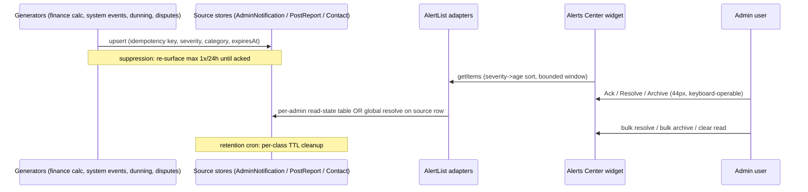
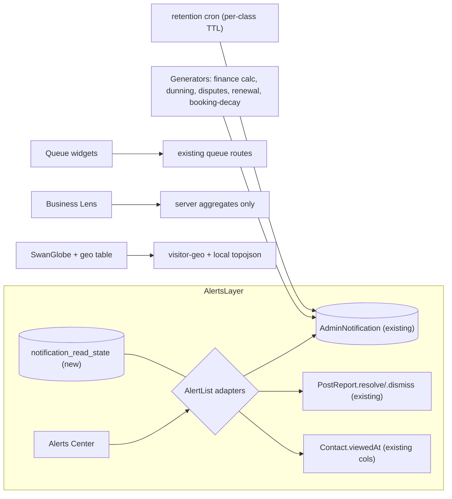

# ADMIN DASHBOARD WIDGET BLUEPRINT — 2026-08-04 (v2 FINAL)

> **decision:** Rebuild the admin Command Center's alert lifecycle on existing unused infrastructure (adapter-unified, severity-aware, per-admin read-state), install a systemic WidgetShell against the false-negative class, fix data-truth defects, retire 14 dormant files, ship revenue-first missing widgets before the SwanGlobe showpiece.
> **status:** open (blueprint FINAL and panel-reviewed — Kimi K3 + HY3, arbitrated by Fable as Final Decider, Opus 5 skipped per Sean 2026-08-04 — but build slices S1–S13 are NOT yet built; tracked in SWA-138)
> **supersedes:** v1 draft (same file, same day)
> **Linear:** SWA-138
> **Verified against:** `origin/main` @ `b17e13d90` (working branch is 1,508 commits behind — every finding verified in a main worktree). All build slices target `main`.

---

## 1. Canonical Surface Receipt (Rule 26) — summary

- Route: `main-routes.tsx:926` `dashboard/*` → `UniversalDashboardLayout`.
- **Finding A:** bare `/dashboard/admin` lands on the **Master Schedule** (`defaultPath: '/master-schedule'`, `UniversalDashboardLayout.routes.tsx:180`), NOT the widget Command Center. The widget surface is only at **`/dashboard/admin/overview`** (`routes.tsx:105` → `admin-dashboard-view.tsx:44` → `AdminOverviewPanel.tsx`). Every IA claim below is one click deep until S13 is decided.
- `AdminOverviewPanel.tsx` renders 21 widgets + 2 command bars in six one-scroll sections: mission-critical (:209-214), platform-pulse (:240-243), operations (:251-254), community-safety (:262-265), business-lens (:273-275), deep-telemetry (:285-288).
- Separate full pages: `/revenue` (RevenueAnalyticsPanel), `/pending-orders` (PendingOrdersAdminPanel).
- **Absent from main entirely:** `useBusinessIntelligence` hook, `AdvancedAnalyticsDashboard` (archive-only). Never audit or build against them.

### Classification highlights (Rule 27)
**Canonical (mounted):** the 21 overview widgets + 2 pages above.
**DORMANT — zero consumers `[VERIFIED]`:** `overview/MetricCard`, `overview/EmptyState`, `overview/ErrorMessage`, `overview/LoadingSpinner`, `ClientActivityWidget`, `HighRiskClientsWidget`, `TopTrainersWidget`, `BulkModerationPanel`, `AdminSocialManagementView`, `PaymentSettingsPanel`, `AdminDebugPage`, `SystemHealthManagementSection`, `UsersManagementSection`, `schedule/AdminScheduleTab` (+ dead shim).
**COMPETING:** `admin-dashboard/components/TrainerManagement/TrainerPermissionsManager.tsx` is a dead duplicate of the live `components/Admin/TrainerPermissionsManager.tsx`.
**MISFILED:** `adminReportsController.mjs` — a *backend controller* in the *frontend tree*, two drifting copies, wired to nothing.

---

## 2. The P0, root-caused: "Business Intelligence Alerts" cannot be cleared

The surface is **`ContactNotifications.tsx`** (header literal "Business Intelligence Alerts", `:168`; mounted `AdminOverviewPanel.tsx:211`). Three stacked failures `[VERIFIED]`:

1. **Fake read-state.** Both mappers hardcode `isRead: false` (`ContactNotifications.helpers.tsx:105,119`). The "unread only" toggle, badge, and urgent-blink are permanently meaningless. The `Contact` model already has `viewedAt`/`respondedAt` columns — nothing writes them; `contactRoutes.mjs` has no PATCH/PUT/DELETE.
2. **No store for computed alerts.** The finance half (`GET /api/admin/finance/notifications`) is recomputed from `ShoppingCart` per request — no row to dismiss.
3. **Abandoned stub.** `/api/admin/alerts/active` returns `[]`; `/acknowledge` **throws 501** (`adminEnterpriseRoutes.mjs:806-813`); zero UI consumers.

**Same class, second instance:** `PostReportsWidget.tsx` blueprint header promises `[Resolve] [Dismiss]` → never built (JSX `:269-295`), while `PostReport.mjs:151-167` has `.resolve()`/`.dismiss()` fully implemented, zero callers. Also a Rule 75 violation.

**Key discovery:** `AdminNotification` model + `adminNotificationsRoutes.mjs` (mounted `core/routes.mjs:544`) is a complete, dismissible, auto-expiring notification system — `isRead/readAt/readBy`, `actionRequired/actionTaken`, `expiresAt` + `cleanupExpiredNotifications()`, 7 endpoints — **with zero consumers**. We adopt it; we do not invent a fourth system.

### Unified Alert Lifecycle v2 (post-panel)

Panel-hardened contract — HY3's adapter model replaces v1's implied single-store migration:

- **A1 — One UX, three stores.** A single `AlertList` primitive with a source-adapter interface (`getItems / ack / resolve / bulk(op, ids)`). `AdminNotification`, `PostReport`, and `Contact` each implement the adapter. No schema merge; one muscle memory.
- **A2 — Severity + category.** `severity 0–3` + `category` added; sort = severity → age (a chargeback due in 72h outranks 40 finance infos). Severity rail on each row, no blinking.
- **A3 — Three verbs.** **Ack** (per-admin seen) · **Resolve** (global truth, hides for all, audit-retained) · **Archive** (hide without resolving). Add `POST /bulk {resolve}` beside the existing bulk-archive.
- **A4 — Read-state per-admin, resolution global.** New side table `notification_read_state (adminId FK → "Users", refType, refId, readAt, archivedAt)`; `resolvedBy/resolvedAt` stay global on the source row. Kills the two-admin collision (double-handled refunds / vanishing audit trails).
- **A5 — Retention matrix.** Per-class TTL (initial: system 14d, finance 30d, contact 90d, post-reports 180d soft-delete) enforced by extending the existing cleanup cron. TTLs are config, not code.
- **A6 — Suppression window.** A persisting condition re-upserts its row but does NOT re-surface more than once per 24h until acknowledged.
- **Claim/assign.** An "acting" chip (uses `readBy`/side table) so two admins don't double-handle one item.
- **Cadence + badge truth.** Alerts Center polls via shared `usePolledFetch` (60s default); the SignalBar unread badge reads the SAME hook — one source of truth.



---

## 3. Per-widget verdict table

(Unchanged from audit — every row verified against main; full evidence in session findings archive.)

| Widget | Verdict | Load-bearing findings |
|---|---|---|
| ContactNotifications ("BI Alerts") | **REBUILD (P0)** | Fake isRead; zero dismiss; unbounded growth; dead `viewedAt` schema |
| PostReportsWidget | **REBUILD (P0)** | Promised Resolve/Dismiss never built; model methods exist unused; no loading state; fetch-once |
| PendingOrdersAdminPanel | REBUILD | 588 lines; money KPIs client-summed over a 50-row page; unconditional CA tax |
| AdminOverviewMetrics | UPGRADE | Synthetic self-referential targets (`*1.15`/`*1.1` → bars always ~87%); gross-vs-net drift |
| SessionTrackingWidget | UPGRADE | No loading state (false zeros); no refresh; at 300-line cap |
| UpcomingChecksWidget | UPGRADE | No error state — failure renders "All clients are up to date"; top-10 slice hides overdue #11+ |
| BusinessKPIDashboard | UPGRADE | Fetch-once staleness; MRR definition conflict; display-only |
| UserGrowthChart | UPGRADE | No refresh; different "active" endpoint than adjacent card |
| RealTimeSignupMonitoring | UPGRADE | Auto-refresh resets pagination; unbounded upsert; styles 311 lines |
| GamificationSummaryWidget | UPGRADE | No loading state; raw hex in badges (Rule 6); display-only |
| VisitorWorldMap | UPGRADE → S12 | Mouse-only tooltips; un-pinned CDN GeoJSON (no SRI/fallback) |
| AdminSystemHealthPanel | UPGRADE | Error indistinguishable from healthy-empty; silent no-op refresh |
| ModerationWidget · PendingPaymentsWidget · CancelledSessionsWidget(+Card) · AdminFulfillmentQueue(+Card) · OrientationIntakeWidget · WaiverSummaryWidget · ClientComplianceDashboard · OracleInsightsWidget · VisitorGeoWidget family · RecentActivityFeed · SocialOverviewWidget · AdminQuickActions · AdminSignalBar · AutomatedCheckInsWidget · RevenueChart · RevenueAnalyticsPanel | KEEP | Per-widget notes in audit archive; Revenue duplicate resolved: **Overview gets a compact net-revenue stat card linking to `/revenue`** (decision, was `[LIKELY]` in v1) |
| ClientActivityWidget · HighRiskClientsWidget · TopTrainersWidget | **RETIRE** | Dormant + unregistered endpoints; HighRisk's "Mark as Contacted" is fake. **Concept preserved:** booking-decay signal becomes an S4 alert generator (Kimi M7, accepted-as-modified) |
| BulkModerationPanel | **RETIRE** (rebuild-on-demand) | Dormant; 521 lines; zero tokens; sub-44px controls; invalid DOM attr |
| MetricCard/EmptyState/ErrorMessage/LoadingSpinner | **RETIRE** | Dormant duplicates — edit-the-wrong-file traps |

### Cross-cutting defects → systemic fixes (HY3 C-series, accepted)
1. **False-negative class is systemic** → `WidgetShell` mandate (S1): enforced header (title · last-updated · refresh) + three DISTINCT slots (skeleton-loading, explicit-empty, explicit-error+retry). All widgets adopt; the class dies at the root.
2. **No crash isolation** → per-widget `ErrorBoundary` + `Suspense` (S1). One chart throw must not white-screen the Command Center.
3. **Freshness anarchy** → section-level "updated Xm ago" + amber stale dot; `usePolledFetch(60s)` standard.
4. **Three revenue definitions co-rendered** → gross/net methodology labels (S6).
5. Clean already: no MUI, no Recharts, no Galaxy-Swan tokens in the mounted set.

---

## 4. Swan Lens conformance (unchanged findings, scheduled S8)

Admin widgets use neither Style-Lens skinning (scope decision, not defect) nor the M1 motion license (`surfaceMotionTiers.ts:53` — zero consumers). Fixes: one `<MotionConfig reducedMotion="user">` wrap (covers all framer-motion widgets), 2 reduced-motion CSS guards in VisitorGeo styles, `resolveMotionTier('dashboard.admin')` adoption in the overview shell, Gamification badge hex → tokens.

---

## 5. Missing-widget list — REVISED (revenue-first re-rank, Kimi accepted)

v1 sorted by backend effort; that was an effort ranking wearing a priority ranking's clothes. Final ranking sorts by money:

**Wave 1 — revenue-critical (S10):**
1. **Renewal / Churn-Risk Queue** — PROMOTED (model+service exist; the "unmounted controller" is a one-line mount, not a demotion reason). Emits into the S4 alert lifecycle: a churning client is act-now, not a chart.
2. **Failed-payment / Dunning Queue** (Kimi M1, accepted) — declines, retry status, card-expiring-soon, each with a recovery action. Requires Rule-26 receipt on available Stripe/order decline data before build.
3. **Refunds & Dispute Inbox** (Kimi M2, accepted) — deadline-bearing, alert-class, severity P0/P1 via S4. Receipt required on webhook data availability `[HYPOTHESIS]`.
4. **Lead SLA / Speed-to-Lead Timer** (Kimi M6, accepted) — new lead → time-to-first-contact → booked; pairs with **Comms Deliverability** (deliverability alone is telemetry). Aligns with the locked Marketing Brain first epic.
5. **Financial Reconciliation** — `adminReconciliationRoutes.mjs:22` (mounted, zero consumers); placed beside Alerts (it generates alert items).

**Wave 2 — ops & insight (S11):** Trainer Capacity/Utilization (revenue per trainer-hour) · AI/Swan Coach Cost & Usage (demoted from #1 — cost-center telemetry) · Cancellation/No-Show Leakage aggregate (Kimi M8) · Unredeemed Session-Credit Liability (Kimi M3, reclassified up from v1's deferred list — balance-sheet number for a prepaid-package business) · Content/Video Funnel (demoted — funnel-stage data unproven vs raw views) · Onboarding Completion + **Activation Funnel** (Kimi M9 — signup→first-booked→first-completed; distinct widgets) · PLAUD Ingestion Health · Bootcamp Ops.

**Deferred pending data/receipt:** Trainer cert/insurance expiry (Kimi M5 — no captured data source found `[UNKNOWN]`), Referral performance (M10 — pending referral-seeding epic data), AI consent audit, custom-package tracker, win-back tracker.
**Rejected:** Trainer payout owed (Kimi M4) — an admin payouts surface already exists per the §C inventory; not missing. **Notification Center** (v1 wave-1 #5) — reclassified: it's the S4 byproduct, not a business widget. **Killed:** wearable coverage (no live ingestion).

---

## 6. SwanGlobe — strict-M1 spec (HY3 B-series accepted; slice DEMOTED to S12 behind revenue widgets)

Direction **D1 "Command Globe"** (Sean defaulted to globe; D2 roadmap-constellation logged as optional follow-up; D3 rejected).

- **B1 Strict M1:** idle = static obsidian sphere, **no ambient pulses**. Drag = camera only. Hover/focus = single-marker highlight. New signup = one pulse on ingest event, then stop. No ambient loop, ever.
- **B2 Conditional import:** `if (isDesktop && hasWebGL && motionAllowed)` → fetch the Three.js chunk; otherwise the SVG map renders and **the chunk is never downloaded**. Mobile default = SVG + ranked city list. Assert zero Three.js bytes in mobile transfer (`size-limit` check in CI).
- **B3 Perf contract (acceptance criteria):** `setPixelRatio(min(dpr,2))`; `IntersectionObserver` + `visibilitychange` render-pause; `dispose()` on unmount; merged `BufferGeometry`/`InstancedMesh` for markers; 60fps interact measured, not asserted.
- **B4 Split-pane:** globe 60% / sortable geo-table 40%, hover/focus-synced. **Table is the truth; globe is the where** — fixes the density failure of globe-as-decoration.
- **B5 Context-loss:** `webglcontextlost` → SVG fallback, no black widget.
- Carry-overs from audit: same two API calls/shapes; local topojson (kills the jsdelivr runtime dependency); keyboard-focusable city list (fixes today's mouse-only defect); zoom clamp [1,8].

---

## 7. Wireframes — v2 (IA fixes accepted: Alerts/Queues split, SignalBar order = scroll order, Business Lens purity, density budget)

**Widget budget:** max 5 widgets per section; a new widget entering a full section must name the widget it replaces or collapses (sunset rule). **Adaptive density (C3):** healthy/empty widgets auto-collapse to a 44px title bar + count badge; sections with actionable items stay open.

### Desktop (≥1280px) — scroll order = SignalBar order
```
┌────────────────────────────────────────────────────────────────────┐
│ SignalBar: [Alerts] [Queues] [Business] [Ops] [Community] [Telemetry]
│ QuickActions                                                       │
├── 1. ALERTS (dismissible; severity→age; one badge source) ─────────┤
│ ┌ Alerts Center ──────────────────────────────┐                    │
│ │ ▌P0 dispute due 72h   [Ack][Resolve][…]     │  + Reconciliation  │
│ │ ▌P1 renewal cliff ×3  [Ack][Resolve]        │    drift feed      │
│ │ ▌P2 finance info (7)  [bulk ▾] [Clear read] │                    │
│ │ view all (32) →                             │                    │
│ └─────────────────────────────────────────────┘                    │
├── 2. QUEUES (work items, NOT dismissible) ─────────────────────────┤
│ Orientation │ Waivers │ PendingPay │ Cancelled │ Dunning (new)     │
├── 3. BUSINESS LENS (money truth only) ─────────────────────────────┤
│ Net-revenue stat→/revenue │ Growth │ KPIs(gross/net labeled)       │
│ Renewal queue summary │ Lead SLA timer                             │
├── 4. OPERATIONS  (compliance, sessions, capacity)  ────────────────┤
├── 5. COMMUNITY   (social, moderation, gamification) ───────────────┤
├── 6. TELEMETRY   (SwanGlobe+geo table, Oracle, AI cost, sys health)│
└────────────────────────────────────────────────────────────────────┘
```

### Mobile (414px) — accordion + lazy mount (C6)
```
┌──────────────────────────────┐
│ ▸ ALERTS (3)      [expanded] │  Six sections as accordion;
│   ▌P0 item  [Ack][Resolve]   │  below-fold sections mount on
│ ▸ QUEUES (5)                 │  IntersectionObserver. Alerts
│ ▸ BUSINESS                   │  opens first. TELEMETRY ships
│ ▸ OPERATIONS                 │  SVG map + city list only —
│ ▸ COMMUNITY                  │  Three.js chunk never fetched.
│ ▸ TELEMETRY (SVG map)        │  All targets ≥44px, no hover-
└──────────────────────────────┘  only actions.
```

### Data-flow (target)


---

## 8. Slices — FINAL ORDER (v2, panel-arbitrated)

| # | Slice | Contents | Key acceptance criteria |
|---|---|---|---|
| **S1** | **WidgetShell foundation** | Shared shell (header/title/last-updated/refresh + skeleton/empty/error slots), per-widget ErrorBoundary+Suspense, section freshness indicator, `usePolledFetch` | Mock `fetch→500`: UpcomingChecks renders "Data unavailable," NOT "All clients up to date" (C4 test); one widget throw ≠ page crash |
| **S2** | PostReports lifecycle (P0 quick win) | PATCH `/reports/:id/resolve` + `/dismiss` onto existing model methods; the two promised buttons + confirm; loading state | Failing→passing route tests; keyboard-operable; header now truthful (Rule 75) |
| **S3** | ContactNotifications read/dismiss (P0) | PATCH writes `viewedAt`; real read-state; per-item dismiss + clear-read; bounded window + view-all; finance → AdminNotification rows (idempotency + expiresAt) | Dismissals survive refresh (regression test); badge reflects truth |
| **S4** | **Alerts Center v2** | AlertList + adapters (A1); severity+category (A2); Ack/Resolve/Archive + bulk-resolve (A3); `notification_read_state` migration — FK `"Users"` (A4); retention matrix (A5); suppression window (A6); claim chip; 60s poll; single badge source; retire the 501 stub | Two-admin test: A resolves → hidden for B; A archives → B still sees; suppression verified |
| **S5** | IA restructure | Alerts/Queues split; SignalBar order = scroll order; Business Lens purity (AI cost → Telemetry, Reconciliation → Alerts); compact net-revenue card→/revenue; adaptive density collapse; mobile accordion + lazy mount; widget budget (≤5/section + sunset rule) | 414px audit; anchor↔section parity test |
| **S6** | Money-truth fixes | Server aggregates for /pending-orders KPIs; split 588-line file; kill synthetic targets (real stored goal or no bar); gross/net labels; tax conditional-or-removed | KPIs correct with 150 seeded orders; files ≤300 lines |
| **S7** | State-truth residuals | Pagination-preserving refresh (RealTimeSignup); CancelledSessions N+1 → `Promise.all`; remaining per-widget fixes not covered by S1 shell | Per-fix regression tests |
| **S8** | Motion & a11y | MotionConfig wrap; VisitorGeo reduced-motion guards; `resolveMotionTier('dashboard.admin')` enforcement; Gamification token fix | No unguarded animation; axe pass |
| **S9** | Hygiene (Rule 34 — Sean-gated) | Archive proposal for the 14 dormant/competing/misfiled files; .gitignore proposals | Nothing moves without explicit approval; grep evidence per file |
| **S10** | Missing widgets wave 1 (revenue-first) | Renewal/Churn queue (mount route; alert-emitting) · Dunning queue · Dispute inbox (alert-class) · Lead SLA + Comms Deliverability · Reconciliation | Rule-26 receipt per widget BEFORE build (esp. Stripe decline/dispute data); each ≤300 lines; WidgetShell-based |
| **S11** | Missing widgets wave 2 | Trainer capacity · AI cost · Cancel-leakage · Credit liability · Video funnel · Onboarding + Activation funnel · PLAUD health · Bootcamp ops | Receipts + tests; budget/sunset rule enforced |
| **S12** | SwanGlobe (strict M1) | B1–B5 contract (§6) + split-pane geo table | Measured 60fps; zero Three.js bytes on mobile; context-loss fallback proven |
| **S13** | Landing decision (Sean) | Optionally default `/dashboard/admin` → `/overview` | Sean's call; one-line change + test. Until decided, S5's SignalBar work is one click deep (acknowledged) |

Order rationale: S1 kills the systemic false-negative class before anything else is built on it; S2–S4 kill the P0; S5 makes the surface navigable; S6–S7 restore trust; S10 ships money widgets **before** the S12 showpiece (Kimi's demotion, accepted). Batch-push cadence (Rule 70) per wave.

---

## 9. Panel log (Rule 46-style)

| Round | Reviewer | Cost | Outcome |
|---|---|---|---|
| Preflight | all 3 CLIs, zero calls | $0 | Packet SHA `c256a0e3…b61231`; caps 1.65/1.00/0.90 |
| R1 | **Kimi K3** (`moonshotai/kimi-k3`) | $0.1045 | Conditional pass. ACCEPTED: revenue-first re-rank + renewal promotion + globe demotion; M1 dunning, M2 disputes, M3 credit liability, M6 lead-SLA, M8 cancel-leakage, M9 activation, M7-as-alert-generator; Alerts/Queues split; SignalBar order; Business Lens purity; widget budget + sunset; severity×age, mute/digest→suppression, cadence, claim, single badge. REJECTED: M4 trainer payouts (surface already exists per inventory); "Video Funnel rank-inflated" partially — demoted to wave 2 rather than cut. DEFERRED: M5 cert-expiry (no data source), M10 referrals (pending epic data). |
| R1 | **HY3** (`tencent/hy3`) | $0.0047 | ACCEPTED IN FULL: A1–A6 (adapter unification, severity, three verbs + bulk resolve, read-state side table, retention matrix, suppression), B1–B5 (strict-M1 globe, conditional import, perf contract, split-pane, context-loss), C1–C6 (WidgetShell, ErrorBoundary, adaptive density, error≠empty test, freshness, mobile accordion). No rejections — every finding survived verification against the codebase facts. |
| — | Opus 5 | skipped | Per Sean 2026-08-04; gap recorded per Rule 46 |
| Arbitration | **Fable (Final Decider)** | — | v2 rewritten; slice order S1–S13 finalized |

**Calibration:** Kimi 14 findings accepted / 2 rejected / 2 deferred — high signal. HY3 17/17 accepted — very high signal. Actual spend $0.1092 of $2.61 approved; calls used 2 of 15 authorized.

## 10. Out of scope / follow-ups
- D2 "Roadmap Constellation" 3D widget — optional follow-up if Sean wants the roadmap visual too.
- User-dashboard enhancements — separate workstream (inputs captured in gap inventory).
- PendingPayments vs /pending-orders "mark paid" side-effect parity — verify inside S6.
- Trainer cert/insurance data capture (prereq for the M5 widget) — product decision.
- `free|pro|elite` lens tiers — live in the gallery feature, not style-lens-os; no admin action.
