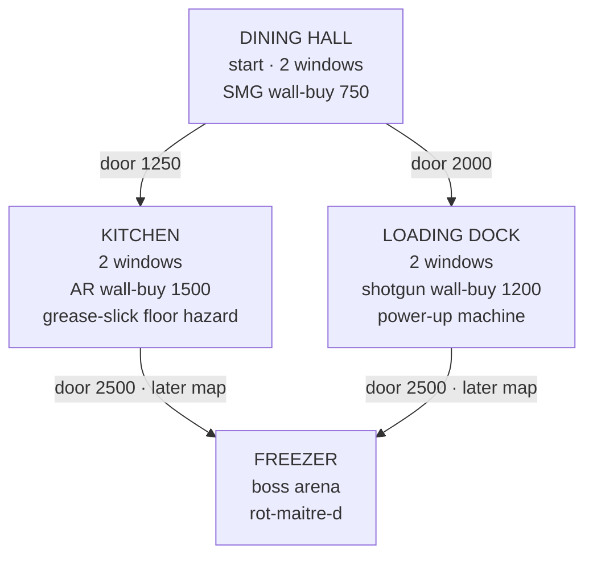
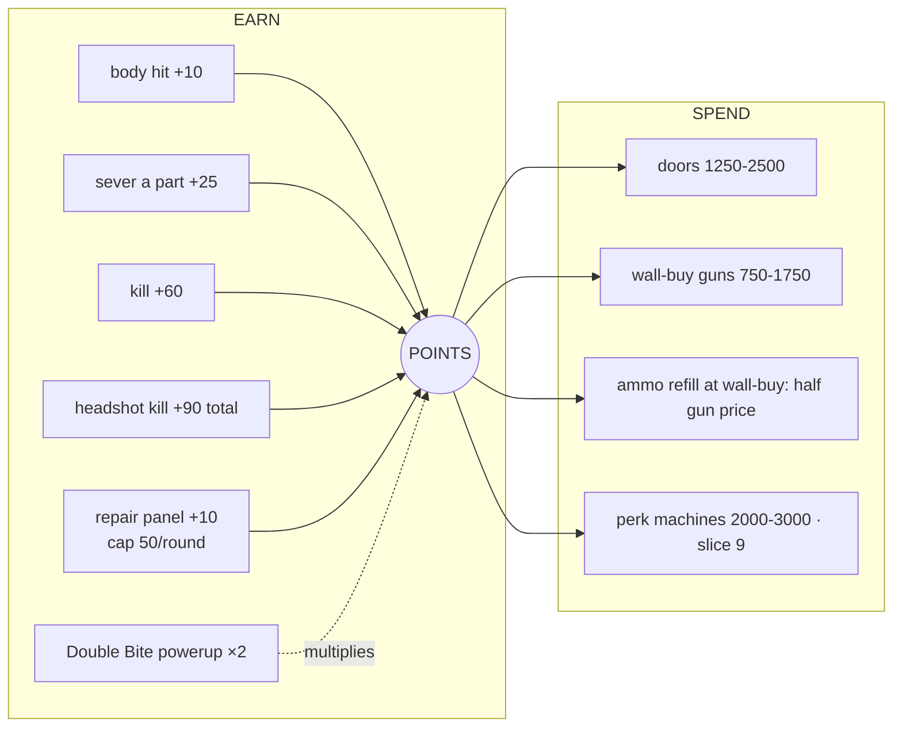
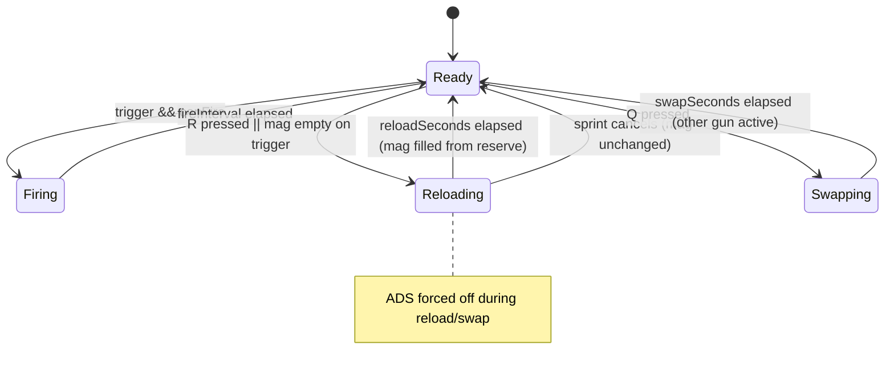
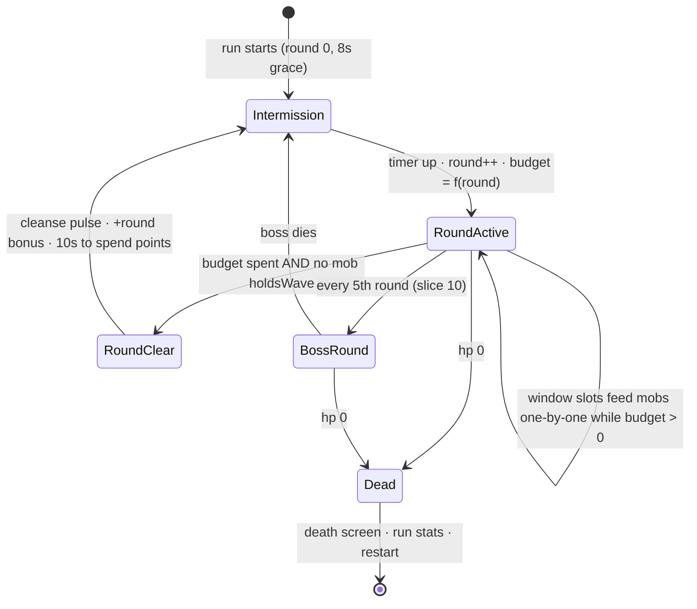

# AFTERTASTE — Beyond Zombies Master Blueprint

**Date:** 2026-09-02 · **Author:** Fable 5 · **Status:** blueprint awaiting GLM 5.3 + GLM Flash hostile review, then build
**Owner's brief (Sean, playtest 4):** *"I'm completely bored of these Tetris enemies. I want the real ones — the flies, the kissing bugs, the roaches, the zombies as people. This is supposed to be Call of Duty Zombies: rooms where the mobs come in one by one and get points. There's no point system, no power-ups, no different guns. Base it off real guns first — assault rifles, LMGs, SMGs, 9-millimeters — then add our own creative guns later. We're gonna need power-ups. We're gonna need bosses. We already have all this decided. Make it better than CoD Zombies."*

---

## 0. What is true right now (so the plan stands on ground, not memory)

| Layer | State | Evidence |
|---|---|---|
| FPS core | SHIPPED — mouse-look, hitscan, tracers, recoil patterns, capped spread, ADS, sprint/jump, F-punch | 127 unit + 23 browser tests green, commit `e94bae199` |
| Weapons | Data table EXISTS (`weapons.js`) but holds ONE gun, no ammo, no reload, no switching | `src/combat/weapons.js` |
| Dismemberment | SHIPPED for fryling-v2 (head pops, parts sever, gibs) | sever.spec.js |
| Enemies | 4 primitive blockouts (the "Tetris blocks" Sean is done with) + 1 parted fryling | `src/enemies/roster.js` |
| World | Infinite textured plane, ring-spawns around the player — **no rooms, no windows** | `src/world/Ground.jsx`, `systems/waves.js` |
| Economy | NONE — kills count, but buy nothing | `store.js` has `kills` only |
| Power-ups | NONE | — |
| Bosses | NONE (archetype designed in the 08-25 blueprint: banquet ringmaster / rot-maître-d′, trademark search required before art) | 08-25 blueprint §2 |
| Cast designs | ALREADY WRITTEN — parasite family (kissing bug, bedbug, leech, mosquito, flea, tick, assassin bug, husk-wearing decay), food-court cast (crumb-roach, pizza-husk, rind-bulwark, glaze-decoy, rot-maître-d′) | `ox-parasite-expansion-2026-08-26.md`, roster-v2 contract |

**The gap in one sentence:** we built a great GUN and a great DEATH, and no GAME around them. This blueprint is the game.

---

## 1. The pillars (what "better than CoD Zombies" means, concretely)

CoD Zombies' loop is: survive rounds → earn points per hit/kill → spend points on doors, guns, perks → push deeper → die to your own greed. We keep that skeleton because it is the best horde loop ever designed. We beat it on FIVE fronts it cannot follow us to:

1. **Dismemberment is the economy.** In CoD, a headshot is a number. Here, precision is VISIBLE (the head pops, the arm flies) and PAID (sever bonuses). Skill has a body count you can see and a wallet you can feel. No horde game ties the gib system to the wallet this directly.
2. **The enemies are an ecosystem, not a texture-swap horde.** Parasites drain and flee; huskweavers wear their kills; roaches flood the cracks; the Regulars (zombified diners) shamble. Each row has counterplay, not just hp. CoD's zombies differ by speed; ours differ by VERB.
3. **Contamination vs. cleansing.** Boarding a window isn't wood — it's crystalline light panels. Clearing a room visibly CLEANSES it (Swanverse redemption canon). The map itself is the progress bar. CoD's maps never heal.
4. **Guns are learnable data.** Real-gun-grammar recoil patterns per weapon (already shipped) mean gun identity is in your hands, not the skin. Creative guns later are new ROWS, not new systems.
5. **Readable one-by-one pressure.** Windows meter the horde into a stream you can watch, prioritize, and fail to hold. The current spawn ring teleports pressure in from anywhere; windows make pressure a PLACE.

**IP separation (hard law):** structure is uncopyrightable; expression is not. NO CoD names (no "Juggernog", no "Mystery Box", no "Pack-a-Punch"), no CoD sounds, no round-change violin sting, no chalk-outline wall-buys, no clown/red-yellow trade dress on the boss. Our names come from the food-court fiction. Real gun MODELS are also protected trade dress in some cases — we use real gun CLASSES and behaviors (a 9mm sidearm, an SMG, an AR, an LMG, a pump shotgun) with original names and silhouettes.

**Health language (C7, still law):** debuffs name the environment, never the body. No fat-shaming reads. Zombified diners are victims of the contamination, not caricatures — they are what the champion is SAVING, and the fiction says cleansed rooms release them (they dissolve into light, not gore piles).

---

## 2. The Room System — the map is a graph of purchasable spaces

### 2.1 First map: "The Food Court" (three rooms + a hub, expandable)

```
                    N
   ┌──────────────[W3]──────────────┐
   │                                │
   │   ROOM B: THE KITCHEN          │
   │   (door B: 1250 pts)      [W4] │
   │                                │
   ├───────[DOOR B]─────────────────┤
   │                                │
[W1]   ROOM A: THE DINING HALL      │
   │   (start room)            [W2] │
   │   · counter (cover)            │
   │   · wall-buy: SMG (750)        │
   │                                │
   ├───────[DOOR C]─────────────────┤
   │   (door C: 2000 pts)           │
   │   ROOM C: THE LOADING DOCK     │
[W5]   · wall-buy: shotgun (1200)   │
   │   · power-up machine       [W6]│
   └────────────────────────────────┘

 [Wn] = window (barricade, 5 panels, mobs enter one by one)
 DOOR = points-locked; opening extends the play space AND the spawn set
```

- **Rooms are data** (like everything else): `rooms.js` rows carry bounds, window positions, door links + costs, wall-buys, and which cast spawns there. Adding a map is adding rows.
- **Windows** are the only mob entrance in rooms (bosses excepted). Each has 5 barricade panels; a mob at the window tears one panel per beat, then climbs through. The player repairs panels for points (capped per round, CoD's own anti-farm rule — the cap is ours to tune).
- **Doors** open with points, permanently for the run. Opening a door adds its room's windows to the active spawn set — deeper map = more pressure = better buys. The self-balancing greed loop.
- **Walls are REAL now:** movement collides with room bounds (the current infinite plane keeps living underneath as the pre-room "endless yard" mode — it becomes the tutorial/fallback arena, not dead code).

### 2.2 Map graph (mermaid)



---

## 3. Points — one currency, earned by violence, spent on progress



- **Store shape:** `points` joins the game store; every damage event routes through one `awardPoints(event)` so multipliers and tests have a single choke point.
- **Sever bonus is the signature rule** (pillar 1): shooting off a part pays MORE than a body hit — precision-severing a cheap mob's parts before the kill out-earns center-mass spam. CoD cannot copy this without our dismemberment layer.
- Numbers above are STARTING numbers with one job: a wave-5 player should afford the first door OR the SMG, not both. Tuned in playtest; the tests assert relationships (headshot > kill > sever > hit > repair), never absolute values.

---

## 4. Weapons — real-gun grammar first, creative guns as rows later

The `WEAPONS` table (shipped) grows from 1 row to 5, plus the ammo/reload/switch systems that make a roster mean something. Names are working names; **Sean owns final naming.**

| id (working) | class | dmg | RPM | mag | reserve | recoil grammar | spread cap | zoom | role |
|---|---|---|---|---|---|---|---|---|---|
| `sidearm-9` | 9mm pistol | 1 | 270 (semi) | 12 | 60 | small pop, fast reset | tight | 60 | STARTING gun — accurate, honest, weak |
| `sweeper-smg` | SMG | 1 | 750 | 30 | 150 | fast climb, wide drift | wide | 62 | close-range hose, cheap wall-buy |
| `line-rifle` | AR (exists as `fry-rifle` stats) | 2 | 400 | 24 | 120 | strong first kicks easing off, right drift | medium | 55 | the all-rounder |
| `dock-pump` | pump shotgun | 1×8 pellets | 66 | 6 | 36 | single heavy lunge | per-pellet cone | 65 | one-window king; severs limbs in bunches |
| `belt-anchor` | LMG | 2 | 545 | 60 | 180 | slow heavy figure-8 | blooms hard, recovers slow | 58 | held-ground monster, slowest ADS + slower walk |

**New mechanics this table requires (each is its own slice-tested system):**
- **Ammo:** `mag` + `reserve` per carried gun. Firing on empty = dry click + auto-reload. `R` reloads (cancellable by sprint). HUD shows `mag / reserve`.
- **Two-gun carry:** you hold 2; wall-buying a 3rd swaps your CURRENT gun. `Q` or wheel swaps. (CoD's own rule; it's correct — the choice of which two IS the build.)
- **Wall-buys:** proximity + `E` + points. Buying again refills reserve at half price.
- **Shotgun = multi-pellet hitscan:** one trigger pull rolls N=8 rays inside the cone; each pellet is a normal hitscan (sever math free of charge). The existing entry-ordered hitscan handles this with a loop, no new collision code.
- **Semi-auto:** `fireMode: 'semi'|'auto'` — semi requires re-click; the trigger system gains one flag.
- **Weapon-swap and reload are STATES** with durations (mermaid below), because "can I shoot right now" must be one function (`canFire(gun, now)`) or the edge cases multiply forever.



---

## 5. Power-ups — dropped by the dead, food-court fictioned

Drops spawn from kills at a tuned low rate (guaranteed-timer fallback so droughts can't happen), glow on the floor, expire in 30s, apply globally for their duration. **Original names from OUR fiction — never CoD's:**

| Working name | Effect | CoD analog (structure only) | Signature twist |
|---|---|---|---|
| **Sugar Rush** | 20s: all guns kill in 1 hit less (min 1) | Insta-Kill | screen edges frost with crystalline sparkle, not red |
| **Double Bite** | 30s: points ×2 | Double Points | — |
| **Deep Clean** | instant: every mob currently ALIVE dissolves in light; pays half points each | Nuke | it CLEANSES — floor under each death sparkles clean |
| **Full Pantry** | instant: all mags + reserves refilled | Max Ammo | — |
| **Board-Up** | instant: every barricade panel on every active window restored | Carpenter | panels rebuild as light, room brightens a step |

Slice 9 adds **perk machines** (permanent-for-run buys: faster reload, faster ADS, +hp, faster panel repair) — designed then, not now, because machines only matter once death is expensive.

---

## 6. The REAL cast — killing the Tetris blocks

This is the arc Sean has now asked for twice. It ships in TWO lanes so visible change arrives immediately and keeps compounding:

**Lane 1 — sculpted blockouts (days, not weeks).** The v2 Blender pipeline (swan_pipe_stages) already splits parts, binds bones, and emits verified hit shapes. It gets per-creature RECIPES: multi-box silhouettes with bevels, stances, and proportion language — a roach is LOW and WIDE with a head wedge; a kissing bug is a teardrop with a proboscis spike; a Regular (zombified diner) is a biped with hanging arms. Not final art — but unmistakably CREATURES, not Tetris. Every creature keeps the parts contract (head/body minimum; limbs as the recipes mature) so dismemberment works on the whole cast from day one.

**Lane 2 — per-type gait identity (same slice).** A cast reads as alive through MOVEMENT more than mesh: roaches skitter in bursts with direction jitter; kissing bugs creep slow until close then LUNGE (their designed `strike_probe`); Regulars shamble with a lean; flies bob on a sine. Gaits are data on the roster row (`gait: {type, params}`) driving position/tilt in Enemies.jsx — no animation files needed for v1.

**The build order (each = roster row + recipe + gait + spec test):**

| # | Creature | Source design | Verb that makes it distinct |
|---|---|---|---|
| 1 | **The Regular** (zombified diner — "zombies as people") | new; C7 rules apply | the shambling baseline at windows; the wave's body |
| 2 | **Crumb-roach** | roster-v2 contract | floods in 3s through torn windows, dies to 1 hit, terrible alone, terrifying in tens |
| 3 | **Kissing bug** | `parasite.kissingbug` | creeps at the edge of vision, LUNGES; hits apply a 3s screen-dim "fever" pulse |
| 4 | **Grease-fly** (upgrade existing) | roster | death leaves a 6s grease slick — sprint across it and you slide |
| 5 | **Pizza-husk** | roster-v2 contract | armored front; parts must be shot OFF before body damage lands (the dismemberment system becomes counterplay) |
| 6 | **Rind-bulwark** | roster-v2 contract | slow shield-wall that shelters mobs behind it |
| 7 | **Rot-maître-d′** (BOSS) | 08-25 blueprint §2 | slice 10; trademark search FIRST (Qwen's rule); no clown, no red/yellow |

Fryling, drip-cyst, patty-larva get recipe re-sculpts in the same pass. **The parasite expansion doc's full family (bedbug, leech, mosquito, tick, huskweaver…) is the post-blueprint content well — rows waiting.**

---

## 7. Round flow — one state machine owns the night



- **Budget, not count:** each round has a spawn budget (mob costs: Regular 1, roach 0.4, kissing bug 2…) so composition can shift by round without new code. The wave director stays ONE machine (HY3's rule: never two counters).
- **Windows meter the flow:** each active window admits at most 1 climbing mob at a time; the director assigns queued spawns to the least-crowded active window. Pressure is a PLACE (pillar 5).
- **Intermission is the shop beat:** the 10s breather is when doors/wall-buys/machines get used — same reason CoD's round gap exists; ours is explicit and shows the round bonus.

---

## 8. HUD (wireframe — the current HUD grows four organs)

```
┌────────────────────────────────────────────────────────────┐
│ ROUND 7                                    ⚡ Sugar Rush 12s │
│                                                            │
│                                                            │
│                          +                                 │
│                     (cone crosshair)                       │
│                                                            │
│  [!] window NE breached                                    │
│                                                            │
│ ♥♥♥♥♡          POINTS 4,320         LINE RIFLE   [Q] SMG   │
│ hp                                   18/96   R to reload   │
└────────────────────────────────────────────────────────────┘
   · buy prompt (contextual, center-low): "E — open KITCHEN (1250)"
   · hitmarker ✕ (exists) · damage-direction pip (R8, exists in backlog)
   · power-up timers stack top-right; icon + label + shape, never color alone
```

---

## 9. Test map (failing-first, per slice — the contract for every system above)

| System | Unit tests (node) | Browser tests (playwright) |
|---|---|---|
| Points | award table relationships; sever>hit; multiplier stacking; spend rejects insufficient | kill pays; HUD points climb; door opens and STAYS open |
| Ammo/reload | mag drain; dry-fire; reload math from partial mag; reserve floors at 0; cancel keeps mag | R reloads (HUD counts); empty gun auto-reloads; sprint cancels |
| Two-gun carry | swap states; canFire false while swapping/reloading; wall-buy replaces current gun only | Q swaps (HUD name flips); buy at wall with points; refill at half price |
| Shotgun | N pellets all inside cone; per-pellet sever math; one trigger = one ammo | one shot pops multiple parts on adjacent mob |
| Rooms/windows | point-in-room collision; window slot admits 1; panel tear cadence; repair cap/round | player cannot walk through walls; mob climbs only after 5 panels; E repairs |
| Doors | cost gate; opening extends spawn set; permanent for run | buy door in browser; new room's windows go live |
| Power-ups | each effect applies + expires; drop rate bounds; guarantee timer | drop visible; Sugar Rush kills faster; timers render |
| Cast/gaits | roster schema (verbs present); gait params bounded; budget composition per round | each creature type visibly present by round N; roach flood count; kissing-bug lunge distance |
| Rounds | state machine transitions; budget math; boss every 5th | intermission shows bonus; round survives full clear cycle 2× |

Instrument-validation law continues: every new browser claim gets a sabotage check before it counts as proof.

---

## 10. Slice order (zero-decision; each shippable; Sean playtests at every ★)

| # | Slice | Contents | ★ |
|---|---|---|---|
| S1 | **Ammo + reload + HUD** | mag/reserve/R/dry-fire/auto-reload; weapon state machine | |
| S2 | **Points economy** | awardPoints choke point, HUD points, sever bonus | |
| S3 | **Sidearm + two-gun carry + semi-auto** | start with `sidearm-9`; Q swap; fireMode flag | ★ (new guns feel) |
| S4 | **The Dining Hall** | rooms.js, wall collision, 2 windows, barricades, one-by-one entry, repair | ★ (the game changes shape) |
| S5 | **Wall-buys + SMG + shotgun** | E-buy, refill, pellet system | |
| S6 | **Doors + Kitchen + Loading Dock + LMG + AR row rename** | map graph live, spawn-set extension | ★ (full economy loop) |
| S7 | **THE CAST, lane 1+2** | recipes + gaits: Regular, crumb-roach, kissing bug, grease-slick fly; re-sculpts of existing 4 | ★★ (Sean's #1 ask) |
| S8 | **Power-up drops** | all 5 drops + timers HUD | ★ |
| S9 | **Perk machines + pizza-husk + rind-bulwark** | armored/shield verbs; 4 machines | |
| S10 | **Boss: rot-maître-d′** | trademark search → silhouette → boss round every 5th | ★★ |

S7 is deliberately placed after the room system (S4) because gaits and window-entry are coupled — a roach flood only reads once windows meter entry — but if Sean wants creatures FIRST, S7's lane-1 recipes can jump the queue and land on the open plane. **Taste checkpoint: order confirmed or S7 promoted.**

Round flow (§7) threads through S4 (budget+windows), S6 (multi-room), S10 (boss rounds).

---

## 11. Taste checkpoints (Sean reacts; everything else has a working default)

1. **S7 promoted above S4?** (creatures before rooms) — default: keep order above.
2. **Gun names + creature names** — working names throughout; Sean owns fiction. Batch-rename anytime; ids stay stable via `name` field.
3. **Points numbers** — relationships tested, absolutes tuned at ★ playtests.
4. **The Regulars' look** — zombified diners must read as victims (C7). Concept blockout at S7 before the full pass.
5. **Boss silhouette** — after trademark search, 2-3 blockout directions to choose from.

## 12. What this blueprint deliberately does NOT do

- No multiplayer, no networking, no saves beyond a local best-round number.
- No Swanverse reward integration yet (souvenir contract from 08-25 blueprint §C4/C8 stands; wired only after the game is fun alone).
- No paid asset generation; the Blender recipe pipeline is the art path (C12: pay for nothing this phase).
- No new collision engine — rooms are AABB walls; the entry-ordered hitscan already handles everything the shotgun and parts need.
- No audio system design here — R5 (synth-retro default) remains the shipped backlog item; round/power-up cues join it. Original sounds only (IP law).
