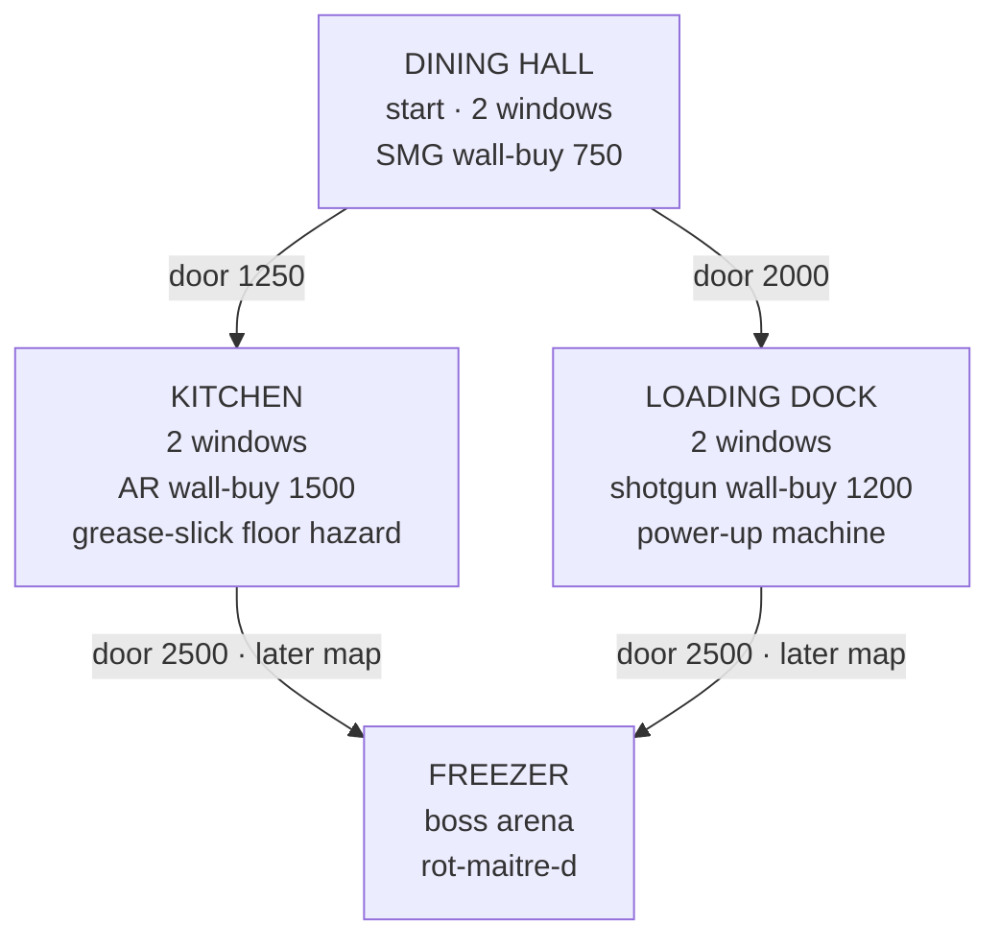
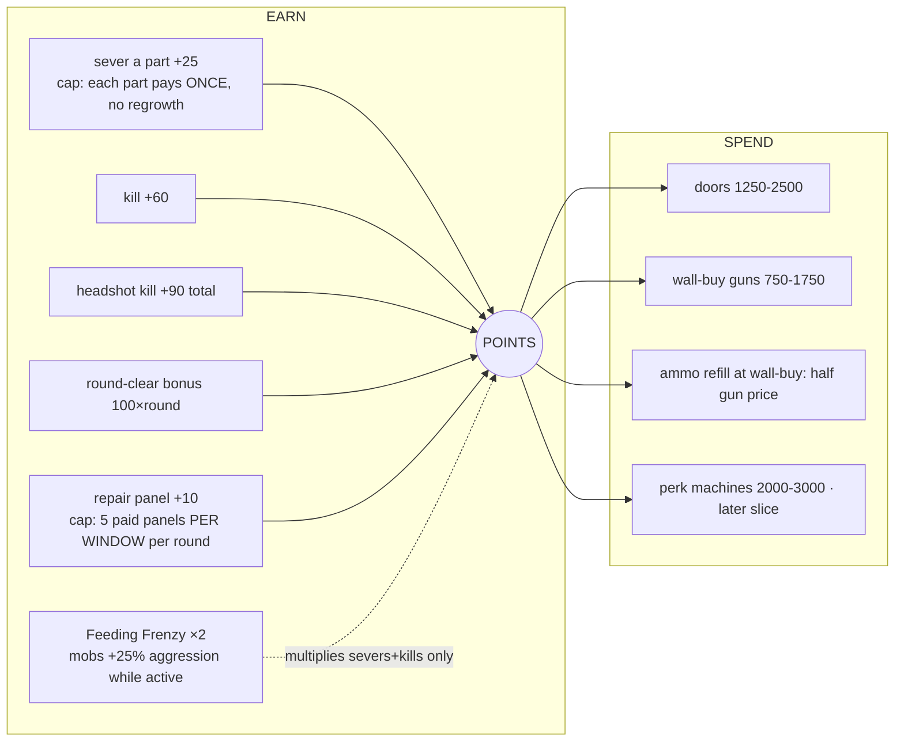
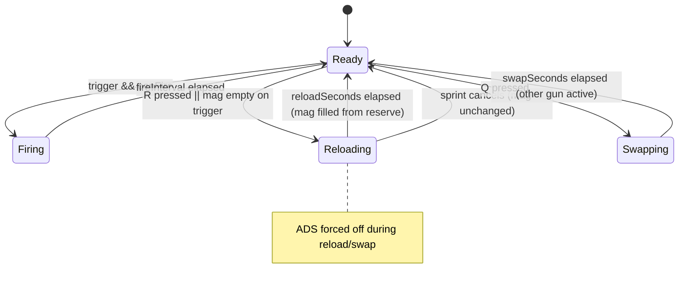
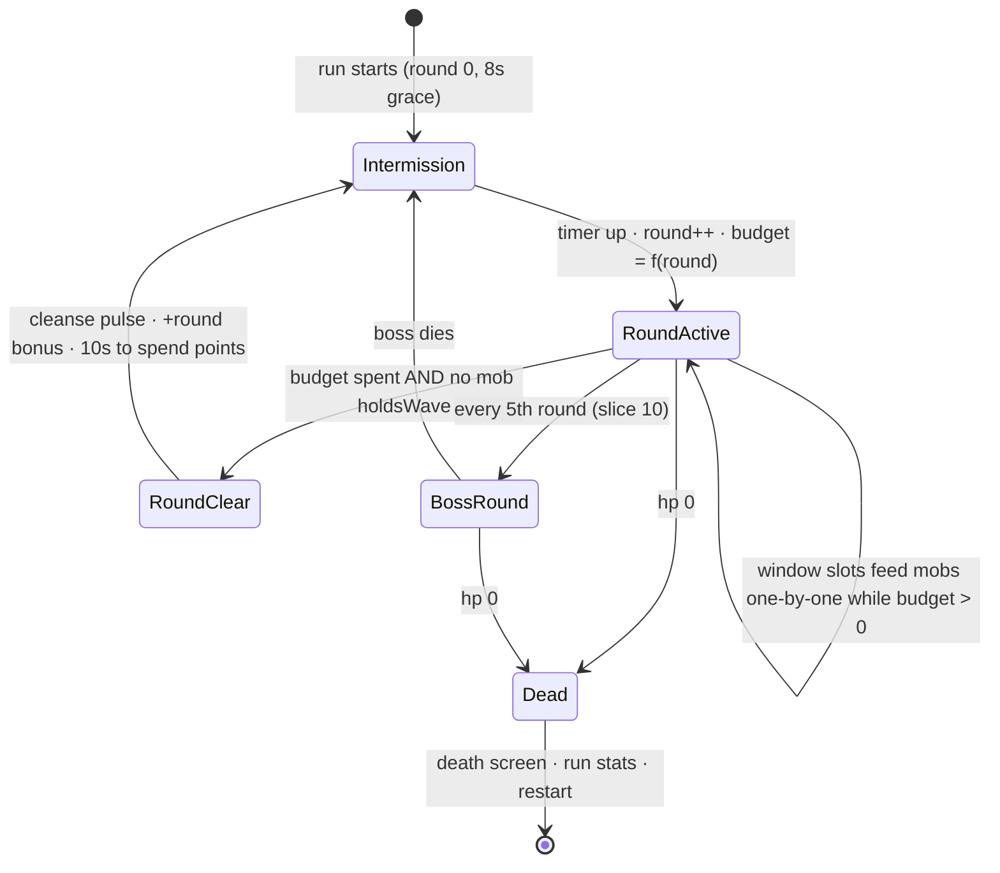

# AFTERTASTE — Beyond Zombies Master Blueprint

**Date:** 2026-09-02 · **Author:** Fable 5 · **Status:** **v2 — revised after GLM 5.3 + GLM Flash hostile review (both REVISE)**; disposition of all 49 findings in §13. Build-ready.
**Owner's brief (Sean, playtest 4):** *"I'm completely bored of these Tetris enemies. I want the real ones — the flies, the kissing bugs, the roaches, the zombies as people. This is supposed to be Call of Duty Zombies: rooms where the mobs come in one by one and get points. There's no point system, no power-ups, no different guns. Base it off real guns first — assault rifles, LMGs, SMGs, 9-millimeters — then add our own creative guns later. We're gonna need power-ups. We're gonna need bosses. We already have all this decided. Make it better than CoD Zombies."*

---

## 0. What is true right now (so the plan stands on ground, not memory)

| Layer | State | Evidence |
|---|---|---|
| FPS core | SHIPPED — mouse-look, hitscan, tracers, recoil patterns, capped spread, ADS, sprint/jump, F-punch | 127 unit + 23 browser tests green, commit `e94bae199` |
| Weapons | Data table EXISTS (`weapons.js`) but holds ONE gun, no ammo, no reload, no switching | `src/combat/weapons.js` |
| Dismemberment | SHIPPED for fryling-v2 (head pops, parts sever, gibs) | sever.spec.js |
| Enemies | 4 primitive blockouts (the "Tetris blocks" Sean is done with) + 1 parted fryling | `src/enemies/roster.js` |
| World | Infinite textured plane, ring-spawns around the player — **no rooms, no windows** | `src/world/Ground.jsx`, `systems/waves.js` |
| Economy | NONE — kills count, but buy nothing | `store.js` has `kills` only |
| Power-ups | NONE | — |
| Bosses | NONE (archetype designed in the 08-25 blueprint: banquet ringmaster / rot-maître-d′, trademark search required before art) | 08-25 blueprint §2 |
| Cast designs | ALREADY WRITTEN — parasite family (kissing bug, bedbug, leech, mosquito, flea, tick, assassin bug, husk-wearing decay), food-court cast (crumb-roach, pizza-husk, rind-bulwark, glaze-decoy, rot-maître-d′) | `ox-parasite-expansion-2026-08-26.md`, roster-v2 contract |

**The gap in one sentence:** we built a great GUN and a great DEATH, and no GAME around them. This blueprint is the game.

---

## 1. The pillars (what "better than CoD Zombies" means, concretely)

CoD Zombies' loop is: survive rounds → earn points per hit/kill → spend points on doors, guns, perks → push deeper → die to your own greed. We keep that skeleton because it is the best horde loop ever designed. We beat it on FIVE fronts it cannot follow us to:

1. **Dismemberment IS the economy — sever-native income.** (Hardened in v2 per GLM #11/#20 + Flash #10.) There are NO per-body-hit points at all — CoD's most-imitated tell is deleted. Income = severs + kills + round bonuses, nothing else. Precision is VISIBLE (the head pops, the arm flies) and it is the ONLY way to out-earn plain kills. This one rule simultaneously kills the window-farm exploit, breaks the strongest structural resemblance to CoD's award table, and makes pillar 1 a mechanic instead of a bonus number.
2. **The enemies are an ecosystem, not a texture-swap horde.** Parasites drain and flee; huskweavers wear their kills; roaches flood the cracks; the Regulars (zombified diners) shamble. Each row has counterplay, not just hp. CoD's zombies differ by speed; ours differ by VERB.
3. **Contamination vs. cleansing — a tug-of-war STATE, not a shader.** (Rebuilt in v2 per GLM #22 + Flash #19 — v1's version was marketing.) Every room has a cleanse meter. Holding its windows intact fills it; a breached window drains it. A CLEANSED room fights with you: panels there rebuild one step on their own each intermission and repairs are faster. A room that stays breached RE-CONTAMINATES — mobs from it tear faster. The map is a front line that moves both ways, and the player decides where to spend presence. CoD's maps never push back. (Flash's freed-Regulars-fight-beside-you idea is canon-true and STRONG — logged as the S13 candidate, after bosses, because ally AI is its own system.)
4. **Guns are learnable data.** Real-gun-grammar recoil patterns per weapon (already shipped) mean gun identity is in your hands, not the skin. Creative guns later are new ROWS, not new systems.
5. **Readable one-by-one pressure.** Windows meter the horde into a stream you can watch, prioritize, and fail to hold. The current spawn ring teleports pressure in from anywhere; windows make pressure a PLACE.

**IP separation (hard law):** structure is uncopyrightable; expression is not. NO CoD names (no "Juggernog", no "Mystery Box", no "Pack-a-Punch"), no CoD sounds, no round-change violin sting, no chalk-outline wall-buys, no clown/red-yellow trade dress on the boss. Our names come from the food-court fiction. Real gun MODELS are also protected trade dress in some cases — we use real gun CLASSES and behaviors (a 9mm sidearm, an SMG, an AR, an LMG, a pump shotgun) with original names and silhouettes.

**Health language (C7, still law):** debuffs name the environment, never the body. No fat-shaming reads. Zombified diners are victims of the contamination, not caricatures — they are what the champion is SAVING, and the fiction says cleansed rooms release them (they dissolve into light, not gore piles).

---

## 2. The Room System — the map is a graph of purchasable spaces

### 2.1 First map: "The Food Court" (three rooms + a hub, expandable)

```
                    N
   ┌──────────────[W3]──────────────┐
   │                                │
   │   ROOM B: THE KITCHEN          │
   │   (door B: 1250 pts)      [W4] │
   │                                │
   ├───────[DOOR B]─────────────────┤
   │                                │
[W1]   ROOM A: THE DINING HALL      │
   │   (start room)            [W2] │
   │   · counter (cover)            │
   │   · wall-buy: SMG (750)        │
   │                                │
   ├───────[DOOR C]─────────────────┤
   │   (door C: 2000 pts)           │
   │   ROOM C: THE LOADING DOCK     │
[W5]   · wall-buy: shotgun (1200)   │
   │   · power-up machine       [W6]│
   └────────────────────────────────┘

 [Wn] = window (barricade, 5 panels, mobs enter one by one)
 DOOR = points-locked; opening extends the play space AND the spawn set
```

- **Rooms are data** (like everything else): `rooms.js` rows carry bounds, window positions, door links + costs, wall-buys, and which cast spawns there. Adding a map is adding rows.
- **Windows** are the only mob entrance in rooms (bosses excepted). Each has 5 barricade panels; a mob at the window tears one panel per beat, then climbs through. The player repairs panels for points (capped per round, CoD's own anti-farm rule — the cap is ours to tune).
- **Doors** open with points, permanently for the run. Opening a door adds its room's windows to the active spawn set — deeper map = more pressure = better buys. The self-balancing greed loop.
- **Walls are REAL now:** movement collides with room bounds (the current infinite plane keeps living underneath as the pre-room "endless yard" mode — it becomes the tutorial/fallback arena, not dead code).

### 2.2 Map graph (mermaid)



### 2.3 The window-climb state machine (v2 — Flash #6/#7 called v1's one sentence a joke; it was)

```mermaid
stateDiagram-v2
    [*] --> Approach: director assigns mob to window
    Approach --> Tearing: reaches window (outside; shootable; severable)
    Tearing --> Tearing: tears 1 panel per beat (beat = f(round, mob.tearRate))
    Tearing --> Climbing: 0 panels remain AND climb slot free
    Climbing --> Inside: climbSeconds elapsed (shootable + severable the whole way)
    Inside --> [*]: joins room navigation
    Tearing --> Dead: killed (next queued mob takes the window; tear count on PANELS persists)
    Climbing --> Dead: killed mid-climb (corpse topples OUTWARD; slot frees; next mob waits one beat)
```



**Contested-window rules (each a test):**
- A window with a mob in `Climbing` is CONTESTED: panels cannot be repaired there ("window contested" prompt); `Tearing` mobs do not block repair — racing the tear IS the game.
- **Board-Up** restores panels on uncontested windows only; a `Climbing` mob finishes its climb (drops never eject — carpentry, not spells).
- Severing a `Climbing` mob's parts works normally; killing it frees the slot. A legless torso follows the crawl rule its roster row declares (or dies at sever if the row says so) — no teleporting.
- **Roaches do not bypass the queue** (Flash #9): their flood is a fast tear beat + short climb, and the director sends them in batches. Flood comes from budget and speed, never from breaking metering.
- **Queue cap** (GLM #17): a window queue holds max 3 waiting mobs; the director delays further spawns (budget waits, arrays don't grow).

### 2.4 Mob navigation + separation (v2 — GLM #15/#16: v1 pretended this was free; it is a slice)

- Each room generates a coarse **flow field** from its `rooms.js` data (walls, counter, doorways): a grid of "step toward player" vectors recomputed at a low cadence (player moved > 1 unit or door opened). Mobs read the field; no per-mob pathfinding.
- **Separation**: mobs apply a cheap local repulsion (existing steer code grows one term) so floods read as a crowd, not a merged blob.
- **Player damage model made explicit**: a mob `Inside` within touch range deals its roster `touchDamage` on its attack cadence (the existing lifecycle ATTACK_WINDUP machinery — already shipped and tested). Tearing mobs harassment-pulse per §3.

### 2.5 Performance budget (v2 — GLM #4/#5: the missing gate that decides everything)

- **The gate:** 40 concurrent mobs at 60fps target / 30fps floor on the dev machine, asserted by a browser perf test (spawn 40, measure p95 frame time) that lands WITH the window-director slice and runs in every suite thereafter.
- **The laws:** mob transforms/gait math live in refs + typed arrays, never in zustand (store keeps identity/hp/state, which change rarely); ONE `useFrame` steps all mobs (already true — waves.js); gibs, slicks, drops, and cleanse VFX come from **one `TransientFxPool`** with hard caps (max 24 gib groups, 8 slicks, 6 drops) that recycles oldest-first — no dispose() churn mid-round.
- **Hitscan broadphase** (GLM #6): shots test only mobs in the shooter's room + adjacent open rooms (rooms.js is the spatial partition — it's free). The shotgun's 8 pellets ride the same filtered list.

---

## 3. Points — one currency, earned by violence, spent on progress



**v2 anti-exploit laws (each is a test):**
- **NO per-body-hit points** (see pillar 1). Plinking pays nothing; only results pay.
- **Each part pays once, parts never regrow** (Flash #11) — an armored mob is a finite bonus, not a farm.
- **Repair cap is per-window in panels, not global points** (GLM #11 / Flash #8 #10): 5 paid panels per window per round; unpaid repairs always allowed. Mobs at a window deal a small harassment damage pulse to a player in that room, so letting them tear for repair income has a cost (Flash #10).
- **Feeding Frenzy multiplies violence income only** (never repairs) and raises mob aggression while active — a non-analog risk/reward power-up (IP finding GLM #20).
- **The affordability gate has a formula, not a vibe** (GLM #13): expected round income `E(R) = Σ over budget(mix(R)) of (kill + expected severs) + roundBonus(R)`. The gate — round-5 cumulative E affords first door OR SMG, not both — is asserted by the economy-simulation test (§9), recomputed whenever numbers change.
- **Economy state fully resets on death** (GLM #24): points, doors, buys, window damage — one reset test walks it all.

---

## 4. Weapons — real-gun grammar first, creative guns as rows later

The `WEAPONS` table (shipped) grows from 1 row to 5, plus the ammo/reload/switch systems that make a roster mean something. Names are working names; **Sean owns final naming.**

| id (working) | class | dmg | RPM | mag | reserve | recoil grammar | spread cap | zoom | role |
|---|---|---|---|---|---|---|---|---|---|
| `sidearm-9` | 9mm pistol | 1 | 270 (semi) | 12 | 60 | small pop, fast reset | tight | 60 | STARTING gun — accurate, honest, weak |
| `sweeper-smg` | SMG | 1 | 750 | 30 | 150 | fast climb, wide drift | wide | 62 | close-range hose, cheap wall-buy |
| `line-rifle` | AR (exists as `fry-rifle` stats) | 2 | 400 | 24 | 120 | strong first kicks easing off, right drift | medium | 55 | the all-rounder |
| `dock-pump` | pump shotgun | 1×8 pellets | 66 | 6 | 36 | single heavy lunge | per-pellet cone | 65 | one-window king; severs limbs in bunches |
| `belt-anchor` | LMG | 2 | 545 | 60 | 180 | slow heavy figure-8 | blooms hard, recovers slow | 58 | held-ground monster, slowest ADS + slower walk |

**New mechanics this table requires (each is its own slice-tested system):**
- **Ammo:** `mag` + `reserve` per carried gun. Firing on empty = dry click + auto-reload. `R` reloads (cancellable by sprint). HUD shows `mag / reserve`.
- **Two-gun carry:** you hold 2; wall-buying a 3rd swaps your CURRENT gun. `Q` or wheel swaps. (CoD's own rule; it's correct — the choice of which two IS the build.)
- **Wall-buys:** proximity + `E` + points. Buying again refills reserve at half price.
- **Shotgun = multi-pellet hitscan:** one trigger pull rolls N=8 rays inside the cone; each pellet is a normal hitscan (sever math free of charge). The existing entry-ordered hitscan handles this with a loop, no new collision code.
- **Semi-auto:** `fireMode: 'semi'|'auto'` — semi requires re-click; the trigger system gains one flag.
- **Weapon-swap and reload are STATES** with durations (mermaid below), because "can I shoot right now" must be one function (`canFire(gun, now)`) or the edge cases multiply forever.



---

## 5. Power-ups — dropped by the dead, food-court fictioned

Drops spawn from kills at a tuned low rate (guaranteed-timer fallback so droughts can't happen), glow on the floor, expire in 30s, apply globally for their duration. **Original names from OUR fiction — never CoD's:**

| Working name | Effect | Signature twist |
|---|---|---|
| **Sugar Rush** | 20s: all guns kill in 1 hit less (min 1). **Does NOT pierce armor** — armored parts must still come off first (Flash #11) | screen edges frost with crystalline sparkle, not red |
| **Feeding Frenzy** | 30s: sever+kill points ×2, **mobs +25% speed/tear rate while active** | risk-priced greed — non-analog by design (v2, GLM #20) |
| **Deep Clean** | instant: every NON-BOSS mob alive dissolves in light; pays a **flat 300 bounty** regardless of count (GLM #14). **Bosses lose 10% max hp instead** (Flash #13) | it CLEANSES — each death sparkles the floor clean |
| **Full Pantry** | instant: all mags + reserves refilled | center flash + audio sting (instants get big feedback — Flash #17) |
| **Board-Up** | instant: all panels on UNCONTESTED windows restored (§2.3) | panels rebuild as light; the room's cleanse meter jumps |

**Interaction rules table (v2 — Flash #16/#18; each row is a test):**
- Stacking: Sugar Rush × Feeding Frenzy is the intended jackpot (×2 on 1-less-hit kills) — allowed, tuned by drop suppression.
- **Drop suppression:** while any timed power-up is active, no further drops spawn (the guarantee timer pauses). A Sugar Rush can never drop a Sugar Rush.
- **Floor cap:** max 2 uncollected drops; a 3rd converts to +50 points where it would have landed (no drop confetti).
- Sugar Rush × shotgun deleting a whole batch is the power fantasy working — allowed; income stays sane because severs pay once and Frenzy suppression gates the chain.

A later slice adds **perk machines** (permanent-for-run buys: faster reload, faster ADS, +hp, faster repair) — designed then, because machines only matter once death is expensive.

---

## 6. The REAL cast — killing the Tetris blocks

This is the arc Sean has now asked for twice. It ships in TWO lanes so visible change arrives immediately and keeps compounding:

**Lane 1 — sculpted blockouts (days, not weeks).** The v2 Blender pipeline (swan_pipe_stages) already splits parts, binds bones, and emits verified hit shapes. It gets per-creature RECIPES: multi-box silhouettes with bevels, stances, and proportion language — a roach is LOW and WIDE with a head wedge; a kissing bug is a teardrop with a proboscis spike; a Regular (zombified diner) is a biped with hanging arms. Not final art — but unmistakably CREATURES, not Tetris. Every creature keeps the parts contract (head/body minimum; limbs as the recipes mature) so dismemberment works on the whole cast from day one.

**Lane 2 — per-type gait identity (same slice).** A cast reads as alive through MOVEMENT more than mesh: roaches skitter in bursts with direction jitter; kissing bugs creep slow until close then LUNGE (their designed `strike_probe`); Regulars shamble with a lean; flies bob on a sine. Gaits are data on the roster row (`gait: {type, params}`) driving position/tilt in Enemies.jsx — no animation files needed for v1.

**The build order (each = roster row + recipe + gait + spec test):**

**v2 verb dedupe (Flash #14 — several v1 verbs were one verb wearing two names):** the Kitchen's standalone grease-slick floor hazard is DELETED — the grease-fly's death slick is the game's one slick system (rooms can pre-seed slicks by declaring fly nests, not a second mechanic). Slick rules made explicit (Flash #5): one directional impulse on sprint-entry, 2s slip immunity after, no slip while walking or ADS. The kissing bug's fever is a VISION debuff, the slick is a MOVEMENT hazard — kept distinct because their counterplay differs (don't get touched vs. watch the floor). The bulwark's shelter is a **visible shield cone** (tinted translucent arc) so its protection reads on screen. The roach's distinctness is speed+count via budget (that IS the verb: flood pressure), stated honestly.

| # | Creature | Source design | Verb that makes it distinct |
|---|---|---|---|
| 1 | **The Regular** (zombified diner — "zombies as people") | new; C7 rules apply | the shambling baseline at windows; the wave's body |
| 2 | **Crumb-roach** | roster-v2 contract | fast tear + fast climb + cheap budget cost = flood pressure; dies to 1 hit |
| 3 | **Kissing bug** | `parasite.kissingbug` | creeps at the edge of vision, LUNGES; hits apply a 3s vision-dim "fever" pulse |
| 4 | **Grease-fly** (upgrade existing) | roster | death leaves the game's one slick hazard (rules above) |
| 5 | **Pizza-husk** | roster-v2 contract | armored parts must be shot OFF before body damage lands; each part pays once, never regrows |
| 6 | **Rind-bulwark** | roster-v2 contract | slow shield-wall; VISIBLE shelter cone protects mobs behind it |
| 7 | **Rot-maître-d′** (BOSS) | 08-25 blueprint §2 | final slices; trademark search FIRST (its own pre-slice); no clown, no red/yellow |

**Gait/hitbox coupling law (Flash #15):** gait jitter amplitude is bounded by the part-shape envelope on the roster row, and the sever spec tests fire at jittering targets — a dodge that breaks aim truth is a bug, not personality.

Fryling, drip-cyst, patty-larva get recipe re-sculpts in the same pass. **The parasite expansion doc's full family (bedbug, leech, mosquito, tick, huskweaver…) is the post-blueprint content well — rows waiting.**

---

## 7. Round flow — one state machine owns the night



- **Budget, not count:** each round has a spawn budget (mob costs: Regular 1, roach 0.4, kissing bug 2…) so composition can shift by round without new code. The wave director stays ONE machine (HY3's rule: never two counters) — **and the old ring-spawn director dies when this lands** (GLM #19: two directors is two counters; the pre-room "endless yard" is retired, not maintained).
- **Round duration is a FORMULA, not a hope** (GLM #12): per-window throughput = 1 mob per `(panels·tearBeat + climbSeconds)`; expected round length = `budget / (activeWindows × throughput)`, targeted at 60–150s and tuned via `tearBeat(round)`. The tear beat is the difficulty dial.
- **Pressure scales with doors held closed** (Flash #12): budget = `f(round, activeWindows)` — round 15 on the two starting windows is lethal by construction; turtling is a strategy with a clock, not a cheese.
- **RoundClear has a grace path** (GLM #12): budget spent AND no mob `holdsWave`, OR budget spent and the last queued mob has waited > 12s (it despawns, budget forgiven) — a lone climber can never hold the night hostage.
- **Intermission is a SOFT beat** (Flash #2): base 10s, timer pauses while the player stands in any buy zone, and a keypress starts the next round early. Shopping is never a panic.
- **First-round teach beats** (Flash #1): round 1's grace is 20s; first dry-click prompts "R — reload"; first tear prompts "E — repair"; prompts never repeat after first use.

---

## 8. HUD (wireframe — the current HUD grows four organs)

```
┌────────────────────────────────────────────────────────────┐
│ ROUND 7                                    ⚡ Sugar Rush 12s │
│                                                            │
│                                                            │
│                          +                                 │
│                     (cone crosshair)                       │
│                                                            │
│  [!] window NE breached                                    │
│                                                            │
│ ♥♥♥♥♡          POINTS 4,320         LINE RIFLE   [Q] SMG   │
│ hp                                   18/96   R to reload   │
└────────────────────────────────────────────────────────────┘
   · buy prompt (contextual, center-low): "E — open KITCHEN (1250)"
   · hitmarker ✕ (exists) · damage-direction pip (R8, exists in backlog)
   · power-up timers stack top-right; icon + label + shape, never color alone
```

**v2 HUD laws (Flash #3/#4):**
- **Breach markers are world-anchored**: edge-of-screen arrows pointing at the actual window + a highlight on it — never compass words. Multiple breaches stack as multiple arrows.
- **Reload progress is a thin bar under the crosshair** (a 1.6s state with no readout is a mystery, not tension). Sprint-cancel flashes the bar red + a click sound.
- Room line in the bar: `DINING HALL · 2/2 windows held` (feeds the cleanse tug-of-war readout later).
- **E has a priority stack**: contested/torn panel in reach > door > wall-buy > refill; wall-buys require a 0.3s hold whenever any panel within 3m is torn — no buying an SMG while trying to board a window.

---

## 9. Test map (failing-first, per slice — the contract for every system above)

| System | Unit tests (node) | Browser tests (playwright) |
|---|---|---|
| Points | award table relationships; sever>hit; multiplier stacking; spend rejects insufficient | kill pays; HUD points climb; door opens and STAYS open |
| Ammo/reload | mag drain; dry-fire; reload math from partial mag; reserve floors at 0; cancel keeps mag | R reloads (HUD counts); empty gun auto-reloads; sprint cancels |
| Two-gun carry | swap states; canFire false while swapping/reloading; wall-buy replaces current gun only | Q swaps (HUD name flips); buy at wall with points; refill at half price |
| Shotgun | N pellets all inside cone; per-pellet sever math; one trigger = one ammo | one shot pops multiple parts on adjacent mob |
| Rooms/windows | point-in-room collision; window slot admits 1; panel tear cadence; repair cap/round | player cannot walk through walls; mob climbs only after 5 panels; E repairs |
| Doors | cost gate; opening extends spawn set; permanent for run | buy door in browser; new room's windows go live |
| Power-ups | each effect applies + expires; drop rate bounds; guarantee timer | drop visible; Sugar Rush kills faster; timers render |
| Cast/gaits | roster schema (verbs present); gait params bounded; budget composition per round | each creature type visibly present by round N; roach flood count; kissing-bug lunge distance |
| Rounds | state machine transitions; budget math; boss every 5th | intermission shows bonus; round survives full clear cycle 2× |

Instrument-validation law continues: every new browser claim gets a sabotage check before it counts as proof.

**v2 additions (the reviews' test-map findings, all accepted):**
- **Perf gate** (GLM #23): 40-mob p95 frame-time browser test, lands with S6b, runs forever after.
- **Death/restart reset walk** (GLM #24): die with points+doors+damaged windows+mid-reload → restart → every system at initial state, one test.
- **Behavior assertions, not presence** (GLM #25): time-to-breach at round N within formula bounds; window-throughput timing; roach batch actually reaches the player position.
- **Economy simulation** (GLM #26): headless 8-round auto-player asserts cumulative points inside the §3 formula's envelope — the exploit canary.
- **Mid-round door seam** (GLM #27): opening a door mid-round extends spawns without resetting the live round's budget/queues.
- **Climb-machine transitions** (Flash #6): every §2.3 edge — kill-mid-climb, Board-Up-while-contested, repair-while-tearing — is its own test.

---

## 10. Slice order (zero-decision; each shippable; Sean playtests at every ★)

**v2 reorder — the CAST moved to the front.** Both reviewers said it (Flash #20: "S7 should be S2. Period."; GLM #2), and it is Sean's actual ask, stated twice. Creatures land on the current open yard immediately; rooms follow. v1's coupling argument (roach floods read best through windows) is true but does not outrank the owner's boredom. Both reviewers also said v1's slices lied about their size (GLM #7/#8/#9) — the v2 list is honest.

| # | Slice | Contents | ★ |
|---|---|---|---|
| S1 | **Ammo + reload + HUD** ✅ SHIPPED with this revision | mag/reserve/R/dry-fire/auto-reload/sprint-cancel | |
| S2 | **CAST wave 1 — The Regular + crumb-roach** | 2 recipes + 2 gaits through the v2 pipeline, parts contract intact, on the open yard | ★★ (Sean's #1 ask, visible immediately) |
| S3 | **CAST wave 2 — kissing bug + re-sculpt fryling/drip-cyst/grease-fly/patty-larva** | lunge verb + fever pulse; the Tetris blocks die here | ★★ |
| S4 | **Points economy (sever-native)** | awardPoints choke point, HUD points, anti-exploit laws §3 | |
| S5 | **Sidearm + two-gun carry + semi-auto** | `sidearm-9`, Q swap, fireMode | ★ |
| S6a | **Rooms + walls** | rooms.js, wall collision, player containment, room-based hitscan broadphase | |
| S6b | **Windows + climb machine + flow-field nav + TransientFxPool + 40-mob perf gate** | §2.3 + §2.4 + §2.5; ring director dies | |
| S6c | **Round machine + teach beats** | §7 budget/throughput/soft intermission | ★ (the game changes shape) |
| S7 | **Wall-buys + SMG + shotgun (pellets)** | E-priority stack, refill, multi-pellet hitscan | ★ (full economy loop) |
| S8 | **Doors + Kitchen + Loading Dock** | map graph live, spawn-set extension, budget scales with windows | |
| S9 | **LMG + slick system (fly deaths)** | belt-anchor row; the one slick mechanic + its rules | |
| S10 | **Power-up drops** | all 5 + interaction rules table §5 + HUD stacks | ★ |
| S11 | **Cleanse tug-of-war + pizza-husk + rind-bulwark + perk machines** | pillar-3 state; armored/shield verbs | ★ |
| S12a | **Boss pre-slice: trademark search + 2-3 silhouette blockouts** | Sean picks; nothing else builds | |
| S12b | **Boss: rot-maître-d′ + boss rounds** | every 5th; Deep-Clean immunity | ★★ |
| S13 | **candidate: freed Regulars fight beside you** | ally AI; canon-true; only after the boss ships | |

---

## 11. Taste checkpoints (Sean reacts; everything else has a working default)

1. ~~S7 promoted above S4?~~ **RESOLVED in v2: cast is S2/S3** — both reviewers + Sean's stated boredom outrank the coupling argument.
2. **Gun names + creature names** — working names throughout; Sean owns fiction. Batch-rename anytime; ids stay stable via `name` field.
3. **Points numbers** — relationships + formula envelope tested; absolutes tuned at ★ playtests.
4. **The Regulars' look** — zombified diners must read as victims (C7). Concept blockout shown at S2 before the full pass.
5. **Boss silhouette** — S12a delivers 2-3 blockout directions after the trademark search; Sean picks.
6. **"Better than CoD Zombies" needs Sean's axis** (GLM #1): propose — *"better = by playtest 8, a 15-minute run where you chose doors twice and regretted one, and at least one moment only Aftertaste could produce (a sever-chain, a cleansed room pushing back, a slick save)."* Sean confirms or replaces.
7. **9mm deviation flagged** (Flash #21): Sean's words named 9mm first; the design gives it the starter role because starter guns define the first minute. If Sean wants the 9mm to stay viable late (a magnum-class row), say so and it's a row.
8. **Creative guns get creative VERBS, not just stats** (Flash #22): when they arrive, rows may add new fields (projectile arcs, DoT pools, chain-severs) — rows are the chassis, not the ceiling.

## 12. What this blueprint deliberately does NOT do

- No multiplayer, no networking, no saves beyond a local best-round number.
- No Swanverse reward integration yet (souvenir contract from 08-25 blueprint §C4/C8 stands; wired only after the game is fun alone).
- No paid asset generation; the Blender recipe pipeline is the art path (C12: pay for nothing this phase).
- No new collision engine — rooms are AABB walls; the entry-ordered hitscan already handles everything the shotgun and parts need.
- No audio system design here — R5 (synth-retro default) remains the shipped backlog item; round/power-up cues join it. Original sounds only (IP law).

---

## 13. Review disposition (v2) — every finding, answered

Reports: `GLM53-BEYOND-ZOMBIES-HOSTILE-2026-09-02.md` (27 findings, REVISE) · `GLM53FLASH-BEYOND-ZOMBIES-HOSTILE-2026-09-02.md` (22 findings, REVISE). Same lab, so agreement is emphasis, not corroboration — but nearly every accepted finding was independently verifiable against the v1 text.

**ACCEPTED and folded in (42):** GLM #1 (better-than axis → checkpoint 6), #2 (cast-count expectation → shown at next touchpoint), #4/#5/#6 (perf budget, FX pool, broadphase → §2.5), #7/#8/#9/#10 (slice splits → §10 v2), #11 (sever farm → sever-native economy §3), #12/#17 (throughput formula, queue cap, grace → §7/§2.3), #13 (economy formula → §3), #14 (Deep Clean flat bounty), #15/#16 (nav/separation/damage model → §2.4), #18 (repair-during-climb → §2.3), #19 (ring director dies), #20 (break structural signatures → no hit points + Feeding Frenzy), #22 (pillar 3 → tug-of-war state), #23–#27 (test map → §9). Flash #1 (teach beats), #2 (soft intermission), #3 (breach arrows/reload bar/room line), #4 (E priority stack), #5 (slick rules), #6/#7 (climb machine), #8 (per-window caps), #9 (roach queue honesty), #10 (harassment pulse + panel caps), #11 (part caps, no regrowth, Sugar-Rush armor rule), #12 (budget scales with windows), #13 (boss Deep-Clean immunity), #14 (verb dedupe), #15 (gait/hitbox law), #16/#17/#18 (interaction rules, instant feedback, floor cap), #19 (cleanse mechanic + S13 allies), #20 (cast to S2), #21 (9mm flag), #22 (creative verbs note).

**MODIFIED (2):** Flash #19's freed-Regulars-as-allies — adopted as S13 candidate, not the pillar-3 mechanic (ally AI is its own system; the tug-of-war delivers the pillar now). GLM #3 (boss grandfathered without brief) — kept, but S12a forces Sean's pick before any boss build, which is the protection the finding wanted.

**REJECTED (2, with reasons):** GLM #21 (recoil-grammar + calibers invite trade-dress drift) — the art checklist line is adopted, but the mechanical claim is wrong: recoil patterns as data are not protectable expression and ours are original sequences. Flash's implication that two-gun carry needed Sean's sign-off — carry limits are what make wall-buys a decision; without them the economy's spend side collapses; flagged here instead.

**What the reviews proved about the process:** v1 converted an owner's mood into fake rigor exactly once (the five pillars answering an unspecified bar — GLM #1) and buried the owner's top ask at slice 7 (Flash #20). Both were visible in the prompt the whole time. The correction is structural: the owner's emotional ask outranks architectural coupling when ordering slices.
