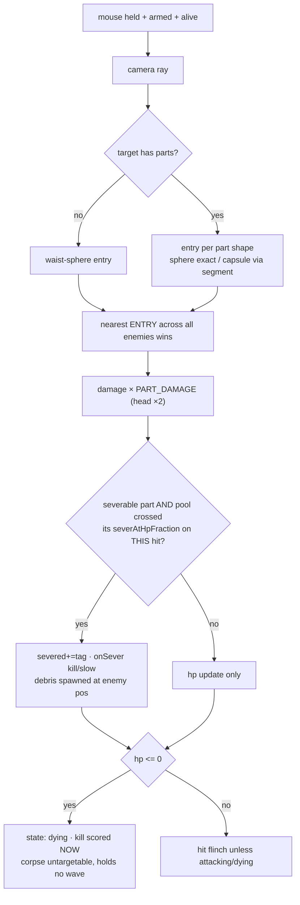
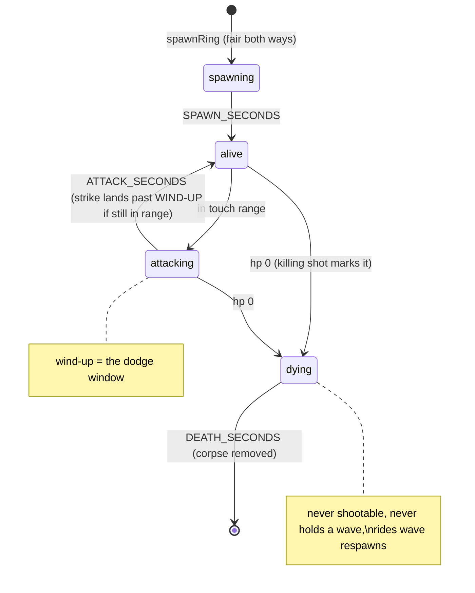

# Fable Hostile Review + Feel Blueprint — after the first human playtest

**Reviewer:** claude-fable-5 (the Final Decider, in the chair — no relay).
**Trigger:** Sean played the build 2026-09-02: *"It looked like Tetris zombies, but it was fun. It
was cool."* Two findings: **the characters didn't show up for him**, and **movement + gunplay are
the priority.** This review treats those two sentences as the highest-grade evidence the project
has ever received — the first data from the only instrument that matters.

---

## 1. The playtest findings, root-caused (not guessed)

### F-A — "Those characters you suggested — I didn't see them"

Three stacked causes, all real, verified in source:

1. **Uniform normalization ERASES silhouette identity** (`Monster.jsx`: `scale = 1 /
   spec.model.height`). Every monster renders EXACTLY 1 unit tall — the 4-unit drip-cyst
   bruiser, the 3-unit fryling, the 2-unit patty-larva: all the same height on screen. The roster
   designed identity through stats; the renderer flattened the one channel a player reads at
   distance — SIZE. This is a hostile finding against my own Slice-8b code: the teaching card
   says "a monster is a row" and the renderer ignores the row's most visible column.
2. **Variety is gated behind survival**: `unlockedTypes(wave)` introduces one face per wave —
   fryling-only wave 1, all four only at wave 4+. A first-session player dies on waves 1-3 and
   meets one, maybe two faces. "Learnable, then relentless" was tuned for the designer who knows
   the roster, not the player who has never seen it.
3. **At FPS eye height + fog, distant monsters are dark silhouettes** — with height flattened
   (cause 1), the only remaining identity channels are colour (weak at distance under fog) and
   gait (all four share the same clip recipes today). "Tetris zombies" is an accurate review of
   voxel blockouts whose identity channels were all muted at once.

### F-B — "Movement and the gunplay are very important"

Current truth, stated plainly: movement is **constant-velocity teleport-feel** (full speed on
keydown, dead stop on keyup, no acceleration, no sprint, no head-bob, no landing weight) and the
gun is **statistically honest but sensorially silent** (no recoil, no muzzle flash, no tracer, no
sound, no crosshair response — the hitmarker is the ONLY feedback a shot produces). The suite
proves the mechanics; nothing in the game says *you fired a weapon*. Both are un-testable by
assertion — this is exactly the category the screenshot-review rule exists for, now upgraded:
**feel changes get a playtest gate, not just a green suite.**

---

## 2. Hostile review of the stack (what GLM could not see)

The GLM round attacked code seams; this pass attacks design, pacing, and blueprint coherence.

| # | Severity | Finding | Verdict |
|---|---|---|---|
| H1 | HIGH | Uniform 1-unit normalization erases roster silhouette identity (F-A cause 1) | fix = R1 |
| H2 | HIGH | Variety pacing assumes survival the player doesn't have yet (F-A cause 2) | fix = R2 |
| H3 | HIGH | Zero weapon feedback channels besides the hitmarker; zero movement dynamics (F-B) | fix = R3/R4 |
| H4 | HIGH | **Sound is still slice 9** — audio is the cheapest, largest feel multiplier and every feedback moment (hit, kill, sever, wave, death) was built as a hook for it. Sequencing it after the roster was defensible; after a live playtest complaining about feel, it is not. | promote = R5 |
| H5 | MED | All four monsters share ONE clip set (same waddle, same lunge). Gait was designed as an identity channel in the roster doc and never diverged in the pipe — `CLIPS` is global, not per-type. | roster-v2 pass |
| H6 | MED | The four roles read identically in COMBAT: every monster walks at you in a straight line. The grease-fly ("area-denial" in its own spec) flies in a beeline like everything else; roles are hp/speed numbers, not behaviours. | post-feel slice |
| H7 | MED | The wave transition is silent — the flock respawns with no beat. A player cannot tell wave 2 started, which also hides the new face it introduces (compounds H2). | fix = R7 |
| H8 | MED | `AIM_RADIUS`/part shapes assume the 1-unit normalization; R1's per-type render heights must scale the hit shapes identically or hitboxes silently detach from visuals — the exact fryling-origin sin. The contract change is designed in §6 before any code. | R1 prerequisite |
| H9 | LOW | Tests: the suite is strong on mechanics, empty on pacing/perf/feel — no test fails when the game is boring. That is intrinsic; the mitigation is the playtest cadence + the perf probe becoming a repeatable script (it is currently a paste-in). | test map §5 |
| H10 | LOW | Blueprint drift: the handoff never mentions D1/D2/D3 progress in its own §6 table beyond links; the game handoff and contract doc are the truth, the older brainstorm blueprint is now 3 slices stale. This doc supersedes the FEEL portions; the contract doc stays canonical for parts. | this doc |

**What survived the hostile pass untouched (deliberately):** the lifecycle table, the entry-ordered
locational hitscan, the asset gate chain (pipe→verify-clips→validate with two-way byte agreement),
the teaching layer's accuracy after the GLM sweep, and the grey-box-first doctrine itself — "it was
fun" with Tetris pieces is that doctrine WORKING.

---

## 3. Architecture — mermaid (current truth, D3 in flight)

```mermaid
graph TD
    subgraph input
        K[useKeyboard] --> P[Player useFrame -4]
        M[mouse look / pointer lock] --> A[aim yaw+pitch]
        T[TriggerControl useFrame -1] -->|"hold, 0.15s, ARM 0.25s"| S
    end
    subgraph frame order — declared, systems/frameOrder.js
        P -->|position| ST[(zustand store)]
        E[Enemies useFrame -3] -->|tick clock+board| ST
        C[FpsRig useFrame -2] -->|camera = pos+aim| R[render]
    end
    subgraph combat
        S[store.shoot] --> HS[hitscan: nearest shape ENTRY across enemies AND parts]
        HS -->|"{target,t,part}"| DMG[PART_DAMAGE xN → damage]
        DMG --> SEV{severable part crossed its hp threshold?}
        SEV -->|yes| GIB[debris array + severed tag + onSever effect]
        SEV -->|no| HP[hp update]
    end
    subgraph lifecycle — ONE capabilities table
        ST --> LC[stepLifecycle per enemy per tick]
        LC --> WV[tickRound: strikes past wind-up, corpses do not hold waves]
    end
    subgraph render
        ST --> MON["Monster (memo): state→clip, severed→hidden part mesh"]
        ST --> DB[Debris: canned ballistic arcs, TTL fade]
        ST --> HUD[Hud: selectors, crosshair, hitmarker]
    end
    subgraph asset chain — every arrow is a gate
        BL[blockout .obj] --> PIPE[swan_pipe v2: split parts, hard-bind, measure shapes]
        PIPE --> VC[verify-clips: does it MOVE, does it CLOSE]
        VC --> VA[validate-asset: bytes↔manifest two-way, 80% coverage floor]
        VA --> MOD[models.js ?url → Monster]
        VA --> PD[partsData.js JSON import → hitscan shapes]
    end
```

## 4. Damage + sever flow chart



## 5. Lifecycle state machine (unchanged by D3 — its main virtue)



## 6. HUD wireframes — current vs. proposed

```
CURRENT                                        PROPOSED (R6/R7/R8 — additive, no relayout)
┌────────────────────────────────────┐         ┌────────────────────────────────────┐
│ HP:3  Wave:1  Kills:0  Remaining:3 │         │ HP ▮▮▮   WAVE 2   ✦12   Left 5     │  icons > words
│                                    │         │        ⟨ WAVE 2 — DRIP-CYST ⟩      │  R7 banner, 2s,
│                                    │         │                                    │  names the new face
│                 +                  │         │              ╲  +  ╱               │  R6 crosshair blooms
│                                    │         │              ╱     ╲               │  while firing
│                                    │         │        ◜damage from left◝          │  R8 direction pip
│                                    │         │                                    │
└────────────────────────────────────┘         └────────────────────────────────────┘
DEATH (current: text + button)                 DEATH v2: slow-mo last 0.5s, tally count-up,
"You were eaten." Wave·kills · [Go again]      best-wave memory (localStorage), same button.
```

## 7. Test map — what is proven vs. unprovable

| Layer | Now | Gap → action |
|---|---|---|
| pure systems (aim, movement, steering, waves, lifecycle, combat incl. locational) | 108 unit tests, red-first discipline | healthy; keep |
| seams (store) | seam tests walk real state sequences on a monotonic clock | healthy |
| browser end-to-end | 15 specs ×3 flake runs (D3 adds sever.spec — proof pending, Sean's server holds the port) | run when port frees; NEVER share 5299 with a live play session |
| perf | one-off wave-cap probe (p50 16.7ms headless) | make it `tests/perf-probe.mjs`, run on demand, log to a ledger |
| FEEL | **unprovable by suite** — the playtest is the instrument | cadence: every feel slice ships → Sean plays ≤24h → findings become the next slice's anchors (this doc is the first instance) |
| asset chain | 53+10+4 selftests + 5/5 gate + clip-coupling vs real GLBs | healthy; roster-v2 re-exports reuse it |

## 8. THE UPGRADE BACKLOG — ranked, sliced, with the why

| R | Size | Upgrade | Why it wins |
|---|---|---|---|
| **R1** | M | **Silhouette identity**: roster gains `renderHeight` (fryling 1.0 · drip-cyst 1.5 · grease-fly 0.8 hovering at 0.4 · patty-larva 0.55 tall × 2.3 long); Monster scales by it; **hit shapes + touch + spawn scale by the SAME factor** (H8: one `renderScale` multiplier through partEntry/aimRadius, or hitboxes detach from visuals) | directly answers F-A; the row's most visible column finally renders |
| **R2** | S | **Wave-1 variety**: waves 1-2 mix two faces (fryling + grease-fly), full cast by wave 3; deterministic cycle kept | the player meets the cast before dying |
| **R3** | M | **Gunfeel pack**: tracer streak (0.05s line, camera→hit point), muzzle flash light-pop, camera recoil kick (pitch +0.7° decay 80ms), crosshair bloom while firing (R6 folded in) | firing finally *reports itself*; all four are ≤20 lines each, GPU-cheap |
| **R4** | M | **Movement feel**: accel/decel curve (0→max in ~120ms, stop in ~80ms), Shift sprint ×1.45 with FOV +6° ease, subtle view-bob while moving (amplitude 0.02, off when `prefers-reduced-motion`) | answers F-B's other half; turns gliding into running |
| **R5** | M | **Sound** (promoted from slice 9): fire, hit-connect, sever POP, wave sting, heartbeat at 1 hp, death — WebAudio synthesized (zero assets, zero licenses) | the cheapest 50% of game feel; every hook already exists |
| **R7** | S | Wave banner naming the incoming new face (compounds R2) | teaches the roster as it arrives |
| **R8** | S | Damage-direction pip on the crosshair ring | deaths become "my fault" — the game-feel doctrine |
| **R9** | S | Death screen v2: tally count-up + best-wave memory (localStorage, try/catch per artifact rules) | one more round, every time |

**Sequencing:** R1+R2 together (one roster/scale slice, contract-aware per H8) → R3 → R4 → R5 →
R7/R8/R9 batch. Each ships with the playtest-gate cadence from §7. D3 (severing) completes its
browser proof first — it is code-complete, unit-proven 108/108, blocked only on the port.

## 9. Decisions Sean owns (defaults proceed unless overridden)

1. **R1 heights** — the four `renderHeight` numbers above are my read of the roster's roles; say
   the word to retune any.
2. **Sprint** — default Shift-to-sprint (stamina-free). If you want stamina, say so; it changes
   the HUD.
3. **Sound palette** — synthesized retro-arcade by default (fits voxels, costs nothing). If you
   want sampled/gritty later, the hooks don't change.
4. The four T1-T4 gore defaults remain live and overridable.

---

## 10. Playtest 2 delta (2026-09-02, "super fun" + six asks) — hostile pass and disposition

Sean's second session confirmed the fantasy lands (severed heads read!) and issued six asks.
Hostile disposition of each against the codebase:

| Ask | Hostile finding | Disposition |
|---|---|---|
| "I wanna see bullets" | The gun's only feedback was the hitmarker (H3, confirmed twice by hands) | **SHIPPED**: tracers hit-or-miss (a hit streak STOPS at the monster — free aim feedback), muzzle-flash light, recoil kick the player fights, crosshair bloom |
| "run" | Constant-velocity glide | **SHIPPED**: accel/decel curve (~0.15s up, ~0.08s stop), Shift-sprint ×1.45 with eased FOV 75→81 |
| "jump" | No vertical axis existed at all | **SHIPPED**: Space, gravity arc peaking ~0.5, no double-jump, reduced air control, bunny-hop on held Space (kept — it feels right). HONEST GAP: jumping does not yet dodge — touch range is 2D; goes with the arena slice |
| "punch" | No melee | **SHIPPED**: right-click, ±60° arc, 1.7 reach, 1 dmg + 1.4 shove, 0.4s cooldown, same corpse rules as bullets. No sever by fist — by design |
| "make these characters / not Tetris" | Blockouts ARE abstract; silhouette heights (R1) helped but identity needs real modeling + per-type gait + palette | **NEXT ARC** — character pass: sculpted blockout v2 per monster through the pipe, per-type clips, the 5 unbuilt roster specs (crumb-roach, pizza-husk, rot-maitre-d, rind-bulwark, glaze-decoy) |
| "more mobs" | 5 specs authored, 0 built | folded into the character arc above |
| view bob | (added with movement, unasked) | respects prefers-reduced-motion; speed-driven, still when still |

Feel-pack test truth: 120 unit / 20 browser ×3; the jump spec's first version held Space and
demanded a landing — bunny-hop is intended, the TEST was wrong, rewritten to tap.
Sound (R5) remains the next feel slice after the character arc unless Sean reorders.
