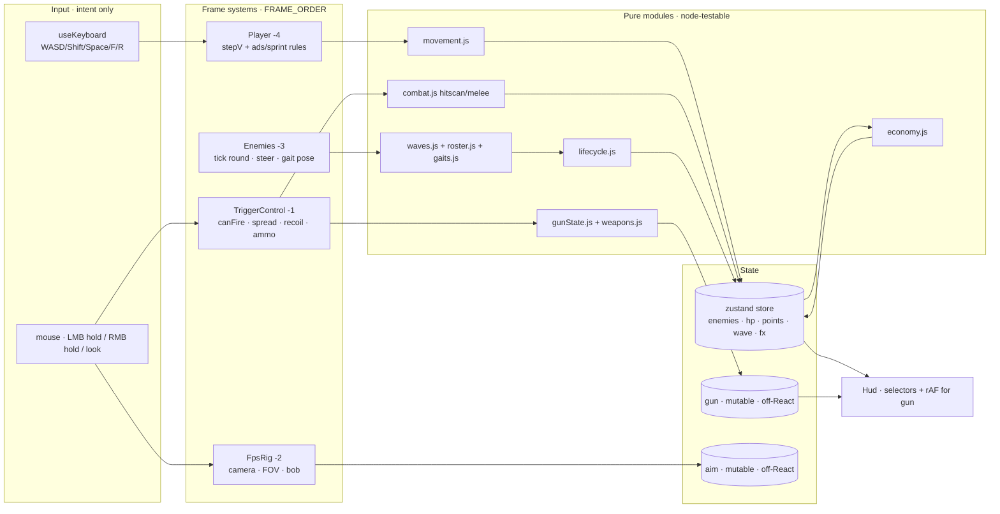
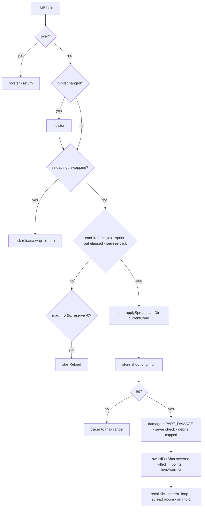
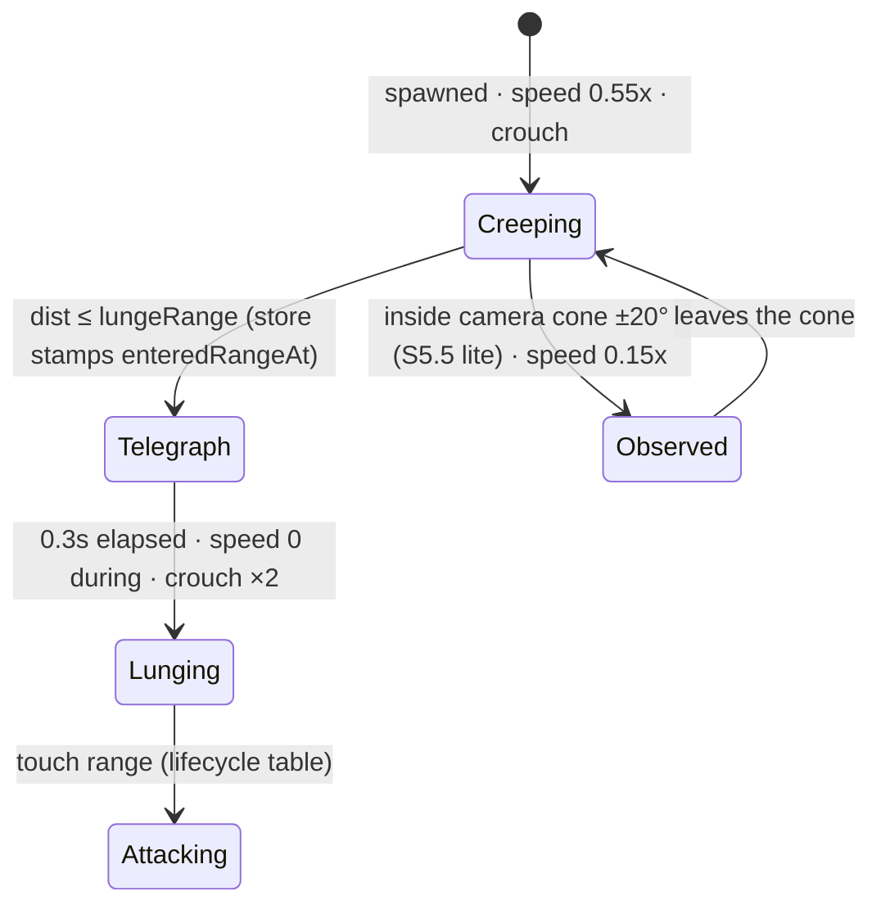

# AFTERTASTE — Fable 5.1 Hostile Review + Build Blueprint v3

**Author:** Fable 5.1 (claude-fable-5-1) · **Date:** 2026-09-02 · **Reviewed target:** worktree `codex/aftertaste-hardening-20260830` @ `78d8fe4fd` (153 unit / 26 browser green at review time)
**Reader:** Opus 5, building alone. **Owner:** Sean. **Fable's role from here:** review-and-blueprint only (seat-relay law) — Fable does not build; Opus builds THIS.

> **How to use this document (Opus, read this first).** §0 is the doctrine — the way Fable decides, so you decide the same way without asking. §1 is what is actually true right now (verified, not remembered). §2 is the hostile review of the shipped work: every finding has evidence, a fix, and the test that proves the fix. §3 is what the 5.0 plan missed. §4 is the architecture. §5 is the slice list — **start at S4.5 and do not skip it**; each slice is zero-decision: files, contract, acceptance tests, done-when. §6-§8 are the wireframes, flowcharts, and test map. §9 is what Sean decides. The v2 master blueprint remains canon for room/economy/cast DESIGN; when this doc and v2 disagree on BUILD ORDER or a CONTRACT, this doc wins.

---

## 0. Decision doctrine — how Fable decides (so Opus decides identically)

These are not preferences. Each one was paid for tonight with a real defect.

| # | Rule | Paid for by |
|---|---|---|
| D1 | **Data before code.** A creature, gun, room, power-up, or hazard is a ROW. Write code only when a genuinely new VERB exists (a gait that reads distance, a part that regrows). | The whole cast shipped as rows; the one verb that needed code (creep→lunge) got exactly one branch. |
| D2 | **Every number has a law test asserting a RELATIONSHIP; absolutes are tuned at ★ playtests, never in a test.** | The affordability gate caught 4475-vs-2000 before a point hit the HUD; the skitter averaging test caught a 22% stealth nerf. |
| D3 | **Two rates on one number → multiply them out at the shared choke point BEFORE believing the feature.** | Three times tonight: spread recovery inside a burst; recovery delay < fire interval; sever-points × window metering. |
| D4 | **Instrument-validate every new browser claim once** — cut the code, confirm the test goes red, restore. A negative control that did not apply is a no-op, not a result: the sabotage script must exit non-zero when it changed nothing. | The holster test "passed" under a sabotage that never applied. |
| D5 | **A pass count is not a green suite. Read the failure line.** | "25 passed" hid a 26th failing test. |
| D6 | **Save the failure artifact BEFORE re-running.** A re-run deletes the evidence. | The spread flake's cause was lost once, then convicted the second time from a saved artifact. |
| D7 | **Fix the geometry, never the gate.** If a validator refuses an asset, the asset is wrong. | Kissing bug LOD2 at 33% vs a 25% ceiling → rebuilt with 6 deliberate boxes; validator untouched. |
| D8 | **The owner's stated ask outranks architectural coupling in slice order.** | Cast at S7 "because gaits couple to windows" was true and wrong; both GLM seats said so. |
| D9 | **300-line cap: extract by RESPONSIBILITY, not by line count.** | App.jsx is 351 (F3). |
| D10 | **Names are working names; the fiction is Sean's.** Never invent lore; leave a `name` field and move on. | Standing. |
| D11 | **Poll targets must be inter-frame-stable states.** A state that exists for zero frames cannot be waited for. | `mag === full` while the trigger is held. |
| D12 | **Report goes LAST, after every tool call, opening with the rendered ORIENT block.** Ending a turn on a tool call shows Sean nothing. | Three angry messages in one night. |
| D13 | **Ship in ★ playtest-sized slices; Sean's hands are the gate, not the suite.** A suite cannot fail because the game is boring. | The Tetris feedback arrived from play, never from a test. |
| D14 | **When the design doc says a thing is visible/telegraphed/curable, a label is not enough — it needs TEETH the player feels.** | The fever shipped as a HUD word (F10). |

---

## 1. What is true right now (verified from the tree, not memory)

| Layer | State | Evidence |
|---|---|---|
| FPS feel | Mouse-look, hitscan, tracers, deterministic recoil patterns, capped spread + visible cone, hold-RMB ADS (FOV+sens), sprint/jump/bob, F-punch | `App.jsx`, `gunState.js`, feel.spec 9 tests |
| S1 ammo | mag/reserve, R reload as a STATE, dry-click auto-reload, sprint-cancel, death refill, live HUD | `gunState.js` L20-60, gun.test 13 |
| S2/S3 cast | **7 faces, ALL parted + severable, each with its own gait**: regular (shamble), crumb-roach (skitter), kissing-bug (creep→lunge, fever), fryling (shamble), drip-cyst (lurch), grease-fly (hover), patty-larva (inch). Enemies face their walk. | `roster.js`, `gaits.js`, validate-asset 11/11 |
| S4 economy | sever-native points (8/20/35×wave), ONE choke point, HUD + death screen, affordability gate test | `economy.js`, store L146/L248 |
| World | Infinite plane, ring spawns — **no rooms** | `Ground.jsx`, `waves.js` |
| Nothing yet | second gun, wall-buys, windows, doors, power-ups, bosses, audio, perf gate | — |

Lines: App.jsx **351** (cap 300), store.js 291, everything else under 170.

---

## 2. Hostile review of the shipped work — findings

Severity: CRIT = wrong game; HIGH = wrong feel or a lying test; MED = a gap the next slice trips on; LOW = hygiene.

| # | Sev | Finding (evidence) | Fix | Proof test |
|---|---|---|---|---|
| **F1** | CRIT | **Melee kills pay ZERO points.** `store.melee()` increments `kills` and never calls `awardForShot` (store.js L156-190: no `points`, no `award`). The economy's one choke point has a second door with no cashier. Punches also never sever. | Route melee kills through `awardForShot({killed:true})`; severs stay gun-only (design: precision is paid, fists are survival). | store.test: punch-kill increases `points` by `AWARD.kill`; economy.test: melee never pays a sever. |
| **F2** | HIGH | **Gait lean/lift never reaches the hit shapes.** `Enemies.jsx` L61-66 writes `rotation.x/z` and `position.y` on the wrapper group; `combat.js` offsets part shapes by enemy x/z only. The rendered head of a Regular leaning 0.09 rad at 1.7 units is ~15 cm from its hit sphere. The gait law test (gaits.test) bounds NUMBERS, not displacement — it cannot fail on this. | Apply the pose to an INNER `<group>` inside Monster, and add `poseDisplacement(gait, renderHeight)` to gaits.js returning the worst-case top-of-body offset; the law: `displacement ≤ 0.35 × head part radius × renderScale`. Tune sway/lift down where it fails (regular sway 0.09→0.06). | gaits.test: for every row, `poseDisplacement ≤ 0.35 × headRadius`; sever.spec: headshot on a Regular at full lean still severs (browser). |
| **F3** | HIGH | **App.jsx is 351 lines (cap 300).** Two frame systems + a light + the scene in one file. | Extract `player/FpsRig.jsx`, `combat/TriggerControl.jsx`, `world/SunLight.jsx`. App becomes the scene only (~90 lines). No behaviour change. | Full suites green before/after; `wc -l` ≤ 300 on every file (add to a hygiene test). |
| **F4** | MED | **ADS has no cost and no exclusions.** No walk-speed penalty while aiming; can ADS mid-reload; sprint does not drop ADS (movement.js has no `ads` input; App L109 only swaps FOV). Every shooter Sean named does all three. | `stepV` takes `ads` → speed ×0.6, no sprint while ADS; reload start sets `gun.ads=false`; sprint start sets `gun.ads=false`. | movement.test: ads speed ratio; feel.spec: RMB during reload → `ads` stays false. |
| **F5** | MED | **Transient arrays are unbounded** — `shots`, `debris` grow until TTL drains them; no cap (store.js). At wave 15 with a shotgun (8 tracers/trigger) this is GC churn (GLM #5 already flagged; not yet built). | `TransientFxPool` caps in store: shots ≤ 48, debris ≤ 24, oldest-first eviction. | store.test: 100 shots → `shots.length ≤ 48`. |
| **F6** | MED | **`reset()` does not own the gun.** Holstering lives in TriggerControl's `over` branch; a reset while not `over` (tests, a future restart key) leaves mag/spread/ads stale. | `gunState.holster()` exported; store gains `runId` incremented by `reset()`; the frame loop holsters when it sees a new `runId` (store stays pure). | store/feel: reset mid-burst → gun at base. |
| **F7** | MED | **Recoil pattern tail repeats forever.** `recoilKick` clamps to the last entry (yaw −0.003) so a long burst drifts left indefinitely — not learnable, just a slide. | Patterns declare `{ steps:[…], loop:[from,to] }`; the tail cycles a declared segment. | gun.test: shot 20 ≡ shot 20 mod loop. |
| **F8** | LOW | Hover fly's `yOffset` (0.08) not in its hit shape. | Covered by F2's displacement law. | same |
| **F9** | MED | **The crumb-roach does not flood.** `spawnRing` = one enemy per slot; the "terror is the COUNT" verb is a comment, not a mechanic. | Roster `batch: 3`; spawnRing expands a batched slot into N enemies at ±0.6 offsets, hp/aim per row. | waves.test: wave-2 ring contains 3 roaches per roach slot. |
| **F10** | MED | **The fever has no teeth.** `feverUntil` reaches only Hud.jsx (label). A "visible timer" that changes nothing is a word. | While fevered: reload ×1.25 slower, screen-edge vignette (CSS, no shader), sprint ×0.85. | gun.test: `reloadSeconds` scaled under fever; feel.spec: vignette element present while fevered. |
| **F11** | MED | **No lunge telegraph.** `creep` flips to `lungeMult` the instant distance ≤ range (gaits.js L40). The design doc: freeze-then-strike; the wind-up IS the dodge window. | Gait gains `telegraph: 0.3` — inside range, `speedScale 0` for 0.3s (crouch deepens), then lunge. Needs `enteredRangeAt` on the enemy (store), not in the pure gait. | gaits.test: t<0.3 after entry → speed 0; waves/store: lunge-kill impossible inside the telegraph window. |
| **F12** | LOW | HUD colours are raw hex (`#C6A84B`, `#E8A33D`). The game is standalone Law B, so Rule 6 tokens do not apply — but the death screen already uses the Swan sapphire/ice-wing pair (Law A chrome) on a Law B surface. | Pick one law for the HUD: Law B palette (food-court fiction) — replace the two Swan chrome colours on the death screen. | visual check at ★. |
| **F13** | MED | **No perf gate exists** (GLM #4). Nothing asserts frame time; the cast just tripled its triangles. | Land the 40-mob p95 frame-time spec NOW (S4.5), not at S6b — the baseline is the value. | perf.spec: spawn 40, p95 < 33 ms headed; record headless number as advisory. |
| **F14** | LOW | `PART_MESH_COUNT` seam written every frame (Enemies L75). Harmless; move to the effect. | one-line move. | — |

**What survived the attack (explicitly cleared):** the lifecycle/capabilities table; entry-ordered hitscan incl. renderScale; the sever contract (one pool, threshold, debris outside lifecycle); ammo/reload state machine; recoil determinism; spread cap + per-weapon recovery delay; economy choke point for GUN kills; asset validator independence from the pipe; the mesh-count seam; wave unlock table; Sean's server isolation via `SWAN_PORT`.

---

## 3. Gaps the 5.0 vision missed (Fable 5.1 additions)

| # | Gap | Why it matters | Where it lands |
|---|---|---|---|
| G1 | **The economy is not FELT.** Points change silently in the top bar. | Sever-native income is the signature; if a sever does not produce a "+8" float and a pop, the player never learns the rule. | S5.5: `+N` float at crosshair (CSS keyframe, keyed by `lastAwardAt`), sever pop cue. |
| G2 | **Sprint has no cost.** BF6/OW: sprint-out delay before the first shot (~0.2s). Without it sprint is free and ADS/hip pacing collapses. | Gives sprint a decision. | S5 with F4. |
| G3 | **The game is SILENT.** No audio at all. Round/wave audio is the single most horde-recognisable element; original synth is an IP-separation row. | Sound is half of gunfeel. | S5.5: Web Audio synth — shot (noise burst + pitch drop), sever pop, round chime, fever hum. No asset files. |
| G4 | **The Regular reads as a clone crowd.** One mesh, one tint. "Zombies as people" needs people-ness: a face marker and clothing variance. | Cheapest possible read of "these were diners". | S5.5: 3 palette variants cycled by id hash; 2 dark eye voxels in the blockout (re-run pipe). |
| G5 | **No death recap.** "You were eaten" + score. Cause of death (which face, which wave) + best round teaches the player. | Retention; the R9 backlog item. | S6c with the round machine. |
| G6 | **Best round is not saved.** One `localStorage` number. | Retention for zero cost. | S6c. |
| G7 | **No dev frame-time readout.** Perf regressions are invisible until Sean feels them. | Pairs with F13. | S4.5: `?perf=1` HUD line. |
| G8 | **Shotgun pellets vs sever accounting** is undefined: 8 pellets on one head — one sever or eight? | The economy formula assumes one sever per part. | Contract: a part severs once (first pellet), later pellets do body damage. S7 test. |
| G9 | **Kissing-bug "freezes when observed"** (design doc) — the weeping-angel behaviour is the creature's signature and is not planned anywhere. | The verb that makes it not a slower roach. | S5.5 lite: inside camera FOV cone ±20° → `speedScale 0.15`; full version S11. |
| G10 | **Wave 1 grace/teach beats** are v2 §7 items with no slice owning them before rooms. | First 60 seconds (Flash #1). | S6c. |

---

## 4. Architecture v3

### 4.1 System map



**Law:** everything under `pure` imports nothing from React/three; `state` has two off-React mutables (gun, aim) by design — they change at frame rate and draw no UI directly.

### 4.2 Module map after F3 (the 300-line refactor)

| File | Owns | Lines (target) |
|---|---|---|
| `App.jsx` | Canvas, scene composition, seams | ≤ 90 |
| `player/FpsRig.jsx` | pointer lock, look, camera pose, FOV (sprint/ADS) | ≤ 90 |
| `combat/TriggerControl.jsx` | mouse/F/R intent, the fire frame loop, holster | ≤ 150 |
| `world/SunLight.jsx` | the follow-sun | ≤ 40 |
| `combat/gunState.js` | + `holster()`, `recoverDelay`, pattern loops, fever scaling | ≤ 150 |
| `enemies/gaits.js` | + `poseDisplacement`, telegraph | ≤ 140 |
| `state/store.js` | + FxPool caps, melee award, `enteredRangeAt` | ≤ 300 (extract `state/fx.js` if it crosses) |

### 4.3 Frame-order contract (unchanged, restated because F2 touches it)

Player (−4) publishes position → Enemies (−3) ticks the round with THAT position and writes mesh transforms → FpsRig (−2) reads player + aim → Trigger (−1) fires from the camera. **Gait pose is computed in Enemies and must be applied to the INNER visual group (F2), never the wrapper the hit shapes are anchored to.**

---

## 5. Slices v3 — zero-decision, in this order

Each slice: **Goal · Files · Contract · Tests (unit ⇒ browser) · Instrument check · Done-when.** ★ = Sean playtests before the next slice. Commit per slice with explicit paths (`git commit -- <paths>`), push at batch end (Rule 70). Every slice re-runs: `node --test tests/*.test.mjs`, `SWAN_PORT=5499 npx playwright test` ×3, `npx vite build`, `node scripts/assets/validate-asset.mjs --all` when assets change.

### S4.5 — FIX-PACK (do this first; nothing new until it lands) ★
**Goal:** close F1-F3, F5-F7, F9, F11, F13, F14. **Files:** store.js, gaits.js, Enemies.jsx, Monster.jsx, App.jsx → FpsRig.jsx/TriggerControl.jsx/SunLight.jsx, gunState.js, weapons.js, roster.js, waves.js, tests.
**Contracts:**
- F1: `melee()` → `points += awardForShot({killed:true})` per kill; no sever award.
- F2: `gaitPose` applied to Monster's inner group; new pure `poseDisplacement(gait, renderHeight) → metres`; roster law `≤ 0.35 × head.hitShape.r × renderScale`. Regular sway 0.09→0.06 if the law demands.
- F3: extraction with zero behaviour change (suite is the diff).
- F5: `pushCapped(arr, item, cap)` helper; `SHOT_CAP=48`, `DEBRIS_CAP=24`.
- F6: `holster(g)` in gunState; store gains `runId` incremented by `reset()`; TriggerControl holsters when `runId` changes.
- F7: pattern shape `{ steps, loop:[i,j] }` for fry-rifle: loop [4,7].
- F9: roster `batch` (roach 3); `spawnRing` expands batches at radial offsets ±0.6 keeping the ring radius.
- F11: enemy gains `enteredRangeAt` (store.tick sets when dist ≤ lungeRange for creep rows); `gaitPose` takes `sinceEntered`; telegraph 0.3s at `speedScale 0`, `rotX crouch×2`.
- F13: `tests/perf.spec.js` — spawn 40 via store, run 4s, assert p95 frame delta < 33ms (headed) / record headless.
**Tests:** as listed per finding in §2. **Instrument:** sabotage F1 (remove the award) and F9 (batch 1) and confirm red. **Done-when:** all §2 rows F1-F14 except F4/F10/F12 closed; suites 3× green; App.jsx ≤ 300.

### S5 — SIDEARM + TWO-GUN CARRY + ADS COST ★
**Goal:** the 9mm starter, Q swap, semi-auto, sprint-out delay, ADS rules (F4, G2).
**Files:** weapons.js (+`sidearm-9` row per v2 §4 table), gunState.js (carry: `slots:[a,b]`, `active`, `swapUntil`, `canFire` also false while swapping), TriggerControl.jsx (Q, semi needs fresh click: `clickedThisHold` flag), movement.js (`ads` → ×0.6, no sprint), Hud (slot names).
**Contract:** start with sidearm only; `fry-rifle` (working name) becomes a wall-buy in S7 — until then a dev key `1/2` swaps for testing. Sprint-out: first shot after sprint waits 0.2s. ADS off on reload start and sprint start.
**Tests:** gun.test: swap state timings, semi requires re-click, canFire during swap false; movement.test: ads speed ratio 0.6, sprint blocked; feel.spec: Q flips HUD name; sprint then fire waits. **Instrument:** sabotage semi (allow auto) → red. **Done-when:** two guns carried, all rules above proven.

### S5.5 — FEEL PACK B: hear it, feel the money, meet the people ★★
**Goal:** G1, G3, G4, F10, G9-lite. **Files:** `ui/PointsFloat.jsx`, `audio/synth.js` (Web Audio; `unlockOnFirstClick`), Hud.jsx, gunState.js (fever reload scale), roster.js (regular `variants`), `assets/source/enemy/regular` (eyes) + pipe re-run, gaits.js (observed slow).
**Contract:** `+N` float keyed by `lastAwardAt` (store adds it); sounds: shot, dry-click, sever pop, kill thud, round chime, fever hum — all synthesised, `prefers-reduced-motion` does not mute audio but a `?mute=1` does; fever: reload ×1.25, sprint ×0.85, CSS vignette; Regular: 3 tint variants by `gaitSeed(id) % 3`; observed-slow: enemy inside camera yaw ±20° and < 12 units → `speedScale ×0.15` for creep rows only.
**Tests:** economy/store: `lastAwardAt` set on award; synth unit: node-testable envelope math only (browser: AudioContext created after click, not before — autoplay law); gaits.test: observed slow only for creep; feel.spec: float element appears after a paying kill; vignette during fever. **Done-when:** Sean says the money and the bites are FELT.

### S6a — ROOMS + WALLS
As v2 §2 / §2.5: `rooms.js` rows, AABB wall collision in `stepV`, room-based hitscan broadphase, the Dining Hall only. Ring spawns still active (they die in S6b). **Tests:** movement: cannot cross a wall; combat: hitscan ignores mobs in closed rooms. ★ after S6b.

### S6b — WINDOWS + CLIMB MACHINE + FLOW FIELD + FX POOL + PERF GATE ★
As v2 §2.3/§2.4. Ring director retired. Perf spec from S4.5 becomes gating (p95 < 33ms with 40 mobs in rooms).

### S6c — ROUND MACHINE + TEACH BEATS + DEATH RECAP + BEST ROUND ★
As v2 §7 + G5 + G6 + G10.

### S7 — WALL-BUYS + SMG + SHOTGUN (G8 pellet law) ★
### S8 — DOORS + KITCHEN + LOADING DOCK
### S9 — LMG + SLICK
### S10 — POWER-UPS (v2 §5 interaction table) ★
### S11 — CLEANSE TUG-OF-WAR + PIZZA-HUSK + RIND-BULWARK + PERK MACHINES + kissing-bug full observed-freeze ★
### S12a — BOSS PRE-SLICE (trademark search, 2-3 silhouettes → Sean picks)
### S12b — BOSS + BOSS ROUNDS ★★
### S13 — candidate: freed Regulars fight beside you

**Why this order (so Opus does not re-litigate it):** S4.5 first because a wrong economy door (F1) and lying hit shapes (F2) poison every playtest after them. S5 before rooms because wall-buys (S7) need two-gun carry to be a decision. S5.5 before rooms because sound + felt money are the cheapest feel multipliers and Sean playtests after every ★. Rooms are three honest slices (GLM #7), not one.

---

## 6. Wireframes

### 6.1 HUD v3 (adds points float, fever vignette, weapon slots, reload bar)

```
┌──────────────────────────────────────────────────────────────┐
│ HP ♥♥♥  WAVE 3  KILLS 12  POINTS 486  ⚠ FEVER   [perf 16ms]  │  ← top bar (existing + fever + dev perf)
│                                                              │
│              ░░░ fever vignette (edges only) ░░░             │
│                                                              │
│                         +8                                   │  ← PointsFloat, rises + fades 0.6s
│                          +                                   │  ← crosshair = cone
│                        ▬▬▬▬                                  │  ← reload bar (only while reloading)
│                                                              │
│                                                              │
│   [1] SIDEARM 9 · 8/48        [2] FRY RIFLE · 24/120         │  ← slots; active is bright
│                       R reload · Q swap · F punch            │
└──────────────────────────────────────────────────────────────┘
```

### 6.2 Death recap v2 (S6c)

```
┌──────────────────────────────┐
│        YOU WERE EATEN        │
│   by a Kissing Bug · wave 6  │
│                              │
│   points 2,140 · kills 61    │
│   best round: 8  (new best!) │
│                              │
│        [ GO AGAIN ]  (44px)  │
└──────────────────────────────┘
```

### 6.3 Room + window + buy prompt — unchanged from v2 §2.1/§8; the E-priority stack and world-anchored breach arrows stand.

---

## 7. Flowcharts

### 7.1 One shot, end to end (after S4.5/S5)



### 7.2 Creep → telegraph → lunge (F11)



### 7.3 Round machine, window climb, weapon state, economy — v2 §7, §2.3, §4, §3 stand unchanged.

---

## 8. Test map v3 + instrument laws

| Slice | Unit (node) | Browser (playwright) | Sabotage target |
|---|---|---|---|
| S4.5 | melee award; displacement law; pattern loop; FxPool caps; batch spawn; telegraph timing; holster on runId | headshot-at-full-lean severs; perf p95; reset holsters | remove melee award; batch=1 |
| S5 | swap/semi/sprint-out/ADS speed | Q swap HUD; fire-after-sprint delay; RMB during reload no-op | allow auto on semi |
| S5.5 | award timestamp; fever scaling; observed-slow creep-only; variant hash | float appears; vignette; AudioContext only after click | remove float key |
| S6a-c | see v2 §9 + G5/G6 | — | — |

**Instrument laws (every slice):** D4 sabotage once per new browser claim; D5 read the failure line; D6 copy `test-results/<name>` before any re-run; D11 no zero-frame poll targets; browser suite ×3 consecutive before commit.

---

## 9. What Sean decides (taste checkpoints)

1. **Names** — every gun and creature is a working name. (D10)
2. **"Better than CoD" success axis** — proposed: *by playtest 8, a 15-minute run where you chose doors twice and regretted one, and one moment only Aftertaste could produce.*
3. **9mm role** — starter (proposed) or a late-game magnum row.
4. **Fever teeth** — proposed reload ×1.25 / sprint ×0.85 / vignette; Sean may want it harsher or a cure station (design doc mentions clean-water).
5. **Regular variants** — 3 tints (proposed) vs. more.
6. **Boss silhouette** at S12a.
7. **Audio character** — synth-retro (proposed, R5) vs. sampled later.

---

## 10. Handoff to Opus 5 — first hour

```
cd /c/tmp/sspt-aftertaste-hardening-20260830/packages/aftertaste
node --test tests/*.test.mjs                        # expect 153 pass
SWAN_PORT=5499 npx playwright test --reporter=line  # expect 26 passed, READ the failure line
# Sean's play server stays on :5399 (background task) — never kill it; suites use 5499.
# Start S4.5 with F1 (melee award): write the failing store.test first, then the one-line fix.
# Commit per fix with explicit paths; ORIENT via node scripts/orient.mjs --pid aftertaste-game (main tree);
# report LAST, after every tool call (D12).
```

Fable's closing note to Opus: the game is good already — the shipped part is a real FPS with a real cast and a real economy. What it lacks is not features; it is the ten things in S4.5 that make the existing features TRUE, then sound and felt money, then the room the whole design has been waiting for. Build in that order and Sean's playtests will tell you the rest.
