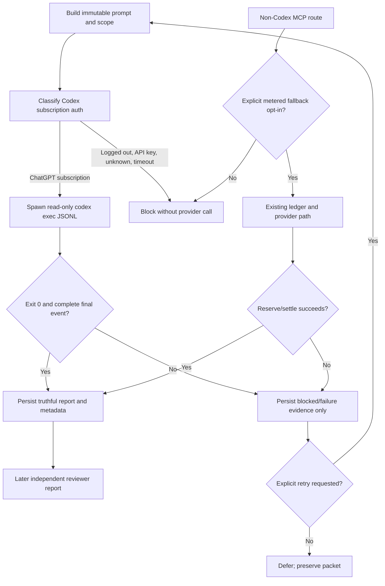
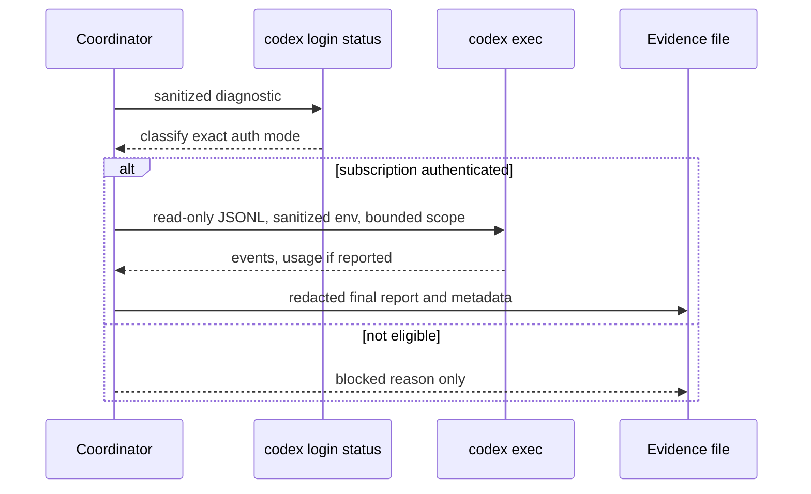

# AI Review Coordinator — Mega Blueprint

Status: IMPLEMENTATION IN PROGRESS
Version: 1.0
Date: 2026-09-12
Owner: Sean / Codex
Canonical packet: this document
Supersedes: none; the user-supplied proposal is preserved at `C:\Users\BigotSmasher\.codex\attachments\c2b750a3-0630-49b3-99a7-af5a477f3d0e\pasted-text.txt` (SHA-256 `0D6A0B1A8637CB215A315489B1D61CB1C6AF092D9A56C33DD0D144EC538A0C87`).

## 1. Requirements

### R1 — Subscription-only provider boundary

The first implementation slice must use the locally authenticated Codex CLI subscription path only. It must not call OpenRouter, an API endpoint, or another metered provider when subscription authentication is absent or ambiguous.

Acceptance: a valid ChatGPT subscription login is classified as `chatgpt_subscription`; logged-out, API-key, unknown, timeout, and failed states are blocked with no provider call.

### R2 — Truthful identity and usage

Every completed consult records transport, billing mode, authentication mode, requested model, served model when reported, and token usage when reported. Unknown values remain `null`/`unknown`; zero is never used as a substitute for unavailable telemetry.

Acceptance: JSONL usage is captured when present and absent usage remains null in the result and evidence markdown.

### R3 — Fail-closed child execution

The child process must run read-only, non-interactively, inside the selected repository root, with API-key environment variables removed. The coordinator must not pass approval bypasses, unrestricted sandbox flags, or shell-interpolated user input.

Acceptance: generated arguments include `codex exec --json --ephemeral --sandbox read-only --ask-for-approval never`; the environment sanitizer removes known provider keys; subprocess failures block.

### R4 — Explicit review scope

Diffs and requested files must have an explicit, auditable scope. Repository-relative file paths are jailed to the repository. Truncation, omitted content, and unsupported untracked content are declared in the prompt/evidence.

Acceptance: malformed ranges and path traversal are rejected; scope metadata names the range/files and omissions.

### R5 — No silent paid fallback

The MCP council must not select its existing OpenRouter path merely because a key is present. Metered fallback is disabled by default and requires an explicit, separately controlled opt-in for non-Codex brains.

Acceptance: default selection returns `none` when only a key exists; only an explicit `allowMeteredFallback` opt-in can return `openrouter`.

### R6 — Preserve current work and contracts

The implementation must be surgical in the shared dirty checkout. It must not rewrite unrelated changes, change production configuration, touch the database, deploy, push, or spend credits.

Acceptance: target-file status is inspected before/after; deterministic tests and syntax checks pass; no provider inference is invoked.

### R7 — Immutable packet identity

Before provider execution, the coordinator must record a write-once packet containing the exact scope, prompt digest, policy, and repository identity. Reports must reference the packet and carry their own content digest.

Acceptance: the same packet write is idempotent, a different same-ID packet is rejected, and report envelopes preserve null usage when telemetry is unavailable.

### R8 — Claude subscription lane

The Claude Code review lane must accept only first-party Claude subscription authentication and run with tools, persistence, custom MCP, and write permissions disabled. It must not fall back to an API key or another provider.

Acceptance: first-party `claude.ai` subscription auth is distinct from logged-out/API auth; the generated command is print-only, stream-JSON, plan-mode, safe-mode, no-session, no-tools, and no-custom-MCP; usage remains null when absent.

### Scope

In scope for S1/S2:

- Shared subscription-runner primitives for Codex auth classification and `codex exec` JSONL execution.
- `scripts/consult-codex.mjs` conversion from OpenRouter-only to subscription-only.
- MCP Codex route conversion and default paid-fallback denial.
- Regression tests for auth, environment, arguments, JSONL parsing, failures, and fallback selection.
- Evidence packet and readiness receipt.
- Write-once packet identity and report-envelope primitives.

Out of scope for the current S1-S3 implementation:

- DeepSeek harness, GLM/Z code harness, Muse, Hermes scheduling, MCP packet/status/report storage, UI, deployment, database migrations, production browser automation, and any paid/API inference.
- A majority-vote council. Astra remains the adjudicator for a later authorized review stage.
- Claiming full multi-provider certification or production readiness.

### Roles and authority

| Role | Responsibility | Authority boundary |
|---|---|---|
| Sean | Product owner and approval authority | Production, spend, provider, and release decisions |
| Codex builder | Implement S1 and preserve evidence | Local repository only; no production/deploy/push |
| Subscription CLI | Provider transport | Read-only child process; truthful output only |
| MCP council | Thin orchestration surface | Must fail closed when provider/auth/policy is unavailable |
| Astra | Later combined hostile review and repair | Not invoked in this slice |
| Claude | Bounded subscription lane | Implemented and tested; no live turn invoked |
| GLM / DeepSeek / Hermes | Later bounded lanes | Not implemented or invoked |

### Assumptions and unresolved decisions

- The local Codex CLI is the only authorized provider transport for S1; `codex login status` is a diagnostic preflight, not a model call.
- The model is not hardcoded as GPT-5.5. A requested model is optional and the served model is only recorded when the CLI reports it.
- The existing OpenRouter ledger remains unchanged in S1; default denial prevents new metered calls.
- The exact later report schema, GLM authentication, and Hermes queue contract remain unresolved and are intentionally deferred.

## 2. Blueprint

### Existing integration points

- `scripts/consult-codex.mjs` currently loads repo env files and calls OpenRouter directly.
- `scripts/mcp/swan-council-lib.mjs` currently chooses CLI then OpenRouter fallback and contains pure selection/prompt helpers.
- `scripts/mcp/swan-council-server.mjs` currently routes Codex/Kimi/Grok/Fable and has a file-backed spend ledger.
- `scripts/mcp/swan-council-lib.test.mjs` contains the existing fallback contract that must be updated.

### S1 component ownership

```text
consult-codex.mjs ─┐
                   ├─> swan-council-subscription.mjs ─> codex login status
MCP Codex route ───┘                                  └> codex exec JSONL

MCP non-Codex routes ─> explicit metered opt-in only ─> existing ledger/OpenRouter
```

`swan-council-subscription.mjs` owns authentication classification, child environment sanitization, safe argument construction, process injection seam, JSONL parsing, and truthful result construction. Callers own prompt construction, scope declaration, and evidence persistence.

### Ordered implementation slices

| Slice | Work | Entry evidence | Exit evidence |
|---|---|---|---|
| S0 | Baseline and packet | Dirty checkout, branch, 20/20 council tests, syntax checks | Packet approved by implementation start |
| S1 | Codex subscription runner and no-fallback guard | S0 | New tests green; consult/MCP code no longer has implicit paid path |
| S2 | Immutable evidence packet and coverage manifest | S1 | Scope, omissions, reports, and receipt are machine-readable |
| S3 | Claude Code subscription runner | S2 | Separate adapter, no credential leakage, independent report |
| S4 | Manual/native GLM and DeepSeek report relay | S2 | Import-only report contract; no API substitution |
| S5 | MCP packet/status/report tools | S2/S3/S4 | Coordination is inspectable, bounded, and idempotent |
| S6 | Hermes broker and queue integration | S5 | Local-only routing, retries/dead letters, operator controls |
| S7 | Measurement and combined hostile review | S1-S6 | Findings yield, overlap, latency, cost/usage, and residual-risk report |

## 3. Wireframes and operational states

UI wireframes are N/A for S1: this is a headless CLI/MCP and evidence-file change, not a user-interface surface. The equivalent terminal state contract is:

| State | Observable output | Allowed side effect |
|---|---|---|
| Ready | Scope and policy are visible before execution | None |
| Authenticated | Subscription mode is explicit | Read-only child process |
| Logged out/API key/unknown | `blocked` reason is explicit | No provider request |
| Running | JSONL is captured privately | Temporary process output only |
| Complete | Final text plus truthful metadata is persisted | Evidence files only |
| Failure/timeout | Stable error code and no success artifact | No retry unless caller explicitly retries |
| Cancel/defer | No report is marked complete | Pending/blocked state only |
| Recovery/rollback | Retry from same immutable input packet | Prior evidence preserved |

Accessibility/responsive behavior is N/A because no visual surface is changed. Shell output remains plain text and machine-readable JSONL is retained for automation.

## 4. Flowchart and Mermaid



Rollback: remove only the S1 files/changes using a reviewed patch or revert of the S1 commit if one is later created; do not reset the shared worktree. Existing evidence remains append-only.

## 5. Contracts and applicable diagrams

### Subscription runner result

```ts
{
  status: 'complete' | 'blocked' | 'failed',
  provider: 'openai-codex',
  billing: 'chatgpt-subscription',
  authMode: 'chatgpt_subscription' | 'logged_out' | 'api_key' | 'unknown',
  transport: 'codex-cli',
  requestedModel: string | null,
  servedModel: string | null,
  inputTokens: number | null,
  outputTokens: number | null,
  text: string,
  errorCode?: string,
  error?: string
}
```

Contract invariants:

- `status === 'complete'` requires a non-empty final agent message, zero exit, and a completed turn event.
- `inputTokens`/`outputTokens` are null when the source did not report them.
- Blocked authentication never invokes `codex exec`.
- Raw auth output, environment values, and secrets are never written to the report.

### Security/trust boundary



Permissions matrix: subscription CLI may read the selected repository and write only the caller's evidence directory; it may not write source files, access production databases, use browser automation, call a metered endpoint, or push/deploy. The MCP server may orchestrate and report but does not gain additional provider authority.

State diagram is represented by the terminal state contract above; an ERD is N/A because S1 adds no database schema or durable relational state. Migration/restore is N/A for S1; the file-backed ledger is not changed.

## 6. Test plan and executable tests

| Test ID | Requirement | Level/action | Expected observable result |
|---|---|---|---|
| T1 | R1 | Unit: exact auth strings | ChatGPT, logged-out, API-key, and unknown classify distinctly |
| T2 | R3 | Unit: environment sanitizer | Known provider keys are absent; unrelated env is preserved |
| T3 | R3 | Unit: argv builder | Read-only, ephemeral, non-interactive args are exact and shell-safe |
| T4 | R2 | Unit: JSONL parser | Final text, served model, usage, and completion are captured truthfully |
| T5 | R1/R3 | Integration seam: injected process | Successful subscription run returns complete without network |
| T6 | R1 | Integration seam: logged-out/API-key/unknown | Run blocks before exec; injected exec is not called |
| T7 | R1/R2 | Failure seam: timeout/nonzero/no-final | Run is blocked/failed; no success result or zero-token claim |
| T8 | R4 | Unit: range/path/scope helpers | Invalid ranges/path traversal reject; omissions are explicit |
| T9 | R5 | Unit: MCP backend selector | Key alone is not enough; explicit opt-in is required |
| T10 | R6 | Regression/syntax | Existing council tests and changed-module syntax checks pass |
| T11 | R7 | Unit: packet identity/write-once/report envelope | Packet is deterministic, idempotent, collision-safe, and preserves hash/null usage |
| T12 | R8 | Unit/integration seam: Claude lane | First-party subscription succeeds; logged-out/API auth blocks; tools and persistence are disabled |

Not run in S1-S3: live model inference, Claude/GLM/DeepSeek interoperability, browser E2E, database concurrency, deployment, performance under provider load, migration/restore, or production rollback. These are deferred with concrete slice ownership rather than represented by mocks.

## 7. Traceability

| Requirement | Acceptance | Artifact/component | Test | Status |
|---|---|---|---|---|
| R1 | Strict subscription auth and no API call | `swan-council-subscription.mjs`, consult, MCP | T1/T5/T6/T7 | S1 |
| R2 | Truthful metadata and null unknown usage | runner parser, consult evidence | T4/T7 | S1 |
| R3 | Sanitized read-only child | runner argv/env/process seam | T2/T3/T5/T7 | S1 |
| R4 | Explicit safe scope | consult scope helpers/prompt | T8 | S1 |
| R5 | No implicit metered fallback | council lib/server | T9/T10 | S1 |
| R6 | Preserve work/no spend | surgical patch and tests | T10 plus git status review | S1 |
| R7 | Immutable packet and report digest | `swan-review-packet.mjs`, consult integration | T11 | S2 |
| R8 | Claude subscription lane | `swan-claude-subscription.mjs`, MCP `claude_review` | T12 | S3 |

Uncovered S1-S3 boundaries: real provider behavior, multi-provider report agreement, GLM/DeepSeek relay, Hermes scheduling, and deployment. These are intentionally not certified.

## 8. Operations, rollout, and rollback

Rollout order: land the runner and tests; run deterministic tests; inspect the diff and target-file status; only then expose the MCP Codex route to a manually authorized subscription harness. Keep metered fallback disabled. Do not run a live consult as part of this build.

Operational signals: auth classification, blocked reason code, child exit code, timeout, JSONL completion, served model, and null-versus-reported token usage. Never log credentials or full raw provider output.

Performance budgets for S1: auth preflight 10 seconds; child execution 600 seconds; no retry by default; evidence write is local and bounded. These are process limits, not provider SLA claims.

Rollback is a reviewed source patch/revert of S1 only. Because the checkout is shared and dirty, no broad reset, clean, checkout, or deletion is authorized.

## 9. Hostile review and decisions

Known hostile findings carried into implementation:

1. Generic `/logged in/` checks can accept `Not logged in`; fixed by exact ordered classification.
2. Loading `.env` before deciding the backend can expose or encourage metered fallback; the subscription path no longer loads it.
3. `HEAD~1..HEAD` can omit current working-tree scope; consult scope becomes explicit and reports omissions.
4. Hardcoded model and zero usage are untruthful; metadata now uses requested/served/null fields.
5. “CLI selected” without an actual CLI runner is a false green path; S1 wires a real injected-process seam and blocks on incomplete execution.
6. Existing non-Codex routes remain potentially metered when explicitly enabled; default policy denies them and keeps the old ledger isolated.

Review decision: S1-S3 are implementation-verified only by deterministic local tests. No GLM, Claude, Astra, OpenRouter, or other inference review is claimed or invoked in this turn. Combined hostile review is the next authorized review gate after the remaining implementation slices are complete.

## 10. Readiness receipt

### Baseline evidence

- Real checkout: `C:\Users\BigotSmasher\Desktop\@Everything\quick-pt\SS-PT`.
- Branch: `wip/comms-notifications-2026-07-05`.
- Shared worktree is materially dirty; unrelated changes are preserved.
- Baseline council unit tests: 20/20 passed before S1.
- Baseline syntax checks passed for the existing Codex/council modules.
- Graphify query was attempted but the existing `graphify-out` has no usable `graph.json`; no graph-derived claim is used.

### Applicability matrix

| Area | S1 disposition |
|---|---|
| Requirements/blueprint | Included |
| Desktop/mobile UI | N/A: headless CLI/MCP |
| Mermaid flow | Included |
| Contracts/security/permissions | Included |
| Unit/integration seam tests | Included |
| Browser E2E | Deferred: no browser surface |
| Database/migration/restore | N/A: no DB change |
| Provider inference | NOT RUN by explicit no-credit boundary |
| Deployment/production | NOT RUN; no authorization |
| External hostile review | NOT RUN; later combined gate |

### Current status

Current status: S1/S2/S3 IMPLEMENTATION VERIFIED by deterministic local tests and syntax checks; no provider inference, external hostile review, deployment, or full multi-provider readiness is claimed. The underlying evidence is recorded in the separate receipt JSON.

### Next authorized slice

S4: add the import-only GLM/DeepSeek report relay against the frozen packet before adding Hermes scheduling or broader MCP coordination.
