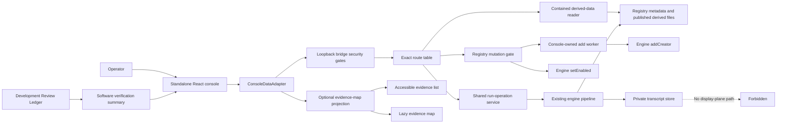
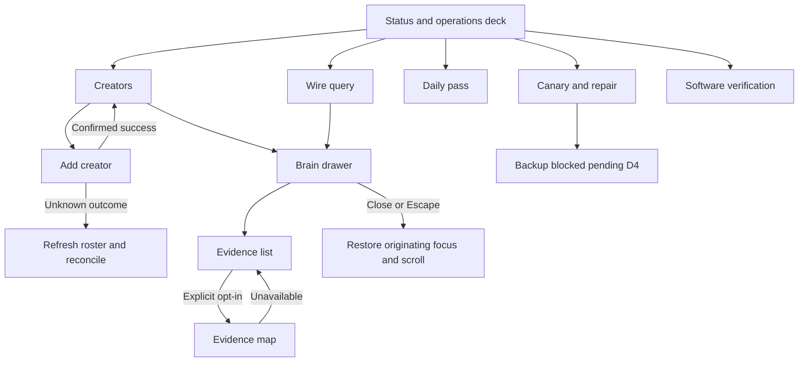
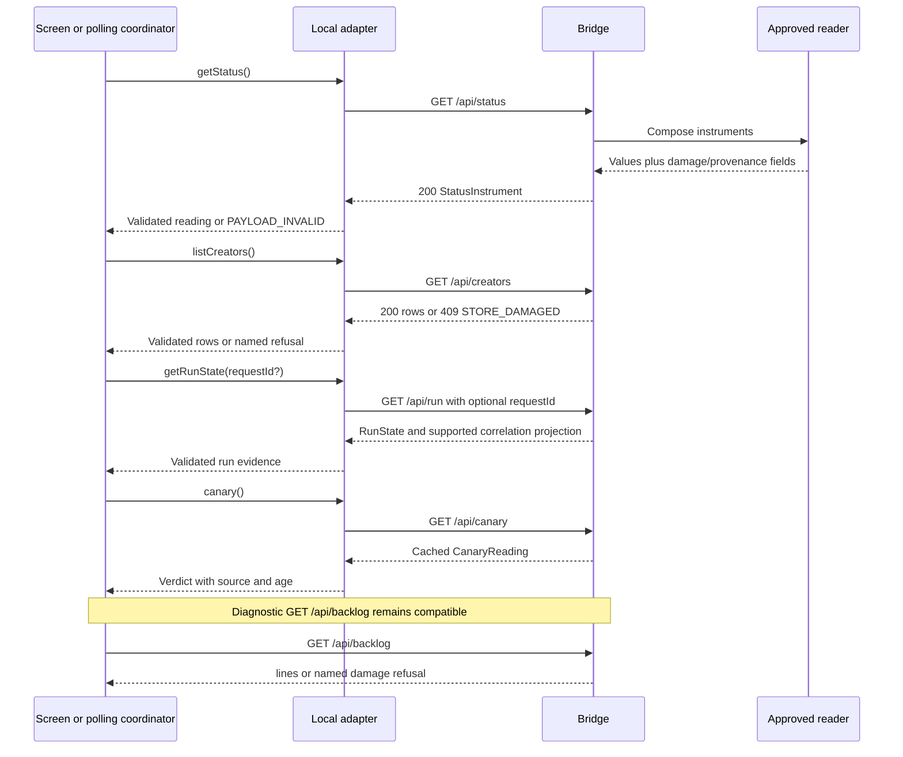
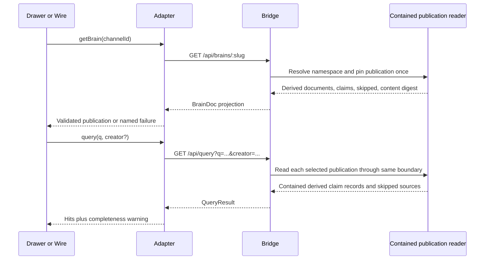
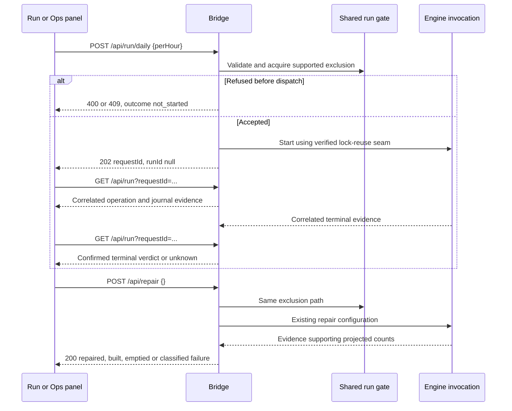
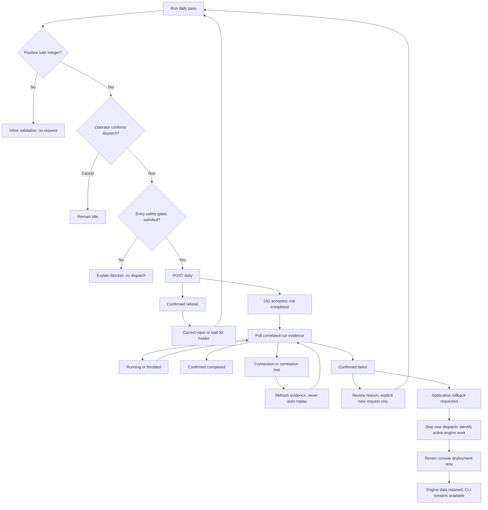
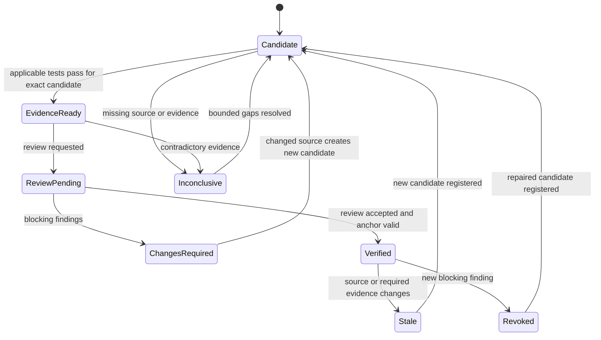
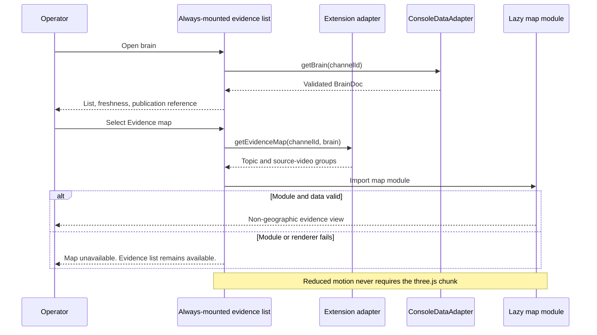
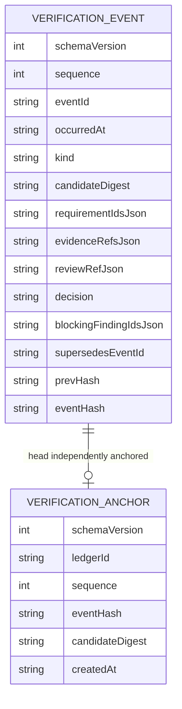

# Astra Reply — subscription transport — 2026-09-23T07:41:23.792Z

**Provider:** openai-codex
**Billing:** chatgpt-subscription
**Authentication:** chatgpt_subscription
**Transport:** codex-cli
**Requested model:** gpt-6-astra
**Served model:** NOT OBSERVABLE on codex-cli (see SERVED_MODEL_UNVERIFIABLE_NOTE)
**Reasoning effort:** xhigh
**Tokens:** in=84785 out=30757 reasoning=6997
**Packet:** `docs/ai-workflow/blueprints/creator-brains-console-20260917/22-opus55-mega-packet-r1.md`
**Wall:** 947.4s
**Mega Blueprint:** ARMED (document)

> Marginal cost $0 — this leg rides the ChatGPT subscription, not OpenRouter.

---
Mega Blueprints. I’m applying the inlined `fable-blueprint-forge` skill to the supplied packet, with both review passes and the exact nine-document output contract. Historical receipts will remain distinct from claims this review can verify.

The packet’s main contradictions are in its release claims: S4 is both deferred and source-built, S5 has several differently scoped performance receipts, and the “cap binds nowhere” statement is stale. I’m preserving those receipts while tightening the gates. Atlas will be a bounded view of derived evidence; the Review Ledger will track software verification, not certify creator claims.

## PART A — HOSTILE REVIEW

**Verdict: REVISE.** [VERIFIED] The supplied documents contain executable-contract contradictions. Their historical test receipts do not resolve those contradictions by themselves.

**Evidence convention:** `[VERIFIED]` means directly supported by the supplied packet; it does **not** mean reproduced in this review. `[UNKNOWN]` marks facts the packet cannot establish. Decisions below are normative instructions, not claims about existing implementation. Citations use `document#section` because the excerpts do not supply reliable document line numbers.

**Review scope:** the twelve documents reproduced in §5 and the inlined skill. [UNKNOWN] The complete contents of `09`, `11`, `12`, `13`, `16`, `18`, `19`, `20`, source files, screenshots, and test logs were not supplied. Their quoted receipts are retained as historical evidence; their omitted contents are not reviewed.

### A1 — Existing-package findings and gap patch

| Gap | Severity | Evidence and finding | Concrete correction |
|---|---|---|---|
| **G1 — Release state has multiple authorities** | High | [VERIFIED] `01-requirements.md#header` and `02-blueprint.md#header` still await the concept decision; `02-blueprint.md#4` records CD3 locked. `05-contracts.md#2b` defers the run route, while `07-traceability.md#R7` and `08-slices-operations.md#S4` report S4 source built. S5 is built although its recorded S2 dependency remains unstarted. | Use a dated evidence register with separate **implementation**, **verification**, and **authorization** states. Preserve S4’s source-built receipt without claiming its current route is absent or verified. Treat S5’s remaining dependency as integration with the completed S2 roster, not permission to rebuild S5. |
| **G2 — Additive-only has two escape clauses** | High | [VERIFIED] `02-blueprint.md#7` and `08-slices-operations.md#No-go boundaries` permit an engine README edit. Packet §8 permits an `oauth.mjs` split if needed. Both conflict with packet §3.4’s absolute prohibition. The “cap binds nowhere” statement also conflicts with packet §2’s `oauth.mjs=300`, `lock.mjs=297`. | Remove every engine-edit exception. No console slice may split or edit either engine file. If an engine change is necessary, block that capability and refer it to a separately authorized engine task. Budget all new console files below 300 lines. |
| **G3 — “Put add on a worker” is incomplete** | High | [VERIFIED] `README.md#Sean decisions pending, item 4` identifies synchronous resolution inside `lib/registry.mjs:109–112`, reaching `lib/ytdlp.mjs:184`. `07-traceability.md#Coverage flags` requires responsiveness but specifies neither concurrent registry writes nor uncertain outcomes. | Put the engine call on a console-owned worker; serialize **both** console add and enable/disable operations through one registry-write gate. Keep that gate held after a disconnected client until the worker settles. Never terminate and retry a possibly committed mutation automatically. Add real concurrent-read, concurrent-write, consent-preservation, and disconnect tests. |
| **G4 — Contracts omit the security and failure behavior consumers need** | High | [VERIFIED] `05-contracts.md#2` promises a uniform envelope whose code list omits documented `FORBIDDEN_HOST`, `NO_PUBLISHED_BRAIN`, `INTERNAL`, and client `TRANSPORT` behavior. `07-traceability.md#Coverage flags` says only status is runtime-validated. Its R2-05 entry records exact-origin enforcement, but the endpoint contract does not define the complete write gate. | Specify transport and application errors separately; give every consumed payload a runtime validator; document the exact proposed write header, origin/media-type rules, and pre-dispatch versus uncertain failure semantics. Reconcile the existing header name at the source-entry checkpoint before changing it. |
| **G5 — Published-generation safety is still incomplete** | High | [VERIFIED] `07-traceability.md#R2-02` explicitly leaves shared query/drawer containment open. The same document reports `render.mjs:70–74` repeatedly publishing `gen-10000`. Generation-name equality therefore cannot establish immutable content. | Complete the shared contained reader before S2/S3 release. Preserve the accepted generation grammar. Bind view identity to a digest of the delivered derived content as well as channel/generation. Warn on the documented generation-reuse range; block console operations that would publish into it until the engine fix is independently evidenced. Do not modify the engine here. |
| **G6 — Run safety has an inaccessible proof dependency** | High | [VERIFIED] `05-contracts.md#2b` records journal writing at `lib/run.mjs:107` before lock acquisition at `:154`. `08-slices-operations.md#S4` says the later lock-reuse path is proven in `20`; that evidence is not included. | Retain the later closure claim as a historical receipt. Require its source binding and the real two-process journal-preservation test at the S3/S4 checkpoint. A console mutex alone cannot pass that gate. If the supported engine seam cannot meet it, keep repair/daily dispatch unavailable. |
| **G7 — Backup is blocked in prose but executable in the public interface** | Medium | [VERIFIED] `01-requirements.md#R8` requires executable backup; `05-contracts.md#1` exposes `backup(dest?)`; `05-contracts.md#2b` prohibits its endpoint pending D4. | Amend R8 into executable canary/repair plus a visible blocked backup action. Retain the compatibility method only as a deterministic local `BLOCKED_POLICY` rejection making **zero HTTP requests**. No destination input. D4 remains Sean’s decision. |
| **G8 — The visual contract violates the new palette and lacks the required mobile drawing** | Medium | [VERIFIED] `03-wireframes.md` uses lavender, danger/red, Graphite, and Carbon; packet §3.2 authorizes only six pigments. Its mobile drawing is 414px, while the commission requires 375px. `17-astra-adjudication.md#Fix ledger` says numeric motion limits were applied, but the quoted blueprint does not give an idle-motion number. | Supply 375px drawings, semantic aliases using only the six approved tokens, and executable geometry/contrast assertions. Preserve existing measured motion values only when their actual receipt is supplied; otherwise use the bounded limits in this package for future changes. |
| **G9 — Query emptiness is confused with evidence absence** | Medium | [VERIFIED] `04-flows.md#F3` turns an unresolved publication pointer into “honest zero hits.” `05-contracts.md#BrainDoc` instead distinguishes incomplete publication from a published empty result. | Render missing/incomplete publication separately from a completed search with no hits. Any skipped source produces a **partial search** notice. Never imply exhaustive absence from an incomplete corpus. |
| **G10 — Atlas cannot honestly have the proposed temporal semantics yet** | Medium | [VERIFIED] `05-contracts.md#QueryHit` contains a video-relative `tStartMs`, not a publication timestamp. `BrainDoc.timeline` is Markdown, not a typed temporal dataset. Packet §2.2 introduces Atlas without a console contract. | Adopt a narrow optional **Evidence map** over creator, exact topic labels, and source videos. Defer chronological positioning until an authoritative publication-time field exists. Never reinterpret video offset as calendar time. No Cesium, geography, or affiliation inference. |
| **G11 — Review, derivation, sensitivity, and permission are conflated** | Medium | [VERIFIED] `01-requirements.md#Business rules` describes a tier-C-only console while permitting registry/state instruments; `00-consult-brief.md#3` also uses T0–T4 for action effects. No supplied contract defines reviewed/curated claim state or a Review Ledger. | Separate **display scope**, **data sensitivity**, **action effect**, and **verification state**. Adopt a development Review Ledger for software evidence only. A derived claim is not thereby reviewed or curated. Do not invent content-review fields in the engine. |
| **G12 — Test and performance receipts are not interchangeable** | Medium | [VERIFIED] `README.md#S5` reports a CPU-side 0.0036ms median; `08-slices-operations.md#S5` reports a later browser measurement of 0.1ms, synchronized samples ≤2.2ms, and five mutations. The packet also carries multiple dated suite totals and a known duplicated-test counting incident. | Retain each receipt with date, command, scope, and artifact binding. Prefer the later browser receipt for its stated scope without converting it into a universal hardware guarantee. Report unique test files/cases; never sum historical totals. |
| **G13 — “Rollback restores the prior world exactly” is false after writes** | Medium | [VERIFIED] `02-blueprint.md#7` and `04-flows.md#F4` describe deleting the console as full rollback. Roster and daily operations mutate durable engine state. | Define **application rollback** separately from **data recovery**. Stop admitting operations, settle or identify active work, revert only the console deployment/launcher, and retain engine data. Restore/rollback remain outside the console. |
| **G14 — Privacy controls are described more strongly than their evidence warrants** | High | [VERIFIED] `06-test-plan.md#T-B15` says the leak guard has “no false negatives”; only bounded fixtures are described. `05-contracts.md#Error envelope` forwards engine reason text verbatim. Derived Markdown and URLs also reach browser surfaces without a supplied rendering contract. | Treat leak guards as defense in depth. Use allowlisted projections, contained derived reads, sanitized bounded errors, inert Markdown, and constructed citation URLs. Test positive leak fixtures **and** legitimate derived content. Do not claim that an eight-word detector proves privacy. |
| **G15 — A context-free builder still lacks several source contracts** | Medium | [UNKNOWN] Exact mounted JSX, engine callable signatures, the current write-header literal, coverage units, S4 implementation, and current source manifests are not included. The inlined skill’s source-harvest requirement cannot be satisfied by inventing them. | Make these explicit, bounded entry receipts. No implementation dependent on an unresolved item advances. The next slice remains S2, beginning with its source binding and regression fixture—not a replacement architecture or a new broad audit. |

**The three weakest claims:** G3’s worker-only sufficiency, G5’s publication identity, and G1/G6’s conflation of recorded closure with currently bound release evidence.

**Settled findings are not reopened.** [VERIFIED] S1-H19 remains an accepted transport limitation; the planned tests retain refusal, bounded resource use, and process survival without demanding an envelope for arbitrarily large in-flight bodies. The static containment mutations remain explicitly multilayered. Historical reviewer misattribution remains corrected.

**Explicit answers to the three product questions**

1. **Atlas: adopt a bounded version in S9.** It is a relational evidence lens, named **Evidence map** in the UI. It groups one selected creator’s published claim rows by exact topic and source video. Its default is an accessible list. It does not add geography, inferred relationships, calendar positioning, semantic embeddings, or another three.js spectacle.
2. **Atlas↔router: no new HTTP route.** A capability-gated extension adapter projects validated `listCreators()` and `getBrain(channelId)` results. S2 supplies stable selection, complete BrainDoc validation, and contained publication reads. S3 supplies safe citations and partial-result semantics. Neither slice adds an Atlas placeholder endpoint or empty handler.
3. **Review Ledger: adopt in S8 as development evidence infrastructure.** It binds software candidates, tests, reviews, findings, and checkpoint decisions. The hostile-review archive remains the review authority; traceability remains the requirement map. The ledger indexes and binds them. It does not judge creator claims.

### A2 — One self-review pass, applied to the emitted package

| Draft weakness found | Correction incorporated below |
|---|---|
| The first worker design allowed PATCH to race an off-thread add. | One registry gate now covers both operations; disconnect does not release it. |
| The first Atlas sketch used a timeline axis without a publication-time contract. | The final map uses topic × source video. Video offsets appear only in citations; calendar positioning is excluded. |
| A hash-chained ledger alone could be rewritten or truncated and still look internally valid. | Verification now distinguishes chain consistency from independently anchored completeness. Release eligibility requires an external anchor matching the expected head and event count. |
| Hashing an entire archived review would invalidate it when the permitted `superseded_by` backlink is added. | The ledger records both the original file hash and a normalized immutable-review digest excluding only that backlink. |
| “Verification passed” could be interpreted as claim truth or as a statement about different built bytes. | Verification views say **Software verification** and bind source-candidate digests. Distribution hashes are a separate post-build receipt. Creator evidence remains labeled **Derived · Not fact-checked**. |
| A cached Atlas list could conceal failure or look current after the visualization failed. | The list lives outside the lazy component, keeps its own freshness label, and remains usable when the visualization fails. No successful data read means an error state, not a fabricated fallback list. |
| The performance plan could pass by timing an empty or frozen renderer. | The browser gate retains draw, changed-pixel, workload-sensitivity, allocation, and dolly mutation controls alongside timing. |

## PART B — FORGED PACKAGE

### 00-README.md

**Package version:** upgrade-r1-adjudicated.  
**Disposition:** **REVISE → S2 entry permitted for planning/source binding; implementation readiness conditional on the named entry receipts.**

**Decision:** This package is the normative upgrade overlay. Preserve the supplied originals and historical receipts. Do not overwrite a filed review, erase a declined finding, or relabel unexecuted tests as passing.

**Builder Contract**

> Follow the decisions below. Build one bounded slice at a time. Return its explicit diff, requirement-linked evidence, and checkpoint result. Do not silently substitute APIs, change engine files, or turn an unresolved contract into an assumption. Record actual output in evidence files; report green checks concisely and failures with the failing assertion, file, and exit code. Advance only after the checkpoint passes.

**Locked boundaries**

- Console home: `packages/creator-brains-console/`.
- Engine tree: `scripts/creator-brains/**`, including README files, is immutable for this work.
- CD3 remains locked; preserve S5 and integrate it.
- Standalone first. S7 transfer remains separately gated on Sean’s explicit go.
- Backup remains visible, blocked, and endpoint-free.
- No raw transcript content in HTTP responses, worker result messages, UI, logs, verification records, or exports.
- No new provider calls, authentication system, database, or engine dependency.

**Historical evidence retained**

Every row below is `[VERIFIED]` as a **packet report**, not a fresh execution result.

| Receipt | Preserved scope and interpretation |
|---|---|
| Engine baselines | 136/136 offline over 15 files; earlier 191/182-of-189/185 references; 183/183 over 25 files later superseded; subsequent C1 failure and independent HR14f flakiness. None is promoted to current baseline. |
| S0/S1 | Nine-route S0 receipt; bridge 105/105 and web 48/48 at the stated checkpoint; S1’s original 31 tests, 81-test bridge regression, 49-module build, 180.35kB raw/60.21kB gzip. |
| Round-4 S1 | Eight findings repaired; web 39/39; 12/12 exit checks; 60.39kB gzip; 41-source cap walk and 30 containment refusals. The reported 97 bridge count remains marked inflated. |
| Round-5 counts | 97 reported versus 85 unique tests; helper moved to `fixtures.mjs`; then 93, 99, and 105 at successive checkpoints. Later 137 is a separate dated receipt. |
| D7 | Relocation executed; engine consistency gate 15/15; 85 engine sources instead of the polluted 184-file walk; no engine edit claimed by that receipt. |
| S5 unit/render receipt | T-T1 14/14; T-T2 8/8; T-W7/T-E3 11/11; initial `WebGLRenderer` count 0 versus deferred 6; initial/deferred raw sizes 220.64/521.98kB; CPU-side 0.0036ms measurement. |
| S5 rendered evidence | GPU census 42,576 on / 15,927 off; camera-fit and pointer-coordinate defects repaired; extraction preserved byte-identical canvas readback. |
| Later S5 browser receipt | 90,740 changed pixels; median 0.1ms; synchronized samples ≤2.2ms; allocation 30→30; dolly moved/converged; five mutation failures. Midday retraction and later replacement remain part of the history. |
| S5 exit suites | Engine `204/0/6`, console `336/0`, web `145/0`, TypeScript zero errors, zero files over 300, as recorded. Do not reinterpret the third engine number without its runner output. |
| Structural readiness | Historical `structurallyReady:true`; reference integrity only. |
| Review provenance | Eight reported reviews; first HY4 attribution corrected to probably Hy3, second to builder; three paid zero-output attempts; recorded cost $0.0563. |
| Astra consult history | Initial CLI-flag failure; repaired harness 10/10; subsequent quota refusal. Later adjudication: REVISE, 16 A1 findings, six A2 corrections; requested identity/effort distinguished from unverified served identity. |
| Astra usage receipt | The supplied adjudication records 666.5s, 1,196,022 input / 20,637 output / 1,553 reasoning tokens and $0 metered. Preserve as reported receipt fields; do not infer remaining allowance or reuse the superseded 75k/~20k estimates. |
| Repository maintenance | Historical 24 dangling skill links, 119→2 reported deletions, zero dangling afterward, preserved prompt-watcher edit. Not a console release criterion. |
| Cap | Historical peak 283 is superseded by the packet’s later engine measurements: 300 and 297. Current console source counts require a new bound manifest. |

**Requirement amendments**

| ID | Binding acceptance criterion |
|---|---|
| R1–R3 | Preserve launcher, status, and damage behavior. Actual launcher timing remains a Windows receipt; status damage remains a field on HTTP 200 where specified. |
| **R4 amended** | New creator starts disabled; re-add preserves existing consent; enable/disable reflects authoritative reread. A concurrent read completes while resolution is blocked. |
| R5–R6 | Preserve cited queries and pinned derived BrainDoc reads. Missing publication, skipped content, and zero matches have different UI states. |
| R7 | Acceptance is not completion. A terminal verdict requires correlated engine evidence. Shared exclusion covers daily and repair. |
| **R8 amended** | Canary executable; repair gated by run safety; backup visible but locally blocked with no request or destination input. |
| R9–R16 | Retain excluded operations, CD3, design law, adapter boundary, zero-dependency bridge, viewport matrix, gated transfer, and keyboard equivalence. |
| **R17 — Responsive writes** | T-N01 proves real synchronous resolution runs off-thread; T-N02 proves console registry writes cannot race; T-N03 proves uncertainty never triggers automatic replay. |
| **R18 — Runtime contracts** | Every newly consumed response passes its named validator. A missing dereferenced field yields `PAYLOAD_INVALID` naming the JSON path, with shell and retry UI retained. |
| **R19 — Display/privacy** | Allowlisted projections and inert rendering pass leak, traversal, unsafe-link, and error-redaction controls. Derived content never receives a curated/reviewed badge. |
| **R20 — Evidence freshness** | Each view displays observation/freshness and publication identity without implying a cross-route atomic snapshot. A late response cannot replace newer selection/data. |
| **R21 — Software Review Ledger** | Candidate verification requires passing applicable evidence, review, no unresolved blocking finding, and a matching anchor. Tamper, truncation, stale target, and candidate-only controls fail eligibility. |
| **R22 — Optional Evidence map** | No new route; explicit lazy load; list remains usable after module/render failure; absent data produces a named error; no temporal/geographic inference. |
| **R23 — Measured visual quality** | Exact six-token palette, 44px controls, 4.5:1 normal text, viewport matrix, focus behavior, screenshot review, and preserved S5 rendering gates. |
| **R24 — Evidence integrity** | Unique tests, file hashes, actual commands, environments, mocks, exclusions, and unresolved gates accompany every completion claim. |

**Two additional improvements worth their cost**

1. **Publication reference copy:** copy only channel ID, generation, and content digest from the drawer. This makes a reported discrepancy reproducible. No transcript or full claim export.
2. **In-memory return context:** preserve query text, selected creator, and scroll position when opening/closing a drawer. Clear on reload; add no browser persistence or migration.

**Single next slice:** **S2**, starting with the source-binding receipt and S1-H12 regression. S8/S9 do not delay this work.

### 01-architecture.md

**Decision:** Preserve the deployed architectural seams. Add console-owned coordination and projections; do not move business writes into the UI.

| Boundary | Owner |
|---|---|
| Host validation, URL parsing, envelope | `server.mjs`; Host before dispatch, parser inside guarded handler |
| Exact endpoint allowlist | `routes.mjs`, with structure tests observing every dispatch site |
| Engine composition | `api.mjs` and bounded console `lib/` modules |
| Registry-write exclusion | Console registry gate; covers add and PATCH |
| Blocking add | Worker invoking the existing engine function |
| Engine durable mutations | Existing engine functions only |
| Published display reads | One contained console reader serving both query and drawer |
| Web transport/validation | Local adapter; no component-side fetch |
| Polling | One coordinator with generation guards and cancellation of obsolete reads |
| View selection | Console shell; one selected channel, drawer origin/focus target, query context |
| S5 | Existing constellation module; receives validated data and selection callbacks |
| Atlas | Optional extension adapter plus lazy 2D evidence view |
| Verification | Development ledger and injected read-only software-verification summary |

**Source-entry obligations:** bind the actual `App.tsx` JSX mount, adapter implementations, worker pattern, contained reader, and engine signatures before changing them. [UNKNOWN] Their complete source definitions are not in the packet.

**System and privacy flow**



**Screen/navigation flow**



**Read API interactions**

Each named message is a separate interaction with the same validated transport boundary.



**Add and enable interactions**

```mermaid
sequenceDiagram
  participant UI as Roster
  participant BR as Bridge
  participant G as Registry gate
  participant W as Add worker
  participant EN as Engine
  UI->>BR: POST /api/creators {ref}
  BR->>BR: Validate Host, origin, header, JSON, body
  BR->>G: Try acquire
  alt Busy
    G-->>BR: Refuse before dispatch
    BR-->>UI: 409 WRITE_BUSY, outcome not_started
  else Acquired
    BR->>W: Invoke addCreator through fixed worker entry
    W->>EN: Existing engine add
    UI->>BR: GET /api/status while add blocks
    BR-->>UI: Status response before add finishes
    EN-->>W: Engine result
    W-->>BR: Allowlisted result or typed failure
    BR->>G: Release after worker settles
    BR-->>UI: 201 CreatorRow or classified error
  end
  UI->>BR: PATCH /api/creators/channelId {enabled}
  BR->>G: Same non-queued gate
  BR->>EN: setEnabled
  EN-->>BR: Authoritative mutation result
  BR-->>UI: 200 row; counts may be null
  Note over BR,W: Disconnect does not cancel the write or free the gate
```

**Brain and query interactions**



**Daily/repair interaction**



**Daily-pass control flow, including recovery and rollback**



**Verification state machine**



**Atlas lazy-load sequence**



**Persisted model ERD**

No engine schema is created or migrated. These are exact fields of the **new console development ledger**, a JSONL file rather than SQL tables.



`requirementIdsJson`, `evidenceRefsJson`, and `blockingFindingIdsJson` are canonical JSON strings; `reviewRefJson` and `supersedesEventId` are nullable. Field names/types match `03-contracts.md`.

**N/A:** persisted UI preferences, SQL tables, Sequelize models, and foreign keys—none is introduced. Diagram rendering is not certified by this document; the package gate must parse the literal Mermaid sources.

### 02-wireframes.md

**Palette contract**

```css
--midnight-sapphire: #002060;
--ice-wing: #60C0F0;
--gilded-fern: #C6A84B;
--frost-white: #E0ECF4;
--wing-purple: #8B5CF6;
--obsidian-black: #0A0A0F;
```

Use `var(--token, #fallback)` everywhere. Semantic surfaces may alias these tokens or use their transparent mixtures; they may not introduce another pigment.

- Canvas: obsidian-black.
- Panels/buttons: midnight-sapphire; text: frost-white.
- Focus/data selection: ice-wing.
- Warning/staleness: gilded-fern plus text/icon.
- Purple is an accent/focus/glow pigment; do not assume white-on-purple meets normal-text contrast.
- Error: frost-white text, explicit error icon/label, gilded-fern border. No unapproved red.
- Buttons: ≥44×44 CSS px. Primary sapphire with purple glow; purple accent controls use ice-wing glow only where contrast passes.
- Typography: existing locally available Sora for UI, Plus Jakarta Sans headings, Cormorant Garamond italic empty-state emphasis, Fira Code identifiers. System fallbacks must remain legible; no new remote font request.

**Layout decisions**

At ≥1024px use CD3’s 44% constellation / 56% operations split, minimum deck width 480px. At narrower widths use the operations deck with the accessible roster; do not squeeze the desktop layout. At 2560/3840px let the working area expand to a maximum 3200px with proportional gutters. Below 480px use 16px gutters and stacked controls.

**Desktop shell, 1440px**

```text
┌ CREATOR BRAINS CONSOLE ───────────────────────────────────────────────┐
│ Store: Healthy   Last successful run: {age}   Reading: {observedAt}    │
├─────────────────────────────┬────────────────────────────────────────┤
│                             │ [Status] [Creators] [Wire] [Run]       │
│   EXISTING CONSTELLATION    │ [Operations] [Verification]            │
│                             │                                        │
│   Creator selection         │       ACTIVE OPERATIONS PANEL          │
│   reflects roster focus     │                                        │
│                             │                                        │
│ [Open creator list]         │                                        │
└─────────────────────────────┴────────────────────────────────────────┘
```

**375px shell**

```text
┌─────────────────────────────────┐
│ CREATOR BRAINS CONSOLE           │
│ Store: Healthy                  │
│ Last successful run: {age}       │
│ Reading: {observedAt}            │
│ [Status]    [Creators]           │
│ [Wire]      [Run]                │
│ [Operations][Verification]       │
├─────────────────────────────────┤
│ ACTIVE PANEL                    │
│                                 │
└─────────────────────────────────┘
```

Navigation wraps as a two-column grid at 375px. All labels remain visible. No hover-only menu.

**Status panel**

```text
Desktop
┌ STATUS ─────────────────────────────────────────────────────────────┐
│ [Store: Healthy] [yt-dlp: {verdict}] [Last success: {age}]            │
│ Creators {total} / Enabled {enabled}     Videos {total}              │
│ Fetched {fetched}    Published brains {count}    Documents {count}    │
│ Budget {used}/{perHour} {unit}    Throttle {text}                     │
│ Backlog                                                             │
│ {engine-formatted line}                                             │
│ Lock {holder-or-free}   Census {measured-or-unavailable}              │
│ Recent runs: {journal-backed rows}                         [Refresh] │
└─────────────────────────────────────────────────────────────────────┘

375px
┌ STATUS ─────────────────────────┐
│ Store: Healthy                  │
│ yt-dlp: {verdict}                │
│ Source: {probe/history/unknown}  │
│ Checked: {age-or-not-checked}    │
│ Creators {total}                │
│ Enabled {enabled}              │
│ Videos {total} / Fetched {n}     │
│ Budget {used}/{perHour} {unit}   │
│ Backlog                         │
│ {wrapped engine line}           │
│ [Refresh]                       │
└─────────────────────────────────┘
```

Do not attach `%` to `coverage` until its source unit is bound. Roster-derived percentage, if used, is explicitly `100*fetched/videos` with `videos=0 → unavailable`, and is labeled as that projection.

**Creators and add form**

```text
Desktop
┌ CREATORS ─────────────────────────────────────────────── [Add creator]┐
│ Creator              Consent      Videos    Fetched       Brain      │
│ {title}              Enabled      {n/—}     {n/—}         [Open]     │
│ {channelId}          [Disable]                                      │
│ {title}              Disabled     {n/—}     {n/—}         [Open]     │
│ {channelId}          [Enable]                                       │
└──────────────────────────────────────────────────────────────────────┘
┌ ADD CREATOR ─────────────────────────────────────────────────────────┐
│ Handle, channel URL, or channel ID                                   │
│ [_______________________________________________________________]   │
│ New creators start disabled. Re-adding preserves existing consent.   │
│ [Cancel]                                              [Add creator] │
└──────────────────────────────────────────────────────────────────────┘

375px
┌ CREATORS ───────────────────────┐
│ [Add creator]                   │
│ {title, wraps}                  │
│ {channelId, wraps}              │
│ Consent: Enabled               │
│ Videos {n/—} · Fetched {n/—}     │
│ [Open brain] [Disable]          │
├─────────────────────────────────┤
│ ADD CREATOR                     │
│ Handle, channel URL,            │
│ or channel ID                   │
│ [___________________________]   │
│ New creators start disabled.    │
│ [Cancel]       [Add creator]    │
└─────────────────────────────────┘
```

Pending add: **“Adding creator… Other panels remain available.”**  
Pending PATCH: **“Saving consent…”** Keep the last confirmed consent visible.  
Busy refusal: **“Another creator change is still running. Nothing was submitted.”**  
Unknown outcome: **“The outcome is unknown. Refresh creators before trying again.”**  
Dismiss pending panel: **“Closing this panel does not stop the creator change.”**

**Brain drawer**

```text
Desktop right drawer, width min(640px, 48vw)
┌ {title} ─────────────────────────────────────────────── [Close] ┐
│ Derived · Not fact-checked                                     │
│ Channel {channelId}   Generation {generation-or-unpublished}    │
│ Observed {time}    [Copy publication reference]                 │
│ [Index] [Topics] [Timeline] [Claims]                            │
│ {inert Markdown OR cited claim rows}                           │
│ {statement}                                                   │
│ Topic: {topic}      [Watch at {mm:ss}]                          │
│ {skipped-count} items could not be read. [Show details]         │
│ [Evidence list] [Evidence map]                                 │
└───────────────────────────────────────────────────────────────┘

375px full-screen dialog
┌ {title, wraps}         [Close] ┐
│ Derived · Not fact-checked     │
│ Generation {generation}       │
│ [Copy publication reference]  │
│ [Index]       [Topics]        │
│ [Timeline]    [Claims]        │
│ {content wraps}              │
│ [Watch at {mm:ss}]            │
│ [Evidence list]              │
│ [Evidence map]               │
└──────────────────────────────┘
```

Focus traps in the dialog; Escape closes; return to the actual invoking roster button, query row, or constellation DOM control. Removed trigger → focus the Creators heading.

**Wire/query**

```text
Desktop
┌ WIRE — SEARCH PUBLISHED BRAINS ────────────────────────────────────┐
│ Search terms [____________________] Creator [All creators v] [Search]│
│ Published derived evidence · Not fact-checked                       │
│ {N} matches for “{q}”                                               │
│ {statement}                                                        │
│ {creatorTitle} · {topic} · [Watch at {mm:ss}] [Open brain]           │
│ Partial search: {N} sources could not be read. [Show details]        │
└─────────────────────────────────────────────────────────────────────┘

375px
┌ WIRE ──────────────────────────┐
│ SEARCH PUBLISHED BRAINS         │
│ Search terms                   │
│ [___________________________]  │
│ Creator [All creators v]       │
│ [Search]                       │
│ {N} matches for “{q}”          │
│ {statement, wraps}             │
│ [Watch at {mm:ss}]             │
│ [Open brain]                   │
└────────────────────────────────┘
```

**Run and operations**

```text
Desktop
┌ RUN THE DAILY PASS ─────────────────────────────────────────────────┐
│ Operations per hour [20]                         [Run daily pass]  │
│ State: {Idle/Accepted/Running/Completed/Failed/Outcome unknown}      │
│ Request {requestId}   Engine run {runId-or-not-yet-assigned}        │
│ Budget {reading}   Throttle {reading}   Lock {holder-or-free}        │
│ {journal-backed phase/result}                         [Refresh]    │
└────────────────────────────────────────────────────────────────────┘
┌ OPERATIONS ────────────────────────────────────────────────────────┐
│ [Check yt-dlp] T0                 [Repair derived outputs] T2       │
│ Backup — awaiting privacy decision                                │
│ [Backup unavailable]                                              │
│ CLI only: Authorize · Restore · Rollback                           │
└────────────────────────────────────────────────────────────────────┘

375px
┌ RUN THE DAILY PASS ─────────────┐
│ Operations per hour [20]       │
│ [Run daily pass]               │
│ State: {state}                 │
│ Request {wrapped-id}           │
│ Engine run {id-or-unassigned}  │
│ {journal-backed result}        │
│ [Refresh]                      │
├ OPERATIONS ────────────────────┤
│ [Check yt-dlp]                 │
│ [Repair derived outputs]      │
│ Backup                        │
│ Awaiting privacy decision     │
│ [Backup unavailable]          │
│ CLI only: Authorize           │
│ Restore · Rollback            │
└────────────────────────────────┘
```

The pre-dispatch confirmation repeats the operation and budget; buttons are **“Cancel”** and **“Run daily pass”**. There is no misleading post-dispatch cancel button.

**Software verification**

```text
Desktop
┌ SOFTWARE VERIFICATION ─────────────────────────────────────────────┐
│ Candidate {digest-prefix}                                          │
│ State: {Candidate/Review pending/Verified/Stale/Revoked/Inconclusive}│
│ Evidence {passed}/{applicable}    Blocking findings {count}         │
│ Ledger integrity: {Consistent/Invalid/Unanchored}                    │
│ Scope: Software behavior. Creator claims are not fact-checked.     │
│ {requirement}  {test receipt}  {review ID}  {decision}               │
└────────────────────────────────────────────────────────────────────┘

375px
┌ SOFTWARE VERIFICATION ─────────┐
│ Candidate {wrapped-prefix}     │
│ State: {state}                 │
│ Evidence {passed}/{applicable} │
│ Blocking findings {count}      │
│ Ledger: {integrity}            │
│ Creator claims are not         │
│ fact-checked.                 │
│ {stacked receipt rows}         │
└────────────────────────────────┘
```

This panel consumes an injected sanitized summary. No review-writing action, private filesystem link, or new bridge endpoint.

**Evidence map**

```text
Desktop
┌ EVIDENCE ──────────────────────────────────────────────────────────┐
│ {creatorTitle} · Generation {generation} · Derived, not fact-checked │
│ [List] [Evidence map]   Topic [All topics v]                         │
│ Topic              Source video              Cited rows            │
│ {exact topic} ───── {videoId} ───────────────── {claim links}        │
│ Connections show shared recorded labels, not causality.            │
│ Coverage: {registry/state observation, separately timestamped}      │
└────────────────────────────────────────────────────────────────────┘

375px
┌ EVIDENCE ──────────────────────┐
│ {creatorTitle}                 │
│ [List] [Evidence map]          │
│ Topic [All topics v]           │
│ {topic}                       │
│   {videoId}                   │
│   [Watch at {mm:ss}]          │
│ Shared labels, not causality. │
└────────────────────────────────┘
```

**State overlays apply to every data panel**

| State | Exact copy/action |
|---|---|
| Loading, no prior data | “Loading {panel}…”; static geometry-preserving skeleton |
| Refreshing prior reading | “Refreshing… Showing the last reading from {time}.” |
| Empty roster | “No creators yet. Add your first creator.” / **Add creator** |
| No publication | “No published brain is available for this creator.” |
| Published empty content | “This publication contains no {section}.” |
| Zero query hits | “No matches for “{q}” in the readable published evidence.” |
| Partial query | “Some published evidence could not be read. These results are incomplete.” |
| Damaged store | “Cannot read {safeFileName}. Repair or recover the store before continuing.” |
| Transport failure | “Cannot reach the local bridge.” / **Retry read** |
| Invalid payload | “The bridge returned an incompatible {panel} response: {path}.” / **Retry read** |
| Run locked | “Another run holds the engine lock: {safeHolder}.” |
| Stale | “Stale reading from {time}.” / **Refresh** |
| Map unavailable | “Map unavailable. Evidence list remains available.” |
| Verification absent | “No software verification receipt was supplied for this build.” |
| Unexpected render fault | “This panel could not be displayed.” / **Reload panel**; shell survives |

**Visual acceptance:** all listed widths; explicit 2560×1440 and 3840×2160; no clipped controls or page overflow; drawer focus tests; automated token/contrast checks; screenshot review of healthy, damaged, pending-write, stale, partial, and unknown-outcome states. S5’s aesthetic acceptance remains its real-render census plus human review, not timing alone.

### 03-contracts.md

**Decision:** Existing public fields remain compatible. New metadata is additive and slice-owned. Do not silently replace `slug` with `key`.

**Display, sensitivity, effects, permissions**

| Dimension | Values and rule |
|---|---|
| Display scope | `operational_metadata`, `published_derived`, `software_verification` |
| Sensitivity | All console data is operator-local by default. Raw transcripts are private and excluded from the display plane. Derived does not mean public or fact-checked. |
| Effect tier | T0 reads; T2 bounded engine writes. A tier is not authorization, sensitivity, or review state. |
| Permission | Single local operator through the loopback bridge. Host/origin controls are browser-request defenses, not authentication against other local processes. |
| S7 | Host-supplied identity/authorization must be reviewed in SwanGuard. Never expose the standalone bridge as a network service. |
| Content review | No curated tier, claim approval store, or claim-review workflow is introduced. |

**Core payloads**

These reproduce the supplied field contract, with explicit additions below.

```ts
type Damage = { file: string; detail: string };
type Skipped = Record<string, unknown>; // rendered through safe projection, never JSON-dumped
type CanaryReading = {
  ok: boolean; version: string | null; reason: string;
  checkedAt: string | null; ageMs: number | null;
  source: 'probe' | 'history' | 'unknown'; stale: boolean; note: string | null;
};
type StatusInstrument = {
  ytdlp: CanaryReading;
  creators: { total: number; enabled: number; damaged: Damage | null };
  state: {
    damaged: Damage | null;
    videos: {
      total: number; fetched: number; coverage: number;
      counts: Record<string, number>;
    } | null;
  };
  budget: { used: number; perHour: number; unit: string; byKind: Record<string, number> };
  backlog: { lines: string[] };
  throttle: { active: boolean; kind?: string; until?: string; text: string };
  census: {
    inFlight: Array<{ channelId: string; detail: string }>;
    everSwept: number; discarded: boolean; error?: string;
  };
  lock: { held: boolean; pid?: number; host?: string; alive?: boolean };
  lastRun: { status: string; runId: string | null } | null;
  lastGood: { at: string; staleDays: number } | null;
  documents: number;
  publishedBrains: number | null;
  publishedBrainsDamaged: Damage | null;
  recentRuns: Array<{ runId: string; ok: boolean; fetched: number }>;
};
type CreatorRow = {
  channelId: string; title: string; enabled: boolean;
  videos: number | null; fetched: number | null;
};
type QueryHit = {
  claimId: string; creatorId: string; creatorTitle: string;
  videoId: string; tStartMs: number; keyPhrase: string;
  statement: string; topic: string; watchUrl: string;
};
type QueryResult = { hits: QueryHit[]; skipped: Skipped[] };
type BrainDoc = {
  slug: string; title: string; generation: string | null;
  index: string; topics: string; timeline: string;
  claims: QueryHit[]; skipped: Skipped[];
  observation?: {
    observedAt: string; contentDigest: string;
    publicationWarning: 'generation-reuse-risk' | null;
  };
};
type RunOperation = {
  requestId: string; kind: 'daily' | 'repair';
  state: 'accepted' | 'running' | 'completed' | 'failed' | 'unknown';
  engineRunId: string | null;
};
type RunState = {
  journal: { status: string; runId: string | null } | null;
  lock: StatusInstrument['lock']; throttle: StatusInstrument['throttle'];
  budget: StatusInstrument['budget']; recentRuns: StatusInstrument['recentRuns'];
  operation?: RunOperation | null;
};
```

**Validation decisions**

- Finite nonnegative safe integers for counts and `tStartMs`; nullable counts stay nullable.
- `enabled` is a boolean, never truthiness-coerced.
- Damage takes precedence over apparent zero counts.
- `source:'unknown'` requires no fabricated timestamp; `history` remains stale.
- Coverage units and document-count failure representation are **U1 source-entry bindings**. Preserve the actual established payload; do not invent a new nullability amendment without its fixtures.
- `slug` contains the channel ID. Generation grammar remains `/^gen-(?:\d{4}|[1-9]\d{4,})$/`.
- All strings rendered from `skipped` are projected to `{source, reason}` with safe relative labels; never expose arbitrary object contents.
- The S2 drawer requires valid observation metadata once S2’s producer ships. Older adapters may omit it only under an explicit legacy capability, which renders “Publication fingerprint unavailable.”
- Content digest covers the exact delivered derived fields and claims in deterministic order. It identifies an observation; it does not prove historical immutability or atomicity against an external in-place writer.

**Adapter signatures**

```ts
type ReadOptions = { signal?: AbortSignal };
interface ConsoleDataAdapter {
  getStatus(options?: ReadOptions): Promise<StatusInstrument>;
  listCreators(options?: ReadOptions): Promise<CreatorRow[]>;
  addCreator(ref: string): Promise<CreatorRow>;
  setCreatorEnabled(channelId: string, enabled: boolean): Promise<CreatorRow>;
  query(q: string, creator?: string, options?: ReadOptions): Promise<QueryResult>;
  getBrain(channelId: string, options?: ReadOptions): Promise<BrainDoc>;
  getRunState(requestId?: string, options?: ReadOptions): Promise<RunState>;
  startDailyRun(perHour: number): Promise<{ requestId: string; runId: string | null }>;
  canary(options?: ReadOptions): Promise<CanaryReading>;
  repair(): Promise<{ repaired: number; built: number; emptied: number }>;
  backup(dest?: string): Promise<never>;
}
type EvidenceMap = {
  channelId: string; generation: string | null; contentDigest: string;
  groups: Array<{ topic: string; videos: Array<{ videoId: string; claims: QueryHit[] }> }>;
};
interface ConsoleExtensionAdapter {
  capabilities: { evidenceMap: boolean };
  getEvidenceMap(channelId: string, brain: BrainDoc): Promise<EvidenceMap>;
}
```

The optional read arguments are compatible extensions; mutations intentionally take no abort signal suggesting engine cancellation.

**Bridge request security**

- Bind `127.0.0.1` on an OS-selected port.
- Validate Host against the actual bound host/port before route parsing or dispatch.
- For writes: require exact same-origin `Origin`, `Content-Type: application/json`, and the established custom-header gate. No CORS permission, cross-origin preflight support, or browser-provided filesystem paths.
- **Proposed canonical header if the existing literal differs or is undocumented:** `X-Creator-Brains: 1`. U2 must record the actual literal. Preserve an already-established equivalent literal and update this one contract/test constant instead of introducing a second header.
- Missing/wrong write gates return 403 before dispatch. Local CLI clients must supply the same explicit headers; this is not a secret or local-process authentication.
- Keep the 64KiB body limit and the accepted S1-H19 connection-reset behavior.

**Routes and exact JSON contracts**

`L` = loopback Host gate; `W` = L plus write gates. No user account/token authentication is introduced.

| Method/path | Gate | Request | Success JSON | Named failures |
|---|---|---|---|---|
| `GET /api/status` | L | none | `200 StatusInstrument` | Damage remains fields; unexpected failure 500 |
| `GET /api/creators` | L | none | `200 CreatorRow[]` | 409 `STORE_DAMAGED` |
| `POST /api/creators` | W | `{"ref":"<nonempty, ≤200 chars>"}` | `201 CreatorRow` | 400 `VALIDATION`; 409 `WRITE_BUSY`/`STORE_DAMAGED`; 422 `REFUSED`; uncertain 504 |
| `PATCH /api/creators/:channelId` | W | `{"enabled":true}` or `false` | `200 CreatorRow` | 400; 409 busy/damage; 422 refusal; uncertain 504 |
| `GET /api/query?q=...&creator=...` | L | q nonempty ≤300 chars; creator optional exact ID | `200 QueryResult` | 400 validation; contained-read refusals reported through documented route failure or `skipped` |
| `GET /api/brains/:slug` | L | channel ID, not display slug | `200 BrainDoc` | 404 `NO_PUBLISHED_BRAIN`; 409 `STORE_DAMAGED` |
| `GET /api/run` | L | optional `requestId` in S4 | `200 RunState` | Invalid ID 400; absent correlation must remain unknown |
| `GET /api/backlog` | L | none | `200 {"lines":["<engine-formatted>"]}` | 409 `STORE_DAMAGED` |
| `GET /api/canary` | L | none | `200 CanaryReading` | Probe failure is a reading, not a fabricated success |
| `POST /api/repair` | W; S3 gate | `{}` | `200 {"repaired":0,"built":0,"emptied":0}` with actual measured counts | 409 `RUN_LOCKED`/publication fence; 422 refusal; uncertain outcome |
| `POST /api/run/daily` | W; S4 gate | `{"perHour":20}` | `202 {"requestId":"<uuid>","runId":null}` | 400 validation; 409 `RUN_LOCKED`/publication fence |
| Backup/restore/rollback/authorize | none exposed | any | none | 404 `NOT_FOUND` |
| Other API routes/methods | none | any | none | 404 `NOT_FOUND` |

The two run-operation routes are **planned reconciliation targets**. [UNKNOWN] Their current presence cannot be settled from the conflicting packet excerpts.

```ts
type ErrorEnvelope = {
  error: {
    code:
      | 'VALIDATION' | 'FORBIDDEN_HOST' | 'FORBIDDEN_ORIGIN'
      | 'WRITE_GATE_REQUIRED' | 'STORE_DAMAGED' | 'WRITE_BUSY'
      | 'RUN_LOCKED' | 'REFUSED' | 'NOT_FOUND' | 'NO_PUBLISHED_BRAIN'
      | 'PUBLICATION_UNSAFE' | 'WRITE_OUTCOME_UNKNOWN' | 'INTERNAL';
    message: string;
    file?: string;
    holder?: { pid?: number; host?: string };
    outcome?: 'not_started' | 'unknown';
  };
};
```

Client-only codes: `TRANSPORT`, `PAYLOAD_INVALID`, `BLOCKED_POLICY`. They are not fabricated HTTP statuses. Validation errors name a JSON path; messages exclude stacks, credentials, raw transcripts, and absolute private paths.

**Mutation lifecycle**

- Acquire registry gate immediately before dispatch; busy requests are refused, not queued.
- New add invokes a fixed worker entry chosen by code, never by request input.
- Soft response deadline: 190 seconds. Expiry after dispatch reports `WRITE_OUTCOME_UNKNOWN`; retain gate/worker ownership until settlement.
- No automatic worker termination, retry, or assumption that a disconnected client canceled the engine operation.
- On bridge restart, no persisted console operation history is assumed. Reload authoritative state; unresolved actions stay unknown.
- Console serialization does not claim protection from concurrent external CLI registry writes. T-N02’s real two-process test must establish the engine boundary or block the add/toggle release.
- Confirmed pre-dispatch refusal may say “Nothing was submitted.” Post-dispatch ambiguity never says “Nothing changed.”
- Repair/daily share the verified lock-reuse seam. Missing correlation, process exit alone, or disappearance of a lock cannot establish success.
- Fence console publishing when the current generation reaches `gen-9999` or above until the documented engine reuse defect is independently closed. Read parsing still accepts valid five-digit names.

**New console exports**

```ts
runAddInWorker(
  root: string, ref: string
): Promise<CreatorRow>;

withRegistryMutation<T>(
  task: () => Promise<T>
): Promise<T>;

readContainedBrain(
  root: string, channelId: string
): Promise<BrainDoc>;

queryContainedBrains(
  root: string, q: string, creator?: string
): Promise<QueryResult>;

validateCreatorRows(body: unknown): CreatorRow[];
validateCreatorRow(body: unknown): CreatorRow;
validateBrainDoc(body: unknown): BrainDoc;
validateQueryResult(body: unknown): QueryResult;
validateRunState(body: unknown): RunState;
validateCanaryReading(body: unknown): CanaryReading;

projectEvidenceMap(channelId: string, brain: BrainDoc): EvidenceMap;
```

Actual engine invocation syntax is U1-bound; these are new console wrapper signatures, not invented engine exports.

**Review Ledger contract**

```ts
type VerificationEvent = {
  schemaVersion: 1;
  sequence: number;
  eventId: string;
  occurredAt: string;
  kind: 'candidate' | 'test' | 'review' | 'checkpoint' | 'revoke' | 'supersede';
  candidateDigest: string;
  requirementIdsJson: string;
  evidenceRefsJson: string;
  reviewRefJson: string | null;
  decision: 'recorded' | 'pass' | 'revise' | 'halt' | 'inconclusive';
  blockingFindingIdsJson: string;
  supersedesEventId: string | null;
  prevHash: string;
  eventHash: string;
};
type VerificationAnchor = {
  schemaVersion: 1; ledgerId: string; sequence: number;
  eventHash: string; candidateDigest: string; createdAt: string;
};
appendVerificationEvent(input: Omit<VerificationEvent, 'sequence' | 'prevHash' | 'eventHash'>):
  Promise<VerificationEvent>;
verifyVerificationLedger(path: string, anchor?: VerificationAnchor):
  Promise<{ consistent: boolean; anchored: boolean; eligible: boolean; reasons: string[] }>;
```

- Store under the task’s evidence directory, outside engine data. Append with exclusive writer lock; validate prior head first; flush before reporting success. Never truncate a corrupt suffix automatically.
- Hash `JSON.stringify()` of a fixed-order array of all event fields except `eventHash`; SHA-256 lowercase hex. Genesis `prevHash` is 64 zeroes.
- Nested JSON strings use recursively sorted object keys; array order is preserved. Reject nonfinite numbers and duplicate-key ambiguity at input construction.
- Candidate digest binds sorted relative paths and SHA-256s of console source, tests, contracts, package manifests, and lockfiles. Exclude generated verification metadata explicitly to avoid a self-referential build.
- Evidence references contain relative path, SHA-256, command ID, exit code, environment ID, requirement IDs, and scope. No raw output or private content in the event.
- Review reference includes archive `review_id`, initial file hash, and immutable-review digest. Normalize only the permitted `superseded_by` backlink out of that digest.
- An independently retained anchor must match head, count, and candidate. Without it, report **consistent but unanchored**, never tamper-proof.
- Verification is computed; an event’s text cannot grant eligibility by itself.
- The UI summary is injected at the root and validated. It certifies its named source candidate only; post-build distribution hashes remain separate.

**Migrations/environment/rollback**

No engine migration or schema change. Use existing `CREATOR_BRAINS_ROOT`; do not introduce browser-selectable roots or log environment values. Test roots are temporary and explicitly selected. Ledger schema version 1 rejects unknown versions. Application rollback restores console code/launcher only; data recovery remains separately governed.

### 04-build-order.md

**Decision:** All paths below are relative to `packages/creator-brains-console/`. Existing files are modified only after source binding; new filenames are planned targets, not claims of present files. Every source/test file must stay ≤300 physical lines.

| Order / slice | File or exact file set | Budget each | Imports → exports / purpose |
|---|---|---:|---|
| S2 entry | `test/upgrade.source-binding.test.mjs` | 220 | Node test/fs → enforce manifest, entry contracts, engine no-edit boundary |
| S2 | `lib/registry-gate.mjs` | 100 | Node built-ins → `withRegistryMutation` |
| S2 | `lib/add-worker.mjs` | 160 | `node:worker_threads`, typed errors → `runAddInWorker` |
| S2 | `lib/add-worker-entry.mjs` | 140 | Node worker API + verified engine registry entry → allowlisted messages |
| S2 | `api.mjs`, `routes.mjs` | 260 | Existing composition → wire shared registry gate without bypassing server security |
| S2 | `lib/brain-read.mjs` | 260 | Existing contained-read pattern → shared pinned publication reader; extract before exceeding budget |
| S2 | `lib/query-read.mjs` | 220 | Shared reader + existing query semantics → contained query |
| S2 | `web/src/adapters/validateCreators.ts` | 180 | Existing validation/error pattern → row/rows validators |
| S2 | `web/src/adapters/validateBrain.ts` | 220 | Query-hit validator → BrainDoc validator |
| S2 | `web/src/adapters/validateQuery.ts` | 180 | Types/errors → hit/result validation |
| S2 | `web/src/adapters/LocalEngineAdapter.ts`, `MockAdapter.ts`, `types.ts`, `contract.assert.ts` | 280 | Existing adapter seams → compatible contracts and equivalent behavior |
| S2 | `web/src/hooks/useCreators.ts`, `useBrain.ts` | 180 | Adapter only → generation-guarded reads and mutation status |
| S2 | `web/src/components/CreatorRoster.tsx`, `AddCreatorForm.tsx` | 240 | Hooks/styles → roster and add UI |
| S2 | `web/src/components/BrainDrawer.tsx`, `BrainContent.tsx` | 240 | Validated BrainDoc → focus-safe dialog and inert content |
| S2 | `web/src/components/CreatorRoster.styles.ts`, `BrainDrawer.styles.ts` | 220 | styled-components `css` helper/tokens → scoped styles |
| S2 | `web/src/App.tsx` | 260 | Existing shell → actual JSX mounts, selection and focus ownership |
| S3 | `web/src/components/QueryConsole.tsx`, `OpsRail.tsx` | 240 | Validated adapters → Wire, canary, repair, blocked backup |
| S3 | `web/src/hooks/useQuery.ts` | 180 | Adapter → late-result suppression and preserved query context |
| S3/S4 | `lib/run-service.mjs`, `lib/run-operation.mjs` | 240 | Verified engine seam → shared admission/correlation |
| S3/S4 | `web/src/adapters/validateRun.ts`, `validateCanary.ts` | 180 | Types/errors → validators |
| S4 | `web/src/hooks/useRunState.ts`, `web/src/components/RunConsole.tsx` | 240 | Shared poll coordinator/adapter → correlated run UI |
| S5 integration | Existing `web/src/three/BrainConstellation.tsx` and actual extracted helpers | 280 | Validated roster/selection → preserve renderer; no redesign |
| S6 | Existing token/style files; `web/src/components/ConsolePanelState.tsx` | 220 | Six tokens → shared loading/error/stale presentation |
| S8 | `tools/verification-event.mjs`, `verification-chain.mjs` | 240 | Node crypto/fs → canonical events and chain validation |
| S8 | `tools/verification-gate.mjs`, `verification-cli.mjs` | 240 | Chain + evidence manifest → eligibility, append/verify/project commands |
| S8 | `web/src/components/VerificationPanel.tsx`, `web/src/adapters/validateVerification.ts` | 220 | Injected sanitized summary → read-only software verification |
| S9 | `web/src/adapters/EvidenceMapAdapter.ts`, `evidenceMap.types.ts` | 200 | Validated core adapter → optional projection |
| S9 | `web/src/components/EvidenceList.tsx`, `EvidenceMapGate.tsx`, `EvidenceMap.tsx` | 220 | Projection/styles → default list and lazy map boundary |
| Every slice | Named tests in `09-tests.md` | 260 | Existing test harness or explicitly new isolated fixture → requirement evidence |

If an existing file is already too close to its cap, extract a responsibility into a specifically named console file and record it before editing. Do not compress readable code to evade the cap.

**Patterns established by the supplied packet**

```ts
// Preserve this consumer contract: unknown counts are not zero.
type CreatorRow = {
  channelId: string; title: string; enabled: boolean;
  videos: number | null; fetched: number | null;
};

// Preserve this publication identity: the legacy name is compatibility.
type BrainIdentity = { slug: string; generation: string | null };

// Preserve this distinction: accepted is not completed.
type AcceptedRun = { requestId: string; runId: string | null };
```

[VERIFIED] The packet names `lib/health-probe.mjs` as the off-thread precedent, `adapters/validate.ts` as the runtime-validation precedent, and `fixtures.mjs` as the non-test fixture module. [UNKNOWN] Their full implementations are not quoted. Copy their **verified source patterns at entry**, not invented excerpts.

**Ordering constraints**

1. Bind source and record baseline.
2. Write failing worker/concurrency/privacy/shape tests.
3. Repair bridge seams.
4. Add validators before mounting consumers.
5. Mount roster and drawer.
6. Run actual browser against the isolated bridge.
7. Reintegrate existing S5 selection/accessibility.
8. Complete S2 checkpoint before S3.

### 05-slices.md

**Decision:** Preserve slice identifiers. Build order is determined by dependencies, not numeric appearance; S5 already has historical implementation evidence.

| Slice | Corrected scope | Entry | Required exit | Current packet status |
|---|---|---|---|---|
| **S0** | Bridge/security foundation | Historical packet | Bound route/security regression receipt | [VERIFIED] Reported shipped; current tree unverified |
| **S1** | Shell/status/adapters | S0 | Status and payload-boundary regression; built-app smoke | [VERIFIED] Reported shipped |
| **S2** | Worker add, registry-write gate, roster, complete BrainDrawer, contained publication seam | U1–U3 bound; baseline recorded | T-N01–N08; existing write/privacy suites; browser roster/drawer; no engine edits | [VERIFIED] Reported not started; **next slice** |
| **S3** | Wire, canary, repair, blocked backup | S2; U4 run evidence before repair dispatch | T-N09–N11; safe query/partial states; two-process run boundary | Planned; repair source state requires reconciliation |
| **S4** | RunConsole and correlated daily operation | Shared run gate proven; reconcile existing S4 work | T-N10/N12; real journal correlation; no inferred completion | [VERIFIED] Later documents report source built; not re-certified |
| **S5** | Integrate and preserve existing CD3 constellation | S2 supplies accessible roster and selection | Existing scene/render/mutation tests plus selection/focus integration | [VERIFIED] Built and historically accepted |
| **S6** | Whole-console design, responsiveness, accessibility, performance, final review | S2–S5 exits | T-N13–N15; viewport/screenshots; zero unresolved blocking findings | Planned |
| **S7** | Best-state preservation and SwanGuard transfer | S6; explicit owner transfer go | T-B12 snapshot manifest; receiving-repo build/review receipt | Gated |
| **S8** | Software Review Ledger and read-only verification summary | Stable candidate/evidence format | T-N16–N18; anchored eligibility; archive references | New, planned |
| **S9** | Optional Evidence map | S2/S3; stable publication/claim validation | T-N19/N20; no route addition; list fallback; accessibility | New, planned |

**Execution order:** S2 → S3 → reconcile/complete S4 → S5 integration → S6 → S8 → S9 when selected. S7 can occur after S6 on Sean’s go; if S8/S9 subsequently change the transferable UI, create a **new** best-state snapshot rather than silently changing the old transfer.

**S2 bounded substeps**

- **S2a:** source binding, baseline, worker starvation RED, registry concurrency RED.
- **S2b:** worker/gate implementation, uncertain-outcome behavior, real engine/temp-root GREEN.
- **S2c:** contained query/drawer reader, validated payloads, privacy controls.
- **S2d:** roster/add/drawer UI; 375px and desktop browser evidence; S5 selection integration.
- **S2 checkpoint:** one combined diff and requirement receipt; no S3 advancement while a blocking S2 finding remains.

**What happens this week**

1. Complete S2a–S2b and resolve S1-H12 with observable concurrent-request evidence.
2. Complete S2c–S2d if the actual engine signatures and publication boundary support the contract.
3. File the S2 review and reconcile its findings.
4. Start S3 only after that checkpoint. Do not spend this week rebuilding S5, adding a geographic Atlas, or implementing D4 by implication.

These are ordered priorities, not invented duration estimates.

**STOP conditions**

- Engine modification would be necessary.
- External registry-write concurrency loses an update.
- Query/drawer containment remains inconsistent.
- A mutation outcome is reported more confidently than its evidence.
- Actual S4 implementation cannot satisfy the journal-preservation gate.
- Snapshot scope excludes owned untracked source.
- Required evidence is absent, stale, or bound to different bytes.

**Operational behavior**

One poll coordinator: active 2s, active beyond ten minutes 5s, idle 5s, hidden 15s, immediate read on visibility return. Reads have watchdogs and stale-response suppression. Mutations never automatically replay. Console logs contain bounded operation metadata and codes, not raw content, request bodies, secrets, or full URLs with sensitive query text.

### 06-bans.md

- Do not modify any file under `scripts/creator-brains/**`; no README or cap-split exception.
- Do not rebuild, re-theme, or replace CD3 merely because this package adds documentation.
- Do not treat historical totals, screenshots, or review verdicts as current evidence.
- Do not call a source-built slice shipped without its actual user-path receipt.
- Do not read transcript contents through the display plane or send them across worker result messages.
- Do not dump engine errors, `skipped` records, environment values, or private paths directly into UI/logs.
- Do not claim that a regex leak guard proves absence of all leakage.
- Do not write engine registry/state/publication files directly.
- Do not release the registry gate because the browser disconnected.
- Do not automatically retry, terminate-and-retry, or label an uncertain write unchanged.
- Do not use process exit or lock disappearance as proof of run success.
- Do not let repair bypass the same exclusion and publication safety checks as daily.
- Do not add backup, restore, rollback, authorize, cancellation, Atlas, or ledger endpoints ahead of an explicit contract change.
- Do not accept a browser-supplied root, destination, worker module, or filesystem path.
- Do not rename `BrainDoc.slug`; its value is the channel ID.
- Do not treat generation ID alone as a content fingerprint.
- Do not render a missing publication as exhaustive zero evidence.
- Do not mark derived claims reviewed, curated, verified, affiliated, or causally connected.
- Do not use `tStartMs` as publication time.
- Do not add Cesium, embeddings, geographic maps, or a second narrative animation.
- Do not move the evidence list inside a lazy-map boundary that can fail.
- Do not introduce MUI, Tailwind, another state framework, or a second React copy.
- Use styled-components; use its `css` helper for shared fragments.
- No pigments outside the six-token set. Specifically ban `#0a0a1a`, `#00FFFF`, `#7851A9` and equivalent RGB/HSL forms.
- No hover-only controls; no control below 44px; no color-only status.
- No chart library other than Victory if a chart is genuinely required. The bounded evidence grouping is a relationship view, not permission to introduce a chart stack.
- No yoga/meditation wording.
- No file above 300 physical lines; no minification or formatting tricks to meet the cap.
- No helper exports from `*.test.*` files.
- No tests against the real backend or production database.
- No accidental engine `live.test.mjs` execution.
- No aggregate test claims without unique-file/case accounting.
- No mutation claim without restoration and a clean baseline afterward.
- No blind cleanup, destructive Git recovery, broad staging, or edits to another seat’s claimed files.
- Stage explicit paths only; use `type(scope): description`; no push to main without explicit approval.
- No paid model calls, reviewer substitution, or usage-limit claims inferred from subscription availability.
- No automatic continuity closeout.
- No forged archive receipt. The caller files this review and records the resulting `review_id`.

**N/A:** SQL foreign-key conventions and Sequelize model definitions; this package adds no SQL schema.

### 07-checkpoints.md

**Readiness receipt**

| Category | Disposition |
|---|---|
| Requirements/contracts | Decisions supplied; U1–U4 prevent unconditional implementation readiness |
| Architecture/flows | Literal diagrams supplied; parser execution NOT RUN |
| Wireframes | Desktop and 375px supplied; rendered/browser verification NOT RUN |
| Tests | Named cases/commands supplied; new cases NOT RUN |
| Traceability | Below; historical and prospective evidence separated |
| Engine preservation | Absolute no-edit rule; current manifest comparison NOT RUN |
| D4 backup | Owner decision remains open; does not block the rest of S2 |
| S7 transfer | Owner go remains required |
| S8/S9 | Planned additions; do not displace S2 |
| Current review | DEFECTS-FOUND on the supplied planning documents; caller files the archive record |
| Next slice | S2, beginning with its bounded entry receipt |

**Bounded unresolved source facts**

| ID | Required evidence | Owner/action | Advancement rule |
|---|---|---|---|
| **U1** | Current source manifest, actual engine callable signatures, current adapter fields, coverage units, document-count damage handling, JSX mounts | S2 builder records precise source excerpts and temp-root payloads | No dependent implementation until bound; incompatible behavior returns to architect |
| **U2** | Current custom-header literal and exact-origin/media-type implementation | S2 security regression fixture | Preserve existing equivalent literal; one constant/contract, no dual permissive gate |
| **U3** | Shared contained-reader state, external registry-write concurrency, generation-reuse defect status | S2 real filesystem/worker/two-process fixtures | Failures block affected mutation/publication path; no engine edits |
| **U4** | Source and hashes behind `20`’s lock-reuse/correlation receipt; actual current run routes | S3/S4 reconciliation | Historical closure retained; runtime gate must reproduce before dispatch ships |

**Traceability**

| Requirement | Tests | Slice | Status |
|---|---|---|---|
| R1 | T-E1, T-N15 | S0/S1/S6 | Historical receipt; fresh launcher evidence owed |
| R2/R3 | T-B1/B2/B17, T-W3/W10/W11, T-N06 | S1/S2 | Historical plus new consumer validation |
| R4/R17 | T-B3/B19/B20/B26, T-N01–N04 | S2 | Planned |
| R5 | T-B9, T-W5, T-N07/N09 | S3 | Planned |
| R6 | T-B8/B22/B27, T-N05/N07/N08 | S2 | R2-02 remains an entry concern |
| R7 | T-B4/B5, T-W6, T-N10/N12 | S4 | Source-built claim retained; reconciliation owed |
| R8/R9 | T-B6/B10, T-N11 | S3 | Backup blocked; exclusion remains |
| R10 | T-T1/T-T2/T-W7/T-E3, T-N14 | S5 | Historical built receipt; integration owed |
| R11/R14/R16/R23 | T-W8/W9, T-E2, T-N13/N14 | S6 | Planned |
| R12/R18 | T-W1/W2, contract assertions, T-N06 | Every consuming slice | Existing status guard; other consumers gate themselves |
| R13/R19 | T-B7/B8/B13/B18/B21/B23/B24, T-N05/N08 | S0/S2 | Preserve and extend |
| R15 | T-B12, T-N15 | S7 | Owner-gated |
| R20 | T-W10, T-N03/N04/N07/N20 | S2/S3/S9 | Planned |
| R21 | T-N16–N18 | S8 | Planned |
| R22 | T-N19/N20 | S9 | Planned |
| R24 | T-N16/N18, package/manifest gate | Every slice | New evidence discipline |

**Historical finding/mutation register: retain, do not flatten**

All entries are `[VERIFIED]` as quoted historical reports.

| Record | Disposition/evidence retained |
|---|---|
| S1-H1–H8 | Damage-status failure, fabricated counts, wedged polling, fixture mismatch, ineffective palette/cap checks, and malformed-target process crash repaired; all eight reported mutation-verified |
| S1-H9/H10/H11/H13 | Post-commit false refusal, null-body 500, method fallthrough, duplicate test registration repaired; three mutations produced six failures with two green controls |
| S1-H12 | Open add starvation; S2 gate |
| S1-H14 | Closed by D7; HR14f flakiness independent |
| S1-H15/H16 | Wrong publication directory and no successful-branch fixture repaired; generation/pointer mutations remain distinct |
| S1-H17/H18 | Runtime validation and error boundary repaired; deep-array mutation, missing-key mutation, and boundary removal had distinct failures and healthy controls |
| S1-H19 | Accepted limitation; body-ceiling boundary mutations remain complementary |
| S1-H20/H21 | Raw-request traversal test repaired; three-layer versus two-layer mutation scopes retained; traversal ID moved to T-B24 |
| R2-01/R2-05 | Contract field reconciliation and exact-origin correction closed in quoted record |
| R2-02 | Shared contained reader recorded open |
| R2-03 | Behavioral generation test and structural single-resolution pin are distinct; pin is not a constructed race |
| R2-09 | Four-or-more-digit grammar fixed with orthogonal restrictive/permissive mutations; engine generation reuse separately open |
| T-B26/T-B27 | Write-gate ID collision corrected; contract scanner’s two false-pass shapes and mutation controls retained |
| S5 | Whole-frame load mutation, real GPU census, camera/pointer repairs, byte-identical extraction, later five browser mutations retained |
| A1/A2 adjudication | Original 16 findings and six self-review corrections preserved; later closures do not rewrite the original verdict |

**Mock boundary register**

- Real temp filesystem and engine functions: bridge reads/writes and publication tests.
- Deliberately blocking resolver fixture: models the existing synchronous dependency without YouTube access; must still enter the real engine add function.
- Fake fetch: adapter transport tests only.
- DOM/rAF/visibility stubs: deterministic scheduling tests only.
- WebGL stub: unavailable-context branch only.
- Stubbed API browser tests: layout/state coverage only.
- Real bridge plus browser on a temp root: mounted end-to-end behavior.
- Real GPU/browser census: render/performance evidence for its recorded environment, not all hardware.

**Checkpoint protocol**

1. Bind candidate source, test, contract, and dependency hashes.
2. Record exact commands, exit codes, unique case counts, environment, screenshots, and scope.
3. Inspect actual behavioral evidence; a structural gate alone cannot pass the checkpoint.
4. Review the diff against requirements, bans, negative controls, and unresolved findings.
5. Return `PASS`, `REVISE` with explicit repairs, or `HALT` with the violated boundary.
6. File each hostile review under `Z:\HostileReviews`; retain reciprocal supersession links. Do not rewrite its findings later.
7. Register the receipt and archive ID. Advance only after the checkpoint permits it.

The current commission assigns Astra this adjudication. Subsequent review must retain the project’s authorized independent reviewer/final-decider assignment; unavailable identity or missing receipt stays pending, never “passed.”

**Reusable review remit**

> Review only the candidate bound by the supplied manifest. Reproduce its required user path and negative controls. Challenge data truth, publication containment, mutation uncertainty, evidence provenance, accessibility, and test falsifiability. Cite source or document evidence and give a concrete repair for every finding. Distinguish inherited historical evidence from newly executed checks. Do not reopen declined findings without new evidence. Return PASS, REVISE, or HALT and list unproven boundaries.

**Preservation manifest**

[VERIFIED] These are the supplied input hashes. Reconciliation must compare them before treating local documents as the same inputs.

| Input | SHA-256 |
|---|---|
| `README.md` | `6960d3fde1ecd263104b2bfccca177a193621c7bf55bd4a74f335511af0bf6e1` |
| `00-consult-brief.md` | `7e5525f8c3ab481259b4bb040cf18677595ca35593b57e88591190fe3c67b0f5` |
| `01-requirements.md` | `c8c020042279a4536b27f478e2140f545473b1bf7449f96a0ad1c7f2b9a5298d` |
| `02-blueprint.md` | `35eabee8193ad2eb3e489d37afb87a868f44a3a1a3343b0c9d331d1a48a727dc` |
| `03-wireframes.md` | `ba8abae96f10dcb3bc6c7021ba1383411bdc80eff72d2d86aab8e7d93f62f68b` |
| `04-flows.md` | `c0142e928d7be56b355b418e5a8ec1774ed9e2c2201ad03b274ce7dba24275d2` |
| `05-contracts.md` | `544c2c494e6135453d4ddc5ae54889b8f2b8008268b023200da8b23aa6fdda38` |
| `06-test-plan.md` | `d6d860ba65f86dd3aa112a5cb93ffd3f4ddb4dc6e3a1917dc1bf59a8eab8919e` |
| `07-traceability.md` | `74321969e4d2fe3c30d9d020d9fb36515a204f67af41164ab273eb9806e7d098` |
| `08-slices-operations.md` | `8d7ef4c56264f39edbf85ae3b4e54de29aabe42682aa575d3cda387cf9ec38e2` |
| `14-decisions-20260918.md` | `518b9317808b2861765b5fb94417b13741b71abd6c32567549cd11f07d39b10e` |
| `17-astra-adjudication.md` | `e9ea08f8b3d53be77086de4be98a6a026e79725a327919a228c8e960cf538af3` |
| Inlined forge skill | `da05239099a2fa90a95f4131c29efcf5ef46d0b674ab2a263d43be928d91ad64` |

### 09-tests.md

**Status:** all newly specified cases below are **NOT RUN**. Existing receipts retain their historical scope. Each named case must be independently discoverable; helpers belong in non-test modules.

**Fixture contract**

- Create an isolated temporary `CREATOR_BRAINS_ROOT`.
- Seed two creators, including one already enabled.
- Seed a real published generation with nonempty index/topics/timeline and at least two valid claims.
- Seed a distinct raw-transcript canary that must never cross the display boundary.
- Provide damaged registry/state cases, missing documents, invalid pointers, a junction escape, and a `gen-9999`/`gen-10000` boundary fixture.
- For add responsiveness, invoke the real engine add function with its supported resolver seam performing a deterministic synchronous child-process wait of at least two seconds.
- Signal “resolver entered” before issuing concurrent reads. Do not replace the engine add function with an async mock.
- For process races, use separate Node processes against the same **temporary** store.
- No network, real YouTube lookup, OAuth, production backend, or operator store.

**Named bridge/tool tests**

All paths are relative to `packages/creator-brains-console/`.

| ID / file / named cases | Requirement and observable proof |
|---|---|
| **T-N01** `test/registry-worker.test.mjs`: `read_completes_before_blocked_add`; `new_creator_is_disabled`; `worker_failure_is_typed` | R4/R17. During real synchronous resolution, `/api/status` completes before worker release and within 1000ms on the recorded test host. Final row persists disabled. Moving the call back to the bridge thread must fail the concurrency case. |
| **T-N02** `test/registry-concurrency.test.mjs`: `patch_refused_while_add_runs`; `second_add_refused_without_queue`; `external_cli_write_preserves_both_updates` | R17. Busy writes return pre-dispatch 409; only one engine mutation runs. The separate-process test must preserve consent and both intended updates or block release. |
| **T-N03** `test/registry-outcome.test.mjs`: `disconnect_keeps_gate`; `soft_deadline_is_unknown`; `no_automatic_replay`; `post_commit_projection_error_is_not_refusal` | R17/R20. Count engine invocations; require exactly one. After dispatch, timeout never produces `outcome:not_started`. A worker settlement eventually releases the gate. |
| **T-N04** `test/registry-consent.test.mjs`: `readd_preserves_enabled`; `damaged_counts_are_null`; `confirmed_refusal_preserves_bytes` | R4. Existing enabled row remains enabled; unavailable counts do not become zero; genuine refusal leaves registry byte-identical. |
| **T-N05** `test/publication-boundary.test.mjs`: `drawer_and_query_share_containment`; `junction_escape_refused`; `empty_hits_do_not_skip_pointer_validation`; `missing_document_is_skipped` | R6/R19. Test successful published paths as well as hostile paths. No raw-canary content or unauthorized read. |
| **T-N06** web validators listed below | R18. Every consumed required field has a targeted mutation plus a valid-payload control. |
| **T-N07** `test/publication-identity.test.mjs`: `valid_five_digit_name_parses`; `noncanonical_name_refused`; `same_generation_changed_content_changes_digest`; `one_response_uses_one_pinned_generation` | R6/R20. Preserve grammar fixes; digest detects changed delivered content. The pinned-generation behavioral test uses an injected filesystem boundary to move the pointer between reads; a source-text pin alone is insufficient. |
| **T-N08** `test/display-privacy.test.mjs`: `raw_canary_never_served`; `renamed_transcript_shape_refused`; `legitimate_claim_allowed`; `errors_remove_private_paths`; `publication_fence_blocks_writes` | R19. Exercise successful responses, errors, worker messages, and logs. Fence daily/repair at the unsafe generation boundary; do not reject valid generation syntax in the parser. |
| **T-N09** `test/query-completeness.test.mjs`: `unpublished_is_not_exhaustive_zero`; `skipped_source_marks_partial`; `query_uses_only_published_claims` | R5. Distinguish incomplete evidence from no matching claims; transcript-only search words yield no leaked content. |
| **T-N10** `test/run-exclusion.test.mjs`: `daily_and_repair_share_gate`; `two_process_journal_preserved`; `failed_admission_does_not_corrupt_active_journal` | R7/R8. Real engine/temp-store boundary, not just mocked spawn count. Supports or rejects the historical `20` receipt. |
| **T-N11** `test/operation-scope.test.mjs`: `backup_has_no_route`; `dangerous_routes_absent`; `repair_counts_are_projected`; `route_allowlist_sees_all_dispatch_sites` | R8/R9/R13. A route added outside `routes.mjs` must still fail the allowlist. |
| **T-N12** `test/run-correlation.test.mjs`: `acceptance_has_null_run_id`; `exit_zero_without_correlated_verdict_is_unknown`; `lost_lock_is_not_completion`; `restart_loses_no_truth_claim` | R7. Only matching engine evidence advances the UI to completed; absent correlation stays unknown. |
| **T-N16** `test/verification-chain.test.mjs`: `valid_chain_with_anchor`; `changed_event_fails`; `deleted_middle_fails`; `truncated_tail_fails_anchor`; `rewritten_chain_fails_external_anchor` | R21/R24. Distinguish internal consistency from anchored completeness. |
| **T-N17** `test/verification-gate.test.mjs`: `candidate_only_is_ineligible`; `unreviewed_candidate_cannot_enter_verified_tier`; `stale_candidate_digest_fails`; `blocking_finding_prevents_pass`; `not_run_is_not_pass`; `review_backlink_update_preserves_immutable_digest` | R21. No curated software release from an unreviewed candidate. This is not a creator-content curation system. |
| **T-N18** `test/verification-evidence.test.mjs`: `missing_evidence_file_fails`; `hash_mismatch_fails`; `wrong_requirement_scope_fails`; `duplicate_case_registration_detected`; `projection_contains_no_private_path` | R24. Real references and scoped evidence, not document-name matching alone. |

**Named web tests**

Paths below are relative to `web/src/`.

| ID / file / named cases | Proof |
|---|---|
| **T-N06a** `adapters/validateCreators.test.ts`: `missing_enabled_names_path`; `null_counts_allowed`; `string_boolean_refused`; `healthy_row_passes` | Creator consumer cannot receive malformed consent/count fields. |
| **T-N06b** `adapters/validateBrain.test.ts`: `missing_generation_names_path`; `bad_claim_timestamp_refused`; `missing_markdown_names_path`; `healthy_publication_passes` | Drawer fails visibly before React dereferences malformed data. |
| **T-N06c** `adapters/validateQuery.test.ts`: `missing_hits_refused`; `malformed_hit_names_index`; `skipped_projection_is_safe`; `healthy_result_passes` | Query validator cannot pass by rejecting everything. |
| **T-N06d** `adapters/validateRun.test.ts`: `missing_budget_refused`; `accepted_not_completed`; `unknown_correlation_remains_unknown` | Run state and correlation semantics hold at the adapter seam. |
| **T-N06e** `adapters/validateCanary.test.ts`: `history_is_stale`; `unknown_has_no_fabricated_time`; `healthy_probe_passes` | Provenance survives UI consumption. |
| **T-N04w** `components/CreatorRoster.test.tsx`: `add_disabled_then_explicit_enable`; `no_optimistic_consent`; `unknown_outcome_requires_refresh`; `late_read_is_discarded` | Mounted roster presents confirmed state and recovers safely. |
| **T-N07w** `components/BrainDrawer.test.tsx`: `focus_returns_to_trigger`; `missing_publication_copy`; `copy_reference_excludes_claim_text`; `markup_is_inert` | Drawer behavior, focus, privacy, and publication identity. |
| **T-N09w** `components/QueryConsole.test.tsx`: `zero_copy_names_terms`; `partial_results_warn`; `drawer_return_preserves_query`; `old_query_cannot_replace_new` | Search truth and low-click return context. |
| **T-N11w** `components/OpsRail.test.tsx`: `backup_rejects_locally_without_fetch`; `blocked_copy_visible`; `repair_failure_keeps_panel` | D4 cannot be bypassed through UI or MockAdapter. |
| **T-N17w** `components/VerificationPanel.test.tsx`: `absent_receipt_is_unknown`; `source_mismatch_is_stale`; `claim_content_never_gets_curated_badge` | Software verification cannot become content endorsement. |
| **T-N19** `adapters/EvidenceMapAdapter.test.ts`: `groups_exact_topics_and_videos`; `no_timestamp_inference`; `duplicate_rows_do_not_inflate_distinct_claim_count`; `no_extra_http_route` | Atlas is a bounded projection of supported fields. |
| **T-N20** `components/EvidenceMapGate.test.tsx`: `no_import_before_opt_in`; `failed_import_keeps_list`; `renderer_throw_keeps_list`; `dead_data_has_error_not_fake_list`; `stale_list_is_labeled`; `reduced_motion_never_loads_three` | Lazy enhancement cannot erase or fabricate evidence. |

**Browser and visual tests**

Use `playwright.console.config.ts`; actual test files below are planned under `packages/creator-brains-console/e2e/`.

| ID / file / cases | Acceptance |
|---|---|
| **T-N13** `console-layout.spec.ts`: `viewport_matrix`; `375_drawer`; `long_labels`; `all_panel_states`; `keyboard_paths`; `six_token_palette` | Widths 320/375/414/768/1024/1280/1440/1920/2560/3440/3840; explicit 2560×1440 and 3840×2160; no overflow/clipped action; every target ≥44px; normal text ≥4.5:1; focus and axe checks. |
| **T-N14** `constellation-regression.spec.ts`: `deferred_chunk`; `reduced_motion_zero_fetch`; `no_webgl_zero_fetch`; `real_render_changes`; `selection_matches_roster`; `resize_fit`; `hidden_stops_frames` | Preserve CD3 and existing GPU proof. Test real rendered pixels, pointer domain, pause/disposal, and first-poll/idle load contract. |
| **T-N15** `standalone-flow.spec.ts`: `real_bridge_status`; `add_while_status_responds`; `drawer_publication`; `damaged_store_visible`; `application_rollback_preserves_data` | Real bridge, built web app, temp store. Separate Windows launcher receipt proves ≤15s on the named host. |
| **T-N20e** `evidence-map.spec.ts`: `lazy_failure_falls_back`; `375_map_list_parity`; `no_affiliation_copy`; `keyboard_selection` | Atlas degradation and semantic constraints survive a real browser. |

**Performance acceptance**

- Read API p95 ≤50ms on a recorded local fixture, excluding worker completion time and cold engine operations; report sample count and payload size.
- Add responsiveness additionally requires event ordering: read response **before** the synchronous resolver finishes.
- Status payload ≤256KiB; bridge cold start ≤1.5s.
- Initial web bundle ≤500KiB gzip; deferred three chunk ≤900KiB gzip.
- S5: 40 nodes, DPR≤2, full-frame median ≤16.7ms on the named browser/GPU environment.
- Keep workload inflation, empty renderer, frozen renderer, omitted disposal, and disabled dolly as mutation controls.
- Entry dolly ≤2.5s and once per page entry; skip if its chunk arrives more than 3s after first successful status. Reduced motion skips it entirely.
- Future idle drift is bounded to ≤0.25 degrees/second; no continuous scale/opacity pulsing. Preserve a stricter already-verified value if U1 supplies it.

**Exact execution commands**

Run from the repository root. These commands are specified for the builder; none was executed in this review.

```powershell
# Console bridge/tools: enumerate unique files; no helper import re-registration.
$consoleTests = @(Get-ChildItem -LiteralPath packages/creator-brains-console/test `
  -Filter *.test.mjs -File | Sort-Object FullName |
  ForEach-Object { $_.FullName })
if ($consoleTests.Count -eq 0) { throw 'No console tests found' }
node --test @consoleTests
if ($LASTEXITCODE -ne 0) { throw "Console tests failed: $LASTEXITCODE" }
```

```powershell
# Focused S2 behavior gate.
node --test `
  packages/creator-brains-console/test/registry-worker.test.mjs `
  packages/creator-brains-console/test/registry-concurrency.test.mjs `
  packages/creator-brains-console/test/registry-outcome.test.mjs `
  packages/creator-brains-console/test/registry-consent.test.mjs `
  packages/creator-brains-console/test/publication-boundary.test.mjs `
  packages/creator-brains-console/test/publication-identity.test.mjs `
  packages/creator-brains-console/test/display-privacy.test.mjs
if ($LASTEXITCODE -ne 0) { throw "S2 gate failed: $LASTEXITCODE" }
```

```powershell
Push-Location packages/creator-brains-console/web
try {
  npx --no-install vitest run
  if ($LASTEXITCODE -ne 0) { throw "Web tests failed: $LASTEXITCODE" }
  npx --no-install tsc --noEmit
  if ($LASTEXITCODE -ne 0) { throw "Type check failed: $LASTEXITCODE" }
  npm run build
  if ($LASTEXITCODE -ne 0) { throw "Web build failed: $LASTEXITCODE" }
} finally {
  Pop-Location
}
```

```powershell
npx --no-install playwright test --config playwright.console.config.ts
if ($LASTEXITCODE -ne 0) { throw "Browser tests failed: $LASTEXITCODE" }
```

```powershell
# Engine regression only when required by the slice; explicitly exclude live tests.
$engineTests = @(Get-ChildItem -LiteralPath scripts/creator-brains/test `
  -Filter *.test.mjs -File |
  Where-Object { $_.Name -ne 'live.test.mjs' } |
  Sort-Object FullName | ForEach-Object { $_.FullName })
if ($engineTests.Count -eq 0) { throw 'No offline engine tests found' }
node --test @engineTests
if ($LASTEXITCODE -ne 0) { throw "Offline engine tests failed: $LASTEXITCODE" }
```

**Meaningful RED/GREEN discipline**

Record the intended assertion failing before implementation. Import/setup failures are not RED evidence. Mutation runs must restore original bytes and rerun the relevant baseline. Do not broaden a green suite repeatedly without a new change or unresolved concern.

## PART C — DECISION-DENSITY SELF-TEST

**Result: decisions specified; implementation readiness remains conditional on U1–U4.** Zero unresolved choices are silently assigned to a builder.

| Choice a builder would otherwise make | Decision or bounded delegation |
|---|---|
| Which document controls current behavior? | This upgrade overlay; original receipts remain historical and immutable. |
| Is S4 absent or built? | Do not guess. U4 binds current source/routes to the recorded later receipt. |
| Does S5 need rebuilding? | No. Integrate its existing scene with S2 and rerun relevant regression evidence. |
| May the engine README or saturated file be edited? | No. Entire engine tree excluded. |
| Worker or child-process rewrite? | Console-owned worker using the verified engine add seam. No engine rewrite. |
| Which writes serialize? | Add and enable/disable through one non-queued console registry gate. |
| Does that prove external CLI safety? | No. Separate-process fixture must prove the existing engine boundary; otherwise block the affected release. |
| What happens on timeout/disconnect? | Unknown outcome, no automatic replay; worker retains gate until settlement. |
| Is mutation state durable across bridge restarts? | No new persistent operation history. Refresh authoritative data; do not invent resolution. |
| Exact engine call syntax? | U1 source binding; only argument normalization and console wrappers may be delegated. |
| Existing write-header name? | U2 binds it. Preserve an equivalent established literal; otherwise use the proposed single canonical header. |
| Is loopback an authentication system? | No. Browser-request gates remain explicit; S7 gets a separate host trust review. |
| What validates a response? | Route-specific runtime validators before consumers, plus surviving error boundaries. |
| How are zero and unavailable distinguished? | Preserve nullable counts and damage precedence; no coercion to zero. |
| What does `coverage` mean? | U1 binds its unit. No guessed percentage suffix. |
| What identifies a publication? | Channel ID + generation + delivered-content digest + observation time. |
| Can `gen-10000` parse? | Yes, canonical grammar retained. Unsafe publication writes are separately fenced. |
| Can query bypass the drawer’s containment? | No, one shared reader. |
| What is an empty query result? | No matches within the readable evidence; skipped/unpublished sources remain visible. |
| What is Atlas? | Optional non-geographic Evidence map over exact topic and source-video fields. |
| Does Atlas get routes or earlier stubs? | No new route or empty stub. S2/S3 provide complete reusable contracts. |
| What is Atlas’s failure fallback? | Always-mounted accessible list, accurately labeled stale when applicable. No data means an error. |
| What provides calendar time? | Nothing in this scope. Temporal positioning is excluded until a typed authoritative field exists. |
| What does the Review Ledger verify? | Software candidates/evidence/reviews only, never creator truth. |
| Is a consistent hash chain enough? | No. Eligibility requires a matching independent anchor and applicable evidence. |
| How are archive backlink edits handled? | Preserve original file hash plus immutable-review digest excluding only `superseded_by`. |
| Can an unreviewed candidate become curated/verified? | No. Candidate-only and missing-review negative controls reject release eligibility; creator content has no curated tier. |
| Where is the verification UI’s data obtained? | Validated injected summary; no new bridge or filesystem-browsing endpoint. |
| How does summary hashing avoid recursion? | Exclude generated summary from source-candidate hash; bind distribution bytes separately after build. |
| Which palette wins? | The six tokens in this package; no inherited red/lavender/Graphite exception. |
| How is beauty accepted? | Measured geometry, contrast, state screenshots, real S5 render census, and human review—not performance alone. |
| Which motion values apply? | Numeric bounds in `09-tests.md`, or stricter existing values supplied by U1; no concept reopening. |
| May backup ship? | No endpoint or destination input until Sean resolves D4. |
| Does removing the console undo its writes? | No. Application rollback preserves engine data; recovery remains separate. |
| When does SwanGuard transfer happen? | S6 plus explicit owner go and a hash-bound snapshot; receiving repository owns its verification. |
| What happens first? | S2 source binding and the failing S1-H12 test, followed by the bounded worker/roster/drawer slice. |

**Unproven in this review:** current repository bytes, executable test outcomes, rendered layouts, current engine defect status, current S4 route behavior, launcher timing, and archive filing. These remain named evidence obligations; none is counted as passed.
