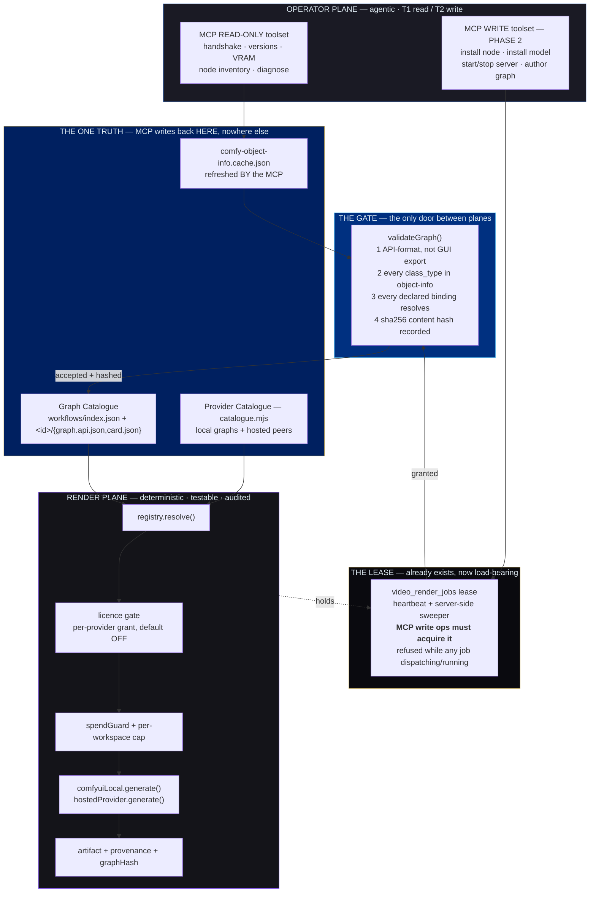
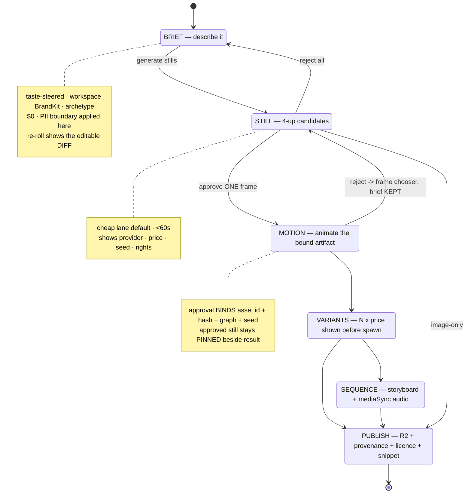
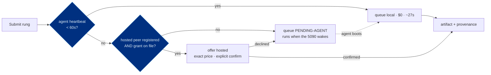
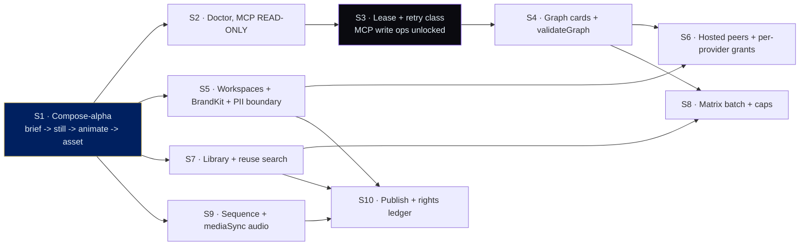

# SWAN ATELIER v2 — BLUEPRINT (panel-reconciled)

**From:** Opus 5 (vs-claude, Final Decider) · 2026-08-24
**Panel:** GLM-5.3 `REVISE` · Ox Alpha `REVISE` · Qwen 3.8 `REJECT` — all three read `ATELIER-V2-COMFY-MCP-REVIEW-PACKET-2026-08-24.md`
**Ground truth:** `origin/main`, read this session. Every `[VERIFIED]` below is a file I opened.
**Detail bar:** Rule 68 — a worker-bot executes each slice with **zero further questions**.

---

## §0 — THESIS

The ComfyUI MCP is not the product. It is a **control plane**. Sean already owns the two halves nobody selling an AI-video subscription owns: a **licence-gated provider registry with a leased, heartbeated, sweeper-backed queue**, and a **context layer** (Swan Brain 4,618 docs + Taste Brain + 11 design archetypes + his own recorded visual taste). Higgsfield sells a wrapper over a backend; the wrapper is the cheap half. v2 builds the half that cannot be bought: **a studio that knows what project it is working on, what that project's brand is, what has already been made, what it cost, and whether it is legal to publish.** The MCP's job is to stop ComfyUI's operational complexity from blocking that — install, diagnose, capability — and nothing more.

---

## §1 — SCHEMA TRUTH: THE MIGRATION IS SMALLER THAN EVERYONE ASSUMED `[VERIFIED]`

This is the finding that reshapes the plan. Qwen called multi-project *"architecturally impossible without a complete rewrite."* Ox called it *"a blank cheque."* Both were reasoning from my packet, which did not include the schema. The schema says otherwise.

`backend/models/VideoRenderJob.mjs` **already carries**:

| Column | Consequence |
|---|---|
| `projectId` UUID **nullable, no association declared** | multi-project is **additive**, not surgery. The only hard tenancy FK is `user_id` → `"Users"` |
| `workflowId` + `workflowVersion` | the graph-card catalogue already has its join key |
| `seedUsed` BIGINT | reproducibility is half-built |
| `parentJobId` UUID | the still→motion ladder and variant lineage already have their field |
| `compiledPrompt` + `brainVersion` | the taste/brief layer was **anticipated by the original author** |
| `idempotencyKey` (per-user, NOT NULL) | double-click protection exists at job level |
| `requiredCapabilities` JSONB | capability routing already modelled |

`backend/models/MediaAsset.mjs` **already carries** `projectId`, `provenance` JSONB, `approvalStatus`, `tags` JSONB, `jobId`, `r2Key`.

**But `project_id` today means an editorial *content project*** (`ContentProject` = title / scriptDraft / shotList / editingHandoff / youtubePackage — one video's production), **not a brand workspace.** So:

> **DECISION.** Add `atelier_workspaces` as a new root table with a **hard FK** (`workspace_id`), seed SwanStudios as row #1. Do **not** overload `project_id` and do **not** use a polymorphic `owner_type/owner_id` — a polymorphic FK is unfalsifiable by the database and will drift (Ox + GLM agree; this is the one place both used the same word).

---

## §2 — THE ARCHITECTURE: TWO PLANES, ONE TRUTH, ONE LEASE



### 2.1 The lifecycle collision — the panel's top finding, and it is REAL `[VERIFIED]`

Ox and GLM independently found the same P0 and they are right. I verified the mechanism:

- `backend/scripts/render-agent.mjs` leases **one job at a time** (`while (!stopping)` → `/lease` → work → report), heartbeat-extended, with a server-side sweeper that requeues on lease expiry.
- `backend/scripts/handlers/generateVideo.mjs` classifies retries by `err.permanent = true`; its own docblock states *"everything else is allowed a retry."*

So: **Doctor uses the MCP's documented start/stop to install a node → ComfyUI dies mid-render → the adapter throws a non-permanent error → the job is retried → on a hosted route, that is a second charge.** Nothing in the current design prevents it.

**The fix is small, because the primitive already exists.** The queue's lease is the arbitration point:

1. Every MCP **write** op (`start`, `stop`, install node, install model) must **acquire the render lease** first, and is **refused** while any job is `dispatching` or `running`.
2. The retry classifier learns one new class: **infrastructure-stopped-mid-render is requeued WITHOUT consuming attempt budget** — it is neither a permanent content failure nor an ordinary transient blip.
3. **MCP ships read-only first** (GLM's cheapest de-risk, accepted): handshake, versions, VRAM, node inventory, diagnosis. Write ops stay dark behind a flag until the lease integration ships and Hermes T2 approval gates them.

### 2.2 Anti-drift: three sources of machine truth become one

Ox's sharpest catch. MCP reports live node inventory; `comfy-object-info.cache.json` is a static cache; the graph card *declares* required nodes. Three sources, no reconciliation → Doctor says healthy, adapter fails at dispatch.

> **RULE. The MCP is an AUTHOR. The catalogue is the TRUTH. `validateGraph()` is the only door.**
> MCP introspection results are written **back into the same artifact the HTTP adapter reads**. If an MCP fact lives anywhere else, the drift trap has been built by hand.

An asset whose `graphHash` is absent from the catalogue is an orphan, and a nightly check reports it. Same shape as licence-as-code: the rule lives in a gate a test asserts, not in a memo.

### 2.3 Custom-node install is arbitrary code execution — treat it as such

Installing a ComfyUI custom node runs third-party Python **on the box that holds `renderAgentAuthService` tokens**. Non-negotiable: Hermes T2 approval + receipt, an allowlist derived from the graph card's `requiredNodes`, pinned `comfy-cli` / `comfy-mcp` versions, and the MCP bound to localhost behind the same class of token auth as the render agent.

---

## §2.4 — SETTLED: the MCP tool surface, probed on the real machine `[VERIFIED]`

The panel's one unanswerable question — *can individual MCP tools be disabled?* — is now answered
against `comfy-mcp 0.10.0` installed on Sean's box. **The answer inverts GLM's read-only-first
de-risk, and makes the lifecycle collision worse, not better.**

**There is NO per-tool enable/disable.** All **39** tools are registered unconditionally with a
bare `@mcp.tool()` at module scope. There is no `--tools` flag (the entry point takes none), no
`enabled_tools` setting, and no tool allowlist. The package's only env vars are
`COMFY_MCP_REMOTE_SHARED_MODELS`, `COMFY_MCP_DEBUG_LOG` and `COMFY_MCP_ASSUME_CONSENT`.

**What it has instead is a per-ACTION consent gate system** — seven named gates that prompt by
default. `COMFY_MCP_ASSUME_CONSENT` takes a comma-separated list of gate tokens (or `all`) to
pre-authorize them. The two spend gates carry an **empty** `consent_token`, which the source
comments describe as holding them "out of the mechanism entirely" — spend cannot be pre-authorized
by env var at all. That is good design and worth mirroring.

**Which tools actually reach a gate** — resolved by AST (walking each tool's call graph three
levels through module-level functions), not by line ranges, because helper definitions sit between
tool bodies and make range-attribution wrong:

| Tool | Consent gate reachable |
|---|---|
| `stop_comfyui` | **NONE** |
| `free_memory` | **NONE** |
| `download_model` | **NONE** |
| `upload_file` | **NONE** |
| `restart_comfyui` | `network_exposure` *(about binding interfaces — not "a render is running")* |
| `launch_comfyui` | `network_exposure` |
| `update_comfyui` | `update_all` |
| `switch_comfyui_version` | `version_switch` |
| `install_node` | `install_node` |
| `partner_generate` | spend — **not pre-authorizable** |
| `run_workflow` | opt-in spend — **not pre-authorizable** |

> **`stop_comfyui` reaches no gate, and cannot be turned off.** It is the exact tool that produces
> the §2.1 collision, it is permanently exposed to any agent connected to the MCP, and it will not
> ask before killing a ComfyUI that has a render in flight. `free_memory` is equally ungated and can
> evict a model mid-run.

*(One honest gap: the resolver did not reach a gate from `generate_image`, while a grep places a
spend-wording reference inside its line range. Treat `generate_image`'s gating as UNRESOLVED, not
as absent — a local or nested call site would defeat a three-level module-scope walk.)*

### What this changes

1. **GLM's "grant the MCP a read-only toolset first" is not available as specified.** The server is
   all-or-nothing. The de-risk survives, but it **moves to the client**: Claude Code denies the
   dangerous tool names via permission rules in `.claude/settings.json`, e.g.
   `mcp__comfyui__stop_comfyui`, `mcp__comfyui__free_memory`, `mcp__comfyui__download_model`,
   `mcp__comfyui__upload_file`. Read-only-first becomes a **deny-list in our config**, not a server
   capability — and that list is ours to audit and version.
2. **S3's lease gate is now load-bearing rather than belt-and-braces.** With no server-side gate on
   `stop_comfyui`, the render lease is the *only* thing that can stand between a diagnosis session
   and a live render.
3. **Mirror the spend design.** `comfy-mcp` deliberately made spend un-pre-authorizable. Our
   per-provider licence grant should be equally un-bypassable by env convenience.

### Machine baseline captured while probing (this is the Doctor payload)

```
ComfyUI   0.33.0   C:/ComfyUI (main.py present)      PyTorch 2.11.0+cu128   CUDA 12.8
GPU       RTX 5090 · 32,607 MiB total · 24,670 MiB free · driver 610.62
Python    3.12.0rc3      comfy-cli 1.17.0      comfy-mcp 0.10.0
custom_nodes: swan_prompt, websocket_image_save   (a clean install — most imported graphs will
                                                   report missing nodes, which is the pain S2 fixes)
```

~8 GB of 32 GB was already committed at probe time with no render running — which is exactly why
admission control reads **live** VRAM rather than a declared floor (§6).

---

## §3 — LICENCE, SPEND, AND THE PARTNER-NODE TRAP

Ox's second blocker, and it would have shipped silently.

**A Comfy Cloud credit balance is not a written grant.** The existing invariant is explicit: `SWAN_VIDEO_PROVIDERS_ENABLED` turns a provider on; `SWAN_VIDEO_LICENCE_GRANTS` records that a grant arrived; **enabling never confers commercial rights.** Registering Kling/Runway/BFL as "ordinary hosted providers" routes paid generations around that gate — Sean renders a hero video for a paying client site, and the output carries a non-commercial licence.

**Rules for every hosted provider added:**

| Rule | Why |
|---|---|
| Each partner provider ships **its own grant switch, default OFF** | credit balance ≠ commercial licence |
| Grants get **effective dating** | an env toggle for a revoked grant is legal exposure that grows with each provider (GLM) |
| **Verify-before-retry** on credit-burning providers | a call billed *then* timed out must not be re-charged by the retry path (Ox). Job-level `idempotencyKey` does not cover the provider call |
| Base URLs come **only from `catalogue.mjs`** | operator-supplied graphs are the design — a graph must never redirect generation at an arbitrary endpoint (SSRF, Ox) |
| `verify()` pre-flight **before commit** | a stale ComfyUI install silently exposes *fewer* partner nodes, so a catalogue-declared route can fail only at submit (GLM) |
| **Per-workspace** spend cap, not just global | one pre-paid pool across ~10 partner providers makes per-provider ceilings ledger fiction unless reconciled against Comfy's authoritative balance |
| Variants show **N × price before spawn** | otherwise "variants" is a 5× surprise |

---

## §4 — THE PII BOUNDARY (both senior seats, independently)

P4's `describe → brief` lane sends Sean's prose into an LLM. For **non-SwanStudios client projects that prose carries client-identifying material**, and `promptPolicy.mjs` governs *provider* prompts — not the brief composer.

> **Required:** an ID-substitution boundary between the brief composer and any model call, plus a per-workspace **LLM-safe corpus** declaration. A workspace is marked `llmSafe: false` by default; nothing from it reaches a hosted model until Sean declares what may leave. Also: free text reaching `swan-brain.mjs` must be quote-escaped — FTS5 `MATCH` injection is live otherwise.

Rule 8 says zero PII to LLMs. Without this boundary the Compose surface violates it by construction on day one.

---

## §5 — THE COMPOSE LADDER



**Where the ladder lies, and the fix.** "Approve" implies the approved still becomes frame one. It does not, unless it is *bound*: same prompt + same seed does **not** reproduce a still (GPU nondeterminism, node/version drift). So approval must bind the **exact asset id + hash** consumed by the first-frame graph, and provenance must record that binding. And a beautiful still can be motion-poor — the copy must say so: *"this becomes frame 1; the motion prompt owns everything after."*

**Reject must return to the frame chooser, not the brief** — otherwise a good brief is thrown away because one frame moved badly.

**Rung invariants — visible without a click at every rung:** provider · price (`$0.00` when local) · expected seconds · render-agent state · seed + graphHash · **commercial-rights status of the output**.

---

## §6 — LOCAL-FIRST HONESTY: THE 5090 IS NOT ALWAYS ON

There is already a GPU idle reaper on main. "Agent offline" is a first-class state, not an error:



This also makes the MiniMax H3 licence outcome irrelevant to the UI: a refused grant just routes to a registered peer.

**VRAM note (corrected):** the render agent is **serial — one lease at a time** `[VERIFIED]`, so queue concurrency cannot OOM itself. Contention comes from Sean's ComfyUI GUI or another process on the same box. Admission control should therefore read **current free VRAM at dispatch**, not a declared floor — but this is a P2, not the P0 the panel assumed.

---

## §7 — WIREFRAMES

### 7.1 Compose — desktop (≥1280px)

```
┌──────────────────────────────────────────────────────────────────────────────────────────┐
│  SWAN ATELIER   [ Workspace ▾ SwanStudios ]          ● agent online · 5090 · 31.2GB free  │
│  ─────────────────────────────────────────────────────────────────────────────────────── │
│  Compose │ Library │ Graphs │ Doctor │ Costs │ Render Queue                                │
├───────────────────────────────┬──────────────────────────────────────────────────────────┤
│  BRIEF                        │   ● Brief ──── ○ Still ──── ○ Motion ──── ○ Publish       │
│  ┌─────────────────────────┐  │                                                          │
│  │ Describe the asset...   │  │   ┌──────────────┐  ┌──────────────┐                     │
│  └─────────────────────────┘  │   │   still 01   │  │   still 02   │                     │
│  ⓘ re-roll shows a diff       │   │   seed 4471  │  │   seed 9120  │                     │
│                               │   └──────────────┘  └──────────────┘                     │
│  Archetype  [02 Cinematic ▾]  │   ┌──────────────┐  ┌──────────────┐                     │
│  Brand kit  Crystalline Swan  │   │   still 03   │  │   still 04   │                     │
│    ▪▪▪▪▪  Jakarta · Cormorant │   │   seed 1180  │  │   seed 7734  │                     │
│                               │   └──────────────┘  └──────────────┘                     │
│  TASTE  from Swan Brain       │                                                          │
│  ▸ NatGeo nature + wildlife   │   Route  ◉ local  flux-krea   $0.00   ~9s   ✓ publishable │
│  ▸ glacier / macro-journey    │         ○ hosted nano-banana  $0.039  ~6s   ⚠ grant OFF   │
│  ▸ 3 refs found  [view]       │                                                          │
│  🔒 workspace llmSafe: true   │   [ Regenerate ]        [ Approve frame → Motion ]        │
│  ────────────────────────     │                                                          │
│  Session $0.00 / cap $5.00    │   graph wan-2.2-t2v @ a91f3c · seed pinned · reproducible │
└───────────────────────────────┴──────────────────────────────────────────────────────────┘
```

### 7.2 Compose — Motion rung (approval is a binding, not a vibe)

```
┌──────────────────────────────────────────────────────────────────────────────────────────┐
│   ● Brief ──── ● Still ──── ● Motion ──── ○ Publish                                       │
├──────────────────────────────┬───────────────────────────────────────────────────────────┤
│  BOUND FRAME  (pinned)       │   RESULT                                                  │
│  ┌────────────────────────┐  │   ┌─────────────────────────────────────┐                 │
│  │      still 02          │  │   │        ▶  0:00 / 0:06               │                 │
│  │      asset 7f3a·9120   │  │   └─────────────────────────────────────┘                 │
│  └────────────────────────┘  │   graph wan-2.2-firstframe @ 7c02ab                       │
│  ◨ side-by-side              │   26.7s · $0.00 · local · seed 9120                        │
│                              │   bound to asset 7f3a — recorded in provenance             │
│  ⓘ this became frame 1.      │   licence ✓ publishable — Wan 2.2, attribution recorded    │
│    the motion prompt owns    │                                                            │
│    everything after.         │   [ ✕ Reject → frame chooser ] [ ⟳ New seed ] [ ✓ Keep ]   │
└──────────────────────────────┴───────────────────────────────────────────────────────────┘
```

### 7.3 Doctor (read-only in slice 2; write ops dark until the lease lands)

```
┌──────────────────────────────────────────────────────────────────────────────────────────┐
│  DOCTOR                          ● read-only mode — write ops require the render lease    │
├──────────────────────────────────────────────────────────────────────────────────────────┤
│  MACHINE                              │  GRAPH READINESS                                  │
│  ComfyUI     0.3.61   ⚠ 4 behind      │  ✓ wan-2.2-t2v          all nodes present         │
│  PyTorch     2.9.0+cu129              │  ✓ wan-2.2-firstframe   all nodes present         │
│  CUDA        12.9                     │  ✕ minimax-h3-t2v       2 nodes missing           │
│  GPU         RTX 5090 · 32GB          │      ComfyUI-VideoHelperSuite    [ Install ⚿ ]    │
│  Free VRAM   31.2GB  (live)           │      ComfyUI-Frame-Interp        [ Install ⚿ ]    │
│  Sage Attn   ✓ matches torch build    │  ✕ ltx-2.5-t2v          weights not downloaded    │
│                                       │                                                    │
│  ⚠ 4 versions behind hides partner    │  COMFY CLOUD                                       │
│    nodes. [ Show what upgrading       │  auth ✓ · credits $18.40 ⚠ low · 37 nodes visible  │
│      unlocks ]                        │                                                    │
│                                       │  ⚿ = installs third-party Python on this box.      │
│  Render lease: FREE (no job running)  │      Hermes T2 approval + receipt. Never silent.   │
└───────────────────────────────────────┴───────────────────────────────────────────────────┘
```

### 7.4 Mobile (375px) — single column, rails become sheets, 44px targets

```
┌───────────────────────────┐
│ ☰  ATELIER   ● agent on   │
│ SwanStudios          ▾    │
├───────────────────────────┤
│ ●─●─○─○  Still            │
├───────────────────────────┤
│ ┌──────────┐ ┌──────────┐ │
│ │ still 01 │ │ still 02 │ │
│ └──────────┘ └──────────┘ │
│ ┌──────────┐ ┌──────────┐ │
│ │ still 03 │ │ still 04 │ │
│ └──────────┘ └──────────┘ │
├───────────────────────────┤
│ local · $0.00 · ~9s · ✓   │
│ ┌───────────────────────┐ │
│ │   Approve → Motion    │ │ 44px
│ └───────────────────────┘ │
│ ┌───────────────────────┐ │
│ │      Regenerate       │ │ 44px
│ └───────────────────────┘ │
│ [ Brief ] [ Taste ] [ $ ] │ ← sheets, never hover-only
└───────────────────────────┘
```

---

## §8 — SLICE PLAN (reordered — the panel overturned my first slice)

I originally put **Doctor** first. GLM and Ox independently argued Compose must be first, citing the recorded failure: *every slice closed honestly and the chain still walked away from the ask, because no slice-level gate re-reads the ORIGINAL request.* Doctor is an operator tool; Sean's complaint is that this is not the application he pictured. **They are right. Reordered.**

Every slice must state **what Sean can do that he could not before.** A slice that cannot is substrate and does not ship alone.



| # | Slice | What Sean can do that he could not before | Notes |
|---|---|---|---|
| **S1** | **Compose-alpha** — brief → 4-up stills → approve (artifact-bound) → animate → asset card. On the **existing** adapter + existing admin routes. Stamp `workspaceId` from day one even before the table has a second row | **Describe an asset and watch it become a picture then a video.** The moment it stops being a job console | **Do not add endpoints to `contentStudioRoutes.mjs` — it is 659 lines against a 300 cap `[VERIFIED]`. Split it first.** |
| **S2** | **Doctor — MCP read-only** — handshake, versions, live VRAM, per-graph node readiness, Cloud auth + credits. Zero write ops | See in one screen why a workflow will not run | MCP introspection writes back into `comfy-object-info.cache.json`, nowhere else |
| **S3** | **Lease + retry class** — MCP write ops acquire the render lease; refused while a job runs. Retry classifier learns *infra-stopped-mid-render* → requeue without consuming attempts | Install a missing node from a button without risking a live render | Unblocks every write op. Hermes T2 + receipt + node allowlist + pinned versions |
| **S4** | **Graph cards + `validateGraph()`** — `workflows/index.json` (explicit index, never a glob — the dir holds `comfy-object-info.cache.json`) + `<id>/{graph.api.json, card.json}` + sha256 | Drop in a graph and be told immediately if it is unrunnable | Ship the manifest schema **in the same PR as its first consumer** or camelCase/snake_case drift is guaranteed |
| **S5** | **Workspaces** — `atelier_workspaces` (hard FK), BrandKit, archetype, per-workspace storage namespace, `llmSafe` flag + PII substitution boundary | Work on a second website without its brand or its client data bleeding | Swan seeded row #1. Per-workspace stage templates — the 9-stage rail is Swan business logic |
| **S6** | **Hosted peers** — partner nodes in `catalogue.mjs`, per-provider grant default OFF, effective-dated, `verify()` pre-flight, verify-before-retry, catalogue-only base URLs | Keep working when the 5090 is off, at a price shown before it is spent | §3 rules are all mandatory here |
| **S7** | **Library + reuse search** | Find what he already made instead of paying to make it twice | Highest value per hour of the back half |
| **S8** | **Matrix batch + caps** | One brief → 24 assets overnight, graded in a grid in the morning | N × price before spawn; hard stop against remaining balance |
| **S9** | **Sequence + mediaSync** | Cut multiple shots against a track using the sync engine proven to 0.0001s | The one capability Higgsfield does not have and Sean already owns |
| **S10** | **Publish + rights ledger** | Ship an asset to a site with licence, attribution and R2 key in one action | Without this the studio is a gallery |

**Storage lifecycle is a standing item, not a slice** (GLM): video artifacts are GB-scale and multiply per workspace; a full disk stalls the queue. Retention + a disk-headroom guard land with S5.

---

## §9 — WHAT I DISPROVED IN THE PANEL (Final Decider ruling)

Rule 30/52: a reviewer's finding is a hypothesis until verified. Four did not survive.

| Claim | Seat | Ruling |
|---|---|---|
| *"`comfyuiLocal.mjs` is at 296/300 — split before touching"* | Ox + GLM | **DISPROVEN. It is 227 lines** `[VERIFIED]`. **The 296 figure came from my own packet**, lifted from an August handoff written before a refactor. I fed a stale number into two reviews and got it back as a blocker. The real cap violation is `contentStudioRoutes.mjs` at **659** — which neither seat could see, because I did not give them the file |
| *"Can non-operator SaaS roles reach content-studio routes?"* (conditional P0) | GLM | **PREMISE FALSE.** Every route is `protect, adminOnly` `[VERIFIED]`; the file says so at :228. Demotes as GLM said it should. Real risk is a *future second collaborator*, not today |
| *"Two 12 GB jobs admitted against a stale reading → OOM on both"* | GLM | **DISPROVEN for the queue.** The agent is serial — one lease at a time `[VERIFIED]`. Contention comes from the GUI or another process. Demotes P0 → P2 |
| *"Multi-project is architecturally impossible without a complete rewrite"* | Qwen | **DISPROVEN.** `project_id` exists as a nullable, unconstrained UUID on both job and asset; the only hard FK is `user_id`. Qwen also assumed a multi-tenant SaaS with end users — this is a single-operator admin tool. Most of its P0s dissolve on that correction. Its `REJECT` does not stand |

**What Qwen got right and both paid seats missed:** Comfy Cloud credits belong to *Sean's ComfyUI account on the local box*, so the backend must never hold that token — the render agent already talks to `127.0.0.1:8188` locally, so the correct design keeps the credential where it already is. And it independently converged on the graph-validator-before-submission requirement.

**The single strongest finding of the whole panel:** the MCP/render-agent lifecycle collision (Ox B1 = GLM B1). I verified both halves of the mechanism and it is real. It became §2.1 and slice S3.

---

## §10 — NON-NEGOTIABLE CONSTRAINTS FOR THE BUILDER

Attached here because Ox was right that burying them at the end of a packet guarantees a worker-bot reaches for MUI.

- **styled-components only. No MUI.** Tokens as `var(--token, #fallback)`, Crystalline Swan fallbacks, dark-first.
- **Dual-Button Glow:** blue bg → purple glow; purple bg → cyan glow.
- **WCAG 4.5:1** minimum contrast. **44px** minimum targets. No hover-only actions. Phone width checked before any slice is called done.
- **300-line file cap.** `contentStudioRoutes.mjs` is already at 659 — split before extending.
- **Victory** for the cost dashboard. Never Recharts.
- **Rule 9 vocabulary:** "stretching"/"flexibility" — never the yoga/meditation terms. **Credentials:** "26+ years", "NASM-protocol" — **never** "NASM-certified". These now bind *generated copy too*: `promptPolicy` gains a per-workspace lexicon (banned + required terms) applied to **all model output**, not just video prompts.
- **Zero PII to LLMs.** §4's boundary is mandatory, not optional.
- **Fail-closed everywhere:** licence gate, per-provider grant, spend guard, `validateGraph()`. An unset binding is a config-time error, never a silent default.
- The three-function provider contract (`capabilities` / `generate` / `verify`) is **reused, never reinvented**.
- MCP write ops are **T2**: lease acquired, approval asked, receipt left.
- Every slice: failing regression test first where feasible; hostile dry-loop until a full pass finds nothing new, before any completion claim (Rule 74).
