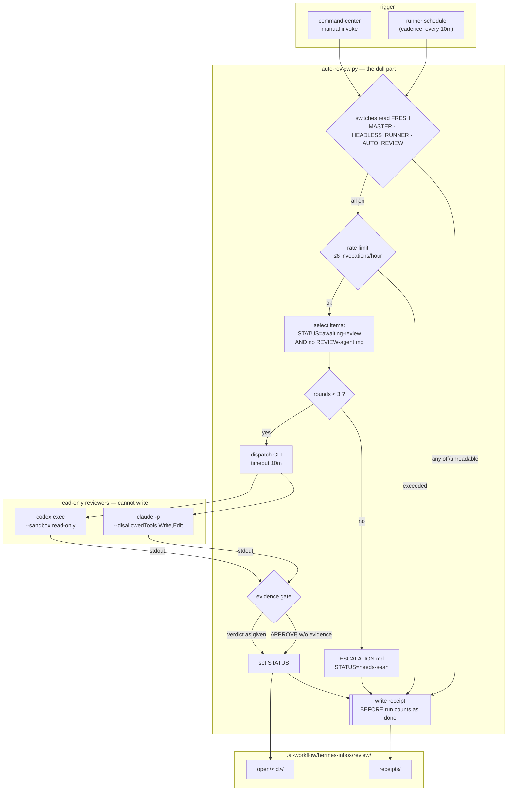
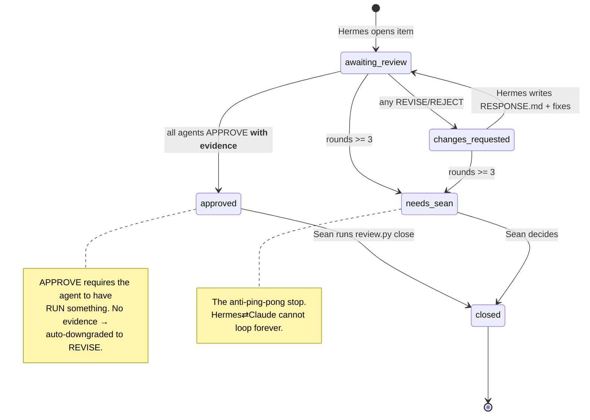

# Auto-Review Runner — Build Blueprint

- **Date:** 2026-08-06 · **Authors:** Fable (governance spec, 2026-07-03) + vs-claude (this implementation)
- **Governing spec:** `docs/ai-workflow/hermes-agentic-os/headless-runner-spec.md` — **CANONICAL, binds this doc**
- **Companions:** `command-effect-registry.md` · `kill-switches.md` · `audit-receipts.md` · `approval-gates.md`
- **Linear:** SWA-154 (safety layer) · related SWA-70
- **Builder contract:** every decision is made here. A builder that must ask a question has found a defect in this document — report it, do not improvise.

---

## 1. Why this exists

Sean hand-copies review prompts from Hermes into Claude/Codex terminals and hand-copies verdicts back. It works, and it is the reason the 2026-08-05 near-miss was caught — Hermes proposed `re-init` on a healthy repo and a human asked for review. It is also slow enough that it will eventually be skipped, and a safeguard that gets skipped is not a safeguard.

**This automates the copy-paste. It does not automate the judgment.** Sean still closes every item.

### The failure mode this must not create

Two agents agreeing is not verification — it is correlated failure with a paper trail. An auto-reviewer that emits `APPROVE` cheaply is *worse* than no reviewer, because the folder fills with green checkmarks nobody reads. Two mechanisms exist solely to prevent this: the **evidence gate** (§7) and the **round cap** (§6). Neither is optional, and neither may be relaxed to make a run succeed.

## 2. What it is / is not

| Is | Is not |
|---|---|
| One registered command on Fable's runner | A new daemon or a parallel scheduler |
| A dispatcher of two enumerated CLIs | An agent that improvises |
| A writer of review files + receipts | A writer of source, commits, or pushes |
| Able to set `STATUS` | Able to **close** an item — closing stays Sean's |
| Able to refuse and escalate | Able to flip its own switch |

Fable §7 binds: *the runner is deliberately less capable than the chat lanes, not equally capable minus the human.* Killing `SWITCH_AUTO_REVIEW` degrades this to today's manual copy-paste with zero loss of governance. That is the recovery posture.

## 3. Registry row

Add to `command-effect-registry.md` (Fable's field order, exactly):

| Field | Value |
|---|---|
| `name` | `auto-review` |
| `description` | Dispatch an open review item's PROMPT.txt to Claude and/or Codex headless; capture stdout as REVIEW-\<agent\>.md; set STATUS. Never closes an item, never edits reviewed work. |
| `owner` | Deterministic Script owner |
| `tier` | **T2** — bounded internal write (review files + receipts, into enumerated paths only) |
| `channels` | `runner`, `command-center` |
| `approval` | `allowlist` (T2 standing) |
| `inputs` | `item: optional item-id (enum: existing dirs in review/open)` · `agent: claude\|codex\|both` · `once: bool` — **no free-text input exists**, so there is nothing to interpolate into a shell |
| `receipt` | verdict per agent, evidence-gate result, rounds-after, switch state read, agent exit code |
| `kill-switch` | `SWITCH_AUTO_REVIEW` (plus `SWITCH_HEADLESS_RUNNER`, `SWITCH_MASTER` per §5) |
| `verification` | Receipt path + REVIEW file path + agent exit code; anyone can re-run the same PROMPT.txt by hand and compare |

Add to `kill-switches.md`:

| Switch | Kills | How | Owner |
|---|---|---|---|
| `SWITCH_AUTO_REVIEW` | All automatic review dispatch; the manual `review.py` loop is unaffected | Panel · phrase `KILL AUTO_REVIEW` · or write `off` to the switches file | Deterministic Script owner |

## 4. Verified environment facts

Do not re-derive these — each was checked on 2026-08-06.

| Fact | Evidence |
|---|---|
| `claude` CLI installed, headless works | `claude -p "…" --allowedTools "Read" --output-format text` returned `HEADLESS-OK status=awaiting-review` |
| `codex` CLI installed, v0.146.1, headless is `codex exec` | `codex --version` → `codex-cli 0.146.1` |
| **Codex is authenticated but OUT OF QUOTA until 2026-08-07 ~20:35** | `codex exec` → `ERROR: You've hit your usage limit` |
| `codex exec` refuses outside a trusted git dir | `Not inside a trusted directory and --skip-git-repo-check was not specified` |
| SwanGuard git is unreachable from WSL (repo is healthy) | `.git` holds a Windows path; Windows git resolves it fine |
| Review channel exists | `scripts/hermes/review.py`, `.ai-workflow/hermes-inbox/review/` |

**Consequence:** build Codex-capable; expect it to return usage-limit output until Aug 7 evening and treat that as a **skipped** run with a receipt — never a crash, never a retry.

## 5. Architecture



**The load-bearing detail:** agents receive the prompt and return **stdout only**. The runner writes `REVIEW-<agent>.md` itself. A reviewer therefore *physically cannot modify the work it is reviewing*. Do not "fix" this by granting Write access.

## 6. Sequence — one full round trip

```mermaid
sequenceDiagram
    autonumber
    participant H as Hermes (Kimi)
    participant R as auto-review runner
    participant C as claude -p (read-only)
    participant F as review/open/&lt;id&gt;/
    participant S as Sean

    H->>F: WORK.md + PROMPT.txt + STATUS=awaiting-review
    Note over R: next schedule tick
    R->>R: read switches FRESH
    R->>F: rounds? (meta.json) → 0 < 3, proceed
    R->>C: PROMPT.txt verbatim, timeout 10m
    C-->>R: stdout (VERDICT + blockers + evidence)
    R->>R: evidence gate
    alt APPROVE with no command output
        R->>R: downgrade → REVISE + AUTO-DOWNGRADED note
    end
    R->>F: write REVIEW-claude.md, STATUS=changes-requested, rounds=1
    R->>F: write receipt (before run counts as finished)
    Note over H: Hermes drains on next session
    H->>F: RESPONSE.md + fixes + STATUS=awaiting-review
    Note over R,F: rounds 2, then 3
    alt rounds reaches 3
        R->>F: ESCALATION.md, STATUS=needs-sean
        R->>S: attention item — loop did not converge
    end
    S->>F: review.py close (ONLY Sean closes)
```

## 7. STATUS state machine



## 8. Wireframes

### 8.1 Terminal output — a normal run

```
$ python3 scripts/hermes/auto-review.py run --once

auto-review · 2026-08-06T07:12:03Z
  switches: MASTER=on HEADLESS_RUNNER=on AUTO_REVIEW=on      [fresh read]
  rate: 2/6 invocations used this hour

  20260806T063714Z-swanguard-demo-to-real-blueprint   rounds 0→1
    claude   dispatched … 3m12s   exit 0
             VERDICT: REVISE   (3 blockers, 2 minor)
             evidence gate: PASS — 4 commands quoted
    codex    SKIPPED — usage limit until 2026-08-07 20:35 (no retry)
    STATUS   awaiting-review → changes-requested
    receipt  review/receipts/20260806T071515Z-swanguard…-claude.json

  1 item processed · 1 dispatched · 1 skipped · 0 failed
```

### 8.2 Terminal output — refused (the boring, correct case)

```
$ python3 scripts/hermes/auto-review.py run --once

auto-review · 2026-08-06T07:22:00Z
  switches: MASTER=on HEADLESS_RUNNER=on AUTO_REVIEW=off     [fresh read]
  REFUSED — SWITCH_AUTO_REVIEW is off. No items examined.
  receipt  review/receipts/20260806T072200Z-refused.json
```

### 8.3 Folder after one round

```
.ai-workflow/hermes-inbox/review/
├── SWITCHES                       ← "on" | "off"   (fresh-read every run)
├── .runner-state.json             ← rolling-hour invocation ledger
├── receipts/
│   └── 20260806T071515Z-swanguard-demo-to-real-blueprint-claude.json
└── open/20260806T063714Z-swanguard-demo-to-real-blueprint/
    ├── WORK.md                    ← Hermes owns
    ├── PROMPT.txt                 ← generated
    ├── REVIEW-claude.md           ← RUNNER writes (from agent stdout)
    ├── RESPONSE.md                ← Hermes owns
    ├── STATUS                     ← changes-requested
    └── meta.json                  ← + rounds, + agent_state
```

### 8.4 `REVIEW-<agent>.md` shape

```markdown
# REVIEW — claude (auto-dispatched)

- **Item:** 20260806T063714Z-swanguard-demo-to-real-blueprint
- **Dispatched:** 2026-08-06T07:12:03Z · duration 3m12s · exit 0
- **Evidence gate:** PASS — 4 command outputs detected
- **Verdict as returned:** REVISE
- **Verdict as stored:** REVISE

---
<agent stdout, verbatim, unmodified>
```

If the gate downgrades, `Verdict as stored` differs and this line is appended verbatim:
`AUTO-DOWNGRADED: APPROVE claimed without evidence of verification.`

## 9. Data contracts

### 9.1 Receipt — Fable's field names exactly (`audit-receipts.md` §2)

```json
{
  "who":         "hermes/runner",
  "what":        "auto-review (T2)",
  "target":      "review/open/20260806T063714Z-swanguard-demo-to-real-blueprint :: claude",
  "when":        "2026-08-06T07:12:03-07:00",
  "approved-by": "allowlist:auto-review",
  "outcome":     "ok",
  "evidence":    "review/open/<id>/REVIEW-claude.md",

  "switches_read":   {"MASTER": "on", "HEADLESS_RUNNER": "on", "AUTO_REVIEW": "on"},
  "agent":           "claude",
  "exit_code":       0,
  "duration_s":      192,
  "verdict_returned":"REVISE",
  "verdict_stored":  "REVISE",
  "evidence_gate":   "PASS",
  "rounds_after":    1
}
```

`outcome` ∈ `ok | failed | refused | partial` — Fable's enum, no additions. A skipped agent is `outcome: refused` with the reason in the honest line.

### 9.2 `meta.json` additions

```json
{ "rounds": 1,
  "agent_state": { "claude": {"consecutive_failures": 0, "demoted": false},
                   "codex":  {"consecutive_failures": 0, "demoted": false} } }
```

### 9.3 `.runner-state.json`

```json
{ "invocations": [ {"at": 1785997923.4, "agent": "claude", "item": "<id>"} ] }
```
Entries older than 3600s are dropped on read. Cap: **6/hour** across all items.

### 9.4 `SWITCHES`

A one-word file: `on` or `off`. **Missing, unreadable, or any other content ⇒ treated as `off`.** Fail closed.

## 10. Build slices — each independently shippable

Numbers are permanent. If one is dropped, mark it VOID; never renumber.

| # | Slice | Acceptance (command + expected) |
|---|---|---|
| 1 | Switch + refusal path | `SWITCHES=off` → run exits 0, prints REFUSED, writes a `refused` receipt naming the switch. Delete `SWITCHES` → identical behavior. |
| 2 | Item selection + rate limit | Seeded fixture with 3 items (one already reviewed) selects exactly 1. 7th invocation in an hour → skipped with receipt, zero CLI calls. |
| 3 | Round cap + escalation | Item with `rounds: 3` → no dispatch, `ESCALATION.md` written, `STATUS=needs-sean`, receipt `outcome: refused`. |
| 4 | Dispatch + capture | With a **stub agent** (env `AUTO_REVIEW_FAKE_CMD`), stdout lands verbatim in `REVIEW-stub.md`; exit code and duration in the receipt. |
| 5 | Evidence gate | Stub returns `VERDICT: APPROVE` + no command output → stored `REVISE` + AUTO-DOWNGRADED line. Stub returns APPROVE **with** a fenced command block → stays APPROVE. |
| 6 | Failure routing | Stub exits 1 twice then 0 → 2 receipted retries with backoff, then ok. Stub emits `usage limit` → single `refused` receipt, **no retry**. Three consecutive failures → `demoted: true`, suspension receipted. |
| 7 | Receipt integrity | Make `receipts/` unwritable → runner HALTS, writes an attention item, does not process further items. |
| 8 | Containment proof | File manifest of the repo before and after a full run: the **only** changed paths are under `review/`. Any other diff = FAIL. |
| 9 | Real end-to-end | `--agent claude --once` against the live SwanGuard item. Show `REVIEW-claude.md` + receipt. |
| 10 | Registry + switch rows | Rows added to `command-effect-registry.md` and `kill-switches.md` exactly as §3. |

**Test harness:** `scripts/hermes/auto-review.test.sh` runs 1–8, prints one `PASS`/`FAIL` per check, exits nonzero on any FAIL. Slices 1–8 use the stub agent — **no real agent calls in the test suite**. Sean runs only this script.

## 11. Do NOT

1. **Do NOT give the reviewing agent write access.** The runner captures stdout. This is the containment property, not a convenience.
2. **Do NOT let the runner close an item.** `approved` is not `closed`. Only Sean closes.
3. **Do NOT let the runner flip any switch**, including its own (Fable §7).
4. **Do NOT retry a usage-limit or auth failure.** Not transient. Skip, receipt, move on.
5. **Do NOT batch-replay missed runs.** A skipped run is logged as skipped, never backfilled.
6. **Do NOT spawn anything but the two enumerated CLIs** with the exact flags in §5. No `shell=True` with interpolated content — there is no free-text input by design (§3 `inputs`).
7. **Do NOT relax the evidence gate to make a run go green.** A cheap APPROVE is the failure this exists to prevent.
8. **Do NOT write outside `review/`.** Slice 8 asserts this mechanically.
9. **Do NOT put secrets, PII, or client data in receipts or review files.** IDs and repo-relative paths only.
10. **Do NOT skip the checkpoint** before the first write (`checkpoint.py create`).

## 12. Questions for Sean only

1. **Cadence** — runner tick every 10 minutes, or event-triggered on STATUS change? (10m is simpler and quieter; event needs a watcher.)
2. **Rate limit** — is 6 agent invocations/hour right? It caps a runaway at roughly one Claude run per 10 minutes.
3. **Round cap of 3** — after 3 unconverged rounds it stops and asks you. Higher wastes money, lower interrupts you more.
4. **Codex from Aug 7** — auto-dispatch both agents on every item, or Claude by default and Codex only on items touching auth/money/data?
5. **Notification** — when an item hits `needs-sean`, do you want a Telegram ping, or is the `review.py status` board enough?

---

*Blueprint ends. A builder needing a decision not made here has found a defect in this document.*
