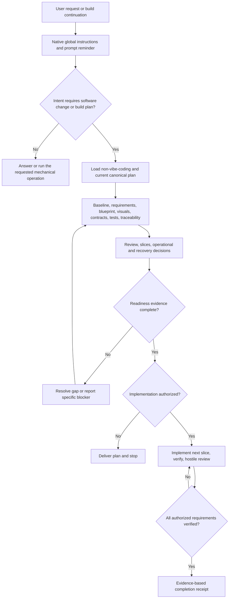
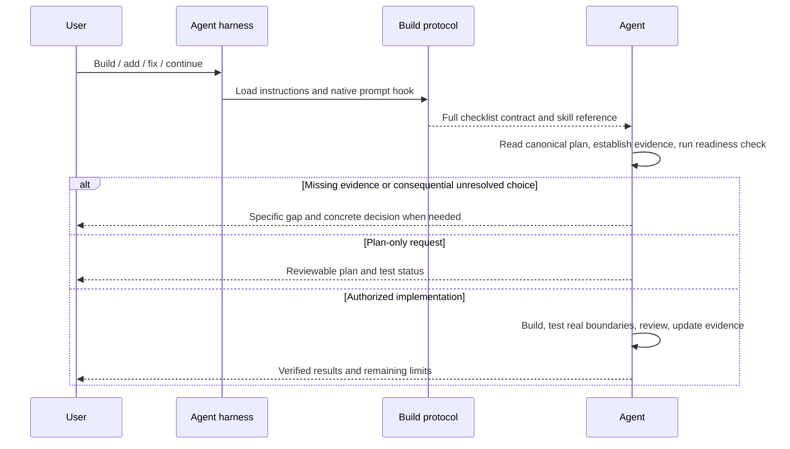

# Mega Blueprints installation and verification

Owner: Sean / Codex. Status: INSTALLED; session refresh and Cursor global UI
configuration remain. Version: 2026-09-06. Scope: coding-agent instructions and
activation adapters; no Swan product runtime changes. Name corrected by Sean
to **Mega Blueprints**. The marker signifies activation, never completion.

## Baseline and scope

- Repository: SS-PT, branch `wip/comms-notifications-2026-07-05`, observed HEAD
  `a89cbf0f0`; dirty shared tree. Preserve all unrelated work and other lanes.
- Existing Codex skill: `~/.codex/skills/non-vibe-coding/SKILL.md`; automatic
  discovery enabled, but no full build-protocol global instruction or hook.
- Windows global Claude instruction contains only `@RTK.md`.
- Existing Windows Codex/Claude hooks route prompt depth, not build readiness.
- Repository CLAUDE/AGENTS mirror initially passes `sync-agents-mirror --check`.
- Active Hermes profile: `/home/bigotsmasher/hermes2/.hermes`; the separate
  `/home/bigotsmasher/.hermes` is explicitly stale and is not runtime authority.
- Hermes has `pre_llm_call` plugins and an existing prompt-depth router.
- Additional installed editor surfaces: Gemini, Cursor, Continue, Kilo, Roo,
  and Copilot. Verify their supported discovery paths before writing adapters.
- New workspaces need global rules. Remote/cloud hosts need their own install
  or repository-contained rules; local installation is not remote coverage.

## Requirements and traceability

| ID | Acceptance criterion | Test / evidence |
|---|---|---|
| R01 | Loaded policy requires the whole applicable checklist for build/change intent and continuation | T01, T03, T04; model compliance is not certified |
| R02 | Plan-only/review-only remain bounded; authorized build proceeds after readiness | Policy scenarios |
| R03 | Every core category is accounted for; conditional N/A needs a reason | Readiness validator negative controls |
| R04 | Runtime evidence stays distinct from planned/unrun/mocked evidence | Validator phase tests and receipt |
| R05 | Existing config, privacy, model routing, and source instructions survive installation | Snapshot/hash, idempotence and diff checks |
| R06 | Active Hermes loader receives the context and skill without paid calls | Plugin manager dispatch + context construction smoke |
| R07 | Global hooks emit valid native formats without echoing user content | Real child-process JSON/text protocol tests |
| R08 | Repo mirror stays exact and new instructions occur before truncation | Mirror check and prefix verification |
| R09 | Global discoverability is measured per surface; unsupported paths are explicit | Installed-file/hash + loader/source receipts |
| R10 | Backups are verified through isolated restore, not file existence | Restore sample hash checks |
| R11 | Exact marker is Mega Blueprints; the audit phrase requires artifact and hook inspection | T01, T03, T04, T05 |

The canonical reusable prompt is [POLICY.md](../../../scripts/build-protocol/POLICY.md).
Its ten-part package includes requirements, architecture, actual UI wireframes,
Mermaid flows, contracts/conditional diagrams, executable tests, traceability,
implementation/operations, hostile review, and an evidence receipt. All categories
must be accounted for together; conditional N/A needs a concrete reason.

## Blueprint

Canonical maintained package: `scripts/build-protocol/` plus the existing
non-vibe-coding skill (upgraded, not replaced with an unrelated workflow).
A compact managed policy block is installed into native global instruction
files. Local native hooks inject a reminder on every prompt, delegating intent
classification to the agent instead of using an incomplete keyword regex.
The reminder remains conditional: conversation and mere compiler execution do
not create a new feature plan. Continuations preserve the active requirement set.

The whole planning set is mandatory for builds, with explicitly reasoned
applicability decisions. A typed readiness validator checks artifact references,
test/evidence links, and phase status; it cannot certify truth or code quality.
It is an agent-run gate, not a universal OS write interceptor.

Activation/audit has no stored user data or product state machine: the stateless
reminder is injected each turn. Installation states are PREPARED -> SNAPSHOT
VERIFIED -> INSTALLED READBACK VERIFIED; a hash mismatch stops the current run.
Rollback restores reviewed originals from the named manifest, preserving any
later user edits by comparing current hashes before restoration.

## Applicability and contracts

- Wireframes: N/A for this headless instruction/hook change; output contracts
  and diagrams define its surfaces. Future UI builds require actual mobile and
  desktop wireframes, with loading/empty/error/recovery/accessibility states.
- ERD: N/A; no application database/schema changes.
- Permissions: installer writes only enumerated native instruction/skill/hook
  paths. Existing provider permissions and production approval rules persist.
- Hook input: native runtime event; content is not logged, copied, or networked.
- Hook output: native additional-context JSON or supported plain context text.
- Failure: missing optional adapter gets an explicit gap; missing canonical
  policy fails installation before overwriting. Backups preserve original bytes.
- Recovery: timestamped source-hash manifest; restore into isolation first.
- No hook calls paid models, reads chats, changes provider defaults, or grants
  new tool permissions. Active session caches require refresh/new session.
- Trust boundary: prompt text never enters a shell command or installer path.
  The fixed hook reads only its local reminder. Backup files may contain private
  pre-existing configuration and stay local; only paths/hashes enter this report.
- Permission matrix: installer = explicitly named user files; hook = local read
  and stdout context; readiness checker = evidence read; agent = existing project
  permissions. No new product role, API, database access, or release authority.
- Performance budget: native hooks have a 5-second timeout; fixed reminder is
  about 1.1 KB. No model/network call is part of hook execution.
- Mermaid sources are included above. A standalone Mermaid renderer was not
  available here; rendered layout/syntax-tool validation is NOT RUN. The Markdown
  host may render the diagrams. No wireframe is required for this headless change.

## Ordered slices

1. S0: inventory and plan (this file), confirm ownership and baseline.
2. S1: policy/skill update and hook/validator tests; observe RED then GREEN.
3. S2: preserve, install managed adapters, regenerate mirror, verify hashes and
   idempotence; no broad replacement of existing configuration.
4. S3: native hook dispatch and Hermes loader tests, hostile review twice,
   final installation/coverage/backup receipt.

## Hygiene and operational ownership

Permanent tooling lives under `scripts/build-protocol`; this file is the single
installation report. Temporary runs go under ignored `tmp/build-protocol-*`.
Private pre-change copies stay in the user's local backup locations. No cleanup
or unrelated docs rewrite. Sean owns policy; installed-file hashes detect drift.

## Evidence and final disposition

S0-S3 completed for the installed-file and adapter scope below. Universal model
compliance and all-platform runtime activation are NOT claimed. PLAN READY,
IMPLEMENTATION VERIFIED and DEPLOYED remain separate evidence levels.

### Native coverage and remaining activation work

| Surface | Installed native entry point | Observed evidence / limit |
|---|---|---|
| Windows Codex | `~/.codex/AGENTS.md`, global skill, `~/.codex/hooks.json` | Native prompt contains Mega, audit phrase, full package; native hooks/list reports our exact hook trusted + enabled |
| Windows Claude Code | `~/.claude/CLAUDE.md`, skill, UserPromptSubmit in settings | Native-format adapter tests pass; use a fresh session; no Claude model call |
| Gemini CLI | `~/.gemini/GEMINI.md` | File installed at native global discovery path; interactive behavior not sampled |
| Copilot CLI | `~/.copilot/copilot-instructions.md` | Personal file installed; repository also has `.github/copilot-instructions.md` |
| Continue | `~/.continue/rules/00-makeer-blueprints.md` | Installed extension source confirms global rule discovery; repo rule also installed |
| Roo | `~/.roo/rules/00-makeer-blueprints.md` | Documented native global directory; interactive behavior not sampled |
| Kilo | `~/.config/kilo/kilo.jsonc` instructions | Added only canonical policy path; retained provider and permission configuration |
| Cursor | `.cursor/rules/00-makeer-blueprints.mdc` | Always-applied rule in THIS repository; future projects need global User Rules UI setup |
| WSL Codex/Claude/Gemini | Respective global AGENTS/CLAUDE/GEMINI files; Codex/Claude hooks and shared skill | Installed hook executes 4/4 scenarios on Linux; native WSL harness trust/loading not claimed |
| Hermes active + private SOUL | `/home/bigotsmasher/hermes2/.hermes/SOUL.md` and `profiles/hermes-private/SOUL.md` | Native loader retains Mega and original privacy rules at 32768 context |
| Hermes plugin | Active profile `plugins/makeer-blueprints`, enabled in config | Real PluginManager loads and dispatches our isolated callback 6/6; existing gateway cache needs restart |
| Other machines, cloud jobs, other repositories | No account-wide write performed | Copy policy into their supported global/project instruction mechanism and verify native loading there |

Internal pre-correction file/plugin IDs remain stable to avoid duplicate hooks
and broken recovery references. All visible instructions, titles and markers use
Mega Blueprints. A backup's historical spelling is preserved as original evidence.

**Startup actions:** Open fresh coding-agent sessions. For Cursor, paste POLICY.md
into Customize -> Rules -> User Rules for future projects; Cursor's Inline Edit
and Tab are outside that documented rule coverage. For Hermes, restart the active
gateway through its existing launcher, then start a fresh session. This run did
not signal its bare WSL gateway: native status showed zero active agents, but no
service restart owner was established. The stale `/home/bigotsmasher/.hermes`
tree was left untouched. WSL Codex may separately require native `/hooks` review.

### Tests and reproducible evidence

| Test | Command / procedure | Observed result |
|---|---|---|
| T01 | `node --test scripts/build-protocol/activation.test.mjs` with `MAKEER_TEST_HOOK` set to the installed hook | Windows 4/4; Linux 4/4; valid native context, unusual prompts, continuation, audit, scope and no prompt echo |
| T02 | `node --test scripts/build-protocol/readiness.test.mjs scripts/build-protocol/install.test.mjs` | 14/14; missing/stale/escaping evidence, core omissions, invalid statuses, ID links, race refusal, backups and idempotence |
| T03 | Active venv Python executes `scripts/build-protocol/verify-hermes.py` | Native manifest, dispatch 6/6, active/private SOUL, privacy at 32768 all PASS; no inference |
| T04 | `codex debug prompt-input 'Did we make a blueprint that?'` and `node scripts/build-protocol/codex-hooks-inspect.mjs <installed-codex.exe>` | Prompt: Mega=true, old visible name=false, audit=true, checklist=true. Hook: trusted, enabled, no warnings/errors |
| T05 | `node scripts/build-protocol/verify-installation.mjs <original-manifest> <correction-manifest>` on each OS | Windows 42 targets + 41 saved/restore pairs; WSL 63 targets + 43 pairs verified |
| T06 | Both installers without `--apply`; `node scripts/sync-agents-mirror.mjs --check` | Zero changes on Windows/WSL; exact mirror, body hash `73acb526f3d59431` |
| T07 | `node --test <installed-non-vibe-coding>/scripts/planning-artifacts.test.mjs` | Existing preservation/inspection/snapshot/restore suite 5/5 |
| T08 | Skill creator `quick_validate.py <installed-non-vibe-coding>`; run `node scripts/hooks/prompt-watcher.mjs` | Skill valid; live watcher output includes Mega precedence and conditional older marker |

Windows combined run T01+T02+T07: **23/23**, exit 0. The Linux T01 run adds four
OS-specific checks; Hermes T03 adds six native dispatch scenarios. These are
deterministic instruction/adapter checks, not evidence every LLM obeys the policy.
No production build/test suite was necessary: frontend/backend were not changed.

Initial RED evidence: original prompt-depth hook failed four activation assertions
for missing full-contract/marker/audit context; replacement passed. Readiness stub
failed seven negative controls before implementation, then all eight passed.
The first sandbox subprocess EPERM was excluded from RED evidence as setup failure.

Codex's native hook-review UI was used to trust only the newly installed hook;
no bypass flag or hand-written trust record was used. Native definition hash:
`sha256:eced87ec2942d34cf7097d455006ac8e767726c14cb821673000146a7a4bc29a`.
The unrelated pre-existing router remains untrusted as found.

Traceability: R01/R02/R07/R11 -> T01/T03/T04; R03/R04 -> T02;
R05/R10 -> T02/T05/T06/T07; R06 -> T03; R08 -> T04/T06;
R09 -> coverage table and T03/T04/T05/T06/T08. S1 owns T01/T02/T07;
S2 owns T05/T06/T08; S3 owns T03/T04 and the hostile-review rounds.

### Recovery and hostile review

Windows manifest root: `C:/Users/BigotSmasher/.agents/backups/makeer-blueprints/`.
Ordered manifest directories:
`2026-09-06T09-30-09.272Z-846332ed`, `2026-09-06T09-41-26.187Z-f52d9a9c`.
Hermes manifest root: `/home/bigotsmasher/hermes2/.hermes/backups/makeer-blueprints/`.
Ordered directories: `20260906T093342Z-9e193a0d`, `20260906T094136Z-2dd4fa17`.
Each directory contains `manifest.json`, preserved originals and isolated restore
copies. T05 re-hashed every pair and each latest installed target after correction.
To restore, verify current after-hash, review the original, and restore only the
owned target; stop on later user changes. Do not replay a whole stale directory.

Review pass 0 found the previous prompt-watcher body still described its older
marker unconditionally. Corrected that sentence to apply only when Mega is inactive.
Round 1 then used the installed Windows adapter, original skill regressions,
negative controls, restore hashes and actual watcher output: **CLEAN**.
Round 2 used the Linux installed adapter, real Hermes loader, separate OS backups,
fresh installer dry-run and repo mirror: **CLEAN**. Privacy, malformed inputs,
stale evidence and concurrent edits were checked; UI/auth/SQL/product performance
checks are N/A because this patch adds no such product surfaces.

PROOF: Windows 23/23; Linux hook 4/4; Hermes 6/6; 105 target hashes and 84
saved-original/restore pairs; zero installer drift; exact CLAUDE/AGENTS mirror.
DRY-LOOP: CLEAN×2 (rounds: 2 after the marker clarification).
Gate Evidence: no frozen product gate applies to this instruction package;
the manifest checker is an integrity aid, not a behavioral certification.

No commit, push, deployment, paid review, model inference or chat-content read.
New permanent artifacts: this report, `scripts/build-protocol`, editor adapters.
Temporary local prompt snapshots/schema output and prechange watcher copies remain
under ignored `tmp/build-protocol-20260906`; retain for verification/recovery and
review before cleanup. No unrelated files were moved/deleted and no continuity
closeout was appended.

### Native mechanism references

Discovery was checked against installed runtimes and these primary references:
[Codex instructions](https://learn.chatgpt.com/docs/agent-configuration/agents-md),
[Codex hook trust](https://learn.chatgpt.com/docs/hooks),
[Claude memory](https://code.claude.com/docs/en/memory),
[Gemini instructions](https://geminicli.com/docs/cli/gemini-md/),
[Copilot personal instructions](https://docs.github.com/en/copilot/how-tos/copilot-cli/customize-copilot/add-custom-instructions),
[Continue rules](https://docs.continue.dev/customize/deep-dives/rules),
[Roo global rules](https://roocodeinc.github.io/Roo-Code/features/custom-instructions/),
[Kilo rules](https://kilo.ai/docs/customize/custom-rules),
[Cursor User Rules](https://prod.cursor.com/docs/rules).
