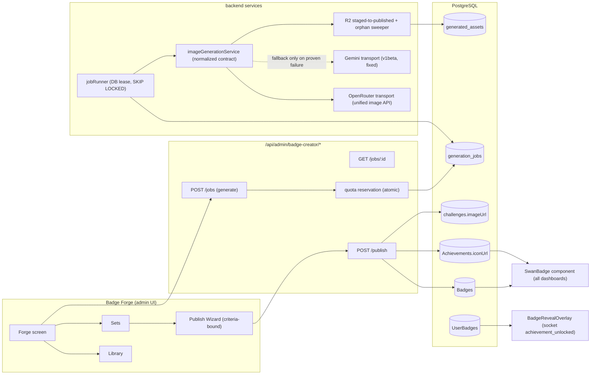
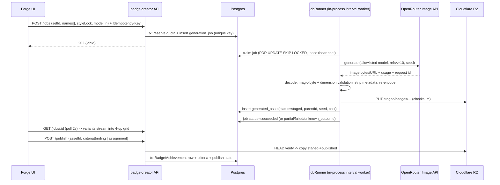

# BADGE FORGE — Comprehensive Blueprint (2026-08-04)

**Author:** Fable 5 (Final Decider). **Inputs:** 3-agent grounded audit of origin/main @ `fa7b96fbc`; Mobbin research; OpenRouter/Seedance landscape (Aug 2026); consults — Sol GPT-5.6 (backend, REVISE verdict folded in), Kimi K3 (hostile UX), HY3 (design taste). Total consult spend ≈ $0.44.
**Consult artifacts:** `BADGE-FORGE-CONSULT-PACKET-2026-08-04.md` (same dir); raw reviews in session scratchpad (fold-ins below are the record).
**Builder contract:** a competent worker-bot builds every slice from this doc with zero further questions (Rule 68). Every slice is independently shippable and hostile-review-gated (Rules 17/61/73).

---

## 0. Problem statement (verified ground truth)

1. **"Ugly basic icons" root cause:** `frontend/public/badges/` is gitignored (`.gitignore:70`); the 726 achievement PNGs the manifest promises exist in NO deploy. Every surface falls back to lucide `<Award/>`/`<Trophy/>`, raw emoji, or literal strings. `Achievements.iconUrl` exists (`Achievement.mjs:83-89`) and create/update APIs accept it (`gamificationController.mjs:1437/:1468/:1514`) — nothing sets it.
2. **Two competing creators:** canonical `/dashboard/admin/badge-creator` (5 tabs, `/api/admin/badge-creator/*`, DB-backed, real 5-way fan-out) vs legacy Content Studio "Badge Assets" tab (`NanoBananaBadgeCreator.tsx`, 706 lines) → `/api/content-studio/generate-badge|save-badge`: retired model `gemini-2.0-flash-exp` (cannot output images → 502), no batch loop, saves to a nonexistent ephemeral path with **false success**. This is the "batch creation broken" symptom.
3. **AI badges are unearnable:** save path hardcodes `criteriaType:'custom_criteria'` (`badgeCreatorRoutes.mjs:104-147`); no evaluator branch satisfies it; `badgeService.mjs:838-848` refuses empty criteria.
4. **Storage truth:** generator is R2-first but silently falls back to Render ephemeral disk when undeclared `R2_PUBLIC_URL` is absent (`geminiBadgeImageService.mjs:96-118, :144-162`). Suspect Gemini API base `v1` vs repo-wide `v1beta` (`:18`).
5. **Display chaos:** no shared badge component; SIX rarity color tables + two tier ladders conflated; only 3 of ~12 mounted surfaces can render an ``; best renderer sits in a dormant folder; `achievement_unlocked` fires only a toast.

## 1. Vision (what ships)

One **Badge Forge** studio (admin) that generates Swan-brand badge art via a multi-model rail (OpenRouter Unified Image API: Nano Banana 2 default / GPT Image 1.5 hero / Seedream 4.5), with style-locked Sets for series consistency; a criteria-bound publish wizard that makes unearnable badges impossible; R2-only durable storage; one shared `SwanBadge` component + one rarity ontology across all dashboards; a badge-reveal celebration; and a jobs-backed backfill that gives all 242 achievements real art. Seedance 2.5 video = feature-flagged slot, zero UI now.

---

## 2. Architecture

### 2.1 System flow (mermaid)



### 2.2 Generation sequence (mermaid)



### 2.3 Publish state machine

`draft → staged → published → retired` (assets); badges: `draft → published(earnable | admin-award-only) → retired`. Retire shows "N users hold this" impact warning; retired badges stay visible to holders (trust invariant — never delete earned history).

---

## 3. Data contracts (all migrations `.cjs`, FKs → `"Users"`)

### 3.1 New tables

**`generation_jobs`** — `id` UUID PK; `createdBy` INT → `"Users".id`; `setId` UUID nullable → `badge_sets`; `kind` ENUM('badge','achievement_backfill','pet_avatar','share_card'); `model` STRING (server allowlist); `promptStructured` JSONB (structured descriptors ONLY — never free user data); `styleLock` JSONB `{anchorAssetId, seed, referenceKeys[], presetId}`; `variantCount` INT; `status` ENUM('queued','running','succeeded','partial','failed','cancelled','unknown_outcome'); `leaseOwner` STRING nullable; `leaseExpiresAt` TIMESTAMPTZ nullable; `attempts` INT default 0; `idempotencyKey` STRING(128) UNIQUE per (createdBy); `requestHash` STRING(64) (reuse w/ different hash → 409); `providerRequestId` STRING nullable; `costUsd` DECIMAL(8,4) nullable; `error` JSONB nullable; timestamps.

**`generated_assets`** — `id` UUID PK; `jobId` UUID → generation_jobs; `parentAssetId` UUID nullable (version tree / re-roll lineage); `r2Key` STRING (identity = object key, NOT URL); `status` ENUM('staged','published','retired','orphan_candidate'); `mime` STRING; `width`/`height` INT; `bytes` INT; `checksum` STRING(64); `seed` STRING nullable; `model` STRING; `styleId` STRING nullable (from style catalog); `moderation` ENUM('pending','passed','blocked') default 'pending'; `costUsd` DECIMAL(8,4); timestamps. Index (jobId), (status), (parentAssetId).

**`badge_sets`** — `id` UUID PK; `name` STRING; `styleLock` JSONB; `season` JSONB nullable `{availableFrom, availableUntil}`; `createdBy` INT → `"Users".id`; `status` ENUM('draft','published','archived'); timestamps.

**`badge_criteria_registry`** (or JSON-schema constants module + DB row per binding — builder choice, but versioned): binding stored on Badge as `criteria = { discriminator, version, params }`; publish REJECTS unless a registered evaluator matches `discriminator@version` and params pass its JSON schema. v1 discriminators: `workout_count@1 {count>=1}`, `streak_days@1 {days>=2}`, `challenge_completion@1 {challengeId}`, `milestone_points@1 {points>=1}`, `admin_award_only@1 {}` (explicitly not auto-awarded — replaces today's dead `custom_criteria`).

### 3.2 Existing-table changes

- `challenges` (canonical lowercase table): ADD `"imageUrl"` VARCHAR(512) nullable + Sequelize `field` mapping declared explicitly. NEVER touch the PascalCase `Challenges` twin.
- `UserBadges`: introspect prod schema FIRST (information_schema), then add a Sequelize model mapped to the EXISTING table (no guessed twin); verify `unique_user_badge_ownership`. Add `pinnedOrder` INT nullable (profile showcase) in the same introspection-verified migration.
- Register `Badge` in `models/index.mjs`/associations once; then remove dynamic imports call-site by call-site (verify same instance).
- `Badges`: ADD `rarity` ENUM('common','rare','epic','legendary') as a REAL column (today rarity hides in `criteria.metadata`); backfill from metadata; case-normalize on write.

### 3.3 Provider contract (normalized — Sol S1)

`imageGenerationService.generate(req) → ProviderResult`:
```
req:   { model, promptStructured, negative, seed?, referenceKeys?[], size, mime, timeoutMs, idempotencyKey }
result:{ ok, images:[{bytes|url, mime, width, height}], providerRequestId, actualModel,
         billedUnits, costUsd, finishReason, moderationBlocked?, raw? (redacted-logged only) }
```
Rules: server-side model **allowlist** (`nano-banana-2` = `google/gemini-3.1-flash-image`, `gpt-image-1.5`, `seedream-4.5`) — capability discovery informs the table, never populates the picker (No-Grok stays enforced by the allowlist). URL-vs-base64 normalized to bytes; magic-byte + MIME + dimension validation; metadata stripped; SVG/active formats rejected. Fallback to Gemini-direct ONLY when the primary is **proven failed** (network refusal / 4xx before acceptance) — never after ambiguous timeout (double-billing; Sol #3). `unknown_outcome` + providerRequestId reconciliation instead. Gemini transport fixed to `v1beta` (probe test first — currently `[HYPOTHESIS]` that `v1` fails; the slice includes an executed probe per Rule 55).

### 3.4 API surface (all under existing `protect, adminOnly` guard + object-level ownership checks)

| Endpoint | Purpose |
|---|---|
| `POST /api/admin/badge-creator/jobs` | create generation job (Idempotency-Key required; 409 on same-key-different-hash; atomic quota reservation) |
| `GET /jobs/:id` · `GET /jobs?setId=` | poll status + variants (ownership-checked) |
| `POST /jobs/:id/cancel` | cancel queued job |
| `POST /assets/:id/publish` | wizard commit: criteria binding OR admin-award; staged→published R2 copy; writes Badge/Achievement/challenge rows in ONE tx, ordered badge→criteria→challenge-link |
| `POST /assets/:id/retire` | retire w/ holder-count impact response |
| `GET /health` extended | per-transport health + storage health (`r2: ok|local-fallback`) |
| legacy `/api/content-studio/generate-badge|save-badge` | cutover: canonical live → frontend redirect → observe traffic → authenticated **410 Gone** → remove (Sol #1) |

Existing `/generate`, `/generate-batch`, `/save`, `/upload`, gallery/marketplace endpoints remain during migration; batch UI moves onto `/jobs`; old endpoints route through the same quota+idempotency service or 410 (no quota-bypass paths).

### 3.5 Idempotency + quota

- Job creation: `Idempotency-Key` per admin + requestHash. Award paths keep established formats (`badge:${userId}:${badgeId}`, `achievement:${userId}:${achievementId}`).
- Backfill assets: deterministic key `achv-backfill:{achievementId}:{styleId}:{promptVersion}` — re-runs skip existing; non-null `iconUrl` skipped by default.
- Quota: atomic reservation row in the job tx (not count-then-insert); month boundary UTC; charge per requested variant, reconcile down on failure. Per-admin monthly cap + global cap env-tunable; cost meter reads the same table.

### 3.6 Privacy boundary (the #1 risk — Sol (f))

- v1 reference images = **curated non-human Swan brand library only** (server-side asset IDs; no arbitrary upload to providers). Admin's own generated assets may be anchors (they're already provider-derived).
- Prompts are built from structured descriptors (badge name ≤60 chars, style preset id, rarity) + trusted brand prefix/suffix. NEVER interpolate user/client/profile/workout data. Client-side PII lint + server-side reject (names/emails/digit-runs) on the free-text badge-name field. Text-in-image banned in the negative prompt (Kimi: AI text is the #1 cheap tell).
- Logs store structured fields + redacted prompt; raw provider responses never logged unredacted; `OPENROUTER_API_KEY` already in the logger redaction list — keep base-URL host allowlist for any `OPENAI_BASE_URL` override.

---

## 4. Design system (HY3 + Kimi fold-in; router doctrine applies at build time)

### 4.1 Ontology — each system owns ONE visual channel

| System | Channel | Spec |
|---|---|---|
| Rarity | **Ring color + glow** | ONE map exported from `types/gamification.ts` as **token refs**: common `var(--rarity-common,#4070C0)`, rare `var(--rarity-rare,#C6A84B)`, epic `var(--rarity-epic,#8B5CF6)`, legendary animated conic gradient (ice→gold→purple). The six existing tables are DELETED, not consolidated. Rarity is never color-only: ring + text label + shape tick (a11y/colorblind). |
| Swan tier (bronze→platinum) | Material/finish overlay on art | desaturated→polished→iridescent filter; pips row under badge at M/L |
| RPG forge tier | Frame geometry (corner notches) | visible at L, gracefully absent at S |
| Progress-to-unlock | Ring fill (radial track) | locked = greyscale art + visible ring outline (greyscale-on-obsidian contrast trap: outline is mandatory) + "18/25" label |

### 4.2 `SwanBadge` (the one shared component)

Props: `size: 'S'|'M'|'L'` (32/64/160), `art: {url}|null`, `rarity`, `tier?`, `rpgTier?`, `locked?`, `progress?: {current,target}`, `reduceMotion` (auto from media query). Behaviors: null/failed art → branded swan-silhouette placeholder (NOT lucide; one retry then fallback); unknown rarity → normalized or 'common' with a `console.warn` + telemetry, never silent; legendary animation = ring-only, `transform`-composited, plays on reveal/hover-focus/first-paint-of-showcase then settles to static gradient; static under `prefers-reduced-motion`; `will-change` applied on entry, removed on settle; grids of badges NEVER animate box-shadow/filter. Files (≤300 lines each): `SwanBadge.tsx`, `SwanBadge.styles.ts`, `rarity.ts` (canonical map), `SwanBadge.test.tsx`.

### 4.3 Forge screen (desktop wireframe — Kimi's corrected single-screen)

```
┌──────────────────────────────────────────────────────────────┐
│ Set: Winter Arc ▾    Model: [NB2][GPT-1.5][SD4.5]  ◉R2 ok    │ ← context bar: set, model buttons
│ Quota: 38/50 · est $0.31 left this month                     │   + storage-health dot + cost meter
├───────────────┬──────────────────────────────────────────────┤
│ Badge name    │   ┌─────┐ ┌─────┐ ┌─────┐ ┌─────┐            │
│ [textarea —   │   │ v1  │ │ v2  │ │ v3  │ │ v4  │            │ ← 4-up live grid (job poll)
│  one per line │   └─────┘ └─────┘ └─────┘ └─────┘            │
│  for batch]   │   card hover: ★anchor  ↻same-seed  ✓keep     │   (44px targets each)
│ Style chips   │                                              │
│ [Glass][Clay] │   Session history ▸ (collapsed filmstrip)    │
│ [Metal][+17]  │                                              │
│ Refs: [swan🔒]│                                              │
│ Seed: [42137] │                                              │
│ Advanced ▸    │                                              │
├───────────────┴──────────────────────────────────────────────┤
│ Kept (3) → [Bind criteria & publish ▸]  (opens WIZARD drawer)│ ← collapsed rail; publish is a
└──────────────────────────────────────────────────────────────┘   3-step wizard, never inline
```
- **Style Lock:** starring a variant makes it the Set's style anchor (its image joins refs, seed+prefix pinned); later generations only prompt the *variable* part. Anchor promotion allowed ("set as new anchor").
- **Batch = quantity, not a tab:** one line per badge name in the textarea, parse-on-blur to chips; "Re-roll unkept" regenerates only rejects under the same lock.
- **Publish wizard (3 steps, slide-over drawer; full-screen sheet on mobile):** ① Criteria (registry-driven form; `admin_award_only` is an explicit labeled choice) → ② Challenge/Achievement link (optional; shows exactly which rows will be written) → ③ Review & publish. Unearnable-and-unlabeled is unrepresentable.
- **Mobile (<768px):** two-view toggle Controls/Grid — never a squeezed side-by-side.
- IA: **Forge / Library / Sets** (Library absorbs gallery+marketplace as a `draft/published/retired` filter — "marketplace" framing dies; Sets carries season/expiry + shared style lock).
- First-run: one seeded example Set from the 20-style catalog so the studio never opens empty. Quota-full and R2-degraded states designed (amber dot + tooltip; generation disabled with reason when on local-fallback storage — loud, not silent).

### 4.4 Reveal moment (`achievement_unlocked` → `BadgeRevealOverlay`)

Sequence ≤3.5s, skippable at 1s: scrim+focus-trap (200ms, `role="dialog"`, `aria-live="assertive"`) → sealed silhouette (600ms) → ignition: conic ring sweep + greyscale→color crossfade + one `navigator.vibrate(30)` (800ms) → rest: name, rarity label, flavor, **[Share] [View in collection]**. Bottom sheet on mobile; queue multiple unlocks (show highest rarity, "+2 more" chip); dedupe by durable event id (socket replay/reconnect safe); persisted dismissal; reduced-motion = fade-to-rest only. Share = static story-card render to R2 (badge + ring + Swan mark) — the future Seedance 2.5 animated share card slots HERE behind `SHARE_CARD_VIDEO_ENABLED` (zero studio UI now).

### 4.5 Display-surface migration map (sequenced — NOT one PR)

Wave A (data-ready surfaces): admin AchievementManagerCard, admin BadgeGallery/Marketplace panels, user HomeTab rail chips (fix positional→rarity colors). Wave B (shape fixes required): About achievements grid (string icon → SwanBadge), Observatory Top Badges (carry imageUrl through controller), Client "Recent unlocks" rail (stop discarding imageUrl), ClientRewardsPage loadout (Shield-for-everything → SwanBadge + fix missing-legendary rarity map by deleting it). Wave C: AdvancedGamificationPage rows, trainer client-progress achievements (different entity — map or explicitly keep lucide + label), admin overview widget (ALSO move `/api/gamification/leaderboard` → `/api/v1/...`). Each wave = its own slice + visual QA at 320/414/768/1440/2560.

### 4.6 Ranked product features (consult consensus)

1. `SwanBadge` + canonical rarity map (fixes all surfaces' brand floor)
2. Badge reveal overlay (the payoff moment; currently a toast)
3. Badge detail modal w/ provenance ("how earned, when, part of which Set", progress if locked)
4. Progress-to-unlock on locked badges (core-loop next-action)
5. Scarcity stat "Owned by X%" (Opal pattern; also admin criteria-tuning signal)
6. Profile showcase/loadout (`UserBadges.pinnedOrder`, drag rail, 3–6 pins)
7. Seasonal/limited Sets (needs Sets infra)
8. Trainer surface: "client earned Epic X" feed line off the same socket event (coaching opener)
Explicitly rejected: badge trading/gifting, badge-count leaderboards, AR, node-canvas studio, capability-matrix UI, third transport (Recraft stays quarantined dead code).

---

## 5. Build order — numbered slices (each independently shippable, hostile-gated)

| # | Slice | Contents | Acceptance (executed, not asserted) |
|---|---|---|---|
| 0 | **Env + probe truths** | Declare `R2_PUBLIC_URL` (+ render.env.example entries for R2_*/GEMINI_*/OPENROUTER_*); supertest probe of Gemini `v1` vs `v1beta` (Rule 55); storage-health in `/health` | probe output recorded; health returns `r2: ok` in prod; art survives a redeploy |
| 1 | **Schema foundation** | `.cjs` migrations: generation_jobs, generated_assets, badge_sets, `Badges.rarity`, `challenges.imageUrl`; UserBadges introspection + model + `pinnedOrder`; Badge registration | migrations up+down green on prod-shaped DB; `noMjsMigrations` test green; model↔table drift test per Rule 58 |
| 2 | **Provider rail** | `imageGenerationService` + OpenRouter transport (allowlist 3 models) + fixed Gemini fallback (proven-failure-only) + bytes validation/re-encode + cost capture | unit: URL/base64/moderation/truncation/unknown-outcome paths; integration: 1 real NB2 generation lands in staged R2 |
| 3 | **Job runner + quota** | DB-lease worker (SKIP LOCKED, heartbeat, resume), atomic quota reservation, Idempotency-Key API, `/jobs` endpoints | kill-worker-mid-job test resumes without double-charge; concurrent same-key → one job; 409 on hash mismatch |
| 4 | **Criteria registry + publish wizard API** | registry v1 (5 discriminators), `/assets/:id/publish` single-tx ordered write, evaluator branches wired into badge sweep, **durable award outbox** (event row written in the core tx so a crash between commit and sweep is replayable — Sol #11; sweep consumes the outbox instead of firing best-effort-only) | failing→passing regression: generated badge with `workout_count@1` auto-awards via real workout path, exactly one UserBadges row + one PointTransaction; kill-process-between-commit-and-sweep test replays the award |
| 5 | **Forge UI** | Forge screen (files ≤300 lines: canvas, control rail, variant card, history rail, wizard×3, style-lock hook), Sets, Library w/ publish-state filter | Playwright: 12-badge set flow ≤ documented clicks; mobile toggle; quota/R2 states render |
| 6 | **Legacy cutover** | Content Studio tab → canonical redirect + one-time "N badges here were never persisted" notice; observe; authed 410 on legacy endpoints | network tab: legacy POSTs 410; no console errors; notice shows once |
| 7 | **SwanBadge + rarity unification** | component + token map; DELETE six tables; Wave A surfaces | vitest + axe: rarity not color-only; reduced-motion static; visual QA matrix |
| 8 | **Reveal overlay + share card (static)** | queue, dedupe, bottom-sheet mobile, share render to R2 | socket replay test: one celebration per event id; reduced-motion path; share object in R2 |
| 9 | **Achievement backfill + manifest retirement** | job-runner batch, 242 × ONE style first, deterministic keys, dry-run + admin progress UI, skip non-null; then manifest retirement in strict order (Sol #7): style catalog copied into DB/constants → every `getBadgeImage()` consumer migrated (Wave A did the mounted ones) → repo grep confirms zero runtime reads → delete `badgeImageResolver.ts` + both manifests + un-gitignore is NOT needed (dir stays dead) | dry-run report; resume-after-kill; all 242 `iconUrl` non-null; spot-check 10 rendered dashboards; `rg getBadgeImage` returns only archive hits before deletion |
| 10 | **Display Waves B + C** | shape fixes + endpoint modernization per §4.5 | per-surface receipts (Rule 26); legacy leaderboard path retired |
| 11 | **Detail modal, progress-to-unlock, scarcity, loadout** | features 3–6 of §4.6 | e2e per feature; scarcity query indexed |
| 12 | **Seasonal Sets + trainer feed line** (optional wave) | season fields already in schema; trainer socket consumer | e2e; season expiry hides from earn, never from holders |

Deploy shape: Rule 70 batch cadence; additive-backend → compatible-frontend ordering inside each slice; old-frontend/new-backend compatibility test at slices 4, 6, 10.

## 6. Risks & mitigations (top 6)

1. **PII → providers** (highest): §3.6 boundary + blocking privacy integration test (brand ref passes; name/email/EXIF-GPS fixtures rejected pre-request). Reference uploads beyond the brand library stay disabled in v1.
2. **Double-billing on fallback:** proven-failure-only fallback + `unknown_outcome` + providerRequestId reconciliation.
3. **R2/DB divergence:** staged keys, checksum + HEAD verify before publish, orphan sweeper (daily), object-key-as-identity.
4. **Backfill quota blowout:** 242 not 726; own budget line + dry-run; per-admin caps don't apply to system backfill but a global cap does.
5. **Award duplication (badge+achievement+challenge trio):** one canonical award identity decided at publish (achievement references the badge art; only ONE of them carries points), ordered single-tx write, established idempotency keys.
6. **Visual regression across 12 surfaces:** wave sequencing + per-wave viewport QA + per-surface canonical receipts.

## 7. Rollback

Each slice = separate commits (Rule 70). Kill switches: `BADGE_FORGE_JOBS_ENABLED` (falls back to existing sync `/generate`), `SHARE_CARD_VIDEO_ENABLED` (off), legacy 410 reversible by remount, migrations all have tested `down()`. Backfill is additive (`iconUrl` nullable) — revert = null-out by key prefix.

## 8. Open items for Sean

1. **Model spend ceiling:** per-admin monthly generation cap default (proposal: 100 variants) + global USD cap env (`BADGE_GEN_MAX_USD_MONTH`, proposal $25).
2. **Marketplace tab:** Kimi recommends killing the framing (publish-state filter instead). Adopted in this blueprint — veto if you want a true cross-admin marketplace later.
3. **Art direction final call:** metallic/crystalline/gemstone series (HY3 winner) — 4 anchor images will be generated in slice 5 for your taste-cut before the 242 backfill (slice 9 blocks on your pick).
4. **Render env:** confirm `GEMINI_API_KEY`/`OPENROUTER_API_KEY`/`R2_PUBLIC_URL` present on the backend service before slice 0 verification.
