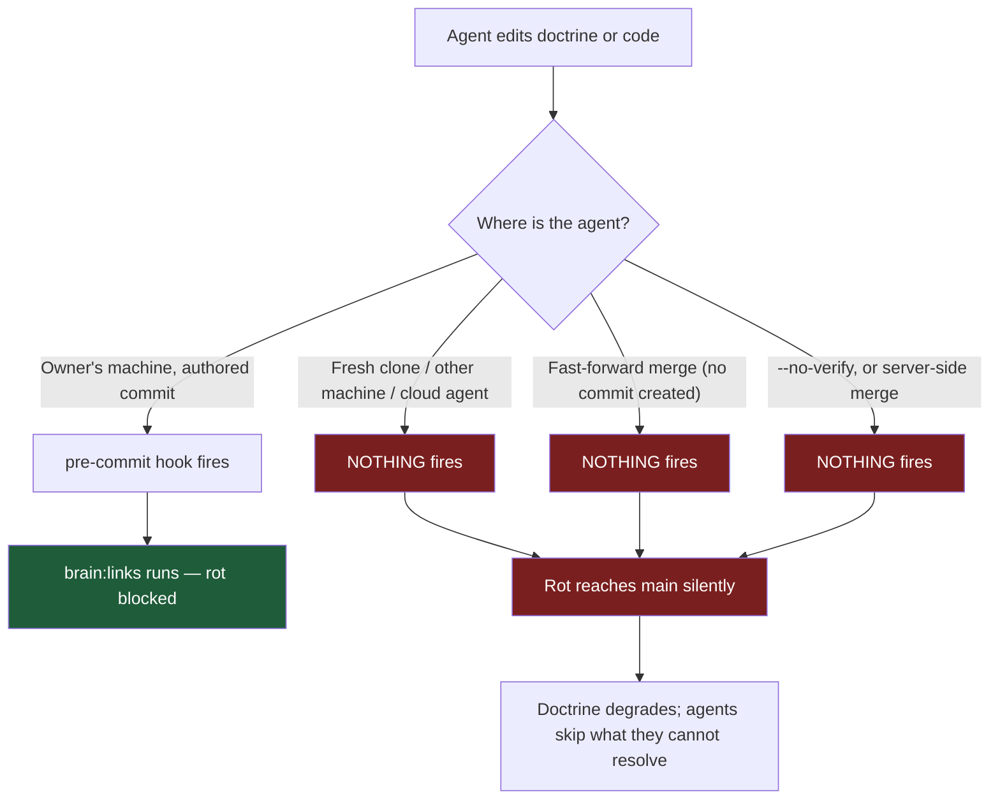
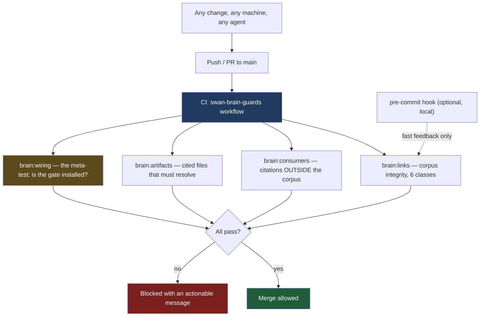
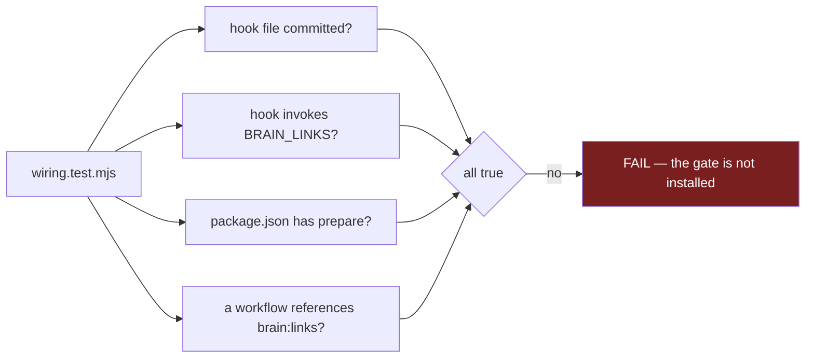
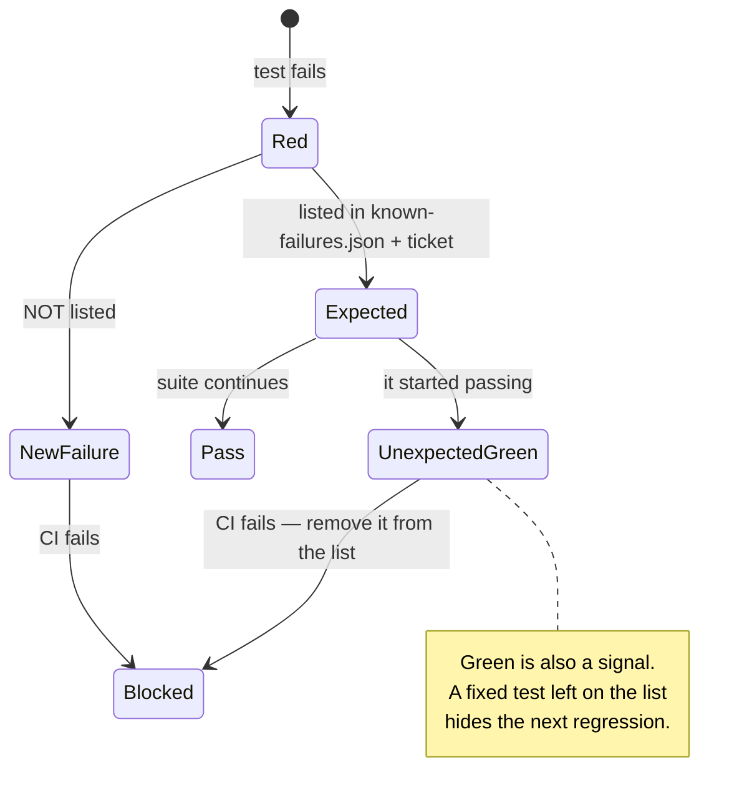
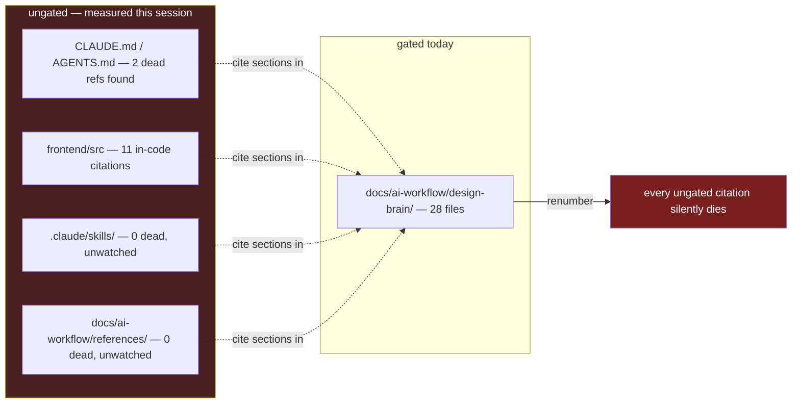
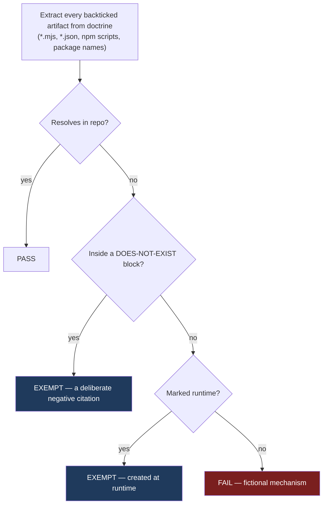
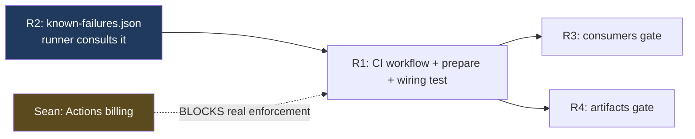

# BLUEPRINT — Gate Hardening: make the guard travel, and stop trusting memory

- **Author:** Claude Opus 5 · **Date:** 2026-08-18 · **Status:** BLUEPRINT — for hostile review BEFORE any code
- **Base:** `main` @ `e66de4ca6`
- **Reviewers requested:** Kimi K3, HY3, GLM-5.3

> **Why a blueprint first:** the defect this work fixes is *a mechanism that was real but did not travel*. Reviewing a design costs a fraction of reviewing a build, and the failure mode here is architectural, not syntactic. Attack the shape before it exists.

---

## 0. WHAT MEASURING CHANGED BEFORE I WROTE A LINE

I proposed four items from reasoning. Grounding them against `main` **corrected two of the four**. That is the point of this section — the reviewers should know which parts survived contact.

| # | As I proposed it | What measuring showed | Status |
|---|---|---|---|
| R1 | Add CI + a `prepare` script | **A working precedent already exists** — `.github/workflows/swan-lens-guards.yml`, whose own header says *"the guards were shipped as npm scripts wired to NOTHING… A guard nobody runs is not a guard."* Someone solved this exact problem here and I shipped the defect anyway. | **Unchanged in intent, but copy the precedent rather than invent** |
| R2 | Pin the known-red tests as data | Holds. The suite reports `not ok 1 - World Engine doctrine contract` with no machine-readable expected-failure set. | **Unchanged** |
| R3 | Extend the gate past its folder | Holds, and I already have a validated scanner from the session that found 11 in-code citations and 2 constitution refs. | **Unchanged** |
| R4 | Audit "enforced by" claims — expect more fictional ones | **WRONG as scoped.** Only 4 strings match that phrasing and 3 are false positives. The nine fictional mechanisms were never prose — they were a **list of named artifacts**. Re-measured on the real target: **17 file-like artifacts cited in doctrine, 0 genuinely unresolvable.** The 5 apparent misses are 4 deliberate negative citations in a DOES-NOT-EXIST block plus one runtime artifact. | **RE-SCOPED: a standing gate, not a cleanup sweep** |

**R4 is the important correction.** I recommended a sweep on the theory that "the hit rate suggests more." The hit rate is currently zero, because the one file that had them was fixed. Building a cleanup for a clean corpus would have been theatre. What is worth building is the **gate that stops the next one entering** — and it needs two exemption classes I would not have designed without measuring.

---

---

## 0.5 STOP — THE THIRD CORRECTION, AND IT GUTS R1's FOUNDATION

I told reviewers to assume a third unfound correction existed. I went looking, and found it by verifying the one assumption underneath everything: **that CI can enforce anything in this repo.**

It cannot. Two independent, measured reasons:

### (a) CI is completely dead

```
gh run list --limit 15
→ 15 of 15 runs: startup_failure, 0s
```

Every run. Including **my own pushes from minutes ago**, on `main`, on branches, on PRs. Not a workflow bug — all four workflow files parse (valid `name:`/`on:`/`jobs:`, no tabs), Actions are **enabled** with `allowed_actions: all`.

Repo is **private**, so Actions consume paid minutes. The billing endpoint requires a `user` auth scope I do not have and **will not self-grant**. So the honest boundary: narrowed to a billing/minutes cause with high confidence, **not verified**. `[HYPOTHESIS]` on the cause; `[VERIFIED]` on the effect.

**A handoff from 2026-08-13 already said this** — *"CI is dead. All 30 most recent runs are startup_failure"* — and I was five days from repeating the same design on top of it without checking.

### (b) Even fixed, CI could not block a merge

```
gh api repos/.../branches/main/protection
→ 403: "Upgrade to GitHub Pro or make this repository public"
```

**Branch protection is unavailable on this plan.** There is no "require checks to pass before merge." So a green CI is *advisory*; a red CI blocks nothing but a conscience.

### What this does to the blueprint

> **The sentence "CI is the authoritative fix" is false for this repository as configured.** I wrote it, both reviewers were asked to evaluate it, and it rests on infrastructure that does not exist.

And the precedent I cited in §0 as the model to copy — `swan-lens-guards.yml`, whose header preaches *"A guard nobody runs is not a guard"* — **has itself never run a single time.** It is a fictional mechanism with an excellent comment. That is the disease this whole workstream is about, sitting in the file I was about to imitate.

### Revised options — this is now Sean's decision, not mine

| Option | What it buys | Cost |
|---|---|---|
| **1. Fix Actions billing, then ship the workflow** | Real cross-machine enforcement, advisory only (no branch protection) | Sean-gated: billing/minutes. Unblocks four existing dead workflows too. |
| **2. Make the hook the primary surface, honestly** | Works today, zero infra. Covers commit-authoring on machines that ran `npm install`. | Bypassable by `--no-verify`, fast-forward merge, or never installing |
| **3. Make the gate trivially runnable + loud, accept social enforcement** | Honest about a repo with no enforcement plane | Depends on humans and agents remembering |
| **4. Public repo** | Unlocks free Actions minutes + branch protection | A business decision, not a technical one. Out of scope for me to recommend. |

**My position:** option 1 **plus** option 2, in that order — but **option 1 is blocked on Sean** and nothing I build changes that. Until it clears, R1 ships a workflow that will sit at `startup_failure` alongside four others, and I should say so plainly rather than call it enforcement.

**This is why the blueprint went to review before the build.** Four hours of implementation would have produced a fifth dead workflow and a canon line claiming it enforces something.

---

## 1. THE SHAPE OF THE PROBLEM



**Three of four paths to `main` bypass the guard.** The guard is correct; its distribution is not.

### Target shape



**CI is the authority; the hook is convenience.** `brain:wiring` is the guard that guards the guard.

---

## 2. R1 — MAKE THE GATE TRAVEL

### What ships

| Artifact | Purpose |
|---|---|
| `.github/workflows/swan-brain-guards.yml` | Runs the gate on push + PR to `main`. Modelled on the existing `swan-lens-guards.yml`. |
| `package.json` → `prepare` script | Sets `core.hooksPath=.githooks` on `npm install`. **Convenience, not the fix.** |
| `scripts/design-brain/tests/wiring.test.mjs` | The meta-test. Asserts the gate is *installed*, not merely correct. |

### The meta-test is the novel part



Every one of these is a repository fact, checkable from a fresh clone. **A gate with 73 behavioural tests and zero installation tests can be perfectly correct and completely absent** — that is exactly what shipped.

> **CORRECTED by HY3 (F1, HIGH) — the meta-test is CIRCULAR for half its job.** Checks B/C/D read files from disk and are sound. Check **E** ("a workflow references `brain:links`") is not: it only executes *because* a workflow invoked it. **If the workflow is deleted or stops calling the gate, the test never runs, so it can never fail.** It validates the case that cannot happen and is silent on the case that can.
>
> **Resolution:** scope `brain:wiring` to the repo facts it can actually assert (hook committed, hook invokes the gate, `prepare` present) and **document the limit in the source**, since an unstated limit is how a mechanism becomes the next fictional one. Detecting "the workflow vanished" needs a surface *outside* CI — branch protection would be the normal answer, and §0.5 shows this repo cannot have it. **So that hole stays open and gets stated, not papered over.**

### CI output wireframe

```
┌─ Swan Brain Guards ────────────────────────────────────────────┐
│ ✔ brain:links      28 files · 75 refs · 0 defects              │
│ ✔ brain:consumers  2,031 files · 428 citations · 0 dead        │
│ ✔ brain:artifacts  17 cited · 17 resolve · 2 exempt            │
│ ✔ brain:wiring     hook ✔  prepare ✔  workflow ✔               │
└────────────────────────────────────────────────────────────────┘
```

Failure form — **every failure must name the fix**, because a correct failure that reads as gate rot gets the gate deleted:

```
✖ brain:artifacts  1 cited artifact does not resolve

  docs/ai-workflow/design-brain/design.md:14
    cites `canon/tokens.json` — no such file in the repo

  If this artifact was never built, delete the claim or move it into a
  DOES-NOT-EXIST block. If it exists elsewhere, cite the real path.
  If it is created at RUNTIME, mark it: `probe.json` <!-- runtime -->
```

### Open question for reviewers

`swan-lens-guards.yml` is `paths:`-filtered to `frontend/src/**`. Should the brain workflow filter on `docs/ai-workflow/design-brain/**` + `scripts/design-brain/**`, or run **unfiltered**? Filtering is cheaper; unfiltered catches a consumer edited far from the corpus — which is precisely the R3 failure mode. **My inclination: unfiltered for `brain:consumers` and `brain:wiring`, filtered for `brain:links`.** Tell me if that split is wrong.

---

## 3. R2 — PIN THE KNOWN-RED SET AS DATA

Today nothing distinguishes *expected red* from *new red* except a human remembering. Two `verify-world-engine` subtests are red on `main` for a pre-existing reason (SWA-170).



### Shape

`scripts/design-brain/known-failures.json`:

```json
{
  "_comment": "Expected failures. Each MUST carry a ticket. Red may only shrink deliberately.",
  "expected": [
    {
      "suite": "scripts/__tests__/verify-world-engine.test.mjs",
      "test": "World Engine doctrine contract",
      "reason": "external-reference receipt/fallback contract is incomplete",
      "ticket": "SWA-170",
      "since": "2026-08-16"
    }
  ]
}
```

**Both directions fail the build:** an unlisted failure, *and* a listed test that now passes. The second is the one people forget — a stale entry silently absorbs the next real regression.

### Open question

Should an expected-failure entry **expire** (e.g. 60 days), forcing a re-decision? It prevents permanent quarantine, but a hard expiry could break CI on an unrelated day. **My inclination: warn at 60 days, never auto-fail.** Reviewers: is that too soft?

---

## 4. R3 — EXTEND THE GATE PAST ITS OWN FOLDER

The corpus is gated. Its **consumers** are not — and consumers are where the rot actually bites, because that is where an agent reads a pointer and acts on it.



### Shape

`scripts/design-brain/check-brain-consumers.mjs` — **imports** `refsIn()` / `sectionsOf()` from the gate rather than copying them. The session already proved why: a verbatim copy is a fork with good intentions, and duplicating that grammar is what caused a miss earlier.

Three result classes, deliberately distinct:

| Class | Meaning | Verdict |
|---|---|---|
| **DEAD** | citation into the corpus that does not resolve | **FAIL** |
| **QUOTED** | a defect deliberately quoted in a review/handoff doc | **exempt by marker**, not by directory |
| **PROSE** | "the Two-speed law" — a title-form reference | **report-only**, no instrument exists yet |

**The QUOTED class is mandatory, not optional.** Measured this session: review documents that *discuss* dead references necessarily *contain* them, and the count grew every time anyone reviewed it. Without a marker, this gate fails on its own evidence.

### Open question

Directory-exemption (`AI-HANDOFF/**`) is trivial but wrong — it means a real dead ref in a handoff is never caught. Marker-exemption (`<!-- quoted-defect -->`) is correct but requires authors to remember. **My inclination: marker, with the failure message teaching the marker.** Reviewers: is the friction worth it?

---

## 5. R4 — CITED-ARTIFACT RESOLUTION (RE-SCOPED)

**Not a cleanup sweep.** Measured: 17 file-like artifacts cited in doctrine, **0 genuinely unresolvable**. The corpus is clean *right now* because the one bad file was fixed. This is a standing gate so the next one cannot enter.



**Both exemption classes are real and were discovered by measuring, not by design:**

1. **Deliberate negative citations.** `design.md` now contains a DOES-NOT-EXIST list naming `canon/route-manifest.json` and three siblings *precisely so nobody re-cites them*. A naive gate flags the very fix that prevents the defect.
2. **Runtime artifacts.** `probe.json` is described as an "overwrite-only heartbeat" — it exists at runtime and never in the repo.

**Without exemption class 1, this gate would fail on the commit that cured the disease.** That is the sharpest thing measuring produced.

### Open question

npm scripts and package names (`stylelint-config-swan`, `canon:build`) were among the nine fictional mechanisms. Extending the gate to resolve those means parsing `package.json` scripts and `node_modules`. **My inclination: include npm scripts (cheap, `package.json` is right there), exclude package names (a devDependency absent in CI is a false positive).** Reviewers: right call?

---

## 6. BUILD ORDER AND WHY

```mermaid
gantt
    dateFormat X
    axisFormat %s
    section Foundation
    R1 CI + wiring meta-test        :0, 3
    section Depends on R1
    R2 known-failures pinning       :3, 5
    R3 consumers gate               :3, 6
    R4 artifacts gate               :3, 5
```



> **CORRECTED by HY3 (F2, HIGH) — my original order was wrong.** I had R1 alone first. But the two known-red `verify-world-engine` subtests are red on `main` *today*. Activating a CI suite before R2 exists means **the very first run fails on expected red**, and the predictable human response is `continue-on-error` or `--allow-fail` — which permanently defeats the gate on day one. **R2 must land before, or in the same change as, R1.**

**Revised order: R2 → R1 → (R3, R4 in any order).**



Every other item adds a check, and adding checks to a gate that does not run multiplies nothing — but adding a gate that goes red on arrival is worse than not adding it, because it teaches everyone to bypass it.

R3/R4 are independent of each other and can land in any order after R1.

---

## 7. WHAT I AM NOT PROPOSING, AND WHY

- **No cleanup sweep for R4** — measured zero unresolvable artifacts. Building a cleanup for a clean corpus is theatre.
- **No prose/title-reference gate** — no instrument exists, and I will not ship a check I cannot prove fails correctly. Report-only until someone builds a title index.
- **No auto-fix anywhere.** Every gate reports and blocks; none rewrites doctrine. An auto-fixer editing canon is a worse failure than the rot.
- **No dedupe of the three consult-header copies here** — that is SWA-172, separate concern, already ticketed.

---

## 7.5 REVIEW RESULTS — three models, and the hole none of us should have missed

All three returned. **GLM and Kimi independently found the same structural defect**, which neither I nor HY3 caught.

### The finding: running is not blocking

> **GLM:** *"A workflow file makes CI run. It does not make CI blocking… You fixed 'the guard didn't travel' and left 'nobody has to pass the guard' unstated."*
>
> **Kimi (F-1, CRITICAL):** *"A workflow that runs but isn't required is the local hook defect reproduced one layer up — present, correct, and non-blocking."*

Authority is **four repository settings**, not a file: the check listed as a *required status check*, direct pushes to `main` restricted, and so on. **None appear in my artifact table, and none are visible from a fresh clone — so `wiring.test.mjs` is structurally blind to all of them.**

**This composes with §0.5 into the complete picture, and it is worse than either half:**

| layer | state | consequence |
|---|---|---|
| CI executes | **dead** — 15/15 `startup_failure` | nothing runs |
| CI can block | **impossible** — branch protection needs Pro on a private repo | nothing can be required |
| workflow ≠ required check | true even with both fixed | running still would not block |

**Enforcement is structurally unreachable on this repository's current plan.** Not "needs a build" — needs a plan change or public visibility. That is an owner decision and no amount of code moves it.

### The best single idea from the round — Kimi F-3 (HIGH)

> *"CI proves the gate is **installed**; nothing proves it still **detects**. A gate neutered to always exit 0 passes all four wiring assertions."*

**Fix: a canary fixture.** A planted dead-ref file the gate must flag, asserting exit ≠ 0. One fixture separates *"the gate ran"* from *"the gate works"* — and this workstream already produced the precedent, when a CRLF bug made the checker report CLEAN over a broken corpus.

### Remaining findings, all accepted into the design

| ID | Severity | Finding | Disposition |
|---|---|---|---|
| Kimi F-2 | HIGH | **R2 has no enforcement surface** — no workflow is named that runs `verify-world-engine`, so the pinning is "an npm script wired to nothing, inside the blueprint that exists to fix that defect" | Name the job; assert its existence in the wiring test |
| Kimi F-4 | MED | Wiring test matches **strings, not semantics** — satisfied by a commented-out job, a `paths:` filter matching nothing, and it cannot detect its own deletion | Strip comments; assert `on:` covers push+PR to `main`; assert every `paths:` entry resolves; self-deletion tripwire |
| Kimi F-5 | MED | R2's state machine omits the **orphaned entry** — a renamed or deleted test silently drops its quarantine, no signal | An entry matching no executed test fails, same as unexpected green |
| Kimi F-6 | MED | Both exemptions are **parsing-fragile** — an innocent heading rename re-breaks the gate on the commit that cured the disease | Explicit `<!-- does-not-exist:start/end -->` delimiters; marker scoped to line or fence; report exemption counts so marker-spam is visible |
| Kimi F-7 | MED | The **unexpected-green message has no design** — "a gate that goes red *because a test passed* violates every agent's mental model of what red means." That is the 2am deletion moment | Spec the copy before build; steady-state output must distinguish expected-red from new-red |

### What this does to the recommendation

**Do not build R1 as an enforcement story.** It cannot be one here. The honest framing:

- **R2, R3, R4 deliver real value with zero infrastructure** — they run locally and in any runner, they are loud, and they catch rot the moment someone runs them. Ship those.
- **R1 becomes "make it easy and loud", not "make it enforced"** — until the owner decides on plan/visibility.
- **Canon must say `npm run brain:links` is the invocation, and must not claim CI enforcement.** Writing "enforced by CI" while CI is dead would be the same defect a third time.

---

## 8. WHAT I WANT FROM THIS REVIEW

1. **Is the CI-authoritative / hook-convenience split right**, or is a hook that silently does nothing worse than no hook at all?
2. **Is the wiring meta-test real protection, or ceremony?** It asserts repository facts, but it lives inside the thing it checks.
3. **The four open questions** in §2, §3, §4, §5 — each is a judgement call I have taken a position on and could be wrong about.
4. **What have I not proposed that I should have?** The measured re-scope of R4 came from grounding; assume there is another one I have not found.
5. **Kimi specifically:** the failure-message wireframes in §2 are a UX surface — an agent reading a red gate at 2am decides whether to fix it or delete it. Is the copy doing that job?
