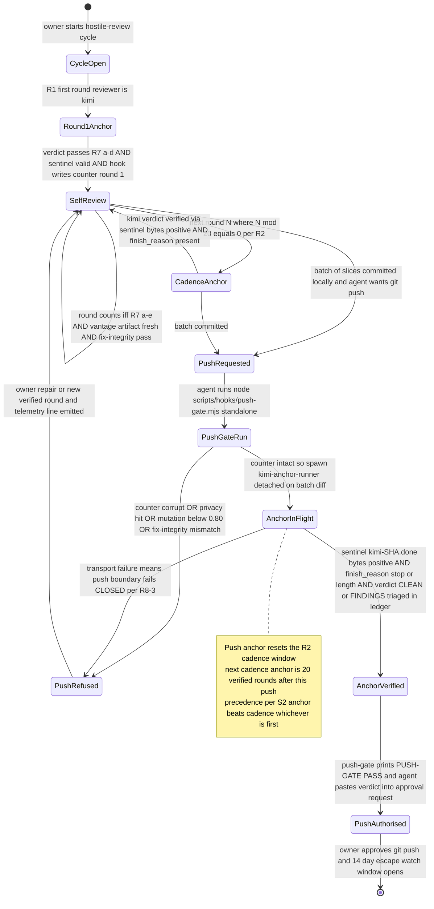
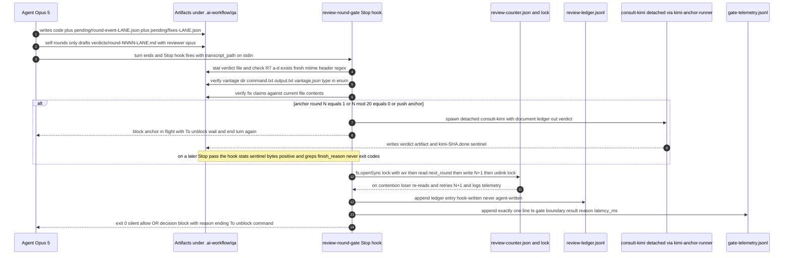
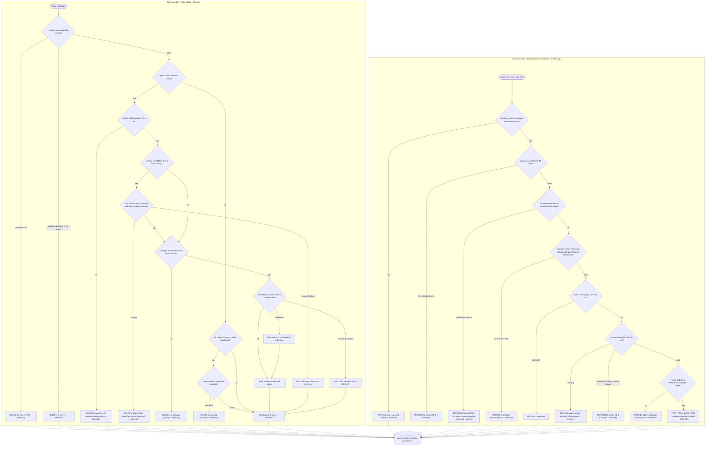
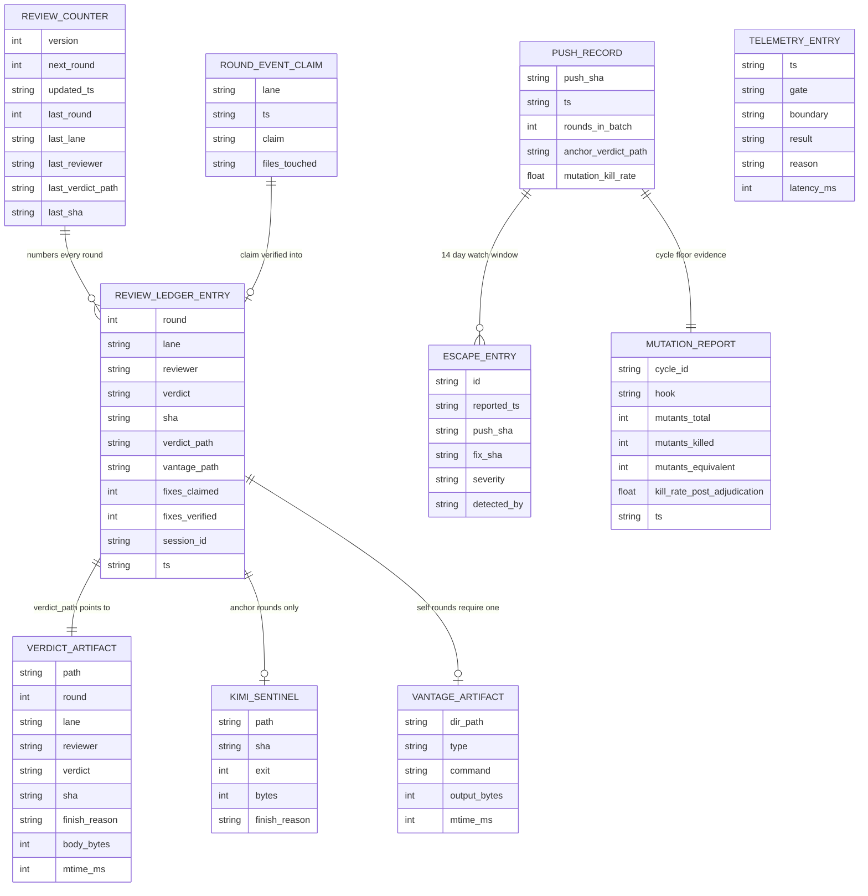

# Kimi K3 - Review

**Reviewer:** `moonshotai/kimi-k3` (high)
**Document:** docs/ai-workflow/AI-HANDOFF/KIMI-PACKET-hostile-review-architecture-plan-2026-08-12.md
**Seed:** (none)
**Tokens:** 4533 in / 12415 out | **Cost:** ~$0.1998 | **Wall:** 113.5s | **finish_reason:** stop

---

# BUILD PLAN — PART A (Deliverables 1–6)

System name: **hostile-review gate system**. All paths are repo-relative. All surfaces are terminal/file only — per S8, no UI or design rubric applies, and ANSI colour is never the sole carrier of gate semantics (every block/allow is textual). Parts 7–12 follow in a separate call.

---

## 1. Decision summary — T1–T5 resolved

**T1 — Paid anchor placement: R1/R2 kept, plus one mandatory push-boundary anchor. R1/R2 alone is insufficient; this is the minimum addition.**
R1 and R2 stand as specified (Kimi opens every cycle; Kimi every 20th verified round). But rounds 2–19 are self-review, which is the plateau my original review diagnosed as load-bearing — no termination rule the authoring mind executes can exceed its own beliefs, and the fifth-pass defect cited in the packet is exactly the failure mode. The batch-push cadence is the deciding fact: because slices accumulate locally and push once per session, a push-boundary Kimi review of the **full batch diff** costs roughly one paid call per session — frequently *fewer* paid calls than the every-20-rounds cadence alone, and it is the only call that reviews precisely the code that rounds 2–19 self-approved. Per the adopted precedence rule (S2: anchor beats cadence), the rule is: **a paid anchor fires at round 1, at every round N where N mod 20 = 0, and at every push — whichever condition arrives first; a push-boundary anchor resets the cadence window** (the next cadence anchor is 20 verified rounds after the push). Cost: ~1 extra high-effort Kimi call per session (observed wall time 219s/654s, run detached per S6 so it never blocks a turn). Benefit: no push reaches the remote carrying only self-reviewed code. This is justified cost; I am not overriding R1/R2, I am adding the push anchor my own finding ① requires.

**T2 — Counting unit: the hook-verified round (R7), numbered by a hook-owned counter at `.ai-workflow/coordination/review-counter.json`.**
The unit is one round satisfying R7(a)–(e). Not a task, not a slice — slices vary in size and are agent-defined, hence gameable; the round is the only unit the hook can verify. The counter file is written **only by hooks**, never by the agent. Format (literal):

```json
{"version":1,"next_round":7,"updated_ts":"2026-08-12T14:03:11.204Z","last":{"round":6,"lane":"claude","reviewer":"opus","verdict_path":".ai-workflow/qa/verdicts/round-0006-claude.md","sha":"9f2c...40hex"}}
```

Concurrency per S3: writer acquires `.ai-workflow/coordination/review-counter.lock` via `fs.openSync(lockPath, 'wx')`; stale-lock TTL 120 s (lock mtime older than 120 000 ms → force-unlink and retry once); the loser re-reads the counter and retries with N+1; every contention event appends one telemetry line. Missing/corrupt counter: at the **turn** boundary, fail open + telemetry (R8 limits fail-closed to push); at the **push** boundary, fail closed until the owner runs `node scripts/hooks/review-counter-repair.mjs --confirm`, which rebuilds `next_round` by scanning `.ai-workflow/qa/verdicts/round-*.md` and the ledger, prints the reconstruction, and requires the literal flag `--confirm`.

**T3 — Compensation for self-review rounds 2–19: three machines, not doctrine.**
(a) **Mechanical-vantage requirement.** A self-review round (reviewer `opus` or `codex`) counts only if a vantage artifact exists at `.ai-workflow/qa/vantages/round-<NNNN>-<lane>/` containing `command.txt` (the literal command) and `output.txt` (captured stdout/stderr, bytes > 0), both with mtime inside the current session, and `vantage.json` whose `type` field is in the closed enum `["locale-rerun","golden-corpus","mutation-run","double-parse"]`. Anything else — including any "re-read as security reviewer" framing — is rejected mechanically by enum membership, not by judgement. Vantages are executed by `node scripts/hooks/vantage-run.mjs --type <t> --round <NNNN> --lane <lane> -- <cmd>`, which captures the output itself; the agent invokes it but never writes `output.txt`.
(b) **Fix-application integrity.** The agent's fix claims live in `.ai-workflow/qa/pending/fixes-<lane>.json` as `[{"file":"...","pattern":"...","expect":"present|absent"}]`. `fix-integrity-gate.mjs` greps each claimed file's current content: `expect:"present"` requires the pattern to match, `expect:"absent"` requires it not to. Any mismatch blocks the turn — this is the machine that catches "8 of 9 hunks landed."
(c) **Mutation-calibrated termination.** Per S7: `mutation-harness.mjs` seeds 10 mutants per hook per cycle against `scripts/hooks/*.mjs` from the fixed operator set {string-literal swap, regex-anchor removal, boundary off-by-one, negated condition}; equivalent mutants are adjudicated in writing in `docs/ai-workflow/mutation-equivalents.md`; post-adjudication kill rate below **0.80** refuses termination at the push boundary. 80% because the four operators are syntactic, not semantic — a suite that cannot catch a negated condition or a removed regex anchor in *its own gate* has demonstrated it cannot catch the defect classes the gate exists to catch; 100% is unattainable due to equivalent mutants, and 80% post-adjudication is the floor that leaves no room for a nominal suite.

**T4 — Enforcement placement: turn boundary verifies rounds; push boundary is law.**
Stop hooks (30 s cap, turn boundary): `review-round-gate.mjs` (R7 verification, counter increment, ledger append, vantage check), `fix-integrity-gate.mjs`, `privacy-boundary-gate.mjs`. Stop hooks **never** invoke `consult-kimi.mjs` synchronously (S6); anchor rounds spawn it detached and block the turn as "anchor in flight" until the sentinel appears on a later pass. Push boundary: `push-gate.mjs`, run **standalone** by the agent (because `git push` is permission-gated to the owner, per S6 the agent pastes the gate's printed verdict into the push approval request), plus a `.git/hooks/pre-push` shim that calls the same file so a manual push is also gated. The push gate enforces, in order: privacy scan of the batch diff, counter integrity, mutation floor, batch fix-integrity, push-anchor sentinel for HEAD sha. Turn gates are UX (fast feedback); the push gate is the only boundary whose verdict authorises anything.

**T5 — Failure semantics: telemetry on every run; fail-closed set is exactly R8.**
Telemetry contract: **every** gate run — allow, block, or error — appends exactly one line to `.ai-workflow/qa/gate-telemetry.jsonl`: `{"ts","gate","boundary","result","reason","latency_ms"}`. This is the fix for the blind spot that a crashed gate and a satisfied gate are observationally identical: after this change, silence itself is the crash signal, and `push-gate.mjs` asserts the telemetry file's last line is younger than the session start before printing PASS. Fail-closed is exactly the R8 set: (1) privacy boundary — gitignored content staged, PII-pattern match in LLM-bound artifacts, *or the privacy scanner itself erroring* (justified under the adopted precedence `privacy boundary` outranking everything but R5) — block, no waiver; (2) counter missing/corrupt at push — block until repair; (3) mandated anchor transport failure — turn fails **open** + telemetry, push fails **closed**. Everything else fails open + one telemetry line. Every block message ends with `To unblock: <literal command>` (S11).

---

## 2. Architecture overview

**Components and ownership**

| Component | Path | Owns | Boundary |
|---|---|---|---|
| `review-round-gate.mjs` | `scripts/hooks/review-round-gate.mjs` (Stop) | R7(a)–(e) verification; counter increment under lock; ledger append; vantage check; anchor spawn | Turn |
| `fix-integrity-gate.mjs` | `scripts/hooks/fix-integrity-gate.mjs` (Stop) | fixes-<lane>.json claims ↔ working-tree content | Turn |
| `privacy-boundary-gate.mjs` | `scripts/hooks/privacy-boundary-gate.mjs` (Stop + PreToolUse on `git commit`) | gitignored-staged detection; PII regex over LLM-bound artifacts | Both — fail-closed |
| `push-gate.mjs` | `scripts/hooks/push-gate.mjs` (standalone + `.git/hooks/pre-push` shim) | counter integrity, mutation floor, batch fix-integrity, anchor sentinel; prints `PUSH-GATE:` verdict | Push |
| `kimi-anchor-runner.mjs` | `scripts/hooks/kimi-anchor-runner.mjs` | detached spawn of `consult-kimi.mjs`; writes sentinel | Tool |
| `vantage-run.mjs` | `scripts/hooks/vantage-run.mjs` | executes mechanical vantages; captures `output.txt` itself | Tool |
| `mutation-harness.mjs` | `scripts/hooks/mutation-harness.mjs` | mutant generation/kill measurement; writes mutation report | Tool |
| `review-counter-repair.mjs` | `scripts/hooks/review-counter-repair.mjs` | owner-run counter reconstruction | Owner |
| `escape-log.mjs` | `scripts/hooks/escape-log.mjs` | append escapes; compute escapes/push report | Owner/tool |
| `consult-kimi.mjs` | existing | paid transport; writes verdict artifact | Tool |

**Persisted state** (all gitignored, under `.ai-workflow/`): `coordination/review-counter.json`, `coordination/review-counter.lock`, `coordination/review-ledger.jsonl`, `qa/verdicts/round-<NNNN>-<lane>.md`, `qa/kimi-<sha>.done`, `qa/vantages/round-<NNNN>-<lane>/{command.txt,output.txt,vantage.json}`, `qa/pending/{round-event,fixes}-<lane>.json`, `qa/mutation-<cycle_id>.json`, `qa/escapes.jsonl`, `qa/gate-telemetry.jsonl`.

**Trust boundary — the core rule:** gate decisions may depend **only** on (i) hook-written state (counter, ledger, telemetry), (ii) tool-written state (verdict artifacts from `consult-kimi.mjs`, sentinels, vantage outputs, mutation reports), and (iii) git itself (HEAD sha, diff). Agent-written state — transcript text, `round-event-<lane>.json`, `fixes-<lane>.json`, self-review verdict drafts — is treated as **claims to be verified, never as evidence**. The agent can draft a self-review verdict file, but it counts only after the hook validates R7(a)–(d) against the filesystem and then performs the R7(e) counter write itself. A turn claiming a review without (a)–(e) is treated as NO review; no waiver string exists anywhere in the system.

---

## 3. Mermaid — state diagram of one hostile-review cycle



---

## 4. Mermaid — sequence diagram of a single review round



---

## 5. Mermaid — gate decision logic, both boundaries



---

## 6. Mermaid — ER diagram of persisted state

Field names and types below are literal. All JSON stores are one object per line (`.jsonl`) except `REVIEW_COUNTER`, which is a single JSON document rewritten under lock. `VERDICT_ARTIFACT` and `KIMI_SENTINEL` are files; their "fields" are the parsed frontmatter/sentinel JSON the hook extracts.



Literal storage notes (binding): `review-counter.json` is the single document shown in §1-T2. `review-ledger.jsonl`, `escapes.jsonl`, `gate-telemetry.jsonl` are append-only, one JSON object per line, fields exactly as above. Verdict frontmatter must match the R7(c) regex `/^---\nround: \d+\nlane: (claude|codex)\nreviewer: (kimi|opus|codex)\nverdict: (CLEAN|FINDINGS|BLOCKED)\nsha: [0-9a-f]{40,64}\n---/` against the first 512 bytes; kimi verdicts additionally require `/^finish_reason: (stop|length)/m` and body > 2048 bytes (R7d). Round numbers are zero-padded to 4 digits in filenames via `String(n).padStart(4,'0')`. `fixes-<lane>.json` is `[{"file":"string","pattern":"string","expect":"present|absent"}]`. `vantage.json` is `{"type":"locale-rerun|golden-corpus|mutation-run|double-parse","command":"string","ts":"ISO8601"}`. `kimi-<sha>.done` is `{"exit":0,"bytes":0,"finish_reason":"stop"}` — gates check `bytes > 0` on the verdict artifact and grep `finish_reason`, never the `exit` field (S6).

---

**END OF PART A.** Deliverables 7–12 (ASCII wireframes, file-by-file build order, numbered slices with executable acceptance criteria, do-NOT list, rollback plan, falsification test) are produced in the next call.
