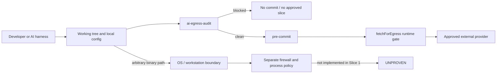
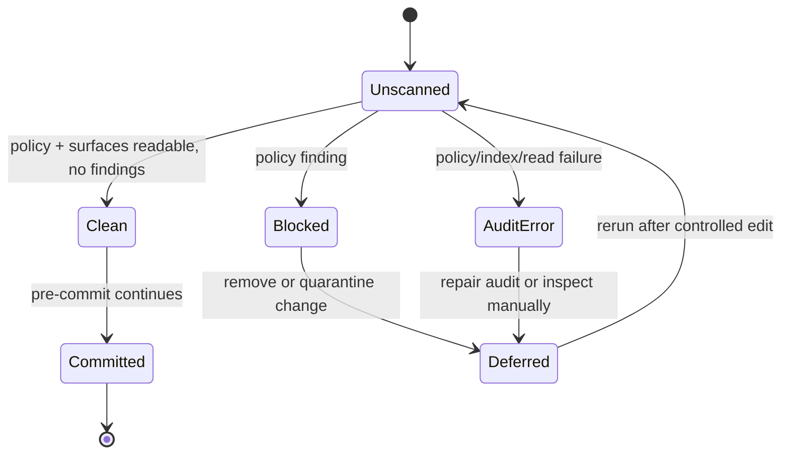

# AI Egress Hardening Blueprint — 2026-09-21

Artifact ID: AI-EGRESS-HARDENING-2026-09-21
Owner: Sean / SS-PT maintainers
Status: IMPLEMENTATION VERIFIED — Slice 1 (repository scope; OS controls pending)
Version: 1.1
Supersedes: none found for this subject

## 0. Verified baseline and transcript-derived threat model

The user supplied `C:\Users\BigotSmasher\.codex\attachments\7f2b9f16-66d9-4e12-9c7b-ced1d3f1535a\Pasted text.txt`, a transcript describing a developer harness that allegedly captured repository snapshots, configuration metadata, and session artifacts in a background uploader. The material is treated as a threat-model input, not as independently verified vendor evidence.

The relevant failure modes are:

- capture/upload started unconditionally after login;
- a visible preference did not control the capture pipeline;
- repository history, local branch names, internal hosts, APIs, and configuration were included;
- deleting a pending archive did not stop regeneration and retry;
- later source cleanup or bucket deletion could not prove what happened to prior uploads;
- source publication was not equivalent to proving the distributed client was clean.

Canonical repository: `C:\Users\BigotSmasher\Desktop\@Everything\quick-pt\SS-PT`.
Caller/mount path: `C:\Users\BigotSmasher\Desktop\quick-pt\SS-PT` (not a Git checkout; no `.git`).
Observed branch: `creator-brains-engine-r2-20260915`.
Observed HEAD: `99b970bd40748758d5f943ee254a43730767bc7b`.
Observed state: heavily dirty shared checkout; direct Git status also reports unreadable historical objects. A detached worktree could not be created because tree `2d9ee7190e471a8669c4d8e9cbaff358c620e659` is unavailable. Existing uncommitted work is therefore preserved and not used as an editable baseline.
Lane/lock evidence: `node scripts/lane-at-root.mjs orientation` returned `not a git repository — no ledger`; automatic ownership coverage is UNVERIFIED.

Existing controls verified by source inspection:

- `scripts/lib/redact-egress.mjs` redacts final string request bodies at `fetchForEgress()` and runs a canary;
- `scripts/hooks/egress-chokepoint-guard.mjs` ratchets direct model-host calls in staged `scripts/` files;
- `scripts/hooks/egress-privacy-gate.mjs` blocks selected credentials, PII, paths, and internal infrastructure in outbound review documents;
- `scripts/scan-secrets.sh` scans staged and selected local files;
- `.githooks/pre-commit` wires secret, lane, Windows-script, and model-egress checks.

Slice 1 implementation adds `config/ai-egress-policy.json`, the read-only
`scripts/qa/ai-egress-audit.mjs` ratchet and mutation tests, the pre-commit
integration, CODEOWNERS coverage, and routes the default OpenRouter provider
transport through `fetchForEgress()`. The YouTube transcript MCP surface has a
line-level allow marker because it sends only a user-selected URL and does not
read repository files.

Boundary gap: these are repository automation controls, not proof that an arbitrary third-party binary, browser extension, MCP server, or OS process cannot read or upload the working tree. The workstation/network control is a separate required slice.

## 1. Requirements and acceptance criteria

| ID | Requirement | Acceptance criterion |
|---|---|---|
| R1 | AI/harness egress defaults to explicit approval | A tracked policy declares deny-by-default and the audit reports the policy version and scanned surfaces. |
| R2 | Detect repository/workspace capture or upload instructions in tracked harness surfaces | A mutation containing repository snapshot, workspace capture, repo wiki upload, or file telemetry language exits non-zero and identifies only file, line, and rule ID. |
| R3 | Prevent new raw external transport in repository-owned AI workflow scripts | A staged AI transport file using raw `fetch`, HTTP, axios, or a vendor SDK without `fetchForEgress` is blocked. Local Ollama calls remain allowed. |
| R4 | Prevent AI workflows from selecting protected roots as outbound inputs | New AI transport code that reads `.env`, `.git`, `client-data`, `backend/uploads`, `backups`, or logs is blocked, even if it uses the redaction chokepoint. |
| R5 | Avoid destructive retry/regeneration behavior in the guard | The audit has no delete, overwrite, upload, or retry side effect; it returns findings and exits. |
| R6 | Keep evidence privacy-safe | Output never echoes matched source text, secrets, prompts, client records, or environment values. |
| R7 | Preserve honest scope | Documentation states that repository guards do not establish OS/kernel/firewall or vendor-client behavior. |

Forbidden side effects: no production writes, no provider calls, no credentials, no automatic firewall changes, no deletion of generated archives, no Git reset/checkout/clean, and no push/deploy.

Non-goals for Slice 1: vendor forensic verification; changing provider/model
selection; blocking legitimate product uploads to SwanStudios; OS firewall
policy; kernel ACLs; proving a third-party harness honors this repository
policy.

## 2. Blueprint and trust boundaries

Components and ownership:

1. `config/ai-egress-policy.json` owns the versioned policy vocabulary, protected roots, harness surfaces, local-host exceptions, and blocked instruction classes.
2. `scripts/qa/ai-egress-audit.mjs` owns deterministic static admission checks for staged or explicitly supplied files.
3. `scripts/qa/ai-egress-audit.test.mjs` owns mutation-based regression tests for the audit itself.
4. `.githooks/pre-commit` owns the commit-time ratchet; it must block explicit findings and surface internal errors.
5. `scripts/lib/redact-egress.mjs` remains the runtime transport redaction boundary for approved model calls; Slice 1 does not replace it.
6. The workstation/network layer remains Sean-owned and is not changed automatically by repository code.



Trust rule: repository code may describe or invoke approved egress only through audited surfaces. The audit is a static ratchet; `fetchForEgress()` is the runtime body redactor. Neither claims to control arbitrary processes outside this repository.

## 3. Contracts and applicability matrix

Audit input contract:

```text
node scripts/qa/ai-egress-audit.mjs --staged
node scripts/qa/ai-egress-audit.mjs --all
node scripts/qa/ai-egress-audit.mjs <path>...
```

Output contract: exit `0` = no findings; exit `1` = policy findings; exit `2` = audit could not establish its input or policy and must be treated as blocked. Output contains relative paths, line numbers, rule IDs, and counts only.

Protected roots: `.git`, root/backend/frontend `.env*`, `.auth`, `client-data`, `backend/uploads`, `backups`, `logs`, and known test-result/report output. The list is policy data, not a promise that unknown sensitive files are safe.

Applicability:

| Artifact | Decision | Reason |
|---|---|---|
| Privacy/threat model | REQUIRED | The incident is an egress and trust-boundary failure. |
| API/provider contract | REQUIRED | The audit gates transport and outbound document selection. |
| Data-flow diagram | REQUIRED | Repository, audit, runtime transport, provider, and workstation boundaries differ. |
| State diagram | REQUIRED | clean, blocked, internal-error, override/defer, and recovery states matter. |
| ERD/migration | NOT_APPLICABLE | Slice 1 creates no relational state or schema. |
| UI wireframes | NOT_APPLICABLE | Headless repository guard; no user-facing screen is changed. |
| Responsive/accessibility | NOT_APPLICABLE | No UI surface. |
| Performance budget | REQUIRED | Pre-commit scan must be bounded and must not read large binaries. |
| Restore/rollback | REQUIRED | Removing the hook/policy entry must restore prior commit behavior without deleting user data. |

State flow:



## 4. Test plan and traceability

| Test ID | Covers | Fixture/action | Expected result |
|---|---|---|---|
| T-AEG-01 | R1/R6 | Load policy and audit a clean harness config | PASS, no secret/source echo. |
| T-AEG-02 | R2 | Mutate config with repository snapshot upload language | FAIL, rule ID + line only. |
| T-AEG-03 | R2 | Mutate config with repo wiki and file telemetry language | FAIL, both findings. |
| T-AEG-04 | R3 | Raw external `fetch` in `scripts/consult-test.mjs` | FAIL, raw transport finding. |
| T-AEG-05 | R3 | `fetchForEgress` external transport | PASS. |
| T-AEG-06 | R3 | Local Ollama `127.0.0.1` transport | PASS. |
| T-AEG-07 | R4 | AI script reads `.env` and sends a request | FAIL, protected-root finding. |
| T-AEG-08 | R5 | Run audit against fixtures twice | No filesystem mutation or network request. |
| T-AEG-09 | R7 | Inspect audit output and policy scope | No claim of OS/kernel enforcement. |
| T-AEG-10 | baseline | Existing egress/redaction tests | Preserve prior result; failures remain separately attributed. |

Traceability: R1→policy/T-AEG-01; R2→audit/T-AEG-02/03; R3→audit + pre-commit/T-AEG-04/05/06; R4→audit/T-AEG-07; R5→read-only implementation/T-AEG-08; R6→output contract/T-AEG-02/03; R7→this blueprint and review/T-AEG-09. OS/kernel protection is intentionally uncovered by Slice 1 and remains UNPROVEN.

## 5. Ordered implementation slices and operations

- Slice 1 (this task): policy manifest, static audit, mutation tests, package
  entry point, pre-commit ratchet, CODEOWNERS, blueprint, and default provider
  transport repair. Entry: current controls inspected. Exit: focused tests
  pass and the full repository scan is clean; existing violations are reported,
  not relabeled as fixed.
- Slice 2 (Sean-authorized follow-up): workstation launch policy and Windows Firewall/process telemetry for selected AI harnesses. Entry: exact executable names, vendors, and desired deny/allow behavior. Exit: observed outbound connection test and rollback receipt.
- Slice 3 (optional): harden runtime provider allowlists and attach immutable egress receipts to approved review packets. Requires provider compatibility review and no silent breakage of product uploads.

Operational owner: Sean. Kill switch: remove the pre-commit invocation only through a reviewed change; no code path silently turns a blocked finding into a send. Recovery: fix/quarantine the finding, rerun the audit, then commit. Rollback: revert only the new policy/audit/hook lines; do not delete logs or user files.

## 6. Hostile review and decisions

Known hostile questions:

- Can a malicious harness bypass a repo script by using its own binary, MCP server, browser, or child process? Yes; Slice 1 does not claim to stop it.
- Can a developer add an allow marker or disable hooks? Yes; CODEOWNERS and the review process are required, and the marker must carry a reason. Branch protection enforcement is not verified here.
- Does redaction prove that client data is safe? No; redaction is pattern-based and the protected-root check is static. The Coach privacy proxy remains authoritative for client PII.
- Does source cleanup prove historical non-retention? No; the supplied transcript correctly identifies that as unprovable without provider-side evidence.
- Does a green structural audit prove runtime behavior? No; it proves only the scanned surface and exact test fixtures.

Decision: implement Slice 1 without provider calls, spend, deployment, firewall changes, or broad refactoring. Final cross-model adjudication is NOT RUN on this task; local verification must remain labeled implementation evidence, not final hostile approval.

## 7. Readiness receipt — updated during execution

Canonical artifacts: this blueprint; `config/ai-egress-policy.json`; `scripts/qa/ai-egress-audit.mjs`; `scripts/qa/ai-egress-audit.test.mjs`; package/pre-commit/CODEOWNERS integrations if their clean ownership is verified.

Preservation: no existing canonical planning artifact was overwritten. Shared checkout is dirty and lane tooling is unavailable; changes are additive and limited to the named files.

Evidence recorded for Slice 1:

- `node --test scripts/ai-workflow/opus-kimi-consensus/runtime.test.mjs`: PASS, 9/9.
- `node --test scripts/qa/ai-egress-audit.test.mjs`: PASS, 8/8.
- `node scripts/qa/ai-egress-audit.mjs --all`: PASS, policy v1, 62 surfaces, 0 findings.
- staged-mode simulation with explicit file list: PASS, 2 AI surfaces, 0 findings.
- `node --test scripts/hooks/egress-chokepoint-guard.test.mjs`: PASS, 10/10.
- `node --test scripts/hooks/egress-privacy-gate.test.mjs`: PASS, 34/34.
- `node --test scripts/lib/redact-egress-guard.test.mjs`: PASS, 9/9.
- syntax and JSON checks: PASS.

Current status: IMPLEMENTATION VERIFIED for the repository slice; DEPLOYED is
not claimed. Required external hostile review is pending/not run. Remote
backup, production proof, and OS firewall/process-boundary proof are NOT RUN.
