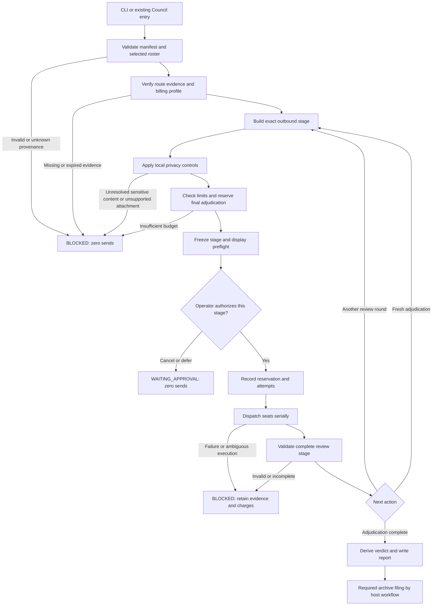
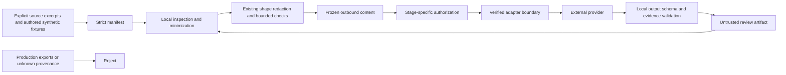
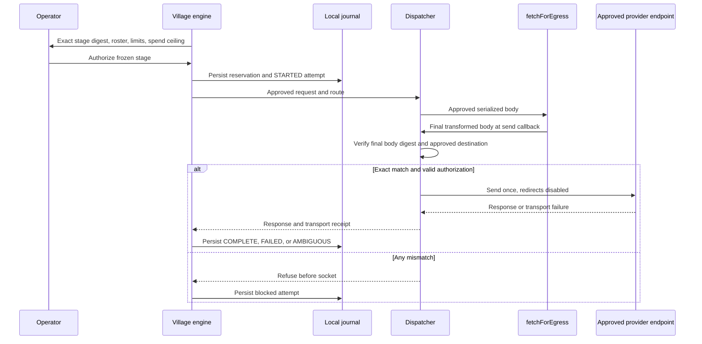
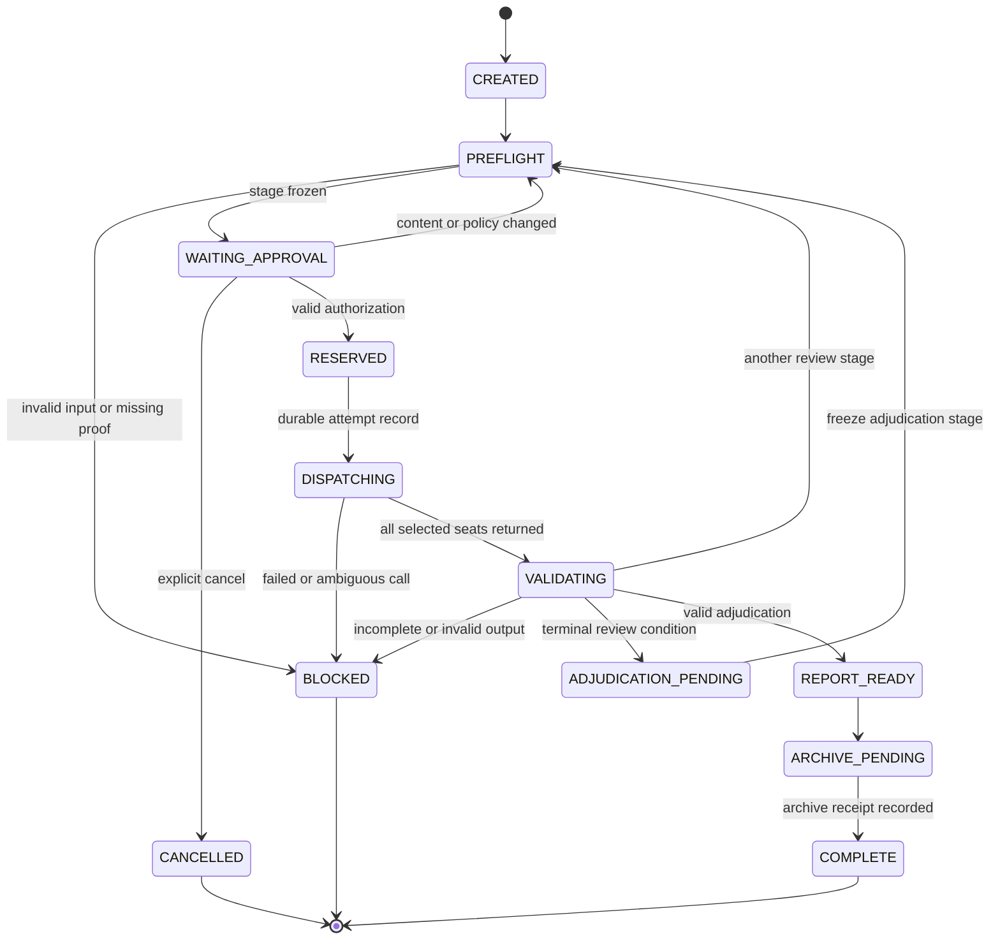

**A1 — Ownership**

The new paths below are **proposed implementation targets**, not claims that files exist.

| Proposed path | Responsibility |
|---|---|
| `scripts/village/run.mjs` | CLI parsing, explicit operator actions, exit codes. |
| `scripts/village/manifest.mjs` | Strict artifact schema, provenance classification, size limits. |
| `scripts/village/policy.mjs` | Billing-profile and prohibited-seat decisions. |
| `scripts/village/providers.mjs` | Resolve selected routes through verified adapter capabilities. |
| `scripts/village/remits.mjs` | Full-spectrum reviewer and role-specific adjudicator instructions. |
| `scripts/village/coverage.mjs` | Validate area coverage and artifact references. |
| `scripts/village/findings.mjs` | Stable finding IDs, duplicate resolution, final verdict derivation. |
| `scripts/village/budget.mjs` | Complete-stage reservation and settlement. |
| `scripts/village/freeze.mjs` | Final stage serialization, digests, approval binding. |
| `scripts/village/dispatch.mjs` | Last-send content check and approved adapter invocation. |
| `scripts/village/journal.mjs` | Durable stage, attempt, receipt, and terminal-state recording. |
| `scripts/village/rounds.mjs` | Structured continuation and termination decisions. |
| `scripts/village/engine.mjs` | State transitions and complete-stage execution. |
| `scripts/village/adapters/subscription.mjs` | Verified subscription transport integration. |
| `scripts/village/adapters/openrouter.mjs` | Explicit special-review integration through the existing egress gate. |

Each implementation file stays within 300 lines. Split by the responsibilities above; do not create duplicate engines to satisfy the limit.

Existing integration targets:

- `scripts/lib/redact-egress.mjs`: retain the final HTTP-body gate.
- `scripts/mcp/swan-council-server.mjs`: retain the MCP entry surface.
- `scripts/mcp/swan-council-lib.mjs`: replace model-specific authority/lens instructions with role-based remits.
- `scripts/mcp/swan-council-subscription.mjs`: use only after its real transport and context behavior are inspected.
- `scripts/consult-openrouter-panel.mjs`: retain as a guarded entry point, with orchestration delegated to the new engine.
- Synthesis entry points remain synthesis workflows; they must not become a third review mode.

Existing exported signatures are **UNKNOWN**. No guessed import is authorized.

**A2 — Entry and user flow**



**A3 — Privacy and trust flow**

Provider output is untrusted material. It does not become an instruction, an approval, or an automatically sendable artifact.



The last arrow is deliberate: peer reviews and adjudication inputs pass through admission, inspection, freezing, and authorization again.

**A4 — HTTP adapter interaction**



The authorization credential is supplied only by the trusted adapter to the approved endpoint. It is not part of review content or a public receipt.

**A5 — Subscription adapter interaction**

```mermaid
sequenceDiagram
    participant O as Operator
    participant E as Village engine
    participant J as Local journal
    participant A as Subscription adapter
    participant C as Verified CLI transport

    E->>A: Request route and isolation evidence
    A-->>E: Verified capability or BLOCKED
    E->>O: Exact application text digest and preflight
    O->>E: Authorize frozen stage
    E->>J: Persist reservation and STARTED attempt
    E->>A: Frozen application text
    A->>A: Verify digest, fixed arguments, isolated context
    A->>C: One bounded invocation
    C-->>A: Result and identity/usage receipt
    A-->>E: Structured result or hard failure
    E->>J: Persist result; retain full charge if execution unknown
```

A subscription text digest is **not represented as a complete network-wire digest**. The adapter must separately demonstrate that it attaches no unapproved repository files, instructions, tool results, or session history.

**A6 — Run state machine**



`BLOCKED` is terminal for dispatch within that run. A corrected attempt requires a new run linked to the earlier evidence.

**A7 — Data model**

No database migration is proposed.

**ERD: N/A — scope-bounded consult, no repository database surface in scope.** Exact existing columns and types were not supplied, so no database schema is invented.

The file-backed contracts and ownership are specified in `03-contracts-a.md` (C1–C5) and `03-contracts-b.md` (C6–C10).
