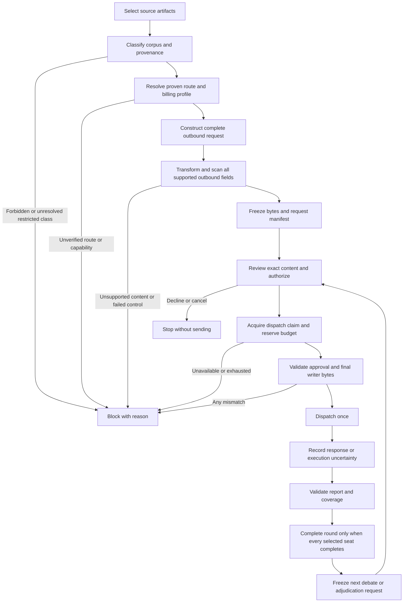
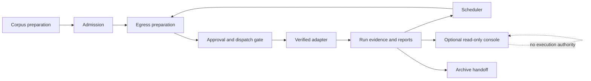
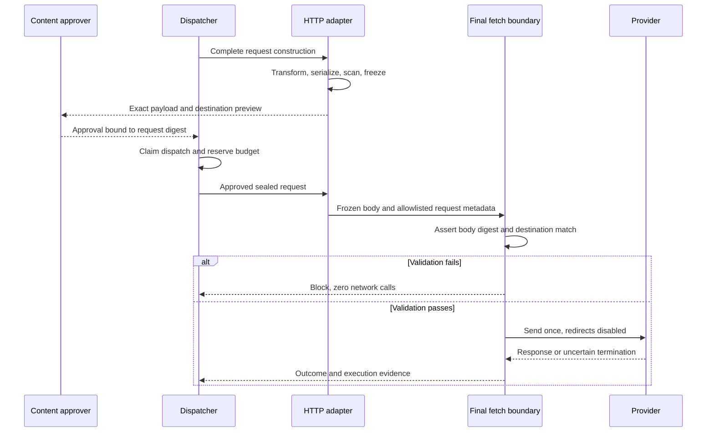
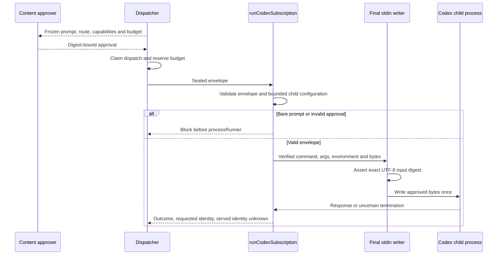
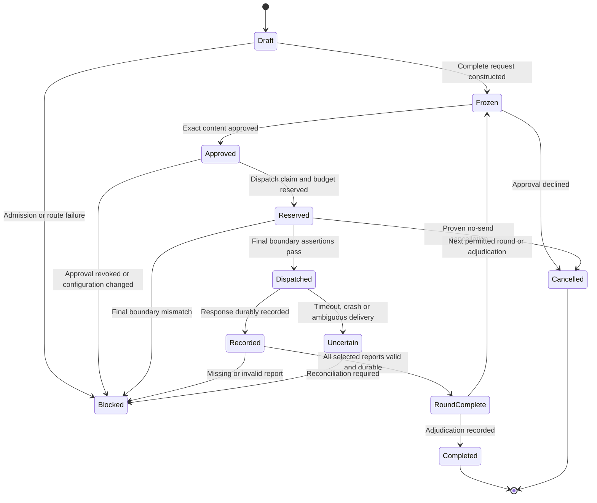

**Status:** Proposed controlled-dispatch architecture. Existing implementation conformity is unverified.

**Ownership**

- Admission owns corpus eligibility and restricted-material policy.
- Egress preparation owns transformation, final serialization and preview.
- Approval owns authorization for exact finalized requests.
- Adapters own the last writable boundary and transport capability enforcement.
- The scheduler owns rounds, reservations and incomplete-run handling.
- Reports own evidence and coverage representation.
- The console reads published artifacts; it cannot change engine execution.

**Controlled dispatch flow**

**Subsystem and console boundary**

**HTTP interaction**

**Subscription CLI interaction**

**Run state**

A later round may start only after the preceding round completes. Adjudication requires all planned review rounds to complete.

**Database diagram:** N/A — scope-bounded consult, no repository surface in scope. No database schema or relational migration is supplied; inventing exact columns or types would misrepresent the evidence.

**Per-screen flows:** N/A — scope-bounded consult, no repository surface in scope. Existing screens and their states were not supplied.

**Rendering:** Literal Mermaid sources are provided; rendered previews were not produced.
