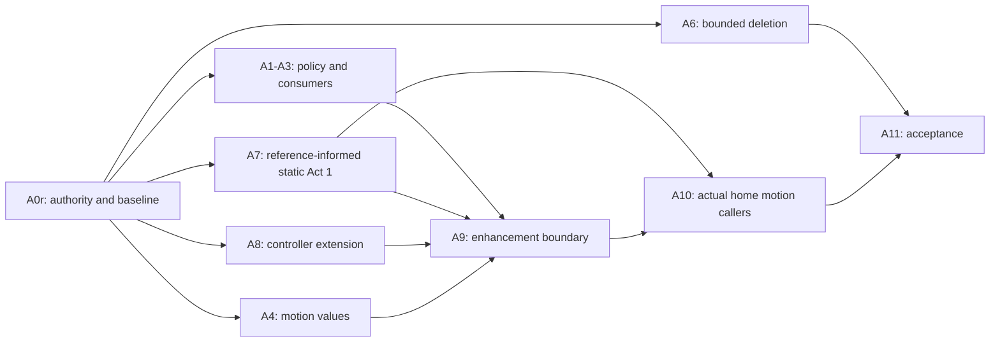

**P2 amendment applied 2026-09-21. Superseded A0 additions, A ordering and dependency edges replaced;
P1 text preserved in `/tmp/p1-originals-20260921/04-build-order.md` (md5-verified). **Correction 2026-09-21:** the earlier “*Not* in git history” note was wrong — this directory is **not** gitignored — the `.gitignore:496` claim was false (line 496 is blank, and the rules target `.ai-workflow/`, not `docs/ai-workflow/`); this packet is tracked in git as of 2026-09-21.**

**A0r — reconcile before affected implementation**

Record:

1. Current branch, HEAD, dirty state, worktree ownership and exact edited-path clearance.
2. P3 packet/reply/adjudication identifiers, hashes, affected paths and accepted decisions.
3. A conflict table: P2 requirement → relevant P3 decision → resolution or no overlap.
4. F/F-Alt token excerpts and the mapping from each named variant to its preset.
5. Desktop/375px reference screenshots for the selected Act-1 composition.
6. CTA route → mounted hero → handler → orientation interface → existing submission contract.
7. Provider mount scope and actual consumer inventory.
8. Controller construction signature, frame scheduling, backing calculation and resource ownership.
9. Exact R1 deletion allowlist.
10. Baseline screenshots, production build, type check, header resource counts, and initial LCP measurements.

An unrelated P3 finding does not block the whole workstream. Missing overlapping authority blocks only affected slices. Current explicit R1–R3 are not reopened as questions.

> **A0r executed 2026-09-21 — see `A0r-INTAKE-RECEIPT.md`.** Status: items 2, 3, 4, 6, 7, 8, 9
> **complete**; item 1 partial (clearance by grep, not a full 1,295-path diff); item 5 **not taken**;
> item 10 partial — type check **passed** (`EXIT=0`, zero errors, 8 GB heap required), header resource
> counts measured, **production build blocked by sandbox**, **LCP not measured**.
>
> **Carry-forward prerequisite:** every slice whose exit evidence includes a type check must export
> `NODE_OPTIONS=--max-old-space-size=8192` first, or it will OOM at the ~4 GB default and be misread as
> a code defect. The clean baseline at HEAD `6e45e239` is zero errors.
>
> **Four items await Sean's ruling before A7** (`A0r` §12): CTA copy · secondary hero CTA · F-Alt
> interactive token · backing-size policy.

**Order**

A5's dormant-helper repair is cancelled. Preserve its history as cancelled, not passed.

A7's static acceptance can proceed independently of a passing animated signature after its own intake requirements are met. It does not complete A8/A9.

Keep sessions bounded to at most eight existing implementation files plus related tests. Shared-controller changes and home integration are separate sessions.

**Implementation order**

- **A0r is complete for seven of ten items and partial on three.** Do not treat it as closed. The three
  partial items and the four §12 rulings gate only their dependent slices, per the rule above.
- A6 is **bounded deletion**, not GSAP cleanup. See `05-slices.md`.
- A1–A3 establish policy and consumers; A4 establishes the single motion-values authority.
- A5 is **cancelled**.
- A7 delivers the reference-informed static composition.
- A8 extends the house controller; A9 adds and bounds the enhancement; A10 constrains actual home motion.
- A11 verifies the real route.
- B Stage 1 may proceed independently once its intake is complete.
- B Stage 2 remains a later, isolated phase. **R3F 9 is no longer part of its cohort.**

**Session-size rule**

Each builder session changes at most eight existing implementation files plus narrowly related tests. A dependency slice changes one dependency family, its lockfile, and its verified callers. Split larger inventories into numbered batches with frozen filenames before handing them to the flash-tier builder.

No session receives "fix all consumers," "finish the migration," or another open-ended instruction.

**Session-size rule**

Each builder session changes at most eight existing implementation files plus narrowly related tests. A dependency slice changes one dependency family, its lockfile, and its verified callers. Split larger inventories into numbered batches with frozen filenames before handing them to the flash-tier builder.

No session receives “fix all consumers,” “finish the migration,” or another open-ended instruction.
