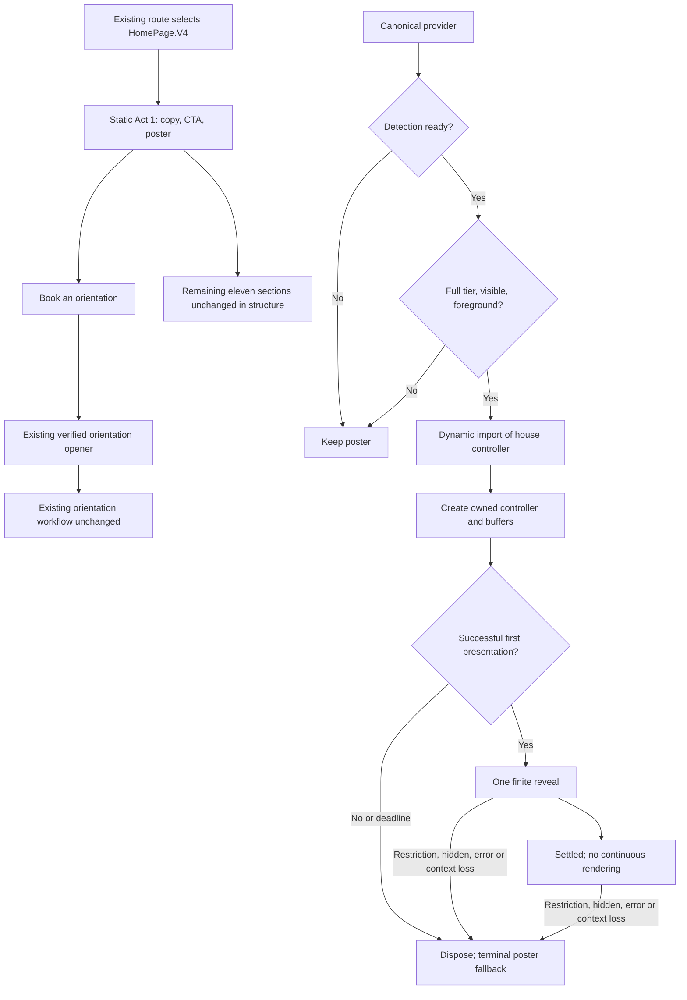
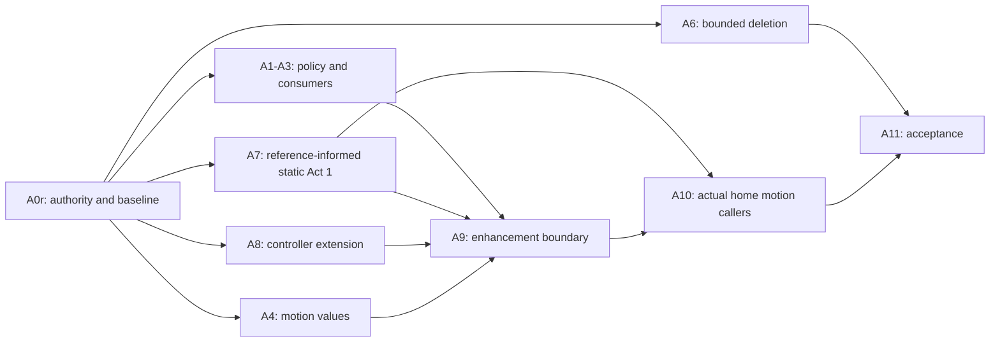

# Astra Reply — subscription transport — 2026-09-21T18:52:47.301Z

**Provider:** openai-codex
**Billing:** chatgpt-subscription
**Authentication:** chatgpt_subscription
**Transport:** codex-cli
**Requested model:** gpt-6-astra
**Served model:** NOT OBSERVABLE on codex-cli (see SERVED_MODEL_UNVERIFIABLE_NOTE)
**Reasoning effort:** xhigh
**Tokens:** in=423893 out=22295 reasoning=7168
**Packet:** `docs/ai-workflow/AI-HANDOFF/BLUEPRINT-cinematic-frontend-2026-09-19/CONSULT-PACKET-P2.md`
**Wall:** 701.7s
**Mega Blueprint:** ARMED (operator flag)

> Marginal cost $0 — this leg rides the ChatGPT subscription, not OpenRouter.

---
Mega Blueprints. I’ll treat the packet as the repository evidence, challenge the prior decisions, and emit changed sections under the required nine filenames. I’ll verify current library and product claims against primary sources; the top-level output contract governs the conflicting headings in §8.

The raw-three pivot exposes a larger contradiction: the shipped header mark uses two canvas buffers, so the plan’s “one canvas” and “no Three.js requests” gates cannot describe the whole page. I’m separating hero costs from header costs and replacing the CPU-plus-GPU timing gate with measurements that distinguish submission time, GPU time, and visible frame pacing.

The direction decision needs to be withdrawn: P1 excluded a substantial branded alternative from consideration. The packet does not prove which variant looks best—or that “Crystalline Swan” names a sixth page rather than a token preset—so the replacement selects that preset as the first reference to assess without claiming an unseen visual winner. I also verified that `framer-motion` 12.x exists and that tagged version 12.23.24 declares React 18/19 peers; that does not establish the latest compatible registry version.

## PART A — HOSTILE REVIEW

**Verdict: DEFECTS-FOUND. R1–R3 are mutually consistent, but the plan has not absorbed their architectural, testing, or visual consequences.**

I cannot establish that I authored P1. Its `servedModel: null` remains unresolved. Repository findings below are **[EXCERPT-SUPPORTED]**, not independently verified against the working tree. Public documentation checked during this review is **[SOURCE-SUPPORTED]**; it does not establish installed-library behavior.

The named `fable-blueprint-forge` skill was not found in the inspected personal skill locations. The supplied forge instructions govern this response.

**A1 — Review of the existing plans**

**Axis 1: current practice and the custom-work question**

Progressive enhancement, static posters, conditional loading, explicit disposal, and rendering only while necessary remain current practices. R3F documents demand rendering; `<model-viewer>` demonstrates posters, failed-load fallback, lazy loading, and adaptive resolution. The architectural principle is sound. The unnecessary part was introducing another renderer integration and several adapter layers for functionality the repository already ships. [R3F performance guidance](https://r3f.docs.pmnd.rs/advanced/scaling-performance), [model-viewer loading examples](https://modelviewer.dev/examples/loading/).

There is no evidence here that the field has settled on one universal CPU-count policy, three-target animation limit, or 720ms signature. Those are project decisions, not standards.

| Option | What it could replace | Adoption cost and limitation | Decision |
|---|---|---|---|
| **R3F + Drei** | Renderer lifecycle in `01`, parts of A8/A9; optional adaptive rendering helpers | Adds an integration and React-major compatibility coupling. Exact incremental bundle size is unmeasured. It does not supply the brand composition, application loading policy, or conversion tests. | R2 is correct for this surface. P1 had no demonstrated requirement for R3F. |
| **`<model-viewer>`** | Much of poster/model loading, presentation, and resolution management in A8/A9 | Would require converting the custom SwanMark representation into a supported model asset and validating visual parity. Exact bundle cost and installed compatibility are unverified. | A credible alternative for a model viewer; unnecessary migration for this existing controller. |
| **Radix Primitives** | Focus, keyboard, and dialog behavior if a new complex control were required | Accessible primitives do not replace the scene boundary or capability policy. This work adds no new dialog. | Preserve the existing orientation flow; use its existing controls. |
| **Motion+** | Some custom DOM effects, examples, and choreography work in A4/A10 | Personal access is a one-time purchase; Business is annual per seat. The page did not expose a reliable dollar amount. APIs/examples are advertised as MIT licensed, with additional terms for reselling capabilities. Bundle cost depends on selected components. | No identified premium component removes this workstream’s core work. Do not purchase for this signature. |
| **Spline** | Scene authoring and much of custom scene construction in A8 | Pricing advertises Hobby at $15/seat/month or $12/month billed annually; self-hosted/code export appears under Enterprise on the current pricing page. Export includes Spline runtime/assets. Exact entitlement, license terms, bundle size, and SwanMark migration fidelity require verification. | Adds authoring/runtime dependencies to an already implemented scene. Reject for this scope. |
| **Rive** | A designer-authored vector animation could replace the 3D signature | Advertises shipping/export from $9/seat/month. Introduces `.riv` authoring and a JS/WASM runtime; recreating the mark and material treatment is migration work. Runtime cleanup remains necessary. Exact payload is unmeasured. | Viable if the direction changes to authored vector motion; does not preserve the current raw-three implementation automatically. |

Sources: [R3F React pairing](https://r3f.docs.pmnd.rs/getting-started/introduction), [Radix accessibility](https://www.radix-ui.com/primitives/docs/overview/accessibility), [Motion+ terms and features](https://motion.dev/plus), [Spline pricing](https://spline.design/pricing), [Spline self-hosted export](https://docs.spline.design/exporting-your-scene/web/exporting-as-self-hosted-project), [Rive pricing](https://rive.app/pricing), [Rive runtime and cleanup](https://rive.app/docs/runtimes/web/web-js).

**Conclusion:** none of these products is demonstrated to eliminate the complete custom requirement. Reusing the existing raw-three controller is the lowest-migration option. A small boundary still must express this application’s loading, accessibility, cancellation, and fallback decisions.

**F01 · H — P1 selected a direction from an incomplete and unfair comparison.**

- **Location:** `02-wireframes.md#Direction decision`; `00-README.md#Delivery`; packet §4.
- **Wrong:** Yes—the rejection excluded a substantial, already-built branded option. It compared a developed SwanMark idea against the dismissive label “generic geode/particle field,” without evaluating the cinematic subtree.
- **Replacement:** “Retain V4 and its twelve sections. Develop Act 1 using the existing F-Alt/Crystalline Swan preset as the first reference candidate, with the existing SwanMark as the focal mark. Preserve the prohibition on a new particle system.”
- **Evidence:** **[EXCERPT-SUPPORTED]**. The packet establishes a named token preset, not that one particular variant is visually best. It lists five variants; it does not establish a sixth `CrystallineSwan` page or identify which variant best demonstrates F-Alt. That mapping is **[NEEDS-VERBATIM]**.
- **Consequence:** Withdraw the rejection rationale. Do not substitute the equally unsupported assertion that an unseen variant is definitively the best design.

**F02 · M — R1 is correct, but “orphaned assets” is not an executable deletion boundary.**

- **Location:** `05-slices.md#A6`; `00-README.md#Existing GSAP defect`; packet §3/R1.
- **Wrong:** Zero mounted callers does not prove every associated asset has zero other consumers. Runtime references can occur through CSS, manifests, public URLs, dynamic imports, and re-exports.
- **Replacement:** Delete `PremiumParallax.tsx`; delete additional styles/assets only from a recorded, reference-checked allowlist. Preserve shared or ambiguous files. Cancel the lifecycle-repair test and any GSAP installation.
- **Evidence:** **[EXCERPT-SUPPORTED]**.
- **Doctrine:** Keep `cinematic-pages.md#7` as an explicitly conditional rule for separately authorized GSAP work. It is unexercised here and does not authorize a dependency. “GSAP is not used here” requires a runtime import inventory, not removal of the word from historical documents.

**F03 · H — P1 mandated R3F without identifying a missing capability.**

- **Location:** `00-README.md#R3F`; `01-architecture.md#NEW files`; `05-slices.md#A8–A9`.
- **Wrong:** The repository already has the renderer lifecycle, geometry construction, demand scheduling, disposal, and a mounted consumer. R3F adds migration and ownership boundaries for one rotation.
- **Replacement:** Reuse `swanMarkScene.ts`; extend it narrowly for a finite reveal and presentation/error notifications. Remove the new factory, R3F scene component, and duplicated home spec.
- **Evidence:** **[EXCERPT-SUPPORTED]**.
- **Gain:** Reuses the measured presentation path and avoids a new React renderer dependency.
- **Loss:** Gives up declarative scene composition and R3F/Drei helpers. Those benefits have no demonstrated use in this signature. Imperative lifecycle errors must be caught explicitly; a React error boundary does not catch arbitrary rAF callbacks.

**F04 · H — The canvas and loading gates contradict the shipped header.**

- **Location:** `03-contracts.md#Signature contract`; `06-bans.md`; `07-checkpoints.md#C4`; packet §7.
- **Wrong:** The house controller uses a displayed 2D canvas and a detached WebGL canvas. The mounted header may also request the shared Three.js/spec chunks. A page-global “one canvas” or “no Three.js requests in lean” assertion can fail even when the hero behaves correctly.
- **Replacement:** Permit the hero **one displayed canvas plus one detached WebGL canvas, with one WebGL context**. Measure header and hero separately. Lean/reduced means no hero loader invocation, controller construction, or hero canvas—not an unsupported claim about all shell requests.
- **Evidence:** **[EXCERPT-SUPPORTED]**.
- **Consequence:** Preserve whole-page measurements alongside incremental hero measurements; do not hide header cost.

**F05 · H — The policy cannot distinguish detection pending from terminal disablement.**

- **Location:** `03-contracts.md#Pure resolution rules`, `#Subscriptions and overrides`; `01-architecture.md#Signature state machine`.
- **Wrong:** The pre-detection value is `reduced`, while disablement latches for the route mount. A conforming implementation could permanently disable the signature before detection completes.
- **Replacement:** Add an explicit `pending | ready` detection phase. Pending displays the poster without consuming eligibility. Only a ready restriction or a started enhancement’s cancellation enters terminal disablement.
- **Evidence:** **[EXCERPT-SUPPORTED]**; this is a contract ambiguity, not a reproduced runtime defect.

**F06 · M — The tier policy conflates user preference, resource restraint, and GPU capability.**

- **Location:** `03-contracts.md#Canonical tier policy`.
- **Wrong:** Low reported CPU/memory becomes the same state as an accessibility preference. Eight logical processors grant `full` without establishing graphics capability. The four-core/save-data example itself is not a bug: the existing rules correctly produce `lean`.
- **Replacement:** Reserve `reduced` for reduced-motion preference or an explicit lower override. Resource/network constraints produce `lean`. Retain eight logical processors only as a conservative admission heuristic; WebGL creation and lifecycle acceptance remain separate requirements.
- **Evidence:** **[EXCERPT-SUPPORTED]** for the rules; reported hardware readings are imperfect signals. [Hardware concurrency](https://developer.mozilla.org/en-US/docs/Web/API/Navigator/hardwareConcurrency), [device-memory approximation](https://developer.mozilla.org/en-US/docs/Web/API/Navigator/deviceMemory).
- **Consequence:** Four cores plus save-data must produce visible static content with no hero enhancement request. It does not, by itself, prove that an existing header or video elsewhere respects save-data.

**F07 · M — The consumer migration and helper repair are inflated by incorrect reachability assumptions.**

- **Location:** `05-slices.md#A3.n`, `#A5.n`; packet §7.
- **Wrong:** The measured three files include the hook definition: there are two named consuming pages, not twelve tier-hook consumers. Repairing a helper with zero importers cannot improve the mounted home.
- **Replacement:** A3 covers the hook, Home, About, and the independently identified direct provider consumer. Cancel A5’s dormant-helper repair. A10 separately inventories the mounted home’s actual motion primitives and callers.
- **Evidence:** **[EXCERPT-SUPPORTED]**.
- **Consequence:** The 34-importer cinematic kit is a shared surface. Home-specific restrictions must not silently alter all those consumers.

**F08 · H — DPR, supersampling, and poster resolution are treated as interchangeable.**

- **Location:** `03-contracts.md#Signature contract`; `07-checkpoints.md#C4`; packet §7.
- **Wrong:** `[1,1.5]` DPR and “DPR ≤2” already disagree. Neither directly describes the house controller’s two-stage sampling. Its small-logo measurements do not prove that the same setting is optimal for a 560px hero. A 128px placeholder is not established as a premium large hero asset.
- **Replacement:** Specify display backing ratio, scratch supersampling, and absolute pixel limits separately. Generate or identify a hero-resolution poster from the same geometry. Validate the resulting presentation at hero sizes.
- **Evidence:** **[EXCERPT-SUPPORTED]**.
- **Consequence:** Reuse the measured method; do not generalize its optimum beyond the measured dimensions.

**F09 · H — The timing gate measures neither complete presentation cost nor a defensible universal budget.**

- **Location:** `09-tests.md#Scene cost case`; `07-checkpoints.md#C4`.
- **Wrong:** GPU timer queries are achievable where supported, but they time selected GL work. They do not include the complete displayed-2D-canvas/compositor path. Adding CPU submission time to GPU time is not a reliable frame-latency measurement. Requiring every cold frame to satisfy an unsupported 3ms threshold makes the gate fragile and potentially unpassable.
- **Replacement:** Delete `<3ms/frame>`. Gate idle behavior, startup blocking, visible pacing, LCP, and lifecycle cleanup. Report CPU spans separately; make disjoint GPU queries optional diagnostics, never a required sum.
- **Evidence:** **[EXCERPT-SUPPORTED]**, **[SOURCE-SUPPORTED]**. The extension requires asynchronous availability checks and rejection of disjoint results. [Khronos timer-query specification](https://registry.khronos.org/webgl/extensions/EXT_disjoint_timer_query_webgl2/).
- **Consequence:** No GPU timing support means “GPU diagnostic unavailable,” not automatic failure of otherwise observable visual acceptance.

**F10 · M — The 720ms/−0.14rad choice is choreography without demonstrated visual value.**

- **Location:** `00-README.md#Signature`; `03-contracts.md#Signature contract`.
- **Wrong:** Approximately eight degrees of yaw may be restrained and appropriate, or barely visible. The packet supplies no storyboard showing the material response. A poster at a different pose could create a more noticeable handoff jump than the reveal itself.
- **Replacement:** Retain this motion only as the bounded implementation candidate. Require matching poster/first-frame pose and a three-frame storyboard at 0/360/720ms. Do not add effects to compensate for weak composition.
- **Evidence:** **[EXCERPT-SUPPORTED]**; visual superiority remains **[UNVERIFIED]**.
- **Consequence:** If the candidate fails visual acceptance, the static surface can pass independently; the signature remains **DEFERRED**, not “completed through fallback.”

**F11 · H — Source-text contracts cannot establish scene lifecycle correctness.**

- **Location:** packet §3/R2; `09-tests.md`.
- **Wrong:** A file can contain `dispose()`, `cancelAnimationFrame()`, and `forceContextLoss()` while calling them on the wrong resources or missing failure branches.
- **Replacement:** Preserve source contracts for architectural prohibitions. Add executable controller tests for scheduling, partial-construction failure, callbacks after disposal, and instance isolation; retain a real-browser context-loss case.
- **Evidence:** **[EXCERPT-SUPPORTED]**.
- **Consequence:** R2’s source-test pattern is useful evidence of structure, not sufficient runtime certification.

**F12 · H — The plan lacks an ancestry reconciliation gate for potentially overlapping later decisions.**

- **Location:** `04-build-order.md#A0`; `07-checkpoints.md#C0`; packet §2 and §8/10.
- **Wrong:** The later consult and containment changes may govern shared paths. Their existence neither invalidates P2 automatically nor permits ignoring them.
- **Replacement:** Obtain P3’s exact path, packet/reply hashes, remit, affected paths, adjudication, and accepted decisions. Resolve only actual overlap before implementing affected slices; record unrelated decisions as out of scope.
- **Evidence:** **[EXCERPT-SUPPORTED]**; contents **[NEEDS-VERBATIM]**.
- **Consequence:** Commit titles are discovery pointers, not specifications. Current explicit R1–R3 remain the operator’s controlling decisions.

**Inherited blockers, not new findings**

- The CTA handler, form contract, and submission path remain **[NEEDS-VERBATIM]**. No endpoint is invented below.
- Motion’s current documentation confirms that its reduced-motion setting permits some non-transform animations. Installed `framer-motion@10.18.0` behavior still needs the existing runtime fixture. [MotionConfig documentation](https://www.motion.dev/docs/react-motion-config).
- The 12.x line exists. Tagged `framer-motion@12.23.24` declares React and React DOM peers `^18.0.0 || ^19.0.0`. This establishes a viable candidate family, not the highest registry version or compatibility with all local callers. Keep B1a’s registry/lockfile verification. [Tagged package manifest](https://raw.githubusercontent.com/motiondivision/motion/v12.23.24/packages/framer-motion/package.json).
- B2’s compiler-derived manifest remains absent. This consultation does not recreate that migration.

**R1–R3 assessment**

- **R1: right.** Removes a latent orphan instead of installing a dependency to repair it.
- **R2: right for this scope.** Reuses existing capabilities; requires explicit imperative-error handling and correct two-buffer accounting.
- **R3: right.** Makes existing design work available without importing an orphaned application subtree into the live route.
- **Together: consistent.** V4 remains the runtime base; the cinematic subtree supplies references; the house raw-three controller supplies optional rendering. No GSAP or R3F dependency is needed.

**A2 — One hostile pass over the replacement draft**

These findings changed the package below:

| ID | Severity | Draft defect and location | Applied correction |
|---|---|---|---|
| A2-01 | H | A shared-controller extension could change header behavior; `01#Ownership`. | New callbacks/reveal controls are opt-in. Existing defaults remain unchanged; add two-instance isolation tests. |
| A2-02 | H | Cleanup could consume the one-shot latch during React StrictMode effect replay; `03#Lifecycle`. | Cleanup invalidates the generation and disposes its instance. It does not convert pending setup into a permanent failure. Test effect replay explicitly. |
| A2-03 | M | First-frame handoff lacked a pose/resolution contract; `02#States`. | Poster uses the reveal’s starting pose and adequate resolution. Add first-frame registration and layout tests. |
| A2-04 | H | A 5000ms timer was described as interrupting preparation; `03#Deadline`. | State explicitly that it cannot interrupt synchronous work or cancel native module loading. Check the deadline before presentation and test startup blocking separately. |
| A2-05 | M | Partial documents could erase unchanged B2 material when split; `00#Application`. | Define these payloads as section replacements and additions; preserve all untouched text and mark P1’s self-test superseded. |

## PART B — FORGED PACKAGE

### 00-README.md

**Status:** P2 amendment package; **implementation not verified**.

**Application contract**

These nine document payloads contain changed sections only. Merge them into the corresponding existing files; do not overwrite complete files with partial amendments. Preserve P1, its receipt, adjudication, and original documents as immutable evidence.

Replace the identified sections and remove their conflicting superseded clauses. Retain unrelated B1/B2 content. Mark `08-decision-density-self-test.md` as superseded by this consultation’s Part C; preserve its original contents.

**Delivery — replacement**

- **A:** Retain `HomePage.V4`, twelve sections, V3 route fallback, native scrolling, and the existing orientation flow.
- Establish Act 1’s static composition first. Use F-Alt/Crystalline Swan as the first existing design reference to evaluate, without importing the cinematic subtree.
- Add one optional SwanMark reveal through the house raw-three controller.
- Delete the unused `PremiumParallax` implementation and only its verified exclusive dependencies.
- B1 and B2 remain independent. A requires neither upgrade.

**Changed binding decisions**

| Concern | Binding decision |
|---|---|
| Direction | Branded crystalline composition informed by the existing F-Alt preset; existing SwanMark remains the mark. Withdraw the “generic geode” rejection. |
| GSAP | No adoption. A6 becomes bounded deletion. |
| Renderer | Existing raw-three scene-controller pattern; no R3F/Drei installation. |
| Capability | Shared provider; explicit detection phase; conservative admission, not GPU certification. |
| New production modules | Five planned modules listed in `01`; no duplicated geometry factory or React scene component. |
| Tokens | One authoritative motion-values module with generated CSS values; no second token source. |
| Reference subtree | Read-only reference; no promotion, route wiring, or deletion. |
| Presentation budget | One additional displayed canvas and one detached WebGL canvas; one additional WebGL context. |
| Performance | Remove the CPU+GPU `<3ms/frame>` gate; use `07` and `09`. |
| Signature acceptance | Full-scene evidence required. A static-only result cannot complete A8/A9. |

**Requirements and traceability**

| ID | Acceptance | Artifact / slice | Tests |
|---|---|---|---|
| CR-01 | Direction has documented provenance; twelve sections retained | `02`; A0r/A7 | H1–H3 |
| CR-02 | Target orphan removed; shared assets preserved | `03`; A6 | D1–D2 |
| CR-03 | Pending detection cannot latch disablement; restrictions hold | `03`; A1–A3 | P1–P4 |
| CR-04 | House controller reused without changing header defaults | `01/03`; A8 | R1–R4 |
| CR-05 | Cancellation/error paths retain complete static content | `03`; A9 | L1–L5 |
| CR-06 | Pose, resolution, motion and accessibility meet explicit gates | `02/07`; A7–A11 | H1–H3, M1–M3 |
| CR-07 | Performance evidence separates page, hero, CPU and optional GPU observations | `07/09`; A11 | Q1–Q3 |
| CR-08 | Later overlapping decisions and CTA authority are resolved before affected changes | `04`; A0r | Intake receipts; H3 |

**Readiness**

The next authorized work is A0r reconciliation and evidence completion. Missing P3 excerpts, exact reference tokens, controller internals, deletion allowlist, and CTA contract block their dependent implementation slices. They do not prevent review of this amendment.

Release authority and the prohibition on pushing to `main` remain unchanged. A2 is a self-review, not an independent final approval.

### 01-architecture.md

**Replace the proposed-file and ownership sections.**

| Path | Disposition | Responsibility |
|---|---|---|
| `frontend/src/core/perf/performanceTierPolicy.ts` | New | Pure tier resolution; no subscriptions or WebGL probing. |
| `frontend/src/core/perf/motionTokens.ts` | New | Numeric timings/easing and mechanically derived CSS values. |
| `frontend/src/components/SwanMark3D/swanMarkReveal.ts` | New | Pure finite-reveal sampling; no React, renderer, or rAF ownership. |
| `frontend/src/pages/HomePage/components/sections/HeroSignature.tsx` | New | Poster markup, eligibility, dynamic import, generation/deadline guards, controller lifecycle. |
| `frontend/src/pages/HomePage/components/sections/HeroSignature.styles.ts` | New | Reserved geometry, responsive composition and independent CSS motion gate. |
| `PerformanceTierProvider.tsx` | Modify | Stable subscriptions and detection phase. |
| `useAnimationTier.ts` and measured consumers | Modify | Consume the shared authority without permanent old-tier aliases. |
| `swanMarkScene.ts` | Modify narrowly | Optional finite reveal; presentation/error notifications; capped backing policy. |
| `sceneSupport.ts` | Modify if required | Extend existing backing calculation with explicit hero limits. |
| Existing `HeroSection` and V4 integration | Modify | Static composition, existing CTA delegation and home motion coordination. |

Cancel `homeHeroSpec.ts`, `homeHeroFactory.ts`, `HeroSignatureScene.tsx`, `HeroSignaturePoster.tsx`, and `motionTokenStyles.ts`.

The five-module list is a design boundary, not permission to exceed 300 lines. If the existing controller cannot remain within the cap, extract one cohesive private presentation helper and record the reason before adding it. Do not split constants into files merely to meet a file-count target.

**Ownership**

- The provider owns capability subscriptions.
- `HeroSignature` owns route-local eligibility, import state, observers and fallback.
- `swanMarkScene` owns its renderer, scratch canvas, scheduling and disposal.
- `swanMarkReveal` computes a pose from elapsed time; it never schedules frames.
- The existing factory owns construction according to its verified resource contract.
- Every controller instance owns its own mutable resources. Immutable mesh data may be reused; one instance must not dispose another’s resources.
- Header behavior retains current defaults. Hero options are opt-in.
- No React state update occurs for every animation frame.

**User and data flow**



“Existing verified orientation opener” is a required integration boundary, not a claim that its identity is supplied. A0r must fill its exact source receipt before A7 changes the handler wiring.

**Controller interaction**

```mermaid
sequenceDiagram
    participant H as HeroSignature
    participant P as Provider
    participant M as Dynamic module
    participant C as SwanMark controller
    participant V as Displayed 2D canvas

    P-->>H: ready + eligible tier
    H->>H: Check visibility, generation and deadline
    H->>M: import controller
    M-->>H: Module available
    H->>H: Recheck eligibility and generation
    H->>C: Create with hero-only options
    H->>C: setSize; setDrift(0); beginReveal
    C->>C: Render scratch WebGL frame
    C->>V: Blit completed frame
    C-->>H: onPresented
    H->>H: Hide poster without crossfade
    loop Until reveal completes
        C->>C: Sample pose and schedule needed frame
        C->>V: Present frame
    end
    C-->>H: Final presentation
    C->>C: Stop continuous scheduling
    alt Restriction, failure, context loss or route exit
        H->>H: Invalidate generation
        H->>C: dispose
        H->>H: Show poster if still mounted
    end
```

**State machine**

```mermaid
stateDiagram-v2
    [*] --> Waiting
    Waiting --> Waiting: Detection pending or initially offscreen
    Waiting --> Disabled: Ready restriction or missing required observer
    Waiting --> Loading: Ready eligible and visible
    Loading --> Preparing: Import resolves; guards pass
    Loading --> Failed: Rejection or deadline
    Loading --> Disabled: Eligibility or visibility lost
    Preparing --> Running: First frame presented
    Preparing --> Failed: Construction/presentation error or deadline
    Preparing --> Disabled: Eligibility or visibility lost
    Running --> Settled: Final frame presented
    Running --> Disabled: Preference/network downgrade or hidden
    Running --> Failed: Error or context loss
    Settled --> Disabled: Downgrade or hidden
    Settled --> Failed: Error or context loss
    Waiting --> Disposed: Route exit
    Loading --> Disposed: Route exit
    Preparing --> Disposed: Route exit
    Running --> Disposed: Route exit
    Settled --> Disposed: Route exit
    Failed --> Disposed: Route exit
    Disabled --> Disposed: Route exit
    Disposed --> [*]
```



Failed and Disabled display the poster and have no outgoing retry transition. A new route mount starts a new lifecycle.

**Other diagrams**

- **ERD: N/A — no persisted entities, columns, migrations or database relationships change.**
- **HTTP sequence diagrams: N/A for changed behavior — no new API interaction is introduced.** Existing form submission remains outside this change; its real contract must be recorded without alteration.
- **Permissions:** public decorative surface; no new authorization capability.
- **Trust boundary:** local assets and browser capability signals only; no added telemetry or external asset service.

Mermaid source is supplied; rendering has not been validated in this consultation.

### 02-wireframes.md

**Replace Direction decision, palette corrections and signature-state details. Retain the existing desktop/mobile geometry unless amended below.**

**Direction**

The selected direction is a complete, static crystalline SwanStudios composition with the existing SwanMark as its focal mark. F-Alt/Crystalline Swan is the first existing reference to inspect. It is not declared the visual winner without screenshots and exact tokens.

Do not import a variant, its animation module, or its content model into the live page.

**Reference-mining contract**

| Source | Extract | Bound |
|---|---|---|
| `cinematic-tokens.ts` | Exact F/F-Alt token keys, values, gradients and type roles | Record source lines and selected mappings. Conflicting retired colors are not copied. |
| Five named variants | Static depth composition, focal framing, spacing and section rhythm | Compare at 375px and desktop. Select at most one Act-1 composition reference. |
| Shared content model | Copy hierarchy and grouping patterns | Retain the exact approved hero copy below; no imported claims or statistics. |
| Asset manifest | Candidate existing local assets and their provenance | Verify resolution and references before reuse; no new remote request. |
| Animation module | Reference only | No imported particle, perpetual, stagger or scroll choreography. |

Exact source keys and selected variant are **[NEEDS-VERBATIM]**. A0r must fill a provenance table before A7. Until then, the following bindings are the explicit design contract; they are not represented as values mined from unseen files.

| Role | Exact binding |
|---|---|
| Page | `var(--bg-base, #030712)` |
| Hero depth | `var(--obsidian-black, #0A0A0F)` |
| Sapphire composition / CTA background | `var(--midnight-sapphire, #002060)` |
| Raised plane | `var(--royal-depth, #003080)` |
| Text | `var(--frost-white, #E0ECF4)` |
| Mark highlight / CTA border / focus | `var(--ice-wing, #60C0F0)` |
| Decorative seam | `var(--gilded-fern, #C6A84B)` |
| CTA glow | `var(--wing-purple, #8B5CF6)` |

This replaces the bare CTA/focus hex values. Three.js receives resolved colors, never CSS `var(...)` strings.

**Desktop — 1280px and wider**

```text
┌──────────────────── Existing header ────────────────────┐
│                                                        │
│  SWANSTUDIOS                 ┌──────────────────────┐   │
│                              │                      │   │
│  Build strength.             │ Existing SwanMark    │   │
│  See your progress.          │ in static crystalline│   │
│                              │ composition          │   │
│  Personal training built     │                      │   │
│  around your goals, your     └──────────────────────┘   │
│  workouts, and your next step.                          │
│                                                        │
│  [ Book an orientation ]                               │
│                                                        │
├──────── Remaining eleven sections, existing order ──────┤
```

Max content width 1440px; 48px gutters; columns `1.05fr / 0.95fr`; 48px gap. Decorative square ≤560px. H1: Plus Jakarta Sans 700, `clamp(48px, 4.5vw, 76px) / 1.06`. Body: Sora `18px / 1.6`, ≤48ch. CTA ≥48px high.

**375px mobile**

```text
┌─────────────────────────────┐
│       Existing header       │
│                             │
│  SWANSTUDIOS                │
│                             │
│  Build strength.            │
│  See your progress.         │
│                             │
│  Personal training built    │
│  around your goals, your    │
│  workouts, and your next     │
│  step.                      │
│                             │
│ [   Book an orientation   ] │
│                             │
│     ┌─────────────────┐     │
│     │ Existing        │     │
│     │ SwanMark        │     │
│     │ composition     │     │
│     └─────────────────┘     │
│                             │
│ Remaining eleven sections   │
└─────────────────────────────┘
```

20px gutters; single column below 768px; decorative square ≤280px. H1 `38px / 1.08`; body `16px / 1.6`; CTA full width, ≥48px high. Copy and CTA precede decoration in both DOM and visual order.

**Exact copy**

- Eyebrow: `SWANSTUDIOS`
- H1: `Build strength.` / `See your progress.`
- Body: `Personal training built around your goals, your workouts, and your next step.`
- CTA: `Book an orientation`

**States**

| State | Required presentation |
|---|---|
| Pending detection; initially offscreen | Complete copy, CTA and poster; no loading copy. |
| Loading / preparing | Same poster and dimensions; no spinner or interaction delay. |
| Running | Replace poster only after the first successful blit; no opacity crossfade. |
| Settled | Final scene frame; no continuous scheduling. |
| Lean / reduced | Poster only; no hero controller construction. |
| Failure / timeout / context loss | Restore poster immediately; no technical error text or retry control. |
| Hidden after enhancement starts | Dispose and retain terminal poster state; no replay on return. |
| Keyboard focus | 2px Ice Wing outline, 3px offset; no animated focus glow. |
| 200% text zoom | Content expands vertically; no crop, overlap or reordered CTA. |

**Poster and motion**

- Poster depicts the same geometry, camera, material treatment and starting yaw, `−0.14rad`.
- Use a verified suitable local asset or produce local 560px and 1120px exports. Do not upscale the measured 128px placeholder as the final hero artwork.
- Motion candidate: fixed camera, fixed pitch, Y-axis `−0.14 → 0rad` over 720ms; canonical cubic-bezier easing.
- Capture 0/360/720ms storyboards at mobile and desktop sizes.
- Fallback may return to the starting pose. That deliberate pose change must not move the layout or trigger another animation.
- Decoration remains `aria-hidden`, non-focusable and pointer-transparent.
- New validation, submission, success and denied screens: **N/A — the existing orientation workflow is not redesigned.**

### 03-contracts.md

**Replace the following contracts. All unrelated dependency/migration provisions remain.**

**Capability contract**

```ts
type CanonicalTier = 'full' | 'lean' | 'reduced';

type CapabilitySnapshot = Readonly<{
  reducedMotion: boolean;
  cores?: number;
  memoryGiB?: number;
  saveData?: boolean;
  effectiveType?: string;
}>;

type CapabilityState = Readonly<{
  phase: 'pending' | 'ready';
  tier: CanonicalTier;
}>;
```

Resolution after detection:

1. Reduced-motion preference → `reduced`.
2. Known positive cores below four, or known positive memory below 4GiB → `lean`.
3. Save-data or `slow-2g | 2g | 3g` → `lean`.
4. Known cores ≥8 without restrictions → `full`.
5. Otherwise → `lean`.

Non-finite/non-positive numeric readings are unknown; non-integer core counts are unknown. Positive fractional memory values remain valid. Missing APIs are neutral. Unknown connection strings are unknown.

Initial state: `{ phase: 'pending', tier: 'reduced' }`. Pending suppresses motion but does not latch signature disablement.

`forceTier` applies the lower of requested and detected tiers. It cannot create eligibility above restrictions. Full is admission to an attempted enhancement, not a GPU guarantee.

**Required examples**

| Inputs | Result |
|---|---|
| Four cores, save-data true | Ready/lean; no hero import or controller |
| Eight cores, memory 2GiB | Ready/lean |
| Sixteen cores, reduced motion true | Ready/reduced |
| Unknown hardware and network | Ready/lean |
| Eight cores, other signals unknown | Ready/full; WebGL may still fail safely |
| Pending detection | Poster; no terminal latch |
| Ready/lean later becomes full | Remains disabled for that route mount |

One provider owns stable reduced-motion/connection subscriptions. Preserve synchronous preference checks at the scene boundary before presentation; the CSS media query remains independent.

**Migration scope**

Migrate the provider, hook definition, Home, About and the measured direct provider consumer as their actual contracts require. The three-file hook inventory includes its definition. Do not call this a twelve-section hook migration.

Preserve About and `LivingConstellation` behavior through explicit regression checks. Global behavioral changes outside this task require their own bounded disposition.

**Controller contract**

Retain existing public methods:

```ts
setSize(cssW: number, cssH: number): void;
setView(yaw: number, pitch: number): void;
setDrift(radPerSec: number): void;
requestRender(): void;
dispose(): void;
```

Add an opt-in finite reveal operation and optional presentation/error callbacks. These are **proposed extensions**, not claims about the current API.

- `beginReveal` accepts the fixed home reveal specification.
- `onPresented` fires only after successful rendering and the displayed-canvas blit.
- `onError` reports construction/presentation/runtime failures to the boundary.
- Existing callers that omit these options retain current defaults.
- The controller alone owns rAF scheduling. The reveal sampler owns no timer.
- All resource acquisition failures unwind already acquired resources.
- `dispose()` is idempotent; no callbacks or new scheduling occur afterward.
- Listen for context loss on the actual WebGL scratch canvas.
- Remove listeners before deliberate context destruction so cleanup does not report a second user-visible failure.
- Shared geometry/material ownership must be verified from the factory before implementation.

**Backing contract**

For a positive, capped hero layout box:

```text
displayRatio = min(validDevicePixelRatioOr1, 2)
displayW = max(1, round(cssW × displayRatio))
displayH = max(1, round(cssH × displayRatio))

supersample = min(
  2,
  2048 / max(displayW, displayH),
  sqrt(4194304 / (displayW × displayH))
)

scratchW = floor(displayW × supersample)
scratchH = floor(displayH × supersample)
```

Hero CSS dimensions are capped at 560×560, so this contract does not require a supersample below one. Reject zero/unmeasured boxes until a valid resize arrives.

Record display and scratch dimensions separately. Preserve the high-quality `drawImage` path. Treat supersample two as a candidate derived from the existing method, not a proven hero-size optimum.

Per hero: one displayed 2D canvas, one detached WebGL canvas, one WebGL context. Whole-page totals include the header.

**Lifecycle contract**

- Require ready/full, foreground visibility and hero intersection.
- Defer import until after the initial rendering opportunity. A double-rAF implementation is a scheduling heuristic, not proof of paint; production LCP testing remains required.
- Initial offscreen state waits without importing.
- Missing required observation support leaves the poster; no eager fallback import.
- Start a 5000ms deadline when the import begins.
- Recheck generation, mounted status, eligibility, visibility and deadline before construction and presentation.
- Native dynamic import is not assumed cancellable. Late completion must have no mount side effect.
- The deadline cannot interrupt synchronous construction; startup blocking is tested separately.
- Loss of eligibility or visibility after loading starts disposes resources and latches Disabled.
- Failure latches Failed.
- Route cleanup invalidates the generation and disposes its instance.
- StrictMode setup/cleanup replay must not consume a reveal that never presented.
- No automatic retry within the same route mount.
- Resize after settlement may request one fresh presentation; it must not replay the reveal or restart a continuous loop.

**Motion tokens and budget**

Retain existing numeric timings and easing tuples. Export CSS values mechanically from the same module; no generated source file or additional build pipeline.

The easing tuple `[0.16, 1, 0.3, 1]` denotes that exact cubic-bezier curve. Do not substitute a similarly named polynomial easing.

Retain the three-target viewport limit as a project constraint. Count shell motion.

While the signature runs, newly visible home sections appear immediately in their final state. Do not spend an additional section-reveal slot. After settlement, the existing single-wrapper reveal rule resumes only when the shell leaves capacity.

No global animation scheduler is introduced.

**R1 deletion contract**

Before deletion, record the exact component path and an allowlist of exclusively referenced styles/assets. Check runtime imports, re-exports, CSS URLs, manifests, public-path references and test fixtures. Historical documentation is preserved.

A shared or unresolved asset stays in place. Do not expand this into cleanup of `motion-helpers.tsx` or the cinematic subtree.

**CTA, storage, environment and rollback**

- CTA delegates to the existing verified opener. Its file, symbol and downstream contract remain A0r evidence requirements.
- No new endpoint, payload, storage key, environment variable or database migration.
- No automated real form submission.
- Rollback restores only the slice’s explicit paths from its preserved pre-change state or targeted commit reversal.
- First isolate enhancement failure by returning to the accepted static hero.
- Never roll back the shared tree wholesale.
- The B2 cohort no longer includes R3F solely because this cancelled home adoption required it. All other B2 decisions remain unchanged; independently discovered R3F adoption would require a new verified cohort entry.

### 04-build-order.md

**Replace A0 additions, A ordering and the affected dependency edges.**

**A0r — reconcile before affected implementation**

Record:

1. Current branch, HEAD, dirty state, worktree ownership and exact edited-path clearance.
2. P3 packet/reply/adjudication identifiers, hashes, affected paths and accepted decisions.
3. A conflict table: P2 requirement → relevant P3 decision → resolution or no overlap.
4. F/F-Alt token excerpts and the mapping from each named variant to its preset.
5. Desktop/375px reference screenshots for the selected Act-1 composition.
6. CTA route → mounted hero → handler → orientation interface → existing submission contract.
7. Provider mount scope and actual consumer inventory.
8. Controller construction signature, frame scheduling, backing calculation and resource ownership.
9. Exact R1 deletion allowlist.
10. Baseline screenshots, production build, type check, header resource counts, and initial LCP measurements.

An unrelated P3 finding does not block the whole workstream. Missing overlapping authority blocks only affected slices. Current explicit R1–R3 are not reopened as questions.

**Order**



A5’s dormant-helper repair is cancelled. Preserve its history as cancelled, not passed.

A7’s static acceptance can proceed independently of a passing animated signature after its own intake requirements are met. It does not complete A8/A9.

Keep sessions bounded to at most eight existing implementation files plus related tests. Shared-controller changes and home integration are separate sessions.

### 05-slices.md

**Replace affected A slices; retain B1/B2 except the cancelled R3F cohort entry.**

Commands below run from `frontend/` using already installed tools. Missing tooling is a preparation blocker; these commands do not authorize package installation.

| Slice | Concrete work | Exit evidence |
|---|---|---|
| A0r | Complete `04` receipts and reconcile overlapping P3 decisions | Receipt contains exact paths/hashes, measured baseline and explicit missing evidence. |
| A1 | Pure resolution with distinct pending phase | P1 tests pass. |
| A2 | Stable provider subscriptions; lower-only overrides | P2 tests pass; no listener accumulation. |
| A3 | Migrate measured hook/provider consumers | P3 tests and type check pass; About/direct-consumer behavior recorded. |
| A4 | One motion-values module and CSS projection | P4 tests pass; no independent duplicate values. |
| A5 | **Cancelled:** dormant helper repair | Cancellation recorded; no runtime-improvement claim. |
| A6 | Delete `PremiumParallax` and allowlisted exclusive dependencies | D1 inventory, D2 type/build; no GSAP install. |
| A7 | Static composition, reference provenance, hero poster, unchanged CTA delegation | H1–H3 pass; missing CTA receipt blocks wiring changes. |
| A8 | House-controller reveal, presentation callbacks and bounded backing | R1–R4 pass; header defaults unchanged. |
| A9 | Lazy boundary, first-frame handoff and terminal fallback states | L1–L5 and real-browser signature cases pass. |
| A10 | Apply home-specific motion restrictions through mounted callers | M1–M3 pass, including deliberate violating fixtures. |
| A11 | Production-route visual, accessibility, bundle and performance acceptance | Q1–Q3 plus C2–C4; report failures and unavailable measurements precisely. |

**Exact command groups**

```text
node node_modules/vitest/vitest.mjs run src/core/perf/performanceTierPolicy.test.ts src/core/perf/PerformanceTierProvider.test.tsx src/hooks/useAnimationTier.test.tsx src/core/perf/motionTokens.test.ts
```

```text
node node_modules/vitest/vitest.mjs run src/components/SwanMark3D/swanMarkScene.behavior.test.ts src/pages/HomePage/components/sections/HeroSignature.test.tsx tests/cinematic/build-boundary.test.ts
```

```text
node node_modules/typescript/bin/tsc --noEmit
npm run build
```

```text
node node_modules/@playwright/test/cli.js test -c playwright.cinematic.config.ts tests/cinematic/home.spec.ts tests/cinematic/signature.spec.ts tests/cinematic/motion-budget.spec.ts --project=chromium
```

```text
node node_modules/@playwright/test/cli.js test -c playwright.cinematic.config.ts tests/cinematic/performance.spec.ts --project=chromium --headed --workers=1
```

All named tests are **planned, NOT RUN** in this consultation.

### 06-bans.md

**Replace renderer/loading/deletion clauses; retain unrelated prohibitions.**

- No GSAP, R3F, Drei or Lenis adoption for this surface.
- No static Three.js/controller/mesh import through the hero’s initial module graph. Type-only imports must erase completely.
- No hero loader invocation or hero controller in pending, lean or reduced states.
- No claim that this prohibits shared chunks requested independently by the existing header.
- No second hero WebGL context, second displayed hero canvas, or extra scratch buffer. The permitted displayed-2D plus scratch-WebGL pair is intentional.
- No independent component rAF loop alongside the controller scheduler.
- No permanent render loop after settlement.
- No duplicate SwanMark geometry factory, duplicate scene spec or React scene adapter.
- No disposal of another controller’s resources.
- No source-text assertion presented as runtime proof.
- No runtime import from the cinematic reference subtree.
- No deletion outside the verified R1 allowlist.
- No changes to shared cinematic-kit defaults merely to constrain Home.
- No repair of the unused motion helper represented as a live-home fix.
- No CPU-plus-GPU sum represented as frame latency.
- No fallback-only run represented as full-signature acceptance.
- No new particle field, remote asset service, camera flight, bloom, postprocessing, video or pointer tracking.
- No replay after terminal disablement/failure during the same route mount.
- No hidden copy, delayed CTA, spinner-only hero, or technical error copy.
- No new implementation file over 300 lines; avoid fragmentation that creates no meaningful boundary.
- Preserve all existing production-data, dependency-bypass, staging, rollback and no-main-push prohibitions.

### 07-checkpoints.md

**Replace C0, C3, C4 and C6; retain C2’s existing viewport and accessibility thresholds.**

**C0 — provenance and authority**

Pass only when applicable A0r receipts exist. P3 overlap, reference-token provenance, deletion ownership, controller internals and CTA wiring must be resolved before their dependent slices.

The packet’s HEAD is historical input, not a verified current implementation baseline.

**C2 — static surface additions**

Retain:

- Text contrast ≥4.5:1.
- Interactive targets ≥44px; primary CTA ≥48px high.
- 375×812, 414×896, 768×1024, 1280×800, 1920×1080, 2560×1440 and 3840×2160.
- Usable 200% text zoom.

Add:

- Reference provenance recorded.
- Twelve-section order retained.
- Poster resolution adequate at the actual rendered size.
- First-frame silhouette registration differs by no more than one CSS pixel from the accepted poster capture at the tested size.
- Poster/canvas handoff produces zero change to the reserved layout box.
- Orientation opening and return behavior match the verified existing contract.

**C3 — lifecycle**

- One hero controller maximum; its two-buffer presentation is allowed.
- No hero construction before ready/full eligibility.
- Construction, import failure, deadline, late completion, context loss, route exit and live preference change preserve complete content.
- No reveal replay after terminal states.
- After settlement, no hero frame submissions during a two-second observation without resize or other legitimate invalidation.
- After disposal, zero owned scheduled callbacks and no callbacks into the unmounted component.
- Ten mount/unmount cycles return owned resource counters to baseline.
- CSS and JavaScript reduced-motion gates pass independently.
- Header behavior and resource ownership remain unchanged.

**C4 — performance**

**Keep:** the five-run mobile lab LCP gate, nearest-rank p75 ≤2500ms. Record all five values and the LCP element. This is not production field p75.

**Replace canvas/DPR gate:**

- Hero delta: displayed canvases ≤1; WebGL contexts ≤1; detached scratch canvases ≤1.
- Display ratio ≤2.
- Scratch side ≤2048px; scratch pixels ≤4,194,304.
- Record whole-page/header totals separately.

**Replace `<3ms/frame>`:**

- Five fresh reveal mounts at 375×812 and 2560×1440, DSF 2, recorded real-GPU hardware and a 60Hz display.
- During each beat, nearest-rank p95 interval between successful presentation callbacks ≤25ms; no interval >50ms.
- No hero-attributable synchronous startup task ≥50ms.
- Include first frames; report startup separately from the running beat.
- Record CPU update/render/blit-submission spans separately. They are not GPU time or final display latency.
- Optional GPU query results are diagnostic only.
- Missing attribution or presentation evidence makes the affected criterion **INCONCLUSIVE**.
- These are project acceptance thresholds, not claims of industry consensus.

A failed full-scene gate leaves A8/A9 unaccepted. Static acceptance remains separately reportable.

**C6 — evidence receipt**

Record changed paths, retained base hashes, commands/results, screenshots, browser/GPU details, unresolved items, and the final operator-filed review identifier.

This consultation supplies proposed amendments and test specifications. It provides no executed tests, screenshots, build measurements or runtime certification.

### 09-tests.md

**Replace the cancelled GSAP/R3F tests and the scene-cost protocol. Retain unrelated B1/B2 tests.**

**Runner contract**

Use the proposed `frontend/playwright.cinematic.config.ts`, production Vite preview at `127.0.0.1:4173`, pinned installed browser tooling, and synthetic fixtures.

- Abort unexpected API requests; allow only documented synthetic read fixtures.
- Abort all non-read API requests.
- Do not start a backend connected to production.
- Do not submit the real orientation form.
- Exercise the real mounted V4 route for acceptance.
- Use an isolated controller fixture for deterministic fault injection; it does not replace route acceptance.
- Build-boundary checks examine the emitted manifest/module graph, including preload edges—not guessed chunk filenames.

**Unit and integration cases**

| ID | File and named cases | What they prove |
|---|---|---|
| P1 | `src/core/perf/performanceTierPolicy.test.ts`: `four cores plus saveData stays lean`; `low memory stays lean`; `reduced preference wins`; `unknown hardware stays lean`; `invalid numeric readings are unknown`; `forceTier cannot raise eligibility` | Ordered policy and malformed-signal handling. |
| P2 | `src/core/perf/PerformanceTierProvider.test.tsx`: `pending is distinct from ready reduced`; `subscription update does not resubscribe`; `cleanup removes listeners`; `preference downgrade publishes immediately` | Provider lifecycle and the bootstrap-latch fix. |
| P3 | `src/hooks/useAnimationTier.test.tsx`: `hook and flags consume one provider`; `missing provider is diagnosed`; `canonical tiers preserve mapped consumer flags` | No second detector or permanent vocabulary adapter. |
| P4 | `src/core/perf/motionTokens.test.ts`: `CSS values derive from numeric values`; `Framer seconds derive from milliseconds`; `reveal uses canonical cubic bezier` | One numerical authority and consistent units. |
| R1 | `src/components/SwanMark3D/swanMarkScene.behavior.test.ts`: `finite reveal reaches exact endpoint`; `settled scene stops scheduling`; `resize renders once without replay` | Actual finite scheduling behavior. |
| R2 | Same file: `display and scratch limits are independent`; `zero size does not allocate`; `hero options preserve default caller behavior` | Backing limits and header compatibility. |
| R3 | Same file: `construction failure disposes acquired resources`; `dispose is idempotent`; `late callback cannot render`; `one instance cannot dispose another` | Executable resource ownership. |
| R4 | Same file: `presentation callback follows successful blit`; `blit failure reports error`; `deliberate cleanup does not emit a second context-loss failure` | Correct handoff and failure reporting. |
| L1 | `src/pages/HomePage/components/sections/HeroSignature.test.tsx`: `pending detection never latches disabled`; `initially offscreen does not import`; `lean and reduced never invoke loader` | Eligibility without accidental download. |
| L2 | Same file: `late import after downgrade creates no controller`; `late import after unmount has no side effect`; `expired deadline rejects late success` | Races and bounded completion. |
| L3 | Same file: `poster remains until first presentation`; `context loss restores poster`; `failure remains latched after provider upgrade` | Fallback and no replay. |
| L4 | Same file: `hidden during loading latches disabled`; `hidden during reveal disposes controller`; `missing observer retains poster` | Visibility and unsupported-observer behavior. |
| L5 | Same file: `StrictMode effect replay permits one valid reveal`; `cleanup before presentation does not consume reveal`; `synchronous preparation exceeding deadline never presents late` | Effect replay and deadline honesty. |
| Q1 | `tests/cinematic/build-boundary.test.ts`: `hero initial graph excludes renderer and mesh`; `negative static-import fixture fails`; `header-shared chunks are attributed separately` | Lazy ownership and a meaningful negative control. |

Retain the existing source-contract tests for import boundaries and React-free controller structure. Their passing result is structural evidence only.

**R1 deletion checks**

- **D1 — `exclusive deletion manifest`:** record every removed file, its reference search, and why it is exclusive. Verify no live import/re-export/public-path dependency remains. This is an inspection artifact, not a fabricated runtime test.
- **D2 — `post-deletion compilation`:** run the exact type-check and build commands in `05`; distinguish new errors from recorded baseline failures.

**Browser cases**

| ID | File and named cases | Observable result |
|---|---|---|
| H1 | `tests/cinematic/home.spec.ts`: `static hero is complete at every required viewport`; `200 percent text zoom remains usable`; `twelve sections retain order` | Usable base surface without enhancement. |
| H2 | Same file: `poster and first frame preserve registration`; `handoff does not resize the hero`; `decorative mark is absent from keyboard navigation` | Visual continuity and accessibility. |
| H3 | Same file: `orientation opener receives keyboard and pointer activation`; `return restores expected focus`; `no submission request occurs` | Existing conversion flow remains reachable without production writes. Exact assertions bind to A0r’s real interface. |
| M1 | `tests/cinematic/signature.spec.ts`: `full mode presents and settles`; `import failure keeps poster`; `WebGL unavailable keeps poster`; `context loss keeps poster`; `route exit releases owned resources` | Real-browser lifecycle behavior. |
| M2 | Same file: `CSS gate works while JS motion is deliberately enabled`; `JS gate works with CSS gate deliberately removed`; `live reduced preference ends reveal` | Independent protection, with negative controls. |
| M3 | `tests/cinematic/motion-budget.spec.ts`: `shell and hero share viewport budget`; `sections appear final while signature runs`; `four targets fail`; `third animated property fails`; `100ms stagger fails` | Detector sensitivity and actual mounted motion limits. |
| Q2 | `tests/cinematic/performance.spec.ts`: `mobile LCP meets lab budget`; `restricted hero makes no loader attempt`; `whole page resources include header cost` | Loading/performance claims with correct scope. |
| Q3 | Same file: `real GPU reveal meets presentation budget`; `startup contains no attributable long task`; `settled hero submits no idle frames`; `ten mount cycles release owned resources` | Measurable presentation and lifecycle acceptance. |

**Measurement details**

- **LCP:** preserve 375×812, DSF 2, 150ms latency, 1.6Mbps down, 750Kbps up, CPU 4×, fresh cache/context, five navigations per mode. Nearest-rank p75 is the fourth ordered value. Record all values and the actual LCP element.
- **Presentation:** run separately from the throttled LCP test, on recorded real hardware. Record callback timestamps, CPU spans, dimensions, backend and browser version. Include first frames and all five mounts at each required performance viewport.
- **GPU diagnostics:** where supported, bracket only the GL commands being measured, poll query availability asynchronously, reject disjoint samples, and delete query objects. Do not include these values in a CPU+GPU sum.
- **Visual review:** use the exact same geometry, pose and palette for poster/first-frame comparison. Review the 0/360/720ms sequence beside the static composition; record acceptance or rejection without claiming measured conversion uplift.
- **Status:** every case above is **NOT RUN** here. Missing test implementation, fixture, browser, GPU evidence or intake contract remains explicit preparation work.

## PART C — DECISION-DENSITY SELF-TEST

| Remaining builder choice | Decision or bounded delegation |
|---|---|
| Which homepage is authoritative? | V4; twelve sections and V3 fallback retained. |
| Which aesthetic direction? | Static crystalline SwanStudios composition; F-Alt is the first reference candidate. No unseen variant is declared superior. |
| Which variant supplies the reference? | A0r selects at most one after exact token/preset mapping and desktop/mobile comparison. No route promotion. |
| Which source tokens win? | Current approved brand bindings win over conflicting retired values. Provenance is mandatory before A7. |
| Is R3F needed? | No; reuse the existing controller. |
| Which renderer owns scheduling? | `swanMarkScene`; neither React nor the reveal sampler starts another loop. |
| How many new production modules? | Five planned; one additional cohesive controller extraction allowed only if required by the existing 300-line cap and recorded. |
| How is the header protected? | Opt-in extensions, unchanged defaults and two-instance isolation tests. |
| Does reduced hardware mean reduced-motion preference? | No. Resource restrictions map to lean; preference/explicit lower override maps to reduced. |
| What happens before detection? | Poster without terminal disablement. |
| What does four cores plus save-data do? | Lean; zero hero loader/controller activity. |
| Does full guarantee performance? | No; it permits an attempt subject to failure and acceptance gates. |
| What are the resolution limits? | Separate display ratio, scratch supersampling, side and pixel limits in `03`. |
| What is the hero poster? | Suitable verified local asset or same-geometry 560/1120px exports. The 128px placeholder is insufficient evidence. |
| Which motion ships? | The bounded 720ms/−0.14rad candidate only after storyboard and runtime acceptance. |
| What if the animation adds little value? | Record signature rejection/deferment; do not add effects or call fallback-only acceptance completion. |
| How is cancellation handled? | Generation/deadline checks plus disposal; native module loading is not claimed cancellable. |
| What retries? | None within the route mount. StrictMode setup replay is not a failed-load retry. |
| What gets deleted? | `PremiumParallax` and reference-proven exclusive files only. |
| What happens to GSAP doctrine? | Remains conditional and unexercised; grants no dependency authority. |
| What happens to the unused helper? | Repair cancelled; file retained outside this deletion scope. |
| What does the CTA call? | The existing opener proven by A0r; no invented symbol, endpoint or form. |
| How does P3 affect sequencing? | Exact overlapping decisions are reconciled before affected slices; titles alone carry no authority. |
| What measures performance? | Lab LCP, presentation pacing, startup blocking, idle behavior and resource cleanup; optional GPU diagnostics remain separate. |
| What changes in B2? | Remove only the R3F dependency introduced by the cancelled home plan. Do not re-forge React 19 migration work. |
| What is currently proven? | Packet-supported plan defects and cited upstream documentation. No implementation, runtime, visual or performance acceptance has been demonstrated. |

**Silent gaps: none claimed. The bounded evidence gaps above remain explicit prerequisites, not delegated permission to invent repository facts.**
