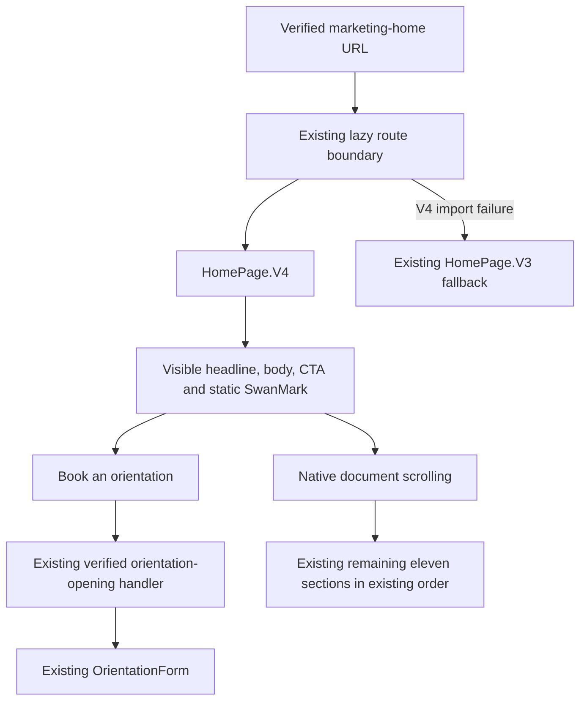
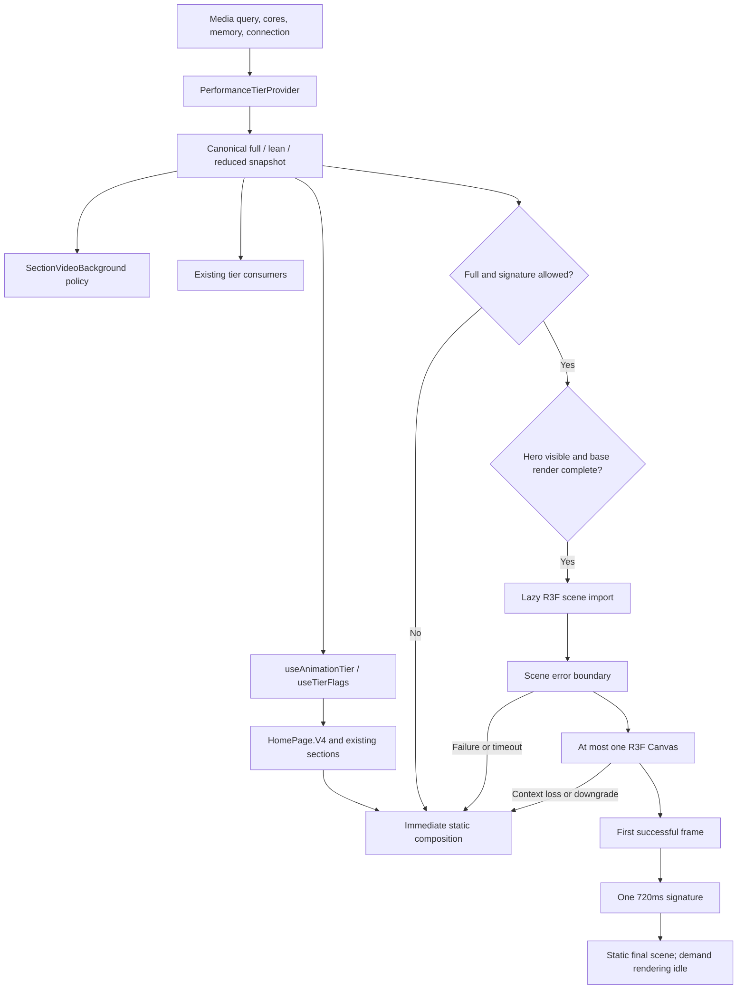
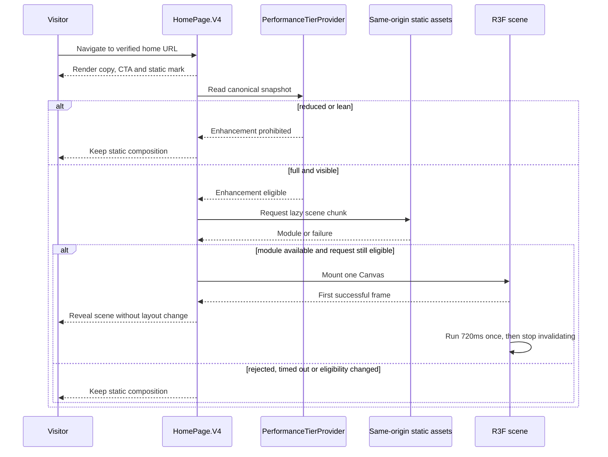
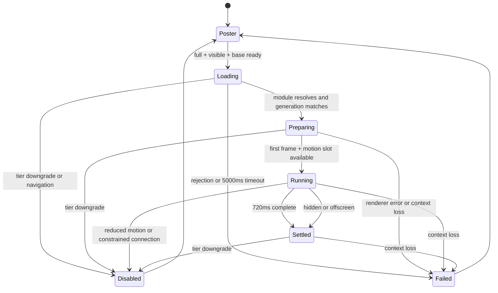
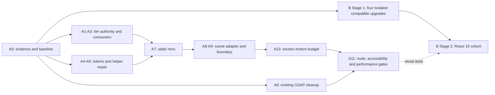

# Astra Reply — subscription transport — 2026-09-19T23:16:03.767Z

**Provider:** openai-codex
**Billing:** chatgpt-subscription
**Authentication:** chatgpt_subscription
**Transport:** codex-cli
**Requested model:** gpt-6-astra
**Served model:** unknown
**Tokens:** in=346604 out=19974
**Packet:** `docs/ai-workflow/AI-HANDOFF/BLUEPRINT-cinematic-frontend-2026-09-19/CONSULT-PACKET.md`
**Wall:** 634.8s
**Mega Blueprint:** ARMED (document)

> Marginal cost $0 — this leg rides the ChatGPT subscription, not OpenRouter.

---
I’ll verify the packet against the repo and doctrine, then produce the nine-document package. I’m applying the requested blueprint-forge workflow; this session’s read-only access means I’ll return the artifacts in the reply.

The environment blocked even read-only file commands, so I can’t inspect the local skill, doctrine, or source files. I’ll use the supplied excerpts as the review boundary and label repo claims accordingly.

The main decisions will be one tier authority, a complete static hero, and React 19 staging that does not block the cinematic work.

Two issues need stronger gates than the packet currently provides: React Three Fiber’s major version must match React’s, and `MotionConfig reducedMotion="user"` still permits opacity animation.

I’m specifying R3F 8 for React 18, an explicit static reduced-motion branch, and tests that exercise real preference changes rather than only a forced tier.

The design decision is a single crystalline SwanMark reveal, with a matching static composition for loading, reduced motion, and WebGL failure. It needs neither Lenis nor a new GSAP timeline.

I’m also narrowing unsupported claims: 390 Framer imports do not establish 390 consumers of `motion-helpers.tsx`, and the supplied PremiumParallax excerpt does not prove a leak. The package will require those caller and lifecycle checks before changes.

## PART A — HOSTILE REVIEW

**Plain-English Summary.** **REVISE.** Keep the existing home page and finish its cinematic foundation. Use one capability authority, one crystalline SwanMark reveal, and a complete static composition. React 19 remains a separate migration with its own rollback.

**Technical Summary.** Canonical capability detection belongs in `PerformanceTierProvider`; its target vocabulary is `full / lean / reduced`. `useAnimationTier` becomes its consumer adapter. Workstream A stays on React 18 with R3F 8. Introduce neither Lenis nor a new GSAP timeline. Centralize motion values in TypeScript and derive CSS custom properties from them.

**Evidence boundary.** `[VERIFIED]` below means directly supported by the supplied excerpt or linked primary documentation—not independently verified against the working tree. `[LIKELY]` identifies an inference; `[HYPOTHESIS]` identifies behavior needing reproduction; `[UNKNOWN]` identifies missing evidence. Local read commands were rejected by execution policy. The local `fable-blueprint-forge` skill, full doctrine, manifests, source files, and tests were unavailable; this response follows the supplied forge contract. Nothing was written or tested.

**A1 — Existing-blueprint review**

| ID | Finding and evidence | Concrete correction |
|---|---|---|
| A1-01 | **[VERIFIED] Capability policy has no single implementation contract.** `motion.md#9` requires `full / lean / reduced`; `useAnimationTier.ts` in packet §3.1 uses cores and reduced motion; `PerformanceTierProvider.tsx` in §3.2 additionally considers memory and connection. **[LIKELY]** the eight-core/save-data case receives inappropriate enhancement through the home hook. | Make the provider the sole detector. Specify precedence, conservative initialization, live preference changes, and transitional adapters in `03-contracts.md`. |
| A1-02 | **[VERIFIED] “In the same file” conflicts with the supplied shared-hook architecture and 300-line limit.** Evidence: `motion.md#9`, `design.md#27`, packet §2. | Replace file-local detection with **surface-local fallback ownership using one shared capability source**. Each enhancement boundary owns its fallback; detection is not duplicated. |
| A1-03 | **[VERIFIED] Tokens are named but their implementation and unit conversion are unspecified.** Evidence: `motion.md#1`; packet §5 reports no implementations. | Define one TypeScript value table, CSS projection, milliseconds-to-seconds conversion, and parity tests. Limit adoption to changed components and actual helper consumers. |
| A1-04 | **[VERIFIED] The supplied shared stagger is 100ms, exceeding the 80ms ceiling.** Evidence: `frontend/src/utils/motion-helpers.tsx:125`, as quoted in packet §6.4; `motion.md#7`. Five children also do not guarantee at most three simultaneously animated elements. | Set the shared interval to 60ms. Separately constrain the home choreography to one section reveal, one signature, and one progress indicator. Do not treat stagger compliance as concurrency compliance. |
| A1-05 | **[VERIFIED] The reduced-motion doctrine permits a gate that does not enforce the specified static outcome by itself.** Evidence: `motion.md#3`; `cinematic-pages.md#7`. Motion’s `reducedMotion` policy disables transform/layout animation while allowing opacity animation. | Add explicit static rendering paths for the signature, counters, scroll effects, and helper transitions. Retain component CSS gates. Test both independently. [MotionConfig documentation](https://motion.dev/docs/react-motion-config) |
| A1-06 | **[VERIFIED] The claimed 390-consumer blast radius is unsupported.** Evidence: packet §3.3 and §5 count imports of `framer-motion`, not imports of `motion-helpers.tsx`. **[HYPOTHESIS]** individual consumers lack adequate gates. | Inventory direct and indirect helper consumers. Change and test that actual set. Do not claim a helper fix secures every Framer consumer. |
| A1-07 | **[VERIFIED] `withMotion` forwards properties without creating a motion component.** Evidence: `frontend/src/utils/motion-helpers.tsx:153–160`, as supplied. **[UNKNOWN]** callers may already pass motion-capable components. | Inspect every caller before changing semantics. Wrap plain ref-compatible components once at module scope; preserve already motion-capable callers. Do not delete a public export during this workstream. |
| A1-08 | **[VERIFIED] Cleanup ownership is missing from the supplied GSAP design.** Evidence: `PremiumParallax.tsx:528`, `:538`, `:549` as supplied; `cinematic-pages.md#7`. **[HYPOTHESIS]** actual leakage is not proven by the truncated effects or absence of one particular cleanup API. | Reproduce mount/unmount accumulation. Scope existing animations and triggers to a local context, clean deferred callbacks and observers, and verify owned resources return to baseline. Do not globally kill unrelated triggers. [GSAP context documentation](https://gsap.com/docs/v3/GSAP/gsap.context%28%29/) |
| A1-09 | **[VERIFIED] The archetype’s 8–14 viewport-height prescription lacks an accessibility/content exception.** Evidence: `website-archetypes.md#2`; packet §2 retains twelve sections. | Treat that range as compositional guidance at desktop review size. Never force page height, clipping, spacer panels, or fixed mobile text containers to satisfy it. |
| A1-10 | **[VERIFIED] Performance thresholds lack reproducible measurement conditions.** Evidence: `cinematic-pages.md#7`; packet §8.6. `<3ms/frame` does not specify renderer, hardware, sampling, or CPU versus GPU measurement. | Define production-build lab conditions, canvas/DPR checks, real-GPU measurements, and an explicit inconclusive outcome. A 60fps observation is not evidence of a 3ms scene cost. |
| A1-11 | **[VERIFIED] R3F introduces another React-version dependency absent from the six-item migration table.** Evidence: packet §5.1 versus §0’s R3F adoption. R3F 8 pairs with React 18; R3F 9 pairs with React 19. | Pin a verified compatible R3F 8 release for A. Upgrade React, React DOM, React types, R3F, and React Leaflet together in B Stage 2. [R3F compatibility documentation](https://r3f.docs.pmnd.rs/) |
| A1-12 | **[VERIFIED] Library occurrence counts are presented as migration work counts.** Evidence: packet §5.1. A `useRef` occurrence does not prove a missing argument; the category totals may overlap. A Vite build does not prove type or runtime compatibility. | Use compiler diagnostics and resolved dependency peers to create the migration manifest. Require both type checking and runtime caller tests. React’s upgrade guide confirms changed ref typing and error reporting. [React 19 upgrade guide](https://react.dev/blog/2024/04/25/react-19-upgrade-guide) |
| A1-13 | **[VERIFIED] Replacing `framer-motion` with `motion` is not merely changing a version pin.** Evidence: packet §5.1 lists different package names. Motion documents import changes and additional styling-prop considerations in version 13. | Prefer a verified React-18-and-19-compatible `framer-motion` release retaining current imports. Package renaming is excluded from this migration. [Motion upgrade guide](https://motion.dev/docs/react-upgrade-guide) |
| A1-14 | **[UNKNOWN] The canonical surface receipt is incomplete.** The supplied `main-routes.tsx:319` establishes JSX use, but the surrounding route declaration, hero handler, form API, and backend match are absent. Evidence: packet §2. | Intake must capture the route and existing CTA chain before UI implementation. Do not invent an orientation endpoint, callback signature, or form schema. |
| A1-15 | **[VERIFIED] Existing wireframes and runnable test plans were not supplied.** Evidence: packet §4 contains doctrine excerpts, not those artifacts. The higher-authority cinematic document was also not supplied in full. | Provide the artifacts below. Require a bounded authority-conflict check at intake; do not claim unseen documents were reviewed. |

**A2 — One hostile pass against this package’s draft**

These findings changed the emitted package.

| ID | Draft defect and evidence | Incorporated correction |
|---|---|---|
| A2-01 | Draft `01-architecture.md#enhancement-loading` relied on Suspense alone; rejection and context loss could remove the hero accent. | Keep the poster mounted beneath the scene; add an error boundary, first-frame handoff, context-loss fallback, timeout, and stale-completion guard. |
| A2-02 | Draft `03-contracts.md#tier-policy` permitted optimistic startup and force-tier overrides. | Initialize conservatively. Reduced motion always wins; overrides may only lower capability. Preference/network downgrades cannot be overridden. |
| A2-03 | Draft `05-slices.md#tier-migration` renamed every consumer in one session. | Keep temporary mapping adapters, migrate explicit batches of at most eight existing implementation files, then remove aliases in a final sweep. |
| A2-04 | Draft `09-tests.md#motion` checked declarations rather than observed behavior. | Test real media-query changes, delayed import resolution, sampled motion, and deliberate violating fixtures. |
| A2-05 | Draft `09-tests.md#performance` used frame intervals as GPU evidence and could pass when the scene never loaded. | Require a rendered-scene assertion, CPU and GPU measurements, actual canvas DPR, and inconclusive failure when hardware instrumentation is unavailable. |
| A2-06 | Draft `02-wireframes.md#states` hid copy during the signature and animated multiple children. | Copy and CTA are visible immediately. Animate only the decorative mark; group section accents as one target. |
| A2-07 | Draft `04-build-order.md#react19` treated the packet’s “latest” versions as installation authority. | Verify metadata first, freeze exact resolved versions, prohibit peer bypasses, and confine unavailable-version blockers to B. |
| A2-08 | Draft `07-checkpoints.md#rollback` restored an entire dirty-tree snapshot. | Roll back only owned, reviewed changes using isolated commits or reviewed patches. Preserve concurrent work and never reset the shared tree. |

## PART B — FORGED PACKAGE

### 00-README.md

**Status:** Specification issued from supplied evidence. Implementation acceptance is pending. Proposed paths and interfaces below are explicitly new contracts, not claims about existing files.

**Delivery**

- **A:** Retain `HomePage.V4`, its twelve sections, its route-level V3 fallback, and existing conversion flow. Add one progressively enhanced crystalline SwanMark signature.
- **B Stage 1:** Independently remove compatible dependency blockers while remaining on React 18.
- **B Stage 2:** Perform a bounded React 19 migration after Stage 1, on an isolated branch with a complete dependency cohort and rollback.

A does not depend on either B stage.

**Binding decisions**

| Concern | Decision |
|---|---|
| Capability authority | Existing `PerformanceTierProvider.tsx`, with detector extracted only as needed for testing/file length. |
| Target vocabulary | `full / lean / reduced`. |
| Existing home hook | Preserve `useAnimationTier` and `useTierFlags` names; make them provider consumers. |
| Lenis | Excluded. Native scrolling remains. |
| New home GSAP | Excluded; the selected signature does not need a pinned timeline. |
| Existing GSAP defect | Repair `PremiumParallax` lifecycle separately. Do not mount it on Home merely to justify the repair. |
| Signature | Existing SwanMark geometry, crystalline treatment, one 720ms rotational reveal. |
| R3F | One lazy scene, R3F 8 on React 18. |
| Drei | No new dependency; this scene does not require its helpers. |
| Motion tokens | TypeScript source of truth with generated CSS projection. |
| Media | Static hero composition remains complete; no new video, remote model, HDRI, or texture request. |
| Conversion | Preserve the existing verified orientation-opening flow. |
| Backend | No endpoint, model, migration, or data-contract changes. |

**Scope limits**

No dashboard redesign, Framer-wide rewrite, global animation scheduler, section-list replacement, new metrics, new form, scroll hijacking, production-data tests, or repository cleanup.

**Path convention**

Existing paths are those supplied in the packet. Files marked **NEW** are proposed additions. Missing export names, mount locations, asset identities, and package versions are resolved only through the bounded intake in `04-build-order.md`; builders must not guess them.

**Release authority**

Implementation evidence goes through Gemini review, Codex hostile review, and Fable’s final decision under the supplied project rules. This package is advisory, not a commit or deployment approval. No push to `main` is authorized here.

**Documentation coverage**

Architecture, flows, wireframes, contracts, slices, bans, checkpoints, and tests are supplied below. Database ER diagrams are genuinely inapplicable: this work changes no persisted entities or columns.

### 01-architecture.md

**Canonical surface and classification**

| Surface | Classification from supplied evidence | Intake requirement |
|---|---|---|
| `HomePage.V4.tsx` | Canonical home implementation; JSX use supplied at `main-routes.tsx:319`. | Capture enclosing route declaration and full mounted chain. |
| `HomePage.V3` | Active error fallback, not an unreferenced legacy file. | Verify fallback behavior remains intact. |
| `useAnimationTier.ts` | Active home tier consumer/detector today. | Convert detector to adapter, then canonical consumer. |
| `PerformanceTierProvider.tsx` | Existing competing detector; its actual mount is unknown. | Find all mounts and consumers; retain exactly one applicable provider instance. |
| `SectionVideoBackground.tsx` | Existing component with local capability logic. | Locate mounted callers and migrate policy access. |
| `PremiumParallax.tsx` | Existing GSAP implementation; home reachability unknown. | Record actual callers; do not presume it is mounted on V4. |
| `WebGLBackground` / `CanvasBackground` | Existing rendering alternatives. | Check whether either is mounted on the home path; prevent a second home canvas. |
| SwanMark spec/factory/scene files | Existing reuse candidates. | Verify exported construction, camera, geometry, and disposal contracts. |

**User flow**



Form submission behavior is unchanged and outside the new interaction contract. Intake must trace it to ensure the CTA is attached to the real caller.

**Capability and rendering flow**



**Ownership**

- The provider owns capability detection and subscriptions.
- Each enhancement boundary owns loading, cancellation, errors, and its fallback.
- R3F owns the new renderer and rendering lifecycle.
- The reused factory supplies geometry/material resources, not another renderer or animation loop.
- A home-specific adapter may select resources from the existing factory after its API is verified.
- Explicitly owned resources are disposed once. Shared resources are not disposed by a single consumer.
- New scene code must follow the existing `spec → factory → scene` separation.

**Proposed additions**

| NEW path | Responsibility |
|---|---|
| `frontend/src/core/perf/performanceTierPolicy.ts` | Pure canonical capability decision. |
| `frontend/src/core/perf/motionTokens.ts` | Numeric timings and easing tuples. |
| `frontend/src/core/perf/motionTokenStyles.ts` | CSS projection using styled-components `css`. |
| `frontend/src/three/swanMark/homeHeroSpec.ts` | Home pose, timing, resource limits, and frozen references to verified existing mark configuration. |
| `frontend/src/three/swanMark/homeHeroFactory.ts` | Adapter around verified existing geometry construction; no renderer. |
| `frontend/src/pages/HomePage/components/sections/HeroSignature.tsx` | Eligibility, lazy boundary, lifecycle state, fallback ownership. |
| `frontend/src/pages/HomePage/components/sections/HeroSignatureScene.tsx` | R3F canvas and one-shot motion. |
| `frontend/src/pages/HomePage/components/sections/HeroSignaturePoster.tsx` | Verified existing mark asset or static projection of the same mark. |
| `frontend/src/pages/HomePage/components/sections/HeroSignature.styles.ts` | Responsive composition and CSS motion gate. |

Do not duplicate an existing equivalent file discovered during intake. Reuse it and record the substitution in the slice receipt.

**Enhancement-loading sequence**

This describes a static module request, not a new business API.



**Signature lifecycle**



Failure/disablement is latched for the current route mount. There is no automatic retry or replay. Returning to a route creates a new lifecycle.

**Business API diagrams:** N/A — no new or changed HTTP business interaction. The existing form’s exact submission path was not supplied and must not be invented.

**ER diagram:** N/A — no database schema, model, or persistent field changes.

**Doctrine replacement text**

Apply these amendments narrowly, preserving unrelated doctrine:

- `motion.md#3`: “A shared capability authority supplies the tier. Every enhanced surface owns a complete static fallback and independently enforces CSS and JavaScript reduced-motion behavior. MotionConfig alone does not establish that all motion has stopped.”
- `motion.md#9`: Replace “in the same file” with “at the enhancement boundary, using the shared tier authority; policy, scene and styles may be separated to meet file-size limits.”
- `cinematic-pages.md#7`: “One GSAP ownership context per mounted page timeline. Existing reusable components must clean their own scoped resources. No global trigger cleanup.”
- `website-archetypes.md#2`: “8–14 viewport heights is desktop compositional guidance, subordinate to content, text scaling, and native scrolling.”
- `design.md#27`: Existing bans remain binding; the token and fallback implementation below supplies enforcement for this surface.

### 02-wireframes.md

**Direction decision**

Two concepts were evaluated:

| Concept | Decision |
|---|---|
| Existing SwanMark emerging from a crystalline composition | Selected: brand-specific, reuses existing geometry, one bounded moment. |
| Generic geode/particle field | Rejected: weaker brand connection and additional scene/asset work. |

**Exact new Act-1 copy**

- Eyebrow: `SWANSTUDIOS`
- H1: `Build strength.` / `See your progress.`
- Body: `Personal training built around your goals, your workouts, and your next step.`
- Primary CTA: `Book an orientation`

No secondary hero CTA, invented statistics, autoplay control, loading message, or technical error copy.

Existing site navigation and the existing orientation form retain their current copy. They are not redesigned by this package.

**Exact palette bindings**

| Role | CSS value |
|---|---|
| Page base | `var(--bg-base, #030712)` |
| Hero depth | `var(--obsidian-black, #0A0A0F)` |
| Sapphire composition | `var(--midnight-sapphire, #002060)` |
| Raised composition plane | `var(--royal-depth, #003080)` |
| Primary text | `var(--frost-white, #E0ECF4)` |
| Static mark highlight | `var(--ice-wing, #60C0F0)` |
| Small decorative seam | `var(--gilded-fern, #C6A84B)` |
| Button background | `var(--midnight-sapphire, #002060)` |
| Button border | `var(--ice-wing, #60C0F0)` |
| Button glow | `var(--wing-purple, #8B5CF6)` |
| Focus outline | `var(--ice-wing, #60C0F0)` |

Frost White text is placed over an opaque dark text plane; the decorative glow never sits directly behind body copy. Canvas colors come from resolved CSS tokens, then use the installed Three.js color-management convention. Raw `var(...)` strings are not passed as Three.js colors.

**Desktop — 1440px reference**

```text
┌────────────────────────────────────────────────────────────────────────┐
│ Existing site navigation; preserve current labels and behavior          │
├────────────────────────────────────────────────────────────────────────┤
│                                                                        │
│   SWANSTUDIOS                                                           │
│                                                                        │
│   Build strength.                    ┌────────────────────────────┐     │
│   See your progress.                 │                            │     │
│                                      │    Crystalline SwanMark    │     │
│   Personal training built around     │    Same final composition  │     │
│   your goals, your workouts, and      │    for poster and scene    │     │
│   your next step.                    │                            │     │
│                                      └────────────────────────────┘     │
│   ┌──────────────────────────┐                                         │
│   │ Book an orientation      │                                         │
│   └──────────────────────────┘                                         │
│                                                                        │
├────────────────────────────────────────────────────────────────────────┤
│ Existing MissionSection begins in normal document flow                 │
└────────────────────────────────────────────────────────────────────────┘
```

Desktop contract:

- Content maximum width: 1440px; centered container with 48px horizontal gutters.
- Two columns: `minmax(0, 1.05fr) minmax(0, 0.95fr)`; 48px gap.
- H1: Plus Jakarta Sans, weight 700, `clamp(48px, 4.5vw, 76px)`, line-height 1.06.
- Body/UI: Sora; body 18px, line-height 1.6; body maximum width 48ch.
- CTA: minimum height 48px, horizontal padding 24px.
- Decorative square: width 100%, maximum 560px, stable `aspect-ratio: 1`.
- Content controls height. No fixed-height crop or pinned viewport.
- At QHD and 4K, retain the width and type caps.

**Mobile — 375px reference**

```text
┌─────────────────────────────────────┐
│ Existing mobile navigation          │
├─────────────────────────────────────┤
│  SWANSTUDIOS                        │
│                                     │
│  Build strength.                    │
│  See your progress.                 │
│                                     │
│  Personal training built around     │
│  your goals, your workouts, and      │
│  your next step.                    │
│                                     │
│  ┌───────────────────────────────┐  │
│  │ Book an orientation           │  │
│  └───────────────────────────────┘  │
│                                     │
│       ┌─────────────────────┐       │
│       │                     │       │
│       │ Crystalline         │       │
│       │ SwanMark            │       │
│       │                     │       │
│       └─────────────────────┘       │
│                                     │
├─────────────────────────────────────┤
│ Existing MissionSection             │
└─────────────────────────────────────┘
```

Mobile contract:

- Single column below 768px; 20px horizontal gutters.
- H1: 38px, line-height 1.08 at 375px; permit natural wrapping under text zoom.
- Body: 16px, line-height 1.6.
- CTA: full content width, minimum 48px height.
- Mark: centered, maximum width 280px; stable square.
- Copy and CTA precede decoration in DOM and visual order.
- No horizontal overflow, negative-margin breakout, or fixed hero height.

**Full, lean, reduced, and failure states**

| State | Desktop | 375px | Behavior |
|---|---|---|---|
| Initial render | Desktop composition with static mark | Mobile composition with static mark | All copy and CTA immediately visible. |
| Eligible import pending | Same | Same | No spinner or placeholder gap. |
| Full signature | Same layout; mark rotates into final pose | Same if device qualifies | One 720ms beat; copy remains still. |
| Full settled | Final mark pose | Final mark pose | No ambient loop. |
| Lean | Static mark | Static mark | No R3F request. |
| Reduced motion | Static mark | Static mark | No R3F, parallax, count-up, or reveal transition. |
| Import/render/context failure | Static mark | Static mark | Conversion path remains available. |
| Keyboard focus | 2px Ice Wing outline, 3px offset | Same | Visible immediately; no animated focus glow. |

**Reduced-motion static composition**

```text
Desktop                              375px
┌──────────────────────────────┐     ┌────────────────────────┐
│ SWANSTUDIOS                  │     │ SWANSTUDIOS            │
│ Build strength.     STATIC   │     │ Build strength.        │
│ See your progress.  SWANMARK │     │ See your progress.     │
│ Body copy unchanged          │     │ Body copy unchanged    │
│ [Book an orientation]        │     │ [Book an orientation]  │
└──────────────────────────────┘     │     STATIC SWANMARK    │
                                    └────────────────────────┘
```

The mark is decorative: `aria-hidden`, no tab stop, no pointer interception. The orientation dialog remains the existing screen; intake records its current states for regression testing without inventing a replacement wireframe.

### 03-contracts.md

**Canonical tier policy**

The following is a **NEW internal contract**, not an existing export signature:

```ts
type CanonicalTier = 'full' | 'lean' | 'reduced';

type CapabilitySnapshot = Readonly<{
  reducedMotion: boolean;
  cores?: number;
  memoryGiB?: number;
  saveData?: boolean;
  effectiveType?: string;
}>;
```

Pure resolution rules, evaluated in order:

1. Reduced motion → `reduced`.
2. Known positive cores below 4, or known positive memory below 4GiB → `reduced`.
3. Save-data enabled, or effective connection `slow-2g`, `2g`, or `3g` → `lean`.
4. Known cores of at least 8, without an earlier restriction → `full`.
5. Otherwise → `lean`.

Missing APIs are neutral; invalid numeric readings are treated as unknown. Unknown network strings do not invent a connection class. Core count is a capability heuristic, not proof of GPU speed.

Before client detection, return `reduced`; after detection, ordinary unknown hardware resolves to `lean`. No scene request occurs before detection.

**Subscriptions and overrides**

- One provider owns reduced-motion and connection-change subscriptions.
- Effects depend on subscription inputs, not the state they update.
- Compute the next tier, use a functional state update, and remove `tier` from the effect dependency array.
- Do not log or perform other side effects inside a functional updater.
- Support the existing media-query compatibility pattern discovered at intake.
- `forceTier`, if retained, is a maximum allowance: it may lower a tier, never raise it above detected restrictions.
- Preference and connection downgrades apply immediately.
- A disabled/failed signature does not restart during the same home mount, even if the provider later upgrades.

**Vocabulary migration**

| Old provider | Old home | Canonical |
|---|---|---|
| `enhanced` | `full` | `full` |
| `standard` | `balanced` | `lean` |
| `minimal` | `essential` | `reduced` |

Intermediate adapters may return old names to unmigrated consumers. They must read canonical provider state and contain no capability checks.

Final state:

- `useAnimationTier(): AnimationTier` remains the public home hook.
- `AnimationTier` denotes `full | lean | reduced`.
- `useTierFlags` keeps useful existing flag names.
- Add `isReduced`; temporarily retain `isEssential` only as a deprecated alias during migration, then remove it after the consumer sweep.
- Final runtime capability code contains no old tier literals.
- `SectionVideoBackground` reads shared policy; its independent save-data detector is removed. Media-error and playback-support checks remain valid local responsibilities.
- Existing non-home consumers receive equivalent mappings before vocabulary cleanup.

**Motion values**

TypeScript is authoritative; CSS strings and Framer seconds are projections.

| CSS token | Authoritative value |
|---|---|
| `--motion-ambient` | 12000ms |
| `--motion-response-fast` | 120ms |
| `--motion-response` | 200ms |
| `--motion-response-slow` | 320ms |
| `--motion-narrative` | 720ms |
| `--ease-out-quint` | `[0.16, 1, 0.3, 1]` |
| `--ease-in-quad` | `[0.55, 0.085, 0.68, 0.53]` |
| Stagger interval | 60ms |
| Maximum stagger group | 5 children |

CSS easing projection uses `cubic-bezier(...)`; Framer receives numeric tuples. Durations passed to Framer are milliseconds divided by 1000. No independently maintained duplicate constants.

Expose CSS properties at the existing application style root verified during intake. Shared interpolated styles use `css`, not untagged template strings.

**Shared helper behavior**

- `fadeIn`, `fadeInUp`, `fadeInLeft`, `fadeInRight`, `scaleUp`, and `staggerItem` default to the 200ms response value.
- `staggerContainer`: `staggerChildren: 0.06`, `delayChildren: 0`.
- The 720ms narrative value is explicit to the signature, not the shared helper default.
- Reduced mode renders final opacity/transform immediately, with no stagger or delay.
- Keep the existing `animationVariants` export for compatibility; add a gated selection path for actual consumers.
- Update every actual helper consumer found during intake. A static export cannot react to media-query changes by itself.
- `withMotion` must not spread animation props through a plain component unchanged. Each verified caller is classified as plain, styled/ref-compatible, or already motion-capable. Adapt plain components once outside render; avoid double wrapping.
- Preserve domain props, refs, and event handlers; test DOM prop leakage.
- If there are no callers, retain and correct the export in this slice rather than combining the repair with cleanup.

**Signature contract**

- Subject: the existing SwanMark, not a new mark.
- Home adapter reuses verified existing geometry/material construction.
- Rotation: one Y-axis movement from `−0.14` radians to `0`; fixed camera.
- Duration: 720ms using the canonical out easing.
- No particle field, camera flight, bloom, postprocessing, shadows, video, or pointer tracking.
- No remote assets.
- One Canvas maximum; explicit DPR range `[1, 1.5]`, remaining below the doctrine’s ceiling of 2.
- Use demand rendering; request frames only while the beat is active or the scene needs a resize update.
- Native document scrolling remains unchanged.

Demand rendering requires explicit invalidation for imperative updates. [R3F performance documentation](https://r3f.docs.pmnd.rs/advanced/scaling-performance)

**Fallback and cancellation**

- Static mark and its reserved dimensions exist before any scene import.
- Begin loading only after the base hero has painted, the hero is visible, and full capability is established.
- A 5000ms import/preparation timeout keeps the poster and latches failure.
- Promise completion checks a generation token, mount status, and current eligibility.
- A tier downgrade prevents a late import from mounting a canvas.
- Poster-to-scene handoff occurs only after a successful first frame; no layout change or opacity crossfade.
- Context loss immediately restores the poster and stops the scene.
- Offscreen/hidden during the beat: finish logically without replay; stop frame requests.
- Suspense handles pending work; a separate boundary handles failures. R3F documents both unsupported-WebGL fallback and crash protection. [R3F Canvas documentation](https://r3f.docs.pmnd.rs/api/canvas)

**Home motion budget**

At most these three home-controlled targets may animate together:

1. Signature canvas, counted conservatively as one animated target.
2. `ScrollProgress`, using one transform.
3. One `SectionTransition` wrapper, using opacity and transform.

Remaining rules:

- Sections animate at most one wrapper; no simultaneous nested character, particle, counter, or card animations.
- Section reveal: 200ms, once, maximum 12px translation.
- If another section reveal is active, newly visible sections appear immediately in their final state; do not queue hidden content.
- CTA hover/press/focus styling changes immediately on this surface.
- Noise remains static.
- Full/lean section reveals are permitted; reduced mode renders final states.
- Counters display final values on Home.
- Existing shell motion counts toward the viewport cap. Intake must identify it; reduce home activity accordingly. A conflicting shell requiring unrelated changes is a scoped blocker, not permission for a global redesign.

**Dependency contracts**

| Stage | Binding rule |
|---|---|
| A | Retain installed React 18 and React DOM pair. Select highest stable R3F 8 release whose published peers accept the installed React, types, and Three.js versions. Freeze exact version. |
| B1 Framer | Select highest stable `framer-motion` 12.x release whose peers accept both installed React 18 and intended React 19. Retain import paths. If no candidate qualifies, block this slice. |
| B1 Lucide | Verify packet candidate `1.47.0`, peer ranges, exports, and installed caller APIs before freezing. |
| B1 Helmet | Verify packet candidate `3.0.0`, provider API, metadata behavior, and React peers. |
| B1 Simple Maps | Verify packet candidate `5.0.5`, its one reported consumer, and React peers. |
| B2 | Verify packet target React/React DOM `19.3.0`; use matching runtime versions. Freeze compatible React 19 type packages, R3F 9, and React Leaflet 5 together. |

The packet’s exact package versions are **[UNKNOWN] as independently verified registry facts**. Missing candidates stop only their dependency slice. No `--force`, `--legacy-peer-deps`, dependency alias, or unreviewed override.

**API, schema, environment, and rollback**

- APIs: unchanged; no new URL strings.
- Database/model migrations: N/A — no persistence changes.
- Production environment variables: none added.
- Feature deployment: static composition remains functional if enhancement fails.
- A rollback removes the signature integration and its owned dependencies while preserving the static hero and unrelated work.
- B1 rollback reverses one dependency slice, including its lockfile changes.
- B2 rollback reverses the complete React dependency cohort, types, source adaptations, and error-reporting changes together.
- Never restore an entire dirty working tree or overwrite a concurrent agent’s changes.

### 04-build-order.md

**Intake — required evidence, bounded scope**

Before implementation, the builder reads the actual skill and project startup files and resolves these facts:

1. Current HEAD, branch, dirty paths, other agent’s locks, and relevant review requests.
2. Enclosing route declaration, V4 JSX mount, V3 fallback, Hero invocation, orientation handler, and existing form path.
3. Exact provider exports, provider mounts, hook consumers, and section prop types.
4. Actual `motion-helpers` callers and each `withMotion` input.
5. Full `PremiumParallax` effects, resource creation, cleanup, and mounted callers.
6. SwanMark factory signature, scene setup, available static mark, and resource ownership.
7. Package manager, lockfile owner, installed versions, test setup, build/type commands, and peer metadata.
8. Home/shared-shell motion inventory, baseline screenshots, and production-build performance.
9. Higher-authority doctrine conflicts and required documentation conventions.

This is evidence extraction, not a delegated design exercise. If reality contradicts a decided interface or requires broader architecture, stop that slice and return the exact contradiction.

Run the required non-destructive hygiene inventory. Do not move or delete files.

**Dependency graph**



**Implementation order**

- Complete A0 first.
- A1–A5 establish policy and helper behavior.
- A6 repairs existing GSAP independently.
- A7 delivers the static composition.
- A8–A10 add and constrain enhancement.
- A11 verifies the real route.
- B Stage 1 may proceed independently once its intake is complete.
- B Stage 2 remains a later, isolated phase.

**Session-size rule**

Each builder session changes at most eight existing implementation files plus narrowly related tests. A dependency slice changes one dependency family, its lockfile, and its verified callers. Split larger inventories into numbered batches with frozen filenames before handing them to the flash-tier builder.

No session receives “fix all consumers,” “finish the migration,” or another open-ended instruction.

### 05-slices.md

All test paths listed here are **NEW planned tests** detailed in `09-tests.md`. Commands run from `frontend/` unless stated otherwise.

| Slice | Files and work | Acceptance command / proof |
|---|---|---|
| **A0 — Intake** | Read-only receipt, caller inventories, dependency metadata, baseline, doctrine check. Record output inside this package’s existing documents and approved QA location. | `git status --short`; `npm ls react react-dom three gsap framer-motion --depth=0`; baseline type/build commands. No implementation before receipt. |
| **A1 — Pure tier policy** | NEW `performanceTierPolicy.ts` and unit test. Implement exact precedence and unknown handling. | `npx --no-install vitest run src/core/perf/performanceTierPolicy.test.ts` |
| **A2 — Provider lifecycle** | Existing `PerformanceTierProvider.tsx`; test. Canonical state, safe subscriptions, functional updates, restricted overrides. | `npx --no-install vitest run src/core/perf/PerformanceTierProvider.test.tsx` |
| **A3.n — Consumer migration** | `useAnimationTier.ts`, actual provider consumers, twelve sections, background/video consumers; batches ≤8 files. Temporary name adapters allowed. | `npx --no-install vitest run src/hooks/useAnimationTier.test.tsx`; type check; caller-specific smoke tests. Final batch removes old literals and duplicate detection. |
| **A4 — Token projection** | NEW motion token modules and verified existing style-root integration. | `npx --no-install vitest run src/core/perf/motionTokens.test.ts` |
| **A5.n — Helper repair** | `motion-helpers.tsx` and actual callers only. Duration/stagger correction, reduced path, caller-aware wrapping. | `npx --no-install vitest run src/utils/motion-helpers.test.tsx`; relevant caller tests. |
| **A6 — GSAP cleanup** | `PremiumParallax.tsx`; extract focused styles/effects if required to meet file cap. Preserve its public contract and appearance. | `npx --no-install vitest run src/components/PremiumParallax/PremiumParallax.lifecycle.test.tsx`; browser mount-cycle test. |
| **A7 — Static Act 1** | Existing `HeroSection` and V4 integration as verified; NEW poster/styles. Exact copy, layout, CTA binding, static reduced state. | `npx --no-install playwright test -c playwright.cinematic.config.ts tests/cinematic/home.spec.ts` |
| **A8 — Scene construction** | NEW `homeHeroSpec.ts`, `homeHeroFactory.ts`, `HeroSignatureScene.tsx`; exact compatible R3F 8 pin. Reuse existing geometry. | `npx --no-install vitest run src/three/swanMark/homeHeroFactory.test.ts`; peer check; build. |
| **A9 — Enhancement boundary** | NEW `HeroSignature.tsx`; integrate into Hero. Cancellation, first-frame handoff, errors, context loss. | `npx --no-install vitest run src/pages/HomePage/components/sections/HeroSignature.test.tsx`; full/fallback browser cases. |
| **A10.n — Motion budget** | Existing animation primitives and section callers, ≤8 files per batch. Single wrapper reveals, static nested effects, final counters. | `npx --no-install playwright test -c playwright.cinematic.config.ts tests/cinematic/motion-budget.spec.ts` |
| **A11 — A acceptance** | Actual V4 route, screenshots, accessibility, bundle and performance evidence. | Commands in `09-tests.md`; no waived thresholds disguised as passes. |
| **B1a — Framer** | Verified `framer-motion` candidate, lockfile, actual API adjustments. Keep import names. | Helper tests, home motion tests, type/build, existing animation caller tests. |
| **B1b — Lucide** | Verified candidate; fix compiler-proven export/API changes only, in bounded batches. | Type/build; icon rendering smoke on changed callers. |
| **B1c — Helmet** | Verified candidate; retain existing provider architecture. | Metadata mount/update/unmount tests and actual home browser checks. |
| **B1d — Simple Maps** | Verified candidate and its actual consumer. | Synthetic-data render/interaction test, type/build. |
| **B2a — React 19 preparation** | Generate compiler/dependency/caller manifest; React-18-compatible type corrections in ≤8-file batches. | Type/build on React 18; no automatic rewrite of every `useRef`. |
| **B2b — Cohort switch** | Isolated branch: React/DOM, types, R3F 9, Leaflet 5, required verified peers. | Clean dependency install, peer validation, type/build, React 19 test suite. |
| **B2c — Runtime acceptance** | Error boundaries/reporting, metadata, charts, drag/drop, lazy maps, scene lifecycle. | Actual caller tests with synthetic data; review and complete-cohort rollback rehearsal. |

**Nine supplied defects — disposition**

| Packet defect | Decision |
|---|---|
| §6.1 competing tiers | A1–A3: single provider authority, canonical vocabulary, bounded adapters. |
| §6.2 effect churn | A2: remove state dependency; stable subscriptions; pure updater. |
| §6.3 missing tokens | A4: shared numeric source and CSS projection. |
| §6.4 stagger ceiling | A5: 60ms; A10 independently enforces concurrency. |
| §6.5 missing helper gate | A5: explicit static variants and actual-consumer migration. |
| §6.6 inert `withMotion` | A5: caller classification and correct wrapping; no blind deletion. |
| §6.7 unmapped durations | A5: response defaults; explicit narrative signature. |
| §6.8 GSAP cleanup | A6: reproduce and fix resource ownership; verify real triggers. |
| §6.9 file-local contradiction | A0 documentation amendment plus A1/A9 implementation separation. |

### 06-bans.md

- No replacement of the twelve-section home structure.
- No new capability detector outside the canonical provider policy.
- No permanent old-tier adapters after A3 completes.
- No full-tier override of reduced motion, save-data, or constrained-network policy.
- No R3F, Three.js scene machinery, or new GSAP import through the initial home rendering graph.
- No R3F request in lean/reduced mode.
- No Lenis, scroll hijacking, new pinned home timeline, second canvas, or persistent render loop.
- No new particle field, remote model, texture, HDRI, bloom, or video.
- No disappearing copy, delayed CTA, spinner-only hero, or blank failure state.
- No replay after downgrade, context loss, or failed import during the same route mount.
- No global `ScrollTrigger` destruction.
- No opacity-only “reduced” animation justified solely by MotionConfig.
- No animation of layout properties, large blur, box-shadow, or background position.
- No more than two animated properties per target or three animated targets in a viewport.
- No stagger over 80ms or more than five children in a stagger group.
- No animated nested section children while their wrapper animates.
- No MUI, new Tailwind, retired palette, Arctic Cyan button/glow, fake metrics, or unapproved brand geometry.
- No new files over 300 lines; required component headers and documentation apply.
- No claim that all Framer consumers inherit the helper repair.
- No React 19 install based solely on a “latest” table.
- No package-manager peer bypasses or type-check suppression to pass the migration.
- No broad `any` substitution for changed React types.
- No production API writes, form submissions, or personal data in automated tests.
- No whole-tree rollback, cleanup, broad staging, or push to `main`.
- No test pass, live-surface fix, or performance claim without corresponding evidence.

### 07-checkpoints.md

**C0 — Evidence gate**

Required:

- Real route and JSX mount receipt.
- Existing CTA/form chain; API/backend trace where applicable.
- Provider mount/export and consumer inventory.
- Actual helper callers.
- Existing SwanMark construction/static-source contract.
- Exact dependency/lockfile/test-tool facts.
- Shared-shell motion inventory.
- Other-agent lane check and owned-file claim before edits.
- Higher-authority doctrine conflict check.

Missing evidence blocks only its dependent slice. Architecture substitutions require adjudication, not flash-builder improvisation.

**C1 — Policy gate**

Pass when:

- All specified capability cases pass.
- No optimistic enhancement request occurs before detection.
- Reduced-motion and connection changes reach mounted callers.
- Subscriptions remain stable and clean up under Strict Mode.
- Final consumer sweep finds no independent cinema-tier detection or old runtime tier literals.

**C2 — Static surface gate**

Pass when:

- Exact Act-1 copy appears on V4.
- The existing orientation action remains reachable by keyboard and touch.
- Poster dimensions prevent scene-loading layout shift.
- Reduced, failed, and pending states retain the same content and CTA.
- Text contrast is at least 4.5:1.
- Interactive targets are at least 44px; primary CTA is at least 48px high.
- Layout passes 375×812, 414×896, 768×1024, 1280×800, 1920×1080, 2560×1440, and 3840×2160.
- 200% text zoom remains usable without clipping.

**C3 — Motion/lifecycle gate**

Pass when:

- Exactly one signature is eligible in full mode; none in lean/reduced.
- Signature executes once and demand rendering becomes idle.
- Import failure, timeout, late resolution, context loss, route exit, and runtime preference change preserve the poster.
- Existing GSAP owned-resource counts return to baseline after repeated mounts.
- CSS and JS gates pass independently.
- Runtime viewport motion limits pass, including existing shell activity.

**C4 — Performance gate**

Pass when:

- Production build retains lazy scene boundaries.
- Lean/reduced navigation requests no scene chunk.
- Canvas count ≤1; actual DPR ≤2.
- Mobile lab LCP meets the specified 2.5s threshold.
- Real-GPU scene-cost measurement meets `<3ms/frame` under `09-tests.md`.
- Unsupported measurement produces **INCONCLUSIVE**, never a pass.
- Pre-existing performance failure is reported explicitly; it is not concealed by a no-regression claim.

**C5 — React staging gate**

B1:

- React remains 18.
- Each upgraded dependency has verified peers, frozen versions, caller tests, and independent rollback.
- No forced peer resolution.

B2:

- Cohort install is reproducible.
- Type checking and production build pass.
- Real affected callers pass runtime tests.
- Render-error capture is verified, including deduplication.
- Cohort rollback restores the verified React 18 baseline.

**C6 — Review and hygiene**

- Collect precise diff, commands, results, screenshots, and known limitations.
- Route implementation through the project review chain.
- No continuity closeout unless explicitly requested.
- Store new screenshots/traces in the existing approved QA location found at intake.
- Record proposed obsolete artifacts without moving them.
- This consultation created no local files, screenshots, or temporary artifacts.

### 09-tests.md

**Execution status:** None of these tests ran in this consultation. Every test file named below is a **NEW implementation deliverable**. The commands become runnable after its owning slice creates the file and intake verifies the installed runner.

**Runner contract**

Use the repository’s installed Vitest and Playwright versions. Add **NEW** `frontend/playwright.cinematic.config.ts` only as a narrow configuration for this work:

- Production Vite preview on `127.0.0.1:4173`.
- Command: `npx --no-install vite preview --host 127.0.0.1 --port 4173 --strictPort`.
- Synthetic fixtures; reject unexpected non-read API requests.
- No backend process started against the production database.
- Browser projects use installed browser tooling; record exact browser versions.
- Missing runner/browser tooling is a preparation blocker, not permission to fetch an unpinned latest version.
- Reuse existing fixtures and conventions where discovered; record exact substitutions.

**Baseline and acceptance commands**

From `frontend/`:

```powershell
npm ls react react-dom three gsap framer-motion --depth=0
npx --no-install tsc --noEmit
npm run build
```

For the bundle audit, produce a manifest using the verified Vite build script:

```powershell
npm run build -- --manifest
```

No successful Vite build substitutes for the type-check command.

**Unit and integration cases**

| NEW test file | Named cases and proof |
|---|---|
| `src/core/perf/performanceTierPolicy.test.ts` | `reduced preference overrides all capabilities`; `low cores or memory select reduced`; `saveData and 2g select lean with eight cores`; `3g selects lean`; `unknown inputs select lean after detection`; `invalid values are unknown`; `eligible eight-core device selects full`. |
| `src/core/perf/PerformanceTierProvider.test.tsx` | `initial snapshot prohibits enhancement`; `one subscription survives tier changes`; `StrictMode cleanup restores baseline`; `media-query change updates mounted consumers`; `connection change downgrades immediately`; `forceTier cannot elevate capability`; `missing connection API does not throw`. |
| `src/hooks/useAnimationTier.test.tsx` | `hook reads provider without a second detector`; `temporary aliases map exactly`; `final flags derive from canonical values`; `two consumers observe the same update`. |
| `src/core/perf/motionTokens.test.ts` | `CSS and TS values agree`; `Framer seconds are converted once`; `stagger is sixty milliseconds`; `narrative value does not become helper default`. |
| `src/utils/motion-helpers.test.tsx` | `reduced variants reveal final content immediately`; `runtime reduction cancels active helper motion`; `plain component receives functioning motion wrapper`; `already motion-capable caller is not double wrapped`; `ref and click handler survive`; `motion props do not leak to DOM`; `stagger delay stays within ceiling`. |
| `src/components/PremiumParallax/PremiumParallax.lifecycle.test.tsx` | `owned timeline is cleaned on unmount`; `dependency change replaces rather than accumulates`; `StrictMode remount is balanced`; `deferred callback after cleanup creates no trigger`; `unrelated trigger survives cleanup`. |
| `src/three/swanMark/homeHeroFactory.test.ts` | `adapter reuses verified mark construction`; `factory creates no renderer or RAF`; `owned resources dispose once`; `shared resources remain usable`; `home spec obeys pose and resource limits`. |
| `src/pages/HomePage/components/sections/HeroSignature.test.tsx` | `poster renders before import`; `lean and reduced never invoke loader`; `rejected loader preserves CTA`; `late resolution after downgrade mounts no canvas`; `timeout latches fallback`; `unmount invalidates pending completion`; `context loss restores poster`; `successful first frame permits handoff`; `settled scene stops invalidating`. |

Run each file using the command in its slice. Run the complete unit group before A acceptance:

```powershell
npx --no-install vitest run src/core/perf src/hooks/useAnimationTier.test.tsx src/utils/motion-helpers.test.tsx src/components/PremiumParallax/PremiumParallax.lifecycle.test.tsx src/three/swanMark/homeHeroFactory.test.ts src/pages/HomePage/components/sections/HeroSignature.test.tsx
```

Mocks may test bookkeeping, but mocked GSAP counts do not establish browser cleanup. The browser case below supplies that evidence.

**Home and fallback browser tests**

NEW `tests/cinematic/home.spec.ts`:

- `actual home route mounts V4`: navigate through the verified route; assert V4 identity, exact H1, existing section order, and the real CTA.
- `orientation action remains connected`: keyboard activation opens the existing dialog; focus enters and returns on dismissal. Do not submit.
- `static layout survives pending and rejected scene`: delay/block the discovered scene chunk; assert headline, CTA, mark, and dimensions.
- `full mode renders the actual scene`: inject capability readings before page initialization; assert first frame and nonempty canvas, not merely a tier label.
- `saveData blocks scene requests`: eight cores plus save-data; inspect requests and canvas count.
- `slow connection blocks scene requests`: repeat with 2g.
- `reduced at startup remains static`: real browser reduced-motion emulation before navigation.
- `reduced during import prevents mount`: delay import, switch media preference, release import.
- `reduced during animation returns to poster`: change preference while the actual beat is active.
- `context loss preserves conversion`: trigger supported WebGL context loss and verify poster/CTA.
- `responsive matrix has no clipping`: all checkpoint dimensions, full and reduced states.
- `text zoom retains accessible controls`: 200% zoom/reflow.
- `V4 failure retains the existing V3 route fallback`: test the actual lazy boundary using the established repository error-injection pattern.

```powershell
npx --no-install playwright test -c playwright.cinematic.config.ts tests/cinematic/home.spec.ts
```

**Dual-gate and motion-budget tests**

NEW `tests/cinematic/motion-budget.spec.ts`:

1. `CSS gate independently stops component CSS motion`  
   Render the component’s real styled wrapper with ordinary animation styles while emulating reduced motion. Inspect computed animation/transition values. Do not rely on the JS branch for this case.

2. `JS gate independently stops imperative motion`  
   In a fixture without the component CSS gate, toggle the real media query and verify static final props, no canvas loader invocation, no changing transforms, and final counter values.

3. `one signature exists and executes once`  
   Assert one declared signature boundary, a real rendered beat in full mode, and no second execution on scroll re-entry. Inspect actual animation behavior; a marker alone cannot pass.

4. `no element animates more than two properties`  
   Sample the mounted home and shell through entrance, scrolling, hover, and keyboard focus. Include CSS/WAAPI animations and JS-driven computed-style changes.

5. `no viewport contains more than three active targets`  
   Sample rendered frames while traversing the page at every matrix size. Count pseudo-element motion and active canvas rendering; deduplicate by actual target. Observe JS-driven changes rather than relying solely on `document.getAnimations()`.

6. `stagger interval and group size comply`  
   Exercise real helper consumers; assert intervals ≤80ms and groups ≤5. Verify home sections do not introduce nested animated groups.

7. `budget detector rejects deliberate violations`  
   Fixture with four moving targets must fail the counter; fixture with a third animated property must fail; fixture with 100ms stagger must fail. These negative controls prevent vacuous enforcement.

8. `PremiumParallax returns actual triggers to baseline`  
   Mount/unmount its verified caller ten times; compare actual owned trigger counts and leave an unrelated sentinel trigger intact.

```powershell
npx --no-install playwright test -c playwright.cinematic.config.ts tests/cinematic/motion-budget.spec.ts
```

**Bundle checks**

NEW `tests/cinematic/bundle.spec.ts`:

- Follow the generated Vite manifest’s static import graph.
- Assert R3F and the home scene are outside the initial home-rendering graph.
- Assert the scene remains dynamically reachable from the enhancement boundary.
- Inspect browser network evidence for no scene request in lean/reduced mode.
- Negative fixture: making the scene a static entry import must fail the checker.
- Match module identity through build metadata, not guessed hashed filenames.

```powershell
npx --no-install playwright test -c playwright.cinematic.config.ts tests/cinematic/bundle.spec.ts
```

**Performance measurement**

NEW `tests/cinematic/performance.spec.ts`:

`mobile LCP meets budget`

- Production build, 375×812 viewport, device scale factor 2.
- Chromium browser/version and machine recorded.
- Fresh context/cache for every run.
- Network: 150ms latency, 1.6Mbps down, 750Kbps up.
- CPU: 4× slowdown.
- Five navigations per tested capability mode.
- Capture buffered LCP entries before user interaction; terminate collection at the documented settled observation point.
- Pass when nearest-rank p75 across the five runs is ≤2500ms.
- Record the actual LCP element and all five values.
- This is a lab gate, not a claim about production field p75. The 2.5s field target applies to the 75th percentile of visits. [LCP guidance](https://web.dev/articles/optimize-lcp)

`canvas count and actual DPR obey contract`

- Full mode must render a real scene.
- Count actual canvases on the route.
- Measure drawing-buffer dimensions against CSS dimensions.
- Assert count ≤1 and DPR ≤2; test at device scale factors 1, 2, and 3.

`scene cost stays below three milliseconds`

- Run headed on recorded hardware with a real GPU; software rendering does not qualify.
- Test 375×812 and 2560×1440 layouts at maximum configured scene DPR.
- Instrument actual scene update plus renderer submission on the CPU.
- Measure actual render commands with supported disjoint GPU timer queries.
- Collect every rendered signature frame across ten fresh mounts, including first rendered frames; do not discard expensive first frames as warm-up.
- Reject disjoint/invalid samples and rerun only the invalid sample set.
- Conservative package gate: **CPU scene cost + GPU render cost <3ms for every valid sampled frame**.
- Also report maximum and p95 values, renderer identity, sample count, and any invalid samples.
- Missing GPU timing support yields **INCONCLUSIVE**; the real-GPU checkpoint remains open.
- Frame intervals and `requestAnimationFrame` deltas are not GPU timings. The extension exposes elapsed GPU-query measurement and a disjoint flag. [Khronos timer-query specification](https://registry.khronos.org/webgl/extensions/EXT_disjoint_timer_query_webgl2/)

`settled scene is idle`

- After completion, verify no continuing scene-driven frame invalidation.
- Repeat while hidden/offscreen.
- Resizing may request bounded redraws but must not restart the signature.

```powershell
npx --no-install playwright test -c playwright.cinematic.config.ts tests/cinematic/performance.spec.ts
```

A successful fallback-only run cannot satisfy full-scene performance acceptance.

**React migration tests**

NEW `tests/cinematic/react19.spec.ts` and caller-specific unit tests selected from the intake manifest:

- `runtime and renderer resolve one React cohort`.
- `home mounts and signature settles under StrictMode`.
- `lazy map opens with synthetic fixtures`.
- `simple map renders its existing interactions`.
- `helmet updates and restores document metadata`.
- `representative Victory chart renders and updates`.
- `existing drag interaction completes`.
- `caught render failure displays its existing boundary`.
- `uncaught render failure reaches the configured reporter once`.
- `boundary and root reporting do not duplicate the same error`.
- `orientation dialog retains focus and dismissal behavior`.

React 19 changes render-error reporting and offers root callbacks; inspect the existing reporter before selecting ownership. Do not introduce a second reporting pipeline. [React upgrade guide](https://react.dev/blog/2024/04/25/react-19-upgrade-guide)

Stage 2 acceptance commands:

```powershell
npm ci
npm ls react react-dom @types/react @types/react-dom @react-three/fiber react-leaflet
npx --no-install tsc --noEmit
npm run build
npx --no-install playwright test -c playwright.cinematic.config.ts tests/cinematic/react19.spec.ts
```

Run these in the isolated migration checkout. `npm ci` uses the existing lockfile owner established at intake; if this repository installs from a different workspace root, freeze that exact command before B2 starts.

## PART C — DECISION-DENSITY SELF-TEST

| Choice a builder might otherwise make | Resolution or bounded delegation |
|---|---|
| Which capability implementation wins? | Decided: `PerformanceTierProvider`. |
| Which vocabulary survives? | Decided: `full / lean / reduced`. |
| How do old consumers survive intermediate commits? | Decided: mapping-only adapters; remove after bounded consumer migration. |
| Where is the provider mounted? | **[UNKNOWN]** Intake must identify existing mounts and select the nearest existing common application ancestor. No duplicate provider and no guessed root file. |
| What wins when signals conflict? | Decided: reduced preference, low hardware, constrained connection, then full eligibility. |
| What happens before detection? | Decided: reduced/static; no scene request. |
| Can an override force animation? | Decided: no; overrides only lower capability. |
| Do recovered capabilities replay the signature? | Decided: no within the current route mount. |
| How do video/background consumers migrate? | Decided: consume provider policy; retain only local media/render failure handling. Exact caller list is intake evidence. |
| Which scroll library is added? | Decided: none. |
| Does the new signature use GSAP? | Decided: no. Existing GSAP cleanup remains a separate slice. |
| Is Drei installed? | Decided: no new Drei dependency. |
| What is the signature subject? | Decided: existing SwanMark, no new brand geometry. |
| Which factory exports and static asset are used? | **[UNKNOWN]** Bind verified existing exports and asset during A0. If reuse requires a new renderer or invented geometry, block A8 and return the conflict. |
| What are the exact camera/material defaults? | **[UNKNOWN]** Reuse and freeze the existing SwanMark setup in A0; only the specified home pose/resource restrictions may change without adjudication. |
| Who owns rendering and disposal? | Decided: R3F owns renderer/lifecycle; factory supplies resources; ownership receipt distinguishes shared from local resources. |
| What happens on slow import, failure, or context loss? | Decided: retained poster, timeout, guarded completion, no same-mount retry. |
| What are the hero copy and layout? | Decided in `02-wireframes.md`, including 375px and reduced motion. |
| What does the CTA invoke? | **[UNKNOWN] exact signature.** Bind the existing verified orientation-opening handler; do not invent an endpoint or callback. Missing chain blocks A7 wiring. |
| Are other screens redesigned? | Decided: no. Existing form/navigation states are regression targets. |
| How are motion values shared? | Decided: TypeScript source, CSS projection, explicit unit conversion. |
| How is reduced motion enforced? | Decided: CSS gate plus explicit JS static behavior; independently tested. |
| Does changing a helper fix 390 files? | Decided: no such claim. Intake supplies actual helper consumers. |
| How is `withMotion` repaired? | Decided algorithm by verified caller class; no deletion or blind double wrapping. |
| How are stagger and concurrency reconciled? | Decided separately: 60ms/5-child helper cap; home permits one active section wrapper and a three-target viewport budget. |
| What if existing shell motion consumes the budget? | Count it; reduce home activity. Broader shell changes require adjudication and are not delegated to the flash builder. |
| Is PremiumParallax definitely leaking? | **[HYPOTHESIS]** Reproduce through actual triggers; apply scoped ownership and cleanup tests regardless of terminology. |
| Which package versions are installed? | **[UNKNOWN]** Verify packet candidates and deterministic version-selection rules, freeze exact metadata/lockfile. No latest/force fallback. |
| Does B block A? | Decided: no. |
| What changes together for React 19? | Decided: complete runtime/types/R3F/Leaflet cohort plus compiler-proven adaptations. |
| Which TypeScript occurrences require edits? | Compiler/caller evidence only; batch ≤8 existing implementation files. No blanket ref rewrite. |
| Where does error reporting live? | **[UNKNOWN] existing reporter.** Inspect and choose one existing ownership path; test caught/uncaught and deduplication. |
| Which test tools/configuration exist? | **[UNKNOWN]** Intake binds installed versions and conventions; proposed tests/config are explicitly new. No claimed execution. |
| How is `<3ms/frame` proven? | Decided: real scene, recorded real GPU, CPU plus GPU measurements; missing instrumentation leaves the gate open. |
| What if baseline checks already fail? | Record exact failures; do not claim acceptance or silently expand the workstream. |
| How are dirty-tree changes protected? | Explicit ownership, bounded slices, isolated dependency cohort, owned-change rollback. |
| Who authorizes release? | Existing review chain; Fable final decision. No main push authorization here. |
| Where do QA artifacts go? | Existing approved QA location identified during intake; no root-level accumulation. |
| Were omitted documents reviewed? | No. Full skill/doctrine/source verification remains the bounded A0 obligation. |

The package resolves design choices within the supplied evidence. Local source verification, implementation, and test execution remain unperformed because execution policy rejected the read commands.
