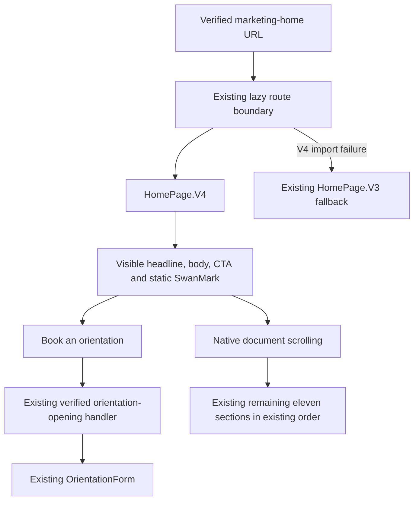
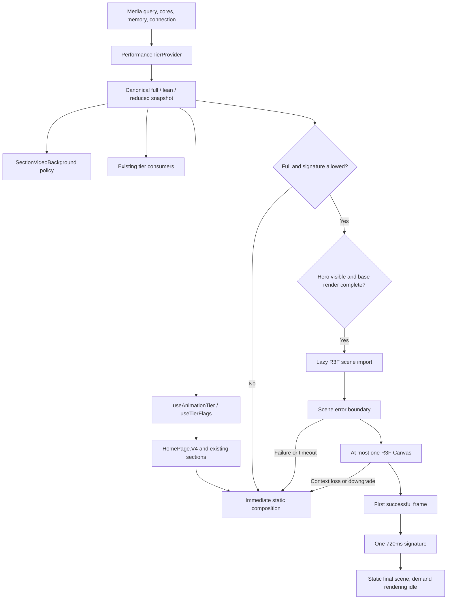
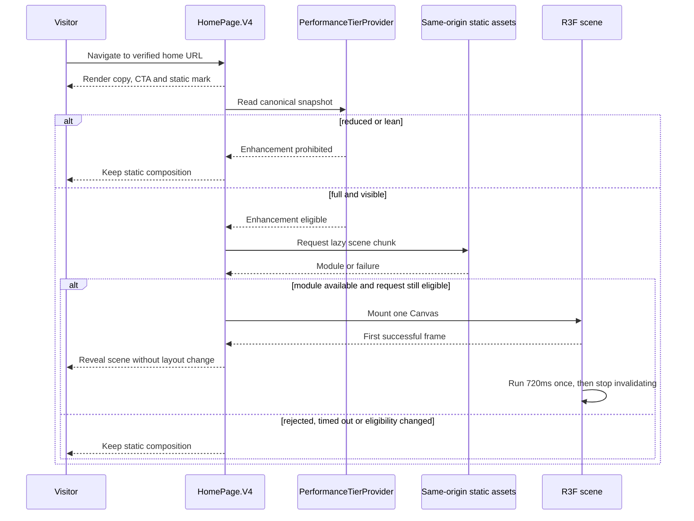
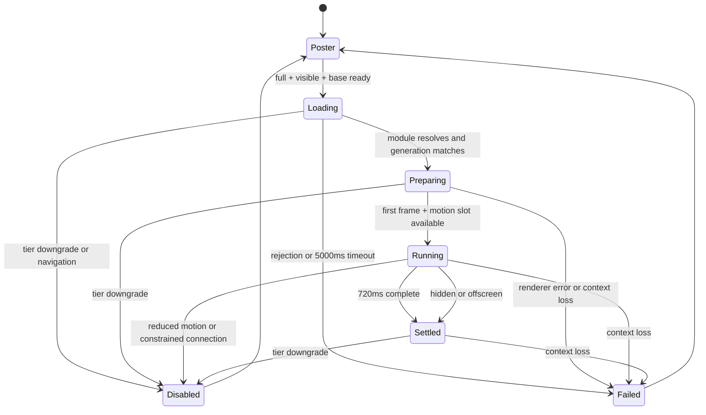

**Canonical surface and classification**

| Surface | Classification from supplied evidence | Intake requirement |
|---|---|---|
| `HomePage.V4.tsx` | Canonical home implementation; JSX use supplied at `main-routes.tsx:319`. | Capture enclosing route declaration and full mounted chain. |
| `HomePage.V3` | Active error fallback, not an unreferenced legacy file. | Verify fallback behavior remains intact. |
| `useAnimationTier.ts` | Active home tier consumer/detector today. | Convert detector to adapter, then canonical consumer. |
| `PerformanceTierProvider.tsx` | Existing competing detector; its actual mount is unknown. | Find all mounts and consumers; retain exactly one applicable provider instance. |
| `SectionVideoBackground.tsx` | Existing component with local capability logic. | Locate mounted callers and migrate policy access. |
| `PremiumParallax.tsx` | Existing GSAP implementation; home reachability unknown. | Record actual callers; do not presume it is mounted on V4. |
| `WebGLBackground` / `CanvasBackground` | Existing rendering alternatives. | Check whether either is mounted on the home path; prevent a second home canvas. |
| SwanMark spec/factory/scene files | Existing reuse candidates. | Verify exported construction, camera, geometry, and disposal contracts. |

**User flow**

Form submission behavior is unchanged and outside the new interaction contract. Intake must trace it to ensure the CTA is attached to the real caller.

**Capability and rendering flow**

**Ownership**

- The provider owns capability detection and subscriptions.
- Each enhancement boundary owns loading, cancellation, errors, and its fallback.
- R3F owns the new renderer and rendering lifecycle.
- The reused factory supplies geometry/material resources, not another renderer or animation loop.
- A home-specific adapter may select resources from the existing factory after its API is verified.
- Explicitly owned resources are disposed once. Shared resources are not disposed by a single consumer.
- New scene code must follow the existing `spec → factory → scene` separation.

**Proposed additions**

| NEW path | Responsibility |
|---|---|
| `frontend/src/core/perf/performanceTierPolicy.ts` | Pure canonical capability decision. |
| `frontend/src/core/perf/motionTokens.ts` | Numeric timings and easing tuples. |
| `frontend/src/core/perf/motionTokenStyles.ts` | CSS projection using styled-components `css`. |
| `frontend/src/three/swanMark/homeHeroSpec.ts` | Home pose, timing, resource limits, and frozen references to verified existing mark configuration. |
| `frontend/src/three/swanMark/homeHeroFactory.ts` | Adapter around verified existing geometry construction; no renderer. |
| `frontend/src/pages/HomePage/components/sections/HeroSignature.tsx` | Eligibility, lazy boundary, lifecycle state, fallback ownership. |
| `frontend/src/pages/HomePage/components/sections/HeroSignatureScene.tsx` | R3F canvas and one-shot motion. |
| `frontend/src/pages/HomePage/components/sections/HeroSignaturePoster.tsx` | Verified existing mark asset or static projection of the same mark. |
| `frontend/src/pages/HomePage/components/sections/HeroSignature.styles.ts` | Responsive composition and CSS motion gate. |

Do not duplicate an existing equivalent file discovered during intake. Reuse it and record the substitution in the slice receipt.

**Enhancement-loading sequence**

This describes a static module request, not a new business API.

**Signature lifecycle**

Failure/disablement is latched for the current route mount. There is no automatic retry or replay. Returning to a route creates a new lifecycle.

**Business API diagrams:** N/A — no new or changed HTTP business interaction. The existing form’s exact submission path was not supplied and must not be invented.

**ER diagram:** N/A — no database schema, model, or persistent field changes.

**Doctrine replacement text**

Apply these amendments narrowly, preserving unrelated doctrine:

- `motion.md#3`: “A shared capability authority supplies the tier. Every enhanced surface owns a complete static fallback and independently enforces CSS and JavaScript reduced-motion behavior. MotionConfig alone does not establish that all motion has stopped.”
- `motion.md#9`: Replace “in the same file” with “at the enhancement boundary, using the shared tier authority; policy, scene and styles may be separated to meet file-size limits.”
- `cinematic-pages.md#7`: “One GSAP ownership context per mounted page timeline. Existing reusable components must clean their own scoped resources. No global trigger cleanup.”
- `website-archetypes.md#2`: “8–14 viewport heights is desktop compositional guidance, subordinate to content, text scaling, and native scrolling.”
- `design.md#27`: Existing bans remain binding; the token and fallback implementation below supplies enforcement for this surface.
