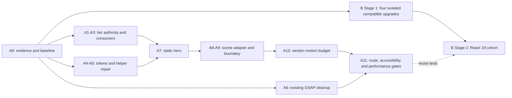

**Intake — required evidence, bounded scope**

Before implementation, the builder reads the actual skill and project startup files and resolves these facts:

1. Current HEAD, branch, dirty paths, other agent’s locks, and relevant review requests.
2. Enclosing route declaration, V4 JSX mount, V3 fallback, Hero invocation, orientation handler, and existing form path.
3. Exact provider exports, provider mounts, hook consumers, and section prop types.
4. Actual `motion-helpers` callers and each `withMotion` input.
5. Full `PremiumParallax` effects, resource creation, cleanup, and mounted callers.
6. SwanMark factory signature, scene setup, available static mark, and resource ownership.
7. Package manager, lockfile owner, installed versions, test setup, build/type commands, and peer metadata.
8. Home/shared-shell motion inventory, baseline screenshots, and production-build performance.
9. Higher-authority doctrine conflicts and required documentation conventions.

This is evidence extraction, not a delegated design exercise. If reality contradicts a decided interface or requires broader architecture, stop that slice and return the exact contradiction.

Run the required non-destructive hygiene inventory. Do not move or delete files.

**Dependency graph**

**Implementation order**

- Complete A0 first. — **[DONE 2026-09-19]** See `A0-INTAKE-RECEIPT.md`. All nine evidence items
  were extracted read-only. **Three contradictions were returned and are unresolved** (C1 `gsap`
  undeclared/uninstalled; C2 raw-three house pattern vs R3F; C3 a 9,238-line five-variant
  cinematic home already exists, orphaned). Per the intake rule above, these stop the slice —
  they are returned to Sean, not resolved by the builder. **Do not start A6 (it targets an
  unbuildable file) or any implementation slice (C2 decides the mechanism) until they are
  answered.**
- A1–A5 establish policy and helper behavior.
- A6 repairs existing GSAP independently.
- A7 delivers the static composition.
- A8–A10 add and constrain enhancement.
- A11 verifies the real route.
- B Stage 1 may proceed independently once its intake is complete.
- B Stage 2 remains a later, isolated phase.

**Session-size rule**

Each builder session changes at most eight existing implementation files plus narrowly related tests. A dependency slice changes one dependency family, its lockfile, and its verified callers. Split larger inventories into numbered batches with frozen filenames before handing them to the flash-tier builder.

No session receives “fix all consumers,” “finish the migration,” or another open-ended instruction.
