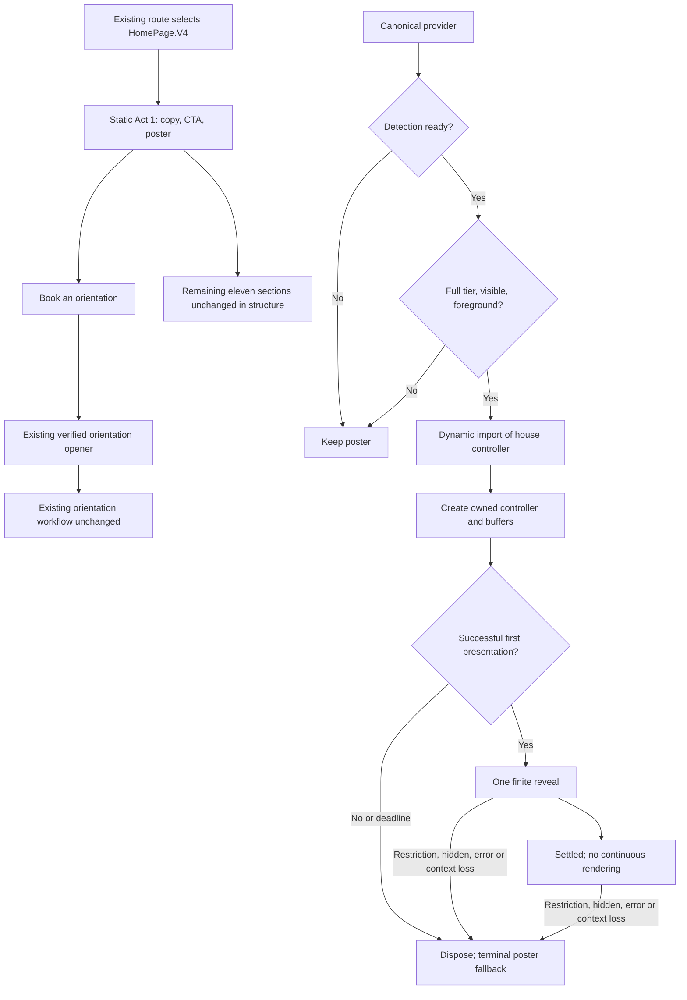

**Replace the proposed-file and ownership sections.**

| Path | Disposition | Responsibility |
|---|---|---|
| `frontend/src/core/perf/performanceTierPolicy.ts` | New | Pure tier resolution; no subscriptions or WebGL probing. |
| `frontend/src/core/perf/motionTokens.ts` | New | Numeric timings/easing and mechanically derived CSS values. |
| `frontend/src/components/SwanMark3D/swanMarkReveal.ts` | New | Pure finite-reveal sampling; no React, renderer, or rAF ownership. |
| `frontend/src/pages/HomePage/components/sections/HeroSignature.tsx` | New | Poster markup, eligibility, dynamic import, generation/deadline guards, controller lifecycle. |
| `frontend/src/pages/HomePage/components/sections/HeroSignature.styles.ts` | New | Reserved geometry, responsive composition and independent CSS motion gate. |
| `PerformanceTierProvider.tsx` | Modify | Stable subscriptions and detection phase. |
| `useAnimationTier.ts` and measured consumers | Modify | Consume the shared authority without permanent old-tier aliases. |
| `swanMarkScene.ts` | Modify narrowly | Optional finite reveal; presentation/error notifications; capped backing policy. |
| `sceneSupport.ts` | Modify if required | Extend existing backing calculation with explicit hero limits. |
| Existing `HeroSection` and V4 integration | Modify | Static composition, existing CTA delegation and home motion coordination. |

Cancel `homeHeroSpec.ts`, `homeHeroFactory.ts`, `HeroSignatureScene.tsx`, `HeroSignaturePoster.tsx`, and `motionTokenStyles.ts`.

The five-module list is a design boundary, not permission to exceed 300 lines. If the existing controller cannot remain within the cap, extract one cohesive private presentation helper and record the reason before adding it. Do not split constants into files merely to meet a file-count target.

**Ownership**

- The provider owns capability subscriptions.
- `HeroSignature` owns route-local eligibility, import state, observers and fallback.
- `swanMarkScene` owns its renderer, scratch canvas, scheduling and disposal.
- `swanMarkReveal` computes a pose from elapsed time; it never schedules frames.
- The existing factory owns construction according to its verified resource contract.
- Every controller instance owns its own mutable resources. Immutable mesh data may be reused; one instance must not dispose another’s resources.
- Header behavior retains current defaults. Hero options are opt-in.
- No React state update occurs for every animation frame.

**User and data flow**



“Existing verified orientation opener” is a required integration boundary, not a claim that its identity is supplied. A0r must fill its exact source receipt before A7 changes the handler wiring.

**Controller interaction**

```mermaid
sequenceDiagram
    participant H as HeroSignature
    participant P as Provider
    participant M as Dynamic module
    participant C as SwanMark controller
    participant V as Displayed 2D canvas

    P-->>H: ready + eligible tier
    H->>H: Check visibility, generation and deadline
    H->>M: import controller
    M-->>H: Module available
    H->>H: Recheck eligibility and generation
    H->>C: Create with hero-only options
    H->>C: setSize; setDrift(0); beginReveal
    C->>C: Render scratch WebGL frame
    C->>V: Blit completed frame
    C-->>H: onPresented
    H->>H: Hide poster without crossfade
    loop Until reveal completes
        C->>C: Sample pose and schedule needed frame
        C->>V: Present frame
    end
    C-->>H: Final presentation
    C->>C: Stop continuous scheduling
    alt Restriction, failure, context loss or route exit
        H->>H: Invalidate generation
        H->>C: dispose
        H->>H: Show poster if still mounted
    end
```

**State machine**

```mermaid
stateDiagram-v2
    [*] --> Waiting
    Waiting --> Waiting: Detection pending or initially offscreen
    Waiting --> Disabled: Ready restriction or missing required observer
    Waiting --> Loading: Ready eligible and visible
    Loading --> Preparing: Import resolves; guards pass
    Loading --> Failed: Rejection or deadline
    Loading --> Disabled: Eligibility or visibility lost
    Preparing --> Running: First frame presented
    Preparing --> Failed: Construction/presentation error or deadline
    Preparing --> Disabled: Eligibility or visibility lost
    Running --> Settled: Final frame presented
    Running --> Disabled: Preference/network downgrade or hidden
    Running --> Failed: Error or context loss
    Settled --> Disabled: Downgrade or hidden
    Settled --> Failed: Error or context loss
    Waiting --> Disposed: Route exit
    Loading --> Disposed: Route exit
    Preparing --> Disposed: Route exit
    Running --> Disposed: Route exit
    Settled --> Disposed: Route exit
    Failed --> Disposed: Route exit
    Disabled --> Disposed: Route exit
    Disposed --> [*]
```



Failed and Disabled display the poster and have no outgoing retry transition. A new route mount starts a new lifecycle.

**Other diagrams**

- **ERD: N/A — no persisted entities, columns, migrations or database relationships change.**
- **HTTP sequence diagrams: N/A for changed behavior — no new API interaction is introduced.** Existing form submission remains outside this change; its real contract must be recorded without alteration.
- **Permissions:** public decorative surface; no new authorization capability.
- **Trust boundary:** local assets and browser capability signals only; no added telemetry or external asset service.

Mermaid source is supplied; rendering has not been validated in this consultation.
