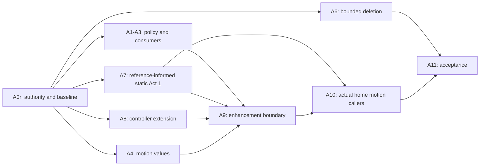

**Replace A0 additions, A ordering and the affected dependency edges.**

**A0r — reconcile before affected implementation**

Record:

1. Current branch, HEAD, dirty state, worktree ownership and exact edited-path clearance.
2. P3 packet/reply/adjudication identifiers, hashes, affected paths and accepted decisions.
3. A conflict table: P2 requirement → relevant P3 decision → resolution or no overlap.
4. F/F-Alt token excerpts and the mapping from each named variant to its preset.
5. Desktop/375px reference screenshots for the selected Act-1 composition.
6. CTA route → mounted hero → handler → orientation interface → existing submission contract.
7. Provider mount scope and actual consumer inventory.
8. Controller construction signature, frame scheduling, backing calculation and resource ownership.
9. Exact R1 deletion allowlist.
10. Baseline screenshots, production build, type check, header resource counts, and initial LCP measurements.

An unrelated P3 finding does not block the whole workstream. Missing overlapping authority blocks only affected slices. Current explicit R1–R3 are not reopened as questions.

**Order**

A5’s dormant-helper repair is cancelled. Preserve its history as cancelled, not passed.

A7’s static acceptance can proceed independently of a passing animated signature after its own intake requirements are met. It does not complete A8/A9.

Keep sessions bounded to at most eight existing implementation files plus related tests. Shared-controller changes and home integration are separate sessions.
