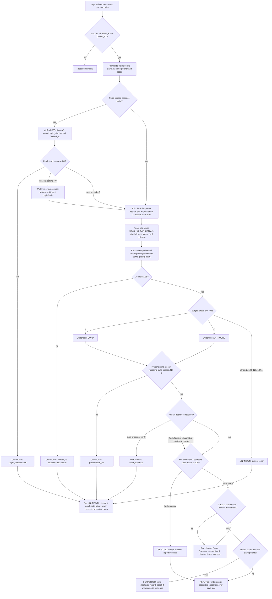

# Kimi K3 - Review

**Reviewer:** `moonshotai/kimi-k3` (high)
**Document:** docs/ai-workflow/AI-HANDOFF/PACKET-claim-integrity-skill-2026-08-13.md
**Seed:** (none)
**Tokens:** 2321 in / 27546 out | **Cost:** ~$0.4202 | **Wall:** 1058.9s | **finish_reason:** stop

---

# Build Blueprint — `claim-integrity` skill

## 1. Decision summary

**What it is.** A skill at `.claude/skills/claim-integrity/` that makes *terminal claims* — any claim that closes inquiry — non-assertable until discharged by evidence. Dual polarity: **absence claims** ("does not exist", "not set", "empty", "unreachable") and **completion claims** ("exit 0", "tests pass", "fixed", "clean", "1.00"). The incident table is 3/7 positive-signal lies (I1, I3, I4); a narrow absence-only skill would have caught less than half of what actually happened. So: **claim integrity is the scope; absence is the heaviest lane, not the only one.**

**Exact trigger set** (this regex is mirrored literally in the gate and in SKILL.md — one source of truth, copied to both):

```js
const ABSENT_RX = /\b(does not exist|do not exist|did not exist|not found|no matches|no results|not set|not configured|not installed|is missing|are missing|missing|absent|none found|nothing found|nothing there|empty|unreachable|not reachable|broken|no such)\b/i;
const DONE_RX   = /\b(exit(?:ed)? 0|all tests pass|tests pass|passing|all green|clean|complete|completed|done|fixed|verified|no errors|zero errors|100%|1\.00)\b/i;
```

**Verdicts.** Probe-level: `FOUND | NOT_FOUND | UNKNOWN`. Claim-level: `SUPPORTED | REFUTED | UNKNOWN`. UNKNOWN is a terminal state, never an intermediate: it may not coerce to absent, clean, or "effectively none."

**Where enforcement lives.** Exactly one place: `.claude/hooks/claim-integrity-gate.mjs`, a Stop hook. SKILL.md provides trigger/discovery and procedure, `claim-probe.mjs` standardizes the evidence record, the SLO script measures whether the owner-as-sensor is being retired — but only the gate can make an undischarged claim **unsendable**. Prose cannot intercept; a hook can.

**claim_id** (used everywhere, computed identically by script and gate):
`claim_id = "clm_" + sha256(polarity + "|" + normalized_claim).slice(0,12)` where normalization = lowercase, collapse whitespace, strip trailing `.!?`. Scope is recorded, not hashed (the gate cannot infer scope from prose).

**Discharge requirement (what the gate checks).** For each trigger-matched sentence in the final assistant message: ≥2 records in `events.jsonl` with that `claim_id` this session, ≥2 **distinct mechanism tags**, and ≥1 record with `"supported":true`. Escape: a sentence containing the literal word `UNKNOWN` passes (that *is* the sanctioned output — blocking it would train false confidence).

### Rulings on E1–E6

- **E1 — Accept, but fix the premise.** "A script the agent MUST call" is still prose enforcing prose. The script is the *record format authority*; the **gate** is the enforcement. Also: the script owns the platform traps internally (sets `MSYS_NO_PATHCONV=1` itself on win32, spawns via `bash -lc` with `pipefail`), because telling the agent to remember traps per-command is exactly the decay pattern we're killing.
- **E2 — Accept, with the self-report hole called out and patched.** The agent logging "I was corrected" is itself a self-report (I4's failure class). Patch: an optional UserPromptSubmit hook (`claim-integrity-pushback.mjs`, §9) that regex-detects owner corrections. The agent-run `pushback` command remains as backup. Budget: ≤3 pushbacks per 7d window; `BREACH` otherwise.
- **E3 — Accept, fully specified below.** JSON contract `{"decision":"block","reason":"..."}`. Scope: **last assistant message only** (never whole transcript). On gate internal error: fail **open**, append `kind:"gate_error"`, count it in the SLO. A gate that deadlocks the session teaches the owner to delete the gate. Honor `stop_hook_active` (loop guard, §8).
- **E4 — Accept.** Already folded in: dual polarity, same (probe, scope, predicate, preconditions, independence) tuple. The trigger regex has two arms.
- **E5 — Accept, and it's not optional.** The compounding finding (missing `lesson-recall-gate.mjs`, claimed absent on a stale tree) is the *same disease in the enforcement plane*. Two bindings: (a) claims about the system itself — hooks, gates, skills, versions — go through identical discharge with `scope.type:"system"`; (b) the gate ships a `--self-test` that pipes a synthetic trigger transcript through itself and must block it (acceptance slice 7). The skill may only claim enforcement the gate demonstrably implements.
- **E6 — Reject as written; accept a narrowed version.** I7 was not a session-entry failure — the SessionStart hook *did its job and was ignored*. A blanket session-entry fetch + tooling inventory is a network tax on every session, breaks offline, and audits the wrong moment. The actual fix is **claim-time**: any repo-scoped absence claim triggers fetch inside `claim-probe.mjs` (`--repo`), records `origin_sha`, `behind` (from `git rev-list --count HEAD..origin/main`), `fetched_at`; if fetch fails → verdict UNKNOWN, `unknown_reason:"origin_unreachable"`. And: if `behind > 0`, worktree-local evidence (`ls`, `test -f`) is **insufficient mechanism** for absence — the probe must hit the ref (`git cat-file -e origin/main:<path>`). The "list tooling on main but absent locally" becomes an optional flag, never mandatory.

---

## 2. Mermaid flowchart — claim-discharge decision path



---

## 3. Mermaid sequence diagram — skill / script / log / gate across one claim

```mermaid
sequenceDiagram
  autonumber
  participant AG as Agent
  participant SK as SKILL.md
  participant CP as claim-probe.mjs
  participant LG as events.jsonl
  participant GT as claim-integrity-gate.mjs (Stop hook)
  participant OW as Owner

  AG->>SK: triggered: about to say "scripts/linear-cli.mjs does not exist"
  SK-->>AG: procedure: fetch, probe+control, 2 distinct mechanisms, scope-in-sentence
  AG->>CP: verify --claim "..." --polarity absent --scope repo:scripts/linear-cli.mjs --mechanism posix-test
  CP->>CP: bash -lc, MSYS_NO_PATHCONV=1, pipefail; git fetch; subject + control
  CP->>LG: append discharge record channel 1 (exit codes and hashes only, never stdout)
  CP-->>AG: exit 0|1|2 + record JSON
  AG->>CP: verify --claim "..." --mechanism git-plumbing
  CP->>LG: append discharge record channel 2
  CP-->>AG: verdict (e.g. FOUND -> absence claim is REFUTED)
  AG->>OW: closeout message containing the scoped claim
  Note over GT: Stop hook fires; stdin carries transcript_path, session_id, stop_hook_active
  GT->>GT: split last assistant message into sentences; match ABSENT_RX / DONE_RX; derive claim_id(s)
  GT->>LG: read records for claim_id(s) this session
  alt discharged (2+ records, 2+ distinct mechanisms, one supported, or sentence says UNKNOWN, or override exists)
    GT-->>AG: exit 0, no output; stop allowed
  else undischarged
    GT->>LG: append kind:"block"
    GT-->>AG: {"decision":"block","reason":"...To unblock: <literal command>"}
  end
  OW->>AG: pushback: "it exists, you checked a stale tree"
  AG->>CP: claim-slo.mjs pushback --claim clm_9f4b2c1a77d0 --note "stale tree"
  CP->>LG: append kind:"pushback"
```

---

## 4. ASCII wireframes — exact text a builder copies

**4a. Discharge record** — one physical line in `.claude/state/claim-integrity/events.jsonl` (pretty-printed here only for review; the file holds the compact form):

```json
{"kind":"discharge","schema":1,"skill_version":"1.0.0","claim_id":"clm_9f4b2c1a77d0","ts":"2026-08-13T19:04:11.203Z","session_id":"c6f24d","claim":"scripts/linear-cli.mjs does not exist","polarity":"absent","scope":{"type":"repo-path","target":"scripts/linear-cli.mjs","ref":"origin/main","origin_sha":"a1b2c3d4","behind":0,"fetched_at":"2026-08-13T19:03:52.010Z","host":"MSYS_NT-10.0-22631"},"probe":{"cmd":"git cat-file -e origin/main:scripts/linear-cli.mjs","exit":0,"ms":84},"control":{"cmd":"git rev-parse --verify origin/main^{commit}","exit":0,"verdict":"PASS"},"pre":[],"artifact":null,"mechanism":"git-plumbing","verdict":"FOUND","supported":false,"unknown_reason":null}
```

Rules baked into the format: `probe.cmd` is stored, probe **stdout/stderr never is** (I6 involved a secret — records must not leak values). `supported` is claim-relative: here `FOUND` **refutes** an absent-polarity claim, so `supported:false`. `pre` is an array of `{cmd, exit, ok}`. `artifact` is `null` or `{path, sha256, mtime, age_s}`. `unknown_reason` ∈ `subject_error | control_fail | precondition_fail | origin_unreachable | stale_evidence | timeout`. Other `kind` values in the same file: `"pushback"`, `"block"`, `"override"`, `"gate_error"`, `"loop_guard"`.

**4b. Log line** — what `verify` prints to stdout on success (the audit-able line; also what `tail -1` of a session shows):

```
[discharge clm_9f4b2c1a77d0] verdict=FOUND supported=false polarity=absent mechanism=git-plumbing control=PASS subject_exit=0 scope=repo:scripts/linear-cli.mjs@origin/main#a1b2c3d4 behind=0 fetched=12s-ago ms=231
```

**4c. Block message** — gate stdout is `{"decision":"block","reason":"<this exact text, newlines as \n>"}`. Rendered:

```
CLAIM-INTEGRITY GATE — stop blocked.

Your last message makes an undischarged terminal claim:
  claim:    "scripts/linear-cli.mjs does not exist"
  polarity: absent
  claim_id: clm_9f4b2c1a77d0
  missing:  channel 1 of 2 (no discharge record for this claim_id this session)
  (+1 more undischarged claim in this message; it will be checked next)

Either discharge it with two independent mechanisms, or restate it as
"UNKNOWN at scope <paths|ref@sha|host> because <which check failed>".

To unblock: node .claude/skills/claim-integrity/scripts/claim-probe.mjs verify --claim "scripts/linear-cli.mjs does not exist" --polarity absent --scope repo:scripts/linear-cli.mjs --probe 'git cat-file -e origin/main:scripts/linear-cli.mjs' --control 'git rev-parse --verify "origin/main^{commit}"' --mechanism git-plumbing
```

The literal final line requirement is met: last line is `To unblock: <command>`. The gate fills `--probe`/`--control` from templates per scope type (repo-path → the above; env → `test -n "${KEY+x}"` / control `test -n "${HOME+x}"`; path → `test -e` / `test -d .`).

**4d. SLO report:**

```
$ node .claude/skills/claim-integrity/scripts/claim-slo.mjs report --window 7d
CLAIM-INTEGRITY SLO   window=2026-08-06..2026-08-13   generated=2026-08-13T19:40:02Z
====================  ==============================  ==============================
discharge records                 41
  SUPPORTED                       27
  REFUTED                          9
  UNKNOWN                          5   (subject_error 2 | control_fail 1 | origin_unreachable 1 | stale_evidence 1)
gate blocks                        6
blocks that became pushbacks       0
overrides                          1   (audit: reason "offline, origin unreachable")
owner pushbacks                    1   budget <= 3   OK
pushback per discharge           2.4%  prev window 14.3%   trend: IMPROVING
gate errors                        0
worst lane (pushbacks by mechanism): registry-read (1)
UNKNOWN statements in closeouts    3   (sanctioned, not blocked)
```

`BREACH` replaces `OK` when pushbacks > 3 in window or the trend rises two consecutive windows; the report then exits 1 (cron/CI-able).

---

## 5. `SKILL.md` body

````markdown
---
name: claim-integrity
description: Discharge discipline for terminal claims — anything you are about to call missing, absent, does not exist, not found, not set, not configured, empty, clean, unreachable, broken, none found, no matches — and their positive twins pass, passing, exit 0, fixed, verified, clean, complete, done, 100%, 1.00. Use BEFORE asserting any of these. A terminal claim is only as sound as its (probe, scope, predicate, preconditions, independence) tuple; each of the five fails silently. UNKNOWN is a valid, reportable answer and must never be coerced to absent or clean.
---

# claim-integrity

You have no representable UNKNOWN unless you build one. Every outcome wants to coerce
into a success-shaped boolean. This skill is the procedure plus the executable that
prevents that. Enforcement (the Stop gate) lives outside this file; this file is the
trigger, the procedure, and the trap table.

## Laws (ratified; do not relitigate)

1. A control probe never tells you the answer; it tells you whether you are allowed
   to have one. Control FAIL means UNKNOWN, full stop.
2. Tool output is a CLAIM BY A TOOL, not an observation of the world. No terminal
   claim survives on one channel: two mechanistically independent channels, or it
   stays UNKNOWN.
3. probe.status != completed  -> UNKNOWN. universe.N == 0 -> UNKNOWN. control != PASS
   -> UNKNOWN. UNKNOWN never coerces to CLEAN / absent / "effectively none".
4. Enforcement lives in a consumer (the Stop gate), not in this prose. This file
   tells you how to produce discharge records; the gate decides if you may stop.
5. This skill binds its own author. Claims about the system itself — "hook X is not
   installed", "gate Y never ran", "this skill does not exist yet" — go through the
   identical discharge with scope type "system".

## Trigger set

The gate matches these exact patterns against your final message, per sentence:

    ABSENT_RX = /\b(does not exist|do not exist|did not exist|not found|no matches|no results|not set|not configured|not installed|is missing|are missing|missing|absent|none found|nothing found|nothing there|empty|unreachable|not reachable|broken|no such)\b/i
    DONE_RX   = /\b(exit(?:ed)? 0|all tests pass|tests pass|passing|all green|clean|complete|completed|done|fixed|verified|no errors|zero errors|100%|1\.00)\b/i

If a final-message sentence matches either, it needs discharge records (two channels,
distinct mechanisms) or it must literally contain the word UNKNOWN.

## Procedure

0. NAME the claim: exact sentence, polarity (absent|present), and the scope you
   actually searched. The scope goes in the final sentence — never a world adverb.
1. VERSION AXIS (repo-scoped absence claims): the fetch happens inside claim-probe
   via --repo. If the tree is behind origin, worktree evidence is VOID for absence;
   probe the ref: `git cat-file -e origin/main:<path>`, `git ls-tree origin/main`.
   Read SessionStart hook output about divergence; it is binding context.
2. BUILD THE PROBE as a detection command with a declared exit map:
   0 = found, 1 = absent, anything else = probe broken.
3. BUILD THE CONTROL: same shell, same quoting path, same hive/registry key family —
   everything identical except the target's state, success guaranteed by construction.
   If the control fails, your instrument is broken: UNKNOWN, escalate mechanism.
4. APPLY THE TRAP TABLE below. The helper applies the env traps for you; ad-hoc
   manual probes must apply them by hand.
5. RUN, channel 1:  node .claude/skills/claim-integrity/scripts/claim-probe.mjs verify \
        --claim "<sentence>" --polarity absent|present --scope <type:target> \
        --probe '<cmd>' --control '<cmd>' --mechanism <tag> [--repo .] \
        [--pre '<cmd>']... [--artifact <path> --fresh-within 600] [--json]
   Exit: 0 SUPPORTED, 1 REFUTED, 2 UNKNOWN, 3 usage, 4 internal. Every run appends
   to .claude/state/claim-integrity/events.jsonl.
6. RUN channel 2 with a DIFFERENT mechanism tag (taxonomy below).
7. METRIC CLAIMS: every --pre must pass or the number is not a number
   (red baseline, N=0 -> UNKNOWN, report "not measurable", not a figure).
8. MUTATION CLAIMS: compare before/after sha256 of the object via an independent
   read path. Equal hashes mean the operation claimed nothing — that is REFUTED,
   not success. Never trust the mutating tool's own counter (replaced=N, inserted=N).
9. SPEAK: verdict + scope-in-sentence.
   FOUND/NOT_FOUND consistent with claim -> state it with scope.
   REFUTED -> report the opposite. Never save face.
   UNKNOWN -> "UNKNOWN at scope <paths | ref@sha | host> because <which gate failed:
   probe | control | preconditions | freshness | origin>."

## Mechanism taxonomy (channel 2 must differ from channel 1)

posix-test (ls, test, stat, find) | content-hash (sha256sum) | byte-scan (grep -c,
cmp -l, xxd) | git-plumbing (cat-file, ls-tree, rev-parse) | registry-read (reg)
| env-print (set, printenv) | net-probe (curl, ping) | tool-api (MCP/CLI calls)
Note: `ls` and `test -f` are the SAME mechanism. Escalation ladder under suspicion:
lexical -> structural -> byte-level (grep -> git ls-tree; string-replace -> byte scan).

## Platform trap table (each row is an incident)

| # | Trap | Wrong | Right |
|---|------|-------|-------|
| T1 | MSYS rewrites /flags into paths | `reg query KEY /v NAME` | `MSYS_NO_PATHCONV=1 reg query KEY /v NAME` (also `sc`, `net`, `schtasks`, `wmic`, `git show rev:path`) |
| T2 | `\|\|` collapses the error domain into "absent" | `probe \|\| echo "not found"` | `case $? in 0) FOUND;; 1) NOT_FOUND;; *) UNKNOWN;; esac` |
| T3 | A pipe reports the LAST command's status | `cmd \| tail` then `$?` | `set -o pipefail` or read `${PIPESTATUS[0]}` |
| T4 | stderr-to-null on a negative you intend to believe | `probe 2>/dev/null \|\| ...` | capture stderr; decide on exit code only |
| T5 | Stale tree read as world | `ls path` -> "does not exist" | `git fetch` then `git cat-file -e origin/main:path` |
| T6 | mtime/existence read as freshness | "exists, non-empty" -> verified | consumer-checked subject_sha (sha256); mtime only with --fresh-within, logged as weaker |
| T7 | Same-mechanism retry counted as evidence | replace twice, both no-ops | escalate mechanism: string-replace -> `LC_ALL=C grep -c $'\x00'` byte scan |
| T8 | Self-report counters believed | tool prints `replaced=1` | independent read: hash before/after; equal = no-op = REFUTED |

## Worked examples (from the incident record)

I1 (report / pipe status). WRONG: `npm run review 2>&1 | tail -20` then claim
"completed, exit 0" — $? was tail's; the job timed out (124) and wrote nothing.
RIGHT: `npm run review > /tmp/review.log 2>&1; s=$?; case $s in 0) echo COMPLETED;;
124) echo "UNKNOWN: timeout";; *) echo "UNKNOWN: exit $s";; esac` — and a completion
claim also needs the fresh artifact (T6): `--artifact report.json --fresh-within 300`.

I2 (freshness). WRONG: `test -s build/report.json && echo "verified"` — leftover
from a previous run at the same path. RIGHT: claim-probe with
`--artifact build/report.json --fresh-within 300`; better: recompute sha256 and
compare to the consumer-checked subject_sha. Stale -> verdict UNKNOWN, you may not
say "verified".

I3 (preconditions). WRONG: mutation kill rate 1.00 computed against a RED baseline —
every mutant dies for free. RIGHT: `--pre 'npm test --silent'` and a pre proving
N>0 mutants ran. Red baseline -> the metric is UNKNOWN, report "not measurable",
never a figure.

I4 (postcondition / self-report). WRONG: believed tool output `replaced=1` while the
replacement byte was itself NUL; two successive no-ops each reported success.
RIGHT: `b=$(sha256sum f | cut -d' ' -f1)` ... mutate ... `a=$(sha256sum f | cut -d' ' -f1)`;
`[ "$b" = "$a" ] && echo "REFUTED: no-op"`. Then independent byte-level recount:
`LC_ALL=C grep -c $'\x00' f`.

I5 (scope). WRONG: "Linear board unreachable this session" after 2 checks — a
world-scope adverb from a path-scope probe. RIGHT: "I probed two channels: MCP
linear server (timeout at connect), scripts/linear-cli.mjs whoami (ENOENT in
worktree). UNKNOWN beyond this shell, this session." Name the failure stage
(dns | tcp | tls | auth | timeout); never upgrade to "unreachable" at world scope.

I6 (probe / MSYS). WRONG: `reg query "HKCU\Environment" /v LINEAR_API_KEY || echo
"not found"` — MSYS rewrote /v into a path, the query errored, `||` reported
"not found" twice to the owner who had set the key correctly. RIGHT:
`MSYS_NO_PATHCONV=1 reg query "HKCU\Environment" /v LINEAR_API_KEY; case $? in 0)
echo FOUND;; 1) echo NOT_FOUND;; *) echo UNKNOWN;; esac` with control
`MSYS_NO_PATHCONV=1 reg query "HKCU\Environment" /v TEMP` (same hive, same
quoting, value guaranteed present). Records store exit codes only — NEVER the value.

I7 (version axis). WRONG: `ls scripts/linear-cli.mjs` failed -> "does not exist",
on a tree 1,800 commits behind origin/main, after a SessionStart hook said so in
plain words. RIGHT: `--repo .` fetch, then
`--probe 'git cat-file -e origin/main:scripts/linear-cli.mjs' --control 'git
rev-parse --verify "origin/main^{commit}"'` — control PASS, subject exit 0 ->
FOUND -> the absence claim is REFUTED, and the record carries origin_sha and
behind, so the sentence can name them.

## The UNKNOWN sentence (sanctioned output — the gate never blocks it)

"UNKNOWN at scope <exact paths | ref@sha | env keys | host> because <gate>:
<one line of evidence>. Next mechanism to try: <command>."
````

---

## 6. File-by-file build plan

| File | Lines | Type | Depends on |
|---|---|---|---|
| `.claude/skills/claim-integrity/SKILL.md` | ~150 | doc | — |
| `.claude/skills/claim-integrity/scripts/claim-probe.mjs` | ~260 | exec (node ≥18, zero deps: `child_process`, `crypto`, `fs`, `os`) | — |
| `.claude/skills/claim-integrity/scripts/claim-slo.mjs` | ~150 | exec | events.jsonl schema |
| `.claude/hooks/claim-integrity-gate.mjs` | ~190 | exec (Stop hook) | regexes + claim_id algorithm (copy-pasted constants from claim-probe header comment; do not import across dirs) |
| `.claude/hooks/claim-integrity-pushback.mjs` | ~80 | exec (UserPromptSubmit, optional but recommended) | events.jsonl schema |
| `.claude/hooks/claim-integrity-health.mjs` | ~90 | exec (SessionStart, §9 item 1) | list of expected hook paths |
| `tests/claim-integrity/transcript-block.jsonl` | ~20 | fixture | gate stdin contract |
| `tests/claim-integrity/transcript-pass.jsonl` | ~15 | fixture | same |
| `.claude/settings.json` | +18 (diff) | config | registers the three hooks |
| `.gitignore` | +2 (diff) | config | `/.claude/state/claim-integrity/` |

Runtime data: `.claude/state/claim-integrity/events.jsonl` (created on first write; never committed).

All four executables are under 300 lines. Shared constants (`ABSENT_RX`, `DONE_RX`, `claim_id` algorithm, mechanism taxonomy, `unknown_reason` enum) are duplicated deliberately between `claim-probe.mjs` and `claim-integrity-gate.mjs` — cross-directory imports between skills and hooks rot silently; a duplicated 15-line constant block with a `// MIRROR: keep in sync with <other file>` header is the honest tradeoff, and acceptance slice 7 (self-test) catches drift.

---

## 7. Numbered slices with literal executable acceptance criteria

Each slice ships working software. Commands assume repo root; expected results are exact.

**Slice 1 — tri-state core (local fs).**
```bash
node .claude/skills/claim-integrity/scripts/claim-probe.mjs verify \
  --claim "SKILL.md exists" --polarity present --scope path:.claude/skills/claim-integrity/SKILL.md \
  --probe 'test -f .claude/skills/claim-integrity/SKILL.md' --control 'test -d .' \
  --mechanism posix-test --json
# expect: exit 0; stdout JSON contains "verdict":"FOUND" and "supported":true

node ... verify --claim "definitely-absent-9z9z.txt does not exist" --polarity absent \
  --scope path:definitely-absent-9z9z.txt --probe 'test -f definitely-absent-9z9z.txt' \
  --control 'test -d .' --mechanism posix-test --json
# expect: exit 0; "verdict":"NOT_FOUND","supported":true

node ... verify --claim "X exists" --polarity present --scope path:x \
  --probe 'exit 7' --control 'test -d .' --mechanism posix-test
# expect: exit 2; "verdict":"UNKNOWN","unknown_reason":"subject_error"

node ... verify --claim "X exists" --polarity present --scope path:x \
  --probe 'test -f x' --control 'exit 1' --mechanism posix-test
# expect: exit 2; "verdict":"UNKNOWN","unknown_reason":"control_fail"
```

**Slice 2 — repo mode + claim-time fetch (narrowed E6) + origin binding.**
```bash
node ... verify --claim "definitely-absent-9z9z.txt does not exist" --polarity absent \
  --scope repo:definitely-absent-9z9z.txt --repo . \
  --probe 'git cat-file -e origin/main:definitely-absent-9z9z.txt 2>/dev/null; test $? -eq 1 -o ! -f definitely-absent-9z9z.txt' \
  --control 'git rev-parse --verify "origin/main^{commit}"' --mechanism git-plumbing --json
# expect: exit 0 or 1 (never 2 while online); record contains "origin_sha":"$(git rev-parse origin/main | cut -c1-8)"... 
grep "$(git rev-parse origin/main | cut -c1-8)" .claude/state/claim-integrity/events.jsonl
# expect: at least one matching line; "behind" is an integer; "fetched_at" ISO timestamp present
# offline check: disable network, rerun with --repo; expect exit 2, "unknown_reason":"origin_unreachable"
```

**Slice 3 — log identity & independence bookkeeping.**
```bash
node ... verify --claim "gate fixture claim abc" --polarity absent --scope path:nope-abc \
  --probe 'test -f nope-abc' --control 'test -d .' --mechanism posix-test
node ... verify --claim "gate fixture claim abc" --polarity absent --scope path:nope-abc \
  --probe 'git ls-files --error-unmatch nope-abc 2>&1; test $? -eq 1' --control 'git rev-parse HEAD' --mechanism git-plumbing
grep -c 'clm_' .claude/state/claim-integrity/events.jsonl   # expect: +2 lines this run
node -e 'const l=require("fs").readFileSync(".claude/state/claim-integrity/events.jsonl","utf8").trim().split("\n").map(JSON.parse);const r=l.filter(x=>x.claim==="gate fixture claim abc");console.log(new Set(r.map(x=>x.claim_id)).size===1 && new Set(r.map(x=>x.mechanism)).size===2 ? "PASS" : "FAIL")'
# expect: PASS
```

**Slice 4 — gate blocks, then unblocks (the enforcement slice).**
```bash
printf '%s\n' '{"type":"assistant","message":{"content":[{"type":"text","text":"Checked: scripts/linear-cli.mjs does not exist."}]}}' > tests/claim-integrity/transcript-block.jsonl
echo '{"transcript_path":"tests/claim-integrity/transcript-block.jsonl","session_id":"slice4","stop_hook_active":false}' \
  | node .claude/hooks/claim-integrity-gate.mjs
# expect: stdout is single-line JSON; "decision":"block"; reason ends with a line matching:
#   ^To unblock: node \.claude/skills/claim-integrity/scripts/claim-probe\.mjs verify --claim "scripts/linear-cli\.mjs does not exist" .+--mechanism \S+$

# now discharge twice (slice-3 pattern, claim text must match exactly), then:
echo '{"transcript_path":"tests/claim-integrity/transcript-block.jsonl","session_id":"slice4","stop_hook_active":false}' \
  | node .claude/hooks/claim-integrity-gate.mjs
# expect: exit 0, empty stdout, and events.jsonl gained a line with "kind":"block" from the first run
```

**Slice 5 — SLO report + pushback.**
```bash
node .claude/skills/claim-integrity/scripts/claim-slo.mjs pushback --claim clm_9f4b2c1a77d0 --note "slice5 fixture"
node .claude/skills/claim-integrity/scripts/claim-slo.mjs report --window 7d
# expect: stdout contains "owner pushbacks" line with a value >= 1, contains "budget <= 3", exit 0 while <= 3
```

**Slice 6 — platform trap owned by the script (win32 only).**
```bash
node ... verify --claim "MSYS guard active" --polarity present --scope env:MSYS_NO_PATHCONV \
  --probe 'test "$MSYS_NO_PATHCONV" = "1"' --control 'test -d .' --mechanism env-print
# expect on Windows/MSYS: exit 0, FOUND. On posix: mark skipped (script may set it unconditionally — harmless).
```

**Slice 7 — gate self-test (E5: the enforcement plane discharges itself).**
```bash
node .claude/hooks/claim-integrity-gate.mjs --self-test
# expect: builds a synthetic transcript with an undischarged trigger sentence, runs its own pipeline,
#         verifies a block is produced AND that a literal UNKNOWN sentence passes; prints exactly:
# SELF-TEST PASS
# exit 0. Any other outcome: exit 1.
```

**Slice 8 — freshness + preconditions.**
```bash
touch -d 2020-01-01 tests/claim-integrity/old.bin
node ... verify --claim "old.bin is verified" --polarity present --scope path:tests/claim-integrity/old.bin \
  --probe 'test -s tests/claim-integrity/old.bin' --control 'test -d .' --mechanism posix-test \
  --artifact tests/claim-integrity/old.bin --fresh-within 300
# expect: exit 2; "unknown_reason":"stale_evidence"; record has "artifact":{"sha256":...}

node ... verify --claim "kill rate 1.00" --polarity present --scope metric:mutation \
  --probe 'true' --control 'test -d .' --mechanism tool-api --pre 'exit 1'
# expect: exit 2; "unknown_reason":"precondition_fail"
```

**Slice 9 — escape hatches under audit (override + loop guard).**
```bash
node ... override --claim "scripts/linear-cli.mjs does not exist" --reason "offline; origin unreachable"
# expect: events.jsonl gains kind:"override"; gate now allows that claim_id ONCE per session;
echo '{"transcript_path":"tests/claim-integrity/transcript-block.jsonl","session_id":"slice4","stop_hook_active":true}' \
  | node .claude/hooks/claim-integrity-gate.mjs
# expect: exit 0 (loop guard), events.jsonl gains kind:"loop_guard"
```

**Slice 10 — optional additions (§9 items 1 and 2).**
```bash
node .claude/hooks/claim-integrity-health.mjs   # SessionStart body
# expect: one line per expected hook: "OK <path>" or "MISSING <path>"; exit 0 always (advisory)
printf '%s' '{"prompt":"No, I told you the key IS set."}' | node .claude/hooks/claim-integrity-pushback.mjs
# expect: events.jsonl gains kind:"pushback" with the quoted correction; exit 0
```

---

## 8. Do-NOT list

1. **Do not "enforce" in SKILL.md prose** ("remember to always…"). That design was tried and violated within the hour. Prose describes; the gate decides.
2. **Do not scan the whole transcript in the gate.** Last assistant message only. Otherwise a discharged-but-quoted old claim re-blocks forever.
3. **Do not block a sentence containing the literal word `UNKNOWN`.** That is the sanctioned output. Blocking it selects for confident lies.
4. **Do not ignore `stop_hook_active`.** If true and a block for this claim_id already fired this session: allow, append `kind:"loop_guard"`. Respect the contract or the owner rips the hook out (as the packet's own repo did to hooks before).
5. **Do not fail closed on gate internal error.** Corrupt log, bad regex, missing transcript → allow stop + append `kind:"gate_error"` + count it in the SLO. A gate that deadlocks work trains its own deletion.
6. **Do not store probe stdout/stderr, registry values, or env values in events.jsonl.** Exit codes, hashes, timing only. I6 was about an API key; the audit log must be secret-free by construction.
7. **Do not implement the tri-state with `||`/`&&` chains, and never `grep -q … || echo "not found"`.** That is I6 verbatim. The `case $? in 0/1/*` ladder or it doesn't ship.
8. **Do not judge a pipeline by its exit code** without `pipefail`/`PIPESTATUS`. That is I1 verbatim. The helper never pipes; manual probes must follow T3.
9. **Do not set `MSYS_NO_PATHCONV=1` conditionally** ("only when the command has flags"). Set it unconditionally in the spawned environment on win32; conditional guards are where the next incident lives.
10. **Do not fetch on session entry or per non-repo claim.** Fetch is claim-time, repo-scope only, cached via `fetched_at` (stale after 900s → refetch inside the next `--repo` verify).
11. **Do not accept `ls` + `test -f` as two channels.** Same mechanism tag (`posix-test`). The taxonomy exists precisely to prevent faux independence.
12. **Do not trust self-counting tool output** (`replaced=1`, `inserted=3`, `exit 0` from a wrapper) as a channel. It's the tool's claim; a channel must be an independent read.
13. **Do not import shared constants across the skills/hooks boundary** — mirror them with MIRROR comments (slice 7 catches drift).
14. **Do not commit `events.jsonl`**, and do not rotate by deletion. If size matters, rotate weekly into `events-YYYY-Www.jsonl`.
15. **Do not build this in Python** or add npm dependencies. The hook family is `.mjs`; node ≥18 stdlib only; a hook that needs `npm install` is a hook that goes missing (see: `lesson-recall-gate.mjs`).

---

## 9. My additions — lanes the packet does not mention, ranked by value

The four enhancements and §3 share a blind spot: they harden the **claim path** but leave the **enforcement path**, the **feedback path**, and the **secret path** exactly as fragile as before. Expansive list first, ranking at the end.

1. **Hook-health watchdog (SessionStart advisory).** The compounding finding is not that an agent lied — it's that the anti-repeat mechanism was *absent and nobody noticed*. Every enforcement artifact needs its own control probe. `claim-integrity-health.mjs` runs at SessionStart: for each expected hook/skill path, `OK <path>` or `MISSING <path>`, plus a syntax smoke-test (`node --check`). Advisory only (exit 0), one line each. This is the control probe for the watchmen, and it would have caught the missing `lesson-recall-gate.mjs` in seconds.
2. **Owner-pushback auto-detection (UserPromptSubmit hook).** E2's counter depends on the agent self-reporting that it was wrong — the same self-report channel that produced `replaced=1`. `claim-integrity-pushback.mjs` scans the *owner's* messages for correction phrases (`/\b(no[,.]? i (said|told|set)|that'?s (wrong|not right)|it (does )?exists?|you('re| are) wrong|check again)\b/i`) and appends `kind:"pushback"` with the quote. Imperfect precision, but it's an *independent channel* on the sensor metric — the first one E2 has.
3. **Secret hygiene in the audit log.** Covered in §8.6, but listed here because the packet never mentions it: discharge records must be value-blind. `--redact <pattern>` optional; default stores no probe output at all. Without this, the first registry discharge writes someone's API key into a plaintext JSONL.
4. **Block-loop escape hatch with audit (`override` + `loop_guard`).** Offline, broken origin, wedged environment — without an override path, the gate's failure mode is "agent cannot stop, owner deletes gate." `override --reason` writes an audited event; SLO counts overrides weekly. Accountability without deadlock.
5. **Compaction resilience.** After context compaction, the agent forgets it already discharged claims. The records persist; add a line to SKILL.md: on resume, read `tail -20` of events.jsonl to rehydrate discharged claim_ids. Cheap, prevents duplicate work and contradictory re-claims.
6. **Failure-stage attribution.** "Unreachable" is four different failures (dns | tcp | tls | auth | timeout) wearing one adjective. Add optional `--fail-stage` to the record; I5's honest sentence was "UNKNOWN, failed at stage: auth." This makes scope-in-sentence nearly free.
7. **Numeric reproducibility.** I3 and I7 show *numbers* lie too ("1.00", "1,800 commits behind"). Lane: any quantity in a closeout should carry the command that produced it. Add optional `--repro '<cmd>'` stored in the record; SLO can spot-check. Not gated — advisory records only, or the gate becomes unbearable.
8. **UNKNOWN phrasebook.** SKILL.md carries 5 literal sentence templates ("UNKNOWN at scope S because gate G; next mechanism: M"). Agents degrade gracefully when the degraded output is pre-written. Also add weasel-coercion phrases (`"effectively absent"`, `"as good as none"`, `"for all intents"`) to the gate's trigger set — those are UNKNOWN-coercion in a trench coat.
9. **Pushback → trap-table loop.** Every `kind:"pushback"` event should end the session with a new trap-table row or worked example candidate appended to SKILL.md. Institutional memory; otherwise pushback #7 teaches nothing that pushback #1 didn't.
10. **Per-lane calibration in the SLO.** The report's `worst lane` line exists; extend to pushback-rate by mechanism tag and by trigger class over time. This is how you learn registry probes are your weakest instrument rather than vibes-ing it.
11. **Two-observer escalation for high-stakes claims.** Independence today means two mechanisms. For claims whose refutation costs the owner money/trust ("the backup ran", "no data was lost"), an optional `--require-observer` flag could demand a second agent's discharge record. Heavy; keep opt-in.
12. **Ops hardening details.** Gate reads at most the last 200KB of the transcript; SLO tolerates malformed lines (skip + count as `gate_error`); all timestamps UTC ISO-8601; `schema:1` from day one so tomorrow's fields don't break today's gate.

**Ranking by value:**

| Rank | Item | Why |
|---|---|---|
| 1 | Hook-health watchdog | The packet's own compounding finding; protects every other control; 90 lines |
| 2 | Pushback auto-detection | Closes the only self-report hole left in the system (the metric itself) |
| 3 | Secret hygiene | Prevents the audit trail from becoming a new incident class; near-zero cost |
| 4 | Override + loop guard | Difference between "gate that survives contact with reality" and "gate deleted in week 2" |
| 5 | Compaction resilience | Long sessions are where these claims breed; one SKILL.md paragraph |
| 6 | UNKNOWN phrasebook + weasel regex | Directly raises the quality of the sanctioned degraded output |
| 7 | Failure-stage attribution | Kills the world-scope adverb at the vocabulary level |
| 8 | Pushback → trap-table loop | Compounding returns; slightly process-y |
| 9 | Per-lane calibration | Turns the SLO from a score into a diagnostic |
| 10 | Numeric reproducibility | Real lane, but advisory-only keeps it cheap |
| 11 | Ops hardening | Necessary table stakes, no insight value |
| 12 | Two-observer escalation | Correct in principle; wait until the SLO shows a lane that needs it |

**Standing critique to close:** the packet's own weakest assumption is E1's "the agent MUST call the script." Nothing makes an agent call anything. The design above never relies on volition: the script exists to make evidence *cheap and uniform*, the gate exists to make its absence *fatal to the message*, and the SLO exists to prove to the owner, with a trend line and a budget, that his five-of-six catch rate is being retired as a load-bearing component.
