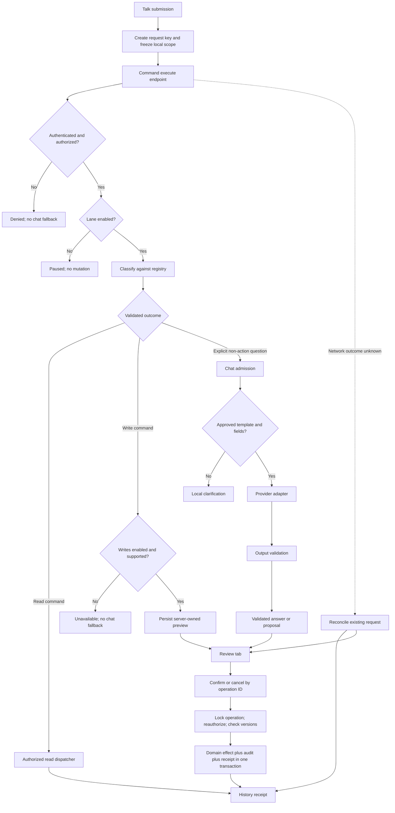
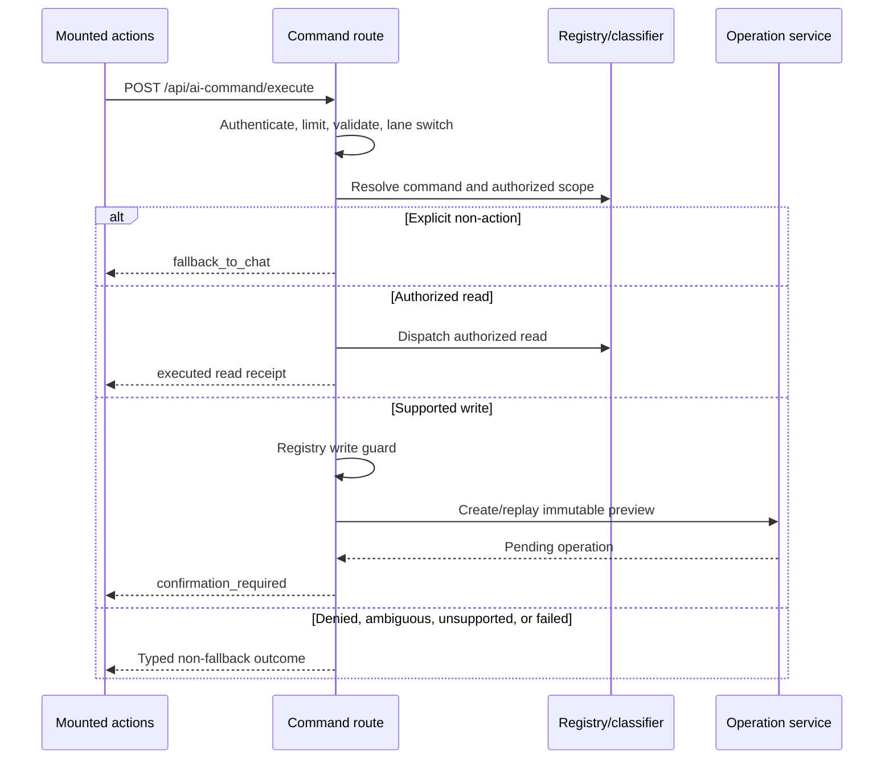
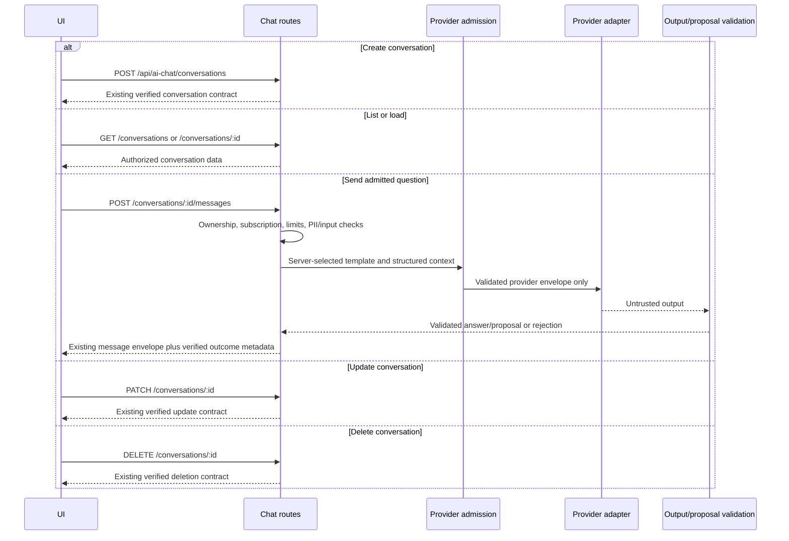
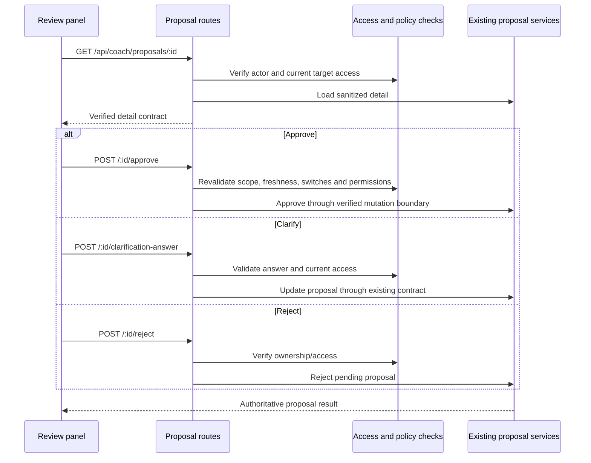
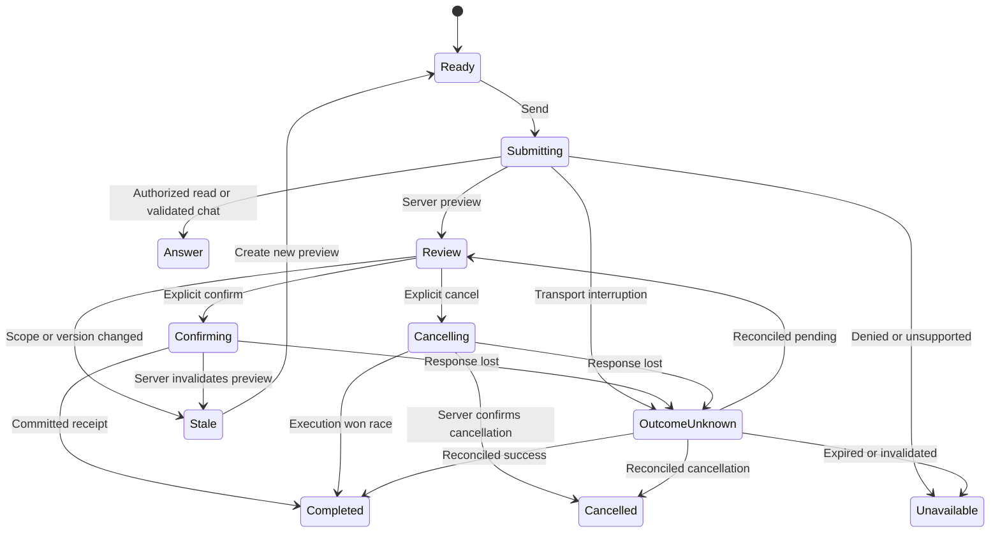
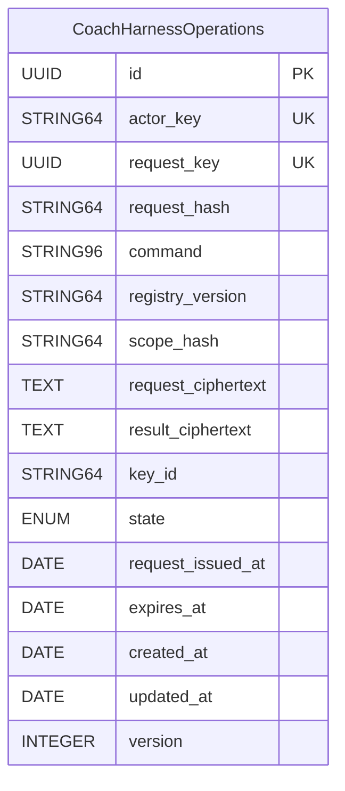
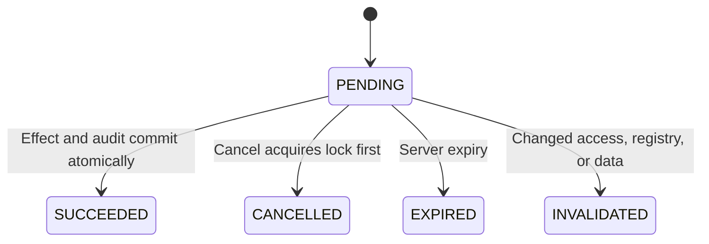

**Responsibilities**

- `CoachCommandCenterPage` owns the existing shell and accessible regions.
- Controller/actions own submission identity and route/client selection.
- A pure outcome reducer determines the next UI state.
- `useCoachCommand` owns command HTTP transport.
- `useAIChat` owns conversation transport; it never interprets a command error as permission to send chat.
- Command middleware authenticates, validates, limits, and checks lane controls.
- The registry owns permission metadata and write classification.
- The operation service owns previews, replay, confirmation serialization, and committed receipts.
- Dispatchers own domain effects through a supplied transaction.
- Provider admission owns the final outbound model payload.
- Output validation owns acceptance of generated material.
- Existing proposal services own human approval; generated text cannot call approval itself.

**User and data flow**



**Execute API interaction**



**Confirmation, cancellation, and recovery interactions**

```mermaid
sequenceDiagram
  participant UI
  participant API
  participant DB as Same database
  participant DISP as Transactional dispatcher
  alt Confirm
    UI->>API: POST /api/ai-command/confirm {operationId}
    API->>DB: Begin transaction; lock owned operation
    API->>API: Check expiry, switches, access, registry and data versions
    API->>DISP: Execute with transaction and immutable parameters
    DISP->>DB: Domain writes and audit
    API->>DB: Store terminal receipt; commit
    API-->>UI: executed receipt
  else Cancel
    UI->>API: POST /api/ai-command/cancel {operationId}
    API->>DB: Lock; change PENDING to CANCELLED
    API-->>UI: Authoritative operation state
  else Recover known operation
    UI->>API: GET /api/ai-command/operations/:operationId
    API->>DB: Read owned operation
    API-->>UI: State and permitted receipt
  else Recover lost execute response
    UI->>API: GET /api/ai-command/requests/:requestKey
    API->>DB: Find by authenticated actor and request key
    API-->>UI: Existing operation or request_not_found
  end
```

**Chat interactions**



All abbreviated chat paths above are prefixed `/api/ai-chat`. Existing lifecycle response shapes are not supplied; S0 must supply them before changing that transport.

**Proposal interactions**



Proposal state names, storage, and request bodies are not invented here. S4 is blocked until their source contracts are supplied. A chat proposal cannot bypass the write pause simply because it uses a different endpoint.

**UI state**



**Proposed operation ledger**

This is a **new target schema**, not a claim about existing tables. S0 first determines whether the current store already satisfies the contract. No migration proceeds without that adjudication.



`UK` denotes the **composite** unique index `(actor_key, request_key)`, not independent uniqueness.

Existing domain tables and proposal tables are not diagrammed: their definitions were not supplied. This is an explicit unresolved schema-evidence requirement, not an N/A claim. Their exact ERDs and model definitions must enter the S0 supplement before a dispatcher touching them is enabled.

**Persisted operation state**



Terminal states are immutable. “Outcome unknown” is a client observation, not a successful or failed database state. Execution holds the operation lock inside the transaction; it does not publish a misleading intermediate success.
