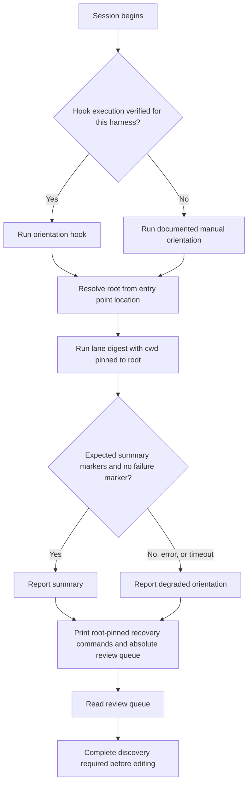
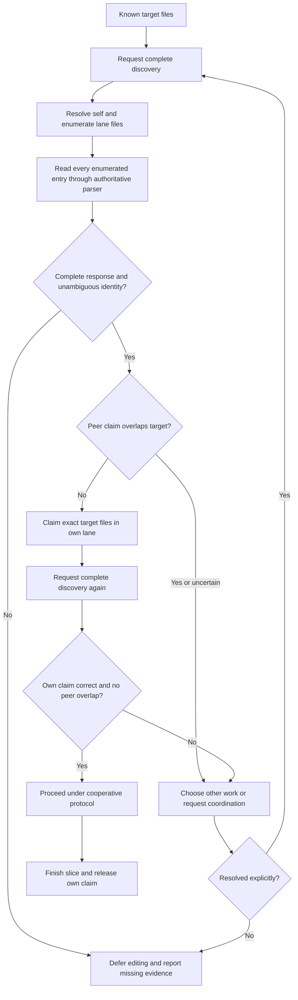
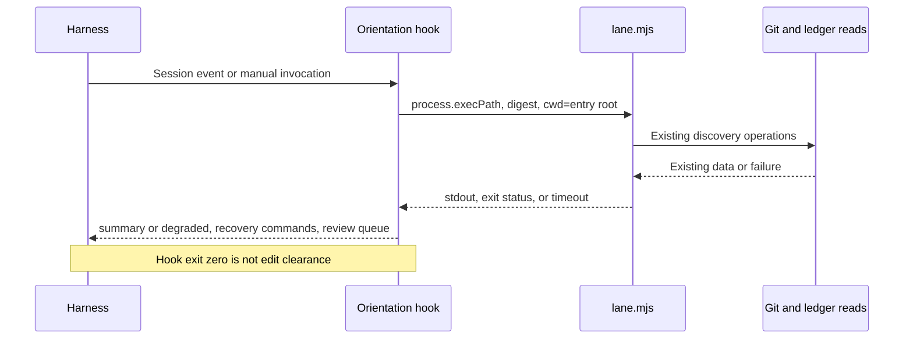
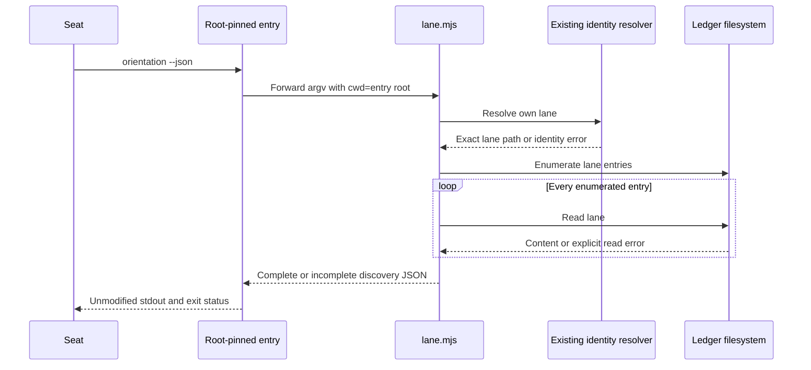
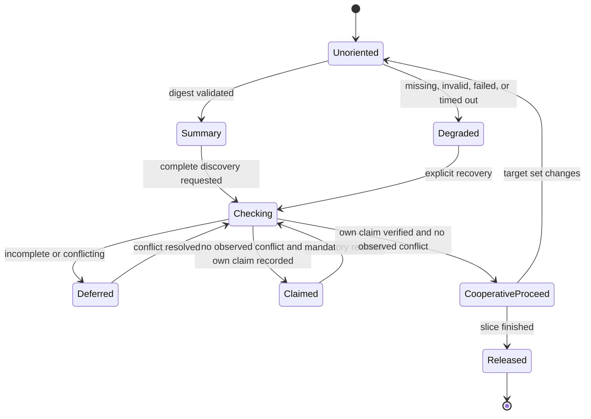

**Responsibilities**

| Component | Responsibility | Boundary |
|---|---|---|
| `scripts/hooks/lane-session-start.mjs` | Resolve its checkout root and invoke orientation. | No retention, claims, releases, or filesystem discovery implementation. |
| `scripts/lib/lane-orientation.mjs` — NEW/UNVERIFIED | Execute and classify the existing digest; render recovery commands. | Does not parse lane records or infer ownership. |
| `scripts/lane-at-root.mjs` — NEW/UNVERIFIED | Forward supported commands to that checkout’s `lane.mjs` with pinned cwd. | Does not implement ledger truth. |
| Existing `scripts/lane.mjs` | Remain the authoritative ledger implementation. | Add complete discovery only after its implementation closure is supplied. |
| Harness adapter | Invoke the hook or teach the verified manual procedure. | Configuration presence does not prove execution. |
| Instruction documents | Explain discovery, claiming, and limitations. | No hardcoded seat-file lists. |

[VERIFIED] Absolute helper resolution and `cwd: ROOT` are the existing working pattern in `lane-session-start.mjs:36-54`.

**Startup flow**

**Discovery and edit-decision flow**

The second check reduces races; it does not create mutual exclusion.

**Process interaction**

**Complete-discovery interaction — NEW/UNVERIFIED**

**Orientation state**

**Diagram applicability**

- HTTP/API sequence diagrams: **N/A — no HTTP endpoints or remote APIs are introduced.** The applicable subprocess interactions are diagrammed above.
- `erDiagram`: **N/A — no relational database or tables are created or touched.** File-record fields are specified in `03-contracts.md`.
- GUI component tree: **N/A — headless command and instruction layer.**
- Trust boundary: lane contents are untrusted coordination data. Never execute their text or interpolate it into shell commands.

Mermaid source is supplied; rendered previews were not verified in this review.
