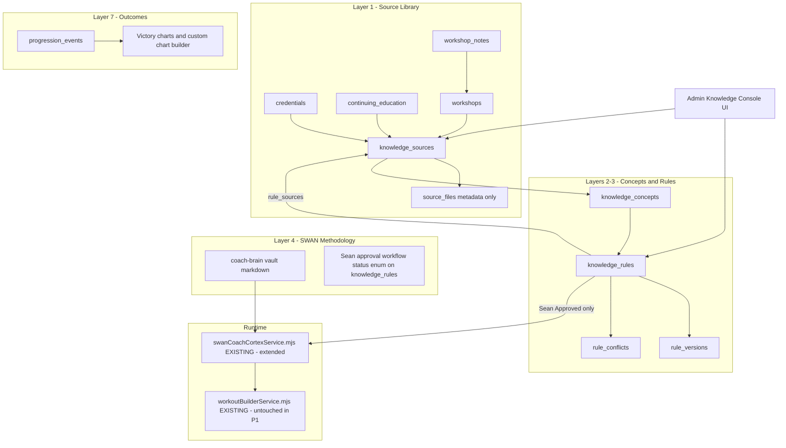
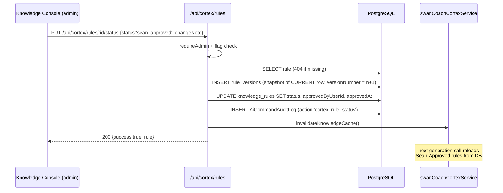
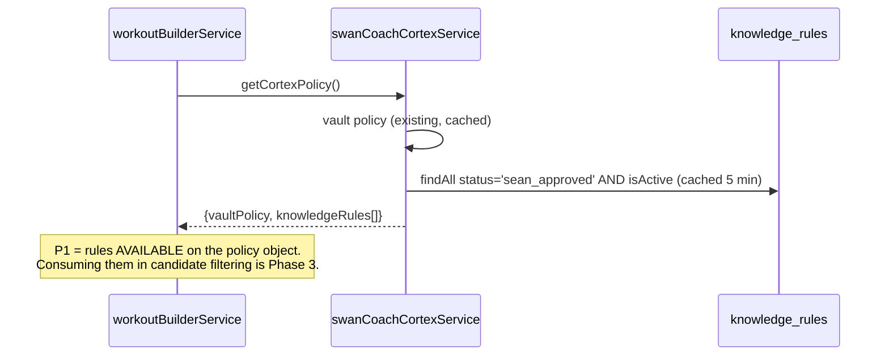
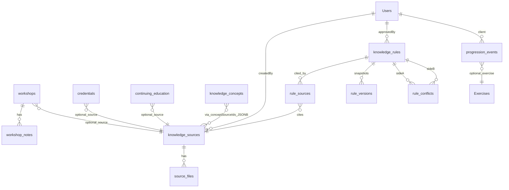
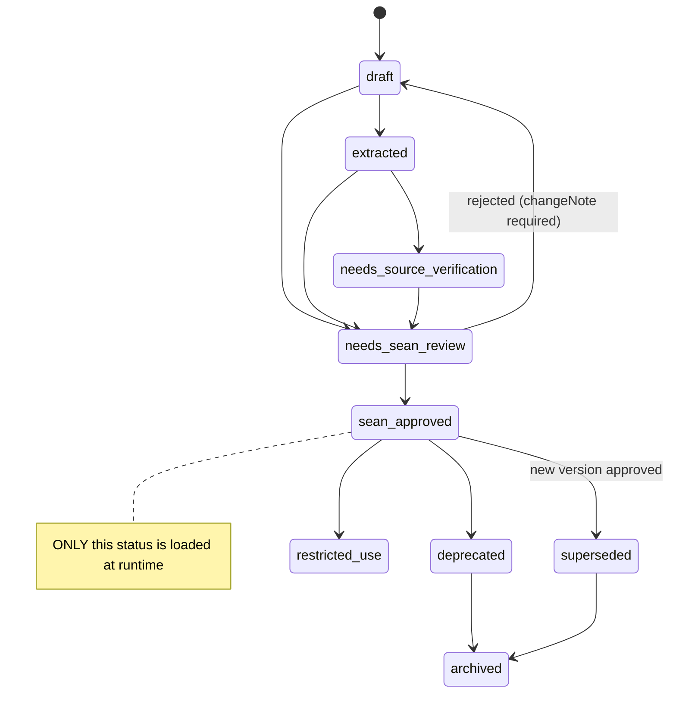

# 01 — Architecture

## Overview

Seven-layer Cortex (v2 spec §B3). Phase 1 builds Layers 1–3 storage + the Layer-4 approval
workflow + one Layer-7 event log:

Key architectural rulings (already decided — do not re-decide):
- **Vault stays.** `docs/ai-workflow/coach-brain/` markdown remains the doctrine home; the DB
  rules layer complements it. The extended service exposes BOTH under one API.
- **Restricted source binaries live OUTSIDE this repo** (Hermes vault / private R2).
  `source_files` stores metadata + `storageLocation` string only. NEVER file bytes, NEVER a
  public URL to copyrighted material.
- **Approval = fields on `knowledge_rules`** (`status`, `approvedByUserId`, `approvedAt`) copying
  the proven `LongTermProgramPlan` pattern — NOT a separate approvals table. History lives in
  `rule_versions` (immutable snapshots, copying the `WaiverVersion` pattern).
- **Audit:** reuse `AiCommandAuditLog` shape conventions for the new `logKnowledgeAudit` helper —
  do NOT create a fifth audit table; knowledge admin actions write to `rule_versions` +
  a `changeNote`, and destructive-ish actions (reject/merge/archive) also write an
  `AiCommandAuditLog` row (existing model).

## Sequence — Sean approves a rule

## Sequence — runtime rule loading

## ER diagram (new tables only; `Users` is the existing PascalCase table)

Exact columns/types: `03-contracts.md`. 11 new tables total:
`knowledge_sources, source_files, credentials, continuing_education, workshops, workshop_notes,
knowledge_concepts, knowledge_rules, rule_sources, rule_versions, rule_conflicts` + 1 event table
`progression_events` (covers regression too via `direction` enum — one table, ratified 5c).

## Rule status state machine

Full label set from the v1 spec is stored in the `status` ENUM (03-contracts); the state machine
above is the enforced transition set — the API rejects transitions not drawn here (400
`invalid_status_transition`).
