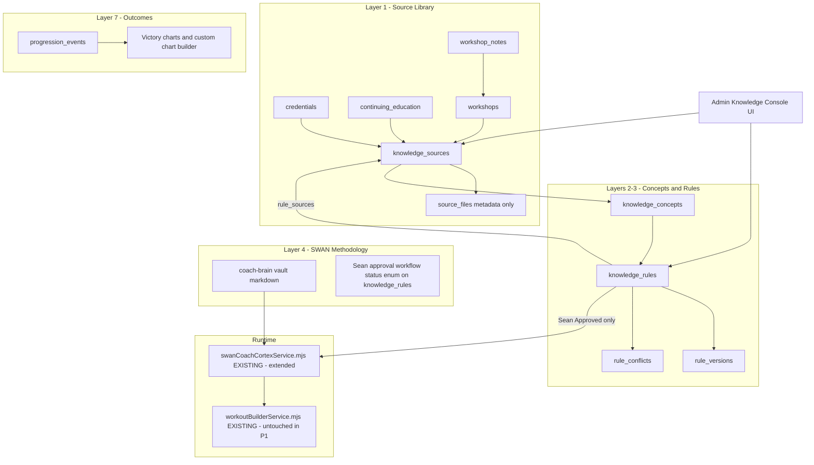
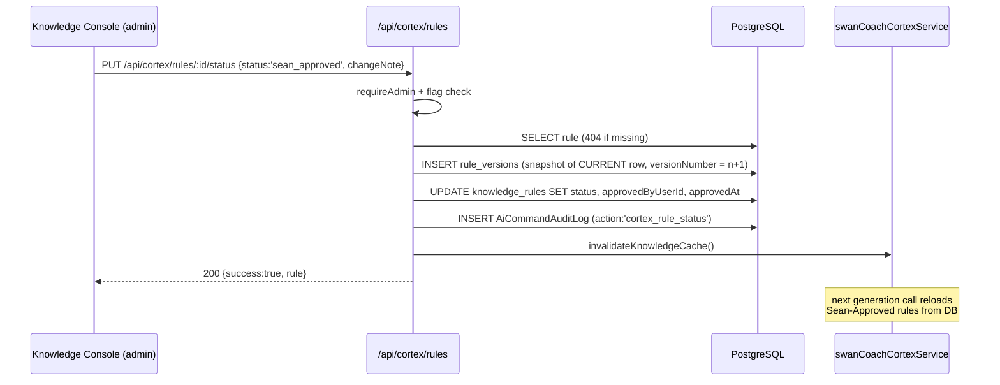
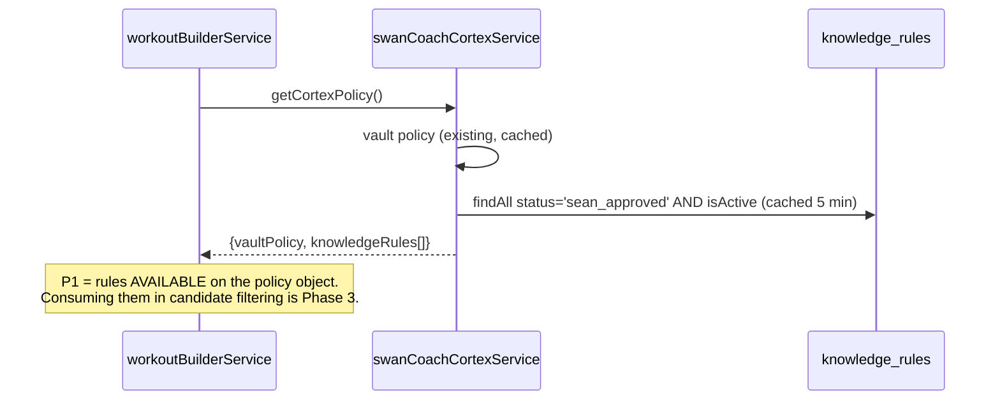
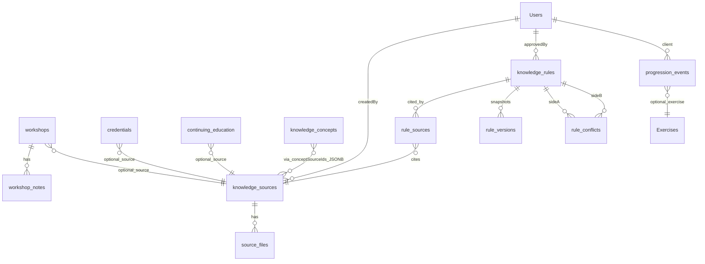
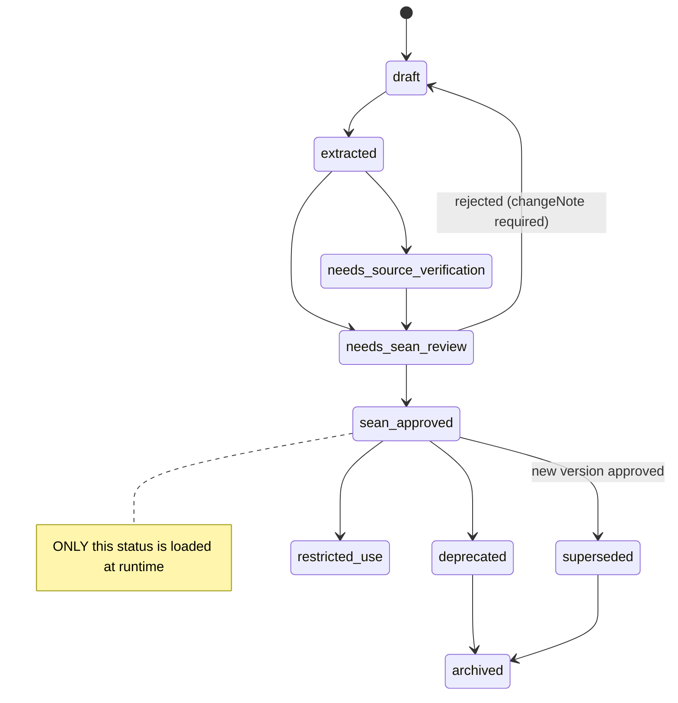

<!-- ===== FILE: 00-README.md ===== -->

# BLUEPRINT — Cortex Phase 1: Knowledge Spine
**Forged:** 2026-07-14 · **Architect:** Fable 5 · **Baseline:** origin/main @ `eac60c638`
**Parent docs:** `docs/ai-workflow/brainstorms/swan-training-cortex-master-prompt-2026-07-13.md` (v2 spec) · `docs/ai-workflow/AI-HANDOFF/CORTEX-PHASE0-RECONCILIATION-2026-07-14.md` (ratified decisions §8)

## What this builds

The **knowledge spine** of the SWAN Training Cortex: the database layer that stores Sean Swan's
professional knowledge sources (books, certifications, workshops — including the ~2000 NASM
workshop), the operational coaching rules derived from them (with citations, versioning, conflict
tracking, and Sean's approval workflow), plus the **progression/regression event log** (ratified
decision 5c — it immediately feeds charts and gamification). It also extends the existing
`swanCoachCortexService` to load Sean-Approved DB rules alongside the markdown doctrine vault, and
ships the admin Knowledge Console UI where Sean reviews rules.

**Brownfield law:** this repo already has a working Cortex policy loader, exercise catalog, plan
tables, and audit tables. This package ADDS the knowledge layer. It does NOT rebuild anything.
Everything is behind the `ENABLE_CORTEX_KNOWLEDGE` feature flag, default OFF.

## Package contents / build order

| File | What it gives you |
|---|---|
| `01-architecture.md` | System overview, Mermaid flowchart + sequence + ER diagrams |
| `02-wireframes.md` | Admin Knowledge Console — every screen/state, desktop + 375px |
| `03-contracts.md` | Every model definition, API endpoint, function signature — exact |
| `04-build-order.md` | File-by-file: path, purpose, line budget, imports/exports, pattern to copy |
| `05-slices.md` | 5 slices with executable acceptance criteria + STOP lines |
| `06-bans.md` | Do-NOT list (house rules + package-specific) |
| `07-checkpoints.md` | Checkpoint protocol + review remit; verdicts logged here |

Read 00 → 06 → 05 → 03 → 04 first. 01/02 are the reference layer while building.

## Builder Contract (binding)

> You are the builder, not the architect. Follow the package to the letter. Where the package
> decides, you do not re-decide — even if you'd do it differently. Where the package is silent on
> something that matters, STOP and return the question; do not improvise. Build ONE slice at a
> time; after each slice, output the diff + the acceptance-criteria evidence (test output, curl
> results, screenshots) and WAIT for the checkpoint verdict before continuing. Never claim a
> criterion passed without pasting its output.

## Environment facts the builder needs

- Node/Express backend, ES modules (`.mjs`), Sequelize + PostgreSQL. Frontend React 18 + TS +
  styled-components + Vite. Local dev: `npm run dev` from root (backend :10000, frontend :5173).
- **Local dev uses the PRODUCTION database.** Migrations are live the moment they run. Every
  migration in this package is additive-only (new tables, zero ALTERs of existing tables).
- Tests: `cd backend && npm test` (unit) · `cd frontend && npx vitest run` · types:
  `cd frontend && npx tsc --noEmit`.
- Migrations live in `backend/migrations/*.cjs` (CommonJS on Windows), run via the project's
  existing sequelize-cli setup. Models in `backend/models/*.mjs`, registered in
  `backend/models/associations.mjs` + `backend/models/index.mjs`.
- Commit style `type(scope): description`; commit per slice, push ONCE at batch end (Rule 70).
- Feature flag: `ENABLE_CORTEX_KNOWLEDGE` (env var, string `'true'` enables). All new routes
  return `503 {success:false, error:'cortex_knowledge_disabled'}` when off.

## Working method

Work in a fresh worktree branched from origin/main (NOT any wip branch):
`git worktree add C:/tmp/sspt-cortex-p1 -b codex/cortex-phase1 origin/main`.
Claim your lane per `.ai-workflow/coordination/` before editing (read the other agent's lane file
first). Stage explicit paths only — never `git add -A`.


<!-- ===== FILE: 01-architecture.md ===== -->

# 01 — Architecture

## Overview

Seven-layer Cortex (v2 spec §B3). Phase 1 builds Layers 1–3 storage + the Layer-4 approval
workflow + one Layer-7 event log:



Key architectural rulings (already decided — do not re-decide):
- **Vault stays.** `docs/ai-workflow/coach-brain/` markdown remains the doctrine home; the DB
  rules layer complements it. The extended service exposes BOTH under one API.
- **Restricted source binaries live OUTSIDE this repo** (Hermes vault / private R2).
  `source_files` stores metadata + `storageLocation` string only. NEVER file bytes, NEVER a
  public URL to copyrighted material.
- **Approval = fields on `knowledge_rules`** (`status`, `approvedByUserId`, `approvedAt`) copying
  the proven `LongTermProgramPlan` pattern — NOT a separate approvals table. History lives in
  `rule_versions` (immutable snapshots, copying the `WaiverVersion` pattern).
- **Audit:** reuse `AiCommandAuditLog` shape conventions for the new `logKnowledgeAudit` helper —
  do NOT create a fifth audit table; knowledge admin actions write to `rule_versions` +
  a `changeNote`, and destructive-ish actions (reject/merge/archive) also write an
  `AiCommandAuditLog` row (existing model).

## Sequence — Sean approves a rule



## Sequence — runtime rule loading



## ER diagram (new tables only; `Users` is the existing PascalCase table)



Exact columns/types: `03-contracts.md`. 11 new tables total:
`knowledge_sources, source_files, credentials, continuing_education, workshops, workshop_notes,
knowledge_concepts, knowledge_rules, rule_sources, rule_versions, rule_conflicts` + 1 event table
`progression_events` (covers regression too via `direction` enum — one table, ratified 5c).

## Rule status state machine



Full label set from the v1 spec is stored in the `status` ENUM (03-contracts); the state machine
above is the enforced transition set — the API rejects transitions not drawn here (400
`invalid_status_transition`).


<!-- ===== FILE: 02-wireframes.md ===== -->

# 02 — Wireframes: Admin Knowledge Console

One admin page, route `/dashboard/admin/knowledge` (registration pattern in 04). Dark-first,
Crystalline Swan tokens. Copy strings below are EXACT — use verbatim.

Tokens (always `var(--token, #fallback)`): bg `var(--bg-base, #030712)` · card
`var(--surface-dark, #1A1A24)` / `var(--card-dark, #141419)` · text `var(--text-primary, #E0ECF4)` ·
accent `var(--accent-primary, #60C0F0)` · purple glow `var(--glow-accent, #8B5CF6)` · gold
`var(--luxury-accent, #C6A84B)` · data cyan (charts/badges only) `#50A0F0`.
Buttons ≥44px; blue bg → purple glow, purple bg → cyan glow. Low-motion (this is a data surface):
no pointer tracking, no hover-only actions.

## Screen 1 — Console home (tab: Rules)

Desktop (≥1024px):
```
┌──────────────────────────────────────────────────────────────────────────┐
│  Knowledge Console                                    [ + New Rule ]      │
│  SWAN Training Cortex · knowledge spine                [ + New Source ]   │
│  ┌─────────┬─────────┬───────────┬───────────┐                            │
│  │ Sources │ RULES ▣ │ Conflicts │ Review Due│   ← tabs (44px)            │
│  └─────────┴─────────┴───────────┴───────────┘                            │
│  Stats row: [ 12 Sources ] [ 3 Approved ] [ 7 Awaiting Review ]           │
│            [ 1 Open Conflict ] [ 2 Review Due ]      ← pill cards, gold   │
│                                                        number, Fira Code  │
│  Filters: [Status ▾] [Domain ▾] [Type ▾] [Search rules…        ] (44px)   │
│  ┌──────────────────────────────────────────────────────────────────┐    │
│  │ ● needs_sean_review   core-training · contraindication          │    │
│  │ Regress unstable movements before increasing intensity           │    │
│  │ Sources: 2 · v3 · confidence: likely      [ Review ]  [ Edit ]   │    │
│  ├──────────────────────────────────────────────────────────────────┤    │
│  │ ● sean_approved   pain-response · stop_condition        (gold ●) │    │
│  │ Stop lower-body loading when client reports sharp joint pain     │    │
│  │ Sources: 1 · v1 · confidence: verified    [ View ]   [ Edit ]    │    │
│  └──────────────────────────────────────────────────────────────────┘    │
│  [ ‹ Prev ]  Page 1 of 3  [ Next › ]                                      │
└──────────────────────────────────────────────────────────────────────────┘
```
Status dot colors: draft/extracted = Swan Lavender `#4070C0`; needs_* = Ice Wing `#60C0F0`;
sean_approved = Gilded Fern `#C6A84B`; deprecated/superseded/archived = 50% muted text; prohibited
= `#E0ECF4` on red-tinted pill `rgba(220,60,60,.18)`.

States: **Loading** = 3 skeleton rows (pulse, respects reduced-motion). **Empty** = centered
"No rules yet. Extract Sean's first rule from a source, or create one manually." + `[ + New Rule ]`.
**Error** = "Couldn't load the knowledge base. [ Retry ]". **Flag off** = full-page notice
"Cortex knowledge layer is disabled. Set ENABLE_CORTEX_KNOWLEDGE=true to activate." (no controls).

Mobile 375px: tabs become horizontal scroll chips; stats wrap 2-per-row; rule cards stack
full-width; `[ Review ]`/`[ Edit ]` become full-width 44px stacked buttons. Nothing hover-only.

## Screen 2 — Rule detail / review drawer (right drawer desktop · full-screen sheet mobile)

```
┌ Rule · v3 ─────────────────────────────── [✕] ┐
│ Regress unstable movements before             │
│ increasing intensity                          │
│ STATUS: ● needs_sean_review                   │
│ domain: core-training · type: contraindication│
│ confidence: likely · strength: level3         │
│───────────────────────────────────────────────│
│ Plain rule        <plainLanguageRule text>    │
│ Operational logic <pretty JSON, Fira Code>    │
│ Sean's take       <seanInterpretation>        │
│ Explanations      tabs: Client / Trainer /    │
│                   Technical                   │
│ Citations                                     │
│   • NASM OPT textbook — ch.7 (level2)         │
│   • ~2000 NASM workshop (level5) ⚠ unverified │
│ Version history   v3 ‹current› · v2 · v1      │
│ Conflicts (0)                                 │
│───────────────────────────────────────────────│
│ Change note (required):                       │
│ [______________________________________]     │
│ [ Approve ✓ ]  [ Send back ]  [ Archive ]     │
│   gold bg        blue bg        ghost         │
└───────────────────────────────────────────────┘
```
`[ Approve ✓ ]` → PUT status `sean_approved`. `[ Send back ]` → status `draft`. Both disabled
until change note ≥5 chars (helper text: "Add a change note first — every status change is
recorded."). Success toast: "Rule approved — live for generation within 5 minutes." Level-5
citations always show the ⚠ badge with title text "Unverified recollection — verify before this
rule governs safety decisions."

## Screen 3 — Sources tab

Card grid (2-col desktop / 1-col mobile). Card: title, category chip, org, year,
historicalStatus badge ("Historical" = lavender chip), `Rules citing: n`, copyright chip
(`restricted` = gold outline), `[ Open ]`. New/Edit source = same drawer pattern as Screen 2 with
form fields from 3.2; `storageLocation` helper text: "External pointer only (hermes-vault:// or
r2-private://). Never upload the file here." Empty state: "No sources yet. Add Sean's first
knowledge source — books, certifications, workshops."

## Screen 4 — Conflicts tab

List rows: `Rule A ⚡ Rule B` names + conflictDescription + status chip; `[ Resolve ]` opens
drawer with side-by-side plain rules (stacked on mobile), radio: "A wins / B wins / Merged /
Defer", rationale textarea (required), `[ Save resolution ]` (44px, blue). Empty: "No open
conflicts. The knowledge base is consistent."

## Screen 5 — Review Due tab

Same row layout as Rules, filtered `reviewDueAt <= today`, sorted oldest first, each row shows
"Review due <date>" in gold. Empty: "Nothing due for review."


<!-- ===== FILE: 03-contracts.md ===== -->

# 03 — Contracts (models, APIs, functions)

## 3.1 Model conventions (copy exactly)

Copy the house pattern (verified from `LongTermProgramPlan.mjs` / `WaiverVersion.mjs` on main):
`import { DataTypes, Model } from 'sequelize'; import sequelize from '../database.mjs';`
class extends Model; `Model.init({...},{sequelize, modelName, tableName, timestamps:true,
indexes:[...]})`. Every FK to users references `{model:'Users', key:'id'}` — capital U, always.
Every column gets a `comment`. snake_case tableName, camelCase attributes.

## 3.2 New tables (exact columns)

### knowledge_sources
| column | type | notes |
|---|---|---|
| id | INTEGER PK autoincrement | |
| sourceTitle | STRING(300) NOT NULL | |
| sourceCategory | ENUM NOT NULL | `'formal_certification','continuing_education','textbook','live_workshop','personal_notes','professional_recollection','peer_reviewed_research','org_guidance','government_guidance','manufacturer_guidance','healthcare_direction','practical_experience','swan_original','client_outcome','historical_method','industry_practice','unverified','superseded','conflicting','user_submitted'` (= v1 classes A–T) |
| organization | STRING(200) NULL | e.g. 'NASM' |
| authorOrInstructor | STRING(200) NULL | |
| edition | STRING(50) NULL · publicationYear INTEGER NULL · attendanceDate DATEONLY NULL · completionDate DATEONLY NULL | |
| historicalStatus | ENUM NOT NULL default `'current'` | `'current','historical','superseded','requires_verification'` |
| evidenceLevel | ENUM NOT NULL default `'unrated'` | `'high','moderate','low','anecdotal','unrated'` |
| copyrightSensitivity | ENUM NOT NULL default `'restricted'` | `'open','cite_only','restricted','prohibited_user_facing'` |
| userDisplayAllowed | BOOLEAN NOT NULL default false | |
| summary | TEXT NULL · topicsCovered JSONB NULL (string array) · seanNotes TEXT NULL | |
| reviewStatus | ENUM NOT NULL default `'pending'` | `'pending','reviewed','flagged'` |
| lastReviewedAt DATE NULL · nextReviewAt DATE NULL · reviewedByUserId INTEGER NULL FK Users | |
| createdByUserId | INTEGER NULL FK Users | |
Indexes: `sourceCategory`, `historicalStatus`, `reviewStatus`.

### source_files (metadata ONLY — no bytes, no public URLs)
id PK · sourceId INTEGER NOT NULL FK knowledge_sources (CASCADE) · fileLabel STRING(200) NOT NULL ·
storageLocation STRING(500) NOT NULL comment 'external pointer e.g. hermes-vault://… or r2-private://… — NEVER repo path, NEVER public URL' ·
sourceFormat ENUM('pdf','image','audio','video','markdown','physical','other') NOT NULL ·
accessRestriction ENUM('sean_only','trainer_internal','system_internal') NOT NULL default 'sean_only' ·
chapter STRING(100) NULL · pageRange STRING(50) NULL · checksum STRING(64) NULL. Index: sourceId.

### credentials
id PK · credentialName STRING(200) NOT NULL · issuingOrganization STRING(200) NOT NULL ·
credentialStatus ENUM('active','expired','historical','in_progress') NOT NULL ·
earnedDate DATEONLY NULL · expiresDate DATEONLY NULL · sourceId INTEGER NULL FK knowledge_sources ·
holderUserId INTEGER NOT NULL FK Users · displayString STRING(300) NOT NULL comment
'EXACT user-facing wording, e.g. "NASM workshop-trained" — never invent; copy Sean-approved strings' ·
notes TEXT NULL.

### continuing_education
id PK · courseTitle STRING(300) NOT NULL · provider STRING(200) NULL · completedDate DATEONLY NULL ·
ceuValue DECIMAL(5,2) NULL · sourceId INTEGER NULL FK knowledge_sources · integratedIntoRules
BOOLEAN NOT NULL default false · notes TEXT NULL · holderUserId INTEGER NOT NULL FK Users.

### workshops
id PK · workshopName STRING(300) NOT NULL · organization STRING(200) NULL · approximateDate
STRING(50) NULL comment 'string to allow "~2000"' · exactDate DATEONLY NULL · location STRING(200)
NULL · knowledgeFormat JSONB NULL comment 'array e.g. ["recollection","notes","handouts"]' ·
sourceId INTEGER NULL FK knowledge_sources · attendeeUserId INTEGER NOT NULL FK Users ·
verificationPolicy TEXT NULL.

### workshop_notes
id PK · workshopId INTEGER NOT NULL FK workshops (CASCADE) · noteTitle STRING(200) NOT NULL ·
noteBody TEXT NOT NULL · confidence ENUM('verified','clear_memory','fuzzy_memory','uncertain')
NOT NULL default 'clear_memory' · capturedVia ENUM('typed','grill_me_interview','plaud_transcript','scan')
NOT NULL default 'typed' · createdByUserId INTEGER NULL FK Users.

### knowledge_concepts
id PK · conceptName STRING(200) NOT NULL UNIQUE · domain STRING(100) NOT NULL comment
'one of the 48 v1 domains, kebab-case e.g. "core-training"' · definition TEXT NOT NULL ·
conceptSourceIds JSONB NULL comment 'array of knowledge_sources ids' · evidenceStatus
ENUM('supported','mixed','contested','historical') NOT NULL default 'supported' · notes TEXT NULL.

### knowledge_rules (the heart)
| column | type |
|---|---|
| id PK · ruleName STRING(200) NOT NULL · domain STRING(100) NOT NULL · subdomain STRING(100) NULL | |
| ruleType | ENUM('selection','progression','regression','contraindication','stop_condition','referral','dosage','coaching_cue','eligibility','methodology') NOT NULL |
| plainLanguageRule | TEXT NOT NULL (Sean-readable one-paragraph rule) |
| operationalLogic | JSONB NOT NULL comment 'machine shape: {if:[{field,op,value}], then:[{action,target,params}]} — ops: eq,neq,gt,gte,lt,lte,in,contains; actions: exclude_exercise,prefer_exercise,cap_intensity,require_regression,flag_referral,stop_session,require_review' |
| technicalExplanation TEXT NULL · userFacingExplanation TEXT NULL · trainerFacingExplanation TEXT NULL | |
| applicablePopulation JSONB NULL · excludedPopulation JSONB NULL · triggeringConditions JSONB NULL · contraindications JSONB NULL · stopConditions JSONB NULL · referralConditions JSONB NULL · progressionCriteria JSONB NULL · regressionCriteria JSONB NULL · coachingCues JSONB NULL (all string arrays or the op-shape above) | |
| status | ENUM('draft','extracted','needs_source_verification','needs_sean_review','sean_approved','professionally_reviewed','current_with_qualifications','conflicting_evidence','restricted_use','client_specific_only','experimental','deprecated','superseded','archived','prohibited') NOT NULL default 'draft' |
| confidenceLevel | ENUM('verified','likely','hypothesis') NOT NULL default 'hypothesis' |
| sourceStrength | ENUM('level1_exact_page','level2_chapter','level3_course_record','level4_documented_experience','level5_unverified_recollection') NOT NULL default 'level5_unverified_recollection' |
| seanInterpretation TEXT NULL · historicalStatus ENUM('current','historical','superseded') default 'current' | |
| approvedByUserId INTEGER NULL FK Users · approvedAt DATE NULL · reviewDueAt DATE NULL | |
| currentVersion INTEGER NOT NULL default 1 · isActive BOOLEAN NOT NULL default true · createdByUserId INTEGER NULL FK Users | |
Indexes: `status`, `domain`, `ruleType`, composite `(status,isActive)`.

### rule_sources
id PK · ruleId INTEGER NOT NULL FK knowledge_rules (CASCADE) · sourceId INTEGER NOT NULL FK
knowledge_sources · citationLevel ENUM('level1','level2','level3','level4','level5') NOT NULL ·
citationDetail STRING(300) NULL comment 'e.g. "ch. 7 pp. 142-150" — never invented; null if unknown'.
Unique composite index `(ruleId, sourceId)`.

### rule_versions (immutable — no UPDATE path in code)
id PK · ruleId INTEGER NOT NULL FK knowledge_rules (CASCADE) · versionNumber INTEGER NOT NULL ·
snapshot JSONB NOT NULL comment 'full knowledge_rules row as-of change' · changeNote TEXT NOT NULL ·
changedByUserId INTEGER NULL FK Users · previousStatus STRING(50) NULL · newStatus STRING(50) NULL.
Unique composite `(ruleId, versionNumber)`.

### rule_conflicts
id PK · ruleAId INTEGER NOT NULL FK knowledge_rules · ruleBId INTEGER NOT NULL FK knowledge_rules ·
conflictDescription TEXT NOT NULL · resolutionStatus ENUM('open','resolved_a_wins','resolved_b_wins','resolved_merged','deferred') NOT NULL default 'open' ·
resolutionRationale TEXT NULL · resolvedByUserId INTEGER NULL FK Users · resolvedAt DATE NULL.

### progression_events (decision 5c — one table for both directions)
id PK · userId INTEGER NOT NULL FK Users comment 'the client' · exerciseId INTEGER NULL FK
Exercises · direction ENUM('progression','regression') NOT NULL · eventType
ENUM('load_increase','rep_increase','range_increase','complexity_increase','assistance_reduced','tempo_advance','load_decrease','substitution','support_added','volume_reduced','impact_reduced','other') NOT NULL ·
fromValue JSONB NULL · toValue JSONB NULL comment 'e.g. {"load":135,"unit":"lb"}' · reason
STRING(300) NULL · sourceRuleId INTEGER NULL FK knowledge_rules · workoutSessionId INTEGER NULL FK
workout_sessions (match the real FK target of `WorkoutSession` — VERIFY tableName in
backend/models/WorkoutSession.mjs before writing the migration; if it differs, use the model's
real tableName) · recordedByUserId INTEGER NULL FK Users · occurredAt DATE NOT NULL default NOW.
Indexes: `(userId, occurredAt)`, `exerciseId`, `direction`.

## 3.3 API contract — all under `/api/cortex`, one router file

Auth: ALL endpoints `requireAdmin` (copy the admin-guard middleware used by an existing admin
route — see 04). Flag: every handler first checks `process.env.ENABLE_CORTEX_KNOWLEDGE === 'true'`
else `503 {success:false, error:'cortex_knowledge_disabled'}`. All responses
`{success:boolean, ...}`. Errors: 400 `{success:false, error:'<snake_code>', message}` · 404
`not_found` · 500 `internal_error` (never leak stack traces).

| Method + path | Body → Response |
|---|---|
| GET `/api/cortex/sources?category=&status=&page=1&pageSize=25` | → `{success, sources:[], total, page}` |
| POST `/api/cortex/sources` | full source fields (3.2) → 201 `{success, source}` |
| PUT `/api/cortex/sources/:id` | partial fields → `{success, source}` |
| GET `/api/cortex/sources/:id` | → `{success, source, files:[], linkedRuleCount}` |
| POST `/api/cortex/sources/:id/files` | `{fileLabel, storageLocation, sourceFormat, accessRestriction, chapter?, pageRange?}` → 201. REJECT 400 `invalid_storage_location` if storageLocation starts with `http://`, `https://`, `/`, or a drive letter — external pointer schemes only |
| GET `/api/cortex/rules?status=&domain=&ruleType=&q=&page=&pageSize=` | → `{success, rules:[], total, page}` (q = ILIKE on ruleName+plainLanguageRule) |
| POST `/api/cortex/rules` | rule fields → 201 `{success, rule}` (status forced to 'draft' regardless of body) |
| PUT `/api/cortex/rules/:id` | partial fields (NOT status) → snapshots to rule_versions first, increments currentVersion → `{success, rule}` |
| PUT `/api/cortex/rules/:id/status` | `{status, changeNote}` (changeNote required ≥5 chars) → validates transition per 01 state machine → `{success, rule}` |
| GET `/api/cortex/rules/:id` | → `{success, rule, sources:[{...citation}], versions:[{versionNumber,changeNote,changedAt}], conflicts:[]}` |
| POST `/api/cortex/rules/:id/sources` | `{sourceId, citationLevel, citationDetail?}` → 201 |
| POST `/api/cortex/conflicts` | `{ruleAId, ruleBId, conflictDescription}` → 201 |
| PUT `/api/cortex/conflicts/:id` | `{resolutionStatus, resolutionRationale}` → `{success, conflict}` |
| GET `/api/cortex/stats` | → `{success, stats:{sources, rulesByStatus:{draft:n,...}, openConflicts, reviewDue}}` |
| POST `/api/cortex/progression-events` | event fields (3.2) → 201 `{success, event}` — auth: `requireTrainerOrAdmin` (this one endpoint) |
| GET `/api/cortex/progression-events?userId=&from=&to=&direction=` | → `{success, events:[], total}` — trainer/admin; a client may query ONLY their own userId (403 `forbidden` otherwise) |

## 3.4 Service extension — `swanCoachCortexService.mjs`

ADD (do not modify existing exports):
```js
export async function getApprovedKnowledgeRules({ domain = null } = {})
// → Promise<Array<rulePlain>> ; findAll {status:'sean_approved', isActive:true} (+domain),
// mapped to plain objects; module-level cache 5 min TTL.
export function invalidateKnowledgeCache() // clears the cache; called by status/PUT handlers
```
Wire into the existing policy return: the object returned by the service's existing public
policy-loader gains a `knowledgeRules` property = `await getApprovedKnowledgeRules()` **only when
the flag is on**; when off, `knowledgeRules: []`. Existing consumers must be untouched and green.

## 3.5 Seed (Slice 1)

Idempotent seeder `backend/seeders/20260714-seed-cortex-founding-sources.mjs` (findOrCreate by
sourceTitle), creating: (1) source "Sean Swan NASM Workshop Education" — category
`live_workshop`, historicalStatus `historical`, copyrightSensitivity `cite_only`, summary = the
verification policy from v1 (any safety-sensitive recommendation originating primarily here is
checked against newer evidence before becoming an authoritative automated rule); plus linked
`workshops` row (approximateDate `"~2000"`, knowledgeFormat
`["recollection","notes_if_available","handouts_if_available"]`); (2) source "NASM OPT Model —
Sean's certification education" category `formal_certification`; (3) credentials row —
displayString EXACTLY `"NASM workshop-trained (26+ years experience)"`, holderUserId = the admin
user (look up by role `'admin'`, lowest id).

**Founding source catalog (also seeded, metadata-only, from the owner's declared library —
create each with findOrCreate by sourceTitle; author/edition/year = NULL where not stated; NO
source_files rows for any of these):**
| sourceTitle | sourceCategory | notes/summary |
|---|---|---|
| "NASM OPT textbook (Sean's owned copy)" | `textbook` | copyrightSensitivity `restricted`; summary: "Owner-held NASM textbook. Metadata record only — edition/year to be filled by Sean in the Knowledge Console. No content stored." |
| "NASM course materials (lawfully obtained)" | `formal_certification` | copyrightSensitivity `restricted`; edition/year NULL |
| "Sean's personal workshop & course notes" | `personal_notes` | copyrightSensitivity `cite_only` |
| "ACSM guidance & position statements" | `org_guidance` | copyrightSensitivity `cite_only` |
| "NSCA guidance & position statements" | `org_guidance` | copyrightSensitivity `cite_only` |
| "U.S. Physical Activity Guidelines (HHS)" | `government_guidance` | copyrightSensitivity `public` if the enum has it, else `cite_only` |
| "Sean's practical coaching experience (26+ years)" | `practical_experience` | historicalStatus `current` |
| "SWAN original methodology" | `swan_original` | historicalStatus `current` |

Do NOT invent titles, editions, years, page counts, or additional books beyond this table —
Sean enumerates exact editions later via the Knowledge Console Sources tab (that surface exists
for precisely this). The seeder total is therefore 10 knowledge_sources rows + 1 workshops row +
1 credentials row.


<!-- ===== FILE: 04-build-order.md ===== -->

# 04 — Build order (file by file)

Every file ≤300 lines. Pattern excerpts referenced here are pasted in §4.9 so the builder never
needs to grep. Order below = build order; each slice boundary leaves the app bootable with the
flag off.

## Slice 1 — Source Library (models + migration + seed)

| # | File | Purpose / exports |
|---|---|---|
| 1 | `backend/migrations/20260714000001-create-cortex-source-library.cjs` | Creates `knowledge_sources`, `source_files`, `credentials`, `continuing_education`, `workshops`, `workshop_notes` exactly per 03 §3.2. CommonJS (`module.exports = {up, down}`); `down` drops in reverse order. Additive only. |
| 2 | `backend/models/KnowledgeSource.mjs` | Model per 03. Copy the init style of §4.9-A. |
| 3 | `backend/models/SourceFile.mjs` · `Credential.mjs` · `ContinuingEducation.mjs` · `Workshop.mjs` · `WorkshopNote.mjs` | One model per file, same style. |
| 4 | `backend/models/associations.mjs` (EDIT) | Add hasMany/belongsTo pairs per the ER diagram, in a clearly-commented `// Cortex knowledge spine (Phase 1)` block. Mimic the file's existing association style exactly. |
| 5 | `backend/models/index.mjs` (EDIT) | Export the 6 new models following the file's existing export pattern. |
| 6 | `backend/seeders/20260714-seed-cortex-founding-sources.mjs` | Idempotent per 03 §3.5 (findOrCreate). |
| 7 | `backend/tests/cortexSourceLibrary.test.mjs` | Unit tests: model shape (columns exist, enums reject bad values), seeder idempotency (run twice → same counts), source_files storageLocation scheme validation. Mimic an existing backend test file's harness (find the shortest `*.test.mjs` under backend/tests and copy its setup/teardown verbatim). |

## Slice 2 — Rules layer

| # | File | Purpose |
|---|---|---|
| 8 | `backend/migrations/20260714000002-create-cortex-rules.cjs` | `knowledge_concepts`, `knowledge_rules`, `rule_sources`, `rule_versions`, `rule_conflicts` per 03. |
| 9 | `backend/models/KnowledgeConcept.mjs` · `KnowledgeRule.mjs` · `RuleSource.mjs` · `RuleVersion.mjs` · `RuleConflict.mjs` | Models. `KnowledgeRule` will approach 300 lines — if it exceeds, extract the ENUM value arrays to `backend/models/cortexRuleEnums.mjs` and import. |
| 10 | `backend/models/associations.mjs` + `index.mjs` (EDIT) | Register, same commented block. |
| 11 | `backend/services/cortex/knowledgeRuleService.mjs` | Business logic, exports: `listRules(filters)`, `createRule(data, actorUserId)` (forces status 'draft'), `updateRule(id, patch, actorUserId, changeNote)` (snapshot→rule_versions, currentVersion++), `changeRuleStatus(id, newStatus, changeNote, actorUserId)` (validates 01 state machine — encode allowed transitions as a const map; snapshot; sets approvedBy/At when → sean_approved; writes AiCommandAuditLog row per §4.9-C), `attachSource(ruleId, sourceId, citationLevel, citationDetail)`, `getRuleDetail(id)`, `listConflicts()`, `createConflict()`, `resolveConflict(id, resolution, rationale, actorUserId)`, `getStats()`. |
| 12 | `backend/tests/cortexKnowledgeRuleService.test.mjs` | Status-transition matrix test (every drawn transition allowed, ≥4 undrawn rejected), snapshot-on-update, changeNote-required, approve sets approvedByUserId/At. Min 12 assertions. |

## Slice 3 — API + service extension

| # | File | Purpose |
|---|---|---|
| 13 | `backend/routes/cortexKnowledgeRoutes.mjs` | Express router implementing 03 §3.3 exactly. First middleware = flag gate (503). Auth middleware: copy the import used by an existing admin-only route (locate the router that serves `/api/admin/onboarding` or similar and reuse ITS admin guard import — §4.9-B shows the shape). Thin handlers → knowledgeRuleService / models. If >300 lines, split `cortexProgressionEventRoutes.mjs` out (still mounted under `/api/cortex`). |
| 14 | `backend/core/routes.mjs` (EDIT) | Import + `app.use('/api/cortex', cortexKnowledgeRoutes);` placed in the coach/AI mounts region (near the `/api/coach/intake` mount, ~line 384 on baseline). ONE mount. No other edits to this file. |
| 15 | `backend/services/swanCoachCortexService.mjs` (EDIT) | Add `getApprovedKnowledgeRules` + `invalidateKnowledgeCache` per 03 §3.4. Import models lazily INSIDE the function (`const { default: models }` pattern or direct model import) to avoid boot-order cycles — match how other services import models. Do NOT alter existing exported function signatures. |
| 16 | `backend/tests/cortexKnowledgeRoutes.test.mjs` | Supertest: flag off → 503; non-admin → 401/403; happy-path create source → create rule → attach citation → approve → GET rules?status=sean_approved returns it; invalid transition → 400; storageLocation `https://…` → 400. Min 10 assertions. |

## Slice 4 — Admin Knowledge Console UI

| # | File | Purpose |
|---|---|---|
| 17 | `frontend/src/services/cortexKnowledgeService.ts` | Typed API client using the project's existing `apiService`/axios wrapper (copy the import used by `coachIntakeService.ts`). Exact paths from 03 §3.3. Exports one function per endpoint + TS interfaces `KnowledgeSource`, `KnowledgeRule`, `RuleConflict`, `CortexStats`, `ProgressionEvent`. |
| 18 | `frontend/src/components/DashBoard/Pages/admin-knowledge/KnowledgeConsole.tsx` | Page shell: header, tabs, stats row, tab switching (URL param `?tab=`). ≤300 lines — presentational pieces live in the files below. |
| 19 | `admin-knowledge/KnowledgeConsole.styles.ts` | styled-components. Tokens per 02. Shared style fragments with `${}` interpolation MUST use the `css` helper. |
| 20 | `admin-knowledge/RulesTab.tsx` · `SourcesTab.tsx` · `ConflictsTab.tsx` · `ReviewDueTab.tsx` | One tab per file; loading/empty/error states per 02 copy strings. |
| 21 | `admin-knowledge/RuleDetailDrawer.tsx` · `SourceDrawer.tsx` | Drawer forms per 02 Screens 2/3. Change-note gating logic here. |
| 22 | `admin-knowledge/useKnowledgeConsole.ts` | Data hook: fetch/paginate/mutate via service; optimistic status update with rollback on error. |
| 23 | Route registration (EDIT 2 files) | `frontend/src/components/DashBoard/UniversalDashboardLayout.routes.tsx`: add admin route `{path:'/knowledge', …}` following the EXACT shape of the existing `/client-onboarding` entry at ~line 112. `UniversalDashboardLayout.routeComponents.tsx`: add lazy component entry following the existing pattern at ~line 26. Sidebar/nav entry: add "Knowledge" with a book/brain lucide icon following the sidebar config where other admin entries live (find the entry rendering "Client Onboarding" and mirror it). |
| 24 | `admin-knowledge/KnowledgeConsole.test.tsx` | Vitest+RTL: renders tabs; flag-off notice when API 503s; approve disabled until change note ≥5 chars; empty states render exact copy. Min 6 tests. |

## Slice 5 — Progression events

| # | File | Purpose |
|---|---|---|
| 25 | `backend/migrations/20260714000003-create-progression-events.cjs` | Per 03. **Before writing:** open `backend/models/WorkoutSession.mjs`, confirm its real `tableName`, use that for the FK target. |
| 26 | `backend/models/ProgressionEvent.mjs` + registry edits | Model + associations/index. |
| 27 | `backend/routes/cortexProgressionEventRoutes.mjs` (or section in #13) | POST (trainer/admin) + GET (self-scoped for clients) per 03. |
| 28 | `backend/tests/cortexProgressionEvents.test.mjs` | Client can read own only (403 cross-client), trainer can write, direction/eventType enum rejects junk. Min 8 assertions. |

## §4.9 Pattern excerpts (verified on origin/main @ eac60c638)

**A — Model init house style** (from `backend/models/LongTermProgramPlan.mjs`):
```js
import { DataTypes, Model } from 'sequelize';
import sequelize from '../database.mjs';
class LongTermProgramPlan extends Model {}
LongTermProgramPlan.init(
  {
    id: { type: DataTypes.INTEGER, primaryKey: true, autoIncrement: true },
    userId: {
      type: DataTypes.INTEGER, allowNull: false,
      references: { model: 'Users', key: 'id' },          // ← ALWAYS "Users", capital U
      comment: 'FK to Users — the client this plan is for',
    },
    status: {
      type: DataTypes.ENUM('draft', 'approved', 'active', 'archived', 'superseded'),
      allowNull: false, defaultValue: 'draft', comment: 'Plan lifecycle state',
    },
    goalProfile: { type: DataTypes.JSONB, allowNull: false, comment: '…' },
    approvedByUserId: { type: DataTypes.INTEGER, allowNull: true,
      references: { model: 'Users', key: 'id' }, comment: '…' },
    approvedAt: { type: DataTypes.DATE, allowNull: true, comment: '…' },
  },
  { sequelize, modelName: 'LongTermProgramPlan', /* tableName, timestamps, indexes */ },
);
```
**B — Route mount house style** (from `backend/core/routes.mjs:295-301`):
```js
app.use('/api/onboarding', onboardingRoutes);
app.use('/api/onboarding', clientOnboardingRoutes);
app.use('/api/clients/onboard', clientOnboardRoutes);
```
Imports sit at the top of the same file grouped by domain — add yours beside the coach imports.
**C — Audit log:** model `backend/models/AiCommandAuditLog.mjs` exists; on status changes create a
row via the model directly (`AiCommandAuditLog.create({...})`) mirroring the field names you find
in that model file — open it first; do not guess field names (Rule 58).
**D — Vault loader you are extending** (head of `backend/services/swanCoachCortexService.mjs`):
caches `cachedPolicy` at module level; parses frontmatter from `docs/ai-workflow/coach-brain/`.
Your `getApprovedKnowledgeRules` follows the same module-level-cache pattern with a 5-minute TTL
timestamp check.


<!-- ===== FILE: 05-slices.md ===== -->

# 05 — Slice plan + executable acceptance criteria

Five slices. Commit per slice (`feat(cortex): …`). **STOP at every slice boundary: post diff +
criteria evidence, wait for checkpoint verdict (07) before the next slice.** Push once at batch
end after final checkpoint (Rule 70).

## Slice 1 — Source Library
**Files:** 04 #1–7. **Decisions already made:** table shapes (03 §3.2), seed content (03 §3.5),
schemes allowed for storageLocation (`hermes-vault://`, `r2-private://` only).
**Acceptance criteria (all must show real output):**
1. `cd backend && npx sequelize-cli db:migrate` (project's configured equivalent) completes; then
   `db:migrate:undo` + re-migrate completes (down path proven) — paste output.
2. `node backend/seeders/20260714-seed-cortex-founding-sources.mjs` twice → second run creates 0
   new rows; paste both run logs.
3. `cd backend && npm test -- cortexSourceLibrary` → all pass (≥8 assertions).
4. SQL check pasted: `SELECT "sourceTitle","sourceCategory","historicalStatus" FROM
   knowledge_sources;` shows exactly 10 rows (03 §3.5 catalog), including the ~2000 workshop row
   with `historical` and the NASM OPT textbook row with `restricted` copyright sensitivity.
5. Full backend boots: `npm run dev` backend starts with zero new warnings/errors (paste boot log
   tail). Flag stays unset.
**STOP — checkpoint 1.**

## Slice 2 — Rules layer
**Files:** 04 #8–12. **Decided:** rule schema + status enum + transition map (01/03), snapshot
semantics (immutable rule_versions, changeNote required).
**Acceptance:**
1. Migrate + undo + re-migrate clean (paste).
2. `npm test -- cortexKnowledgeRuleService` → pass; test file asserts: every drawn transition
   allowed; ≥4 undrawn transitions rejected with `invalid_status_transition`; update snapshots
   prior state to rule_versions with versionNumber increment; approve stamps
   approvedByUserId+approvedAt; changeNote <5 chars rejected.
3. Node REPL/script evidence: create draft rule → update → status to needs_sean_review →
   sean_approved → `SELECT count(*) FROM rule_versions WHERE "ruleId"=<id>;` = 3.
**STOP — checkpoint 2.**

## Slice 3 — API + runtime wiring
**Files:** 04 #13–16. **Decided:** endpoint table (03 §3.3), 503 flag gate, admin guard reuse,
cache TTL 5 min.
**Acceptance (curl against local dev, paste real responses):**
1. Flag unset: `curl -s localhost:10000/api/cortex/stats` → `503 {"success":false,"error":"cortex_knowledge_disabled"}`.
2. Flag on + no auth → 401/403 (paste). Flag on + admin token:
   `POST /api/cortex/sources` (valid body) → 201 with id;
   `POST /api/cortex/sources/:id/files` with `storageLocation:"https://x"` → 400
   `invalid_storage_location`;
   `POST /api/cortex/rules` with `status:"sean_approved"` in body → 201 but response rule.status
   = `"draft"` (forced);
   `PUT /api/cortex/rules/:id/status {"status":"sean_approved","changeNote":"…"} `from draft →
   400 `invalid_status_transition`; via needs_sean_review → 200.
3. `npm test -- cortexKnowledgeRoutes` → pass (≥10 assertions).
4. Service proof: script calls the policy loader with flag on → object contains `knowledgeRules`
   array including the approved rule; with flag off → `knowledgeRules: []`. Paste output.
5. Regression: full backend test suite green (`cd backend && npm test`) — paste summary line;
   state pass/fail counts vs baseline (Rule 56: name any pre-existing failures explicitly).
**STOP — checkpoint 3.**

## Slice 4 — Knowledge Console UI
**Files:** 04 #17–24. **Decided:** every screen/state/copy string (02), route + nav registration
points (04 #23), tokens, 44px, low-motion.
**Acceptance:**
1. `cd frontend && npx tsc --noEmit` — zero NEW errors (report baseline count first).
2. `npx vitest run admin-knowledge` → ≥6 tests pass (paste).
3. Screenshots (Playwright or manual) at **1440px and 375px** of: Rules tab with data; empty
   Sources tab (exact empty copy visible); Rule detail drawer with Approve disabled (no change
   note) and enabled (note typed); flag-off notice page. 8 screenshots total.
4. Interaction proof: approve a rule from the UI → toast "Rule approved — live for generation
   within 5 minutes." → row dot turns gold without full page reload.
5. Accessibility spot-check: all buttons/tabs ≥44px (state measured values for the smallest);
   drawer closable by keyboard (Esc) and ✕ focusable.
**STOP — checkpoint 4.**

## Slice 5 — Progression events
**Files:** 04 #25–28. **Decided:** one table both directions, endpoint auth split
(trainer/admin write; client self-read only).
**Acceptance:**
1. Migrate + undo + re-migrate clean; FK target table name verified against
   `WorkoutSession.mjs` real tableName (quote the line from the model file).
2. `npm test -- cortexProgressionEvents` → pass; asserts cross-client GET → 403; trainer POST →
   201; bad enum → 400.
3. curl evidence: trainer POST progression event → 201; client GET own events → 200 list; client
   GET `?userId=<other>` → 403.
4. Full backend suite green again (same Rule 56 disclosure).
**STOP — final checkpoint, then batch push.**

## Definition of phase-done
All 5 checkpoints PASS → builder pushes branch → Fable runs the phase-close review → Rule 48
audit record `CORTEX-PHASE1-AUDIT-RECORD-<date>.md` → flag flip decision goes to Sean (default
stays OFF in prod until he says go).


<!-- ===== FILE: 06-bans.md ===== -->

# 06 — Bans (do NOT)

## House rules (restated for a context-free builder)
- NO Material-UI. styled-components only. Shared style fragments containing `${}` interpolation
  MUST be wrapped in the `css` tagged template helper (plain template strings crash
  styled-components at mount — build passes, prod crashes).
- NO hardcoded colors — `var(--token, #fallback)` with the fallbacks given in 02 only. NO retired
  Galaxy-Swan palette (`#0a0a1a`, `#00FFFF`, `#7851A9`).
- NO Recharts/Chart.js — Victory only (no charts in Phase 1 anyway).
- All interactive elements ≥44px. Dark-first. WCAG 4.5:1. No hover-only actions.
- NO files >300 lines — extract before you cross it.
- NO "yoga"/"meditation" strings anywhere — "stretching"/"flexibility".
- NO "NASM-certified" anywhere — allowed credential wording: "NASM workshop-trained",
  "NASM-protocol", "26+ years experience".
- User-facing text never says "AI" — it's "Swan Coach".
- Zero PII to LLMs; and NOTHING in this phase sends knowledge/client data to any LLM at all.
- Every FK to users → `{model:'Users', key:'id'}` (capital U). Never `users`.
- NO `git add -A` — stage explicit paths. Commits `type(scope): description`. NO amend/rebase/
  force-push. Push once at batch end.
- NO editing files outside the 04 list. NO drive-by refactors, comment cleanups, or formatting of
  neighboring code. Every changed line traces to this package.

## Package-specific bans
- Do NOT modify any EXISTING table (no ALTER on Exercises, WorkoutPlan, etc.). Additive
  migrations only. Local dev DB IS production.
- Do NOT create a new audit-log table — reuse `AiCommandAuditLog`.
- Do NOT create a separate `rule_approvals` or `regression_events` table (approval = fields on
  knowledge_rules; regression = `direction` enum on progression_events).
- Do NOT store source-file bytes, repo paths, drive paths, or http(s) URLs in
  `source_files.storageLocation` — external pointer schemes only; the API must reject others.
- Do NOT paste any passage from NASM textbooks/course materials into seeds, tests, fixtures, or
  comments. Test fixtures use invented generic coaching text. Citations are metadata pointers,
  never quoted content.
- Do NOT invent citations, page numbers, workshop details, editions, publication years, or
  credentials beyond what 03 §3.5 specifies (the founding catalog is exactly 10 sources — no
  extra books, no guessed editions; unknown fields stay NULL). Unknown citation detail = null +
  citationLevel level5.
- Do NOT touch `workoutBuilderService.mjs` candidate logic — Phase 1 only makes rules AVAILABLE
  on the policy object (consumption is Phase 3).
- Do NOT change existing exports/signatures of `swanCoachCortexService.mjs`; additive only.
- Do NOT auto-enable the flag anywhere (no default 'true', no docker/env file edits, no Render
  changes).
- Do NOT let clients write progression events or read other users' events (403).
- Do NOT hit `/api/onboarding*` or touch onboarding files — intake cleanup is a SEPARATE
  approved pass, not this package.
- Do NOT diagnose/medical language in any user-facing string: use "movement limitation",
  "modification recommended", "medical review recommended".
- Status `sean_approved` can ONLY be reached via the status endpoint with a change note — never
  settable at create/update. Rule_versions rows are never updated or deleted by any code path.
- If the package is silent on something that matters: STOP and ask. Do not improvise.


<!-- ===== FILE: 07-checkpoints.md ===== -->

# 07 — Checkpoint protocol

After EVERY slice the builder posts: (1) the diff (or branch+commit SHA), (2) every acceptance
criterion from 05 with its REAL pasted output, (3) any question the package didn't answer.
The builder then WAITS.

## Reviewer remit (architect side — reuse verbatim)

> You are the architect checkpointing slice N of BLUEPRINT-cortex-phase1-knowledge-spine
> (2026-07-14). Verify: (1) every 05 acceptance criterion has real, plausible, non-fabricated
> output — reject any criterion claimed without pasted evidence; (2) drift scan — list anything
> built that 03/04 didn't specify, anything specified but missing, any 06 ban violated (check
> especially: ALTERs on existing tables, "Users" FK casing, >300-line files, status forced to
> draft on create, storageLocation scheme rejection, no NASM text pasted); (3) hostile pass —
> try to break the slice (bad enums, missing changeNote, cross-client access, flag off).
> Verdict: PASS / REVISE (numbered fix list, builder fixes — architect never patches) / HALT
> (structural problem — back to architect). Log the verdict below.

Checkpoint reviewers: Fable (paid — ask Sean per spend gate) or the strongest available Claude /
free triangle when Sean prefers $0. Same remit either way.

## Verdict log

| Slice | Date | Reviewer | Verdict | Notes |
|---|---|---|---|---|
| 1 | 2026-07-14 | Fable (session architect) | PASS | Commit 72acf8cd3 on codex/cortex-phase1. All 5 criteria verified with real output; architect re-verified seeder + FK casing + banned-string grep + scheme validator directly in the worktree. Arbitration: (1) credentials NOT-NULL fills (credentialName/issuingOrganization/credentialStatus) ACCEPTED; (2) contracts-over-ER for workshop_notes ACCEPTED — 01-architecture ER to be corrected (workshop_notes links via workshopId only); (3) NULL organization fields ACCEPTED; (4) HHS cite_only ACCEPTED. Deviation ACCEPTED: SourceFile model-level scheme validator kept as defense-in-depth (Slice 3 API gate still required). Note: plain `db:migrate:undo` reverts lexically-last migration (UUID-INTEGER-TYPE-MISMATCH-FIX, no-op down) — rollback plan must use `--name` targeted undo; DB verified undamaged. |
| 2 | | | | |
| 3 | | | | |
| 4 | | | | |
| 5 | | | | |

## Phase close
All PASS → batch push → phase-close review → Rule 48 audit record
(`docs/ai-workflow/AI-HANDOFF/CORTEX-PHASE1-AUDIT-RECORD-<date>.md`) → Sean decides prod flag
flip. Rollback plan: flag off (instant), then `db:migrate:undo` × 3 Cortex migrations if full
removal is ever needed (additive tables; zero impact on existing data).
