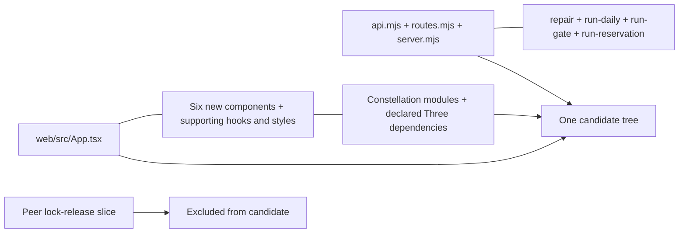
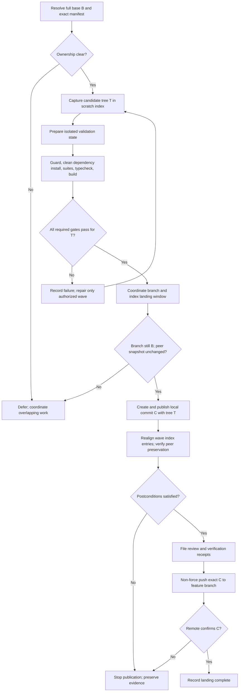
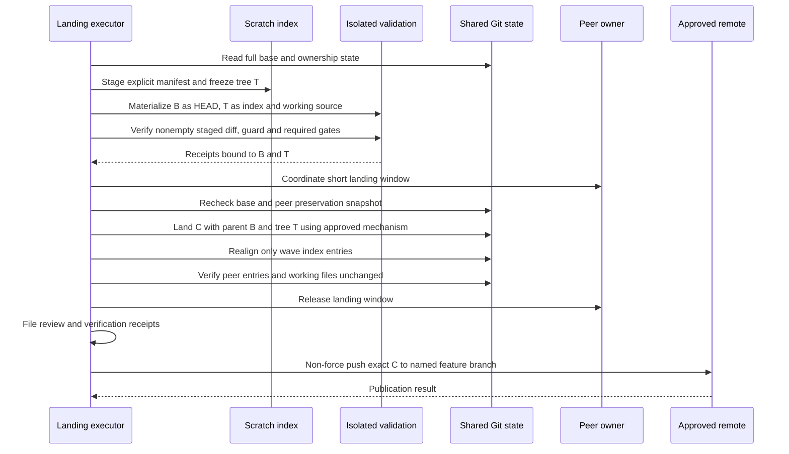
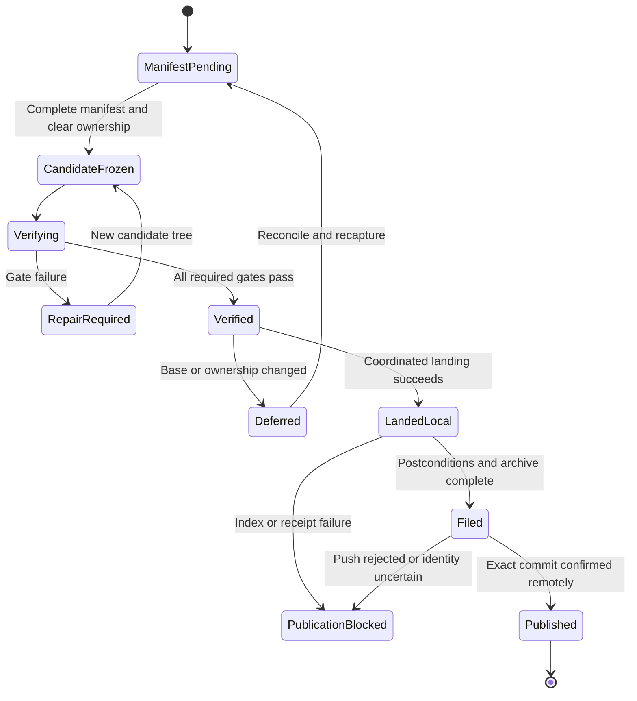

# Astra Reply — subscription transport — 2026-09-24T20:25:27.581Z

**Provider:** openai-codex
**Billing:** chatgpt-subscription
**Authentication:** chatgpt_subscription
**Transport:** codex-cli
**Requested model:** gpt-6-astra
**Served model:** NOT OBSERVABLE on codex-cli (see SERVED_MODEL_UNVERIFIABLE_NOTE)
**Reasoning effort:** xhigh
**Tokens:** in=39471 out=17861 reasoning=9543
**Packet:** `docs/ai-workflow/AI-HANDOFF/BLUEPRINT-creator-brains-console-ops-landing-2026-09-24/astra-packet-cut.md`
**Wall:** 543.9s
**Mega Blueprint:** ARMED (operator flag)

> Marginal cost $0 — this leg rides the ChatGPT subscription, not OpenRouter.

---
The packet supports landing the wave in one commit, with the benchmark included and Vite build required. The unresolved gates are the exact file manifest, verification from a clean checkout, and safe reconciliation of the shared index. The reported green results do not yet prove those boundaries.

A scratch index isolates staging, but advancing the shared branch can still make old index entries appear as staged reversions. The package now requires realigning only the wave’s index entries and verifying that the peer’s entries remain unchanged. I’ve also bounded the earlier green results as reported evidence; the packet does not include their exact commands or test names.

## PART A — HOSTILE REVIEW

**Decision: REVISE. Land one atomic commit, include `web/bench/frame-bench.mjs`, and require Vite build. Publication remains blocked until the exact candidate tree passes the gates below.**

Evidence references use line numbers within the supplied `astra-packet-cut.md` excerpt, starting with its title as line 1. `[VERIFIED]` means verified against that text, not against the repository. No files, commands, network services, or prior reviews were inspected. This review is **not filed** and does not satisfy the Rule 86 archive requirement.

**A1 — Existing blueprint review**

| ID | Severity | Finding and evidence | Concrete repair |
|---|---|---|---|
| A1-01 | High | **The composition is not executable yet.** [VERIFIED] The packet supplies approximate counts, abbreviated paths, and unnamed tests, adapters, hooks, styles, and a lockfile. That cannot serve as an explicit staging allowlist. `astra-packet-cut.md:19–27` | Produce a literal, exhaustive manifest of changed paths, Git modes, and candidate blob IDs. Include the complete wave, including its benchmark. Exclude the backup and every peer-slice change. Review each selected file’s diff for unrelated edits before freezing it. |
| A1-02 | High | **The reported green state does not establish fresh-checkout independence.** [VERIFIED] Tests included untracked files, the shared tree contains modified peer code, and C6 permits resolution through existing `node_modules`. [UNKNOWN] Whether the same results hold using only the proposed commit and dependencies installed from its committed manifests and locks. `astra-packet-cut.md:11–14,28–31,40` | Verify an isolated checkout containing exactly base plus wave. Install dependencies without borrowing the shared checkout’s `node_modules`. Keep all peer-slice paths at their base versions. Run the console, web, and engine suites there. Resolve missing dependencies by repairing the wave or coordinating a separately landed prerequisite; never include the peer slice silently. |
| A1-03 | High | **Scratch staging alone does not specify a safe shared-tree landing.** [VERIFIED] The plan requires a scratch index but does not define concurrent branch movement, source changes during staging, or real-index reconciliation after the branch advances. `astra-packet-cut.md:11–14,44–45` | Freeze candidate blob identities; coordinate a short landing window; require the branch still equals the pinned base. After advancing it, reconcile only the wave’s real-index entries. Verify the peer’s staged entries and working files remain unchanged. Never restore an old whole-index snapshot over current peer work. |
| A1-04 | Medium | **Neither intermediate commit is demonstrated safe.** [VERIFIED] The two-order claim rests on selected import relationships, without complete intermediate manifests or intermediate test evidence. `astra-packet-cut.md:37–40,45–47` | Choose one commit. Keep backend wiring with its libraries, and `App.tsx` with its components and supporting dependencies. Remove the need to prove two intermediate states. Do not infer backend/frontend compatibility beyond the supplied evidence. |
| A1-05 | Medium | **The publication gates are insufficiently specified.** [VERIFIED] Results are reported without exact suite commands, test inventories, candidate hashes, or the staged-guard launcher. The benchmark decision and Vite requirement remain open. `astra-packet-cut.md:28–30,44–47` | Bind receipts to one tree, recover the exact existing commands and test inventory during execution, require Vite build, and include the benchmark as versioned tooling. Benchmark inclusion does not establish a performance result. Reject any candidate that passes only because the guard examined an empty staged diff. |

**Claim adjudication**

| Claim | Adjudication |
|---|---|
| C1 — Wave green | [VERIFIED] The packet reports green results. [UNKNOWN] Reproduction against an isolated, immutable candidate. |
| C2 — Line limit | [VERIFIED] The packet reports only the lockfile exceeding 300 lines. [UNKNOWN] Compliance of the eventual staged blobs. |
| C3 — Peer independence | [VERIFIED] Zero references are reported. [UNKNOWN] Behavioral independence from modified peer code in the shared tree. |
| C4 — Backend wiring | [VERIFIED] The packet identifies a dependency between wiring and new libraries. [UNKNOWN] Its complete import graph and the stronger “unreachable” assertion. Preserve the identified pair. |
| C5 — UI wiring | [VERIFIED] The packet identifies `App.tsx` and six new components as a coupled change. [UNKNOWN] Full mounted behavior. Preserve the identified group. |
| C6 — Import closure | [VERIFIED] A staged-guard success is reported. [UNKNOWN] Closure using only committed source and reproducibly installed dependencies. |

Sources: `astra-packet-cut.md:28–40`.

**A2 — One review of the initial package draft**

The following is a retained, line-numbered excerpt of the initial **in-response draft**, named `A2-draft-excerpt.md` for citation. It is not a repository file.

```text
1  07-checkpoints.md: Run guard --staged in a checkout of candidate commit C.
2  04-build-order.md: Preserve the real index byte-for-byte after advancing the branch.
3  09-tests.md: Accept green reruns against the reported suite totals.
4  13-as-built.md: Implementation verified; landing pending.
```

| ID | Finding and evidence | Correction incorporated into Part B |
|---|---|---|
| A2-01 | [VERIFIED] Line 1 permits a vacuous guard run: checking out C normally leaves no staged candidate diff. `A2-draft-excerpt.md:1` | Run the staged guard with validation `HEAD = B`, index tree `= T`, and working source `= T`. Require the staged changed-path set to equal the manifest. |
| A2-02 | [VERIFIED] Line 2 would retain old wave entries in the real index after advancing the branch, potentially presenting them as staged reversions. `A2-draft-excerpt.md:2` | Preserve **peer entries**, while deliberately realigning only the wave’s entries to C during the coordinated landing window. |
| A2-03 | [VERIFIED] Line 3 does not establish that the intended tests were discovered; passing totals alone are inadequate. `A2-draft-excerpt.md:3` | Require exact commands, discovered test-file/case inventories, skip counts, and investigation of discrepancies. Add executable landing-invariant checks below. |
| A2-04 | [VERIFIED] Line 4 promotes reported implementation evidence into independent verification. `A2-draft-excerpt.md:4` | Record implementation as packet-reported, with isolated verification, landing, push, and archive filing explicitly unperformed. |

The self-review ran once. Its corrections are reflected below.

## PART B — FORGED PACKAGE

### 00-README.md

**Purpose:** land the existing creator-brains-console ops wave without incomplete imports, contamination from the peer slice, or disturbance of peer staging.

**Status:** `REVISE — execution readiness blocked by missing manifest and verification receipts`.

**Composition decision:** one commit on `creator-brains-engine-r2-20260915`.

**Proposed commit message:**

```text
feat(creator-brains-console): land ops controls and console UI
```

[VERIFIED] The packet identifies the branch and base prefix `89a9e3294`; their current state is unverified. Source: `astra-packet-cut.md:10`.

| Requirement | Acceptance criterion |
|---|---|
| R1 — Complete wave | Candidate changed paths equal the approved literal manifest, and staged modes/blob IDs match it. |
| R2 — Fresh-checkout closure | Guard, installation, and required suites pass using only the candidate source and declared, locked dependencies. |
| R3 — Peer preservation | Peer changes are absent from the candidate; their staged entries and working files remain unchanged through landing. |
| R4 — Evidence identity | Every gate receipt names the full base and candidate tree, command, environment, exit status, and applicable results. |
| R5 — Controlled publication | Published commit has the verified tree and expected parent; publication targets only the named feature branch, without force. |
| R6 — Honest completion | Rule 86 filing exists before completion is claimed; untested runtime and performance boundaries remain explicit. |

Scope includes landing composition, dependency closure, verification, shared-index handling, and publication receipts.

Scope excludes re-architecture, feature redesign, the peer lock-release slice, backup deletion, production deployment, and unrelated cleanup.

### 01-architecture.md

**Ownership and boundaries**

- The landing executor owns the candidate manifest, scratch index, isolated verification environment, and landing receipts.
- The peer retains ownership of the lock-release slice and modified `lock.mjs`.
- The shared working tree is input to candidate capture, not the verification environment.
- The candidate Git tree is the authoritative source snapshot for verification.
- Installed dependencies must derive from the candidate’s applicable manifests and lockfiles.

**Source relationships to preserve**

[VERIFIED] These relationships are asserted by the packet; their full implementation is not supplied. Sources: `astra-packet-cut.md:20–26,37–39`.



Edges express composition relationships, not verified runtime call direction.

**Landing flow**



**Landing sequence**



This is an operational sequence, not an application API sequence.



Per-screen flows, application API sequence diagrams, database ER diagrams, and product state machines: **N/A — scope-bounded consult, no repository surface in scope.** Routes, API contracts, schemas, and screen behavior are not supplied. No columns, endpoints, or UI states are invented.

Rendered diagram validation: **NOT RUN**; literal Mermaid source is supplied.

### 02-wireframes.md

**N/A — scope-bounded consult, no repository surface in scope.**

The packet names components but supplies no existing wireframes, layouts, copy, palette tokens, or interaction states. Desktop and 375px mobile wireframes cannot be reconstructed honestly.

This landing introduces no design decisions. Preserve the existing wave’s UI. This package does not certify responsive layout, accessibility, keyboard behavior, or screen-state completeness.

### 03-contracts.md

**Identity contract**

| Symbol | Definition |
|---|---|
| `B` | Full Git object ID resolving the approved base, initially reported as prefix `89a9e3294`. |
| `T` | Immutable candidate tree containing base plus the approved wave. |
| `C` | Landing commit whose sole parent is B and whose tree is T. |
| `M` | Exhaustive literal manifest of paths changed from B to T, including each staged mode and blob ID. |
| `P` | Preservation receipt for peer staged entries and peer working files. |

**Manifest contract**

`landing-manifest.json` is a verification attachment outside the candidate checkout and outside the wave:

```typescript
type LandingManifest = {
  base: string; // Full Git object ID.
  tree: string; // Full Git tree object ID.
  entries: Array<{
    path: string; // Literal repository-relative path.
    mode: string; // Exact Git index mode.
    oid: string;  // Exact candidate blob object ID.
  }>;
};
```

Requirements:

- Every entry is under `packages/creator-brains-console/`.
- Entries are unique.
- Every changed path is present; unchanged paths are absent.
- No `.e5-backup` entry is permitted.
- No deletion is authorized by this package; the packet describes additions and modifications.
- The benchmark is included.
- All changes within selected files belong to this wave.
- A newly discovered cross-package prerequisite blocks this manifest until separately resolved.

**Peer-preservation contract**

Capture exact index tuples—path, mode, object ID, stage—and working-file identity for the peer slice, including its unnamed tests once resolved. Preserve their content; do not publish private source contents into receipts.

After landing, the wave’s shared-index entries must match C. Peer entries must match P. Whole-index byte equality is not a postcondition.

**Dependency contract**

Installation uses only committed manifests and applicable lockfiles from T. No copied shared `node_modules`, untracked module, backup, undeclared local link, or peer working-file override may satisfy resolution.

Application request/response and persistence contracts: **N/A — scope-bounded consult, no repository surface in scope.**

### 04-build-order.md

1. **Resolve inputs.** Expand the base to its full object ID; resolve the exact wave paths, peer exclusions, test commands, guard launcher, package-manager commands, and existing commit mechanism.
2. **Check ownership.** Review selected diffs. Any overlap with peer-owned content blocks capture until coordinated.
3. **Capture the candidate.** Use a scratch index initialized from B. Stage only literal manifest paths. Record their modes and blob IDs; freeze T.
4. **Prepare isolated verification.** Use an independent disposable checkout, not a shared-tree validation or a new linked worktree. Set its HEAD to B and its index and working source to T.
5. **Verify the source snapshot.** Run the supplied landing-invariant tests before dependency installation or generated build output exists.
6. **Run required gates.** Run the staged guard on the actual B→T diff, locked dependency installation, console tests, web tests, typecheck, Vite build, engine tests, and line-limit checks.
7. **Record evidence.** Bind all results to B and T. Any source or dependency-input change requires a new T and fresh applicable gates.
8. **Coordinate landing.** Suspend competing branch/index mutations for the short landing interval. Recheck B, ownership, and P.
9. **Create and land C.** Use the existing approved scratch-index commit mechanism, preserving mandatory hooks. Require parent B and tree T. Concurrent reference movement must cause rejection or a stop, never an overwrite.
10. **Reconcile the shared index.** Update only M’s entries to C, using an index-only operation. Preserve working files. Verify peer entries and files against P.
11. **File receipts and review.** Complete Rule 86 filing before publication is treated as approved.
12. **Push exact C.** Use the existing approved remote and named feature branch, without force. Record the remote result.

The packet does not identify a commit mechanism that proves step 9. Selecting an existing conforming mechanism is delegated; inventing a hook-bypassing plumbing shortcut is not.

If anything fails after local landing, stop before pushing. Preserve C and current shared state. Do not reset or restore the shared tree automatically.

### 05-slices.md

These are execution stages, **not separate product commits**.

| Slice | Deliverable | Entry | Exit |
|---|---|---|---|
| S0 — Composition | Exact M, B, peer exclusions, command registry | Packet | No unresolved path or ownership ambiguity |
| S1 — Candidate | T and isolated source snapshot | S0 complete | Landing-invariant checks pass |
| S2 — Verification | Candidate-bound gate receipts | Frozen T | Every required gate passes |
| S3 — Local landing | C and peer-preservation receipt | Verified T; coordinated window | Parent/tree correct; wave index aligned; peer unchanged |
| S4 — Publication | Filed review and remote receipt | S3 complete | Exact C confirmed on feature branch |

**Single-commit membership**

Include the wave’s:

- Backend wiring, new libraries, modified and new tests, and fixture.
- `App.tsx`, all six components, constellation modules, hooks, styles, utilities, adapters, and their tests.
- `web/package.json` and its applicable lockfile changes.
- `web/bench/frame-bench.mjs`.

Exclude the backup twin and all peer-slice changes.

[UNKNOWN] The literal membership cannot be completed from the abbreviated inventory. S0 remains blocked; the category list is not a staging command. Source: `astra-packet-cut.md:19–27`.

### 06-bans.md

- No `git add -A`, directory-wide staging, glob-derived wave membership, or whole-index restoration.
- No inclusion, modification, unstaging, or deletion of peer-slice work.
- No backup inclusion or deletion.
- No split backend/frontend landing for this wave.
- No dependence on untracked source, shared dependencies, or modified peer code during validation.
- No empty-diff staged-guard success accepted as evidence.
- No staged candidate mutation after verification without invalidating affected receipts.
- No commit-hook bypass or uncoordinated branch advancement.
- No force push, main-branch push, production deployment, or automatic shared-tree rollback.
- No unrelated refactor or repair hidden inside the landing.
- No claim that benchmark inclusion, Vite success, or test counts establish performance or complete runtime behavior.
- No repository or network exploration during this consult.

### 07-checkpoints.md

| Gate | Required evidence | Failure action |
|---|---|---|
| G0 — Identity and ownership | Full B, exact branch, complete M, resolved peer exclusions, ownership clearance | Stop before capture |
| G1 — Snapshot identity | HEAD=B, index=T, working source=T, changed paths exactly M | Recapture; do not reuse stale receipts |
| G2 — Closure | Guard examines B→T; dependencies install from committed inputs in isolation | Repair missing source/declaration within scope or defer prerequisite |
| G3 — Correctness | Exact commands and inventories for console, web, and engine suites; no failures | Diagnose against T; preserve failure evidence |
| G4 — Static/build | Typecheck, Vite build, line limit all pass | Repair and regenerate T as needed |
| G5 — Local landing | C parent=B, C tree=T, coordinated mutation, wave index aligned, peer P preserved | Stop before remote publication |
| G6 — Archive/publication | Filed review, complete receipts, non-force push of exact C, remote confirmation | Remain incomplete; no force retry |

Vite build is mandatory.

The ≤300-line gate applies to all non-exempt wave files, including the benchmark and tests. Only identified generated lockfiles receive the packet’s exemption.

The benchmark’s execution is **not** a landing gate: no invocation, workload, performance budget, or expected output is supplied. Its correctness obligations as included source still apply. No performance certification is granted.

### 08-decision-ledger.md

| Decision | Resolution | Reason |
|---|---|---|
| D1 — Commit count | One | Avoid unsupported intermediate-state claims |
| D2 — Backend/UI order | No separate order; atomic publication | Keep identified dependency groups together |
| D3 — Benchmark | Include | Preserve the reported wave boundary rather than create another unproven exclusion |
| D4 — Vite | Required | Production bundling is a separate required check |
| D5 — Verification source | Isolated T | Shared-tree green is insufficient for fresh-checkout evidence |
| D6 — Guard comparison | B→T staged diff | Prevent vacuous validation |
| D7 — Peer slice | Exclude entirely | Explicit scope boundary |
| D8 — Real index | Realign wave entries; preserve peer entries | Avoid staged reversions and peer overwrite |
| D9 — Changed base | Defer and reconcile | Prior evidence does not automatically apply to a different parent |
| D10 — Push | Exact C, feature branch, non-force | Prevent publishing later unrelated branch movement |
| D11 — Review filing | Before publication approval/completion | Unfiled review is not an archive receipt |
| D12 — Recovery | Preserve state; coordinate repair or revert | Shared state cannot be safely rewound blindly |

### 09-tests.md

**Existing feature-test inventory and exact repository commands: N/A — scope-bounded consult, no repository surface in scope.**

The packet provides tool names and results, but not enough information to name the existing test files/cases or reconstruct all launchers, flags, working directories, and environment requirements. Those must be recovered by the subsequent executor. No feature test is invented here.

The following **new, fully supplied landing verification file** is an external receipt attachment, not an addition to the product wave. Save it as `landing-git-invariants.test.mjs` outside the isolated checkout.

```javascript
import test from 'node:test';
import assert from 'node:assert/strict';
import { readFileSync } from 'node:fs';
import { execFileSync } from 'node:child_process';

const manifestPath = process.env.LANDING_MANIFEST;
assert.ok(manifestPath, 'LANDING_MANIFEST must identify the receipt manifest');

const manifest = JSON.parse(readFileSync(manifestPath, 'utf8'));
const fullOid = /^(?:[0-9a-f]{40}|[0-9a-f]{64})$/;
const prefix = 'packages/creator-brains-console/';

assert.match(manifest.base, fullOid);
assert.match(manifest.tree, fullOid);
assert.ok(Array.isArray(manifest.entries));
assert.ok(manifest.entries.length > 0);

for (const entry of manifest.entries) {
  assert.equal(typeof entry.path, 'string');
  assert.ok(entry.path.startsWith(prefix));
  assert.ok(!/[\u0000-\u001f\\]/.test(entry.path));
  assert.ok(!entry.path.split('/').some(p => p === '..' || p === '.'));
  assert.ok(!entry.path.endsWith('.e5-backup'));
  assert.match(entry.mode, /^[0-7]{6}$/);
  assert.match(entry.oid, fullOid);
}

const expectedPaths = manifest.entries.map(entry => entry.path).sort();
assert.equal(new Set(expectedPaths).size, expectedPaths.length);

function git(...args) {
  return execFileSync('git', ['--literal-pathspecs', ...args], {
    encoding: 'utf8',
    maxBuffer: 32 * 1024 * 1024,
  });
}

function records(output) {
  return output.split('\0').filter(Boolean);
}

test('L01: validation HEAD equals the pinned base', () => {
  assert.equal(git('rev-parse', 'HEAD').trim(), manifest.base);
});

test('L02: validation index equals the candidate tree', () => {
  git('diff', '--cached', '--exit-code', manifest.tree, '--');
});

test('L03: staged changed paths exactly equal the manifest', () => {
  const actual = records(git(
    'diff', '--cached', '--name-only', '--no-renames',
    '-z', manifest.base, '--'
  )).sort();
  assert.deepEqual(actual, expectedPaths);
});

test('L04: staged modes and blobs equal the manifest', () => {
  for (const entry of manifest.entries) {
    const actual = records(git('ls-files', '--stage', '-z', '--', entry.path));
    assert.deepEqual(actual, [
      `${entry.mode} ${entry.oid} 0\t${entry.path}`,
    ]);
  }
});

test('L05: working source equals the index without extra files', () => {
  git('diff', '--exit-code', '--');
  assert.deepEqual(records(git(
    'ls-files', '--others', '--exclude-standard', '-z'
  )), []);
  assert.deepEqual(records(git(
    'ls-files', '--others', '--ignored', '--exclude-standard', '-z'
  )), []);
});

test('L06: the decided benchmark is included', () => {
  assert.ok(expectedPaths.includes(
    `${prefix}web/bench/frame-bench.mjs`
  ));
});
```

**Exact invocation**

Run from the isolated checkout’s repository root, **before installing dependencies or generating build output**. Bind `LANDING_RECEIPTS` to the external receipt directory and `LANDING_MANIFEST` to its manifest.

```powershell
node --test "$env:LANDING_RECEIPTS/landing-git-invariants.test.mjs"
```

This invocation tests source-snapshot identity and manifest application. It does not prove the manifest’s product completeness, functional correctness, dependency closure, peer preservation, or publication safety.

**Required repository verification matrix**

| Test ID | Required case or suite | What it must prove | Current command status |
|---|---|---|---|
| L07 | Existing staged dependency guard | Actual B→T staged changes satisfy the existing guard | Exact launcher absent |
| L08 | Locked dependency installation | Candidate dependencies can be constructed without shared artifacts | Package-manager invocation absent |
| L09 | Console suite | Existing console behaviors pass with peer files at B | `node --test` reported; complete command/inventory absent |
| L10 | Web suite | Existing web tests execute and pass against T | Vitest reported; command/inventory absent |
| L11 | Web typecheck | Candidate source satisfies the configured typecheck | Exact command absent |
| L12 | Web production build | Candidate produces the configured Vite build | Exact command absent |
| L13 | Engine suite | Candidate coexists with committed engine code | Command/inventory absent |
| L14 | Line-limit check | Staged non-exempt files satisfy ≤300 lines | Existing counting command absent |
| L15 | Peer preservation | Peer staged tuples and working-file identities remain unchanged | Capture/comparison procedure required |
| L16 | Commit/publication identity | Parent, tree, branch, and remote commit match the receipt | Execute after local landing/publication |

[VERIFIED] Reported comparison points are console `354/354`, web `174/174`, engine `233/0`, and successful typecheck/build/guard. Source: `astra-packet-cut.md:28–30`.

Treat those totals as reconciliation points, not sufficient assertions. Explain changed discovery, skips, cancellations, or counts. Record what `233/0` denotes rather than inventing a result schema.

**Execution status:** all tests in this refreshed package are `NOT RUN`.

### 10-delegated-bounds.md

| Delegated choice | Allowed bounds | Stop condition |
|---|---|---|
| Literal manifest completion | Resolve existing wave paths and reviewed blobs only | Ambiguous ownership, unrelated edits, or cross-package prerequisite |
| Existing command recovery | Use the actual project scripts and required environment | Missing command, unsafe side effects, or inability to isolate resources |
| Temporary locations | External receipts and independent disposable checkout | Collision with shared files or dependency borrowing |
| Commit mechanism | Existing supported scratch-index workflow preserving hooks and branch/index coordination | No mechanism satisfying the stated invariants |
| Line-count implementation | Existing project convention, applied to candidate blobs; documented generated-lockfile exemption | Ambiguous exemption or inconsistent counting |
| Gate repair | Minimal repair within the wave; regenerate T and affected evidence | Architecture change, peer edit, or expanded product scope |
| Remote resolution | Existing approved remote for the named feature branch | Unclear target or non-fast-forward rejection |

Do not delegate commit count, benchmark membership, Vite requirement, peer inclusion, force-push permission, or performance acceptance. Those decisions are settled above.

### 11-registries.md

**Artifact registry**

| Artifact | Authority |
|---|---|
| `landing-manifest.json` | Exact changed paths, modes, blobs, B and T |
| `landing-git-invariants.test.mjs` | Supplied executable source-snapshot checks |
| Command registry | Exact command, working directory, tool versions, safe environment, test inventory |
| Gate receipts | Result, exit code, counts, skips, B/T identity, log reference |
| Peer-preservation receipt | Before/after staged tuples and working-file identities |
| Commit receipt | Full C, parent B, tree T, branch |
| Publication receipt | Approved target, exact C, push result, remote confirmation |
| Rule 86 receipt | Filed review identity and location |

**Composition registry**

The only complete package-root paths explicitly recoverable from the packet include:

- `packages/creator-brains-console/api.mjs`
- `packages/creator-brains-console/routes.mjs`
- `packages/creator-brains-console/server.mjs`
- `packages/creator-brains-console/lib/repair.mjs`
- `packages/creator-brains-console/lib/run-daily.mjs`
- `packages/creator-brains-console/lib/run-gate.mjs`
- `packages/creator-brains-console/lib/run-reservation.mjs`
- `packages/creator-brains-console/web/src/App.tsx`
- `packages/creator-brains-console/web/package.json`
- `packages/creator-brains-console/web/bench/frame-bench.mjs`

This is a **partial locator registry**, not M. The remaining exact paths must not be guessed.

Source: `astra-packet-cut.md:19–27`.

### 12-orphan-disposition.md

| Item | Disposition |
|---|---|
| `constellation-three.ts.e5-backup` | Exclude; leave untouched. Exact location is not supplied. |
| Peer lock-release module, two tests, modified `lock.mjs` | Preserve under peer ownership; exclude all changes. They are not orphan candidates. |
| `web/bench/frame-bench.mjs` | Include as versioned wave tooling; no performance result implied. |
| Other untracked wave files | Resolve into M where necessary for the approved wave. Untracked status alone is not a deletion or exclusion criterion. |
| Other repository files | Outside scope; no disposition decision. |

No file move or deletion is authorized.

### 13-as-built.md

| Boundary | Status |
|---|---|
| Existing wave implementation | [VERIFIED] Reported as built in the packet; source not inspected |
| Shared-tree test results | [VERIFIED] Reported green; not independently reproduced |
| Exact manifest | [UNKNOWN] Not supplied |
| Full current base and branch state | [UNKNOWN] Only packet snapshot supplied |
| Isolated candidate verification | NOT RUN |
| Landing-invariant tests supplied above | AUTHORED IN RESPONSE; NOT RUN |
| Candidate commit | NOT CREATED |
| Shared-index reconciliation | NOT PERFORMED |
| Peer-preservation proof | NOT PRODUCED |
| Remote publication | NOT PERFORMED |
| Rule 86 filing | NOT FILED |
| Application runtime, UI responsiveness, performance | NOT VERIFIED |

No implementation, landing, or deployment completion is claimed.

### 14-verification.md

**Current verdict:** `DEFECTS-FOUND` in the landing plan.

This is a packet-only advisory verdict. It is not an independently verified code verdict or a filed final review.

| Requirement | Governing artifacts | Verification | Current state |
|---|---|---|---|
| R1 | 03, 05, 11 | L02–L04, L06; manifest content review | BLOCKED: M absent |
| R2 | 01, 03, 07 | L05, L07–L13 | NOT RUN |
| R3 | 03, 04, 06 | L15; candidate diff review | NOT RUN |
| R4 | 07, 09, 11 | Candidate-bound receipts and inventories | BLOCKED: exact commands absent |
| R5 | 04, 07, 08 | L16 | NOT RUN |
| R6 | 07, 11, 13 | Archive receipt and truthful final status | NOT FILED |

**A1 finding closure**

- A1-01: manifest contract defined; actual manifest pending.
- A1-02: isolated verification required; execution pending.
- A1-03: shared-index and concurrency requirements defined; mechanism and receipts pending.
- A1-04: resolved in this package by the one-commit decision.
- A1-05: benchmark and Vite decisions resolved; exact commands and gate evidence pending.

**A2 correction closure**

- A2-01: nonempty B→T staged validation is explicit.
- A2-02: peer preservation replaces incorrect whole-index immutability.
- A2-03: inventory-bound receipts replace count-only acceptance.
- A2-04: reported implementation is separated from independent verification.

**Readiness:** `NOT READY TO PUBLISH`.

**Next authorized work:** S0, resolving the exact manifest and executable command registry within the established landing scope.

## PART C — DECISION-DENSITY SELF-TEST

| Choice a builder would otherwise face | Resolution |
|---|---|
| One commit or two? | **Decided:** one. |
| Backend or frontend first? | **Decided:** no intermediate publication. |
| Include backend wiring and libraries together? | **Decided:** yes. |
| Include `App.tsx` and component dependencies together? | **Decided:** yes. |
| Include benchmark? | **Decided:** yes. |
| Require benchmark execution or a performance threshold? | **Decided:** neither established here; no performance claim. |
| Require Vite build? | **Decided:** yes. |
| Which exact paths and blobs? | **Bounded delegation:** resolve complete M from the existing wave; ambiguity blocks. |
| Which lockfile and installation command? | **Bounded delegation:** recover existing committed dependency contracts; do not guess. |
| What is the authoritative base? | **Bounded delegation:** resolve and verify full B; changed base requires reconciliation. |
| Where do gates run? | **Decided:** independent checkout of T with HEAD B for staged validation. |
| Can shared dependencies or peer modifications help tests pass? | **Decided:** no. |
| Which tests and flags? | **Bounded delegation:** recover exact existing commands and inventories. |
| Are aggregate pass counts sufficient? | **Decided:** no. |
| Can the staged guard run on a clean checkout of C? | **Decided:** no; require the B→T staged diff. |
| How is peer work preserved? | **Decided:** preserve peer tuples/files; realign only wave index entries. |
| Which commit mechanism? | **Bounded delegation:** existing mechanism satisfying hooks, identity, and coordination requirements; otherwise block. |
| What if a peer moves the branch? | **Decided:** stop and reconcile; no automatic overwrite. |
| What if hooks change the candidate? | **Decided:** invalidate affected verification; no publication of an unverified tree. |
| What repairs are allowed? | **Bounded delegation:** minimal wave repairs only, with fresh candidate evidence. |
| What happens to the backup? | **Decided:** exclude and leave untouched. |
| Where may the commit be pushed? | **Decided:** approved remote’s named feature branch, exact C, non-force. |
| What happens after a publication rejection? | **Decided:** preserve state and investigate; no force retry. |
| How is rollback handled? | **Decided:** coordinated follow-up repair or revert; no automatic shared-tree reset. |
| Must application schemas or wireframes be reconstructed? | **Decided:** no; unavailable surfaces explicitly N/A. |
| Has the hostile review been archived? | **Decided status:** no; filing remains required. |
| Can readiness be claimed now? | **Decided:** no. |

**No unresolved choice is silently delegated. The remaining blockers are the literal manifest, exact command inventory, a conforming landing mechanism, and execution receipts.**
