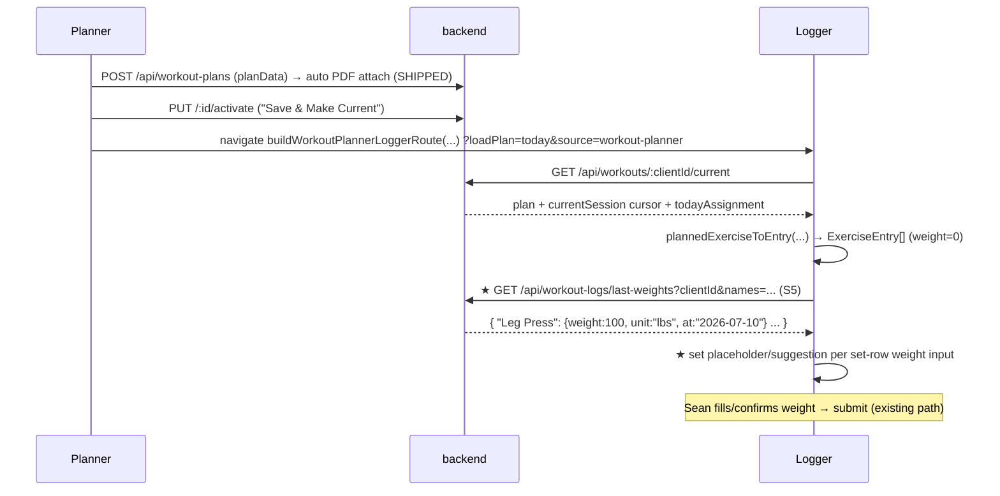

# 01 — Architecture

## The one paragraph
Dictated text in ANY surface flows into the ONE existing Swan Coach command lane
(`POST /api/ai-command/execute`). For state that lives in the browser (the open Workout Planner or
Workout Logger form), the backend does not write anything — it returns a `frontend_dispatch`
response naming a browser CustomEvent + payload; `useCoachCommand` dispatches it; a surface hook
catches it and mutates React state through the surface's EXISTING setters. This package adds a
**planner event family** (mirroring the 5 live logger events), a **Coach dock inside the planner**,
a **mic in the logger**, and a **last-weight suggestion** read model. No new chat lane, no new
socket, no schema changes.

## Component tree (new nodes marked ★)
```
WorkoutPlannerPage (orchestration, 300-line cap — minimal edits)
├── useWorkoutPlannerRolodexState        (owns swapTarget/beginSwap/applyHorizonSwap wiring)
├── ★ useWorkoutPlannerAiEvents          (listens AI_PLANNER_* events → existing setters)
├── ★ useWorkoutPlannerCoachDock         (dock open state, dictation glue, command submit)
└── WorkoutPlannerPageLayout
    ├── WorkoutPlannerCommandPanel (left)
    ├── WorkoutPlannerRolodexPanel (middle)
    ├── WorkoutPlannerBuilderPanel (right)
    └── ★ WorkoutPlannerCoachDock  (collapsible bottom dock, Coach tab)
        ├── reuses CoachConsoleDock textarea/mic pattern (do NOT import CoachConsoleDock itself
        │   — it is Command-Center-shaped; build the slim dock in 02/04 from the same hooks)
        ├── useCoachBrowserSpeechInput (dictation)
        └── VoiceRecordingOverlay (recorder fallback)

WorkoutLogger (854-line shell + 3 extracted hooks — minimal edits)
├── useWorkoutPlanLoading   (existing — plan auto-load; UNTOUCHED except S6 test)
├── useWorkoutAiEvents      (existing — AI_* listeners; UNTOUCHED)
├── ★ useWorkoutLoggerDictation (mic state + command submit with logger context)
└── ★ LoggerMicButton (in the logger action bar; opens dictation, streams to command lane)
```

## Flow 1 — dictated planner edit (the core loop)
```mermaid
flowchart LR
  A[Sean taps mic in Planner Coach dock] --> B[useCoachBrowserSpeechInput\nfinals stream into dockText]
  B --> C[Send → POST /api/ai-command/execute\nbody: command text + plannerContext]
  C --> D{intent parser matches\nplanner command?}
  D -- yes --> E[command method = FRONTEND_DISPATCH\n→ response type: frontend_dispatch\nevent: AI_PLANNER_*  payload: params]
  D -- no --> F[fallback_to_chat → useAIChat lane\n(dock renders reply text)]
  E --> G[useCoachCommand dispatches\nCustomEvent AI_PLANNER_*]
  G --> H[useWorkoutPlannerAiEvents handler\n→ setPlanExercises / setGeneratedPlan\nvia EXISTING helpers incl. applyHorizonSwap]
  H --> I[acknowledgeAIWorkoutEvent(e, handled)\n→ honest receipt in dock:\n'Swapped Leg Press → Goblet Squat (Day 2)']
```

## Flow 2 — plan → logger → weights (sync path, mostly existing)


## Flow 3 — dictated logger set update (commands already live)
`"leg press set two ninety pounds eleven reps"` → command lane parses `update_set_data`
→ `frontend_dispatch { event:'AI_UPDATE_SET', payload:{exerciseName:'Leg Press', setNumber:2,
weight:90, reps:11} }` → existing `useWorkoutAiEvents.onUpdateSet` applies it. **S4 builds only
the mic + submit glue in the logger; the event plumbing is untouched.**

## Proven pattern excerpts (verbatim from repo @ de31a5b91)
`backend/services/ai/commandExecutor.mjs:529` — server never executes FRONTEND_DISPATCH:
```js
if (ctx.command.method === 'FRONTEND_DISPATCH') {
  ctx.result = { type: 'not_wired',
    message: `${ctx.command.type.replace(/_/g, ' ')} is handled client-side and does not require server confirmation.` };
  return ctx;
}
```
`backend/routes/aiCommandRoutes.mjs:209` — relabels to frontend_dispatch for the client:
```js
if (ctx.result?.type === 'not_wired') {
  if (ctx.command?.method === 'FRONTEND_DISPATCH' && !ctx.command?.requiresConfirmation) {
    return res.json({ success: true, type: 'frontend_dispatch',
      command: ctx.command.type,
      event: ctx.command.frontendEvent || ctx.command.endpoint,
      payload: ctx.intent?.params || {}, ...
```
`frontend/src/hooks/useCoachCommand.ts:128,175` — the client dispatches the browser event via
`dispatchAIWorkoutEvent(event, payload)` (`utils/aiWorkoutEvents.ts`), and
`frontendDispatchReceipt` reports honestly when no surface was open.

Planner state mutation helpers that ALREADY exist and MUST be reused (do not re-implement):
- single-day rows: `setPlanExercises` mapping (see `useWorkoutPlannerPageActions.ts`
  `updateExercise`/`removeExercise`; rolodex `addExercise` for append/swap).
- generated multi-week plans: `applyHorizonSwap` / `removeHorizonExercise` /
  `isDuplicateInHorizonDay` in
  `frontend/src/components/DashBoard/Pages/admin-workout-planner/workoutPlannerHorizonSwap.helpers.ts`.

## Privacy (Rule 8)
Dictated text goes to the SAME command/chat lanes already in production; those lanes are the
approved LLM boundary. Planner context sent with a command is IDs + structural state only
(`clientId`, day/week numbers, exercise names) — never health notes, never client names beyond
what the existing lane already sends.
