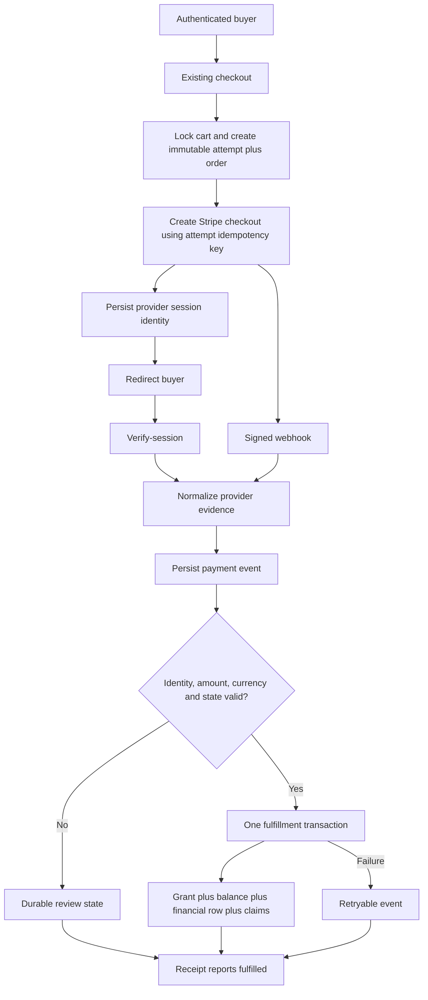
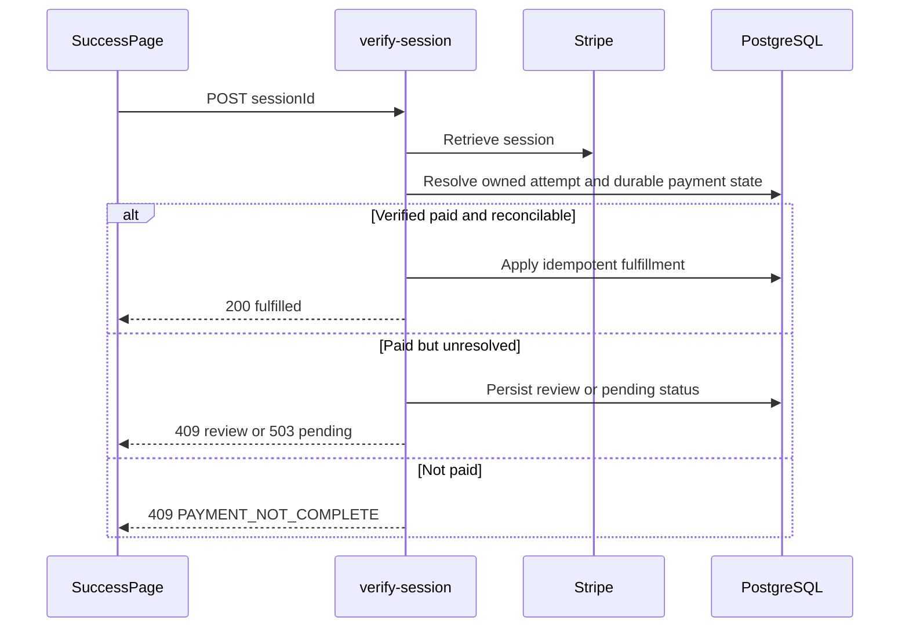
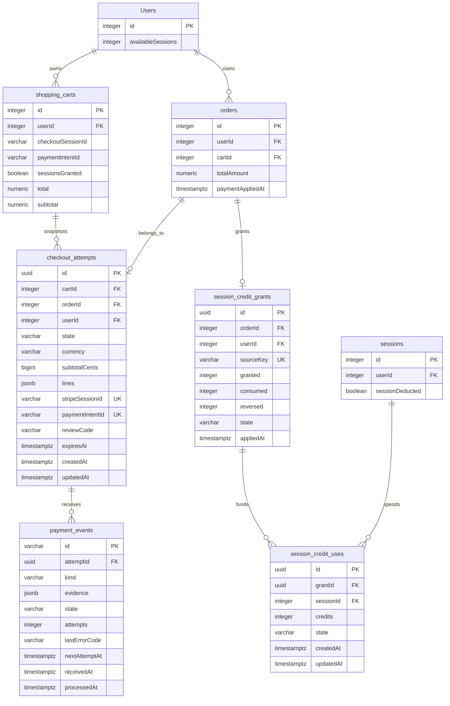
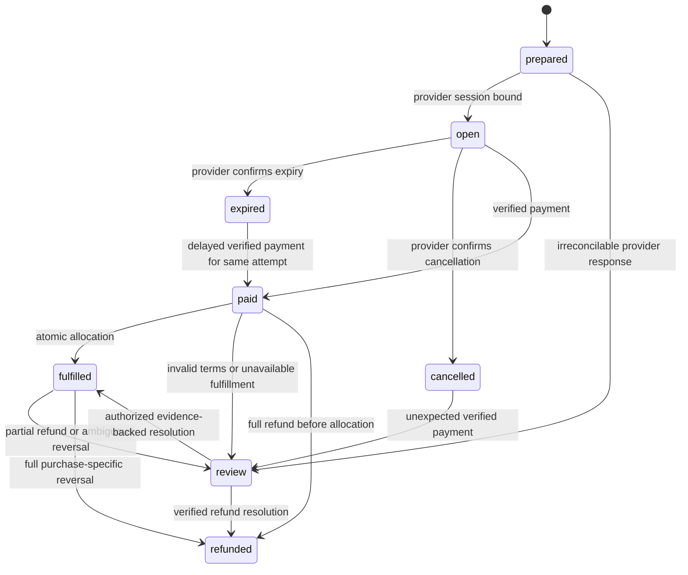
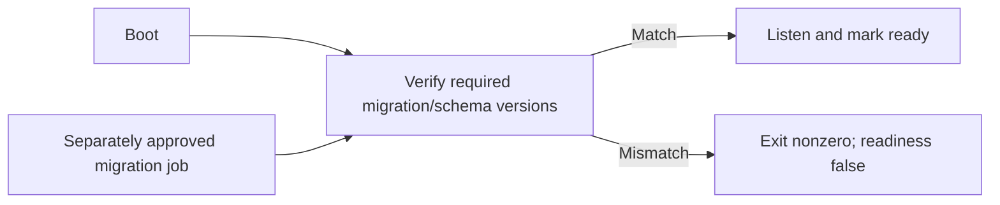

**Architecture**

Keep the current Express/Sequelize and React stack. Add a small purchase snapshot and credit-provenance boundary, then make existing entry points delegate to it. Do not introduce another commerce platform or replace the scheduling system.

**Ownership**

- Existing first-mounted workout controller owns common session CRUD.
- `assertAssignmentOrAdmin` owns active-assignment authorization.
- Checkout preparation owns immutable purchased terms.
- Payment-event ingestion owns signature verification, normalization, and durable receipt.
- Purchase fulfillment owns grant, balance, inventory, accounting, and allocation claim.
- Refund reconciliation owns purchase-specific reversal.
- Frontend receipt views render backend state; they do not infer fulfillment from payment alone.

**Rendered surfaces**

```text
main-routes.tsx
├─ /checkout → ProtectedRoute → CheckoutView
├─ /checkout/success → SuccessPage
│  ├─ existing receipt/details components
│  └─ SuccessPage.stateViews
└─ /waiver → PublicWaiverPage.V3
   └─ V2 fallback retains the same submission-state contract
```

**User/data flow**



**Checkout creation interaction**

```mermaid
sequenceDiagram
    participant UI as CheckoutView
    participant API as create-checkout-session
    participant DB as PostgreSQL
    participant SP as Stripe
    UI->>API: POST cartId and fulfillmentIntent
    API->>DB: Lock cart; validate; snapshot; create pending order/attempt
    DB-->>API: attemptId
    API->>SP: Create session; idempotencyKey=attemptId
    alt Response received
        SP-->>API: sessionId and URL
        API->>DB: Conditional bind of sessionId to attempt
        API-->>UI: Checkout URL
    else Timeout or response lost
        API->>DB: Keep prepared attempt recoverable
        API-->>UI: 503 CHECKOUT_PREPARING
        UI->>API: Retry same cart
        API->>SP: Retry same attempt key and parameters
    end
```

**Cart mutation interactions**

```mermaid
sequenceDiagram
    participant UI as Cart
    participant API as Cart mutation routes
    participant DB as PostgreSQL
    UI->>API: POST add / PUT update / DELETE remove or clear
    API->>DB: Lock owning cart in transaction
    alt Active prepared/open attempt
        API-->>UI: 409 CART_CHECKOUT_LOCKED
    else Editable cart
        API->>DB: Validate ownership; mutate rows; update totals
        DB-->>API: Commit
        API-->>UI: Existing success envelope
    end
```

**Payment verification interaction**



**Webhook and refund interactions**

```mermaid
sequenceDiagram
    participant SP as Stripe
    participant API as Both webhook aliases
    participant DB as PostgreSQL
    SP->>API: Signed completion, expiry, failure or refund event
    API->>API: Verify raw-body signature; normalize allowlisted fields
    API->>DB: Insert unique provider event
    alt Duplicate applied event
        API-->>SP: 200
    else Valid event
        API->>DB: Lock purchase; apply transition and effects
        alt Commit succeeds
            API-->>SP: 200
        else Transient persistence failure
            API-->>SP: 500
        end
    else Permanent mismatch
        API->>DB: Persist review reason
        API-->>SP: 200 only after review receipt commits
    end
```

**Manual payment interaction**

```mermaid
sequenceDiagram
    participant A as Admin
    participant API as apply-payment
    participant DB as PostgreSQL
    A->>API: POST orderId, method, reference, notes
    API->>API: Require admin; validate manual method and reference
    API->>DB: Create/reuse unique manual-payment evidence
    API->>DB: Apply shared fulfillment transaction
    alt Complete
        API-->>A: 200 fulfilled
    else Incomplete
        API-->>A: 503 ALLOCATION_PENDING
    end
```

**Private-media interaction**

```mermaid
sequenceDiagram
    participant UI as Existing media consumer
    participant API as Protected media stream
    participant DB as Ownership/assignment records
    participant S as Private object storage
    UI->>API: Authenticated request for opaque media identity
    API->>DB: Resolve owner and current access
    alt Allowed
        API->>S: Fetch bytes privately
        API-->>UI: Stream; Cache-Control private,no-store
    else Denied or unknown
        API-->>UI: 404
    end
```

**Waiver and AI interactions**

```mermaid
sequenceDiagram
    participant U as Existing intake UI
    participant API as Waiver or onboarding API
    participant DB as PostgreSQL
    participant AI as Provider boundary
    U->>API: Submit intake
    alt Anonymous waiver
        API->>DB: Save unlinked submission
        API-->>U: Received; account verification pending
    else Authenticated self waiver
        API->>DB: Verify version/signature and bind authenticated identity
        API-->>U: Recorded
    else New-client identity capture
        API->>DB: Authorized local form save
        API-->>U: Local draft/result
        Note over API,AI: No identity-bearing provider request
    end
```

**Proposed schema**

This ERD is an exact projection of touched existing columns plus proposed tables. It is **not a claim about deployed schema**. PostgreSQL `timestamptz` corresponds to Sequelize `DATE`; mixed-case columns remain quoted.



**Attempt state machine**



**Startup flow**



Out of scope: marketing redesign, new subscription tiers, new AI providers, a new admin dashboard, and autonomous production repair.
