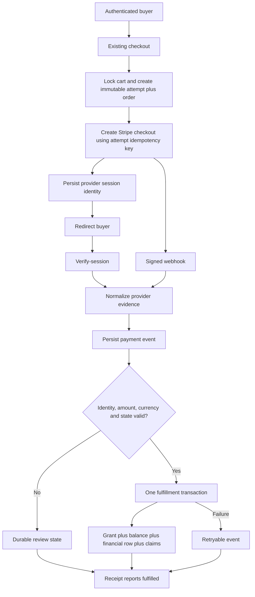
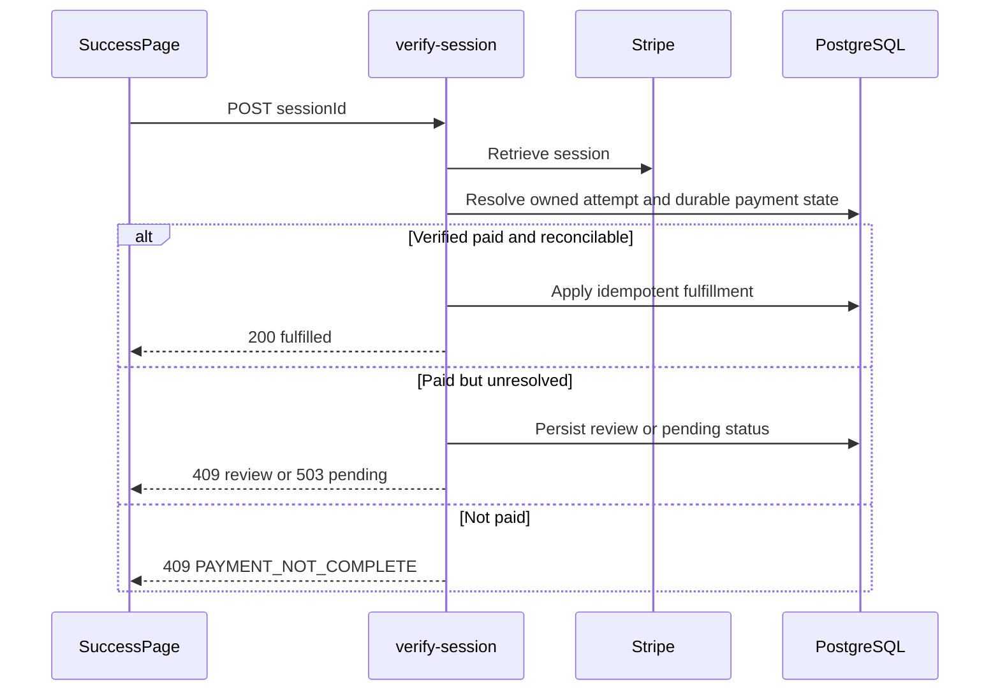
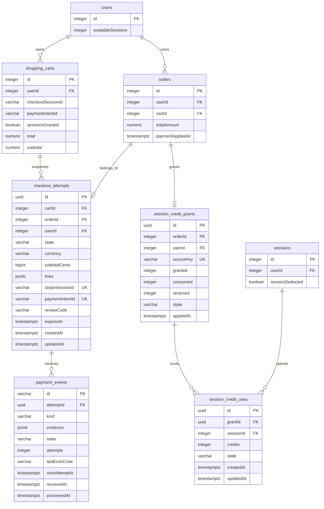
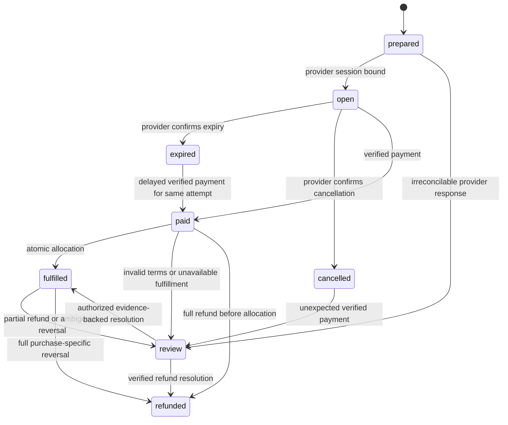
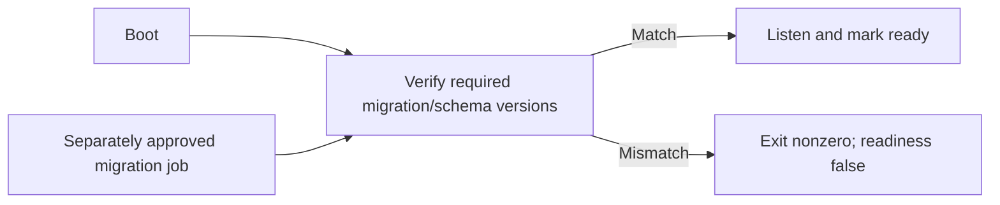

# Astra Reply — subscription transport — 2026-09-26T18:59:39.051Z

**Provider:** openai-codex
**Billing:** chatgpt-subscription
**Authentication:** chatgpt_subscription
**Transport:** codex-cli
**Requested model:** gpt-6-astra
**Served model:** NOT OBSERVABLE on codex-cli (see SERVED_MODEL_UNVERIFIABLE_NOTE)
**Reasoning effort:** high
**Tokens:** in=6626383 out=38669 reasoning=7937
**Packet:** `docs/ai-workflow/AI-HANDOFF/BLUEPRINT-hostile-review-r2-upgrades-2026-09-26/astra-packet.md`
**Wall:** 1352.0s
**Mega Blueprint:** ARMED (remit, document)

> Marginal cost $0 — this leg rides the ChatGPT subscription, not OpenRouter.

---
Mega Blueprint. I’ll verify the five commits, trace the payment and authorization paths, and produce the upgrade package with evidence-linked findings. I’ll keep this pass read-only and local; the requested archive write is blocked by those constraints.

The packet’s checkout snapshot has drifted: local HEAD is `74170358b`, while the cached feature-branch remote ref is `ad268c2d4`. I’ll separate findings against the five commits from later local changes. I found the `fable-blueprint-forge` skill and am applying it; the continuity-count command failed with Windows error 5, so that count is unverified.

The cart freeze is still a check-then-write guard, and checkout sets it only after Stripe session creation. Fulfillment also recalculates session credits from the current catalog rather than the purchased terms. I’m checking how those gaps interact, along with retries between the cart and order allocators.

I found two concrete defects beyond the packet: the allocator used by ACH and admin payment paths creates session rows but never updates `Users.availableSessions`; the workout update route authorizes the old owner, then accepts a replacement `userId`. I’m reproducing both with isolated, in-memory dependencies so no database, provider, or log files are touched.

The isolated probes confirmed the missing balance update, owner reassignment, and a remaining expiry race that can mark a newer checkout expired. They also showed that a failed post-commit financial write is never retried after the allocation marker is set. The onboarding fix still inserts `noteType: 'onboarding'`, which the model’s enum excludes. These findings point to cross-path transaction and recovery tests as the missing review layer.

The mount-order check changes the workout finding: `/api/workout` handles the common session CRUD URLs before the patched `/api/workout/sessions` router. The ownership probe above applies to the shadowed handler, not proof of that live route. I’m now tracing the earlier controller to establish what callers actually reach.

The first-mounted workout controller still allows any trainer to read, create, update, and delete another client’s sessions; all four isolated controller probes returned success. I also corrected two packet claims: `apiLimiter` is used on some routes, and AI chat has a PII filter—but a synthetic onboarding name, birth date, and medication survived it. The package will prioritize mounted authorization, privacy containment, and payment recovery, and reject the proposed blanket allocation backfill.

## PART A — HOSTILE REVIEW

**Verdict: DEFECTS-FOUND. Do not release these five commits as a completed security/money-integrity repair.** Several improvements are valid, but the campaign missed the mounted workout handler, inconsistent allocation effects, and recovery across transaction boundaries.

This is an advisory review with local reproductions. **Archive filing is BLOCKED by the explicit read-only mandate.** No files, production data, provider state, or Git refs were changed.

**Evidence boundary**

- Reviewed campaign tip: `ad268c2d42a5782db8b1303f508bfefd1ffc845d`.
- Observed HEAD: `74170358b85284ba9c249ad5d80be63c0b02570b`; the additional commit changes protocol documentation.
- Cached feature-branch remote ref: `ad268c2d4`. Remote and deployment state were not queried.
- `git diff ad268c2d4 -- backend` was empty. The reviewed backend matches the campaign.
- The working tree has unrelated changes, including a deleted frontend component. It is not a clean release candidate.
- Five isolated Node harness runs executed actual source with in-memory dependencies. All exited `0`, confirming the defective behaviors described below. They did **not** verify PostgreSQL locking, Stripe signatures, production routing, or browser behavior.
- The claimed `6764 pass / 14 fail` and frontend typecheck were not rerun. The default test setup imports a logger that creates file transports; that conflicts with this pass’s no-write rule.
- Archive lookup reported index exclusions/link problems. A negative query is therefore not proof that no earlier review exists.

**A1 — Existing campaign and blueprint review**

The supplied directory contains `astra-packet.md`, not an existing fifteen-document blueprint. Its architecture claims, repair descriptions, test claims, and proposed backfill are the review targets. Missing wireframes or executable deployment criteria cannot be treated as reviewed artifacts.

| ID | Priority | Finding, evidence, and concrete repair |
|---|---|---|
| **F01** | **P0** | **The headline workout authorization repair targets a shadowed CRUD router.** `backend/core/routes.mjs:356` mounts `/api/workout` before `/api/workout/sessions` at `:357`. The earlier router owns session CRUD at `backend/routes/workoutRoutes.mjs:201–236`. Its controller still allows any trainer at `backend/controllers/workoutController.mjs:280`, `:310`, `:340`, and `:380`. Isolated calls by trainer `101` against client `202` returned **200/201 for read/create/update/delete**. Repair the first-mounted controller; test both routers mounted in production order. Do not merely reorder them—their response and validation contracts differ. |
| **F02** | **P1** | **The ACH/admin allocator claims success without updating the balance used by the product.** `backend/services/SessionAllocationService.mjs:107–127` creates session rows, calls `updateUserSessionBalance`, and claims `paymentAppliedAt`; that helper only logs at `:297–306`. The unified allocator actually increments the balance at `backend/services/sessions/session.service.mjs:2750`. Probe: **2 sessions created, balance 0, marker set, retry no-op**. Use one allocation implementation with one atomic balance/claim/ledger transaction. |
| **F03** | **P1** | **The freeze and expiry fixes remain racy.** Checkout reads at `backend/routes/v2PaymentRoutes.mjs:325`, creates the provider session at `:492`, then stamps the cart at `:523`. Mutation checks precede unlocked writes, e.g. `backend/routes/cartRoutes.mjs:620–634`. Main-webhook expiry reads, compares, then saves at `backend/webhooks/stripeWebhook.mjs:205–211`. Probe: an old expiry read followed by a new checkout left **`checkoutSessionId=cs_new`, `checkoutSessionExpired=true`, `paymentStatus=expired`**. Use transactional preparation and a conditional expiry update; remove age-based authorization to mutate purchased terms. |
| **F04** | **P1** | **The charged amount does not identify what was purchased.** Credits come from live catalog fields at `backend/services/SessionGrantService.mjs:31–57`; reconciliation checks row prices at `:77–108`. Probe: changing catalog credits **1→20** while retaining a $100 row still passes a $100 charge. Missing charge data and partially unpriced rows also passed. `backend/services/orderSessionExtraction.mjs:79–108` repeats live-catalog extraction. Freeze item identity, quantity, unit price, and credits before creating checkout; fulfill that snapshot. Unknown terms go to review. |
| **F05** | **P1** | **Post-commit “best effort” permanently loses financial records.** Allocation commits at `backend/services/SessionAllocationService.mjs:123`, then writes the financial row at `:127`; failure is swallowed, and retries exit on the claim at `:72`. Probe: financial insertion failed once; retry made **no second attempt**. Both allocators have this pattern. Make the required accounting row atomic with allocation, or persist a transactional outbox obligation. This package chooses the atomic row. |
| **F06** | **P1** | **Cart and order claims do not share one purchase identity.** Cart fulfillment grants the user and sets `sessionsGranted`, while `backend/services/cartCheckoutFulfillmentService.mjs:224–251` creates a completed order without setting the allocation claim. The order allocator can subsequently treat that order as unallocated. Repair with a unique purchase-level grant record shared by cart, order, ACH, manual, and package callers. This is source-confirmed; a real cross-caller race remains untested. |
| **F07** | **P2** | **The onboarding column repair still writes an invalid enum value.** `backend/routes/clientOnboardRoutes.mjs:281–282` inserts `noteType='onboarding'`; the model allows only `observation`, `red_flag`, `achievement`, `concern`, `general` at `backend/models/ClientNote.mjs:43–46`. The creating migration agrees. The error is caught inside the transaction. Use `general` with an onboarding tag, and make requested assignment/note creation atomic with account creation. Live schema state is unverified. |
| **F08** | **P0** | **Private-media exposure has a third entry point.** In addition to `/api/serve-photo/...` and `/uploads`, `backend/core/middleware/index.mjs:117–150` exposes `/photos/*`, including `measurements`, and issues one-hour signed redirects. Repair all aliases and direct-storage publication together. A fix to `photoServeCategories.mjs` alone is insufficient. |
| **F09** | **P0** | **The privacy claim needs an end-of-pipeline test.** AI chat does have `strictPiiMiddleware` at `backend/routes/aiChatRoutes.mjs:466`, contradicting an entirely unfiltered characterization. However, target-specific stripping is skipped without a selected client at `:600–640`, and the result reaches `sendChatMessage` at `:728–731`. A synthetic onboarding name, birth date, and medication all survived the actual sanitizer with `hasCriticalPII=false`. Keep new-client identity capture local; require a validated outbound data contract before any provider call. No external request was made. |
| **F10** | **P1** | **Mismatch ACKs do not establish a durable recovery obligation.** `backend/webhooks/stripeWebhook.mjs:149–160` logs and acknowledges; the grant service rolled back without recording a review case. Meanwhile `SuccessPage.tsx:132–135` tells the buyer the team is reviewing the order. Persist a review record before acknowledging a permanent failure, and derive the UI from that record. |
| **F11** | **P1** | **Refund linkage and debit attribution are incomplete.** Main webhook has no refund case; cart completion does not persist the final payment-intent ID. More seriously, `backend/services/refundReconciliationService.mjs:182–185` revokes `min(originalGrant, currentAccountBalance)`. If purchase A was consumed and purchase B remains, refunding A can revoke B’s credits. Link refunds to their purchase and track consumption per grant. Partial and historical ambiguous refunds require review, not guessed debits. |
| **F12** | **P0/P3** | **URL logging remains incomplete.** The repaired incoming-request log uses redaction, but `backend/core/app.mjs:100`, `:188`, `:212`, and `:381` still log raw request URLs; the global error logger does so at `backend/core/middleware/errorHandler.mjs:59`. Route every URL-bearing logger through the same redactor, including OPTIONS, errors, and SPA fallback. Test emitted logs with synthetic canaries. |

**Additional verified limits and corrections**

- **Webhook validation differs by entry point.** The legacy cart webhook checks `payment_status === 'paid'`; the main cart branch at `backend/webhooks/stripeWebhook.mjs:107–138` does not check paid status, session identity, or metadata owner before calling the grant service. An isolated unpaid/stale-session fixture reached that call. This is a verified missing guard, **not proof that an unauthenticated attacker can forge Stripe events**; signatures remain required.
- **Dormant ownership reassignment exists.** The shadowed workout PUT accepts `userId` through its Zod schema at `backend/routes/workoutSessionRoutes.mjs:261–271`, authorizes the old owner, then applies the body at `:346`. The probe reassigned `101→202`. This must be removed before that handler is exposed; it is not the mounted CRUD exploit.
- **Do not run the packet’s backfill.** The model table is `orders`, not `"Orders"` (`backend/models/Order.mjs:89`). More importantly, `status='completed'` proves neither correct allocation nor a correct balance. Blanket stamping would conceal F02 and historical failed allocations.
- **Rate limiting is incomplete, not nonexistent.** `apiLimiter` is imported by badge and exercise routes. No global mount was found in the inspected core/server files. Public provider-backed routes remain at `backend/routes/freeApiRoutes.mjs:43–68`.
- **Boot-time schema mutation is real but configurable.** Production repair defaults on at `backend/core/startup.mjs:45–51`; `backend/utils/productionDatabaseSync.mjs:270–281` calls `sync({alter:{drop:false}})`. It can be explicitly disabled. Migration failures remain nonfatal in `backend/scripts/render-start.mjs:95–100`; startup checks only specific schema conditions at `backend/core/startup.mjs:521–544`.
- **The notification repair is an application allowlist repair**, not proof of a database enum or foreign-key repair: `backend/models/Notification.mjs:37–45`.
- **The FK migration allegedly “missing” notifications discovers constraints dynamically** through `pg_constraint`; absence from a hardcoded list proves nothing. Its deployment and resulting constraints require isolated-schema and separately authorized production evidence.
- **The error handler preserves `err.status`** at `backend/core/middleware/errorHandler.mjs:71`; the narrower remaining concern is other error shapes, including `statusCode`.
- **Historical trainer access is inconsistent.** Variation history filters by author at `backend/routes/variationRoutes.mjs:197–200`, while timeline uses active assignment. The package explicitly chooses active-assignment access for cross-client records.
- Waiver candidate matching is confirmed at `backend/controllers/publicWaiverController.mjs:344–379`. **Candidate creation alone does not prove automatic legal attribution.** Review every consumer before making that stronger claim.

**What wave 3 must do differently**

Test **composed workflows**, not isolated helper shapes:

1. Mount the actual routers in actual order.
2. Exercise every caller against the same purchase and user.
3. Interleave checkout creation, mutation, expiry, payment, refund, and retry.
4. Inject failure after every database write and immediately after commit.
5. Assert the user balance, grant provenance, financial record, order state, and response together.
6. Capture outbound provider payloads and every logging path using synthetic data.
7. Run real PostgreSQL constraints and concurrency tests in a disposable environment.
8. Bind results to source hashes and deployed schema versions.

The existing source-text suites can remain architectural tripwires. They cannot certify authorization, PostgreSQL serialization, accounting completeness, or recovery.

**A2 — One hostile pass over the drafted package**

| Draft defect | Correction incorporated below |
|---|---|
| A unique webhook event ID would still allow two different events to grant one payment twice. | D-005 requires both event uniqueness and purchase-level grant uniqueness. |
| A blanket historical marker migration would bury missing balances. | D-008 requires evidence-based classification and quarantines ambiguous history. |
| Refund reversal could consume another purchase’s balance. | D-009 introduces grant consumption provenance; ambiguous legacy refunds never auto-debit. |
| A signed private-media redirect would outlive authorization revocation. | D-002 uses authenticated streaming with private, noncacheable responses. |
| Rolling back code could restore exposed endpoints or ignore new grant claims. | D-014 keeps containment and durable claims forward-compatible; unsafe rollback is prohibited. |
| A broad file-size exemption would contradict the supplied limit. | D-016 requires a bounded extraction manifest; no new blanket exemption is granted. |
| “Package ready” would overstate unrun database, UI, and archive gates. | `14-verification.md` explicitly marks implementation readiness BLOCKED. |

## PART B — FORGED PACKAGE

### 00-README.md

**Purpose**

Harden SwanStudios so client records remain properly scoped, a payment produces exactly its purchased entitlement once, and failures remain visible and recoverable.

**Plan identity**

- Package: `BLUEPRINT-hostile-review-r2-upgrades-2026-09-26`
- Revision: `r3-proposed`
- Repository: `C:\Users\BigotSmasher\Desktop\@Everything\quick-pt\SS-PT`
- Branch: `creator-brains-engine-r2-20260915`
- Campaign baseline: `ad268c2d4`
- Observed checkout: `74170358b`
- Source packet SHA-256: `39b9029017ef7ead91af31a021ff2f30b9014dc43f2441f629bf4ee3e0547ff1`
- Status: **reviewed proposal; not implementation-ready**
- Delivery: document contents emitted here; filesystem persistence and archive filing not performed.

**Requirements**

| ID | Required outcome | Acceptance |
|---|---|---|
| R01 | Cross-client operations require current authorization. | Mounted role matrix returns zero unauthorized reads/writes. |
| R02 | Purchased terms cannot change during fulfillment. | Catalog/cart mutation does not change the recorded purchase or grant. |
| R03 | One purchase causes one complete allocation. | Concurrent callers produce one grant, one financial effect, and the correct balance. |
| R04 | Private data stays behind authorization boundaries. | Every media alias and provider transport passes synthetic negative controls. |
| R05 | Payment and refund failures remain recoverable. | Acknowledged events have durable applied/review/retry state. |
| R06 | Public input cannot establish account identity or exhaust unbounded provider quota. | Anonymous waiver stays unlinked; limits work across two application instances. |
| R07 | Schema and product data agree. | Isolated migrations, enum/FK checks, onboarding and concurrency tests pass. |
| R08 | Operations report failure honestly. | Startup, logs, polling, errors, and release checks meet `09-tests.md`. |

**Build order**

`S0 evidence → S1 mounted authorization → S2 private media → S3 provider privacy → S4 public intake/abuse → S5 schema/startup → S6 checkout snapshots → S7 allocation/provenance → S8 refunds/recovery/UI → S9 site truth → S10 operations → S11 release verification`

P0 containment can ship separately after its own review and release authorization. S5 is a P3 prerequisite pulled forward before money-path DDL.

**Roles and boundaries**

- Anonymous visitor: public content and unlinked waiver submission only.
- Client/user: own permitted records.
- Trainer: own records plus clients with an active assignment.
- Admin: existing administrative scope, with explicit audited money actions.
- Payment provider: signed payment evidence, never authority to select arbitrary user records.
- Application operator: deploy, schema approval, and historical reconciliation owner.

**Builder contract**

Implement one slice at a time. Preserve unrelated work. Re-read source bindings before editing. Run the slice’s behavioral checks and receive a checkpoint verdict before advancing. Record any allowed implementation choice under `10-delegated-bounds.md`; do not silently widen scope.

No production DDL, production writes, paid review, or `main` push is authorized by this package.

**Preconditions actually checked**

| Check | Result |
|---|---|
| Repository, branch, commit, relevant backend drift | Verified locally |
| Prior archive lookup | Incomplete archive coverage reported |
| Native lane digest | Reported “not a git repository”; clearance not established |
| Continuity promotion count | Command failed, Windows error 5 |
| Payment and workout backend ownership | Inspected; workout shadow confirmed |
| Checkout-success and waiver JSX mounts | Inspected |
| Browser rendering and deployed route behavior | NOT RUN |
| Disposable PostgreSQL | NOT ESTABLISHED |
| Independent final review | NOT RUN |

No edit claims were made during this read-only pass.

### 01-architecture.md

**Architecture**

Keep the current Express/Sequelize and React stack. Add a small purchase snapshot and credit-provenance boundary, then make existing entry points delegate to it. Do not introduce another commerce platform or replace the scheduling system.

**Ownership**

- Existing first-mounted workout controller owns common session CRUD.
- `assertAssignmentOrAdmin` owns active-assignment authorization.
- Checkout preparation owns immutable purchased terms.
- Payment-event ingestion owns signature verification, normalization, and durable receipt.
- Purchase fulfillment owns grant, balance, inventory, accounting, and allocation claim.
- Refund reconciliation owns purchase-specific reversal.
- Frontend receipt views render backend state; they do not infer fulfillment from payment alone.

**Rendered surfaces**

```text
main-routes.tsx
├─ /checkout → ProtectedRoute → CheckoutView
├─ /checkout/success → SuccessPage
│  ├─ existing receipt/details components
│  └─ SuccessPage.stateViews
└─ /waiver → PublicWaiverPage.V3
   └─ V2 fallback retains the same submission-state contract
```

**User/data flow**



**Checkout creation interaction**

```mermaid
sequenceDiagram
    participant UI as CheckoutView
    participant API as create-checkout-session
    participant DB as PostgreSQL
    participant SP as Stripe
    UI->>API: POST cartId and fulfillmentIntent
    API->>DB: Lock cart; validate; snapshot; create pending order/attempt
    DB-->>API: attemptId
    API->>SP: Create session; idempotencyKey=attemptId
    alt Response received
        SP-->>API: sessionId and URL
        API->>DB: Conditional bind of sessionId to attempt
        API-->>UI: Checkout URL
    else Timeout or response lost
        API->>DB: Keep prepared attempt recoverable
        API-->>UI: 503 CHECKOUT_PREPARING
        UI->>API: Retry same cart
        API->>SP: Retry same attempt key and parameters
    end
```

**Cart mutation interactions**

```mermaid
sequenceDiagram
    participant UI as Cart
    participant API as Cart mutation routes
    participant DB as PostgreSQL
    UI->>API: POST add / PUT update / DELETE remove or clear
    API->>DB: Lock owning cart in transaction
    alt Active prepared/open attempt
        API-->>UI: 409 CART_CHECKOUT_LOCKED
    else Editable cart
        API->>DB: Validate ownership; mutate rows; update totals
        DB-->>API: Commit
        API-->>UI: Existing success envelope
    end
```

**Payment verification interaction**



**Webhook and refund interactions**

```mermaid
sequenceDiagram
    participant SP as Stripe
    participant API as Both webhook aliases
    participant DB as PostgreSQL
    SP->>API: Signed completion, expiry, failure or refund event
    API->>API: Verify raw-body signature; normalize allowlisted fields
    API->>DB: Insert unique provider event
    alt Duplicate applied event
        API-->>SP: 200
    else Valid event
        API->>DB: Lock purchase; apply transition and effects
        alt Commit succeeds
            API-->>SP: 200
        else Transient persistence failure
            API-->>SP: 500
        end
    else Permanent mismatch
        API->>DB: Persist review reason
        API-->>SP: 200 only after review receipt commits
    end
```

**Manual payment interaction**

```mermaid
sequenceDiagram
    participant A as Admin
    participant API as apply-payment
    participant DB as PostgreSQL
    A->>API: POST orderId, method, reference, notes
    API->>API: Require admin; validate manual method and reference
    API->>DB: Create/reuse unique manual-payment evidence
    API->>DB: Apply shared fulfillment transaction
    alt Complete
        API-->>A: 200 fulfilled
    else Incomplete
        API-->>A: 503 ALLOCATION_PENDING
    end
```

**Private-media interaction**

```mermaid
sequenceDiagram
    participant UI as Existing media consumer
    participant API as Protected media stream
    participant DB as Ownership/assignment records
    participant S as Private object storage
    UI->>API: Authenticated request for opaque media identity
    API->>DB: Resolve owner and current access
    alt Allowed
        API->>S: Fetch bytes privately
        API-->>UI: Stream; Cache-Control private,no-store
    else Denied or unknown
        API-->>UI: 404
    end
```

**Waiver and AI interactions**

```mermaid
sequenceDiagram
    participant U as Existing intake UI
    participant API as Waiver or onboarding API
    participant DB as PostgreSQL
    participant AI as Provider boundary
    U->>API: Submit intake
    alt Anonymous waiver
        API->>DB: Save unlinked submission
        API-->>U: Received; account verification pending
    else Authenticated self waiver
        API->>DB: Verify version/signature and bind authenticated identity
        API-->>U: Recorded
    else New-client identity capture
        API->>DB: Authorized local form save
        API-->>U: Local draft/result
        Note over API,AI: No identity-bearing provider request
    end
```

**Proposed schema**

This ERD is an exact projection of touched existing columns plus proposed tables. It is **not a claim about deployed schema**. PostgreSQL `timestamptz` corresponds to Sequelize `DATE`; mixed-case columns remain quoted.



**Attempt state machine**



**Startup flow**



Out of scope: marketing redesign, new subscription tiers, new AI providers, a new admin dashboard, and autonomous production repair.

### 02-wireframes.md

**Scope**

Change the existing checkout receipt state region and waiver submission-result region. Preserve their surrounding navigation and forms. Backend-only authorization, schema, and accounting slices have no new screens.

**Tokens**

All consumed names below are emitted by `frontend/src/utils/theme/themeUtils.ts:166–200`.

| Element | Exact token |
|---|---|
| Page | `var(--bg-base, #0A0A0F)` |
| Card | `var(--bg-surface, #1A1A24)` |
| Primary text | `var(--text-primary, #E0ECF4)` |
| Secondary text | `var(--text-secondary, #E0ECF4)` |
| Border | `var(--border-soft, #4070C0)` |
| Focus outline | `var(--accent-secondary, #8B5CF6)` |
| Status accent | `var(--accent-gold, #C6A84B)` |

Use existing `GlowButton` variants. Validate computed contrast; fallback colors are not proof.

**Checkout receipt — desktop, 1440px**

```text
                  ┌──────── max-width: 800px ────────┐
                  │ [status icon]                    │
                  │ Exact state title                │
                  │ Exact state explanation          │
                  │                                  │
                  │ Reference: {opaque receipt ID}    │
                  │ Purchased: {snapshot summary}     │
                  │ Granted: {confirmed credit count} │
                  │                                  │
                  │ [Primary action] [Return Home]    │
                  └──────────────────────────────────┘
```

**Checkout receipt — 375px**

```text
┌────────────── 343px ──────────────┐
│ [status icon]                    │
│ Exact state title                │
│ Exact state explanation          │
│                                  │
│ Reference:                       │
│ {opaque receipt ID, wraps}       │
│ Purchased: {snapshot summary}    │
│ Granted: {confirmed count}       │
│                                  │
│ [Primary action — full width]    │
│ [Return Home — full width]       │
└──────────────────────────────────┘
```

Each row below is a required instance of both drawings. Omit purchase/grant values unless verified.

| State | Exact title | Exact explanation | Primary action |
|---|---|---|---|
| Loading | “Checking your payment” | “Please wait while we confirm your order.” | None |
| Missing reference | “Checkout reference missing” | “Open the confirmation link from your checkout.” | None |
| Authentication required | “Sign in to view this order” | “Use the account that started checkout.” | “Sign in” |
| Not owned/not found | “Order unavailable” | “This order could not be found for your account.” | None |
| Payment incomplete | “Payment not complete” | “No session credits have been added.” | “Check again” |
| Paid, pending allocation | “Payment received” | “Your session credits are still being added. Do not pay again.” | “Check again” |
| Durable review | “Order needs review” | “Your payment was received. Your order is awaiting support review.” | “Check status” |
| Fulfilled | “Order complete” | “Your purchased session credits have been added.” | Existing activation CTA |
| Refunded | “Payment refunded” | “Your receipt reflects the confirmed refund.” | None |
| Network failure | “Could not check your order” | “Try again. Do not submit another payment.” | “Try again” |

A physical-only order uses “Your purchase is confirmed.” instead of claiming session credits.

**Waiver result — desktop**

```text
┌────────────────── existing form width ──────────────────┐
│ Exact result title                                      │
│ Exact result explanation                                │
│ [Return Home]                                           │
└─────────────────────────────────────────────────────────┘
```

**Waiver result — 375px**

```text
┌────────────── 343px ──────────────┐
│ Exact result title               │
│ Exact result explanation         │
│ [Return Home — full width]       │
└──────────────────────────────────┘
```

| State | Exact title | Exact explanation/action |
|---|---|---|
| Submitting | “Submitting waiver” | “Please wait while your submission is saved.” No enabled submit action. |
| Anonymous received | “Waiver received” | “Your submission has not been linked to an account. Staff must verify it before account requirements are marked complete.” |
| Authenticated self recorded | “Waiver recorded” | “Your waiver has been recorded for your account.” |
| Validation error | “Check your submission” | Show field-level errors; focus the first invalid field. |
| Version changed | “Waiver updated” | “Review the current waiver before submitting again.” Action: “Review waiver”. |
| Failure | “Waiver not submitted” | “Your submission could not be saved. Please try again.” Action: “Try again”. |

No new identity-verification wizard is introduced.

**Interaction contract**

- Controls: minimum `44×44px`; mobile gap at least `8px`.
- Reading/focus order: title → explanation → reference/details → primary action → home.
- Status updates use `aria-live="polite"`; errors use an alert region.
- No focus stealing during background refresh.
- Cancel/unmount aborts pending browser requests.
- No success animation, cart clearing, or success toast for pending/review/error states.
- Verify widths `375`, `414`, `1440`, `2560`, `3840`; test keyboard and reduced motion.
- Charts: N/A — these state regions contain no chart.

### 03-contracts.md

**Common errors**

```ts
type Failure = {
  success: false;
  error: {
    code: string;
    retryable: boolean;
    receiptId?: string;
  };
  message: string;
};
```

Never return internal SQL, stack traces, provider credentials, signed media URLs, or another account’s identity.

**Endpoint contracts**

| Endpoint | Auth and input | Required result |
|---|---|---|
| `POST /api/v2/payments/create-checkout-session` | Authenticated owner; existing `cartId`, fulfillment intent | Existing success envelope plus opaque `receiptId`; `409 CART_CHECKOUT_LOCKED`; `503 CHECKOUT_PREPARING`; malformed input `400`; wrong owner `404`. |
| `POST /api/v2/payments/verify-session` | Owner; `{sessionId:string}` | `200` only when fulfillment is complete; `409 PAYMENT_NOT_COMPLETE`; `409 PAYMENT_REVIEW_REQUIRED`; `503 ALLOCATION_PENDING`; missing/foreign record `404`. |
| `GET /api/v2/payments/activation-status` | Owner; existing session query | Preserve existing activation fields; add authoritative `paymentState`, `fulfillmentState`, `receiptId`. Never infer fulfillment from `orders.status`. |
| `POST /api/webhook/stripe`, `POST /webhooks/stripe/webhook`, `POST /api/cart/webhook` | Provider signature over raw bytes | Same dispatcher. Invalid signature `400`; transient persistence failure `500`; durable applied/review event `200 {received:true}`. |
| Existing cart add/update/remove/clear | Authenticated owner | Same envelopes; mutation and totals share transaction; locked attempt `409`. |
| `POST /api/orders/create-from-cart` | Owner; existing cart input | Idempotent pending order only. Never completes the cart or allocates credits. |
| `POST /api/orders/:id/apply-payment` | Admin; manual method, reference, notes | Shared fulfillment; `200` complete or already complete; `503` pending; invalid provider-payment substitution `409`. |
| `PUT /api/orders/:id` | Admin; allowed operational fields | Cannot synthesize payment, erase allocation evidence, or reverse terminal financial state. Illegal transition `409`. |
| Existing workout session CRUD | Self/admin/current assigned trainer | Reads/writes bind to persisted owner; denied/missing `404`; attempted ownership change `400 IMMUTABLE_OWNER`. |
| Private media aliases | Self/admin/current assigned trainer | Stream only after authorization; denied/missing `404`; `private,no-store`; no bearer token in URL. |
| `POST /api/public/waivers/submit` | Optional authenticated identity | Anonymous: saved but unlinked; authenticated: bind to authenticated identity only; `400` validation, `409` stale version, `429` limited. |
| Provider-backed `/api/free/*` routes | Authentication plus bounded quota | `401` anonymous, `429` quota exhausted, `503` limiter unavailable; no provider call on rejection. |

For anonymous waiver submission, preserve the existing envelope but return `status: "pending_verification"`. Do not expose candidate IDs, confidence scores, or whether an email matches an account.

**Core function contracts**

```ts
prepareCheckout(input: {
  userId: number;
  cartId: number;
  fulfillmentIntent: unknown;
}): Promise<{ attemptId: string; orderId: number }>;

normalizePaymentEvidence(input: unknown): PaymentEvidence;
// Reject malformed, noninteger, nonfinite or unbound evidence.

fulfillPurchase(input: {
  orderId: number;
  sourceKey: string;
  evidence: PaymentEvidence | ManualPaymentEvidence;
}): Promise<
  | { state: "fulfilled"; receiptId: string; sessionsAdded: number }
  | { state: "already_fulfilled"; receiptId: string; sessionsAdded: 0 }
  | { state: "review"; receiptId: string; code: string }
>;

applyRefund(input: {
  eventId: string;
  paymentIntentId: string;
  cumulativeRefundCents: number;
}): Promise<{ state: "applied" | "review"; reversedCredits: number }>;

reserveSessionCredits(input: {
  userId: number;
  sessionId: number;
  credits: number;
  transaction: unknown;
}): Promise<void>;
```

**Immutable line contract**

```ts
type PurchasedLine = {
  storefrontItemId: number;
  productVariantId: number | null;
  itemKind: "training_package" | "physical_product";
  quantity: number;
  unitAmountCents: number;
  sessionCreditsPerUnit: number;
};
```

Validate positive integer quantities; nonnegative integer prices/credits; known item kinds; variant belongs to item. Store no customer names or medical data in these snapshots.

For this rollout, currency is `usd`. A different currency is a review condition. Amounts must fit both the existing monetary columns and JavaScript safe-integer range.

Reconciliation requires:

```text
provider subtotal = sum(snapshot quantity × snapshot unit cents)
provider total = subtotal − provider discount + provider tax + provider shipping
provider identity = attempt/session/payment intent/customer ownership binding
```

No one-cent allowance conceals malformed data. Any rounding is performed once when constructing line-item cents.

**New model definitions**

All tables use explicitly declared names. All user FKs reference canonical `"Users"(id)` with `ON DELETE RESTRICT`. Payment/audit rows are never cascade-deleted.

| Table | Complete column contract |
|---|---|
| `checkout_attempts` | `id UUID PK`; `"cartId" INTEGER NOT NULL FK shopping_carts`; `"orderId" INTEGER NOT NULL UNIQUE FK orders`; `"userId" INTEGER NOT NULL FK "Users"`; `state VARCHAR(16) NOT NULL`; `currency VARCHAR(3) NOT NULL`; `"subtotalCents" BIGINT NOT NULL`; `lines JSONB NOT NULL`; `"stripeSessionId" VARCHAR(255) NULL UNIQUE`; `"paymentIntentId" VARCHAR(255) NULL UNIQUE`; `"reviewCode" VARCHAR(64) NULL`; `"expiresAt" TIMESTAMPTZ NULL`; `"createdAt" TIMESTAMPTZ NOT NULL`; `"updatedAt" TIMESTAMPTZ NOT NULL`. |
| `payment_events` | `id VARCHAR(255) PK`; `"attemptId" UUID NULL FK checkout_attempts`; `kind VARCHAR(64) NOT NULL`; `evidence JSONB NOT NULL`; `state VARCHAR(16) NOT NULL`; `attempts INTEGER NOT NULL DEFAULT 0`; `"lastErrorCode" VARCHAR(64) NULL`; `"nextAttemptAt" TIMESTAMPTZ NULL`; `"receivedAt" TIMESTAMPTZ NOT NULL`; `"processedAt" TIMESTAMPTZ NULL`. |
| `session_credit_grants` | `id UUID PK`; `"orderId" INTEGER NOT NULL UNIQUE FK orders`; `"userId" INTEGER NOT NULL FK "Users"`; `"sourceKey" VARCHAR(255) NOT NULL UNIQUE`; `granted INTEGER NOT NULL`; `consumed INTEGER NOT NULL DEFAULT 0`; `reversed INTEGER NOT NULL DEFAULT 0`; `state VARCHAR(16) NOT NULL`; `"appliedAt" TIMESTAMPTZ NOT NULL`. |
| `session_credit_uses` | `id UUID PK`; `"grantId" UUID NOT NULL FK session_credit_grants`; `"sessionId" INTEGER NOT NULL FK sessions`; `credits INTEGER NOT NULL`; `state VARCHAR(16) NOT NULL`; `"createdAt" TIMESTAMPTZ NOT NULL`; `"updatedAt" TIMESTAMPTZ NOT NULL`; unique `("grantId","sessionId")`. |

Constraints:

- Attempt states: the states in `01-architecture.md`; partial unique index on `"cartId"` for `prepared/open`.
- Event states: `pending/applied/review`; attempts nonnegative.
- Grant states: `active/review/refunded`; all counts nonnegative; `consumed + reversed <= granted`.
- Use states: `reserved/consumed/released`; credits positive.
- JSON snapshot shape validated at write and read boundaries.
- Add nullable unique `"effectKey" VARCHAR(255)` to `financial_transactions`; new writers must set it. Existing null rows require classified reconciliation, not guessed keys.
- Existing model definitions otherwise remain unchanged. The touched-column evidence is in `11-registries.md`.

**Transaction contract**

Lock order: purchase/order → user → grants ordered by ID → credit uses → inventory ordered by item/variant ID.

One allocation transaction commits:

1. Unique grant.
2. Correct user balance increment.
3. Required session records.
4. Inventory changes.
5. Required financial record.
6. Cart/order allocation claims.
7. Event applied state.

Any required failure rolls back all seven. Notification delivery is outside this transaction and must not determine payment truth.

### 04-build-order.md

**File ownership and size**

Measured current counts are below. New files have current count `0`. Every new leaf has a `≤300` line budget. Oversized existing files require a recorded extraction manifest before their slice; this package grants no exemption.

| Slice | Files / entry point | Current lines | Planned responsibility |
|---|---|---:|---|
| S0 | Package documents; new `backend/tests/security/campaign-safety.test.mjs`; new local-only test helpers | 0 for new files | Bind source, archive safely in a writable run, install regression probes and disposable-test guard. |
| S1 | `backend/controllers/workoutController.mjs`; `backend/routes/workoutRoutes.mjs`; `backend/routes/workoutSessionRoutes.mjs`; `backend/routes/variationRoutes.mjs`; `backend/routes/formAnalysisRoutes.mjs` | Controller 696; later workout router 756 | Shared authorization before each effect; immutable owners; preserve route contracts. |
| S2 | `backend/core/middleware/index.mjs`; `backend/core/routes.mjs`; `backend/core/photoServeCategories.mjs`; `backend/services/photoStorageService.mjs`; new `backend/services/privateMediaAccess.mjs` | Middleware 229; routes 903 | One private-media policy across aliases and storage publication. |
| S3 | `backend/routes/aiChatRoutes.mjs`; `backend/middleware/piiSanitizationMiddleware.mjs`; new `backend/services/ai/outboundPayloadPolicy.mjs` | AI routes 1090 | Local intake containment and transport-level allowlist. |
| S4 | `backend/controllers/publicWaiverController.mjs`; `backend/routes/publicWaiverRoutes.mjs`; `backend/routes/freeApiRoutes.mjs`; `backend/middleware/rateLimiter.mjs`; waiver result consumers | Controller 403; V3 page 795 | Unlinked anonymous intake and shared quotas. |
| S5 | `backend/scripts/render-start.mjs`; `backend/core/startup.mjs`; `backend/utils/startupMigrations.mjs`; `backend/utils/productionDatabaseSync.mjs` | Startup 652 | Explicit migration execution and fail-closed startup. |
| S6 | New `backend/models/CheckoutAttempt.mjs`, `PaymentEvent.mjs`; new `backend/services/payments/checkoutPreparation.mjs`, `paymentEvidence.mjs`; existing cart/v2 payment routes | Cart 1000; v2 payment 896 | Immutable snapshot, preparation recovery, provider binding. |
| S7 | New `backend/models/SessionCreditGrant.mjs`, `SessionCreditUse.mjs`; new `backend/services/payments/purchaseFulfillment.mjs`, `sessionCreditProvenance.mjs`; existing allocation adapters and scheduling consumers | Allocator 540; grant service 309; unified service 3055 | Single grant/effect transaction and purchase-specific consumption. |
| S8 | `backend/webhooks/stripeWebhook.mjs`; `backend/services/refundReconciliationService.mjs`; `backend/services/paymentActivationStatusService.mjs`; `SuccessPage.tsx`, state views, styles | Webhook 695; page 304 | Durable recovery, refunds, truthful receipt UI. |
| S9 | `backend/routes/clientOnboardRoutes.mjs`; `backend/models/ClientNote.mjs`; `backend/models/Notification.mjs`; `backend/services/badgeService.mjs`; `backend/controllers/challengeController.mjs`; targeted migrations | Onboard 361 | Atomic onboarding and database-enforced data integrity. |
| S10 | `backend/core/app.mjs`; `backend/core/middleware/errorHandler.mjs`; `backend/server.mjs`; `frontend/src/hooks/useEnhancedClientDashboard.ts`; `frontend/src/context/AuthContext.tsx`; dependency manifest/lockfile | App 404 | Log closure, process policy, lifecycle cleanup, upload maintenance. |
| S11 | Package receipts and release manifest only | New artifacts ≤300 each | Combined verification and gated release handoff. |

**Imports and exports**

- Preparation imports model getters and existing pricing/fulfillment validators; exports `prepareCheckout`.
- Evidence module is pure; exports `normalizePaymentEvidence`.
- Fulfillment imports model getters and provenance helpers; exports `fulfillPurchase`.
- Provenance module exports reserve/consume/release operations and refund calculations.
- Existing `SessionGrantService` and both allocation service entry points become compatibility adapters. No caller may implement a second balance mutation.
- Existing `verifyClientAccess.mjs:95–122` is the authorization pattern.
- Existing grant-service user lock and increment at `SessionGrantService.mjs:145–157,270–275` are the transaction pattern.
- Existing `SuccessPage.stateViews.tsx` is the UI composition pattern.

**Extraction bounds**

S0 records exact leaf names, exported symbols, importers, and line counts. Split by existing responsibility: route registration, controller operations, presentation styles, and pure helpers. Preserve imports through compatibility exports. No unrelated behavior change accompanies extraction.

New migration filenames reserve the `20260926` prefix only after checking for collisions. A collision changes the timestamp, not the migration contract.

No files are deleted during planning. Retirement decisions are in `12-orphan-disposition.md`.

### 05-slices.md

Every acceptance criterion below is a **MEASUREMENT**. Test source and execution requirements are in `09-tests.md`.

| Slice | Priority / findings | Deliverable and done condition | Rollout / rollback |
|---|---|---|---|
| **S0 — Evidence and test isolation** | Prerequisite | Persist this package, source hashes, route ownership, extraction manifest, archive receipt, and executable regression probes. Test guard rejects inherited/production DB configuration before imports. Existing safety probes reproduce current failures. | No runtime release. Preserve original packet. |
| **S1 — Mounted authorization** | P0 / F01 | First-mounted CRUD and reachable sibling operations pass self/admin/assigned/unassigned/revoked matrix; owner transfer rejected; denied cases cause zero downstream writes. | Deploy bounded auth fix. Never roll back to role-only access. |
| **S2 — Private media closure** | P0 / F08 | All three aliases, local storage, and direct-storage publication tested; unauthorized requests yield no bytes or signed redirect; authorized clients retain access. | Keep private namespaces denied if streaming deployment fails. |
| **S3 — Provider privacy** | P0 / F09 | New-client identity stays in local intake; synthetic canaries absent from every outbound provider request/history/failover payload; blocked path makes zero provider calls. | Disable affected AI action on failure; typed local intake remains available. |
| **S4 — Public intake and quotas** | P0 / R06 | Anonymous waiver remains unlinked across all consumers; authenticated identity cannot be replaced by body fields; two instances share quota; rejected requests make zero provider calls. | Preserve unlinked submissions; provider-backed endpoints fail closed. |
| **S5 — Schema/startup gate** | P3 prerequisite / R07 | Required migration failure prevents listen/readiness; production startup performs no implicit DDL; model/FK/enum checks run against a disposable database. | Keep old healthy deployment serving; do not boot a drifted new version. |
| **S6 — Checkout snapshot** | P1 / F03–F04 | Snapshot committed before provider creation; concurrent edits cannot alter it; timeout retry reuses attempt; stale expiry cannot unlock a new attempt; valid delayed payment resolves original attempt. | Feature switch disables new checkout attempts without changing paid attempts. |
| **S7 — Unified allocation/provenance** | P1 / F02,F05,F06 | Concurrent cart/order/ACH/manual/package callers produce one grant, correct balance and accounting; every injected required-write failure rolls back; booking/cancel/complete preserve grant provenance. | Retain new claims; disable new fulfillment and drain pending events through compatible code. |
| **S8 — Refunds and recovery** | P1 / F10–F11 | Main/legacy events converge; duplicate and reordered refunds are safe; purchase A cannot debit B; acknowledged mismatch has review record; UI never calls pending fulfillment complete. | Pause automatic reconciliation; retain inbox and cases. Never erase events. |
| **S9 — Site truth** | P2 / F07 | Onboarding note/assignment/account commit together; valid note enum; follow works against canonical FK; badge/reward duplicate and challenge capacity races pass. | Additive migrations; preserve duplicate-history audit; no destructive cleanup. |
| **S10 — Operations** | P3 / F12,R08 | URL canaries absent from all logs; one process-failure policy; polling ends on unmount/logout; supported upload dependency passes parser/limit tests; identified baseline failures resolved or individually adjudicated. | Roll back only to a version retaining P0 and ledger protections. |
| **S11 — Combined release verification** | All | Full isolated regression suite green; actual mounted API and browser tests pass; independent review complete; exact candidate/schema manifest and restore drill recorded. | Separate approval required for production DDL, deploy, and `main` push. |

**Checkpoint rule:** do not proceed to the next slice until the current checkpoint passes. A red required suite blocks advancement. Infrastructure failure is `BLOCKED`, not behavioral RED.

### 06-bans.md

**P4 — Kill list**

1. No additional AI reviewers as a substitute for mounted behavior tests.
2. No new payment platform, generalized event bus, or generic workflow engine.
3. No live-cart or live-catalog fulfillment after checkout preparation.
4. No missing-price, missing-charge, or missing-model “success” fallback.
5. No blanket `paymentAppliedAt=completedAt` backfill.
6. No success-only source regex as authorization or money-path acceptance.
7. No private-media bearer tokens in URLs or long-lived signed redirects.
8. No anonymous email+DOB match promoted into verified identity.
9. No financial records treated as disposable telemetry.
10. No provider switch/failover that bypasses privacy validation.
11. No partial-refund credit arithmetic invented from dollars alone.
12. No cosmetic dashboard or marketing redesign in this campaign.
13. No automatic historical deletion, log purging, or secret-file inspection.
14. No global JWT lifetime change without validating refresh, logout, revocation, and active clients.
15. No direct production migration, seed, repair sync, or developer-server execution.
16. No repository-wide cleanup or deletion inferred from an importer search.

**House constraints**

Styled-components; emitted CSS tokens; dark-first; `44px` controls; measured contrast; Victory if charts later become necessary; no new MUI; no new file above 300 lines. No client PII in model prompts. No `git add -A`, destructive Git operations, or shared-store worktree creation.

Unrelated dirty files are outside the allowed change set.

### 07-checkpoints.md

**Checkpoint order**

1. Recheck branch, source hashes, route ownership, and edit clearance.
2. Verify RED→GREEN behavior for the repaired boundary.
3. Review database effects and forbidden side effects.
4. Check decisions and delegated bounds.
5. Review rollback compatibility.
6. Record `PASS`, `REVISE`, or `BLOCKED`.
7. File the dated review and link its immutable evidence.

**Reusable review remit**

> Attack this slice through its first-mounted caller. Use synthetic users and disposable resources. Try missing and malformed evidence, stale ownership, concurrent requests, cross-caller retries, failure after each write, and reordered events. Report exact source/command evidence, expected versus observed effects, and a concrete repair. A source-shape check is not runtime proof. Preserve unresolved findings and coverage gaps.

**Reviewer routing**

This pass is Astra’s requested advisory review. A later implementation built by Astra requires an independent Claude-family final reviewer under the supplied Astra profile. External review remains prohibited while the local-only restriction applies. A pending reviewer is never marked passed.

**Current log**

| Stage | Verdict | Evidence |
|---|---|---|
| A1 campaign | DEFECTS-FOUND, unfiled | Findings and local probes in PART A |
| A2 package, one pass | Corrections incorporated | D-002,D-005,D-008,D-009,D-014,D-016 |
| S0–S11 | NOT RUN | No implementation performed |

**Stop categories**

`SOURCE_CHANGED`, `CLAIM_CONFLICT`, `UNSAFE_TEST_RESOURCE`, `SCHEMA_UNPROVEN`, `CONTRACT_CONFLICT`, `CRITERION_UNMEASURABLE`, `REVIEW_UNAVAILABLE`.

When a stop applies, preserve the exact unfinished slice and evidence. Do not substitute production resources or another provider.

### 08-decision-ledger.md

| ID | Decision | Rejected alternative / reason |
|---|---|---|
| D-001 | Repair the first-mounted workout controller; keep route ordering. | Reordering exposes different validation/response behavior and the dormant owner-transfer defect. |
| D-002 | Private measurement media uses authenticated streaming. | Signed redirects retain transferable access after authorization changes. |
| D-003 | New-client identity intake is local; provider payloads require an explicit allowlist. | Regex-only de-identification cannot establish zero PII. |
| D-004 | Anonymous waivers stay unlinked until verified through an authenticated or staff-reviewed process. | Matching attributes are not ownership proof. |
| D-005 | Deduplicate provider events and purchase effects separately. | Distinct provider events can refer to one purchase. |
| D-006 | Snapshot full entitlement and price before provider creation. | Amount-only comparisons do not identify purchased credits or products. |
| D-007 | Accounting, balance, grant, inventory, and allocation claim are atomic. | Post-commit best effort loses required financial records. |
| D-008 | Historical orders are classified as verified granted, verified ungranted, or ambiguous. | Completed status and timestamps are insufficient evidence. |
| D-009 | Refund only credits attributable to that purchase; partial/ambiguous history goes to review. | Account-level `min(granted,balance)` can revoke another purchase. |
| D-010 | Current active assignment governs cross-client access; self/admin remain permitted. | Implicit historical-author access differs across endpoints. |
| D-011 | Onboarding notes use `general` and tag `onboarding`. | Adding a new enum solely to preserve an accidental literal adds avoidable migration risk. |
| D-012 | Startup verifies schema; approved jobs migrate it. | Runtime repair sync hides drift and mutates production implicitly. |
| D-013 | Receipt UI distinguishes paid, fulfilled, pending, review, and refunded. | `paid=true` does not establish delivered entitlement. |
| D-014 | Rollback preserves security containment and new durable claims. | Old code can double-grant or reopen unauthorized routes. |
| D-015 | Test historical baseline failures individually; never waive by count. | “The same 14” can hide changed failure identities. |
| D-016 | New modules ≤300 lines; existing oversized changes require a bounded extraction manifest. | No blanket file-size exemption. |
| D-017 | USD-only initial evidence contract; reject unknown amount/currency data. | Guessing defaults silently changes financial meaning. |
| D-018 | One grant may fund multiple sessions; one session may consume multiple grants. | A single nullable order ID on a session cannot describe split credit consumption. |
| D-019 | No production changes in the review phase. | Read-only review is not deployment authorization. |

### 09-tests.md

**Current execution evidence**

Five read-only Node VM harness runs completed with exit `0`:

1. Allocator: 2 rows, balance 0, claim set; failed financial write not retried.
2. Grant calculation: catalog credit drift and invalid reconciliation inputs accepted.
3. Shadowed workout PUT: owner changed `101→202`.
4. Main webhook: unpaid/stale evidence reached grant; expiry race disarmed a newer session.
5. Mounted controller and privacy checks were executed in separate source-loading invocations: trainer CRUD returned success; synthetic identity data survived sanitation.

For clarity, the last grouping contains two invocations: **six source-loading invocations in total**. These are diagnostic reproductions, not six passing safety tests.

**Executable regression seed**

Save the following as `backend/tests/security/campaign-safety.test.mjs` in S0. It uses actual source, in-memory imports, and no database/network/logger transport. The assertions express the desired safety contract and are expected to fail against the reviewed baseline.

```js
import test from 'node:test';
import assert from 'node:assert/strict';
import fs from 'node:fs';
import vm from 'node:vm';
import path from 'node:path';

const root = process.cwd();
const noop = () => {};
const logger = { info: noop, warn: noop, error: noop, debug: noop };

async function load(relative, dependencies) {
  const filename = path.join(root, relative);
  const source = fs.readFileSync(filename, 'utf8');
  const module = new vm.SourceTextModule(source, { identifier: filename });
  await module.link(async name => {
    assert.ok(Object.hasOwn(dependencies, name), `Unstubbed import: ${name}`);
    const values = dependencies[name];
    return new vm.SyntheticModule(Object.keys(values), function () {
      for (const [key, value] of Object.entries(values)) {
        this.setExport(key, value);
      }
    });
  });
  await module.evaluate();
  return module.namespace;
}

async function grantHelpers() {
  return load('backend/services/SessionGrantService.mjs', {
    '../database.mjs': { default: {} },
    '../models/index.mjs': {
      getShoppingCart: noop,
      getCartItem: noop,
      getStorefrontItem: noop,
      getUser: noop,
    },
    '../utils/logger.mjs': { default: logger },
    './cartCheckoutFulfillmentService.mjs': {
      createCartOrderIfPossible: noop,
      loadOptionalFulfillmentModels: noop,
    },
    './sessionBillingPolicy.mjs': { isNonDeductingClient: () => false },
  });
}

test('R02: missing charge evidence cannot authorize fulfillment', async () => {
  const service = await grantHelpers();
  assert.equal(service.chargeCoversCartValue({
    cartItems: [{ price: 100, quantity: 1 }],
  }), false);
});

test('R02: an unpriced line cannot disappear from reconciliation', async () => {
  const service = await grantHelpers();
  assert.equal(service.chargeCoversCartValue({
    amountTotalCents: 100,
    subtotal: 10000,
    cartItems: [{ price: 1, quantity: 1 }, { quantity: 1000 }],
  }), false);
});

test('R01: unassigned trainer cannot read another client session', async () => {
  const service = {
    getWorkoutSessionById: async () => ({
      id: 'synthetic-session',
      userId: 202,
      notes: 'synthetic private note',
    }),
  };
  const controller = await load('backend/controllers/workoutController.mjs', {
    '../services/workoutService.mjs': { default: service },
    '../utils/responseUtils.mjs': {
      errorResponse: (res, status, message) => {
        res.status = status;
        res.body = message;
      },
      successResponse: (res, body, status = 200) => {
        res.status = status;
        res.body = body;
      },
    },
    '../utils/logger.mjs': { default: logger },
    '../utils/idUtils.mjs': { idEquals: (a, b) => String(a) === String(b) },
  });
  const response = {};
  await controller.getWorkoutSessionById({
    user: { id: 101, role: 'trainer' },
    params: { sessionId: 'synthetic-session' },
  }, response);
  assert.equal(response.status, 404);
});
```

Exact root command:

```powershell
node --experimental-vm-modules --test-isolation=none --test backend/tests/security/campaign-safety.test.mjs
```

The emitted seed has not been saved or run as a file. Import fixtures must evolve with legitimate extraction, while preserving behavioral assertions. It supplements mounted-route and database tests.

**Required named suites**

The following files are planned, not claimed to exist. S0 installs their isolated runner and fixtures; each owning slice implements the named cases before repair.

Run each backend suite from `backend/` using:

```powershell
node node_modules/vitest/vitest.mjs run tests/security/<file>.test.mjs --retry=0
```

Run PostgreSQL suites only through the S0 disposable-resource launcher, which must reject inherited `DATABASE_URL` before loading application modules:

```powershell
node scripts/run-disposable-security-tests.mjs --suite <suite-name>
```

| File / suite | Required named cases | Proves |
|---|---|---|
| `mountedWorkoutAuthorization.test.mjs` | `first mounted handler denies unassigned trainer`; `revoked assignment denies`; `self access survives`; `admin allowed`; `owner field immutable`; `denied mutation writes zero rows` | R01/F01 |
| `privateMediaAliases.test.mjs` | `serve-photo denies anonymous`; `photos alias denies`; `uploads cannot bypass`; `revocation denies next request`; `public product image remains public`; `storage URL not disclosed` | R04/F08 |
| `providerPayloadBoundary.test.mjs` | `new client canaries never leave`; `history is sanitized`; `failover uses same policy`; `blocked request calls zero providers`; `typed intake remains usable` | R04/F09 |
| `publicIntakeAbuse.test.mjs` | `anonymous waiver remains unlinked`; `body identity cannot override actor`; `candidate is not proof`; `two instances share quota`; `limiter outage blocks provider call` | R06 |
| `startupReadiness.test.mjs` | `migration failure prevents listen`; `schema mismatch readiness false`; `production boot issues no DDL`; `healthy schema starts` | R07 |
| `checkout-snapshot` | `mutation waits for preparation`; `parallel create reuses attempt`; `timeout preserves key`; `catalog edit does not change grant`; `stale expiry CAS changes zero rows`; `delayed paid event uses original snapshot` | R02/F03–F04 |
| `purchase-allocation` | `cart and order callers race`; `ACH and admin race`; `distinct events same purchase grant once`; `balance changes exactly`; `financial failure rolls back`; `inventory failure rolls back`; `commit response loss retry is safe` | R03/F02,F05,F06 |
| `credit-provenance` | `split grant reservation`; `complete consumes once`; `cancel releases once`; `retry cannot restore twice`; `legacy unknown grant is quarantined` | R03/D-018 |
| `refund-recovery` | `refund A cannot debit B`; `partial then full`; `duplicate refund`; `refund before completion`; `unknown payment persists review`; `mismatch ACK requires receipt` | R05/F10–F11 |
| `site-truth` | `onboarding general note persists`; `assignment failure rolls back account`; `follow notification real FK`; `badge race rewards once`; `last challenge place admits one` | R07/F07 |
| `operationalBoundaries.test.mjs` | `OPTIONS URL redacted`; `SPA URL redacted`; `error URL redacted`; `statusCode preserved`; `single rejection policy`; `upload limit fails before storage` | R08/F12 |

**Frontend**

Planned files:

- `frontend/src/components/NewCheckout/SuccessPage.recovery.test.tsx`
- `frontend/src/pages/PublicWaiverPage.verification.test.tsx`
- `frontend/src/hooks/useEnhancedClientDashboard.lifecycle.test.tsx`
- `frontend/tests/e2e/checkout-recovery.spec.ts`

Exact unit command from `frontend/`:

```powershell
node node_modules/vitest/vitest.mjs run src/components/NewCheckout/SuccessPage.recovery.test.tsx src/pages/PublicWaiverPage.verification.test.tsx src/hooks/useEnhancedClientDashboard.lifecycle.test.tsx --retry=0
```

Cases: pending payment never renders success; review survives reload; 401 offers sign-in; abort suppresses stale response; anonymous waiver never claims account linkage; polling ends on unmount and logout.

Browser command after starting the **isolated** fixture application:

```powershell
node node_modules/@playwright/test/cli.js test tests/e2e/checkout-recovery.spec.ts
```

Verify all wireframe states, listed widths, keyboard order, no overflow, contrast, and reduced motion.

**Negative controls**

Removing an authorization guard must expose a forbidden response in the mounted test. Removing purchase uniqueness must duplicate the effect in the two-connection test. Removing privacy validation must expose a synthetic canary in the fake transport. A failed control invalidates the test instrument.

**Not run**

All proposed suites, real PostgreSQL races, browser tests, typecheck, full regression baseline, migration restore, and production smoke.

### 10-delegated-bounds.md

| Delegation | Bound | Checkpoint measurement |
|---|---|---|
| Oversized-file extraction | Preserve public exports, route order, and behavior; each resulting file ≤300 lines; only slice-owned directories. | Import graph diff, line counts, unchanged behavior tests. |
| Test fixture implementation | Synthetic identities only; no inherited credentials; no default DB import before guard. | Production-host sentinel rejected; network traps detect attempted egress. |
| Private-media consumer inventory | Include every renderer of private namespaces; authenticate fetches; no raw-token URLs. | Alias/consumer matrix plus authorized browser smoke. |
| Shared limiter implementation | Reuse verified shared infrastructure if present; atomic counters across instances; protected provider routes fail closed on outage. | Two-process quota test and outage test. |
| Scheduling writer inventory | Include every balance/credit deduction and restoration path; use one provenance transaction boundary. | Positive-control caller census plus complete/cancel/race tests. |
| Historical reconciliation | Only verified evidence may create a legacy grant or marker; ambiguous rows remain unchanged and listed. | Before/after counts, per-row evidence digest, zero unexplained balance movement. |
| Nonfinancial notification delivery | May reuse existing retry worker; cannot be inside required payment success semantics. | Delivery failure does not duplicate or erase payment effects. |
| Provider retry timing | Exponential delay with jitter, maximum five automatic processing attempts; exhausted events become review. No automatic new charge. | Fake-clock retry and exhaustion tests. |
| Operations performance | Establish isolated baseline; no >10% p95 regression without an explicit recorded tradeoff; no new unbounded query. | Comparable fixture benchmark. |
| Dependency upgrade | Choose an installed-supported release only after compatibility and advisory verification; no guessed version pin. | Multipart limits, error paths, lockfile and build checks. |

These bounds permit implementation choices, not changes to authorization, payment meaning, refund policy, or production authority.

### 11-registries.md

**Re-derivation rule**

For any source citation in this package:

```powershell
$p = '<cited path>'
$a = <first cited line>
$b = <last cited line>
$s = Get-Content -LiteralPath $p
$a..$b | ForEach-Object { '{0}: {1}' -f $_, $s[$_-1] }
git diff ad268c2d4 -- $p
```

Replace the three values with the citation being checked. This is a read-only source command, not a behavioral acceptance test.

**Registry bindings**

| Fact | Source | Re-derivation |
|---|---|---|
| Workout shadow order | `backend/core/routes.mjs:356–357`; `backend/routes/workoutRoutes.mjs:201–236` | `rg -n 'workoutRoutes|workoutSessionRoutes' backend/core/routes.mjs` |
| Actual trainer CRUD gates | `backend/controllers/workoutController.mjs:270–386` | `rg -n "req.user.role.*trainer" backend/controllers/workoutController.mjs` |
| Cart/v2/order mounts | `backend/core/routes.mjs:316,334–335` | `rg -n 'cartRoutes|v2PaymentRoutes|orderRoutes' backend/core/routes.mjs` |
| Webhook aliases | `backend/core/routes.mjs:704–706`; webhook handler registration | `rg -n 'stripeWebhookRouter|router.post' backend/core/routes.mjs backend/webhooks/stripeWebhook.mjs` |
| Private media aliases | `backend/core/routes.mjs:549`; middleware `:110,117` | `rg -n 'serve-photo|/uploads|/photos/' backend/core/routes.mjs backend/core/middleware/index.mjs` |
| Success JSX mount | `frontend/src/routes/main-routes.tsx:671–675` | `rg -n 'checkout/success|<SuccessPage' frontend/src/routes/main-routes.tsx` |
| Success API consumer | `SuccessPage.tsx:79–81` | `rg -n 'verify-session' frontend/src/components/NewCheckout/SuccessPage.tsx` |
| Waiver JSX mount | `main-routes.tsx:408–411` | `rg -n "path: 'waiver'|<PublicWaiverPage" frontend/src/routes/main-routes.tsx` |
| Waiver consumer | `frontend/src/services/publicWaiverService.ts` | `rg -n 'api/public/waivers|post.*submit' frontend/src/services/publicWaiverService.ts` |
| Emitted tokens | `frontend/src/utils/theme/themeUtils.ts:166–200` | `rg -n -- '--bg-base|--bg-surface|--text-primary|--text-secondary|--border-soft|--accent-secondary|--accent-gold' frontend/src/utils/theme/themeUtils.ts` |
| Existing table identities | `Order.mjs:89`; `ShoppingCart.mjs:107`; `Session.mjs:337`; `User.mjs:552` | `rg -n 'tableName' backend/models/Order.mjs backend/models/ShoppingCart.mjs backend/models/Session.mjs backend/models/User.mjs` |
| Accounting identity | `backend/models/financial/FinancialTransaction.mjs:195–215,322` | `rg -n 'orderId:|cartId:|stripePaymentIntentId:|tableName:' backend/models/financial/FinancialTransaction.mjs` |

**Surface classification**

| Surface | Classification |
|---|---|
| `workoutRoutes → workoutController` common CRUD | Canonical first-mounted handler |
| `workoutSessionRoutes` same CRUD paths | Shadowed/legacy for overlapping paths |
| Later `/start`, `/:id/end`, statistics paths | Separately reachable candidates; test exact matching in S1 |
| V2 checkout and success page | Canonical source mount verified |
| Legacy cart webhook | Mounted compatibility path; retain as adapter |
| Both order allocators | Active callers exist; converge implementation |
| Private media aliases | Competing active access paths; unify policy |
| Waiver V3 and V2 fallback | Primary and compatibility surfaces; identical security result contract |

**Name registry**

New repeated state strings live in `frontend/src/components/NewCheckout/checkoutStatusCopy.ts`, keyed by receipt state. Waiver result strings live in `frontend/src/services/waiverStatusCopy.ts`. No global renaming of existing navigation.

**Token parity**

Consumed set:

```text
--bg-base --bg-surface --text-primary --text-secondary
--border-soft --accent-secondary --accent-gold
```

It is contained in the inspected emitter. Computed browser values and contrast remain unverified.

**Page shell**

Reuse existing checkout shell; state card max width `800px`, mobile width `calc(100% - 32px)`. No new dashboard grid. Preserve waiver form shell.

**Mode matrix**

| Surface | Client/user | Trainer | Admin |
|---|---|---|---|
| Receipt | Owned purchase only | Owned purchase only | Own receipt; administrative operations remain separately gated |
| Workout record | Self | Self or active assigned client | Existing administrative access |
| Private measurement media | Self | Active assigned client | Existing administrative access |
| Waiver public form | Unlinked if anonymous; self-bound if authenticated | Cannot impersonate a client using body fields | Separate audited staff workflow |

### 12-orphan-disposition.md

| Module/path | Disposition | Reason |
|---|---|---|
| First-mounted workout controller | RETAIN | Actual caller; repair here. |
| Shadowed workout CRUD handlers | QUARANTINE | Remove only after mounted contract tests and consumer inventory prove replacement parity. |
| `/start`, `/:id/end`, statistics handlers | RETAIN | Not proven redundant; preserve separately tested behavior. |
| Legacy cart webhook | RETAIN | Compatibility alias delegates to one dispatcher until provider configuration is verified. |
| `SessionAllocationService` | RETAIN as adapter | Active ACH/admin callers; implementation must converge. |
| Unified allocator method | RETAIN as adapter | Active scheduling callers. |
| Cart grant service | RETAIN as adapter | Active verify/webhook/manual callers. |
| Existing source-contract tests | RETAIN | Useful tripwires; excluded from runtime-proof claims. |
| Automatic production sync | QUARANTINE from production startup | Explicit repair tooling may remain separately gated. |
| `getUsers` alleged dead export | QUARANTINE | No deletion without importer and runtime reachability evidence. |
| Existing logs or token-like artifacts | QUARANTINE operationally | Do not open, delete, or rotate blindly during review; handle through authorized retention/credential procedure. |
| Unrelated dirty and incident-survival files | RETAIN | Outside campaign ownership. |

No DELETE disposition is authorized in this pass.

### 13-as-built.md

**Review phase only**

| Artifact/behavior | Specified | Built this pass | Evidence |
|---|---|---|---|
| Fifteen-document upgrade package | Required | Emitted in response | PART B |
| Runtime repairs | Later implementation | No | Read-only scope |
| New models/migrations | Proposed | No | `03-contracts.md` |
| Test source seed | Required | Emitted, not saved | `09-tests.md` |
| Diagnostic execution | Local source probes | Yes, in memory | `14-verification.md` |
| Archive record | Required | BLOCKED | No-write mandate |
| Production verification/deployment | Separate release work | No | No network or production calls |

**Campaign disposition**

- `b2a898f9f`: keep the containment intent; redesign snapshot/freeze mechanics.
- `b35da21e0`: retain valid assignment guards; correct mounted CRUD coverage.
- `22a2240c5`: retain row-lock/claim intent; unify effects and repair balance handling.
- `039a09693`: keep expiry re-arming and self-access repair; replace racy expiry and best-effort accounting.
- `ad268c2d4`: keep notification allowlist and logout cleanup; complete onboarding enum/transaction handling, logging closure, and durable receipt truth.

No item above is an approval to cherry-pick or deploy the commits without the required follow-up.

### 14-verification.md

**Receipt schema**

```json
{
  "date": "ISO-8601",
  "slice": "S0",
  "repository": "absolute path",
  "branch": "exact branch",
  "commit": "full SHA",
  "dirtyPaths": [],
  "sourceHashes": {},
  "command": "exact command",
  "exitCode": 0,
  "result": "PASS|FAIL|BLOCKED|NOT_RUN",
  "resources": "synthetic or disposable resource identity",
  "expected": "observable result",
  "observed": "actual result",
  "forbiddenEffectsChecked": [],
  "limitations": [],
  "reviewId": null
}
```

**Observed source bindings**

| File | SHA-256 |
|---|---|
| `backend/controllers/workoutController.mjs` | `e4fa75a4e96b661655d928317b5f0a188eb96afb0df5f4f870ea1638d3565e1c` |
| `backend/services/SessionAllocationService.mjs` | `34a5f4942faa311a6c902a2e4eb4479ce5c67bb6b728ef723041b2c652bf24b9` |
| `backend/services/SessionGrantService.mjs` | `5ae116bcd733293e37120cb723eac0b490543ed91a6306dce49c13c42c54ac51` |
| `backend/webhooks/stripeWebhook.mjs` | `144678b7989d4d4017444e49f96b532811a81be316f3d343221de1dece0d5d6c` |

**Local diagnostic receipts**

All used PowerShell stdin to:

```powershell
node --experimental-vm-modules --input-type=module
```

Node version: `v24.19.0`.

| Invocation | Observation | Exit |
|---|---|---:|
| Allocation and grant helpers | Allocation creates 2 rows, balance stays 0, retry skips; financial failure attempted once; mutable credits and invalid reconciliation accepted | 0 |
| Later workout route | Synthetic self-owned record reassigned to another user through accepted schema | 0 |
| Main webhook | Unpaid/stale evidence reaches grant; stale expiry overwrites newer pending state | 0 |
| First-mounted workout controller | Cross-client trainer read/create/update/delete return 200/201 | 0 |
| PII middleware with real local sanitizer dependencies | Synthetic name, date, medication survive; no critical flag | 0 |

**Count correction:** the observed tool record contains **five invocations**, with the first invocation covering both allocation and grant probes. The extra “six invocations” sentence in `09-tests.md` is superseded by this exact receipt inventory; do not use invocation totals as test coverage.

**Limitations**

- Router ordering was established from source; a booted mounted HTTP test was not run.
- Model, Stripe, and transaction dependencies were stubbed in diagnostic probes.
- No real PostgreSQL concurrency, constraints, migrations, or rollback were exercised.
- No external provider, storage, browser, production, or remote Git probe was performed.
- Existing campaign test totals remain packet claims.
- The emitted regression file and remaining proposed suites are not installed.
- Archive write, package splitter, structural readiness checks, and independent final review were not run.
- Mermaid source is supplied; rendered diagrams were not inspected.

**Readiness**

| Gate | Status |
|---|---|
| Source-linked findings | PASS within stated scope |
| Proposed priority/build decisions | Documented |
| Files persisted and archive filed | BLOCKED |
| Complete mounted surface receipts | PARTIAL |
| Executable acceptance suites installed | NOT RUN |
| Disposable PostgreSQL evidence | NOT RUN |
| UI and accessibility evidence | NOT RUN |
| Independent implementation review | NOT RUN |
| Deployment approval/readiness | NOT RUN |

**Overall: IMPLEMENTATION READINESS BLOCKED.** The next deliverable is S0’s durable package, complete test isolation, route/writer inventory, and extraction manifest—not a production deploy.

## PART C — DECISION-DENSITY SELF-TEST

| Remaining builder choice | Disposition |
|---|---|
| Which workout handler to repair? | Decided: first-mounted controller, D-001. |
| Whether to preserve self-access and admin access? | Decided: preserve; deny cross-client access without active assignment. |
| Whether historical trainer authorship grants access? | Decided: no implicit grant, D-010. |
| How to protect all media aliases? | Decided policy; consumer inventory bounded in `10`. |
| Whether signed redirects are acceptable for private measurements? | Decided: no, D-002. |
| Whether onboarding identity may reach providers? | Decided: local capture, D-003. |
| Whether anonymous matching establishes identity? | Decided: no, D-004. |
| What defines purchased terms? | Decided: immutable line snapshot, D-006. |
| What identifies one grant? | Decided: unique purchase source plus unique order grant, D-005. |
| Whether accounting may fail silently? | Decided: no, D-007. |
| How to backfill historical claims? | Evidence-classified only; ambiguous rows quarantined, D-008. |
| How refunds affect other purchases? | They cannot; provenance required, D-009/D-018. |
| What to do with partial/ambiguous refunds? | Durable review, no guessed automatic debit. |
| What should receipt UI claim? | Exact state/copy contract in `02` and `03`. |
| How to split oversized files? | Explicitly delegated with compatibility and size bounds. |
| Which shared quota implementation to use? | Bounded reuse choice; two-instance and outage tests mandatory. |
| Which dependency version to choose? | Deferred verification within bounded upgrade contract; no guessed version. |
| Whether to deploy, migrate production, or spend? | Not authorized by this review. |
| Whether unrun checks can be marked passed? | No. |
| Whether the package is fully ready? | No; S0 closes the named evidence and executable-test gaps. |

The A2 corrections are incorporated into the architecture and decision ledger. No independent approval or “review ran dry” claim is made.

**WHERE WE ARE**

- Building: SwanStudios authorization, payment integrity, and recovery hardening.
- You asked for: hostile-review both waves and forge the prioritized next build.
- Just did: found mounted authorization bypass, allocation/accounting defects, expiry race, privacy gaps, and emitted the fifteen-document proposal.
- Open/broken: repairs, saved artifacts, archive filing, real database/browser tests, and release verification.

**WHAT’S LEFT**

- Remaining: **12 slices, S0–S11**, in `05-slices.md`.
- Next: **S0 — Evidence and test isolation**.
- Deliverable: persisted corrected package, archive receipt, source/extraction manifests, runnable regression fixtures.
- Files: package directory and new isolated security-test helpers only.
- Done when: test guard rejects unsafe resources; regression fixtures reproduce documented failures; package/archive bindings validate.
- Review: local review first; independent review remains pending under the local-only restriction.

**WHAT’S NEXT**

1. Complete S0 in a writable local session.
2. Repair **F01 in the first-mounted workout controller** before treating the campaign as an authorization fix.

**RUN IT**

**A. NEXT SLICE**

> Work S0 only for SwanStudios at `C:\Users\BigotSmasher\Desktop\@Everything\quick-pt\SS-PT`, branch `creator-brains-engine-r2-20260915`. Plan of record: `docs/ai-workflow/AI-HANDOFF/BLUEPRINT-hostile-review-r2-upgrades-2026-09-26/`; preserve its existing `astra-packet.md` and persist the r3 proposal from this review. Resolve the inconsistent probe-count prose against the five actual invocation receipts before saving. Allowed changes: that package directory, `backend/tests/security/`, a disposable-test launcher under `scripts/`, and the required dated archive record under `Z:\HostileReviews`. Recheck source hashes and edit ownership. Establish a test runner that rejects inherited/production DB configuration before imports; install the emitted regression seed and mounted-route fixtures; record exact extraction and balance-writer manifests. Done when unsafe-resource negative controls pass, documented defects reproduce behaviorally, package bindings validate, and the review is archived. Keep all context local. Do not repair runtime code or start S1.

**B. FINISH EVERYTHING**

> Finish SwanStudios hardening in `C:\Users\BigotSmasher\Desktop\@Everything\quick-pt\SS-PT`, branch `creator-brains-engine-r2-20260915`, using the r3 package under `docs/ai-workflow/AI-HANDOFF/BLUEPRINT-hostile-review-r2-upgrades-2026-09-26/`. First complete S0 persistence, evidence correction, isolation, and manifests. Then implement S1–S11 in order, touching only each slice’s recorded files and bounded extraction modules. For every slice, reproduce its defect, implement the repair, run its isolated behavioral/database/browser checks as applicable, archive its review, and resolve findings before advancing. Never use production data as a test fixture or advance on a red required suite. Preserve unrelated work and historical evidence. Keep provider context local; do not run paid reviews. Production DDL, deployment, and a main push require separate explicit approval. Completion means all required local checks are green, purchase effects and privacy boundaries are proven through mounted callers, the independent final review is complete where permitted, and remaining production gates are reported honestly.
