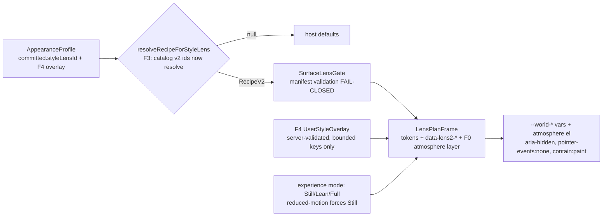
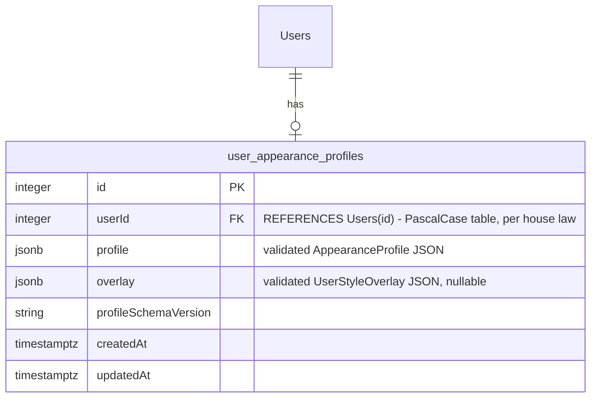
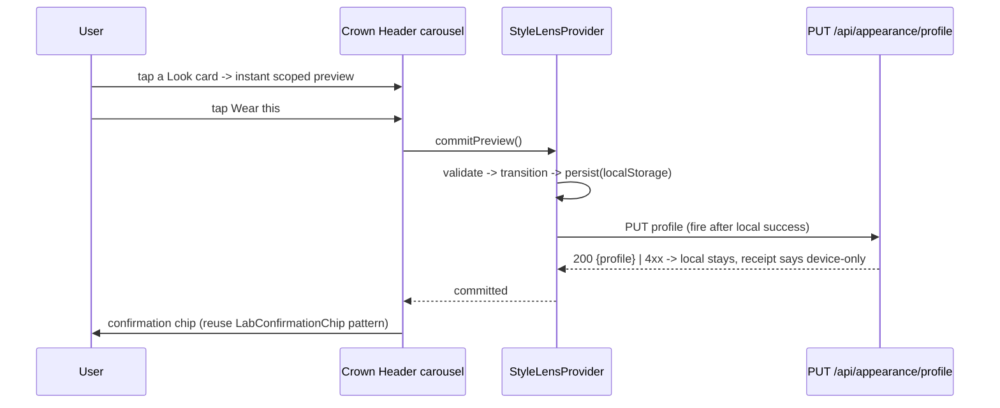

# 01 — ARCHITECTURE

## 1. Current-state weaknesses (verified 2026-07-14) that this program fixes

1. **Device-local identity.** Appearance state persists in `localStorage` only
   (`core/style-lens-os/StyleLensProvider.tsx:73` — `storage = window.localStorage`; no
   `/api/appearance/*` route exists in `backend/routes/`). Your look does not follow you. → F1.
2. **No user-facing surface.** The only lens surface is the admin Lab route
   (`/dashboard/admin/workout-design-lab`). Regular users never discover styles. → F2.
3. **Thin v2 promise.** 2 of 25 catalog styles are full restyles; 23 are chrome trims. Honesty
   labels exist (Lens pack A3) but the wardrobe is thin. → F5 adds 6 world-distilled v2 styles.
4. **Production inertness.** `adapters/style-lens-swan/v2/recipeResolution.ts` maps every catalog
   id → null on the six production surfaces (deliberate; the "successor decision"). Sean has now
   made that decision: roll out. → F3.
5. **No atmosphere axis.** Recipes restyle components but not the page's air — the thing that makes
   Worlds feel alive (BG/MID/WEATHER layers in `design-brain/worlds.md` atmosphere recipes). → F0.
6. **Chart secondary is Swan-fixed** because `--world-action` failed contrast (~1.3:1). The
   sanctioned path named in the Lens pack — a dedicated `--world-chart-secondary` token — was
   explicitly out of that pack's scope. → F0 ships it.
7. **No personalization / no tier value.** One committed style per browser; nothing for
   Guardian/Crystalline tiers to own. → F4 (tier-gated Style Studio).
8. **Gate bypass hook** (Lens audit record §10): a recipe without a `catalogV2Map.ts` entry escapes
   the five-gate suite. → F6 completeness assertion.
9. **Experience modes are binary.** Only `prefers-reduced-motion` exists; the World Engine's
   Full/Lean/Still ladder has no product-side representation. → F0 maps it into the appearance
   profile (`motionMode` exists there already: `'auto'` today).

## 2. System overview (the two organs + the bridge)

```mermaid
flowchart TD
    subgraph WORLD ENGINE — imagination, marketing lane, UNTOUCHED
      W[worlds.md 18 worlds<br/>palette laws A/B, atmosphere recipes]
      T[techniques.md WFX-01..13]
      X[experience-mode.md M0-M4 + Full/Lean/Still]
      FACT[swan-world-factory skill<br/>marketing concepts, local proofs]
    end
    subgraph BRIDGE — the baby
      D[F5 distill step: world -> RECIPE SEED JSON<br/>Law-A translation, M2 ceiling, poster-first]
      TASTE[Fable taste pass<br/>seed -> final RecipeV2 + atmosphere tokens]
    end
    subgraph LENS OS — delivery, product runtime
      R[RecipeV2 + atmosphere axis F0]
      CAT[A4 five-entry pipeline<br/>LENS-ADD-A-STYLE.md]
      FRAME[LensPlanFrame / makeLensFrame surfaces]
      PROF[Appearance profile<br/>localStorage + F1 server]
      STUDIO[F4 Style Studio overlay<br/>bounded knobs, tier-gated]
      CROWN[F2 Crown Header + carousel]
    end
    W --> D --> TASTE --> CAT --> R --> FRAME
    X -->|Full/Lean/Still law| R
    PROF --> FRAME
    STUDIO --> PROF
    CROWN --> PROF
```

Law: nothing flows RIGHT-to-LEFT. The Lens never imports factory runtime; the factory never reads
product data. The bridge is data (JSON seeds) + human taste, not code coupling.

## 3. Runtime data flow (per surface, after F0–F4)



Overlay precedence (exact): host fallback < recipe token < overlay token (only for the bounded
keys in `03-contracts.md §4`). Overlay NEVER introduces keys outside the bounded set — the server
rejects, and the client compiler drops, unknown keys (fail-closed both ends).

## 4. Persistence ERD (F1)



One row per user (unique index on `userId`). `profile` carries the same shape the client already
persists locally (`profileSchemaVersion, paletteThemeId, styleLensId, motionMode, density,
updatedAt`). Server is authoritative when logged in; localStorage remains the offline/anonymous
fallback and the write-through cache. Conflict rule: newest `updatedAt` wins; ties → server.

## 5. Apply sequence (F1+F2)



Offline/failed PUT NEVER rolls back the local commit — the receipt copy tells the truth
("Saved on this device — will sync when you're back online.", exact copy in `02-wireframes.md`).

## 6. Experience-mode mapping (F0 — product-side law)

| Profile `motionMode` | Meaning in product | Atmosphere behavior |
|---|---|---|
| `auto` (default) | Full unless signals say otherwise | animated layers allowed within M2 caps |
| `lean` | low-power / user choice | static layers only, no continuous loops, grain ok |
| `still` | user choice or `prefers-reduced-motion` | single static poster layer, zero motion |

`prefers-reduced-motion: reduce` ALWAYS forces `still` regardless of profile (media query wins in
CSS; runtime checks `matchMedia` before starting any loop). M2 caps for any animated atmosphere
layer in product: CSS/transform-opacity only, ≤2 moving layers, no scroll-hijack, no canvas/WebGL,
no autoplay video, poster-first. These are the World Engine's product-surface ceilings — the
firewall (`experience-mode.md` §3) is restated verbatim in `06-bans.md`.

## 7. What deliberately does NOT change

- The marketing/factory lane (`swan-world-factory`, M4 licensing, proof sites) — untouched.
- The PUBLIC HOMEPAGE and all marketing pages — excluded from lens rollout (Sean's call; the
  homepage is the factory's canvas, not the lens's).
- Hermes surfaces — never lens-aware (M1 Cyberforest law).
- Storefront/checkout/billing/auth/onboarding — Law A calm surfaces; NO atmosphere layer in F0-F6
  (may be revisited later by Sean; out of scope now).
- The six lens slots, `LensPlanFrame`'s fail-closed compile, `styleLensBoundary` core purity.
